# The Swinging Door - studio report, 2026-09-04

Built for Rick. Every image the studio generated today, in the order it happened, with the ask that drove it, the thinking behind the decision, the exact prompt and settings, and the verdict. Images are in `images/`, prompts in `prompts/`.

## 001. comparison-sheet-base-sheet

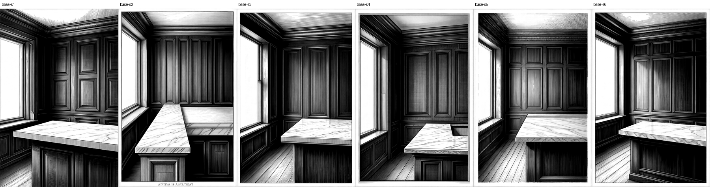

**The thinking.** Candidates side by side; the pick is made by eye against the founder's notes.

*Logged 11:19.*

---

## 002. comparison-sheet-b2-sheet

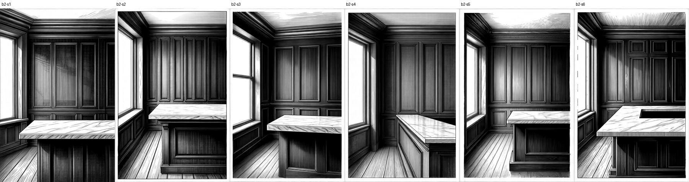

**The thinking.** Candidates side by side; the pick is made by eye against the founder's notes.

*Logged 11:19.*

---

## 003. comparison-sheet-strip-sheet

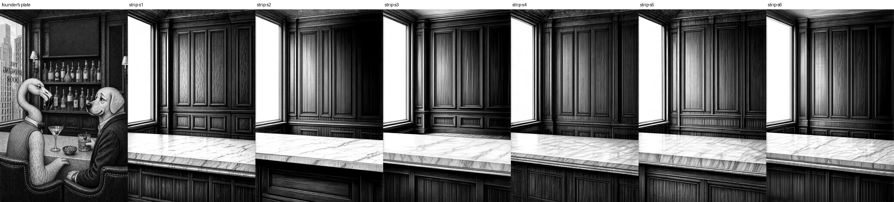

**The thinking.** Candidates side by side; the pick is made by eye against the founder's notes.

*Logged 11:19.*

---

## 004. comparison-sheet-pan-sheet

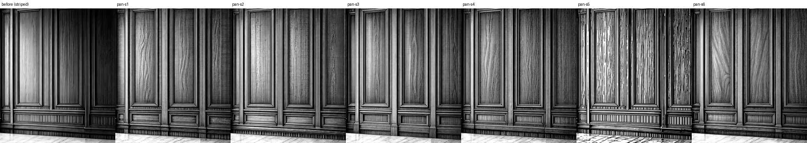

**The thinking.** Candidates side by side; the pick is made by eye against the founder's notes.

*Logged 11:19.*

---

## 005. comparison-sheet-val-sheet

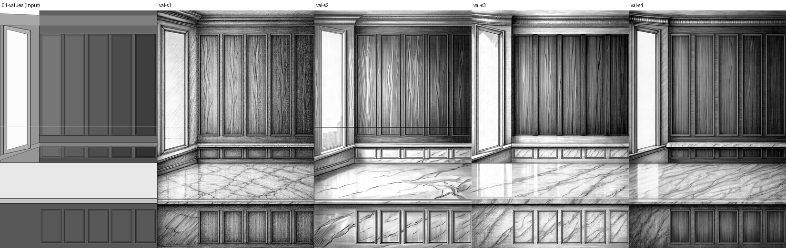

**The thinking.** Candidates side by side; the pick is made by eye against the founder's notes.

*Logged 11:19.*

---

## 006. comparison-sheet-v2-sheet

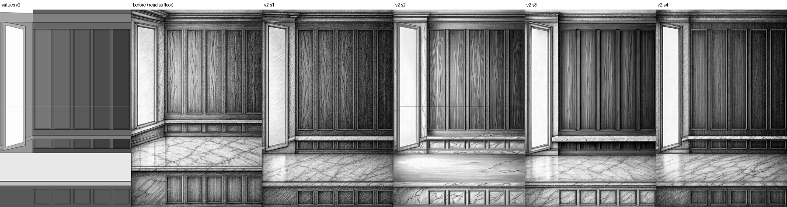

**The thinking.** Candidates side by side; the pick is made by eye against the founder's notes.

*Logged 11:19.*

---

## 007. comparison-sheet-v3-sheet

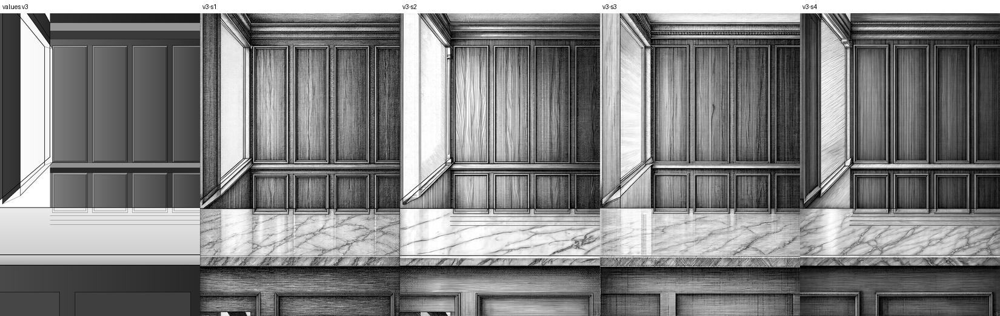

**The thinking.** Candidates side by side; the pick is made by eye against the founder's notes.

*Logged 11:19.*

---

## 008. comparison-sheet-cam-sheet

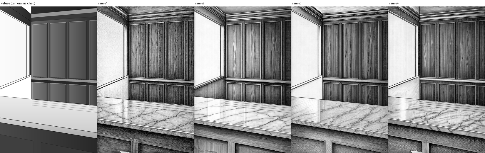

**The thinking.** Candidates side by side; the pick is made by eye against the founder's notes.

*Logged 11:19.*

---

## 009. four-seeds-crown-moulding-taller-wall-pulled-back

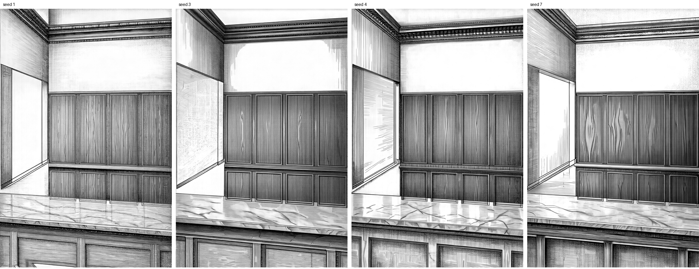

**The ask.** Show the crown and the taller wall.

**The thinking.** Four seeds from the same value drawing; the crown is drawn as a stacked profile so it renders as carved timber rather than a painted stripe.

**Prompt.** [prompts/009-four-seeds-crown-moulding-taller-wall-pulled-back.prompt.txt](prompts/009-four-seeds-crown-moulding-taller-wall-pulled-back.prompt.txt)

**Verdict.** The founder chose seed 4's crown.

*Logged 11:19.*

---

## 010. seed-4-full-plate-crown-moulding-tall-wall

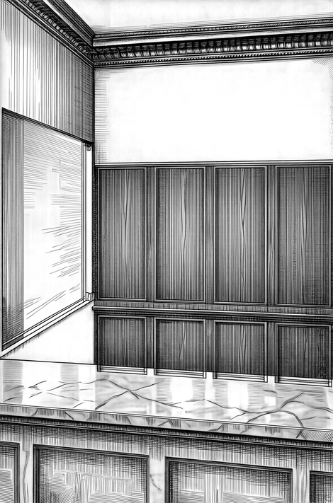

**The thinking.** The seed the founder picked for its crown.

**Prompt.** [prompts/010-seed-4-full-plate-crown-moulding-tall-wall.prompt.txt](prompts/010-seed-4-full-plate-crown-moulding-tall-wall.prompt.txt)

*Logged 11:19.*

---

## 011. four-seeds-panelling-to-ceiling-three-tiers-window-wall-dark

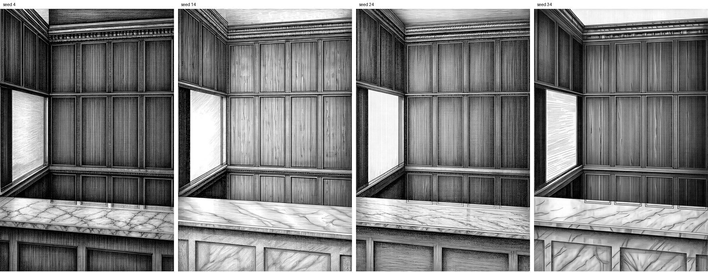

**The ask.** Panelling to the roof; fix the wall tone.

**The thinking.** Full-height panelling has to be tiered or the panels become 2.6 m doors. The window wall is panelled and darkened: a large flat field is exactly what the model bleaches to paper.

**Prompt.** [prompts/011-four-seeds-panelling-to-ceiling-three-tiers-window-wall-dark.prompt.txt](prompts/011-four-seeds-panelling-to-ceiling-three-tiers-window-wall-dark.prompt.txt)

**Verdict.** Wall tone held on every seed.

*Logged 11:19.*

---

## 012. progression-reeded-panels-then-grain-drawn-then-levels-lifted

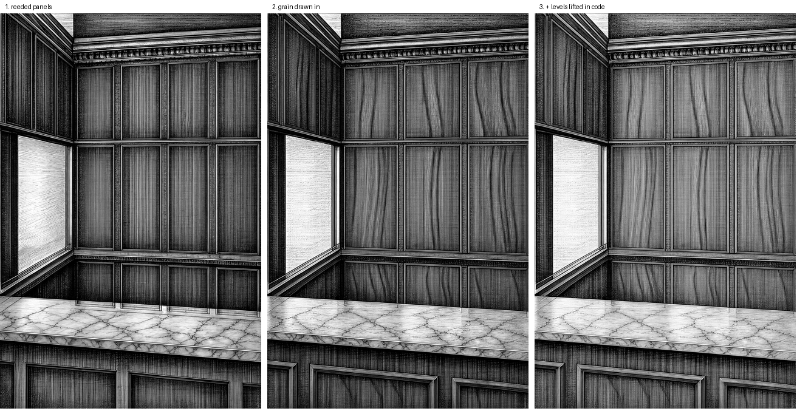

**The thinking.** Four seeds of prompt bans did not stop the reeding, so the grain was drawn into the values instead; then the level was corrected in code, because the values dictate structure but not overall brightness.

**Prompt.** [prompts/012-progression-reeded-panels-then-grain-drawn-then-levels-lifted.prompt.txt](prompts/012-progression-reeded-panels-then-grain-drawn-then-levels-lifted.prompt.txt)

*Logged 11:19.*

---

## 013. full-plate-walnut-grain-drawn-levels-lifted-seed-4

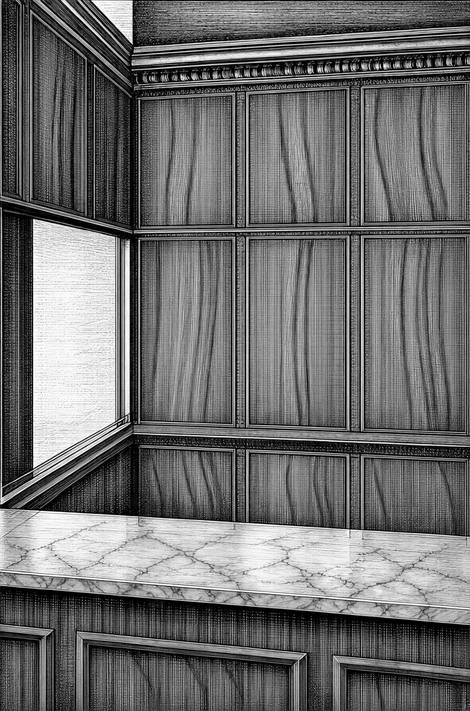

**Prompt.** [prompts/013-full-plate-walnut-grain-drawn-levels-lifted-seed-4.prompt.txt](prompts/013-full-plate-walnut-grain-drawn-levels-lifted-seed-4.prompt.txt)

*Logged 11:19.*

---

## 014. comparison-sheet-fixtures-sheet

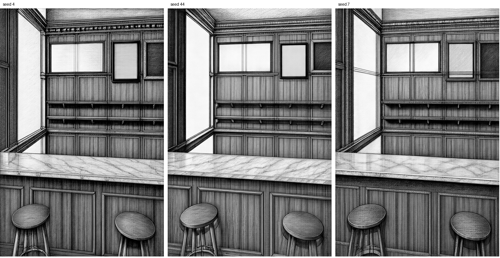

**The thinking.** Candidates side by side; the pick is made by eye against the founder's notes.

*Logged 11:19.*

---

## 015. full-plate-first-fixtures-shelves-television-chalkboard-stools-seed-4

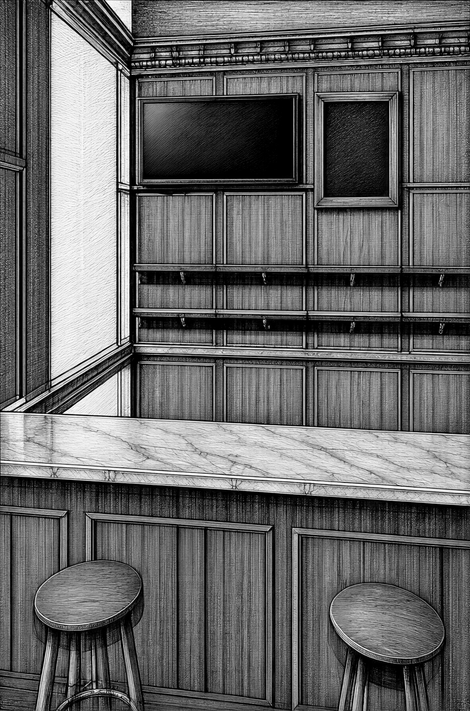

**The ask.** Add two shelves, the TV and chalkboard places, and chairs at the bar.

**The thinking.** Fixtures are drawn in metres like the joinery, so the TV and the board come out as measured quads for the joke to paste into.

**Prompt.** [prompts/015-full-plate-first-fixtures-shelves-television-chalkboard-stools-seed-4.prompt.txt](prompts/015-full-plate-first-fixtures-shelves-television-chalkboard-stools-seed-4.prompt.txt)

*Logged 11:19.*

---

## 016. full-plate-first-fixtures-seed-44

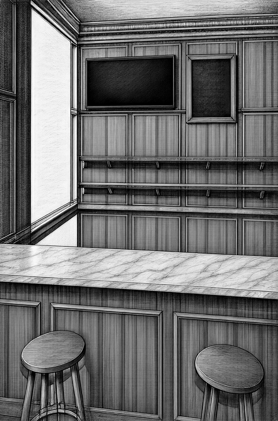

**Prompt.** [prompts/016-full-plate-first-fixtures-seed-44.prompt.txt](prompts/016-full-plate-first-fixtures-seed-44.prompt.txt)

*Logged 11:19.*

---

## 017. comparison-sheet-streetneg

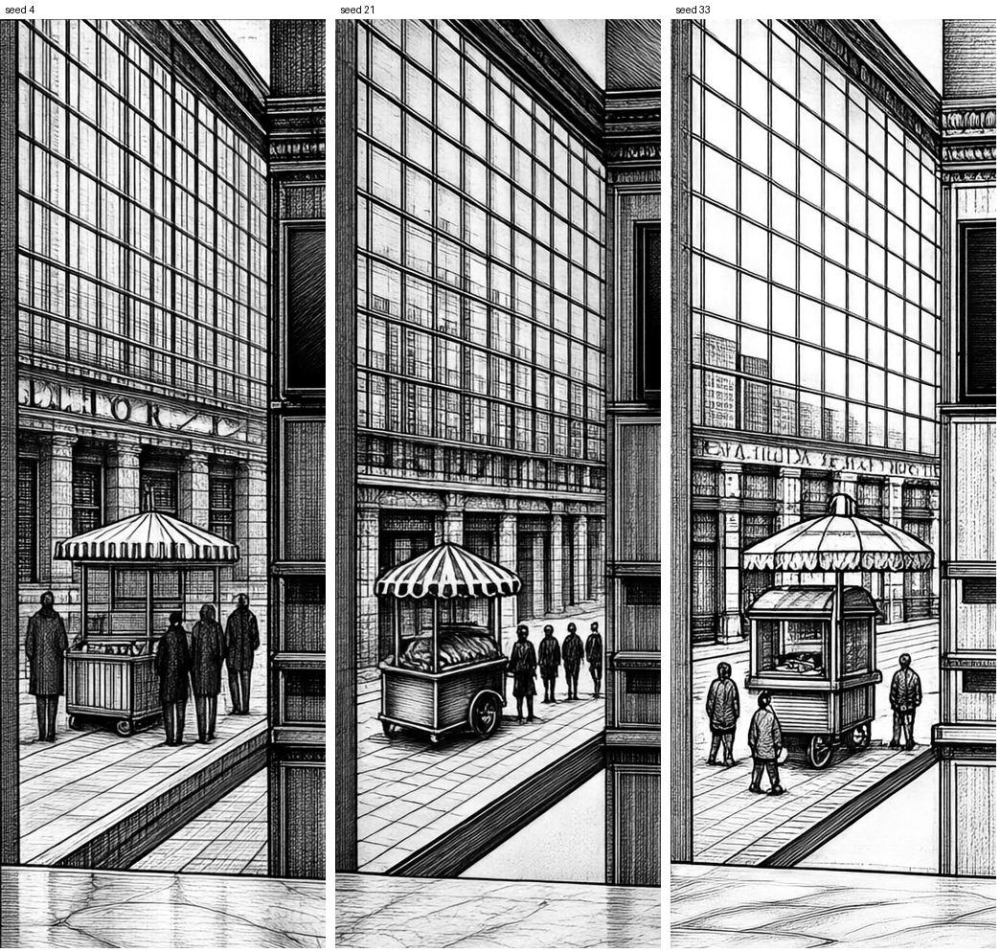

**The thinking.** Candidates side by side; the pick is made by eye against the founder's notes.

*Logged 11:19.*

---

## 018. full-plate-street-hot-dog-stand-and-mirrored-gilded-sign

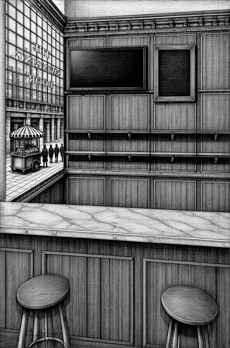

**The ask.** The Swinging Door mirrored sign and a hot dog stand with people outside.

**The thinking.** The street is a part rendered through the window outline only; the sign is typeset and gilded in code, warped onto the glass, and runs last because any later repaint wipes it.

**Prompt.** [prompts/018-full-plate-street-hot-dog-stand-and-mirrored-gilded-sign.prompt.txt](prompts/018-full-plate-street-hot-dog-stand-and-mirrored-gilded-sign.prompt.txt)

*Logged 11:19.*

---

## 019. window-close-up-mirrored-sign-street-hot-dog-cart-people

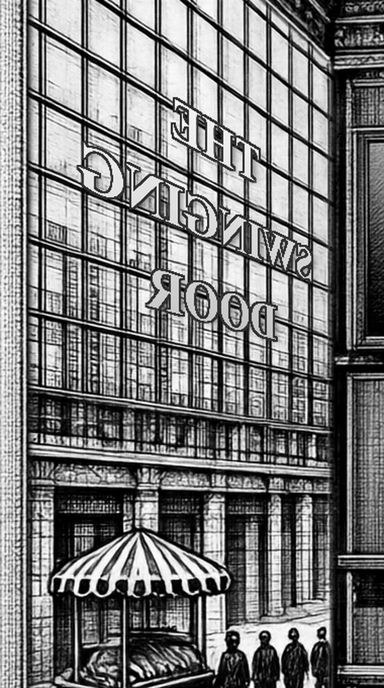

**Prompt.** [prompts/019-window-close-up-mirrored-sign-street-hot-dog-cart-people.prompt.txt](prompts/019-window-close-up-mirrored-sign-street-hot-dog-cart-people.prompt.txt)

*Logged 11:19.*

---

## 020. construction-value-drawing-walls-crown-counter-window

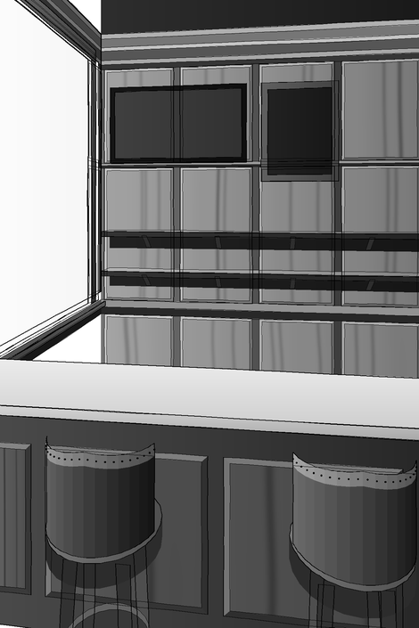

**The ask.** Pull back, wall higher, crown moulding, realistic and square.

**The thinking.** The room is drawn in metres and projected through one camera; every surface carries the tone it must hold. This is the conditioning image, not art.

*Logged 11:19.*

---

## 021. side-view-camera-right-seven-degree-pan-club-chairs-framed-window

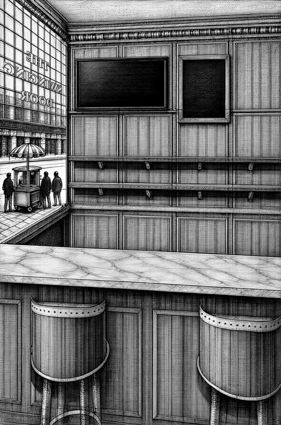

**The ask.** Angle at the side, TV and board square, classy chairs with backs, a window that looks like a window.

**The thinking.** From the founder's reference plates: a one-point view from a side position, not the two-point view aimed at the corner.

**Prompt.** [prompts/021-side-view-camera-right-seven-degree-pan-club-chairs-framed-window.prompt.txt](prompts/021-side-view-camera-right-seven-degree-pan-club-chairs-framed-window.prompt.txt)

*Logged 11:19.*

---

## 022. window-close-up-side-view-architrave-sill-sheen-sign

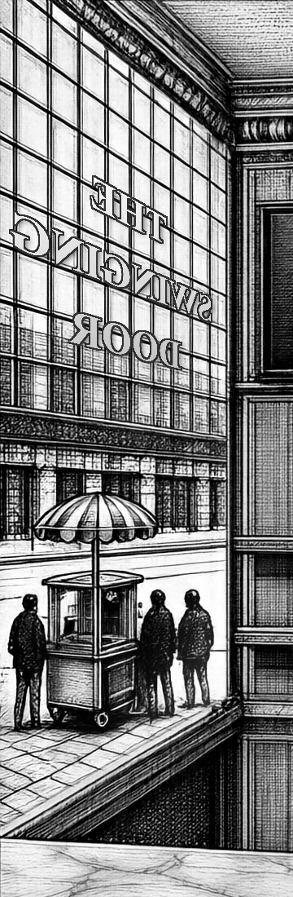

**Prompt.** [prompts/022-window-close-up-side-view-architrave-sill-sheen-sign.prompt.txt](prompts/022-window-close-up-side-view-architrave-sill-sheen-sign.prompt.txt)

*Logged 11:19.*

---

## 023. part-masks-colour-coded-one-region-per-part

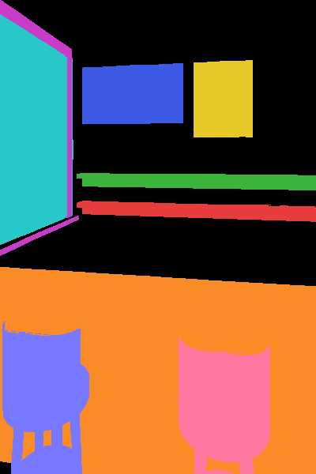

**The thinking.** Each colour is one independently re-rollable region.

*Logged 11:19.*

---

## 024. back-bar-upper-shelf-seed-7-raw-render

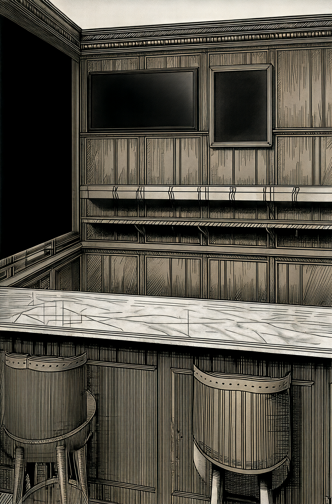

**The thinking.** The model's full-plate output for this part before it is cut by the mask.

**Prompt.** [prompts/024-back-bar-upper-shelf-seed-7-raw-render.prompt.txt](prompts/024-back-bar-upper-shelf-seed-7-raw-render.prompt.txt)

*Logged 11:19.*

---

## 025. back-bar-upper-shelf-seed-7-laid-in-full-plate

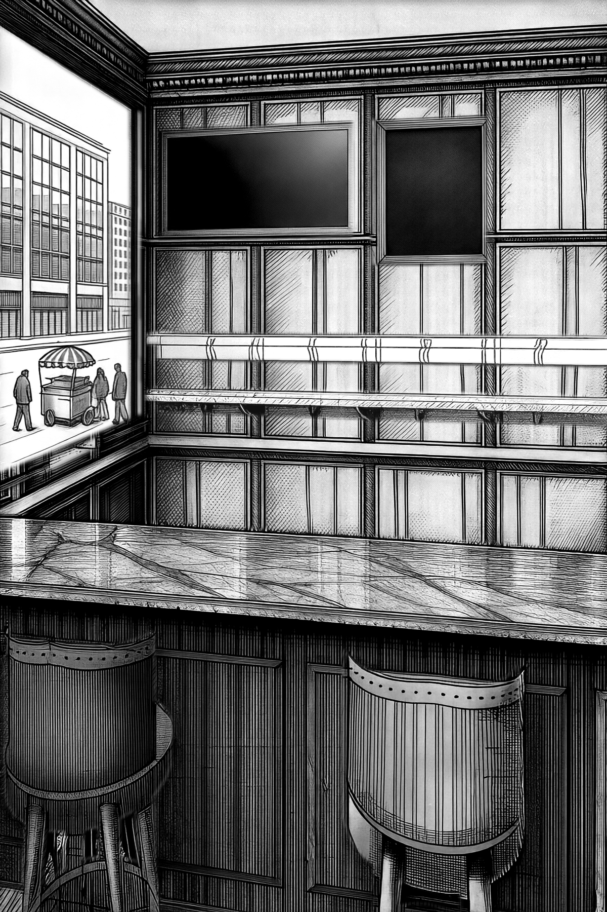

**The thinking.** Rendered in context: the plate as it stood behind this part, with only this part's own silhouette blocked in as flat values, so the pen, the light and the perspective are inherited from its neighbours; only the part's mask is laid back. Nothing else in the picture moves.

**Prompt.** [prompts/025-back-bar-upper-shelf-seed-7-laid-in-full-plate.prompt.txt](prompts/025-back-bar-upper-shelf-seed-7-laid-in-full-plate.prompt.txt)

*Logged 11:19.*

---

## 026. back-bar-upper-shelf-seed-21-raw-render

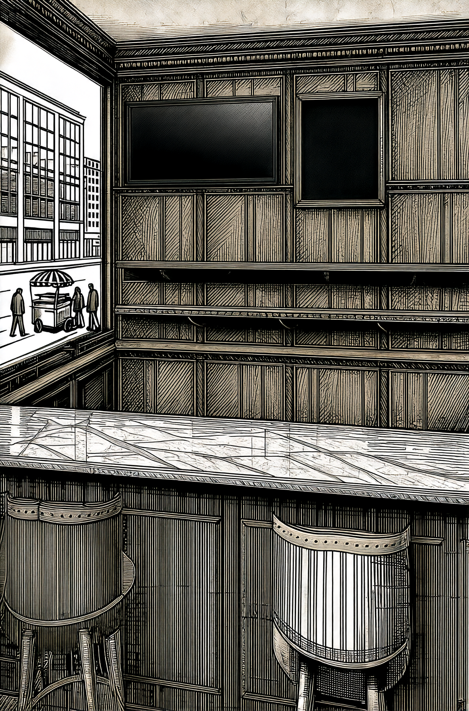

**The thinking.** The model's full-plate output for this part before it is cut by the mask.

**Prompt.** [prompts/026-back-bar-upper-shelf-seed-21-raw-render.prompt.txt](prompts/026-back-bar-upper-shelf-seed-21-raw-render.prompt.txt)

*Logged 11:19.*

---

## 027. back-bar-upper-shelf-seed-21-laid-in-full-plate

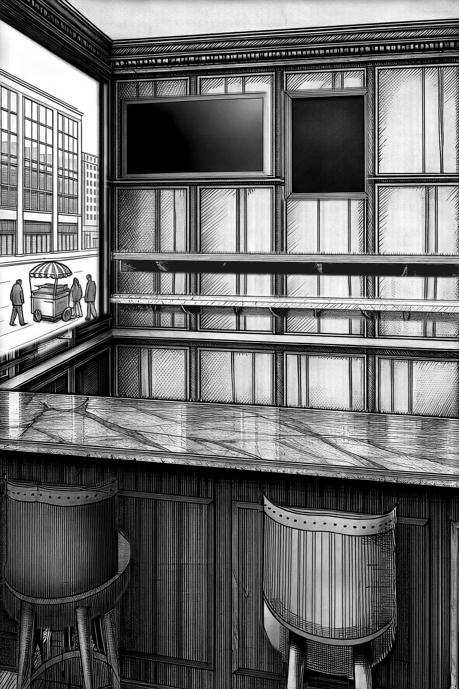

**The thinking.** Rendered in context: the plate as it stood behind this part, with only this part's own silhouette blocked in as flat values, so the pen, the light and the perspective are inherited from its neighbours; only the part's mask is laid back. Nothing else in the picture moves.

**Prompt.** [prompts/027-back-bar-upper-shelf-seed-21-laid-in-full-plate.prompt.txt](prompts/027-back-bar-upper-shelf-seed-21-laid-in-full-plate.prompt.txt)

*Logged 11:19.*

---

## 028. whole-plate-assembled-base-plus-nine-parts-modular

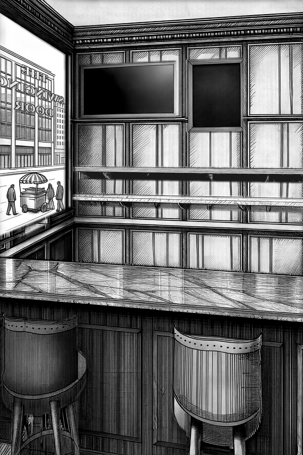

**The ask.** Make it modular so each object can be perfected independently.

**The thinking.** The construction stamps every pixel with its part; each part is rendered against the finished plate and laid back through its mask. Re-roll one and nothing else moves.

**Prompt.** [prompts/028-whole-plate-assembled-base-plus-nine-parts-modular.prompt.txt](prompts/028-whole-plate-assembled-base-plus-nine-parts-modular.prompt.txt)

*Logged 11:19.*

---

## 029. chairs-close-up-club-chairs-at-standing-eye-height

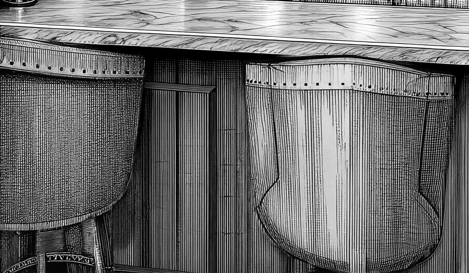

**Prompt.** [prompts/029-chairs-close-up-club-chairs-at-standing-eye-height.prompt.txt](prompts/029-chairs-close-up-club-chairs-at-standing-eye-height.prompt.txt)

*Logged 11:19.*

---

## 030. whole-plate-eye-lowered-to-170cm-chair-backs-read-side-on

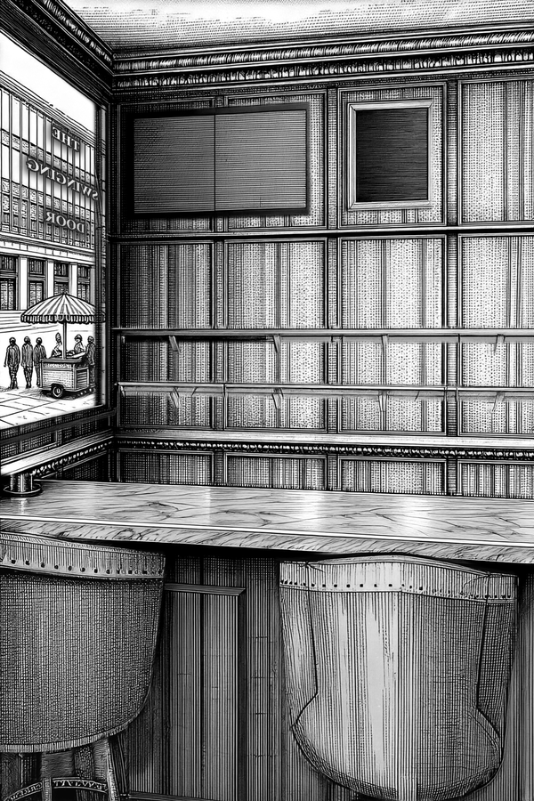

**The ask.** The chairs looked weird.

**The thinking.** At a 2.05 m eye you look down into any wraparound back and it reads as a bucket; at a standing eye the backs are seen side-on, as in the reference.

**Prompt.** [prompts/030-whole-plate-eye-lowered-to-170cm-chair-backs-read-side-on.prompt.txt](prompts/030-whole-plate-eye-lowered-to-170cm-chair-backs-read-side-on.prompt.txt)

*Logged 11:19.*

---

## 031. back-bar-first-pass-with-bottles

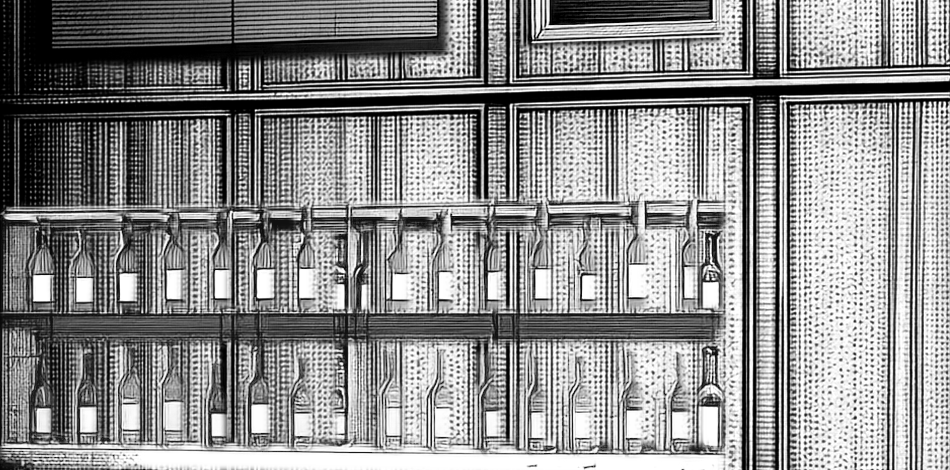

**The ask.** Focus on the shelves.

**Prompt.** [prompts/031-back-bar-first-pass-with-bottles.prompt.txt](prompts/031-back-bar-first-pass-with-bottles.prompt.txt)

*Logged 11:19.*

---

## 032. bottles-on-lower-shelf-seed-4-raw-render

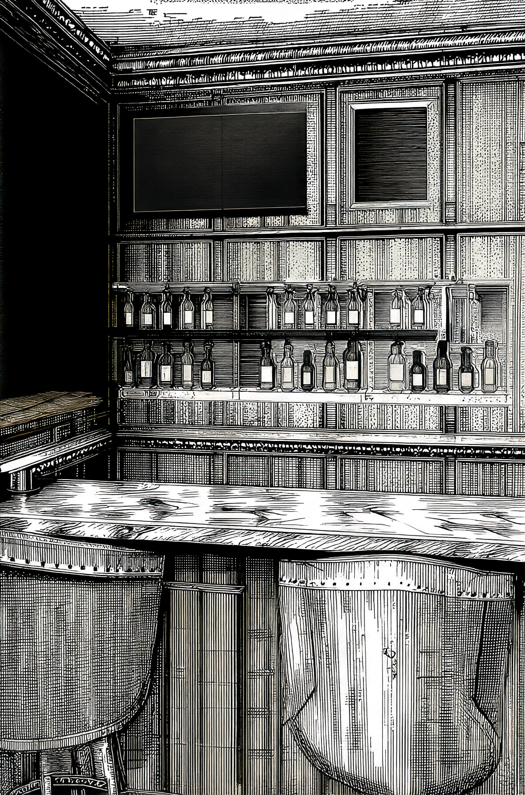

**The thinking.** The model's full-plate output for this part before it is cut by the mask.

**Prompt.** [prompts/032-bottles-on-lower-shelf-seed-4-raw-render.prompt.txt](prompts/032-bottles-on-lower-shelf-seed-4-raw-render.prompt.txt)

*Logged 11:19.*

---

## 033. bottles-on-lower-shelf-seed-4-laid-in-full-plate

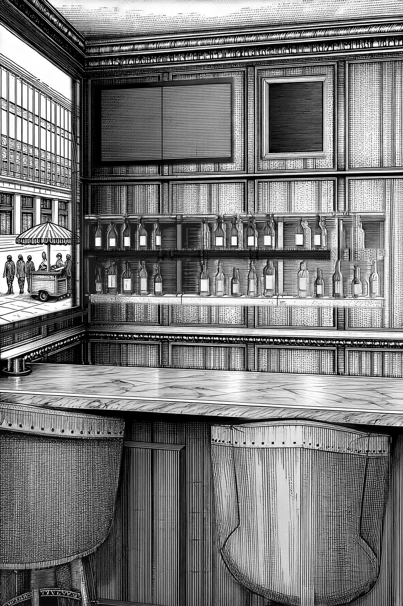

**The thinking.** Rendered in context: the plate as it stood behind this part, with only this part's own silhouette blocked in as flat values, so the pen, the light and the perspective are inherited from its neighbours; only the part's mask is laid back. Nothing else in the picture moves.

**Prompt.** [prompts/033-bottles-on-lower-shelf-seed-4-laid-in-full-plate.prompt.txt](prompts/033-bottles-on-lower-shelf-seed-4-laid-in-full-plate.prompt.txt)

*Logged 11:19.*

---

## 034. bottles-on-upper-shelf-seed-4-raw-render

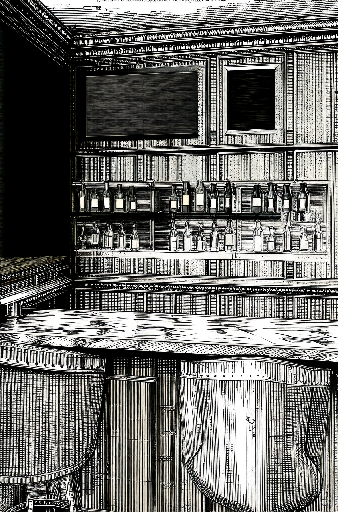

**The thinking.** The model's full-plate output for this part before it is cut by the mask.

**Prompt.** [prompts/034-bottles-on-upper-shelf-seed-4-raw-render.prompt.txt](prompts/034-bottles-on-upper-shelf-seed-4-raw-render.prompt.txt)

*Logged 11:19.*

---

## 035. bottles-on-upper-shelf-seed-4-laid-in-full-plate

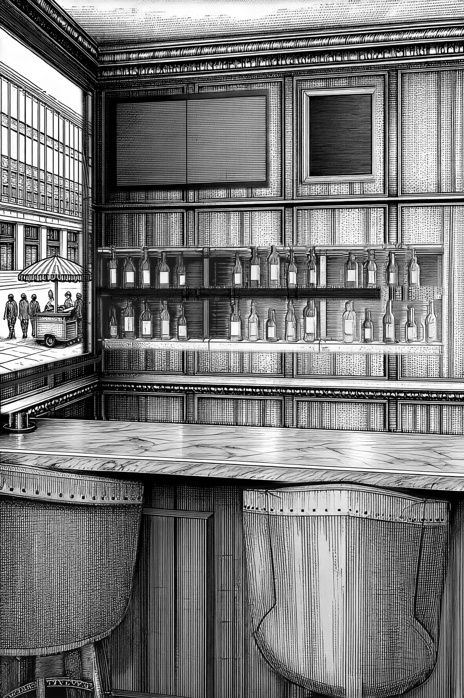

**The thinking.** Rendered in context: the plate as it stood behind this part, with only this part's own silhouette blocked in as flat values, so the pen, the light and the perspective are inherited from its neighbours; only the part's mask is laid back. Nothing else in the picture moves.

**Prompt.** [prompts/035-bottles-on-upper-shelf-seed-4-laid-in-full-plate.prompt.txt](prompts/035-bottles-on-upper-shelf-seed-4-laid-in-full-plate.prompt.txt)

*Logged 11:19.*

---

## 036. back-bar-cabinet-dark-recessed-back-bottles-in-four-profiles

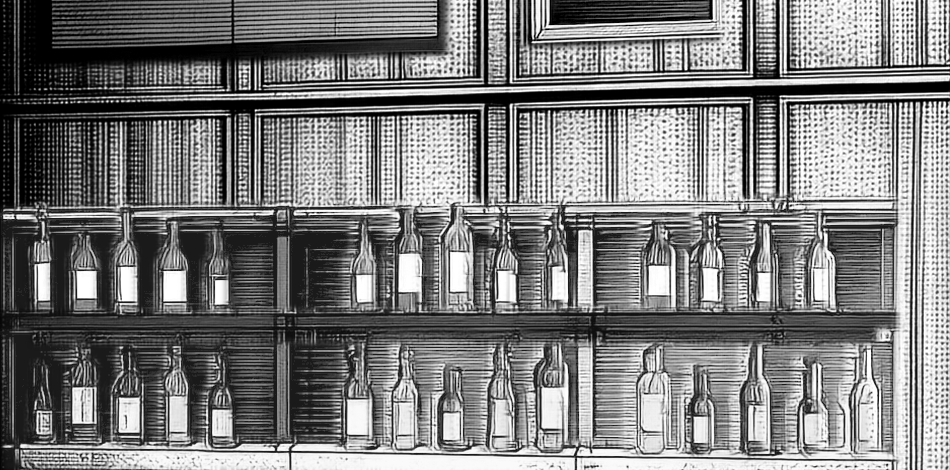

**The thinking.** A cabinet with a dark back: bottles against the wall's panelling fought its stripes; against a dark ground they read at once.

**Prompt.** [prompts/036-back-bar-cabinet-dark-recessed-back-bottles-in-four-profiles.prompt.txt](prompts/036-back-bar-cabinet-dark-recessed-back-bottles-in-four-profiles.prompt.txt)

*Logged 11:19.*

---

## 037. whole-plate-empty-shelves-sill-lip-removed-sash-window

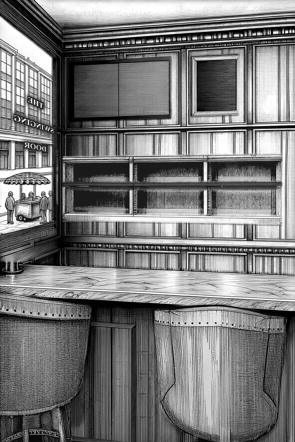

**The ask.** No bottles yet; remove the lip under the window; the window must feel like a window.

**The thinking.** A sash frame set back into the reveal; the street levelled high-key and softened behind glass; the projecting sill board removed.

**Prompt.** [prompts/037-whole-plate-empty-shelves-sill-lip-removed-sash-window.prompt.txt](prompts/037-whole-plate-empty-shelves-sill-lip-removed-sash-window.prompt.txt)

*Logged 11:19.*

---

## 038. whole-plate-lit-back-bar-gilded-sign-leather-chairs

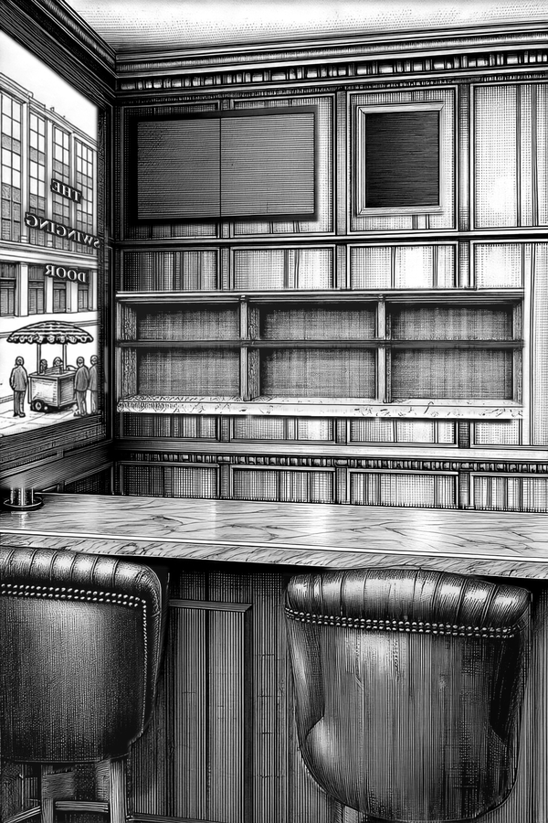

**The ask.** Improve the shelves' lighting, the sign and the chairs.

**Prompt.** [prompts/038-whole-plate-lit-back-bar-gilded-sign-leather-chairs.prompt.txt](prompts/038-whole-plate-lit-back-bar-gilded-sign-leather-chairs.prompt.txt)

*Logged 11:19.*

---

## 039. base-walls-crown-floor-seed-4-raw-render

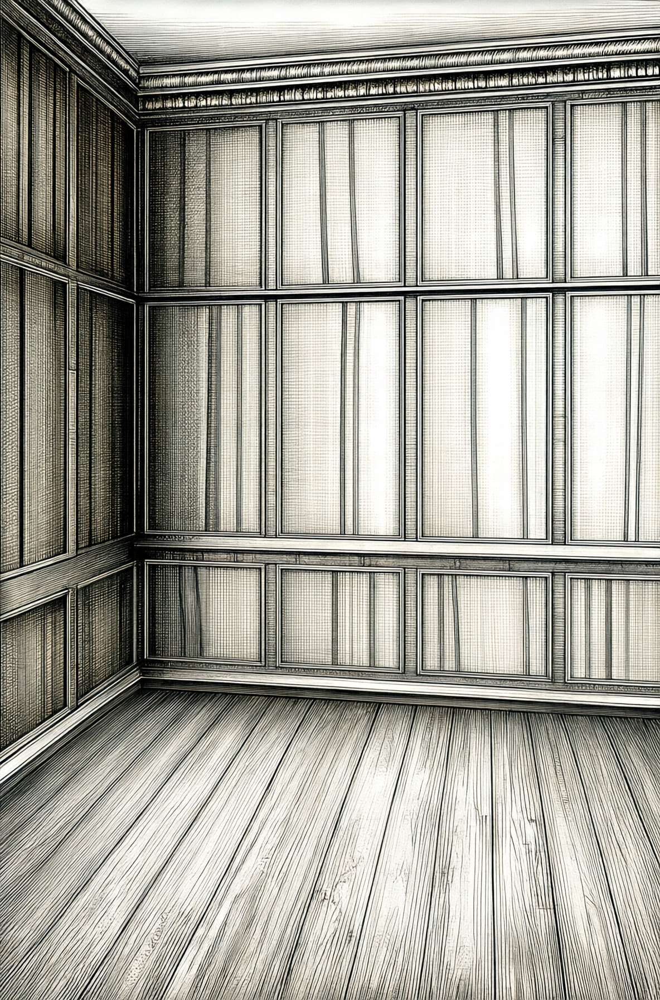

**The thinking.** The model's full-plate output for this part before it is cut by the mask.

**Prompt.** [prompts/039-base-walls-crown-floor-seed-4-raw-render.prompt.txt](prompts/039-base-walls-crown-floor-seed-4-raw-render.prompt.txt)

*Logged 11:19.*

---

## 040. base-walls-crown-floor-seed-4-levelled-preview

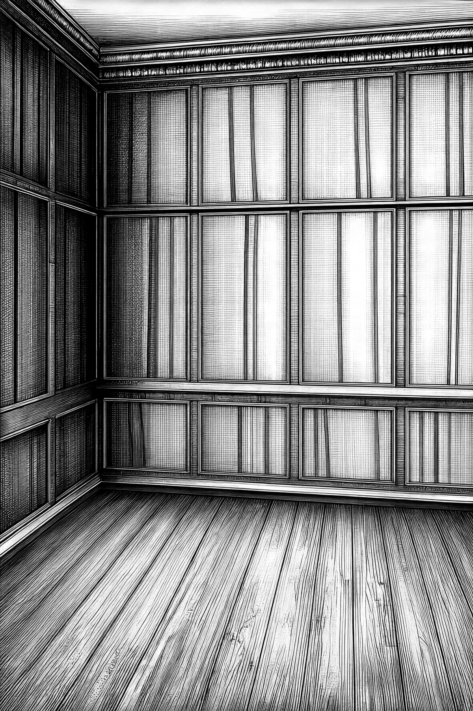

**The thinking.** Rendered in context: the plate as it stood behind this part, with only this part's own silhouette blocked in as flat values, so the pen, the light and the perspective are inherited from its neighbours; only the part's mask is laid back. Nothing else in the picture moves.

**Prompt.** [prompts/040-base-walls-crown-floor-seed-4-levelled-preview.prompt.txt](prompts/040-base-walls-crown-floor-seed-4-levelled-preview.prompt.txt)

*Logged 11:19.*

---

## 041. comparison-sheet-base-sweep

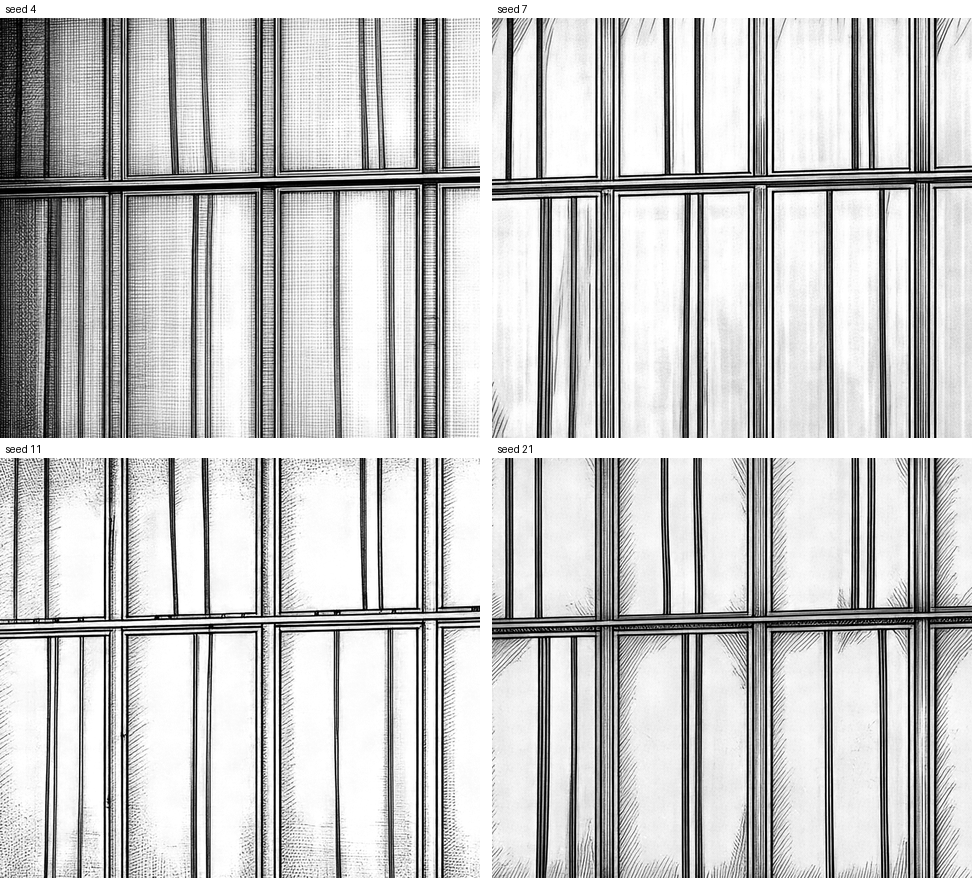

**The thinking.** Candidates side by side; the pick is made by eye against the founder's notes.

*Logged 11:19.*

---

## 042. comparison-sheet-base-sweep2

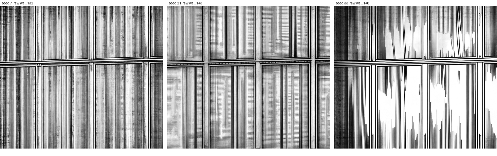

**The thinking.** Candidates side by side; the pick is made by eye against the founder's notes.

*Logged 11:19.*

---

## 043. whole-plate-wall-lamps-with-light-pools-on-panelling

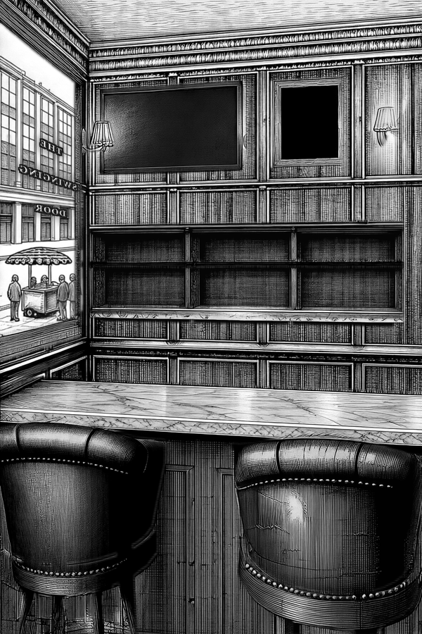

**The ask.** Improve the lamps and make their lighting correct.

**The thinking.** A light field: for each lamp an upward fan and a downward cone falling off with distance, multiplied over the values so every part rendered afterwards inherits it.

**Prompt.** [prompts/043-whole-plate-wall-lamps-with-light-pools-on-panelling.prompt.txt](prompts/043-whole-plate-wall-lamps-with-light-pools-on-panelling.prompt.txt)

*Logged 11:19.*

---

## 044. window-close-up-gilded-sign-block-shade-bevel

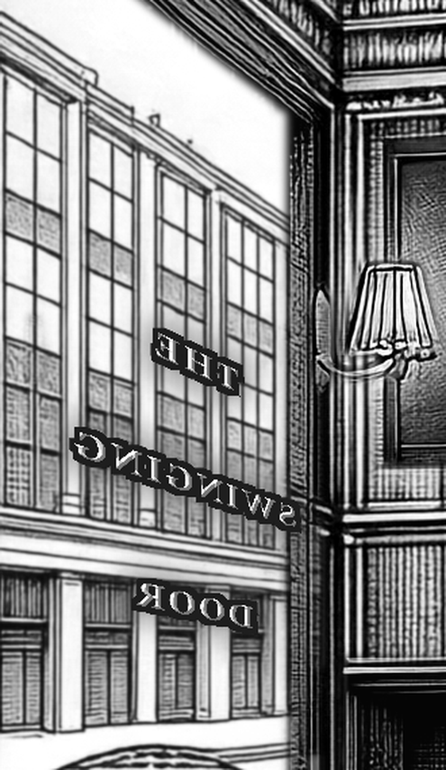

**Prompt.** [prompts/044-window-close-up-gilded-sign-block-shade-bevel.prompt.txt](prompts/044-window-close-up-gilded-sign-block-shade-bevel.prompt.txt)

*Logged 11:19.*

---

## 045. comparison-sheet-sign-variants

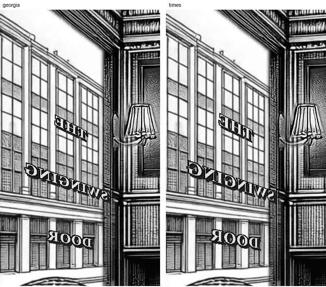

**The thinking.** Candidates side by side; the pick is made by eye against the founder's notes.

*Logged 11:19.*

---

## 046. window-sign-redone-one-outline-small-shade-light-leaf

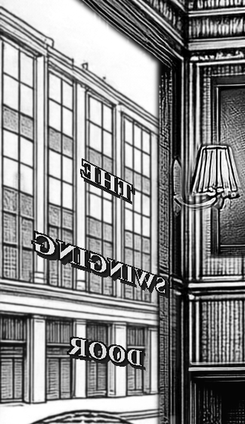

**The ask.** The sign looks terrible.

**The thinking.** Four stacked effects at 230 px turned the letters to mud; one crisp outline, a small shade, worked at 4x and warped once.

*Logged 11:19.*

---

## 047. wall-lamp-left-seed-4-raw-render

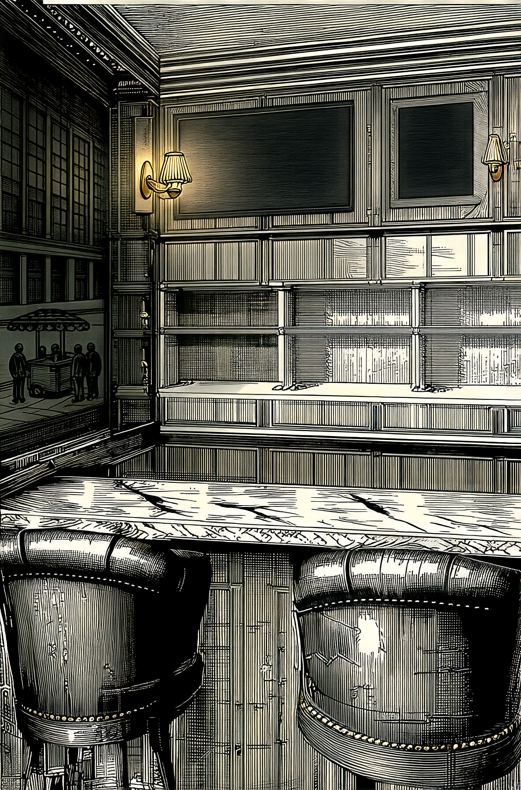

**The thinking.** The model's full-plate output for this part before it is cut by the mask.

**Prompt.** [prompts/047-wall-lamp-left-seed-4-raw-render.prompt.txt](prompts/047-wall-lamp-left-seed-4-raw-render.prompt.txt)

*Logged 11:19.*

---

## 048. wall-lamp-left-seed-4-laid-in-full-plate

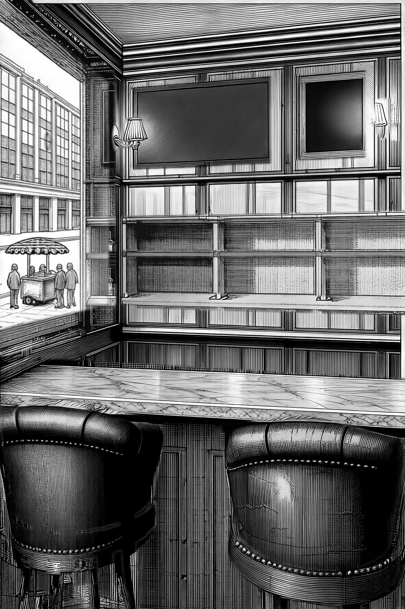

**The thinking.** Rendered in context: the plate as it stood behind this part, with only this part's own silhouette blocked in as flat values, so the pen, the light and the perspective are inherited from its neighbours; only the part's mask is laid back. Nothing else in the picture moves.

**Prompt.** [prompts/048-wall-lamp-left-seed-4-laid-in-full-plate.prompt.txt](prompts/048-wall-lamp-left-seed-4-laid-in-full-plate.prompt.txt)

*Logged 11:19.*

---

## 049. wall-lamp-right-seed-4-raw-render

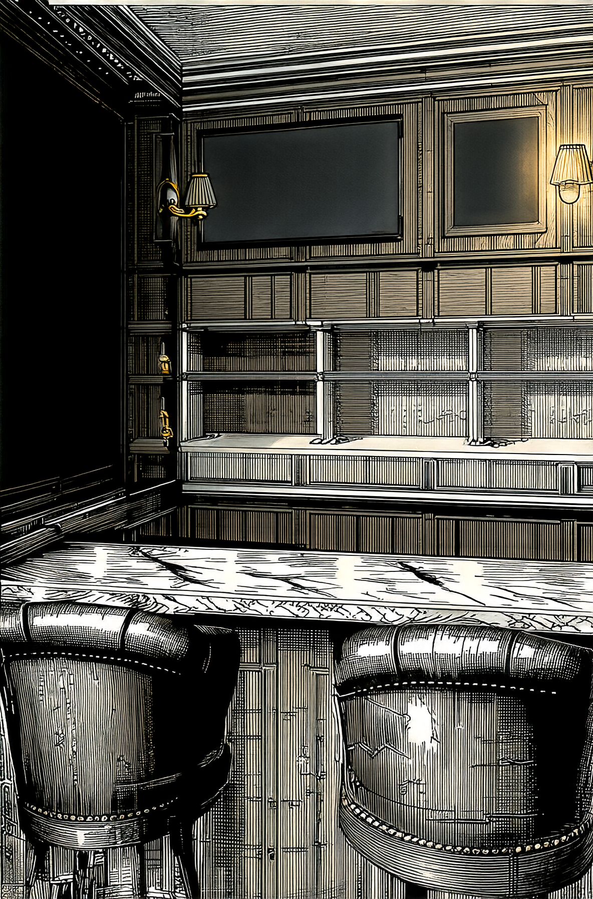

**The thinking.** The model's full-plate output for this part before it is cut by the mask.

**Prompt.** [prompts/049-wall-lamp-right-seed-4-raw-render.prompt.txt](prompts/049-wall-lamp-right-seed-4-raw-render.prompt.txt)

*Logged 11:19.*

---

## 050. wall-lamp-right-seed-4-laid-in-full-plate

**The thinking.** Rendered in context: the plate as it stood behind this part, with only this part's own silhouette blocked in as flat values, so the pen, the light and the perspective are inherited from its neighbours; only the part's mask is laid back. Nothing else in the picture moves.

**Prompt.** [prompts/050-wall-lamp-right-seed-4-laid-in-full-plate.prompt.txt](prompts/050-wall-lamp-right-seed-4-laid-in-full-plate.prompt.txt)

*Logged 11:19.*

---

## 051. whole-plate-camera-panned-fourteen-degrees-window-wider

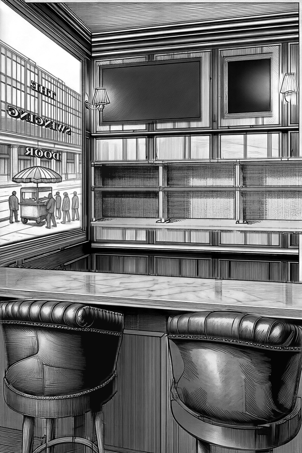

**Prompt.** [prompts/051-whole-plate-camera-panned-fourteen-degrees-window-wider.prompt.txt](prompts/051-whole-plate-camera-panned-fourteen-degrees-window-wider.prompt.txt)

*Logged 11:19.*

---

## 052. base-walls-crown-floor-seed-7-raw-render

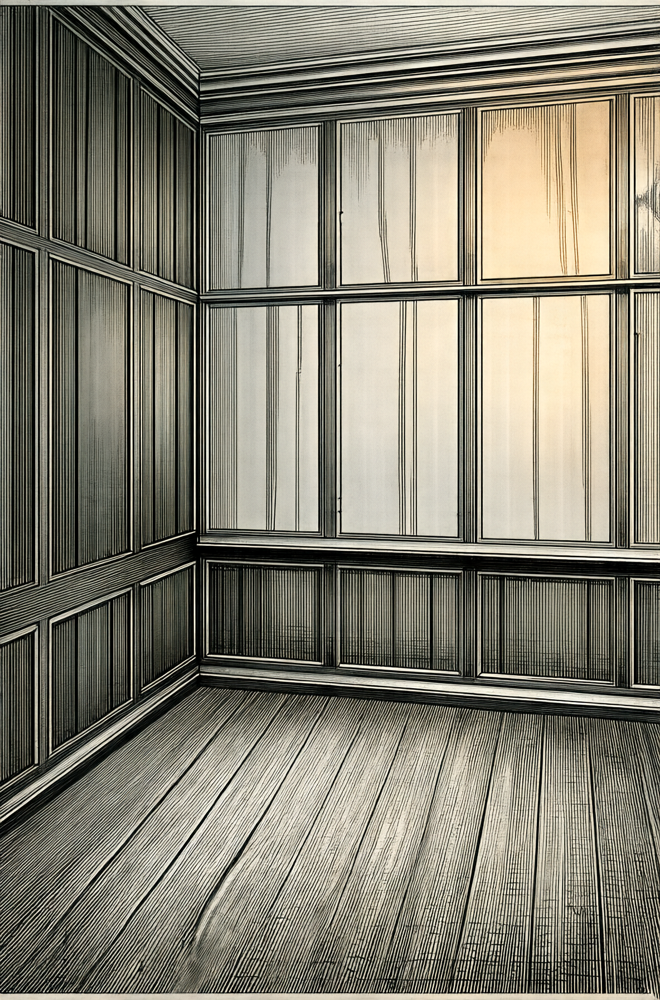

**The thinking.** The model's full-plate output for this part before it is cut by the mask.

**Prompt.** [prompts/052-base-walls-crown-floor-seed-7-raw-render.prompt.txt](prompts/052-base-walls-crown-floor-seed-7-raw-render.prompt.txt)

*Logged 11:19.*

---

## 053. base-walls-crown-floor-seed-7-levelled-preview

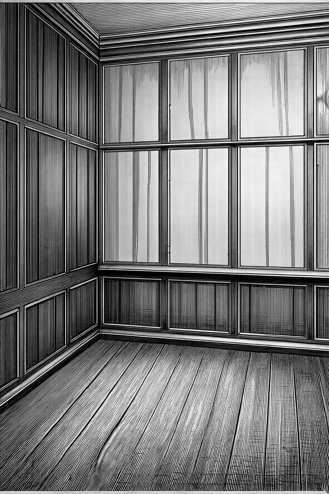

**The thinking.** Rendered in context: the plate as it stood behind this part, with only this part's own silhouette blocked in as flat values, so the pen, the light and the perspective are inherited from its neighbours; only the part's mask is laid back. Nothing else in the picture moves.

**Prompt.** [prompts/053-base-walls-crown-floor-seed-7-levelled-preview.prompt.txt](prompts/053-base-walls-crown-floor-seed-7-levelled-preview.prompt.txt)

*Logged 11:19.*

---

## 054. whole-plate-left-lamp-removed-sign-centred-back-bar-raised-to-rail

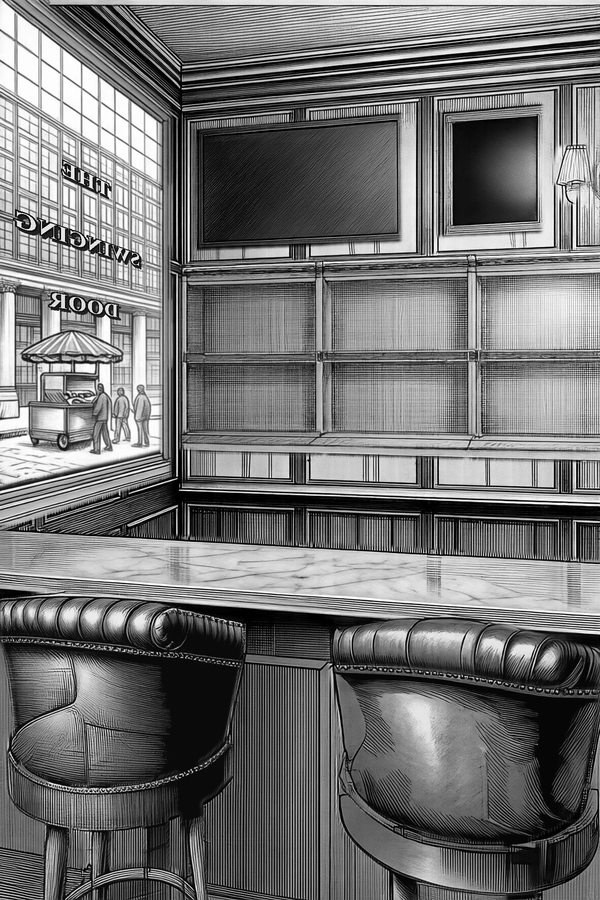

**The ask.** Remove the left lamp; sign to the middle; shelves up to the panel under the TV.

**Prompt.** [prompts/054-whole-plate-left-lamp-removed-sign-centred-back-bar-raised-to-rail.prompt.txt](prompts/054-whole-plate-left-lamp-removed-sign-centred-back-bar-raised-to-rail.prompt.txt)

*Logged 11:19.*

---

## 055. base-walls-crown-floor-seed-11-raw-render

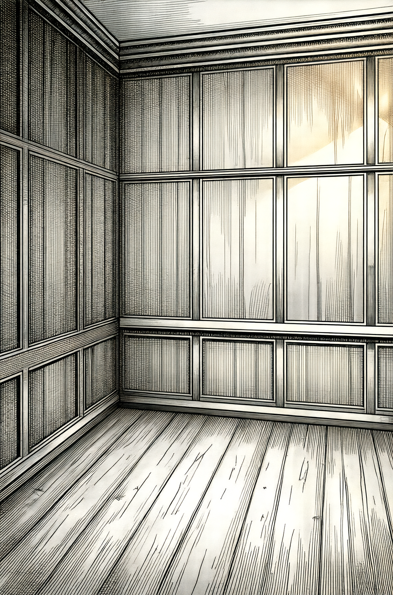

**The thinking.** The model's full-plate output for this part before it is cut by the mask.

**Prompt.** [prompts/055-base-walls-crown-floor-seed-11-raw-render.prompt.txt](prompts/055-base-walls-crown-floor-seed-11-raw-render.prompt.txt)

*Logged 11:19.*

---

## 056. base-walls-crown-floor-seed-11-levelled-preview

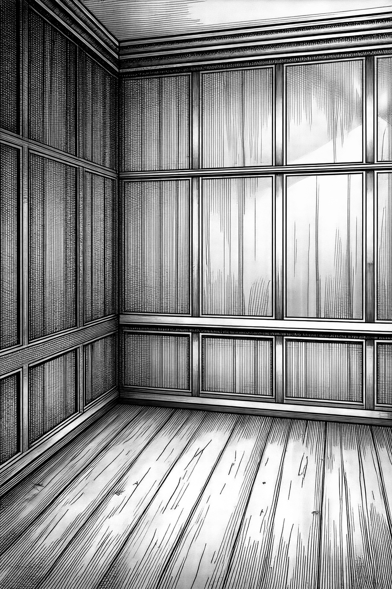

**The thinking.** Rendered in context: the plate as it stood behind this part, with only this part's own silhouette blocked in as flat values, so the pen, the light and the perspective are inherited from its neighbours; only the part's mask is laid back. Nothing else in the picture moves.

**Prompt.** [prompts/056-base-walls-crown-floor-seed-11-levelled-preview.prompt.txt](prompts/056-base-walls-crown-floor-seed-11-levelled-preview.prompt.txt)

*Logged 11:19.*

---

## 057. base-walls-crown-floor-seed-33-raw-render

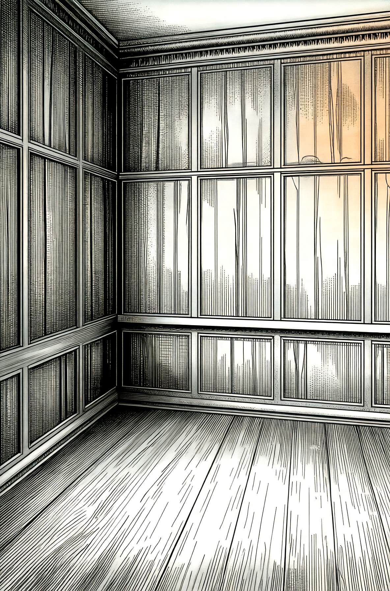

**The thinking.** The model's full-plate output for this part before it is cut by the mask.

**Prompt.** [prompts/057-base-walls-crown-floor-seed-33-raw-render.prompt.txt](prompts/057-base-walls-crown-floor-seed-33-raw-render.prompt.txt)

*Logged 11:19.*

---

## 058. base-walls-crown-floor-seed-33-levelled-preview

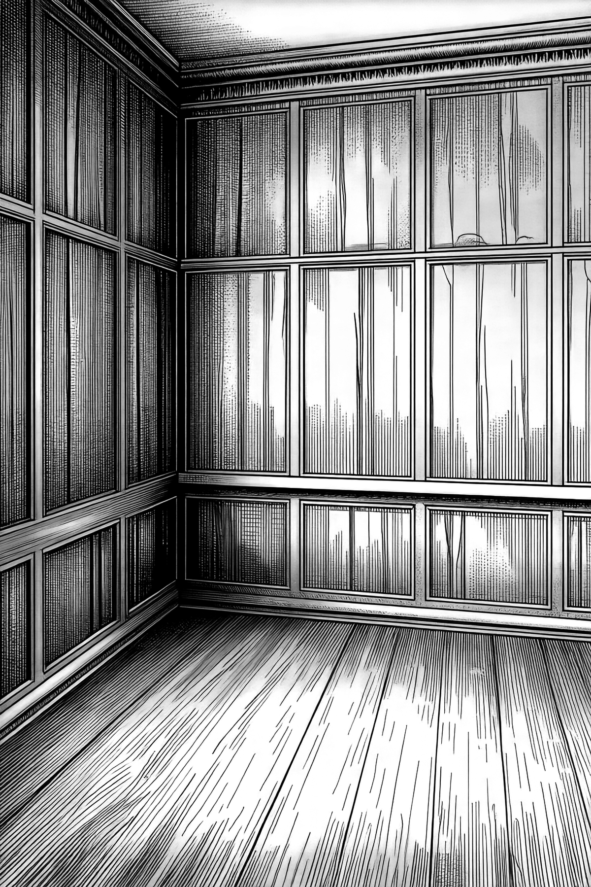

**The thinking.** Rendered in context: the plate as it stood behind this part, with only this part's own silhouette blocked in as flat values, so the pen, the light and the perspective are inherited from its neighbours; only the part's mask is laid back. Nothing else in the picture moves.

**Prompt.** [prompts/058-base-walls-crown-floor-seed-33-levelled-preview.prompt.txt](prompts/058-base-walls-crown-floor-seed-33-levelled-preview.prompt.txt)

*Logged 11:19.*

---

## 059. comparison-sheet-base-sweep3

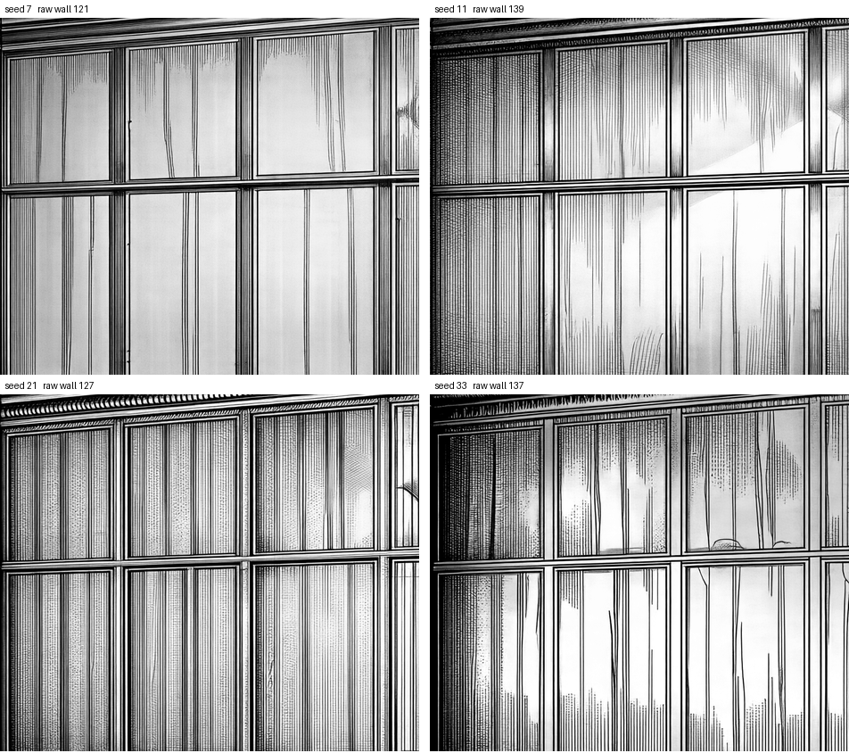

**The thinking.** Candidates side by side; the pick is made by eye against the founder's notes.

*Logged 11:19.*

---

## 060. whole-plate-back-bar-with-marble-ledge-and-six-cabinet-doors

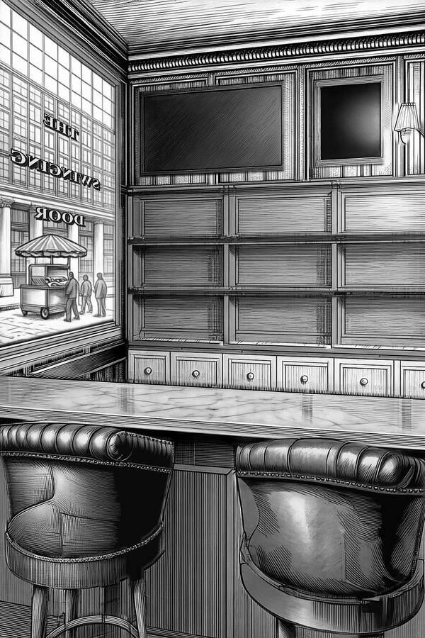

**The ask.** A ledge to make drinks on, the back flush, cabinets under it.

**The thinking.** Six doors, two per section, so the door joints meet the uprights above.

**Prompt.** [prompts/060-whole-plate-back-bar-with-marble-ledge-and-six-cabinet-doors.prompt.txt](prompts/060-whole-plate-back-bar-with-marble-ledge-and-six-cabinet-doors.prompt.txt)

*Logged 11:19.*

---

## 061. whole-plate-no-lamps-window-light-only-simplified-chairs

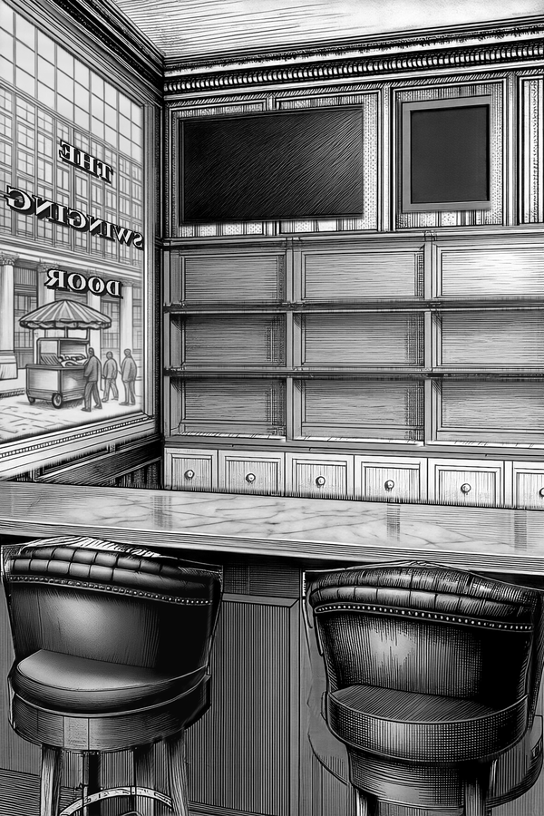

**The ask.** The chairs look weird; remove the right lamp.

**Prompt.** [prompts/061-whole-plate-no-lamps-window-light-only-simplified-chairs.prompt.txt](prompts/061-whole-plate-no-lamps-window-light-only-simplified-chairs.prompt.txt)

*Logged 11:19.*

---

## 062. comparison-sheet-sign-legibility

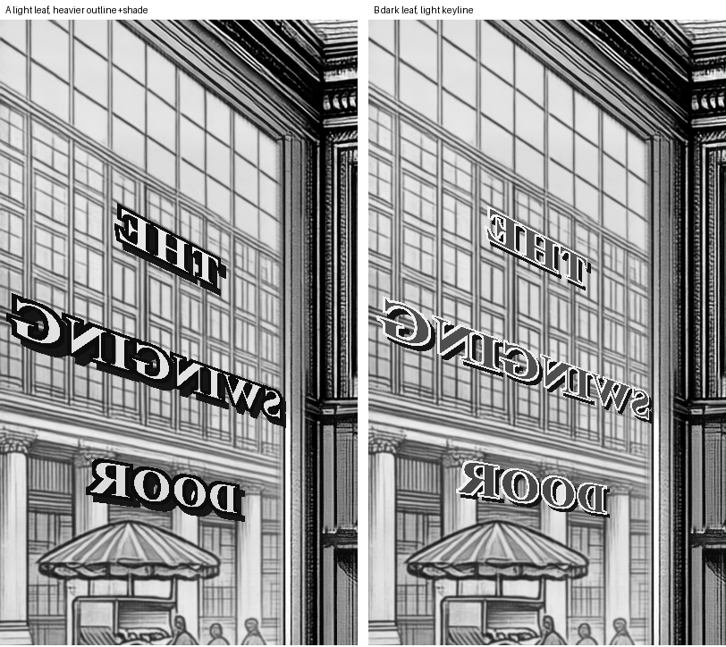

**The thinking.** Candidates side by side; the pick is made by eye against the founder's notes.

*Logged 11:19.*

---

## 063. whole-plate-modern-dark-capitals-mirrored-sign

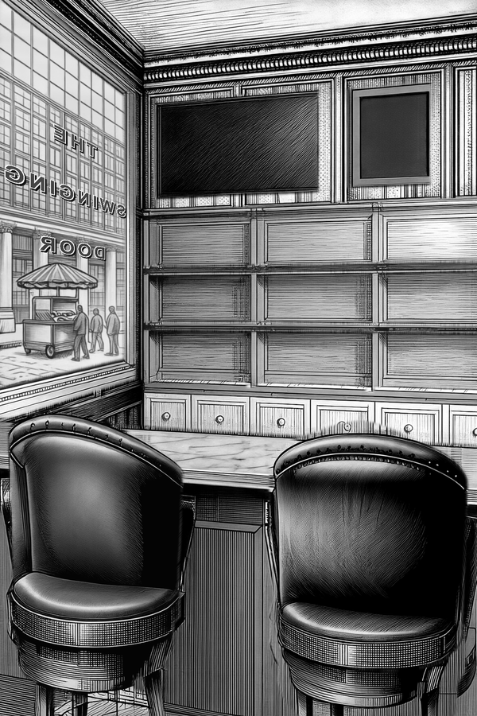

**The ask.** Sign darker and legible; it is a Wall Street bar, not a Victorian pub.

**The thinking.** From inside, lettering on a bright window reads as silhouette: dark capitals with a light keyline.

*Logged 11:19.*

---

## 064. right-leather-club-chair-seed-4-raw-render

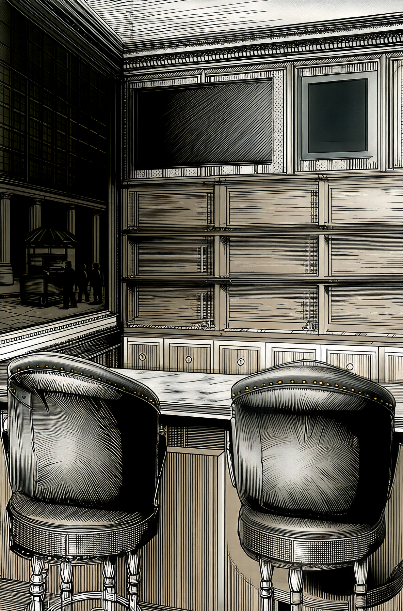

**The thinking.** The model's full-plate output for this part before it is cut by the mask.

**Prompt.** [prompts/064-right-leather-club-chair-seed-4-raw-render.prompt.txt](prompts/064-right-leather-club-chair-seed-4-raw-render.prompt.txt)

*Logged 11:19.*

---

## 065. right-leather-club-chair-seed-4-laid-in-full-plate

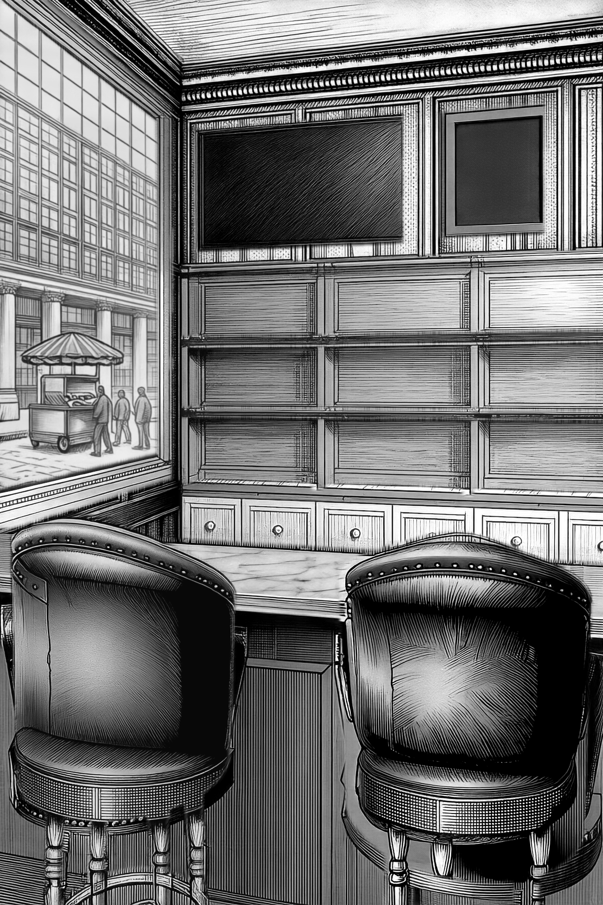

**The thinking.** Rendered in context: the plate as it stood behind this part, with only this part's own silhouette blocked in as flat values, so the pen, the light and the perspective are inherited from its neighbours; only the part's mask is laid back. Nothing else in the picture moves.

**Prompt.** [prompts/065-right-leather-club-chair-seed-4-laid-in-full-plate.prompt.txt](prompts/065-right-leather-club-chair-seed-4-laid-in-full-plate.prompt.txt)

*Logged 11:19.*

---

## 066. chairs-close-up-full-backs-with-apron-base

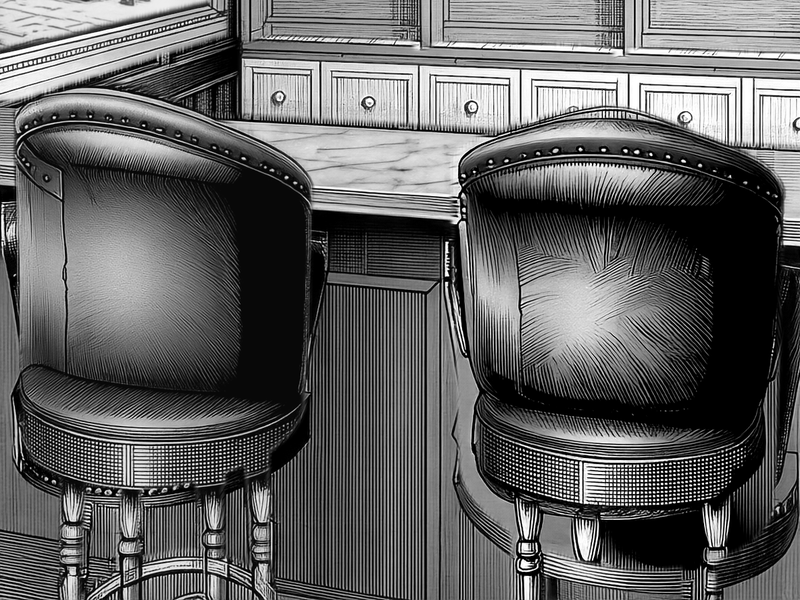

**The ask.** Full backs; the right chair had a weird base.

**Prompt.** [prompts/066-chairs-close-up-full-backs-with-apron-base.prompt.txt](prompts/066-chairs-close-up-full-backs-with-apron-base.prompt.txt)

*Logged 11:19.*

---

## 067. left-leather-club-chair-seed-33-raw-render

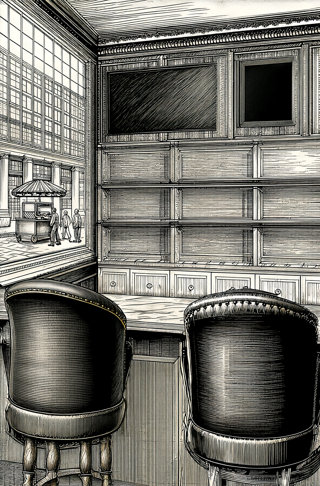

**The thinking.** The model's full-plate output for this part before it is cut by the mask.

**Prompt.** [prompts/067-left-leather-club-chair-seed-33-raw-render.prompt.txt](prompts/067-left-leather-club-chair-seed-33-raw-render.prompt.txt)

*Logged 11:19.*

---

## 068. left-leather-club-chair-seed-33-laid-in-full-plate

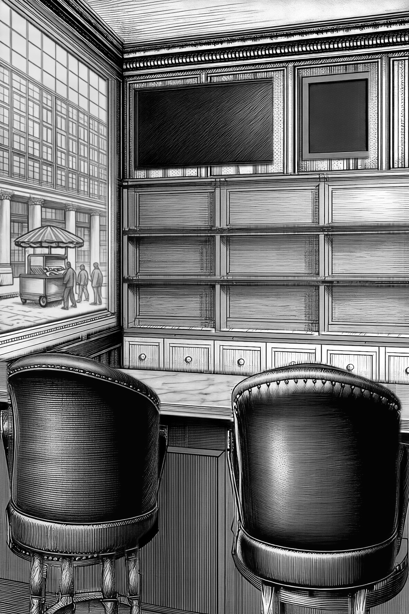

**The thinking.** Rendered in context: the plate as it stood behind this part, with only this part's own silhouette blocked in as flat values, so the pen, the light and the perspective are inherited from its neighbours; only the part's mask is laid back. Nothing else in the picture moves.

**Prompt.** [prompts/068-left-leather-club-chair-seed-33-laid-in-full-plate.prompt.txt](prompts/068-left-leather-club-chair-seed-33-laid-in-full-plate.prompt.txt)

*Logged 11:19.*

---

## 069. comparison-sheet-chair-left-sweep

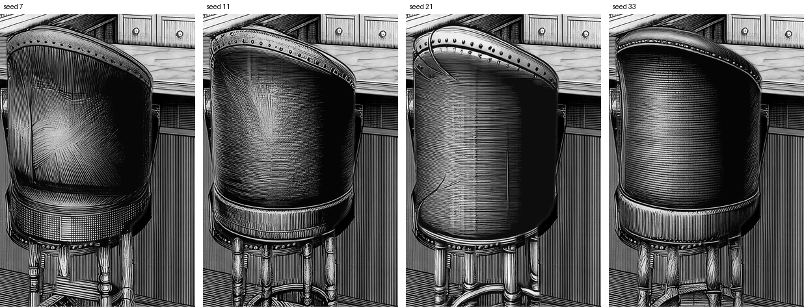

**The thinking.** Candidates side by side; the pick is made by eye against the founder's notes.

*Logged 11:19.*

---

## 070. chairs-close-up-full-backs-turned-legs-no-seat-visible

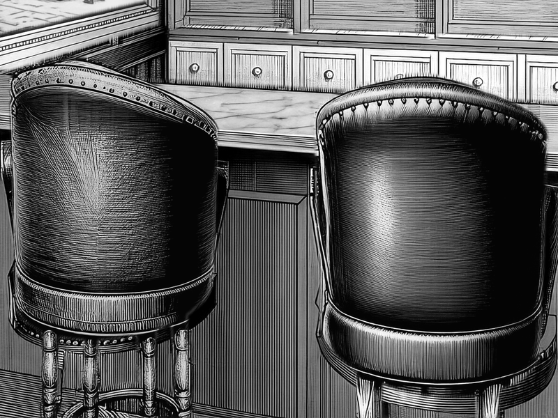

**The ask.** No seats visible from behind; nice legs; no ugly base.

**Prompt.** [prompts/070-chairs-close-up-full-backs-turned-legs-no-seat-visible.prompt.txt](prompts/070-chairs-close-up-full-backs-turned-legs-no-seat-visible.prompt.txt)

*Logged 11:19.*

---

## 071. left-leather-club-chair-seed-44-raw-render

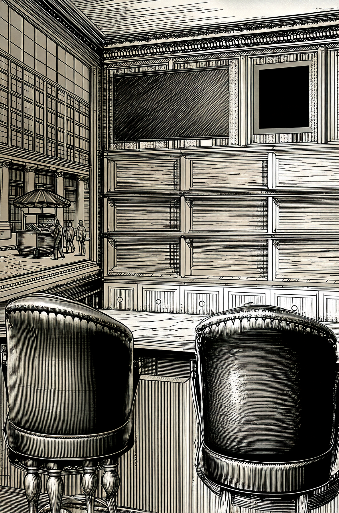

**The thinking.** The model's full-plate output for this part before it is cut by the mask.

**Prompt.** [prompts/071-left-leather-club-chair-seed-44-raw-render.prompt.txt](prompts/071-left-leather-club-chair-seed-44-raw-render.prompt.txt)

*Logged 11:19.*

---

## 072. left-leather-club-chair-seed-44-laid-in-full-plate

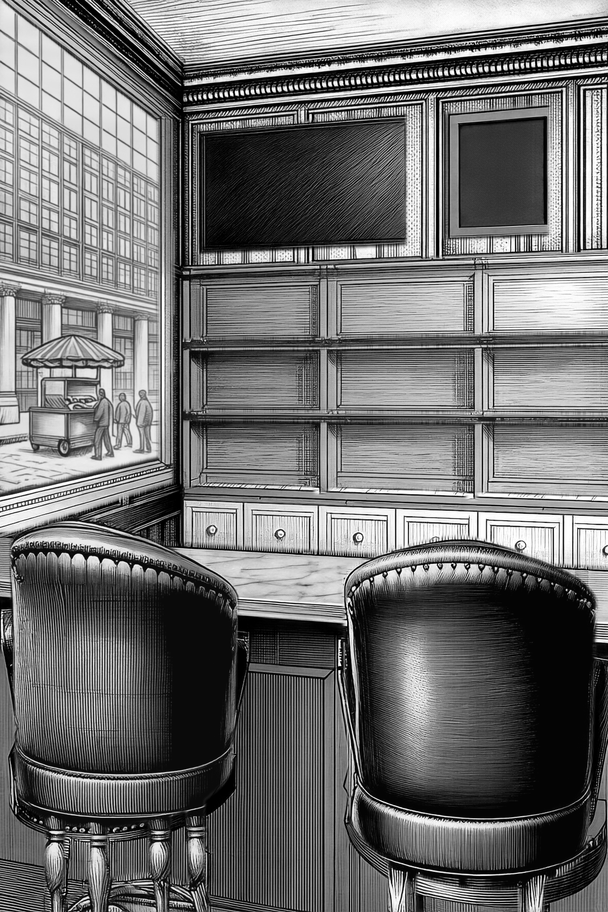

**The thinking.** Rendered in context: the plate as it stood behind this part, with only this part's own silhouette blocked in as flat values, so the pen, the light and the perspective are inherited from its neighbours; only the part's mask is laid back. Nothing else in the picture moves.

**Prompt.** [prompts/072-left-leather-club-chair-seed-44-laid-in-full-plate.prompt.txt](prompts/072-left-leather-club-chair-seed-44-laid-in-full-plate.prompt.txt)

*Logged 11:19.*

---

## 073. left-leather-club-chair-seed-66-raw-render

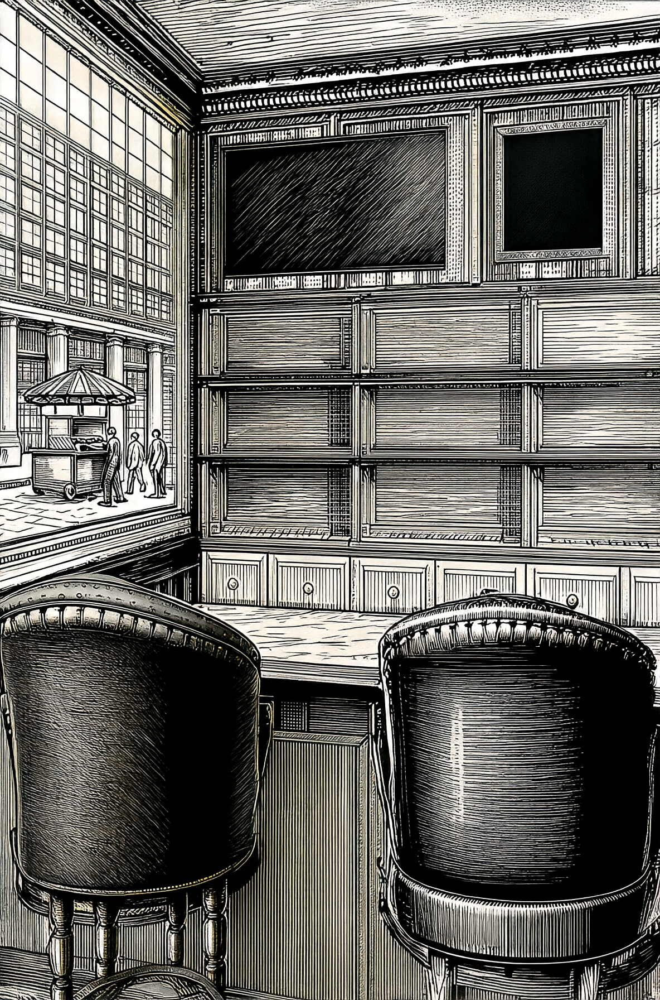

**The thinking.** The model's full-plate output for this part before it is cut by the mask.

**Prompt.** [prompts/073-left-leather-club-chair-seed-66-raw-render.prompt.txt](prompts/073-left-leather-club-chair-seed-66-raw-render.prompt.txt)

*Logged 11:19.*

---

## 074. left-leather-club-chair-seed-66-laid-in-full-plate

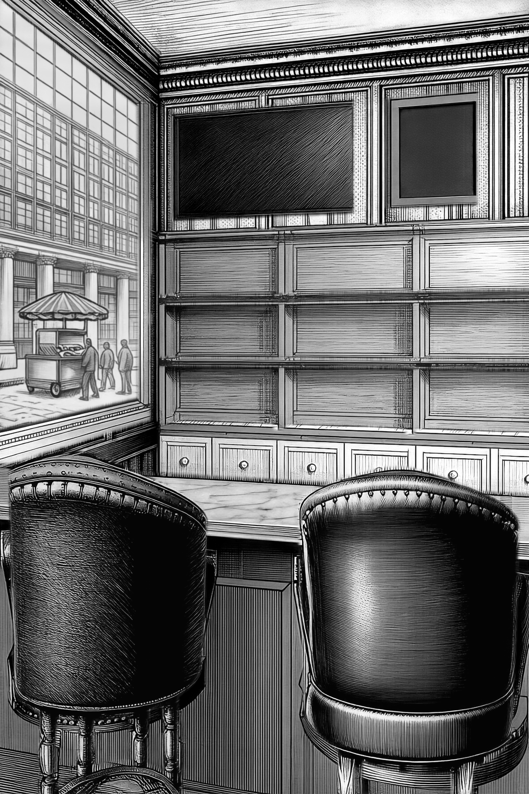

**The thinking.** Rendered in context: the plate as it stood behind this part, with only this part's own silhouette blocked in as flat values, so the pen, the light and the perspective are inherited from its neighbours; only the part's mask is laid back. Nothing else in the picture moves.

**Prompt.** [prompts/074-left-leather-club-chair-seed-66-laid-in-full-plate.prompt.txt](prompts/074-left-leather-club-chair-seed-66-laid-in-full-plate.prompt.txt)

*Logged 11:19.*

---

## 075. comparison-sheet-chair-left-sweep2

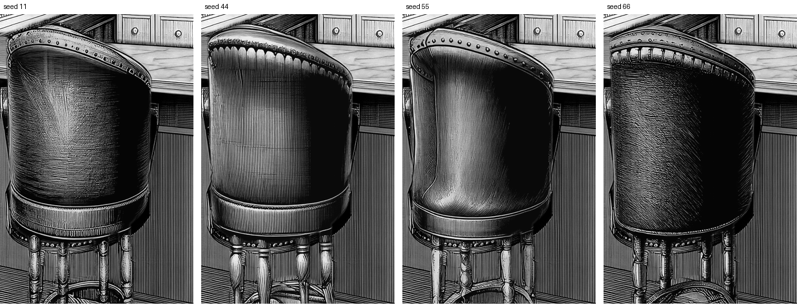

**The thinking.** Candidates side by side; the pick is made by eye against the founder's notes.

*Logged 11:19.*

---

## 076. chairs-close-up-matching-leather-left-seed-55-right-seed-7

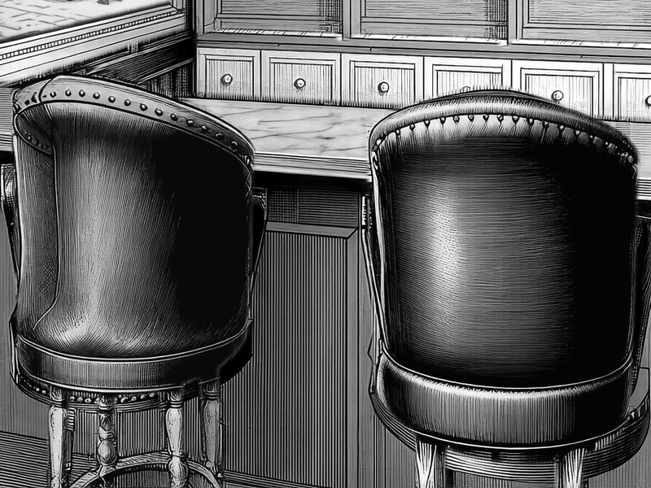

**Prompt.** [prompts/076-chairs-close-up-matching-leather-left-seed-55-right-seed-7.prompt.txt](prompts/076-chairs-close-up-matching-leather-left-seed-55-right-seed-7.prompt.txt)

*Logged 11:19.*

---

## 077. comparison-sheet-sign-script

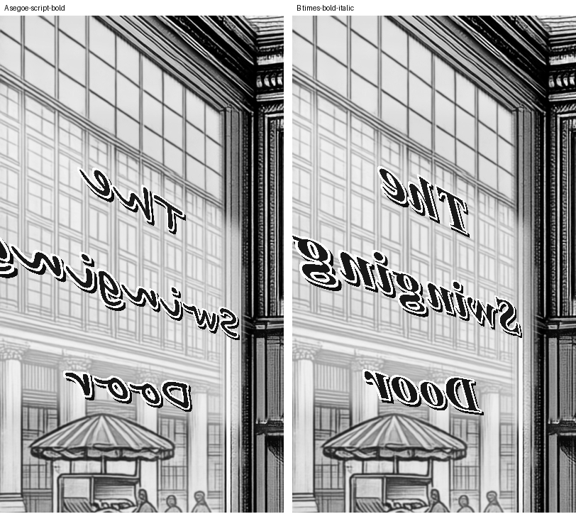

**The thinking.** Candidates side by side; the pick is made by eye against the founder's notes.

*Logged 11:19.*

---

## 078. television-blank-seed-7-raw-render

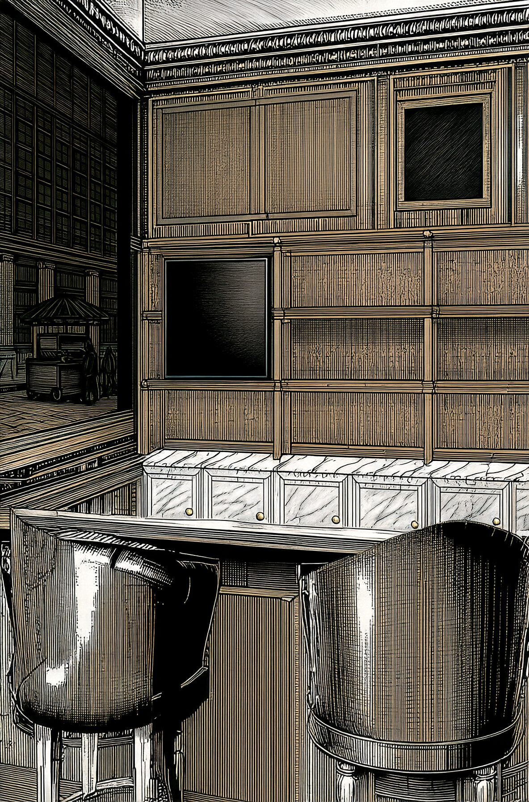

**The thinking.** The model's full-plate output for this part before it is cut by the mask.

**Prompt.** [prompts/078-television-blank-seed-7-raw-render.prompt.txt](prompts/078-television-blank-seed-7-raw-render.prompt.txt)

*Logged 11:19.*

---

## 079. television-blank-seed-7-laid-in-full-plate

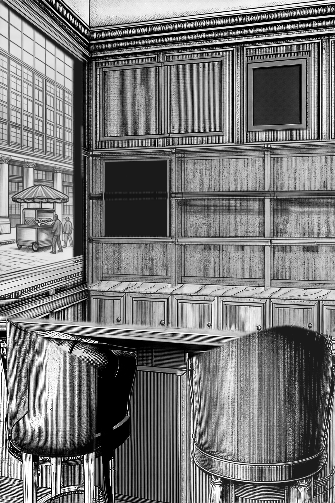

**The thinking.** Rendered in context: the plate as it stood behind this part, with only this part's own silhouette blocked in as flat values, so the pen, the light and the perspective are inherited from its neighbours; only the part's mask is laid back. Nothing else in the picture moves.

**Prompt.** [prompts/079-television-blank-seed-7-laid-in-full-plate.prompt.txt](prompts/079-television-blank-seed-7-laid-in-full-plate.prompt.txt)

*Logged 11:19.*

---

## 080. chalkboard-blank-seed-4-raw-render

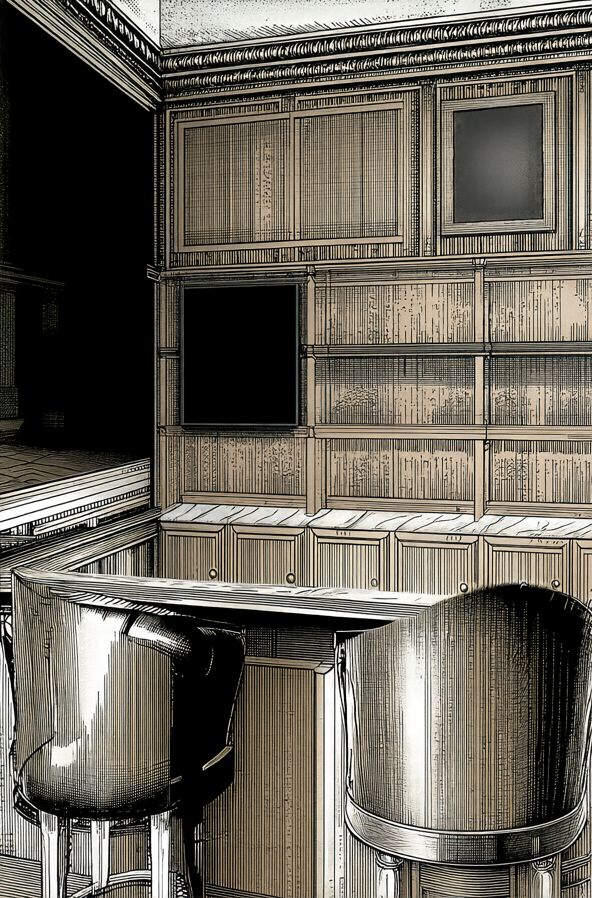

**The thinking.** The model's full-plate output for this part before it is cut by the mask.

**Prompt.** [prompts/080-chalkboard-blank-seed-4-raw-render.prompt.txt](prompts/080-chalkboard-blank-seed-4-raw-render.prompt.txt)

*Logged 11:19.*

---

## 081. chalkboard-blank-seed-4-laid-in-full-plate

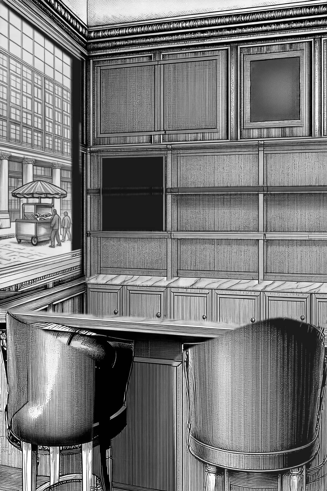

**The thinking.** Rendered in context: the plate as it stood behind this part, with only this part's own silhouette blocked in as flat values, so the pen, the light and the perspective are inherited from its neighbours; only the part's mask is laid back. Nothing else in the picture moves.

**Prompt.** [prompts/081-chalkboard-blank-seed-4-laid-in-full-plate.prompt.txt](prompts/081-chalkboard-blank-seed-4-laid-in-full-plate.prompt.txt)

*Logged 11:19.*

---

## 082. window-glass-street-view-seed-21-raw-render

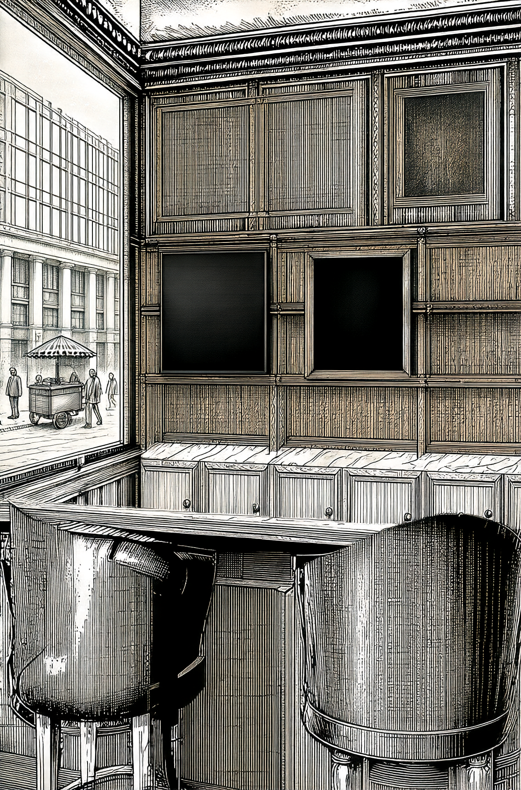

**The thinking.** The model's full-plate output for this part before it is cut by the mask.

**Prompt.** [prompts/082-window-glass-street-view-seed-21-raw-render.prompt.txt](prompts/082-window-glass-street-view-seed-21-raw-render.prompt.txt)

*Logged 11:19.*

---

## 083. window-glass-street-view-seed-21-laid-in-full-plate

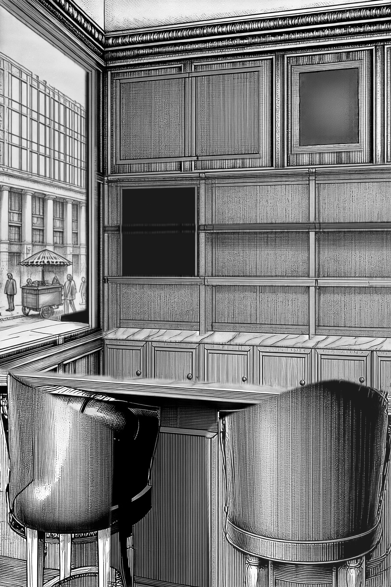

**The thinking.** Rendered in context: the plate as it stood behind this part, with only this part's own silhouette blocked in as flat values, so the pen, the light and the perspective are inherited from its neighbours; only the part's mask is laid back. Nothing else in the picture moves.

**Prompt.** [prompts/083-window-glass-street-view-seed-21-laid-in-full-plate.prompt.txt](prompts/083-window-glass-street-view-seed-21-laid-in-full-plate.prompt.txt)

*Logged 11:19.*

---

## 084. television-blank-seed-4-raw-render

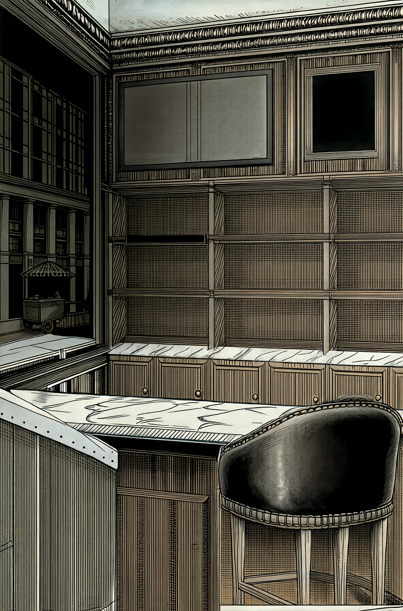

**The thinking.** The model's full-plate output for this part before it is cut by the mask.

**Prompt.** [prompts/084-television-blank-seed-4-raw-render.prompt.txt](prompts/084-television-blank-seed-4-raw-render.prompt.txt)

*Logged 11:19.*

---

## 085. television-blank-seed-4-laid-in-full-plate

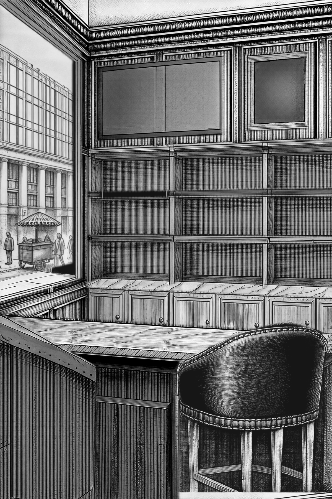

**The thinking.** Rendered in context: the plate as it stood behind this part, with only this part's own silhouette blocked in as flat values, so the pen, the light and the perspective are inherited from its neighbours; only the part's mask is laid back. Nothing else in the picture moves.

**Prompt.** [prompts/085-television-blank-seed-4-laid-in-full-plate.prompt.txt](prompts/085-television-blank-seed-4-laid-in-full-plate.prompt.txt)

*Logged 11:19.*

---

## 086. right-leather-club-chair-seed-7-raw-render

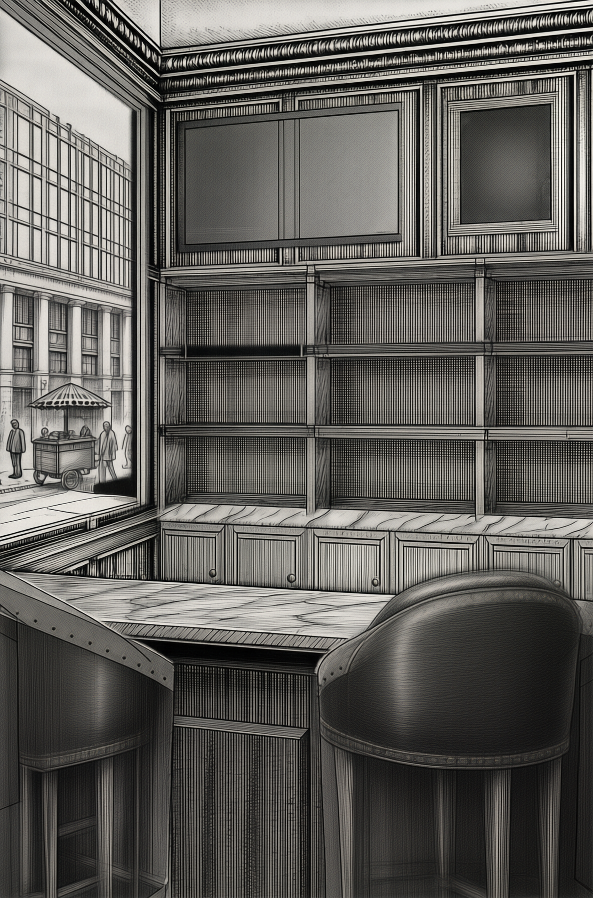

**The thinking.** The model's full-plate output for this part before it is cut by the mask.

**Prompt.** [prompts/086-right-leather-club-chair-seed-7-raw-render.prompt.txt](prompts/086-right-leather-club-chair-seed-7-raw-render.prompt.txt)

*Logged 11:19.*

---

## 087. right-leather-club-chair-seed-7-laid-in-full-plate

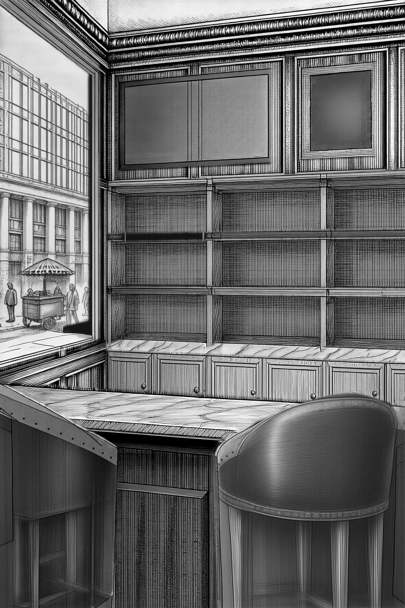

**The thinking.** Rendered in context: the plate as it stood behind this part, with only this part's own silhouette blocked in as flat values, so the pen, the light and the perspective are inherited from its neighbours; only the part's mask is laid back. Nothing else in the picture moves.

**Prompt.** [prompts/087-right-leather-club-chair-seed-7-laid-in-full-plate.prompt.txt](prompts/087-right-leather-club-chair-seed-7-laid-in-full-plate.prompt.txt)

*Logged 11:19.*

---

## 088. television-blank-seed-11-raw-render

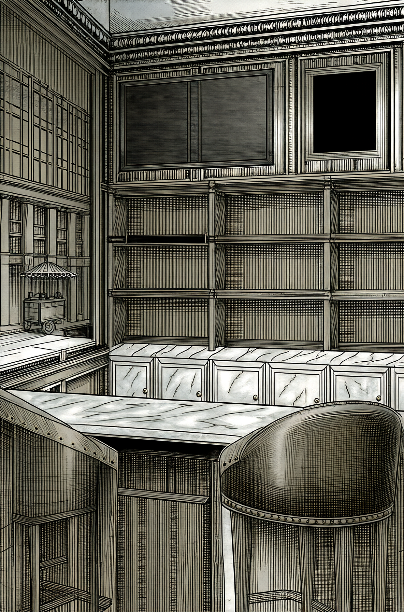

**The thinking.** The model's full-plate output for this part before it is cut by the mask.

**Prompt.** [prompts/088-television-blank-seed-11-raw-render.prompt.txt](prompts/088-television-blank-seed-11-raw-render.prompt.txt)

*Logged 11:19.*

---

## 089. television-blank-seed-11-laid-in-full-plate

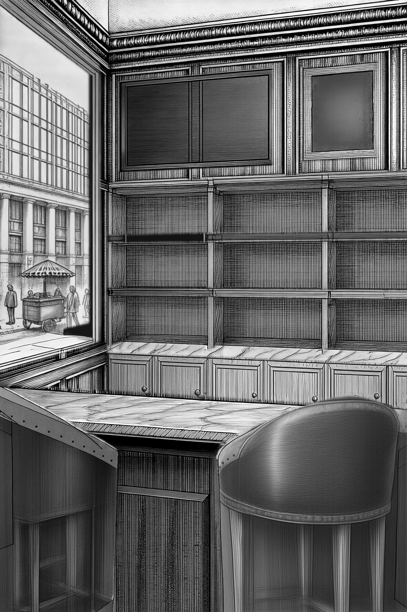

**The thinking.** Rendered in context: the plate as it stood behind this part, with only this part's own silhouette blocked in as flat values, so the pen, the light and the perspective are inherited from its neighbours; only the part's mask is laid back. Nothing else in the picture moves.

**Prompt.** [prompts/089-television-blank-seed-11-laid-in-full-plate.prompt.txt](prompts/089-television-blank-seed-11-laid-in-full-plate.prompt.txt)

*Logged 11:19.*

---

## 090. comparison-sheet-pair-sweep

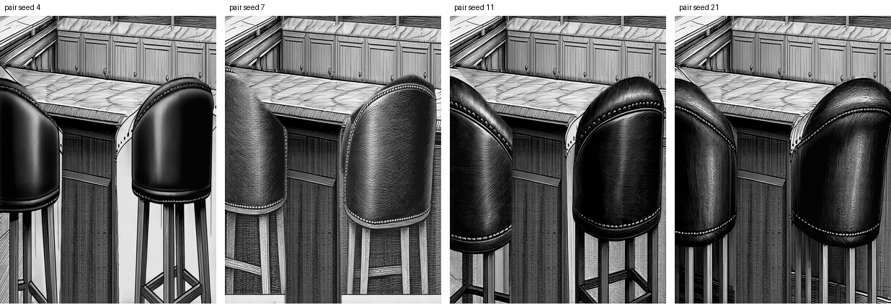

**The thinking.** Candidates side by side; the pick is made by eye against the founder's notes.

*Logged 11:19.*

---

## 091. comparison-sheet-tv-sweep

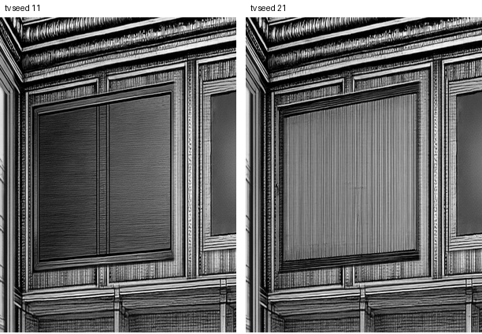

**The thinking.** Candidates side by side; the pick is made by eye against the founder's notes.

*Logged 11:19.*

---

## 092. comparison-sheet-pairfast-sweep

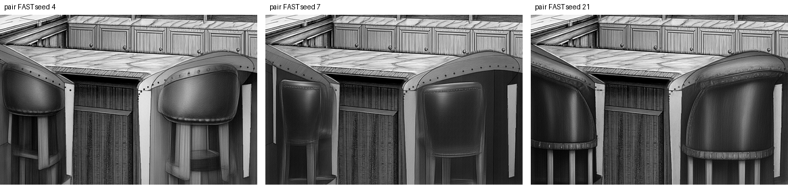

**The thinking.** Candidates side by side; the pick is made by eye against the founder's notes.

*Logged 11:19.*

---

## 093. left-leather-club-chair-seed-7-raw-render

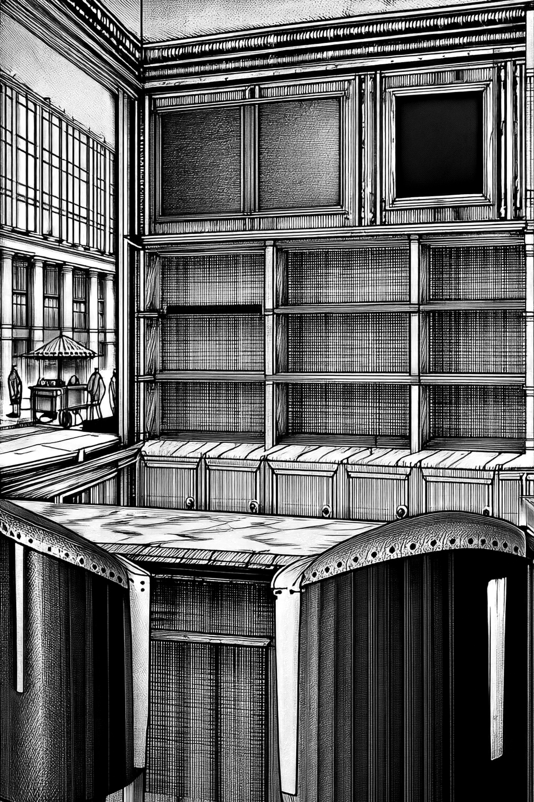

**The thinking.** The model's full-plate output for this part before it is cut by the mask.

**Prompt.** [prompts/093-left-leather-club-chair-seed-7-raw-render.prompt.txt](prompts/093-left-leather-club-chair-seed-7-raw-render.prompt.txt)

*Logged 11:19.*

---

## 094. left-leather-club-chair-seed-7-laid-in-full-plate

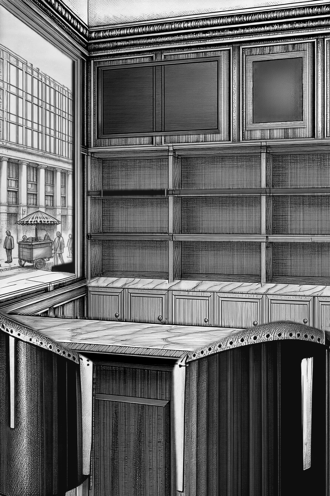

**The thinking.** Rendered in context: the plate as it stood behind this part, with only this part's own silhouette blocked in as flat values, so the pen, the light and the perspective are inherited from its neighbours; only the part's mask is laid back. Nothing else in the picture moves.

**Prompt.** [prompts/094-left-leather-club-chair-seed-7-laid-in-full-plate.prompt.txt](prompts/094-left-leather-club-chair-seed-7-laid-in-full-plate.prompt.txt)

*Logged 11:19.*

---

## 095. left-leather-club-chair-seed-55-raw-render

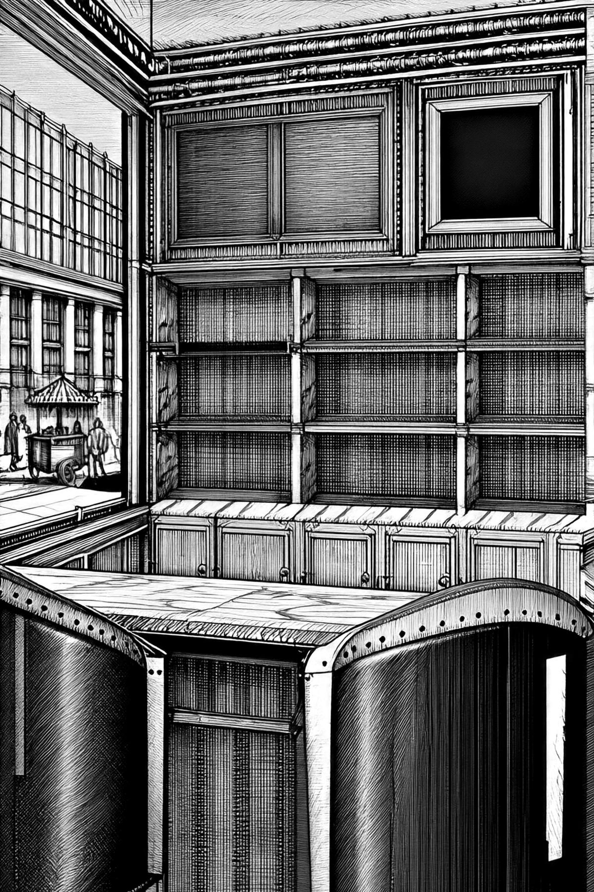

**The thinking.** The model's full-plate output for this part before it is cut by the mask.

**Prompt.** [prompts/095-left-leather-club-chair-seed-55-raw-render.prompt.txt](prompts/095-left-leather-club-chair-seed-55-raw-render.prompt.txt)

*Logged 11:19.*

---

## 096. left-leather-club-chair-seed-55-laid-in-full-plate

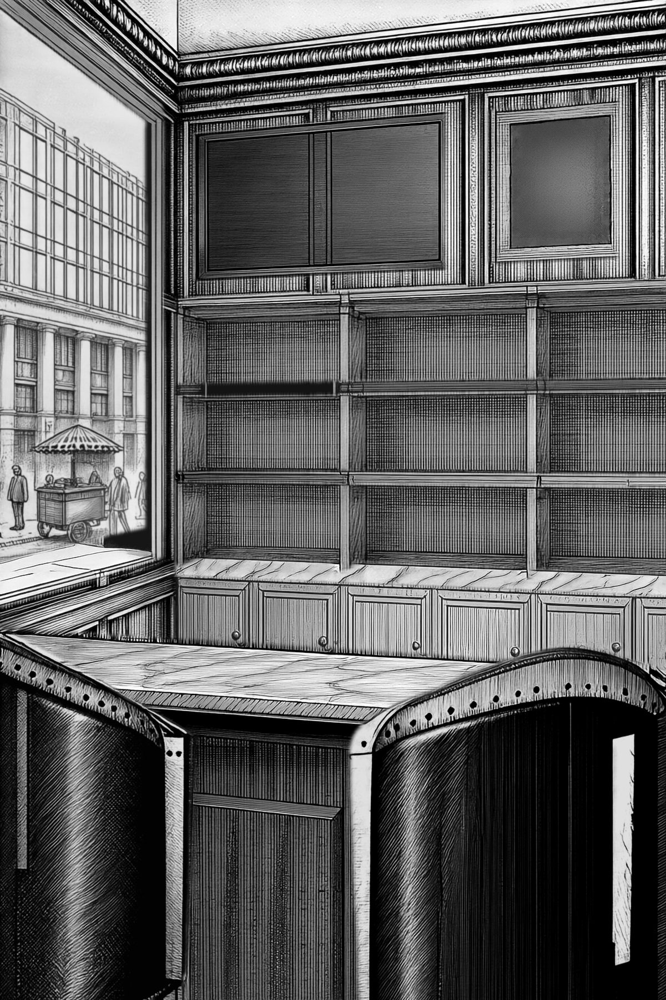

**The thinking.** Rendered in context: the plate as it stood behind this part, with only this part's own silhouette blocked in as flat values, so the pen, the light and the perspective are inherited from its neighbours; only the part's mask is laid back. Nothing else in the picture moves.

**Prompt.** [prompts/096-left-leather-club-chair-seed-55-laid-in-full-plate.prompt.txt](prompts/096-left-leather-club-chair-seed-55-laid-in-full-plate.prompt.txt)

*Logged 11:19.*

---

## 097. comparison-sheet-tall-sweep

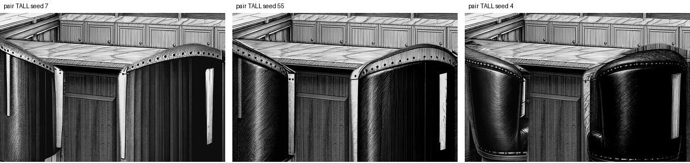

**The thinking.** Candidates side by side; the pick is made by eye against the founder's notes.

*Logged 11:19.*

---

## 098. whole-plate-closer-camera-chairs-turned-inward-backs-only-no-legs

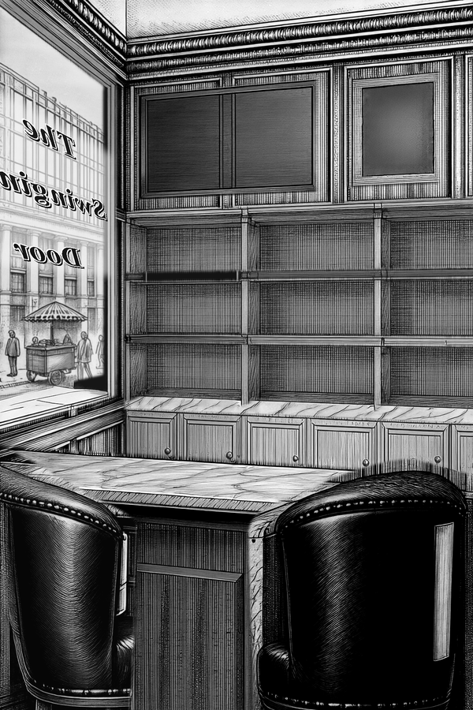

**The ask.** Pan up a little closer; turn the chairs inward; backs only, no legs.

**The thinking.** The model draws complete objects: a back cut off by the frame was re-imagined as a small chair on legs, so the pair is rendered on a taller canvas with legs and floor in view, then cropped back.

**Prompt.** [prompts/098-whole-plate-closer-camera-chairs-turned-inward-backs-only-no-legs.prompt.txt](prompts/098-whole-plate-closer-camera-chairs-turned-inward-backs-only-no-legs.prompt.txt)

*Logged 11:19.*

---

## 099. left-leather-club-chair-seed-11-raw-render

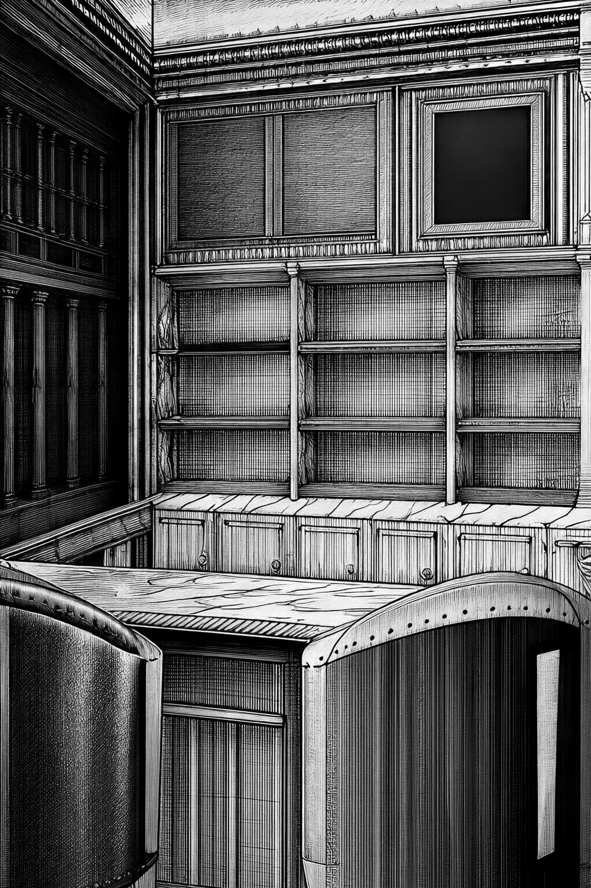

**The thinking.** The model's full-plate output for this part before it is cut by the mask.

**Prompt.** [prompts/099-left-leather-club-chair-seed-11-raw-render.prompt.txt](prompts/099-left-leather-club-chair-seed-11-raw-render.prompt.txt)

*Logged 11:19.*

---

## 100. left-leather-club-chair-seed-11-laid-in-full-plate

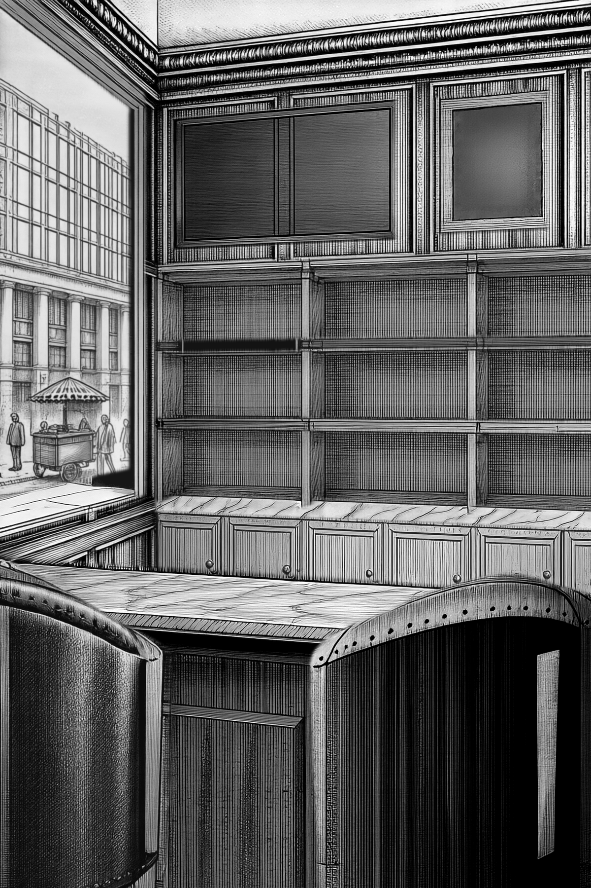

**The thinking.** Rendered in context: the plate as it stood behind this part, with only this part's own silhouette blocked in as flat values, so the pen, the light and the perspective are inherited from its neighbours; only the part's mask is laid back. Nothing else in the picture moves.

**Prompt.** [prompts/100-left-leather-club-chair-seed-11-laid-in-full-plate.prompt.txt](prompts/100-left-leather-club-chair-seed-11-laid-in-full-plate.prompt.txt)

*Logged 11:19.*

---

## 101. left-leather-club-chair-seed-21-raw-render

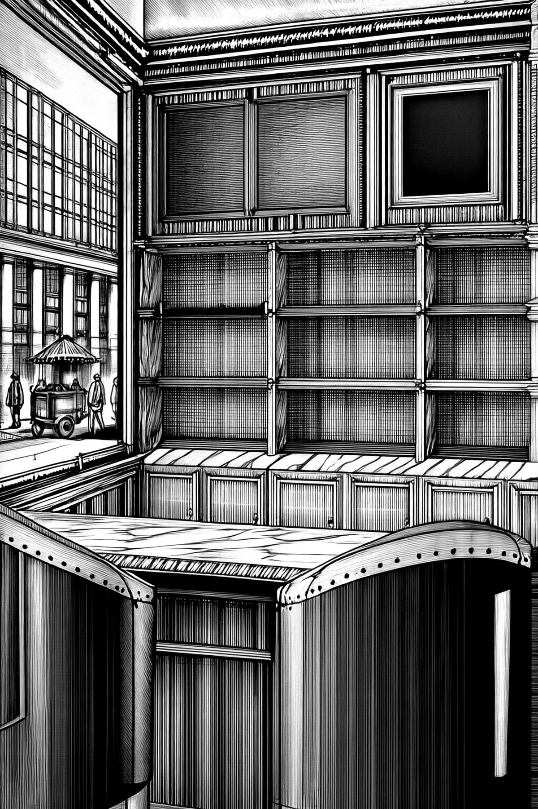

**The thinking.** The model's full-plate output for this part before it is cut by the mask.

**Prompt.** [prompts/101-left-leather-club-chair-seed-21-raw-render.prompt.txt](prompts/101-left-leather-club-chair-seed-21-raw-render.prompt.txt)

*Logged 11:19.*

---

## 102. left-leather-club-chair-seed-21-laid-in-full-plate

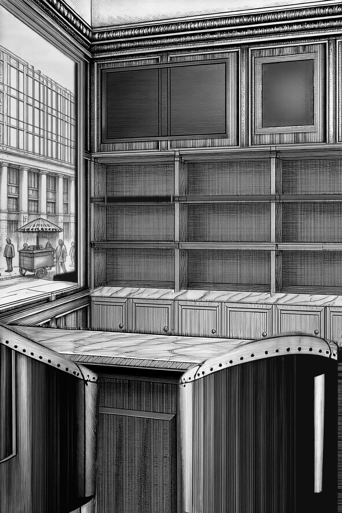

**The thinking.** Rendered in context: the plate as it stood behind this part, with only this part's own silhouette blocked in as flat values, so the pen, the light and the perspective are inherited from its neighbours; only the part's mask is laid back. Nothing else in the picture moves.

**Prompt.** [prompts/102-left-leather-club-chair-seed-21-laid-in-full-plate.prompt.txt](prompts/102-left-leather-club-chair-seed-21-laid-in-full-plate.prompt.txt)

*Logged 11:19.*

---

## 103. comparison-sheet-tall-sweep2

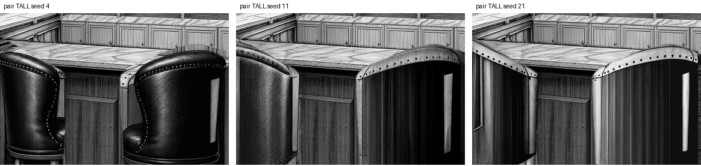

**The thinking.** Candidates side by side; the pick is made by eye against the founder's notes.

*Logged 11:19.*

---

## 104. whole-plate-even-haze-over-pane-clean-capitals

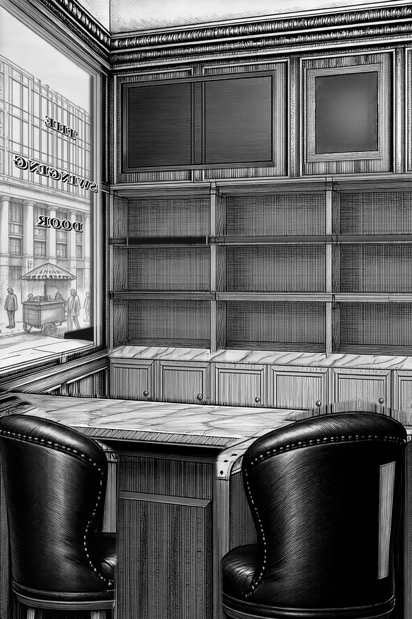

**The ask.** The frosted band looked wrong where the wall meets the window; make the whole window slightly foggy.

*Logged 11:19.*

---

## 105. television-blank-seed-21-raw-render

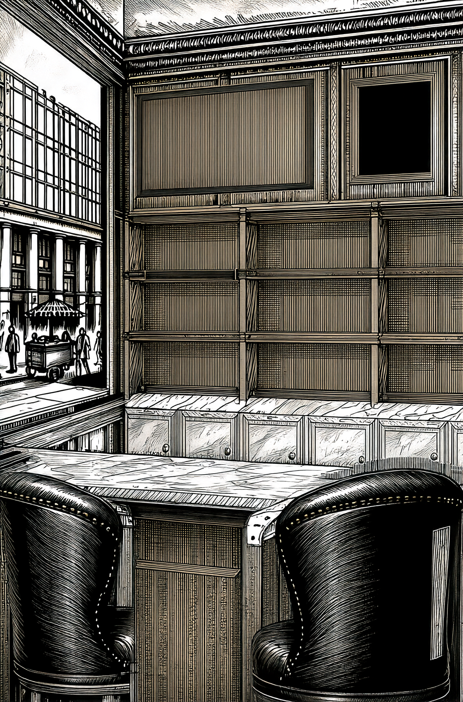

**The thinking.** The model's full-plate output for this part before it is cut by the mask.

**Prompt.** [prompts/105-television-blank-seed-21-raw-render.prompt.txt](prompts/105-television-blank-seed-21-raw-render.prompt.txt)

*Logged 11:19.*

---

## 106. television-blank-seed-21-laid-in-full-plate

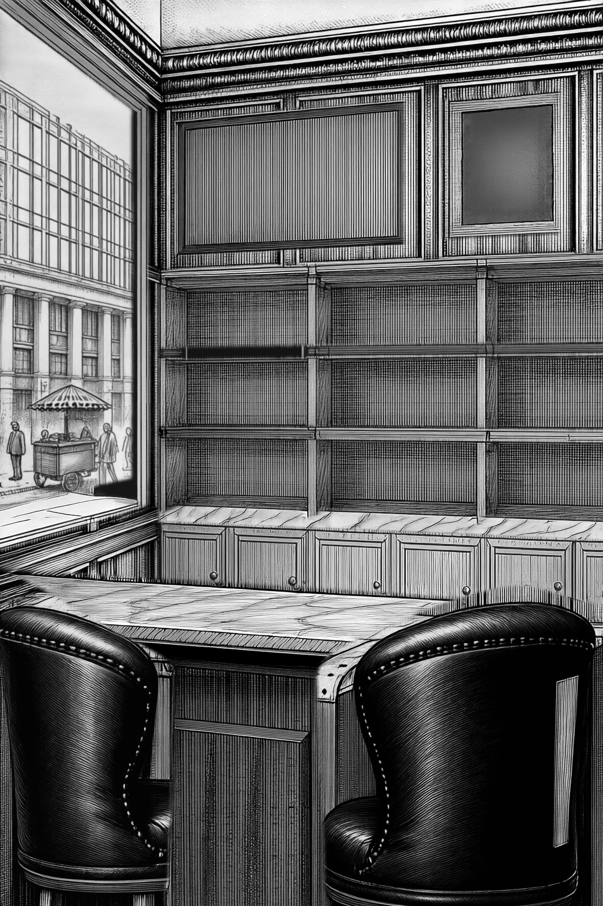

**The thinking.** Rendered in context: the plate as it stood behind this part, with only this part's own silhouette blocked in as flat values, so the pen, the light and the perspective are inherited from its neighbours; only the part's mask is laid back. Nothing else in the picture moves.

**Prompt.** [prompts/106-television-blank-seed-21-laid-in-full-plate.prompt.txt](prompts/106-television-blank-seed-21-laid-in-full-plate.prompt.txt)

*Logged 11:19.*

---

## 107. television-blank-seed-33-raw-render

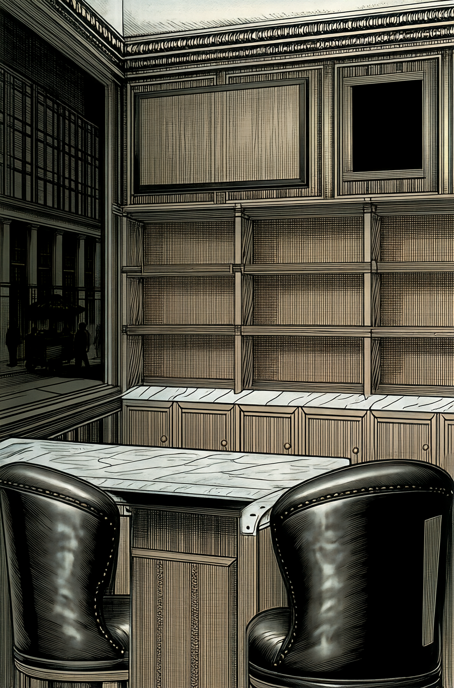

**The thinking.** The model's full-plate output for this part before it is cut by the mask.

**Prompt.** [prompts/107-television-blank-seed-33-raw-render.prompt.txt](prompts/107-television-blank-seed-33-raw-render.prompt.txt)

*Logged 11:19.*

---

## 108. television-blank-seed-33-laid-in-full-plate

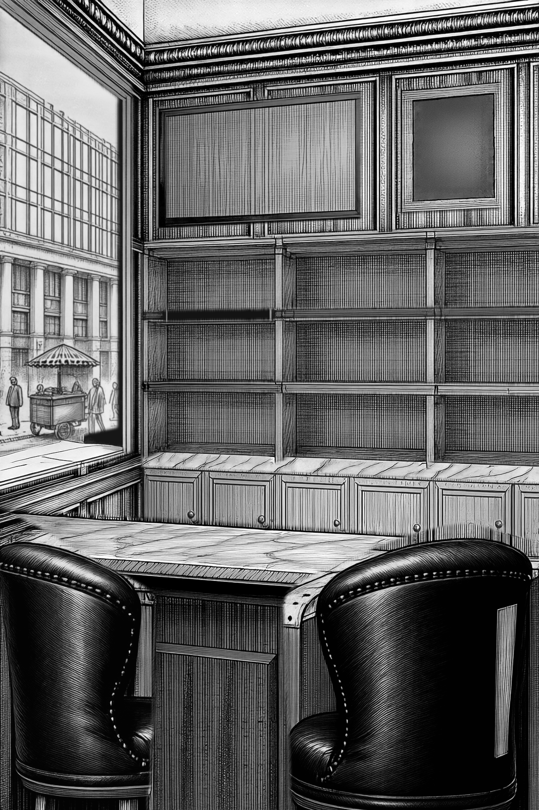

**The thinking.** Rendered in context: the plate as it stood behind this part, with only this part's own silhouette blocked in as flat values, so the pen, the light and the perspective are inherited from its neighbours; only the part's mask is laid back. Nothing else in the picture moves.

**Prompt.** [prompts/108-television-blank-seed-33-laid-in-full-plate.prompt.txt](prompts/108-television-blank-seed-33-laid-in-full-plate.prompt.txt)

*Logged 11:19.*

---

## 109. television-blank-seed-44-raw-render

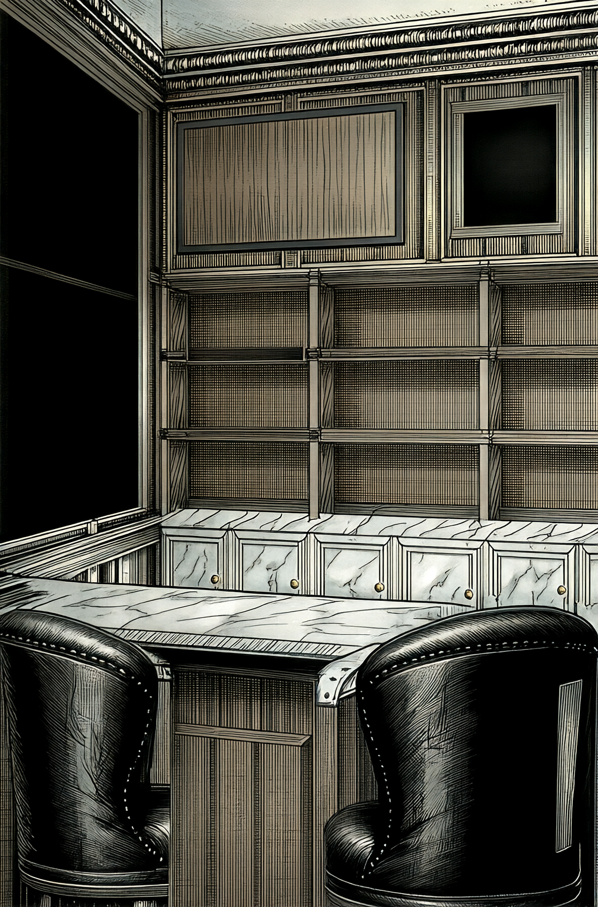

**The thinking.** The model's full-plate output for this part before it is cut by the mask.

**Prompt.** [prompts/109-television-blank-seed-44-raw-render.prompt.txt](prompts/109-television-blank-seed-44-raw-render.prompt.txt)

*Logged 11:19.*

---

## 110. television-blank-seed-44-laid-in-full-plate

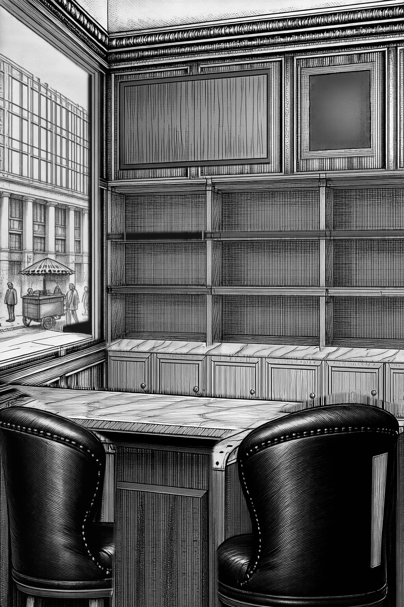

**The thinking.** Rendered in context: the plate as it stood behind this part, with only this part's own silhouette blocked in as flat values, so the pen, the light and the perspective are inherited from its neighbours; only the part's mask is laid back. Nothing else in the picture moves.

**Prompt.** [prompts/110-television-blank-seed-44-laid-in-full-plate.prompt.txt](prompts/110-television-blank-seed-44-laid-in-full-plate.prompt.txt)

*Logged 11:19.*

---

## 111. comparison-sheet-tv-sweep2

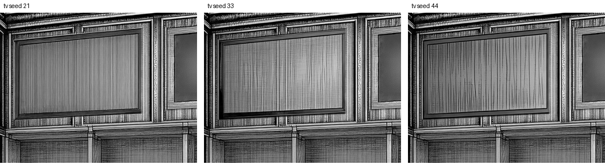

**The thinking.** Candidates side by side; the pick is made by eye against the founder's notes.

*Logged 11:19.*

---

## 112. whole-plate-foggier-pane-arched-sign-television-drawn-in-code

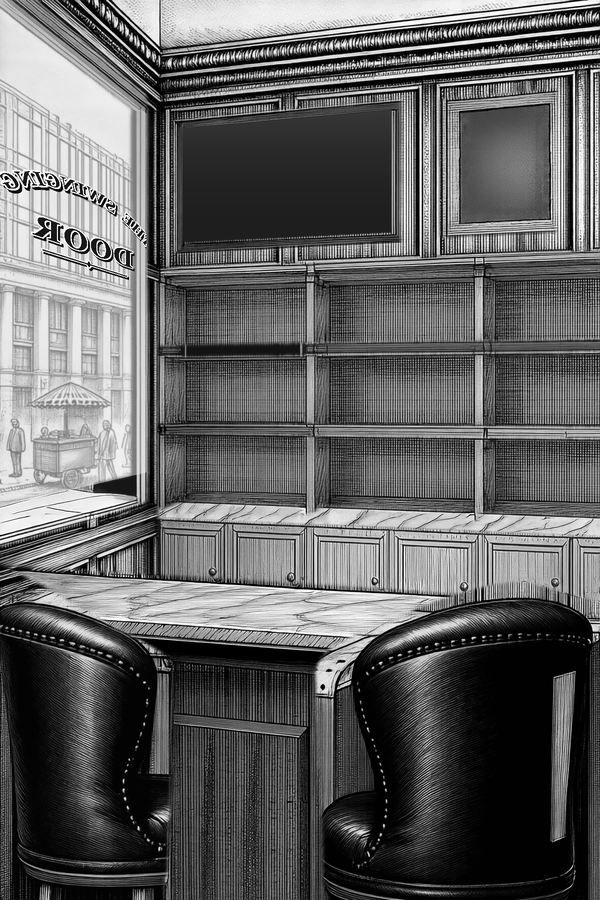

**The ask.** Foggier; fix the TV; research the sign.

**The thinking.** Gilded window lettering is backed with paint, so from inside you read the black backing; the arched layout is the signwriter's. Six seeds would not render the TV dark, so its blank screen is drawn in code into the measured quad.

*Logged 11:19.*

---

