# The Swinging Door - studio report, 2026-09-05

## Highlight of the day

The founder's pick: the floating-slab back bar (C slab, seed 7) - 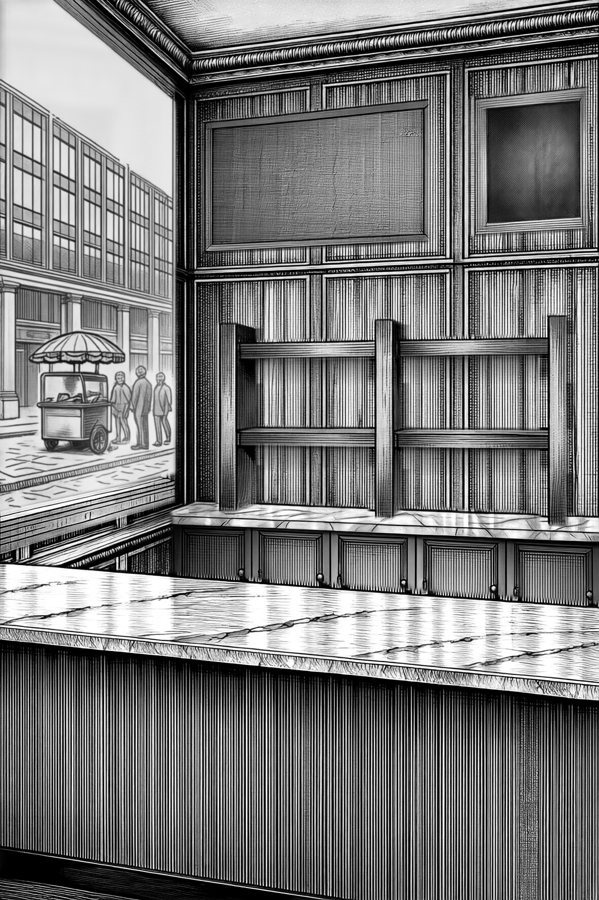

Built for Rick. Every image the studio generated today, in the order it happened, with the ask that drove it, the thinking behind the decision, the exact prompt and settings, and the verdict. Images are in `images/`, prompts in `prompts/`.

## 001. base-walls-crown-floor-seed-21-raw-render

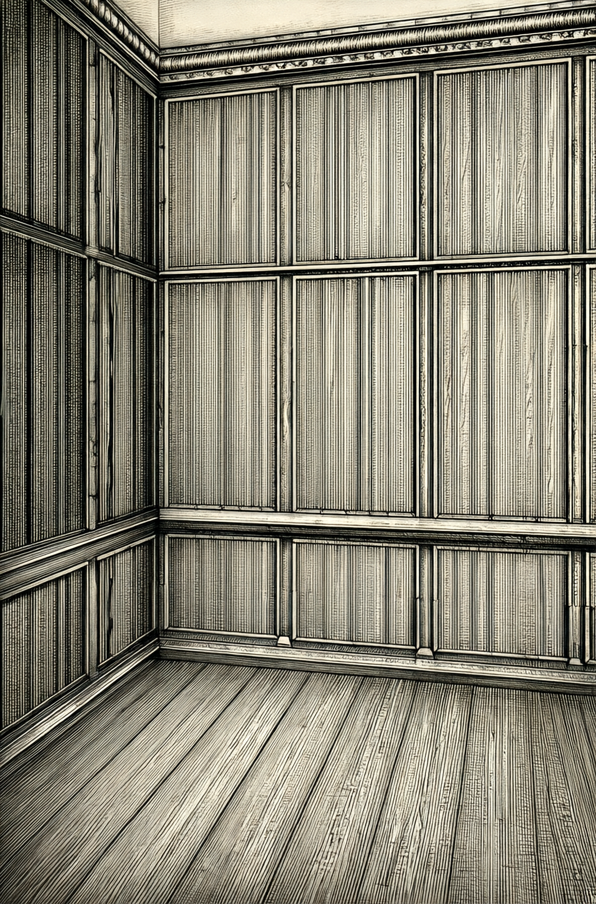

**The thinking.** The model's full-plate output for this part before it is cut by the mask.

**Prompt.** [prompts/001-base-walls-crown-floor-seed-21-raw-render.prompt.txt](prompts/001-base-walls-crown-floor-seed-21-raw-render.prompt.txt)

*Logged 11:19.*

---

## 002. base-walls-crown-floor-seed-21-levelled-preview

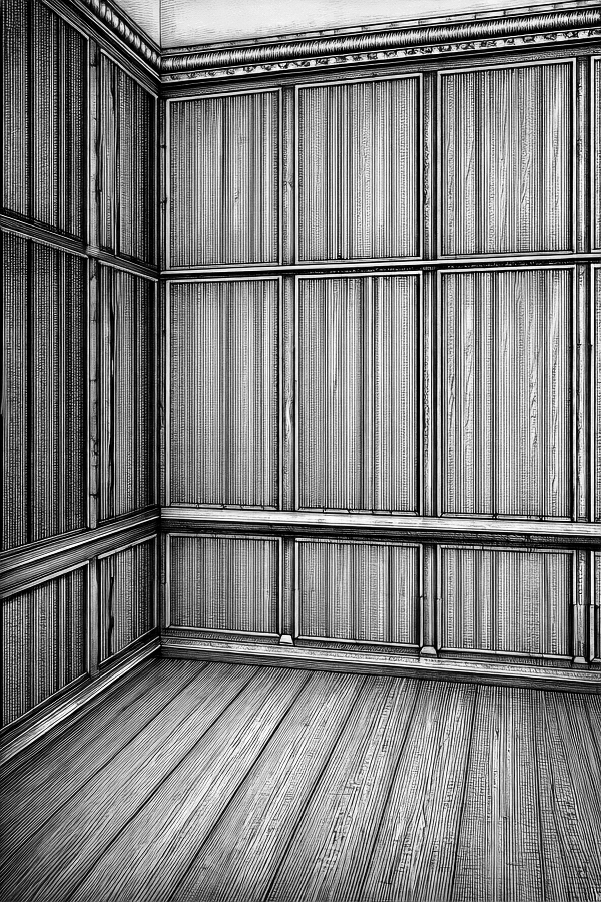

**The thinking.** Rendered in context: the plate as it stood behind this part, with only this part's own silhouette blocked in as flat values, so the pen, the light and the perspective are inherited from its neighbours; only the part's mask is laid back. Nothing else in the picture moves.

**Prompt.** [prompts/002-base-walls-crown-floor-seed-21-levelled-preview.prompt.txt](prompts/002-base-walls-crown-floor-seed-21-levelled-preview.prompt.txt)

*Logged 11:19.*

---

## 003. back-bar-lower-shelf-seed-4-raw-render

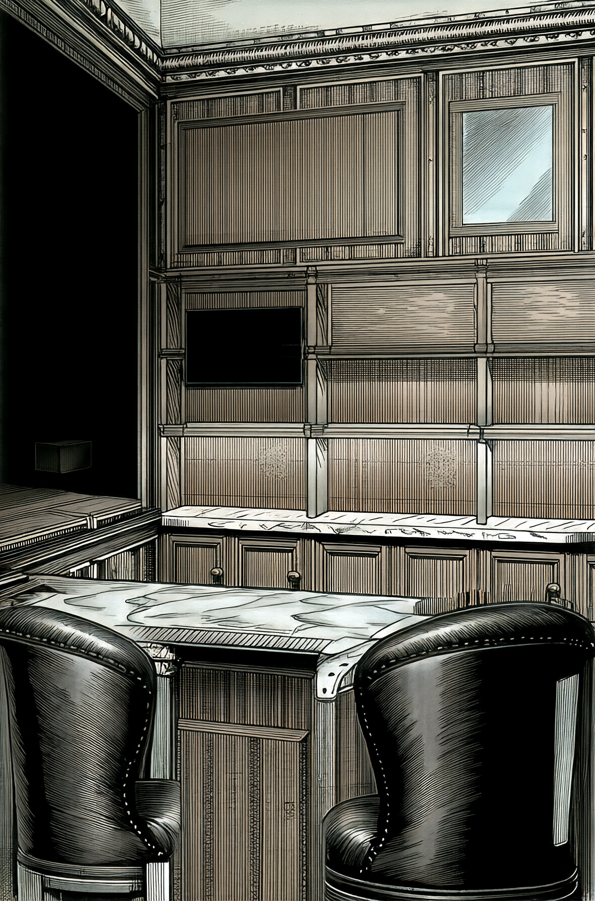

**The thinking.** The model's full-plate output for this part before it is cut by the mask.

**Prompt.** [prompts/003-back-bar-lower-shelf-seed-4-raw-render.prompt.txt](prompts/003-back-bar-lower-shelf-seed-4-raw-render.prompt.txt)

*Logged 11:19.*

---

## 004. back-bar-lower-shelf-seed-4-laid-in-full-plate

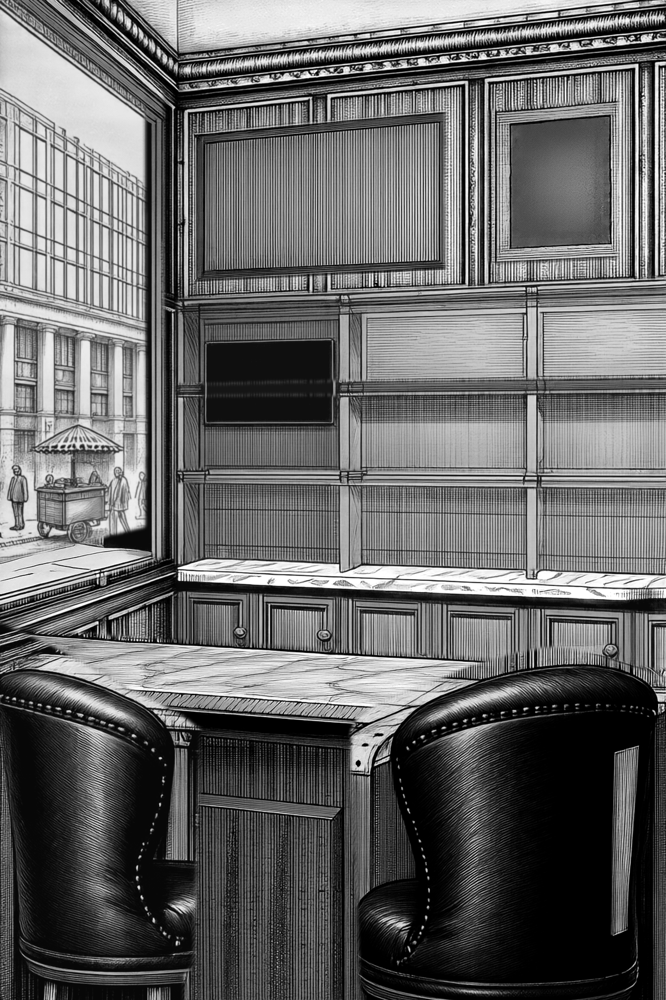

**The thinking.** Rendered in context: the plate as it stood behind this part, with only this part's own silhouette blocked in as flat values, so the pen, the light and the perspective are inherited from its neighbours; only the part's mask is laid back. Nothing else in the picture moves.

**Prompt.** [prompts/004-back-bar-lower-shelf-seed-4-laid-in-full-plate.prompt.txt](prompts/004-back-bar-lower-shelf-seed-4-laid-in-full-plate.prompt.txt)

*Logged 11:19.*

---

## 005. main-bar-marble-counter-seed-7-raw-render

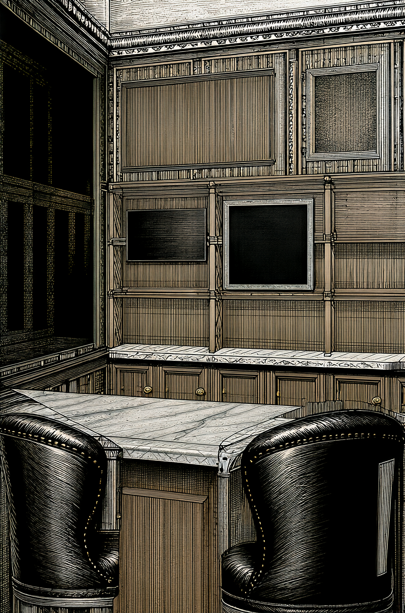

**The thinking.** The model's full-plate output for this part before it is cut by the mask.

**Prompt.** [prompts/005-main-bar-marble-counter-seed-7-raw-render.prompt.txt](prompts/005-main-bar-marble-counter-seed-7-raw-render.prompt.txt)

*Logged 11:19.*

---

## 006. main-bar-marble-counter-seed-7-laid-in-full-plate

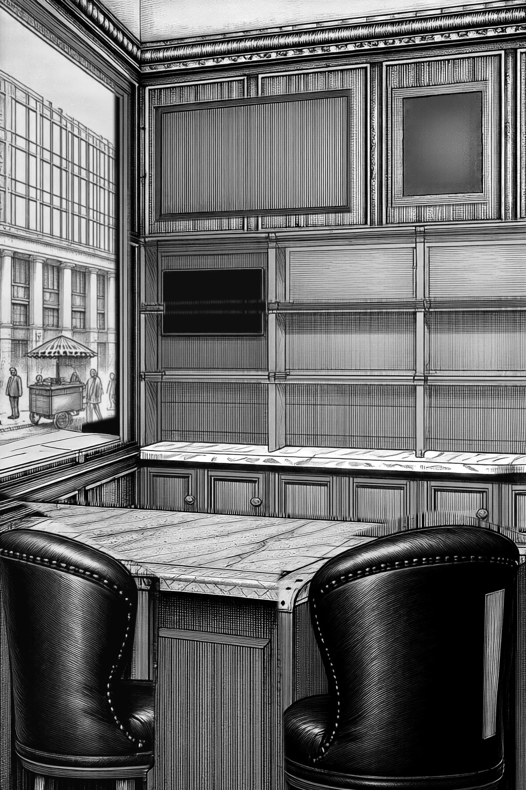

**The thinking.** Rendered in context: the plate as it stood behind this part, with only this part's own silhouette blocked in as flat values, so the pen, the light and the perspective are inherited from its neighbours; only the part's mask is laid back. Nothing else in the picture moves.

**Prompt.** [prompts/006-main-bar-marble-counter-seed-7-laid-in-full-plate.prompt.txt](prompts/006-main-bar-marble-counter-seed-7-laid-in-full-plate.prompt.txt)

*Logged 11:19.*

---

## 007. left-leather-club-chair-seed-4-laid-in-full-plate

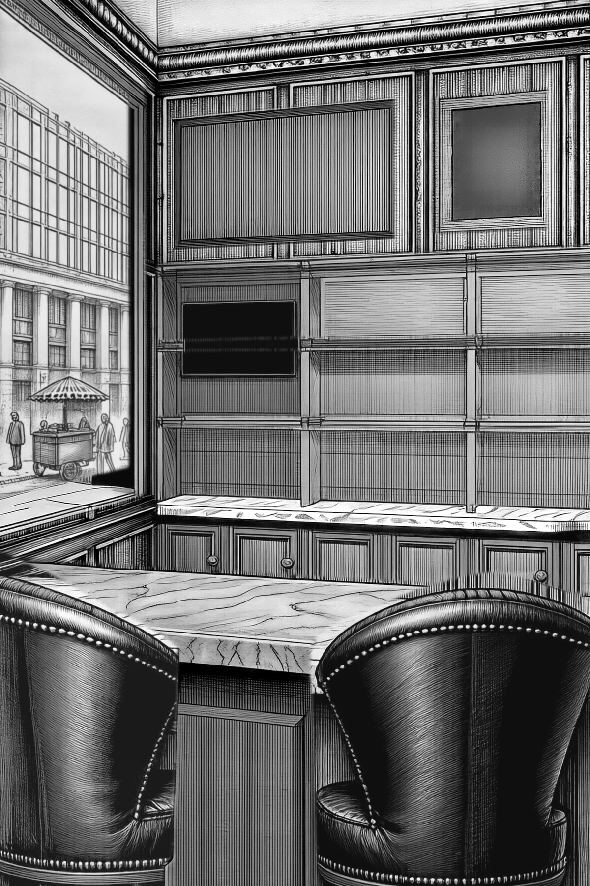

**The thinking.** Rendered in context: the plate as it stood behind this part, with only this part's own silhouette blocked in as flat values, so the pen, the light and the perspective are inherited from its neighbours; only the part's mask is laid back. Nothing else in the picture moves.

**Prompt.** [prompts/007-left-leather-club-chair-seed-4-laid-in-full-plate.prompt.txt](prompts/007-left-leather-club-chair-seed-4-laid-in-full-plate.prompt.txt)

*Logged 11:19.*

---

## 008. comparison-sheet-counter-sweep

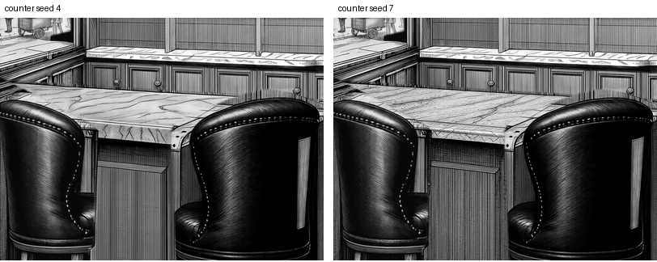

**The thinking.** Candidates side by side; the pick is made by eye against the founder's notes.

*Logged 11:19.*

---

## 009. back-bar-carcass-seed-4-raw-render

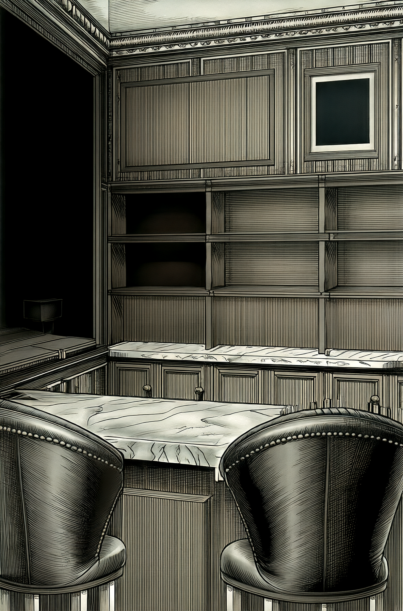

**The thinking.** The model's full-plate output for this part before it is cut by the mask.

**Prompt.** [prompts/009-back-bar-carcass-seed-4-raw-render.prompt.txt](prompts/009-back-bar-carcass-seed-4-raw-render.prompt.txt)

*Logged 11:19.*

---

## 010. back-bar-carcass-seed-4-laid-in-full-plate

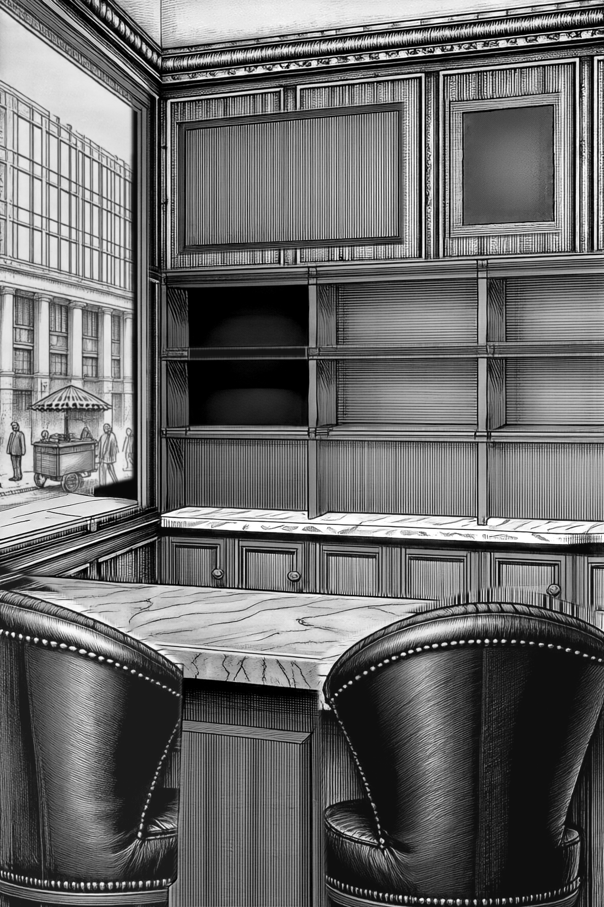

**The thinking.** Rendered in context: the plate as it stood behind this part, with only this part's own silhouette blocked in as flat values, so the pen, the light and the perspective are inherited from its neighbours; only the part's mask is laid back. Nothing else in the picture moves.

**Prompt.** [prompts/010-back-bar-carcass-seed-4-laid-in-full-plate.prompt.txt](prompts/010-back-bar-carcass-seed-4-laid-in-full-plate.prompt.txt)

*Logged 11:19.*

---

## 011. back-bar-carcass-seed-11-raw-render

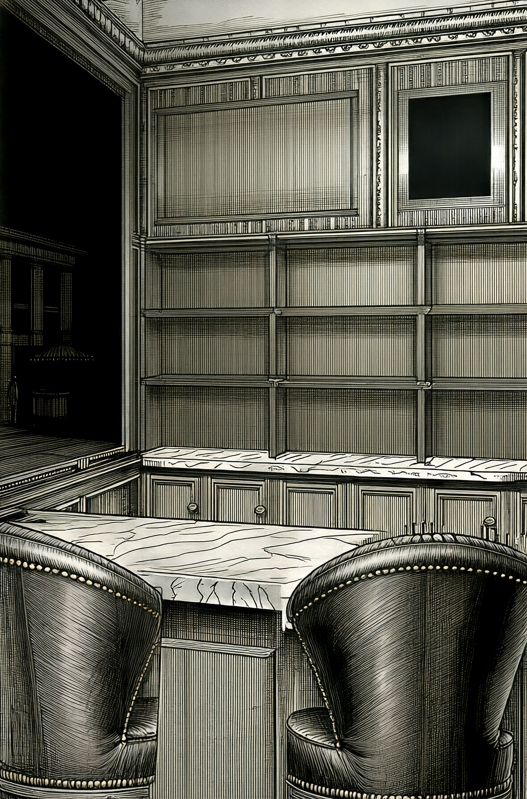

**The thinking.** The model's full-plate output for this part before it is cut by the mask.

**Prompt.** [prompts/011-back-bar-carcass-seed-11-raw-render.prompt.txt](prompts/011-back-bar-carcass-seed-11-raw-render.prompt.txt)

*Logged 11:19.*

---

## 012. back-bar-carcass-seed-11-laid-in-full-plate

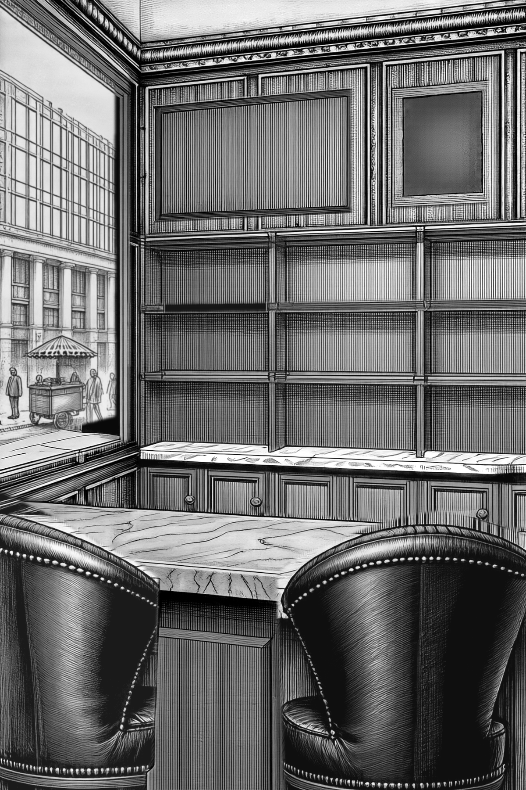

**The thinking.** Rendered in context: the plate as it stood behind this part, with only this part's own silhouette blocked in as flat values, so the pen, the light and the perspective are inherited from its neighbours; only the part's mask is laid back. Nothing else in the picture moves.

**Prompt.** [prompts/012-back-bar-carcass-seed-11-laid-in-full-plate.prompt.txt](prompts/012-back-bar-carcass-seed-11-laid-in-full-plate.prompt.txt)

*Logged 11:19.*

---

## 013. comparison-sheet-backbar-sweep

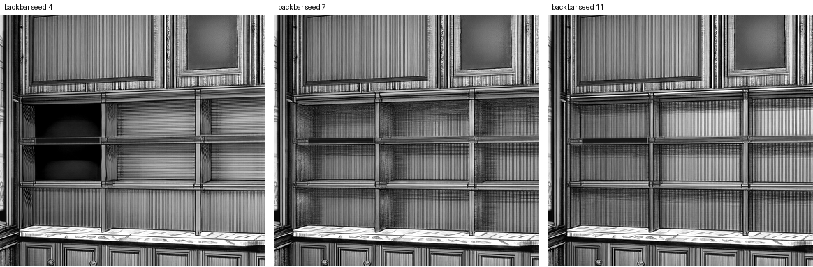

**The thinking.** Candidates side by side; the pick is made by eye against the founder's notes.

*Logged 11:19.*

---

## 014. whole-plate-pale-ceiling-one-crown-lit-shelving-moulded-ledge

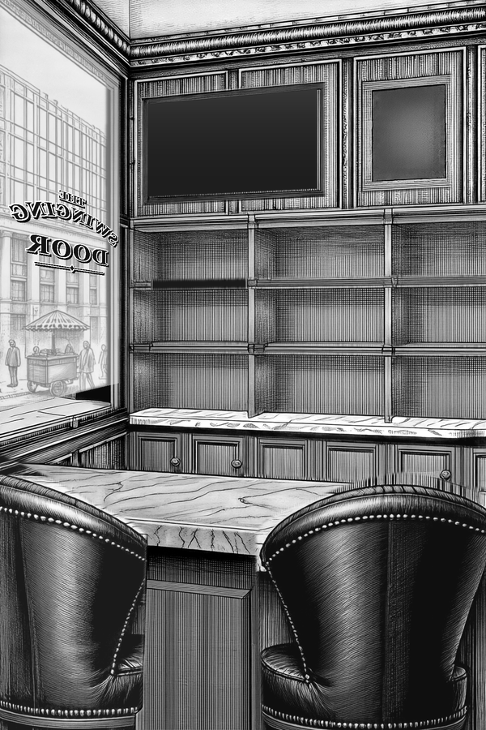

**The ask.** Fix the double crown moulding, make the ceiling a ceiling, light the shelves, edge the bartender's bar.

**The thinking.** Six crown members read as two cornices at this distance; the ceiling was a dark band; the compartments are graded and shadowed; the ledge gets the main bar's moulded edge.

**Prompt.** [prompts/014-whole-plate-pale-ceiling-one-crown-lit-shelving-moulded-ledge.prompt.txt](prompts/014-whole-plate-pale-ceiling-one-crown-lit-shelving-moulded-ledge.prompt.txt)

*Logged 11:19.*

---

## 015. cabinet-doors-under-ledge-seed-4-raw-render

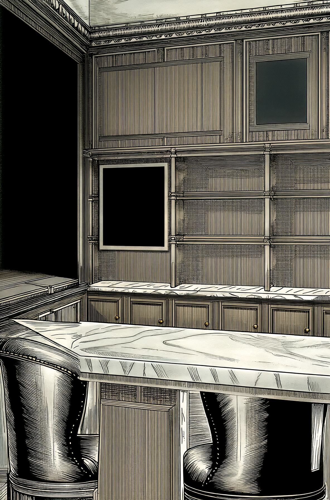

**The thinking.** The model's full-plate output for this part before it is cut by the mask.

**Prompt.** [prompts/015-cabinet-doors-under-ledge-seed-4-raw-render.prompt.txt](prompts/015-cabinet-doors-under-ledge-seed-4-raw-render.prompt.txt)

*Logged 11:19.*

---

## 016. cabinet-doors-under-ledge-seed-4-laid-in-full-plate

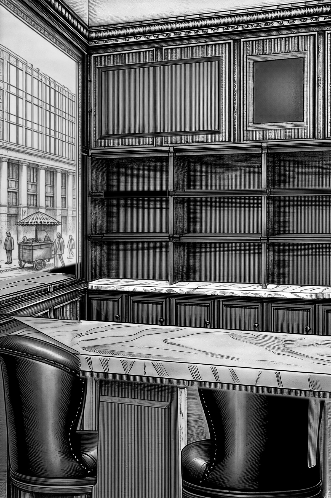

**The thinking.** Rendered in context: the plate as it stood behind this part, with only this part's own silhouette blocked in as flat values, so the pen, the light and the perspective are inherited from its neighbours; only the part's mask is laid back. Nothing else in the picture moves.

**Prompt.** [prompts/016-cabinet-doors-under-ledge-seed-4-laid-in-full-plate.prompt.txt](prompts/016-cabinet-doors-under-ledge-seed-4-laid-in-full-plate.prompt.txt)

*Logged 11:19.*

---

## 017. bartenders-marble-ledge-seed-4-raw-render

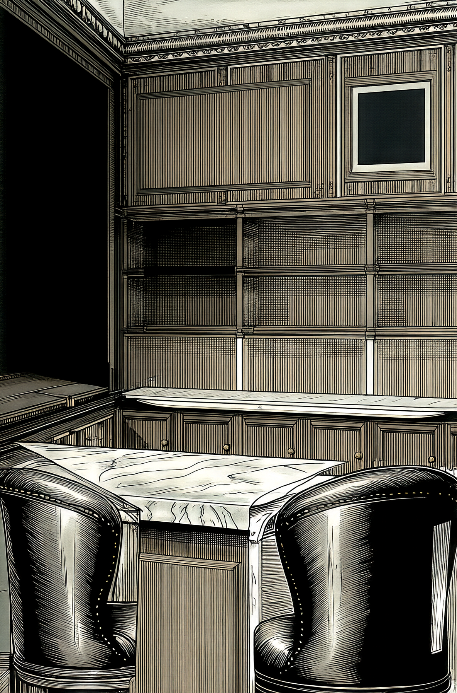

**The thinking.** The model's full-plate output for this part before it is cut by the mask.

**Prompt.** [prompts/017-bartenders-marble-ledge-seed-4-raw-render.prompt.txt](prompts/017-bartenders-marble-ledge-seed-4-raw-render.prompt.txt)

*Logged 11:19.*

---

## 018. bartenders-marble-ledge-seed-4-laid-in-full-plate

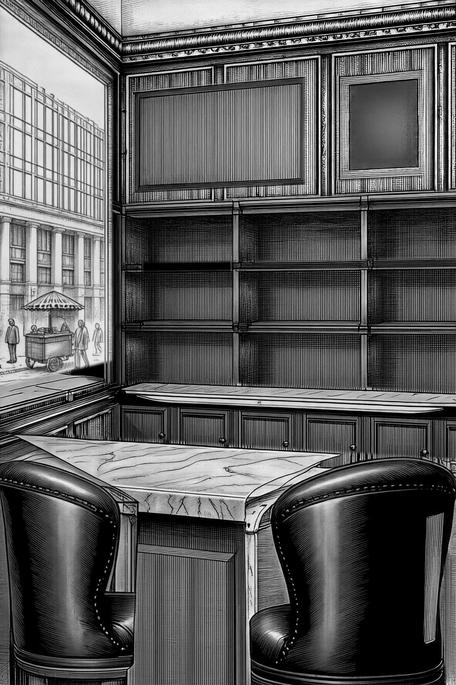

**The thinking.** Rendered in context: the plate as it stood behind this part, with only this part's own silhouette blocked in as flat values, so the pen, the light and the perspective are inherited from its neighbours; only the part's mask is laid back. Nothing else in the picture moves.

**Prompt.** [prompts/018-bartenders-marble-ledge-seed-4-laid-in-full-plate.prompt.txt](prompts/018-bartenders-marble-ledge-seed-4-laid-in-full-plate.prompt.txt)

*Logged 11:19.*

---

## 019. window-frame-and-reveal-seed-4-raw-render

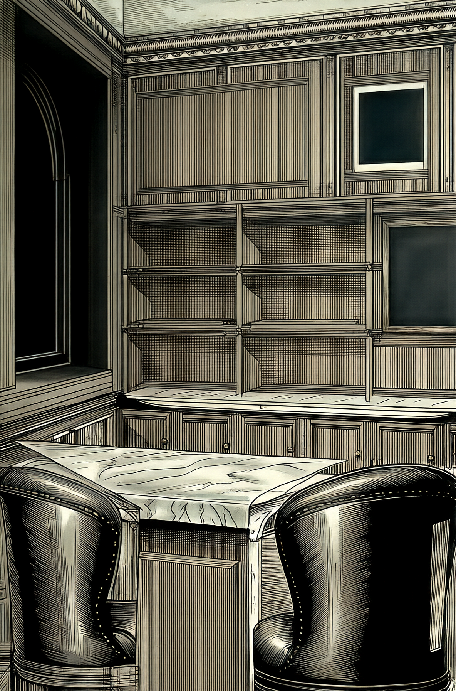

**The thinking.** The model's full-plate output for this part before it is cut by the mask.

**Prompt.** [prompts/019-window-frame-and-reveal-seed-4-raw-render.prompt.txt](prompts/019-window-frame-and-reveal-seed-4-raw-render.prompt.txt)

*Logged 11:19.*

---

## 020. window-frame-and-reveal-seed-4-laid-in-full-plate

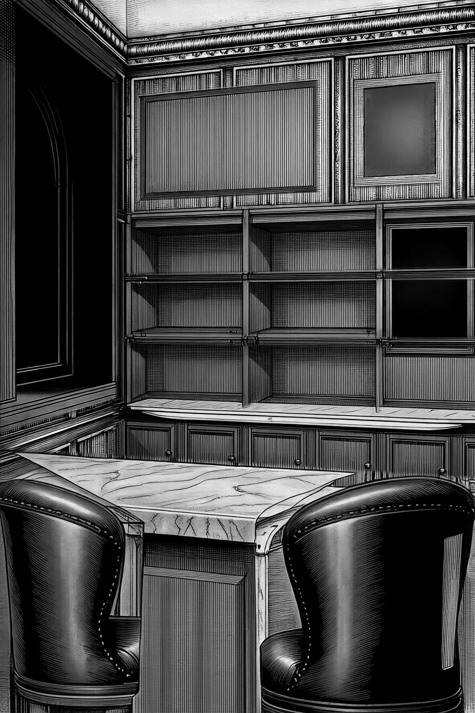

**The thinking.** Rendered in context: the plate as it stood behind this part, with only this part's own silhouette blocked in as flat values, so the pen, the light and the perspective are inherited from its neighbours; only the part's mask is laid back. Nothing else in the picture moves.

**Prompt.** [prompts/020-window-frame-and-reveal-seed-4-laid-in-full-plate.prompt.txt](prompts/020-window-frame-and-reveal-seed-4-laid-in-full-plate.prompt.txt)

*Logged 11:19.*

---

## 021. bar-alone-chairs-removed-first-attempt-stools-invented

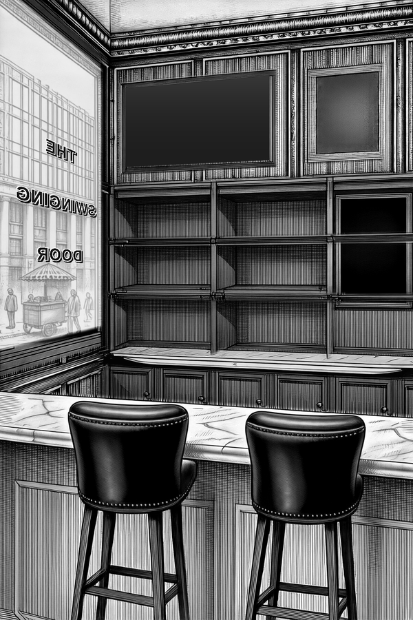

**The ask.** The chairs are affecting the bar; remove the chairs, perfect the bar, put them back.

**The thinking.** Masks were 'visible pixels', so the bar's mask was the bar minus the chairs and every chair change re-cut the bar. Now every part keeps its own full silhouette and the lay order occludes. But the prompt still described two chairs and the counter invented stools.

**Prompt.** [prompts/021-bar-alone-chairs-removed-first-attempt-stools-invented.prompt.txt](prompts/021-bar-alone-chairs-removed-first-attempt-stools-invented.prompt.txt)

*Logged 11:19.*

---

## 022. back-bar-carcass-seed-7-raw-render

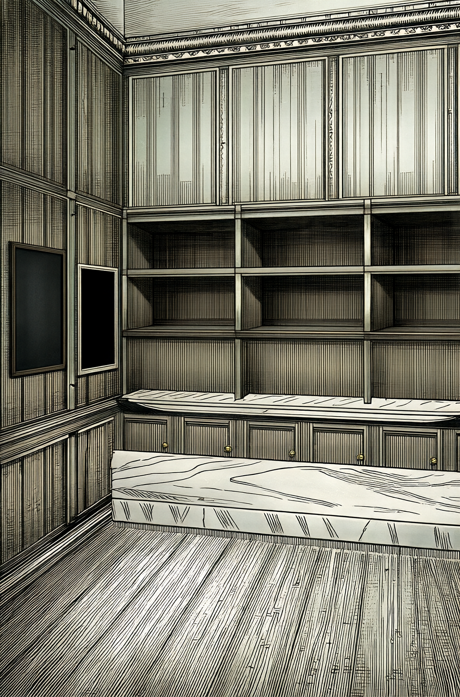

**The thinking.** The model's full-plate output for this part before it is cut by the mask.

**Prompt.** [prompts/022-back-bar-carcass-seed-7-raw-render.prompt.txt](prompts/022-back-bar-carcass-seed-7-raw-render.prompt.txt)

*Logged 11:19.*

---

## 023. back-bar-carcass-seed-7-laid-in-full-plate

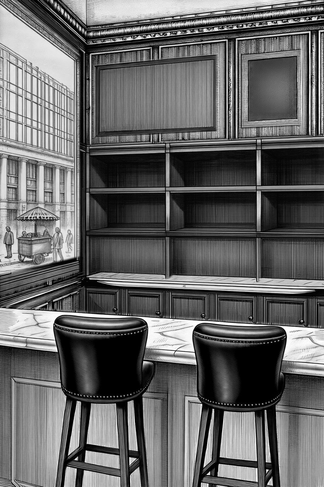

**The thinking.** Rendered in context: the plate as it stood behind this part, with only this part's own silhouette blocked in as flat values, so the pen, the light and the perspective are inherited from its neighbours; only the part's mask is laid back. Nothing else in the picture moves.

**Prompt.** [prompts/023-back-bar-carcass-seed-7-laid-in-full-plate.prompt.txt](prompts/023-back-bar-carcass-seed-7-laid-in-full-plate.prompt.txt)

*Logged 11:19.*

---

## 024. back-bar-lower-shelf-seed-7-raw-render

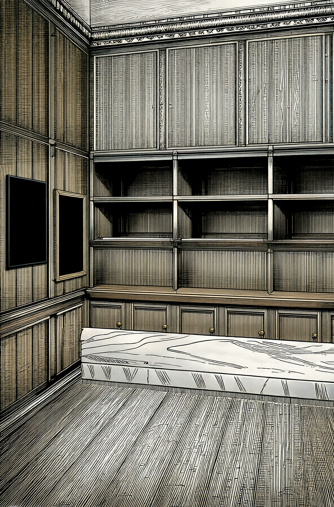

**The thinking.** The model's full-plate output for this part before it is cut by the mask.

**Prompt.** [prompts/024-back-bar-lower-shelf-seed-7-raw-render.prompt.txt](prompts/024-back-bar-lower-shelf-seed-7-raw-render.prompt.txt)

*Logged 11:19.*

---

## 025. back-bar-lower-shelf-seed-7-laid-in-full-plate

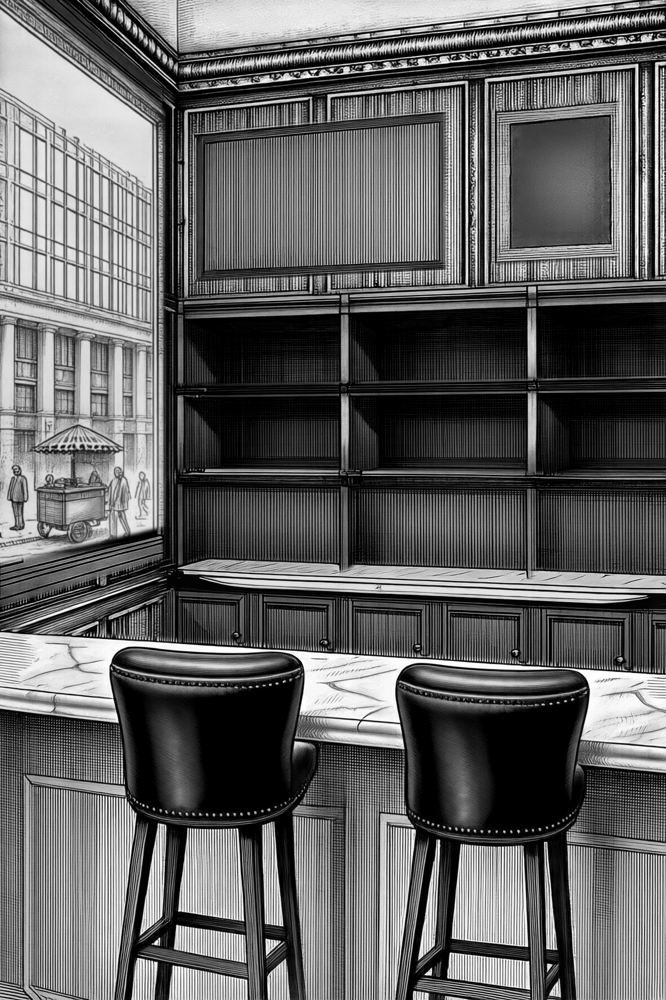

**The thinking.** Rendered in context: the plate as it stood behind this part, with only this part's own silhouette blocked in as flat values, so the pen, the light and the perspective are inherited from its neighbours; only the part's mask is laid back. Nothing else in the picture moves.

**Prompt.** [prompts/025-back-bar-lower-shelf-seed-7-laid-in-full-plate.prompt.txt](prompts/025-back-bar-lower-shelf-seed-7-laid-in-full-plate.prompt.txt)

*Logged 11:19.*

---

## 026. back-bar-upper-shelf-seed-4-raw-render

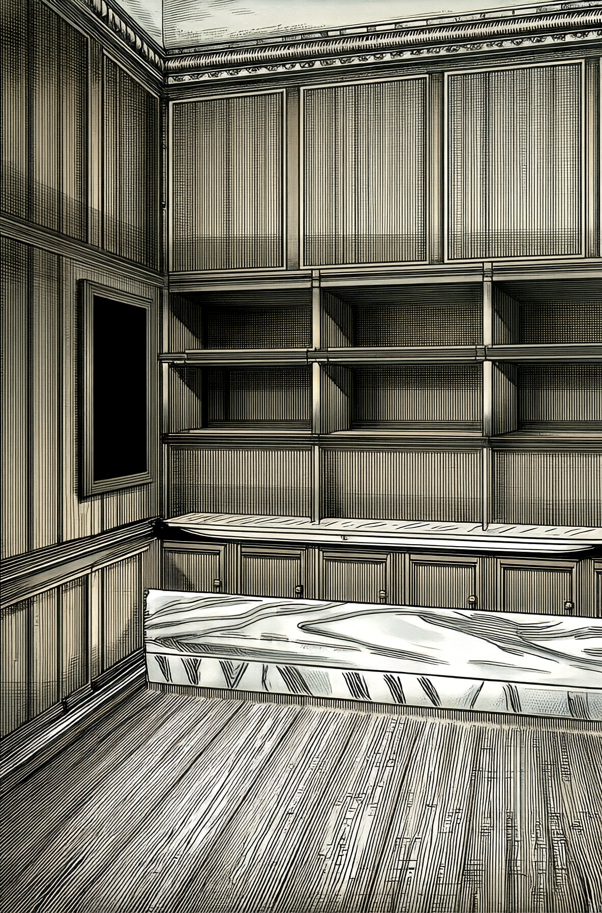

**The thinking.** The model's full-plate output for this part before it is cut by the mask.

**Prompt.** [prompts/026-back-bar-upper-shelf-seed-4-raw-render.prompt.txt](prompts/026-back-bar-upper-shelf-seed-4-raw-render.prompt.txt)

*Logged 11:19.*

---

## 027. back-bar-upper-shelf-seed-4-laid-in-full-plate

**The thinking.** Rendered in context: the plate as it stood behind this part, with only this part's own silhouette blocked in as flat values, so the pen, the light and the perspective are inherited from its neighbours; only the part's mask is laid back. Nothing else in the picture moves.

**Prompt.** [prompts/027-back-bar-upper-shelf-seed-4-laid-in-full-plate.prompt.txt](prompts/027-back-bar-upper-shelf-seed-4-laid-in-full-plate.prompt.txt)

*Logged 11:19.*

---

## 028. main-bar-marble-counter-seed-4-raw-render

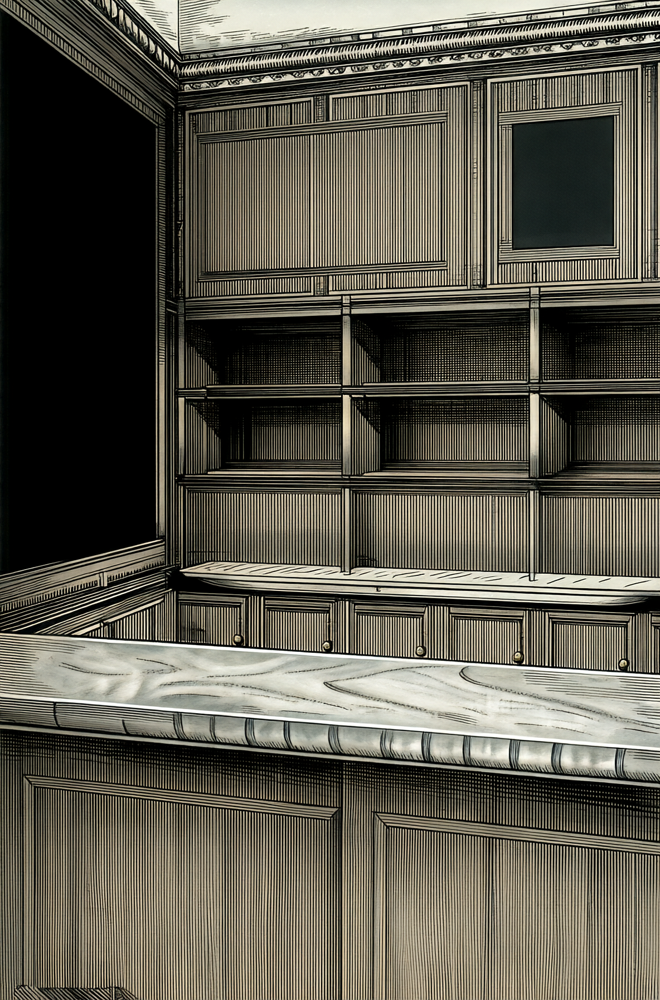

**The thinking.** The model's full-plate output for this part before it is cut by the mask.

**Prompt.** [prompts/028-main-bar-marble-counter-seed-4-raw-render.prompt.txt](prompts/028-main-bar-marble-counter-seed-4-raw-render.prompt.txt)

*Logged 11:19.*

---

## 029. main-bar-marble-counter-seed-4-laid-in-full-plate

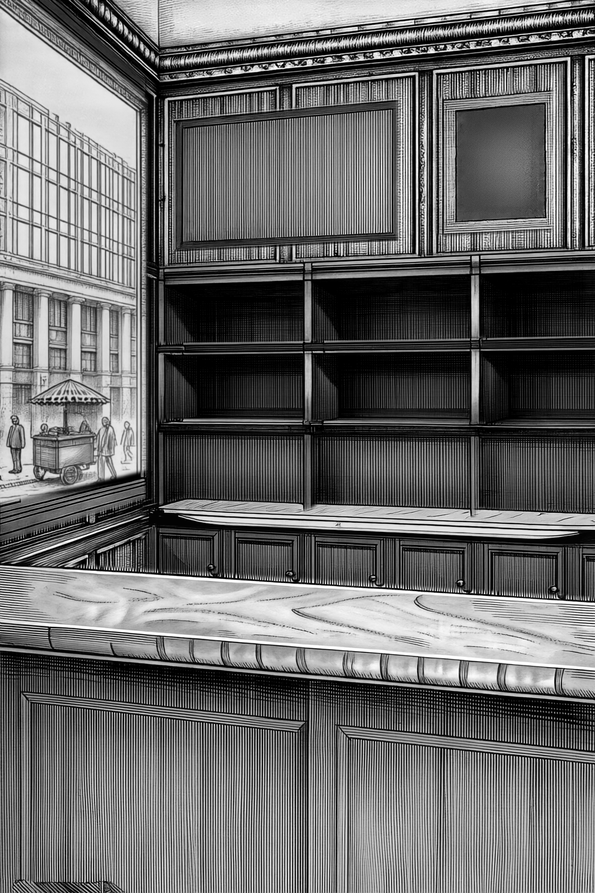

**The thinking.** Rendered in context: the plate as it stood behind this part, with only this part's own silhouette blocked in as flat values, so the pen, the light and the perspective are inherited from its neighbours; only the part's mask is laid back. Nothing else in the picture moves.

**Prompt.** [prompts/029-main-bar-marble-counter-seed-4-laid-in-full-plate.prompt.txt](prompts/029-main-bar-marble-counter-seed-4-laid-in-full-plate.prompt.txt)

*Logged 11:19.*

---

## 030. bar-alone-perfected-clean-marble-lip-open-shelving-no-echoes

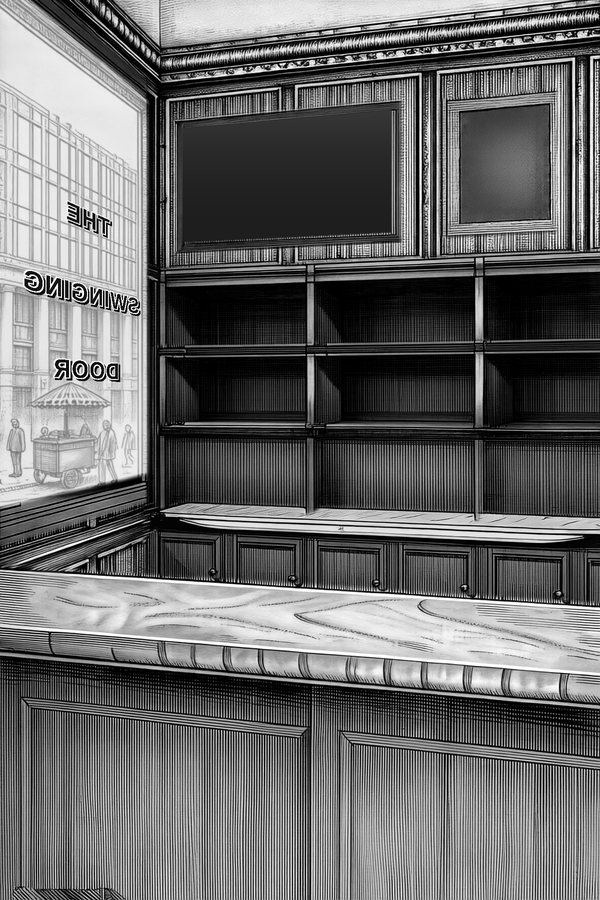

**The thinking.** Each part is conditioned only on the parts behind it, and the chair sentence is swapped out while the chair parts are off.

**Prompt.** [prompts/030-bar-alone-perfected-clean-marble-lip-open-shelving-no-echoes.prompt.txt](prompts/030-bar-alone-perfected-clean-marble-lip-open-shelving-no-echoes.prompt.txt)

**Verdict.** The bar is right; the chairs go back next.

*Logged 11:19.*

---

## 031. left-leather-club-chair-seed-4-raw-render

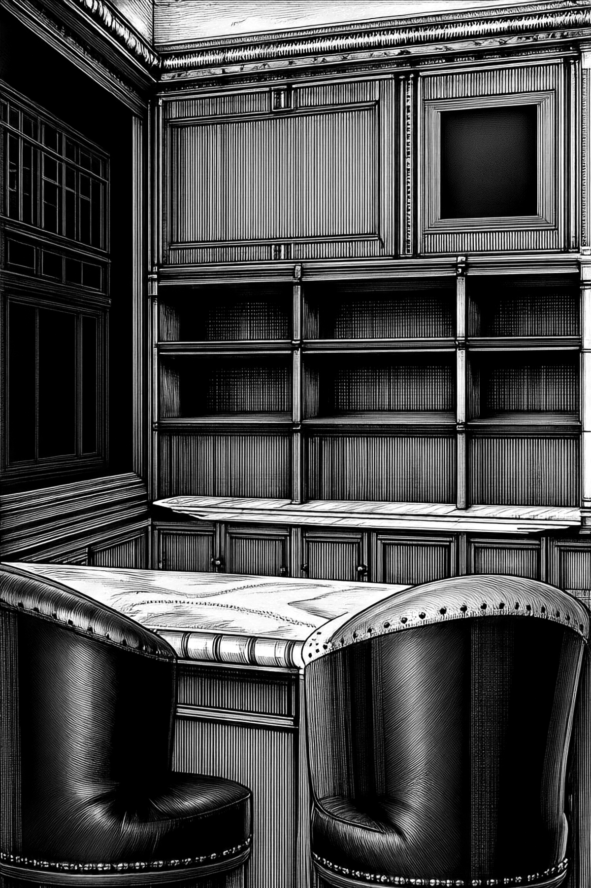

**The thinking.** The model's full-plate output for this part before it is cut by the mask.

**Prompt.** [prompts/031-left-leather-club-chair-seed-4-raw-render.prompt.txt](prompts/031-left-leather-club-chair-seed-4-raw-render.prompt.txt)

*Logged 11:19.*

---

## 032. whole-plate-chairs-back-on-over-the-perfected-bar

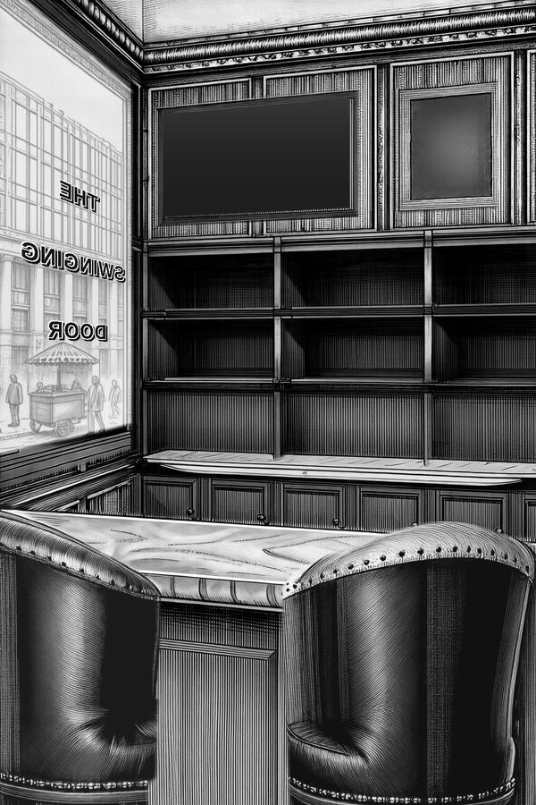

**The ask.** Put the chairs back.

**The thinking.** The pair rendered whole on the tall canvas and laid over the finished bar through their own silhouettes; the bar underneath did not change.

**Prompt.** [prompts/032-whole-plate-chairs-back-on-over-the-perfected-bar.prompt.txt](prompts/032-whole-plate-chairs-back-on-over-the-perfected-bar.prompt.txt)

*Logged 11:19.*

---

## 033. bartenders-marble-ledge render seed 4 laid in full plate

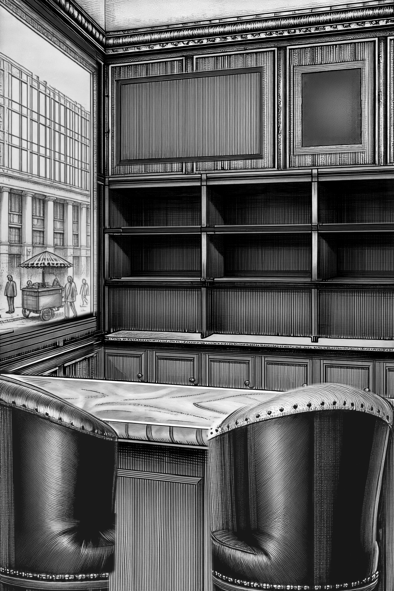

**The thinking.** Rendered in context - the plate as it stands behind this part, with only this part's own silhouette blocked in as values - so the pen, light and perspective are inherited; only the mask is laid back. Part note: the back bar's working ledge: a marble-topped counter at waist height running the width of the unit, its polished top pale and veined, its front a slim moulded marble edge, its back flush into the cabinet - empty, nothing standing on it

**Settings.** local/sensenova-u1.5, seed 4, full 40 steps cfg 4, negative: post, pole, column, pillar, tap, beer tap, pump, handle, bottle, glass, object on the counter, lamp, bullnose, rounded nosing, moulded edge, bolster, cushion, padded edge, heavy dark veins, cracked stone, bottles, bottle, glasses, decanters, objects on shelves, chair, stool, seat, barstool, furniture in the foreground, person

**Prompt.** [prompts/033-bartenders-marble-ledge-render-seed-4-laid-in-full-plate.prompt.txt](prompts/033-bartenders-marble-ledge-render-seed-4-laid-in-full-plate.prompt.txt)

*Logged 11:22.*

---

## 034. whole-plate assembled with cabinet-doors-under-ledge bartenders-marble-ledge back-bar-carcass back-bar-lower-shelf back-bar-upper-shelf television-blank chalkboard-blank window-frame-and-reveal window-glass-street-view main-bar-marble-counter left-leather-club-chair right-leather-club-chair and window-sign

**The thinking.** Base plus every approved, enabled part laid in order through its own silhouette; the TV's blank screen and the window's lettering are drawn in code last, because lettering is never left to the model.

*Logged 11:22.*

---

## 035. main-bar-marble-counter render seed 4 laid in full plate

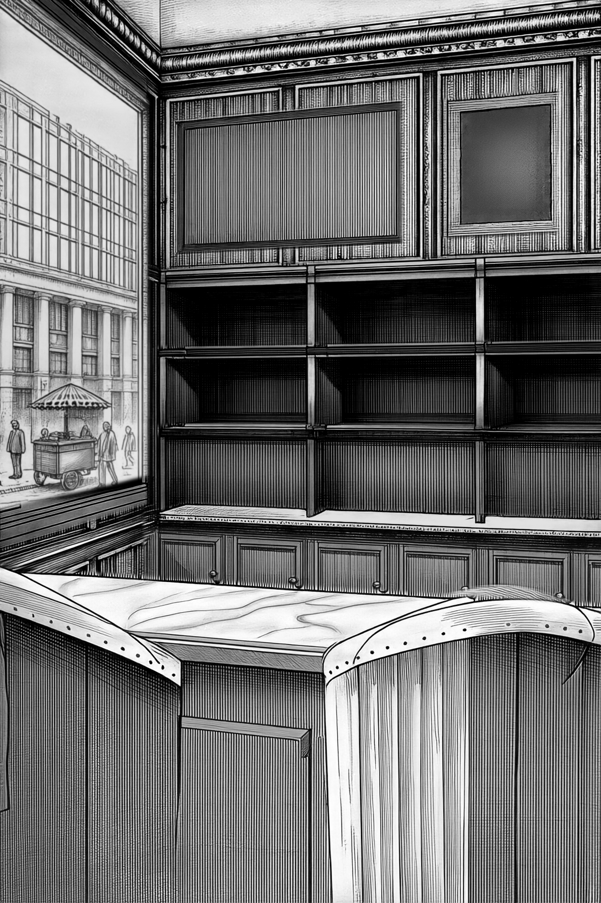

**The thinking.** Rendered in context - the plate as it stands behind this part, with only this part's own silhouette blocked in as values - so the pen, light and perspective are inherited; only the mask is laid back. Part note: the bar: the polished marble counter top, its slim moulded lip and the walnut-panelled bar front beneath it

**Settings.** local/sensenova-u1.5, seed 4, full 40 steps cfg 4, negative: post, pole, column, pillar, tap, beer tap, pump, handle, bottle, glass, object on the counter, lamp, bullnose, rounded nosing, moulded edge, bolster, cushion, padded edge, heavy dark veins, cracked stone, bottles, bottle, glasses, decanters, objects on shelves, chair, stool, seat, barstool, furniture in the foreground, person

**Prompt.** [prompts/035-main-bar-marble-counter-render-seed-4-laid-in-full-plate.prompt.txt](prompts/035-main-bar-marble-counter-render-seed-4-laid-in-full-plate.prompt.txt)

*Logged 11:22.*

---

## 036. whole-plate assembled with cabinet-doors-under-ledge bartenders-marble-ledge back-bar-carcass back-bar-lower-shelf back-bar-upper-shelf television-blank chalkboard-blank window-frame-and-reveal window-glass-street-view main-bar-marble-counter left-leather-club-chair right-leather-club-chair and window-sign

**The thinking.** Base plus every approved, enabled part laid in order through its own silhouette; the TV's blank screen and the window's lettering are drawn in code last, because lettering is never left to the model.

*Logged 11:23.*

---

## 037. whole-plate-both-bars-thin-square-edged-pale-marble-slabs-chairs-laid-over

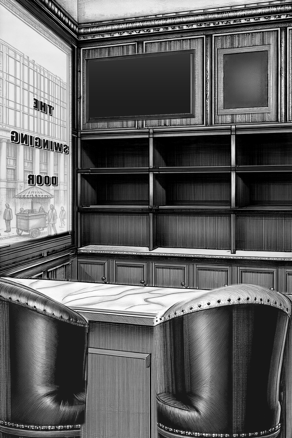

**The ask.** The edges of the bartender's bar and the main bar do not look good; both should be classy modern marble.

**The thinking.** Both lips were drawn as 7 cm moulded nosings, which the model rendered as padded bolsters with reeded ends - Victorian pub joinery. A modern marble bar is a thin polished slab with a clean square edge, so both lips are 4 cm, one plane, and the marble goes pale and finely veined; bullnose, bolster and heavy veins go into the negative. Only the ledge and the counter re-rendered; the chairs were laid over untouched, which is what the own-silhouette masks are for.

**Settings.** counter seed 4, ledge seed 4, full mode, conditioned on the parts behind them only

**Prompt.** [prompts/037-whole-plate-both-bars-thin-square-edged-pale-marble-slabs-chairs-laid-over.prompt.txt](prompts/037-whole-plate-both-bars-thin-square-edged-pale-marble-slabs-chairs-laid-over.prompt.txt)

**Verdict.** Both edges read as thin marble slabs; the bar under the chairs did not change.

*Logged 11:23.*

---

## 038. bars-close-up-main-bar-slab-edge-and-ledge-slab-edge-with-chairs

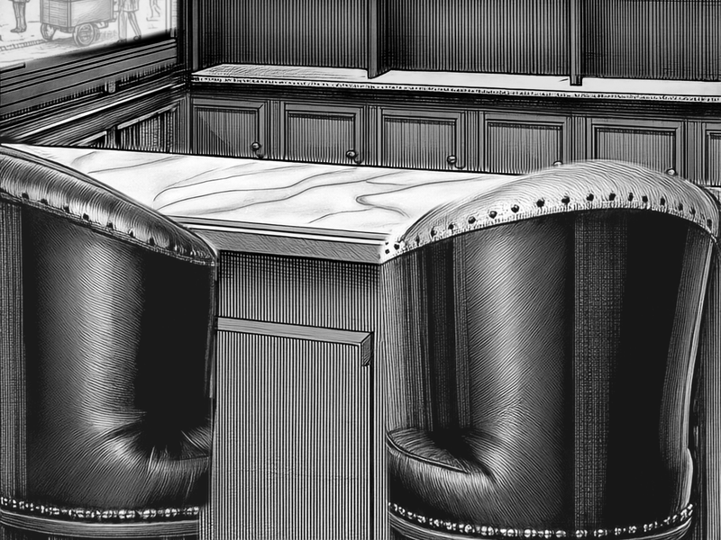

**The thinking.** The main bar's edge is one clean plane now; the ledge behind carries the same thin edge.

*Logged 11:23.*

---

## 039. window-close-up-sign-three-lines-compressed-heavy-face-wider-tracking

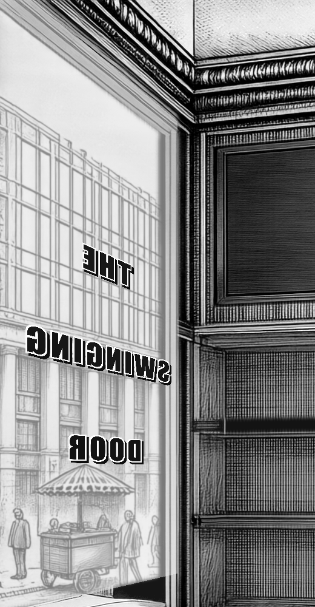

**The ask.** The sign's characters are too small and too close together.

**The thinking.** The box is re-solved from the pane's homography for this camera so it spans the whole visible pane; tracking is widened; a compressed heavy face (Impact) gives the tallest letters the width allows. The pane's width is the hard limit on size: more spacing costs size, and only a wider pane on screen - a few more degrees of pan - would buy both.

**Verdict.** Heavier and spaced; still bounded by the pane. The lever left is the camera.

*Logged 11:23.*

---

## 040. base-walls-crown-floor render seed 21 full plate

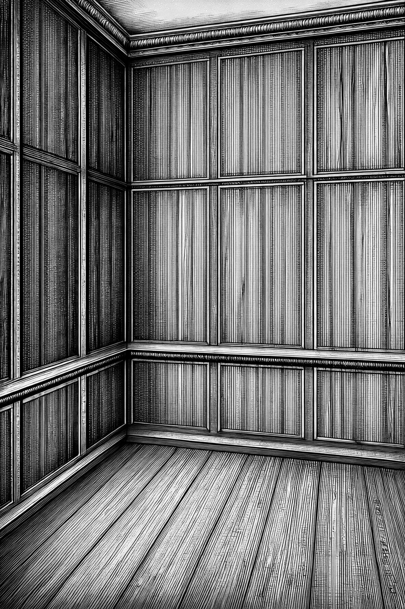

**The thinking.** The base is the architecture alone - walls, crown, floor - rendered from the construction's value drawing. Everything else is a part laid over it, so the base is chosen for its panelling and tone.

**Settings.** local/sensenova-u1.5, seed 21, full 40 steps cfg 4, levelled so the back wall's mean reads 112

**Prompt.** [prompts/040-base-walls-crown-floor-render-seed-21-full-plate.prompt.txt](prompts/040-base-walls-crown-floor-render-seed-21-full-plate.prompt.txt)

*Logged 12:01.*

---

## 041. whole-plate assembled with cabinet-doors-under-ledge bartenders-marble-ledge back-bar-carcass back-bar-lower-shelf back-bar-upper-shelf television-blank chalkboard-blank window-frame-and-reveal window-glass-street-view main-bar-marble-counter left-leather-club-chair right-leather-club-chair and window-sign

**The thinking.** Base plus every approved, enabled part laid in order through its own silhouette; the TV's blank screen and the window's lettering are drawn in code last, because lettering is never left to the model.

*Logged 12:02.*

---

## 042. cabinet-doors-under-ledge render seed 4 laid in full plate

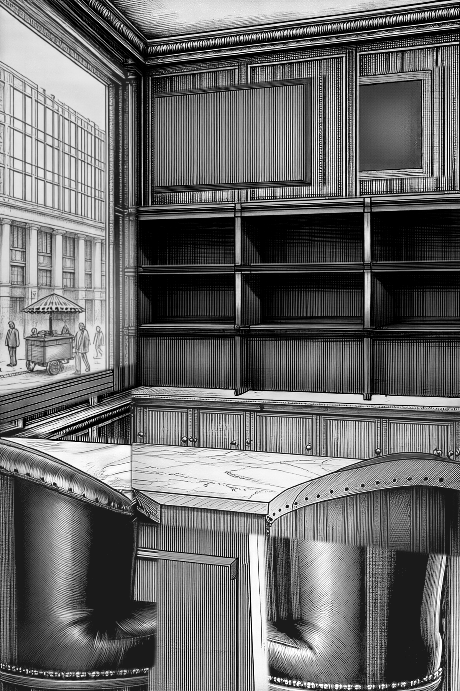

**The thinking.** Rendered in context - the plate as it stands behind this part, with only this part's own silhouette blocked in as values - so the pen, light and perspective are inherited; only the mask is laid back. Part note: the cabinets under the back bar's working ledge: a run of panelled walnut cupboard doors, each a raised-and-fielded panel with a small brass knob, down to a plinth

**Settings.** local/sensenova-u1.5, seed 4, full 40 steps cfg 4, negative: television, screen, monitor, black rectangle, picture, frame, poster, sign, lettering, bottles, glasses, bottles, bottle, glasses, decanters, objects on shelves, chair, stool, seat, barstool, furniture in the foreground, person

**Prompt.** [prompts/042-cabinet-doors-under-ledge-render-seed-4-laid-in-full-plate.prompt.txt](prompts/042-cabinet-doors-under-ledge-render-seed-4-laid-in-full-plate.prompt.txt)

*Logged 12:02.*

---

## 043. whole-plate assembled with cabinet-doors-under-ledge bartenders-marble-ledge back-bar-carcass back-bar-lower-shelf back-bar-upper-shelf television-blank chalkboard-blank window-frame-and-reveal window-glass-street-view main-bar-marble-counter left-leather-club-chair right-leather-club-chair and window-sign

**The thinking.** Base plus every approved, enabled part laid in order through its own silhouette; the TV's blank screen and the window's lettering are drawn in code last, because lettering is never left to the model.

*Logged 12:02.*

---

## 044. bartenders-marble-ledge render seed 4 laid in full plate

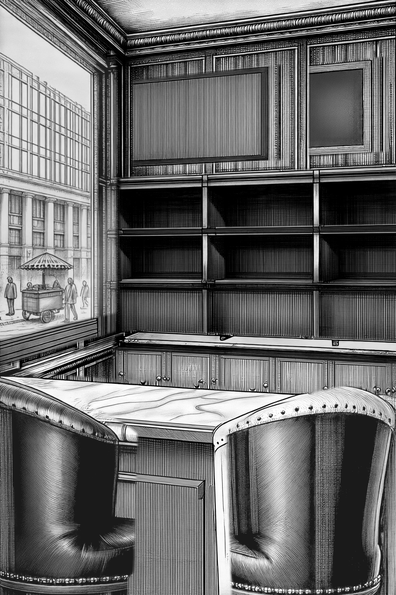

**The thinking.** Rendered in context - the plate as it stands behind this part, with only this part's own silhouette blocked in as values - so the pen, light and perspective are inherited; only the mask is laid back. Part note: the back bar's working ledge: a marble-topped counter at waist height running the width of the unit, its polished top pale and veined, its front a slim moulded marble edge, its back flush into the cabinet - empty, nothing standing on it

**Settings.** local/sensenova-u1.5, seed 4, full 40 steps cfg 4, negative: post, pole, column, pillar, tap, beer tap, pump, handle, bottle, glass, object on the counter, lamp, bullnose, rounded nosing, moulded edge, bolster, cushion, padded edge, heavy dark veins, cracked stone, bottles, bottle, glasses, decanters, objects on shelves, chair, stool, seat, barstool, furniture in the foreground, person

**Prompt.** [prompts/044-bartenders-marble-ledge-render-seed-4-laid-in-full-plate.prompt.txt](prompts/044-bartenders-marble-ledge-render-seed-4-laid-in-full-plate.prompt.txt)

*Logged 12:03.*

---

## 045. whole-plate assembled with cabinet-doors-under-ledge bartenders-marble-ledge back-bar-carcass back-bar-lower-shelf back-bar-upper-shelf television-blank chalkboard-blank window-frame-and-reveal window-glass-street-view main-bar-marble-counter left-leather-club-chair right-leather-club-chair and window-sign

**The thinking.** Base plus every approved, enabled part laid in order through its own silhouette; the TV's blank screen and the window's lettering are drawn in code last, because lettering is never left to the model.

*Logged 12:03.*

---

## 046. back-bar-carcass render seed 7 laid in full plate

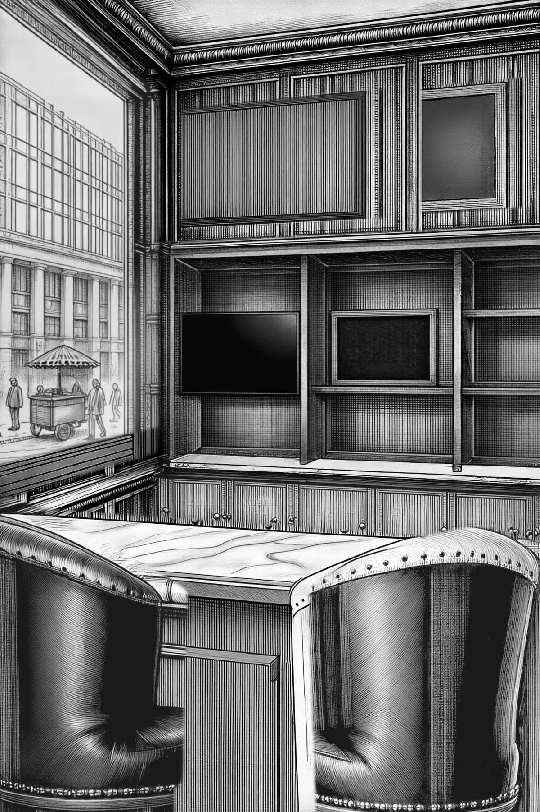

**The thinking.** Rendered in context - the plate as it stands behind this part, with only this part's own silhouette blocked in as values - so the pen, light and perspective are inherited; only the mask is laid back. Part note: the back bar's walnut carcass: a dark recessed back panel, two side cheeks, two internal uprights, a plinth rail and a moulded top rail

**Settings.** local/sensenova-u1.5, seed 7, full 40 steps cfg 4, negative: television, screen, monitor, black rectangle, picture, frame, poster, sign, lettering, bottles, glasses, bottles, bottle, glasses, decanters, objects on shelves, chair, stool, seat, barstool, furniture in the foreground, person

**Prompt.** [prompts/046-back-bar-carcass-render-seed-7-laid-in-full-plate.prompt.txt](prompts/046-back-bar-carcass-render-seed-7-laid-in-full-plate.prompt.txt)

*Logged 12:03.*

---

## 047. whole-plate assembled with cabinet-doors-under-ledge bartenders-marble-ledge back-bar-carcass back-bar-lower-shelf back-bar-upper-shelf television-blank chalkboard-blank window-frame-and-reveal window-glass-street-view main-bar-marble-counter left-leather-club-chair right-leather-club-chair and window-sign

**The thinking.** Base plus every approved, enabled part laid in order through its own silhouette; the TV's blank screen and the window's lettering are drawn in code last, because lettering is never left to the model.

*Logged 12:03.*

---

## 048. back-bar-lower-shelf render seed 7 laid in full plate

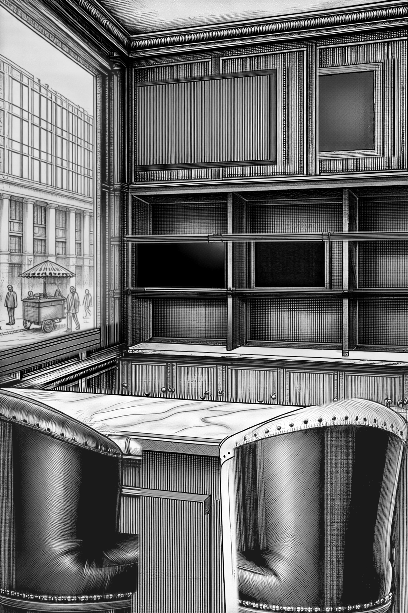

**The thinking.** Rendered in context - the plate as it stands behind this part, with only this part's own silhouette blocked in as values - so the pen, light and perspective are inherited; only the mask is laid back. Part note: the lower shelf of the back bar: a plain WALNUT board housed into the cheeks, its polished wood top catching the light - wood, not marble, not stone

**Settings.** local/sensenova-u1.5, seed 7, full 40 steps cfg 4, negative: television, screen, monitor, black rectangle, picture, frame, poster, sign, lettering, bottles, glasses, bottles, bottle, glasses, decanters, objects on shelves, chair, stool, seat, barstool, furniture in the foreground, person

**Prompt.** [prompts/048-back-bar-lower-shelf-render-seed-7-laid-in-full-plate.prompt.txt](prompts/048-back-bar-lower-shelf-render-seed-7-laid-in-full-plate.prompt.txt)

*Logged 12:04.*

---

## 049. whole-plate assembled with cabinet-doors-under-ledge bartenders-marble-ledge back-bar-carcass back-bar-lower-shelf back-bar-upper-shelf television-blank chalkboard-blank window-frame-and-reveal window-glass-street-view main-bar-marble-counter left-leather-club-chair right-leather-club-chair and window-sign

**The thinking.** Base plus every approved, enabled part laid in order through its own silhouette; the TV's blank screen and the window's lettering are drawn in code last, because lettering is never left to the model.

*Logged 12:04.*

---

## 050. back-bar-upper-shelf render seed 4 laid in full plate

**The thinking.** Rendered in context - the plate as it stands behind this part, with only this part's own silhouette blocked in as values - so the pen, light and perspective are inherited; only the mask is laid back. Part note: the upper walnut shelf of the back bar, housed into the cheeks, seen from a little below

**Settings.** local/sensenova-u1.5, seed 4, full 40 steps cfg 4, negative: television, screen, monitor, black rectangle, picture, frame, poster, sign, lettering, bottles, glasses, bottles, bottle, glasses, decanters, objects on shelves, chair, stool, seat, barstool, furniture in the foreground, person

**Prompt.** [prompts/050-back-bar-upper-shelf-render-seed-4-laid-in-full-plate.prompt.txt](prompts/050-back-bar-upper-shelf-render-seed-4-laid-in-full-plate.prompt.txt)

*Logged 12:04.*

---

## 051. whole-plate assembled with cabinet-doors-under-ledge bartenders-marble-ledge back-bar-carcass back-bar-lower-shelf back-bar-upper-shelf television-blank chalkboard-blank window-frame-and-reveal window-glass-street-view main-bar-marble-counter left-leather-club-chair right-leather-club-chair and window-sign

**The thinking.** Base plus every approved, enabled part laid in order through its own silhouette; the TV's blank screen and the window's lettering are drawn in code last, because lettering is never left to the model.

*Logged 12:05.*

---

## 052. television-blank render seed 11 laid in full plate

**The thinking.** Rendered in context - the plate as it stands behind this part, with only this part's own silhouette blocked in as values - so the pen, light and perspective are inherited; only the mask is laid back. Part note: the switched-off flat-screen television in a slim matte-black frame, flush on the panelling

**Settings.** local/sensenova-u1.5, seed 11, full 40 steps cfg 4, negative: bottles, bottle, glasses, decanters, objects on shelves, chair, stool, seat, barstool, furniture in the foreground, person

**Prompt.** [prompts/052-television-blank-render-seed-11-laid-in-full-plate.prompt.txt](prompts/052-television-blank-render-seed-11-laid-in-full-plate.prompt.txt)

*Logged 12:05.*

---

## 053. whole-plate assembled with cabinet-doors-under-ledge bartenders-marble-ledge back-bar-carcass back-bar-lower-shelf back-bar-upper-shelf television-blank chalkboard-blank window-frame-and-reveal window-glass-street-view main-bar-marble-counter left-leather-club-chair right-leather-club-chair and window-sign

**The thinking.** Base plus every approved, enabled part laid in order through its own silhouette; the TV's blank screen and the window's lettering are drawn in code last, because lettering is never left to the model.

*Logged 12:05.*

---

## 054. chalkboard-blank render seed 4 laid in full plate

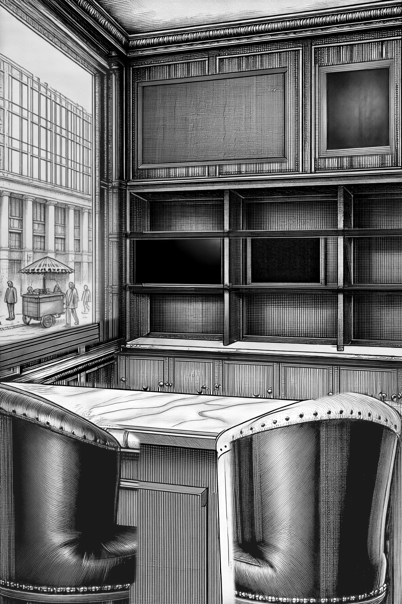

**The thinking.** Rendered in context - the plate as it stands behind this part, with only this part's own silhouette blocked in as values - so the pen, light and perspective are inherited; only the mask is laid back. Part note: the chalkboard in its plain wooden frame, its slate matt black and unmarked

**Settings.** local/sensenova-u1.5, seed 4, full 40 steps cfg 4, negative: bottles, bottle, glasses, decanters, objects on shelves, chair, stool, seat, barstool, furniture in the foreground, person

**Prompt.** [prompts/054-chalkboard-blank-render-seed-4-laid-in-full-plate.prompt.txt](prompts/054-chalkboard-blank-render-seed-4-laid-in-full-plate.prompt.txt)

*Logged 12:06.*

---

## 055. whole-plate assembled with cabinet-doors-under-ledge bartenders-marble-ledge back-bar-carcass back-bar-lower-shelf back-bar-upper-shelf television-blank chalkboard-blank window-frame-and-reveal window-glass-street-view main-bar-marble-counter left-leather-club-chair right-leather-club-chair and window-sign

**The thinking.** Base plus every approved, enabled part laid in order through its own silhouette; the TV's blank screen and the window's lettering are drawn in code last, because lettering is never left to the model.

*Logged 12:06.*

---

## 056. window-frame-and-reveal render seed 4 laid in full plate

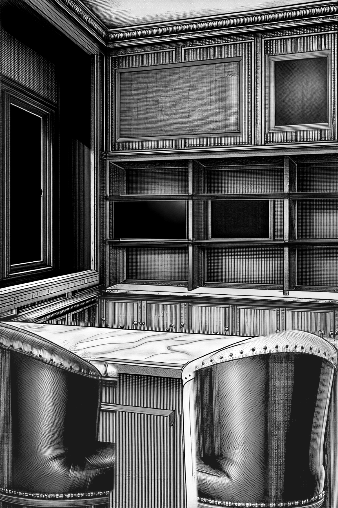

**The thinking.** Rendered in context - the plate as it stands behind this part, with only this part's own silhouette blocked in as values - so the pen, light and perspective are inherited; only the mask is laid back. Part note: the window's joinery: the opening cut through the panelled wall, its reveal, the wide architrave on the room face and, stepped back inside the reveal, the dark sash frame that holds the single pane

**Settings.** local/sensenova-u1.5, seed 4, full 40 steps cfg 4, negative: bottles, bottle, glasses, decanters, objects on shelves, chair, stool, seat, barstool, furniture in the foreground, person

**Prompt.** [prompts/056-window-frame-and-reveal-render-seed-4-laid-in-full-plate.prompt.txt](prompts/056-window-frame-and-reveal-render-seed-4-laid-in-full-plate.prompt.txt)

*Logged 12:06.*

---

## 057. whole-plate assembled with cabinet-doors-under-ledge bartenders-marble-ledge back-bar-carcass back-bar-lower-shelf back-bar-upper-shelf television-blank chalkboard-blank window-frame-and-reveal window-glass-street-view main-bar-marble-counter left-leather-club-chair right-leather-club-chair and window-sign

**The thinking.** Base plus every approved, enabled part laid in order through its own silhouette; the TV's blank screen and the window's lettering are drawn in code last, because lettering is never left to the model.

*Logged 12:06.*

---

## 058. window-glass-street-view render seed 21 laid in full plate

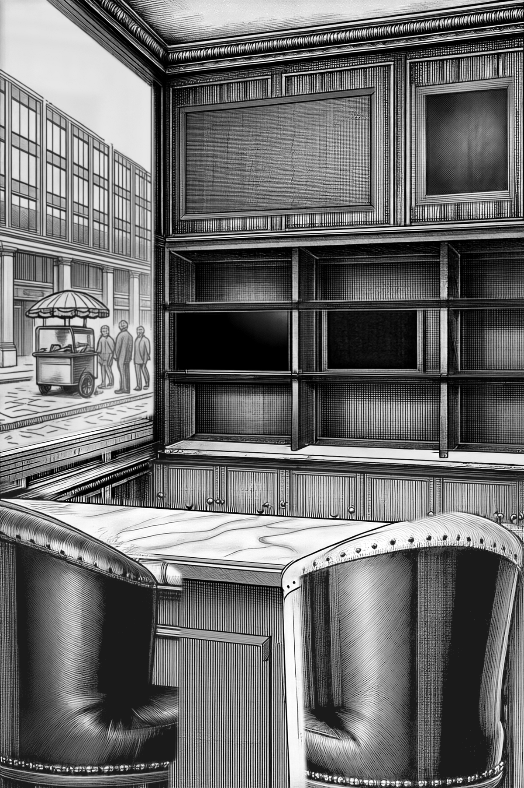

**The thinking.** Rendered in context - the plate as it stands behind this part, with only this part's own silhouette blocked in as values - so the pen, light and perspective are inherited; only the mask is laid back. Part note: the view through the window: the street, the building opposite, the hot dog cart and the people

**Settings.** local/sensenova-u1.5, seed 21, full 40 steps cfg 4, negative: text, letters, words, lettering, signage, sign, numbers, typography, writing, inscription, shop name, banner, poster, bottles, bottle, glasses, decanters, objects on shelves, chair, stool, seat, barstool, furniture in the foreground, person

**Prompt.** [prompts/058-window-glass-street-view-render-seed-21-laid-in-full-plate.prompt.txt](prompts/058-window-glass-street-view-render-seed-21-laid-in-full-plate.prompt.txt)

*Logged 12:07.*

---

## 059. whole-plate assembled with cabinet-doors-under-ledge bartenders-marble-ledge back-bar-carcass back-bar-lower-shelf back-bar-upper-shelf television-blank chalkboard-blank window-frame-and-reveal window-glass-street-view main-bar-marble-counter left-leather-club-chair right-leather-club-chair and window-sign

**The thinking.** Base plus every approved, enabled part laid in order through its own silhouette; the TV's blank screen and the window's lettering are drawn in code last, because lettering is never left to the model.

*Logged 12:07.*

---

## 060. main-bar-marble-counter render seed 4 laid in full plate

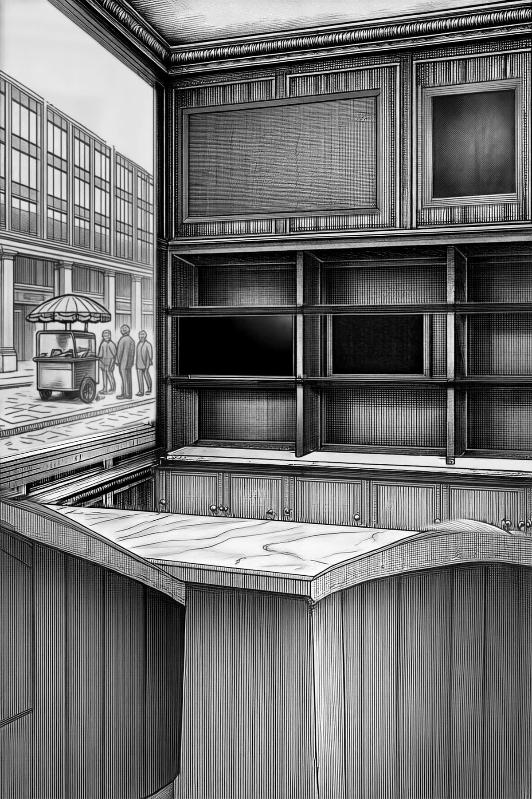

**The thinking.** Rendered in context - the plate as it stands behind this part, with only this part's own silhouette blocked in as values - so the pen, light and perspective are inherited; only the mask is laid back. Part note: the bar: the polished marble counter top, its slim moulded lip and the walnut-panelled bar front beneath it

**Settings.** local/sensenova-u1.5, seed 4, full 40 steps cfg 4, negative: post, pole, column, pillar, tap, beer tap, pump, handle, bottle, glass, object on the counter, lamp, bullnose, rounded nosing, moulded edge, bolster, cushion, padded edge, heavy dark veins, cracked stone, bottles, bottle, glasses, decanters, objects on shelves, chair, stool, seat, barstool, furniture in the foreground, person

**Prompt.** [prompts/060-main-bar-marble-counter-render-seed-4-laid-in-full-plate.prompt.txt](prompts/060-main-bar-marble-counter-render-seed-4-laid-in-full-plate.prompt.txt)

*Logged 12:08.*

---

## 061. whole-plate assembled with cabinet-doors-under-ledge bartenders-marble-ledge back-bar-carcass back-bar-lower-shelf back-bar-upper-shelf television-blank chalkboard-blank window-frame-and-reveal window-glass-street-view main-bar-marble-counter left-leather-club-chair right-leather-club-chair and window-sign

**The thinking.** Base plus every approved, enabled part laid in order through its own silhouette; the TV's blank screen and the window's lettering are drawn in code last, because lettering is never left to the model.

*Logged 12:08.*

---

## 062. left-leather-club-chair and right-leather-club-chair render seed 4 tall-canvas laid in full plate

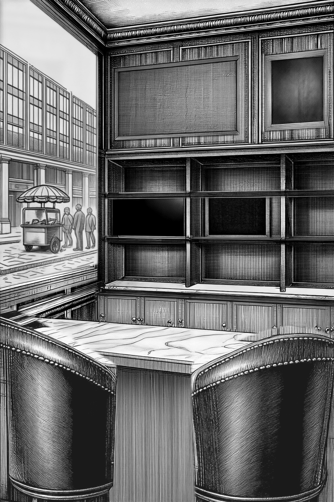

**The thinking.** Rendered in context - the plate as it stands behind this part, with only this part's own silhouette blocked in as values - so the pen, light and perspective are inherited; only the mask is laid back. Part note: the left-hand bar chair seen from behind: a bar-height club chair with a FULL rounded back rising to shoulder height, upholstered in SMOOTH DARK LEATHER with a soft sheen where it faces the window, a slim padded roll along its top with one line of brass nailheads under it, the leather running down over the seat's side so NO seat cushion shows from behind, ending in a plain piped seam, and DIRECTLY beneath that seam four plain straight walnut legs, square in section and slightly tapered, with a foot rail - NO band, NO trim, NO woven or studded strip and NO skirt between the leather and the legs. IDENTICAL to the other chair. Leather - not cane, not wicker, not woven AND the right-hand bar chair seen from behind: a bar-height club chair with a FULL rounded back rising to shoulder height, upholstered in SMOOTH DARK LEATHER with a soft sheen where it faces the window, a slim padded roll along its top with one line of brass nailheads under it, the leather running down over the seat's side so NO seat cushion shows from behind, ending in a plain piped seam, and DIRECTLY beneath that seam four plain straight walnut legs, square in section and slightly tapered, with a foot rail - NO band, NO trim, NO woven or studded strip and NO skirt between the leather and the legs. IDENTICAL to the other chair. Leather - not cane, not wicker, not woven

**Settings.** local/sensenova-u1.5, seed 4, full 40 steps cfg 4, tall canvas (drawn whole below the frame, cropped back), rendered together with chair-right, negative: cane, wicker, rattan, woven, basketwork, mesh, fabric weave, upholstery fabric, band, trim, strip, skirt, apron, valance, studded band, seat cushion, bottles, bottle, glasses, decanters, objects on shelves

**Prompt.** [prompts/062-left-leather-club-chair-and-right-leather-club-chair-render-seed-4-tall-canvas-laid-in-full-plate.prompt.txt](prompts/062-left-leather-club-chair-and-right-leather-club-chair-render-seed-4-tall-canvas-laid-in-full-plate.prompt.txt)

*Logged 12:08.*

---

## 063. left-leather-club-chair and right-leather-club-chair render seed 7 tall-canvas laid in full plate

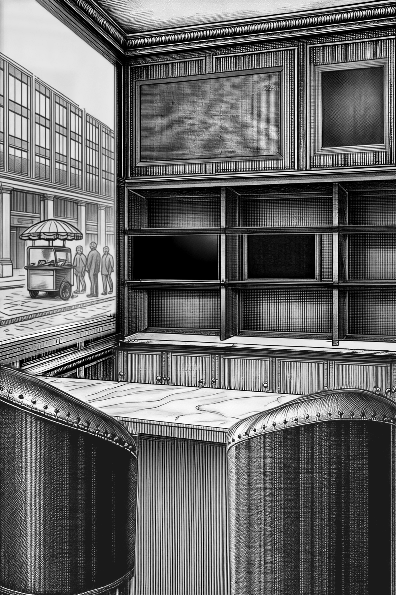

**The thinking.** Rendered in context - the plate as it stands behind this part, with only this part's own silhouette blocked in as values - so the pen, light and perspective are inherited; only the mask is laid back. Part note: the left-hand bar chair seen from behind: a bar-height club chair with a FULL rounded back rising to shoulder height, upholstered in SMOOTH DARK LEATHER with a soft sheen where it faces the window, a slim padded roll along its top with one line of brass nailheads under it, the leather running down over the seat's side so NO seat cushion shows from behind, ending in a plain piped seam, and DIRECTLY beneath that seam four plain straight walnut legs, square in section and slightly tapered, with a foot rail - NO band, NO trim, NO woven or studded strip and NO skirt between the leather and the legs. IDENTICAL to the other chair. Leather - not cane, not wicker, not woven AND the right-hand bar chair seen from behind: a bar-height club chair with a FULL rounded back rising to shoulder height, upholstered in SMOOTH DARK LEATHER with a soft sheen where it faces the window, a slim padded roll along its top with one line of brass nailheads under it, the leather running down over the seat's side so NO seat cushion shows from behind, ending in a plain piped seam, and DIRECTLY beneath that seam four plain straight walnut legs, square in section and slightly tapered, with a foot rail - NO band, NO trim, NO woven or studded strip and NO skirt between the leather and the legs. IDENTICAL to the other chair. Leather - not cane, not wicker, not woven

**Settings.** local/sensenova-u1.5, seed 7, full 40 steps cfg 4, tall canvas (drawn whole below the frame, cropped back), rendered together with chair-right, negative: cane, wicker, rattan, woven, basketwork, mesh, fabric weave, upholstery fabric, band, trim, strip, skirt, apron, valance, studded band, seat cushion, bottles, bottle, glasses, decanters, objects on shelves

**Prompt.** [prompts/063-left-leather-club-chair-and-right-leather-club-chair-render-seed-7-tall-canvas-laid-in-full-plate.prompt.txt](prompts/063-left-leather-club-chair-and-right-leather-club-chair-render-seed-7-tall-canvas-laid-in-full-plate.prompt.txt)

*Logged 12:08.*

---

## 064. whole-plate assembled with cabinet-doors-under-ledge bartenders-marble-ledge back-bar-carcass back-bar-lower-shelf back-bar-upper-shelf television-blank chalkboard-blank window-frame-and-reveal window-glass-street-view main-bar-marble-counter left-leather-club-chair right-leather-club-chair and window-sign

**The thinking.** Base plus every approved, enabled part laid in order through its own silhouette; the TV's blank screen and the window's lettering are drawn in code last, because lettering is never left to the model.

*Logged 12:09.*

---

## 065. whole-plate assembled with cabinet-doors-under-ledge bartenders-marble-ledge back-bar-carcass back-bar-lower-shelf back-bar-upper-shelf television-blank chalkboard-blank window-frame-and-reveal window-glass-street-view main-bar-marble-counter left-leather-club-chair right-leather-club-chair and window-sign

**The thinking.** Base plus every approved, enabled part laid in order through its own silhouette; the TV's blank screen and the window's lettering are drawn in code last, because lettering is never left to the model.

*Logged 12:09.*

---

## 066. whole-plate-camera-panned-sixteen-degrees-sign-a-third-bigger-plain-bar-front

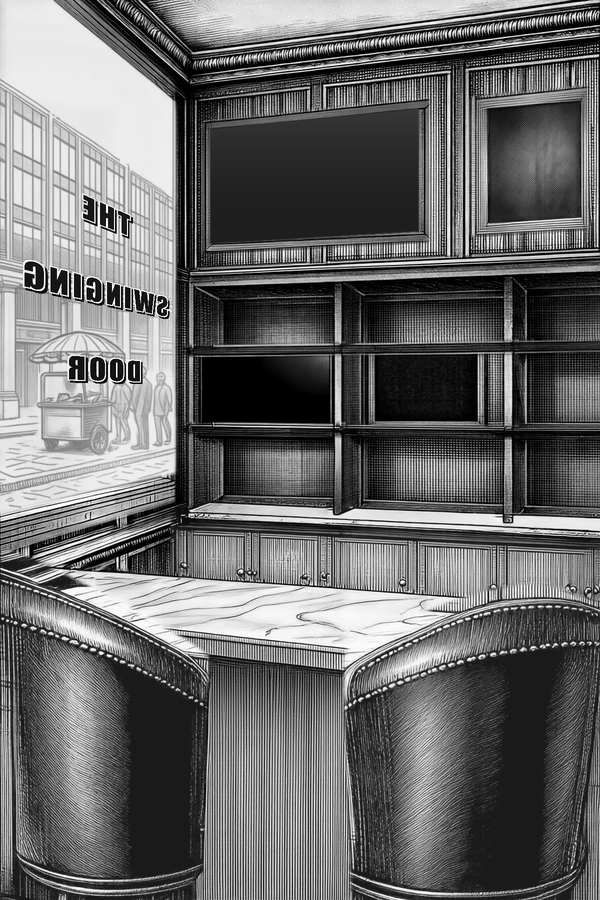

**The ask.** Pan the camera to 16 degrees so the sign is bigger; fix the chairs; remove the cabinet under the main bar.

**The thinking.** A pan moves every mask, so base and every part re-rolled. The pane is 307 px wide on the plate against 250 at 14 degrees and the sign's box is re-solved from the new pane. The main bar's front is one plain walnut face with a plinth - its bay panels had read as cupboard doors - while the bartender's cabinets under the ledge stay.

**Settings.** base seed 21; parts on their approved seeds; chairs as a tall-canvas pair, seed 4

**Prompt.** [prompts/066-whole-plate-camera-panned-sixteen-degrees-sign-a-third-bigger-plain-bar-front.prompt.txt](prompts/066-whole-plate-camera-panned-sixteen-degrees-sign-a-third-bigger-plain-bar-front.prompt.txt)

**Verdict.** Sign a third bigger and legible; bar front plain. Two faults to fix: the carcass grew black slabs in its compartments on this seed, and the left chair clips the frame at this pan.

*Logged 12:10.*

---

## 067. window-close-up-sixteen-degrees-three-line-sign-street-hot-dog-cart

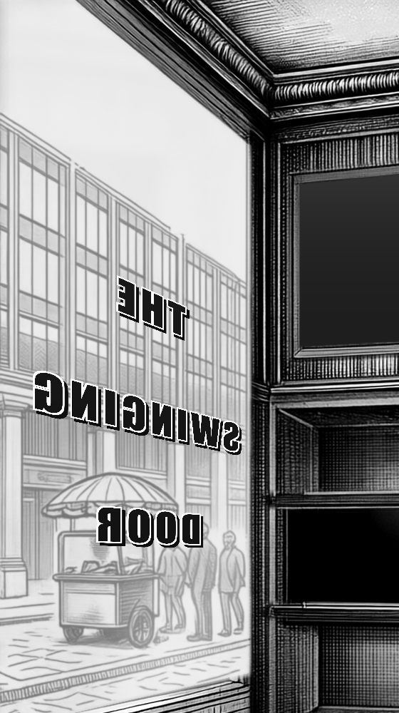

**The thinking.** The whole pane is in frame at 16 degrees; the sign spans it.

*Logged 12:10.*

---

## 068. comparison-sheet-chair-pair-tall-canvas-seeds-4-and-7-at-sixteen-degrees

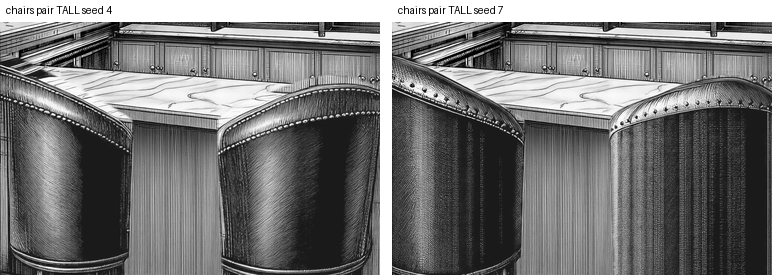

**The thinking.** Seed 4 reads as smooth leather; seed 7 goes ribbed. Seed 4 approved.

*Logged 12:10.*

---

## 069. back-bar-carcass render seed 7 fast laid in full plate

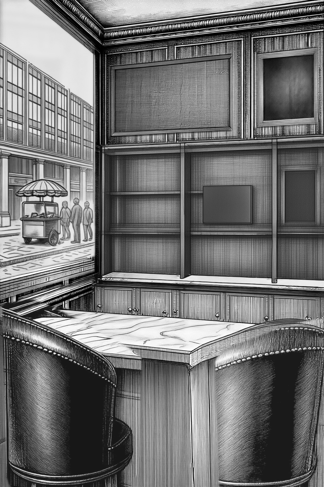

**The thinking.** Rendered in context - the plate as it stands behind this part, with only this part's own silhouette blocked in as values - so the pen, light and perspective are inherited; only the mask is laid back. Part note: the back bar's walnut carcass: a dark recessed back panel, two side cheeks, two internal uprights, a plinth rail and a moulded top rail

**Settings.** local/sensenova-u1.5, seed 7, fast 8 steps cfg 1, negative: television, screen, monitor, black rectangle, picture, frame, poster, sign, lettering, bottles, glasses, bottles, bottle, glasses, decanters, objects on shelves, chair, stool, seat, barstool, furniture in the foreground, person

**Prompt.** [prompts/069-back-bar-carcass-render-seed-7-fast-laid-in-full-plate.prompt.txt](prompts/069-back-bar-carcass-render-seed-7-fast-laid-in-full-plate.prompt.txt)

*Logged 12:11.*

---

## 070. back-bar-carcass render seed 4 fast laid in full plate

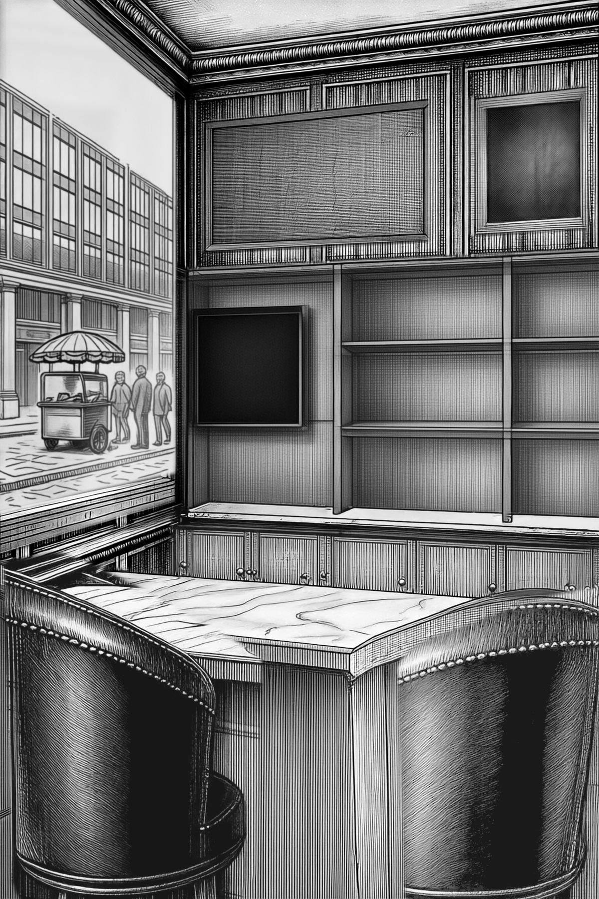

**The thinking.** Rendered in context - the plate as it stands behind this part, with only this part's own silhouette blocked in as values - so the pen, light and perspective are inherited; only the mask is laid back. Part note: the back bar's walnut carcass: a dark recessed back panel, two side cheeks, two internal uprights, a plinth rail and a moulded top rail

**Settings.** local/sensenova-u1.5, seed 4, fast 8 steps cfg 1, negative: television, screen, monitor, black rectangle, picture, frame, poster, sign, lettering, bottles, glasses, bottles, bottle, glasses, decanters, objects on shelves, chair, stool, seat, barstool, furniture in the foreground, person

**Prompt.** [prompts/070-back-bar-carcass-render-seed-4-fast-laid-in-full-plate.prompt.txt](prompts/070-back-bar-carcass-render-seed-4-fast-laid-in-full-plate.prompt.txt)

*Logged 12:11.*

---

## 071. back-bar-carcass render seed 11 laid in full plate

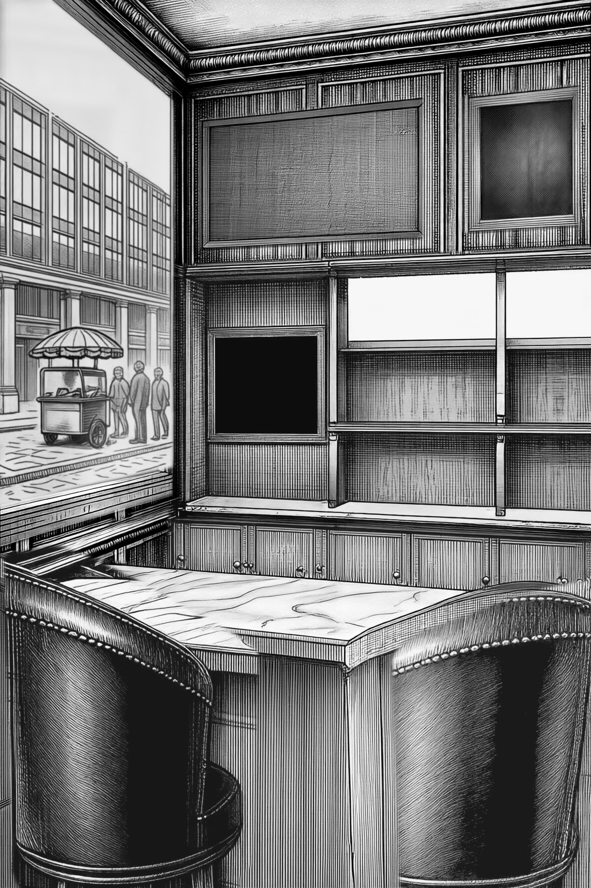

**The thinking.** Rendered in context - the plate as it stands behind this part, with only this part's own silhouette blocked in as values - so the pen, light and perspective are inherited; only the mask is laid back. Part note: the back bar's walnut carcass: a dark recessed back panel, two side cheeks, two internal uprights, a plinth rail and a moulded top rail

**Settings.** local/sensenova-u1.5, seed 11, full 40 steps cfg 4, negative: television, screen, monitor, black rectangle, picture, frame, poster, sign, lettering, bottles, glasses, bottles, bottle, glasses, decanters, objects on shelves, chair, stool, seat, barstool, furniture in the foreground, person

**Prompt.** [prompts/071-back-bar-carcass-render-seed-11-laid-in-full-plate.prompt.txt](prompts/071-back-bar-carcass-render-seed-11-laid-in-full-plate.prompt.txt)

*Logged 12:11.*

---

## 072. left-leather-club-chair and right-leather-club-chair render seed 4 tall-canvas laid in full plate

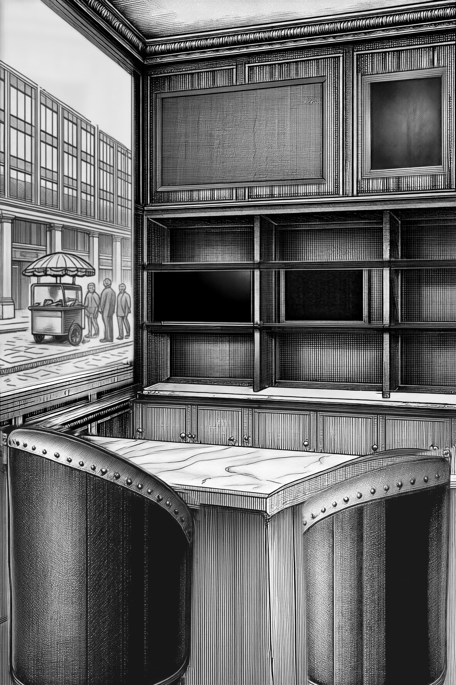

**The thinking.** Rendered in context - the plate as it stands behind this part, with only this part's own silhouette blocked in as values - so the pen, light and perspective are inherited; only the mask is laid back. Part note: the left-hand bar chair seen from behind: a bar-height club chair with a FULL rounded back rising to shoulder height, upholstered in SMOOTH DARK LEATHER with a soft sheen where it faces the window, a slim padded roll along its top with one line of brass nailheads under it, the leather running down over the seat's side so NO seat cushion shows from behind, ending in a plain piped seam, and DIRECTLY beneath that seam four plain straight walnut legs, square in section and slightly tapered, with a foot rail - NO band, NO trim, NO woven or studded strip and NO skirt between the leather and the legs. IDENTICAL to the other chair. Leather - not cane, not wicker, not woven AND the right-hand bar chair seen from behind: a bar-height club chair with a FULL rounded back rising to shoulder height, upholstered in SMOOTH DARK LEATHER with a soft sheen where it faces the window, a slim padded roll along its top with one line of brass nailheads under it, the leather running down over the seat's side so NO seat cushion shows from behind, ending in a plain piped seam, and DIRECTLY beneath that seam four plain straight walnut legs, square in section and slightly tapered, with a foot rail - NO band, NO trim, NO woven or studded strip and NO skirt between the leather and the legs. IDENTICAL to the other chair. Leather - not cane, not wicker, not woven

**Settings.** local/sensenova-u1.5, seed 4, full 40 steps cfg 4, tall canvas (drawn whole below the frame, cropped back), rendered together with chair-right, negative: cane, wicker, rattan, woven, basketwork, mesh, fabric weave, upholstery fabric, band, trim, strip, skirt, apron, valance, studded band, seat cushion, bottles, bottle, glasses, decanters, objects on shelves

**Prompt.** [prompts/072-left-leather-club-chair-and-right-leather-club-chair-render-seed-4-tall-canvas-laid-in-full-plate.prompt.txt](prompts/072-left-leather-club-chair-and-right-leather-club-chair-render-seed-4-tall-canvas-laid-in-full-plate.prompt.txt)

*Logged 12:12.*

---

## 073. left-leather-club-chair and right-leather-club-chair render seed 11 tall-canvas laid in full plate

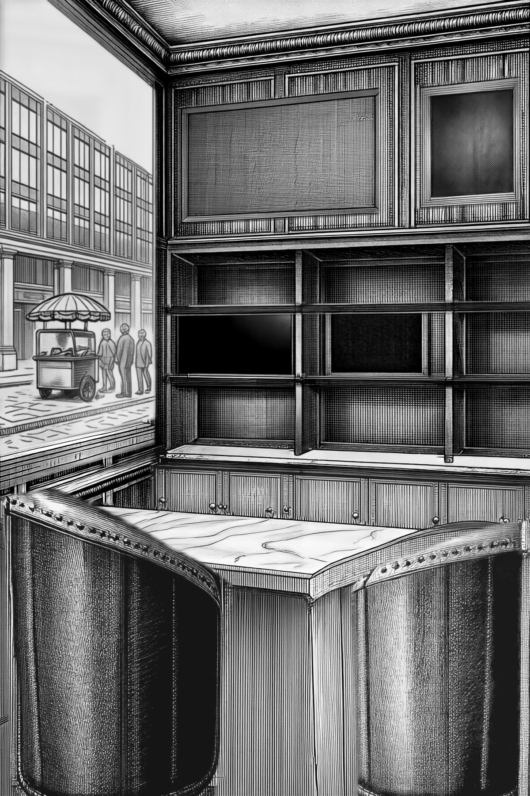

**The thinking.** Rendered in context - the plate as it stands behind this part, with only this part's own silhouette blocked in as values - so the pen, light and perspective are inherited; only the mask is laid back. Part note: the left-hand bar chair seen from behind: a bar-height club chair with a FULL rounded back rising to shoulder height, upholstered in SMOOTH DARK LEATHER with a soft sheen where it faces the window, a slim padded roll along its top with one line of brass nailheads under it, the leather running down over the seat's side so NO seat cushion shows from behind, ending in a plain piped seam, and DIRECTLY beneath that seam four plain straight walnut legs, square in section and slightly tapered, with a foot rail - NO band, NO trim, NO woven or studded strip and NO skirt between the leather and the legs. IDENTICAL to the other chair. Leather - not cane, not wicker, not woven AND the right-hand bar chair seen from behind: a bar-height club chair with a FULL rounded back rising to shoulder height, upholstered in SMOOTH DARK LEATHER with a soft sheen where it faces the window, a slim padded roll along its top with one line of brass nailheads under it, the leather running down over the seat's side so NO seat cushion shows from behind, ending in a plain piped seam, and DIRECTLY beneath that seam four plain straight walnut legs, square in section and slightly tapered, with a foot rail - NO band, NO trim, NO woven or studded strip and NO skirt between the leather and the legs. IDENTICAL to the other chair. Leather - not cane, not wicker, not woven

**Settings.** local/sensenova-u1.5, seed 11, full 40 steps cfg 4, tall canvas (drawn whole below the frame, cropped back), rendered together with chair-right, negative: cane, wicker, rattan, woven, basketwork, mesh, fabric weave, upholstery fabric, band, trim, strip, skirt, apron, valance, studded band, seat cushion, bottles, bottle, glasses, decanters, objects on shelves

**Prompt.** [prompts/073-left-leather-club-chair-and-right-leather-club-chair-render-seed-11-tall-canvas-laid-in-full-plate.prompt.txt](prompts/073-left-leather-club-chair-and-right-leather-club-chair-render-seed-11-tall-canvas-laid-in-full-plate.prompt.txt)

*Logged 12:12.*

---

## 074. whole-plate assembled with cabinet-doors-under-ledge bartenders-marble-ledge back-bar-carcass back-bar-lower-shelf back-bar-upper-shelf television-blank chalkboard-blank window-frame-and-reveal window-glass-street-view main-bar-marble-counter left-leather-club-chair right-leather-club-chair and window-sign

**The thinking.** Base plus every approved, enabled part laid in order through its own silhouette; the TV's blank screen and the window's lettering are drawn in code last, because lettering is never left to the model.

*Logged 12:13.*

---

## 075. whole-plate assembled with cabinet-doors-under-ledge bartenders-marble-ledge back-bar-carcass back-bar-lower-shelf back-bar-upper-shelf television-blank chalkboard-blank window-frame-and-reveal window-glass-street-view main-bar-marble-counter left-leather-club-chair right-leather-club-chair and window-sign

**The thinking.** Base plus every approved, enabled part laid in order through its own silhouette; the TV's blank screen and the window's lettering are drawn in code last, because lettering is never left to the model.

*Logged 12:13.*

---

## 076. back-bar-carcass render seed 7 laid in full plate

**The thinking.** Rendered in context - the plate as it stands behind this part, with only this part's own silhouette blocked in as values - so the pen, light and perspective are inherited; only the mask is laid back. Part note: the back bar's walnut carcass: a dark recessed back panel, two side cheeks, two internal uprights, a plinth rail and a moulded top rail

**Settings.** local/sensenova-u1.5, seed 7, full 40 steps cfg 4, negative: television, screen, monitor, black rectangle, picture, frame, poster, sign, lettering, bottles, glasses, bottles, bottle, glasses, decanters, objects on shelves, chair, stool, seat, barstool, furniture in the foreground, person

**Prompt.** [prompts/076-back-bar-carcass-render-seed-7-laid-in-full-plate.prompt.txt](prompts/076-back-bar-carcass-render-seed-7-laid-in-full-plate.prompt.txt)

*Logged 12:15.*

---

## 077. back-bar-carcass render seed 4 laid in full plate

**The thinking.** Rendered in context - the plate as it stands behind this part, with only this part's own silhouette blocked in as values - so the pen, light and perspective are inherited; only the mask is laid back. Part note: the back bar's walnut carcass: a dark recessed back panel, two side cheeks, two internal uprights, a plinth rail and a moulded top rail

**Settings.** local/sensenova-u1.5, seed 4, full 40 steps cfg 4, negative: television, screen, monitor, black rectangle, picture, frame, poster, sign, lettering, bottles, glasses, bottles, bottle, glasses, decanters, objects on shelves, chair, stool, seat, barstool, furniture in the foreground, person

**Prompt.** [prompts/077-back-bar-carcass-render-seed-4-laid-in-full-plate.prompt.txt](prompts/077-back-bar-carcass-render-seed-4-laid-in-full-plate.prompt.txt)

*Logged 12:15.*

---

## 078. back-bar-carcass render seed 7 laid in full plate

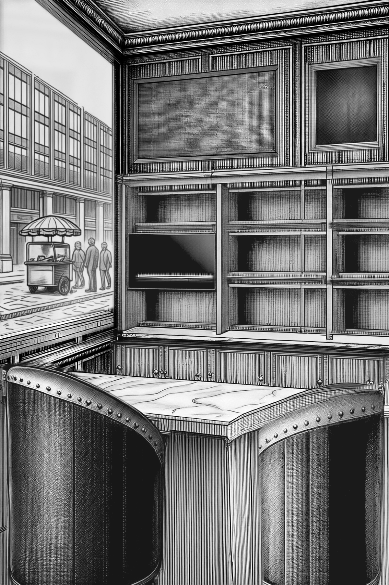

**The thinking.** Rendered in context - the plate as it stands behind this part, with only this part's own silhouette blocked in as values - so the pen, light and perspective are inherited; only the mask is laid back. Part note: the back bar's walnut carcass: a dark recessed back panel, two side cheeks, two internal uprights, a plinth rail and a moulded top rail

**Settings.** local/sensenova-u1.5, seed 7, full 40 steps cfg 4, negative: television, screen, monitor, black rectangle, picture, frame, poster, sign, lettering, bottles, glasses, bottles, bottle, glasses, decanters, objects on shelves, chair, stool, seat, barstool, furniture in the foreground, person

**Prompt.** [prompts/078-back-bar-carcass-render-seed-7-laid-in-full-plate.prompt.txt](prompts/078-back-bar-carcass-render-seed-7-laid-in-full-plate.prompt.txt)

*Logged 12:17.*

---

## 079. back-bar-carcass render seed 4 laid in full plate

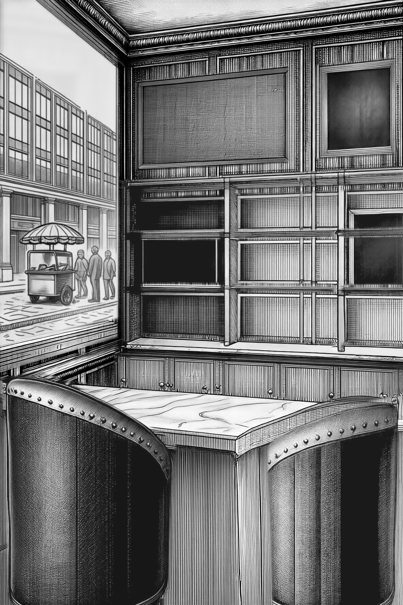

**The thinking.** Rendered in context - the plate as it stands behind this part, with only this part's own silhouette blocked in as values - so the pen, light and perspective are inherited; only the mask is laid back. Part note: the back bar's walnut carcass: a dark recessed back panel, two side cheeks, two internal uprights, a plinth rail and a moulded top rail

**Settings.** local/sensenova-u1.5, seed 4, full 40 steps cfg 4, negative: television, screen, monitor, black rectangle, picture, frame, poster, sign, lettering, bottles, glasses, bottles, bottle, glasses, decanters, objects on shelves, chair, stool, seat, barstool, furniture in the foreground, person

**Prompt.** [prompts/079-back-bar-carcass-render-seed-4-laid-in-full-plate.prompt.txt](prompts/079-back-bar-carcass-render-seed-4-laid-in-full-plate.prompt.txt)

*Logged 12:17.*

---

## 080. back-bar-carcass render seed 7 laid in full plate

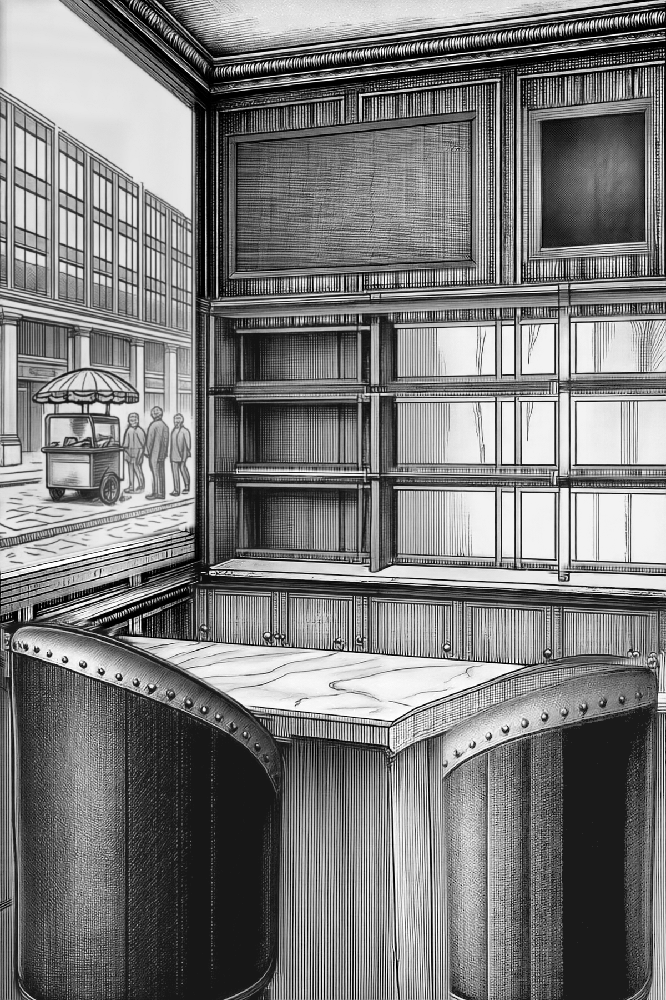

**The thinking.** Rendered in context - the plate as it stands behind this part, with only this part's own silhouette blocked in as values - so the pen, light and perspective are inherited; only the mask is laid back. Part note: the back bar's walnut carcass: a dark recessed back panel, two side cheeks, two internal uprights, a plinth rail and a moulded top rail

**Settings.** local/sensenova-u1.5, seed 7, full 40 steps cfg 4, negative: television, screen, monitor, black rectangle, picture, frame, poster, sign, lettering, bottles, glasses, bottles, bottle, glasses, decanters, objects on shelves, chair, stool, seat, barstool, chalkboard, blackboard, framed board, picture, frame, lamp, sconce, light fixture, television, screen, monitor, flat screen

**Prompt.** [prompts/080-back-bar-carcass-render-seed-7-laid-in-full-plate.prompt.txt](prompts/080-back-bar-carcass-render-seed-7-laid-in-full-plate.prompt.txt)

*Logged 12:17.*

---

## 081. back-bar-carcass render seed 4 laid in full plate

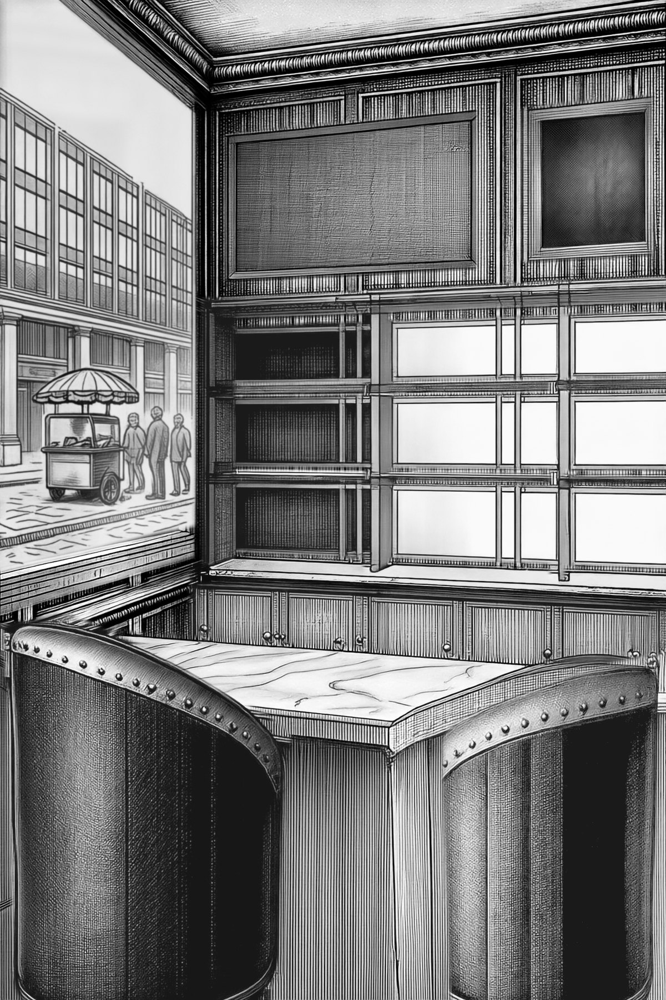

**The thinking.** Rendered in context - the plate as it stands behind this part, with only this part's own silhouette blocked in as values - so the pen, light and perspective are inherited; only the mask is laid back. Part note: the back bar's walnut carcass: a dark recessed back panel, two side cheeks, two internal uprights, a plinth rail and a moulded top rail

**Settings.** local/sensenova-u1.5, seed 4, full 40 steps cfg 4, negative: television, screen, monitor, black rectangle, picture, frame, poster, sign, lettering, bottles, glasses, bottles, bottle, glasses, decanters, objects on shelves, chair, stool, seat, barstool, chalkboard, blackboard, framed board, picture, frame, lamp, sconce, light fixture, television, screen, monitor, flat screen

**Prompt.** [prompts/081-back-bar-carcass-render-seed-4-laid-in-full-plate.prompt.txt](prompts/081-back-bar-carcass-render-seed-4-laid-in-full-plate.prompt.txt)

*Logged 12:18.*

---

## 082. whole-plate assembled with cabinet-doors-under-ledge bartenders-marble-ledge back-bar-carcass back-bar-lower-shelf back-bar-upper-shelf television-blank chalkboard-blank window-frame-and-reveal window-glass-street-view main-bar-marble-counter left-leather-club-chair right-leather-club-chair and window-sign

**The thinking.** Base plus every approved, enabled part laid in order through its own silhouette; the TV's blank screen and the window's lettering are drawn in code last, because lettering is never left to the model.

*Logged 12:20.*

---

## 083. back-bar-carcass render seed 7 laid in full plate

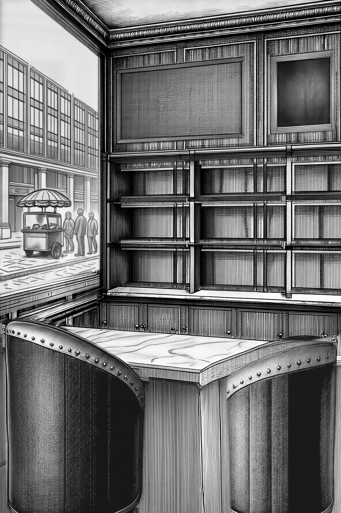

**The thinking.** Rendered in context - the plate as it stands behind this part, with only this part's own silhouette blocked in as values - so the pen, light and perspective are inherited; only the mask is laid back. Part note: the back bar's walnut carcass: a dark recessed back panel, two side cheeks, two internal uprights, a plinth rail and a moulded top rail

**Settings.** local/sensenova-u1.5, seed 7, full 40 steps cfg 4, negative: television, screen, monitor, black rectangle, picture, frame, poster, sign, lettering, bottles, glasses, mirror, mirrored panel, glass panel, white panel, lightbox, frosted glass, window, bottles, bottle, glasses, decanters, objects on shelves, chair, stool, seat, barstool, chalkboard, blackboard, framed board, picture, frame, lamp, sconce, light fixture, television, screen, monitor, flat screen

**Prompt.** [prompts/083-back-bar-carcass-render-seed-7-laid-in-full-plate.prompt.txt](prompts/083-back-bar-carcass-render-seed-7-laid-in-full-plate.prompt.txt)

*Logged 12:22.*

---

## 084. back-bar-carcass render seed 4 laid in full plate

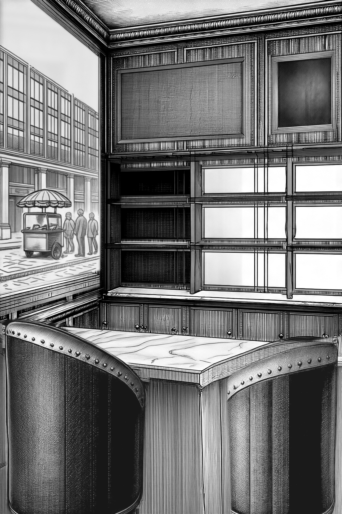

**The thinking.** Rendered in context - the plate as it stands behind this part, with only this part's own silhouette blocked in as values - so the pen, light and perspective are inherited; only the mask is laid back. Part note: the back bar's walnut carcass: a dark recessed back panel, two side cheeks, two internal uprights, a plinth rail and a moulded top rail

**Settings.** local/sensenova-u1.5, seed 4, full 40 steps cfg 4, negative: television, screen, monitor, black rectangle, picture, frame, poster, sign, lettering, bottles, glasses, mirror, mirrored panel, glass panel, white panel, lightbox, frosted glass, window, bottles, bottle, glasses, decanters, objects on shelves, chair, stool, seat, barstool, chalkboard, blackboard, framed board, picture, frame, lamp, sconce, light fixture, television, screen, monitor, flat screen

**Prompt.** [prompts/084-back-bar-carcass-render-seed-4-laid-in-full-plate.prompt.txt](prompts/084-back-bar-carcass-render-seed-4-laid-in-full-plate.prompt.txt)

*Logged 12:22.*

---

## 085. whole-plate assembled with cabinet-doors-under-ledge bartenders-marble-ledge back-bar-carcass back-bar-lower-shelf back-bar-upper-shelf television-blank chalkboard-blank window-frame-and-reveal window-glass-street-view main-bar-marble-counter left-leather-club-chair right-leather-club-chair and window-sign

**The thinking.** Base plus every approved, enabled part laid in order through its own silhouette; the TV's blank screen and the window's lettering are drawn in code last, because lettering is never left to the model.

*Logged 12:23.*

---

## 086. comparison-sheet-back-bar-carcass-dark-walnut-backs-seeds-7-and-4-at-sixteen-degrees

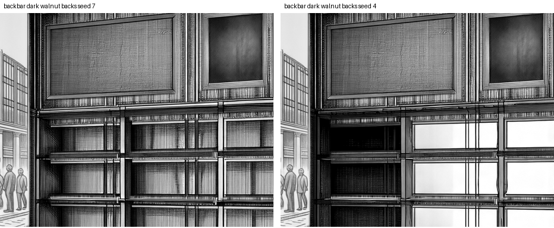

**The ask.** The carcass kept growing a screen in a compartment; then white panels.

**The thinking.** Three findings in sequence. A recessed dark back framed by cheeks and shelves is a picture frame to the model, so the backs became the wall's own raised-and-fielded panelling. The screen still appeared with no TV in the conditioning because the prompt described one - so now a part is never told about any part later in the stack. Then the panelled backs rendered as white mirror panels at value 118, so they are blocked in at 84 as dark walnut with mirror and glass in the negative.

**Verdict.** Seed 7 clean on all three sections; approved.

*Logged 12:23.*

---

## 087. whole-plate-sixteen-degrees-final-dark-walnut-shelving-plain-bar-front-thin-marble-chairs-turned-in

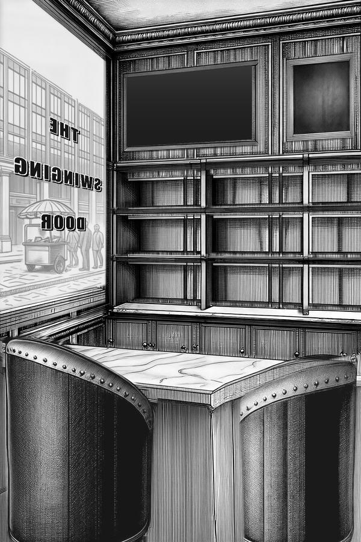

**The thinking.** Every part now sits on its own silhouette, conditioned only on what is behind it, told only about what it can see.

**Prompt.** [prompts/087-whole-plate-sixteen-degrees-final-dark-walnut-shelving-plain-bar-front-thin-marble-chairs-turned-in.prompt.txt](prompts/087-whole-plate-sixteen-degrees-final-dark-walnut-shelving-plain-bar-front-thin-marble-chairs-turned-in.prompt.txt)

*Logged 12:23.*

---

## 088. back-bar-carcass render seed 7 laid in full plate

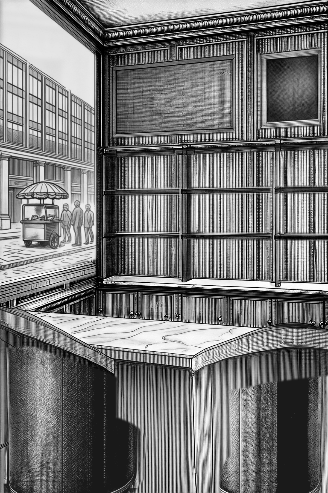

**The thinking.** Rendered in context - the plate as it stands behind this part, with only this part's own silhouette blocked in as values - so the pen, light and perspective are inherited; only the mask is laid back. Part note: the back bar's walnut carcass: a dark recessed back panel, two side cheeks, two internal uprights, a plinth rail and a moulded top rail

**Settings.** local/sensenova-u1.5, seed 7, full 40 steps cfg 4, negative: television, screen, monitor, black rectangle, picture, frame, poster, sign, lettering, bottles, glasses, mirror, mirrored panel, glass panel, white panel, lightbox, frosted glass, window, bottles, bottle, glasses, decanters, objects on shelves, chair, stool, seat, barstool, chalkboard, blackboard, framed board, picture, frame, lamp, sconce, light fixture, television, screen, monitor, flat screen

**Prompt.** [prompts/088-back-bar-carcass-render-seed-7-laid-in-full-plate.prompt.txt](prompts/088-back-bar-carcass-render-seed-7-laid-in-full-plate.prompt.txt)

*Logged 14:47.*

---

## 089. whole-plate assembled with cabinet-doors-under-ledge bartenders-marble-ledge back-bar-carcass back-bar-lower-shelf back-bar-upper-shelf television-blank chalkboard-blank window-frame-and-reveal window-glass-street-view main-bar-marble-counter left-leather-club-chair right-leather-club-chair and window-sign

**The thinking.** Base plus every approved, enabled part laid in order through its own silhouette; the TV's blank screen and the window's lettering are drawn in code last, because lettering is never left to the model.

*Logged 14:47.*

---

## 090. left-leather-club-chair and right-leather-club-chair render seed 4 tall-canvas laid in full plate

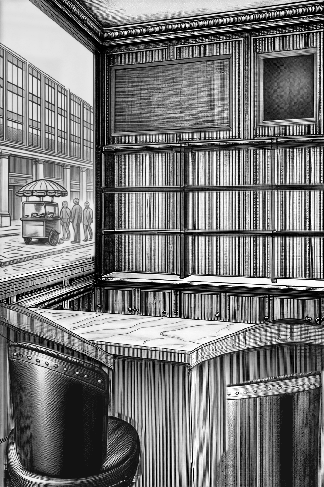

**The thinking.** Rendered in context - the plate as it stands behind this part, with only this part's own silhouette blocked in as values - so the pen, light and perspective are inherited; only the mask is laid back. Part note: the left-hand bar chair seen from behind: an upright curved back to mid-back height in SMOOTH, TIGHT, POLISHED dark leather with one broad soft sheen - no streaks, no ribbing, no hatching lines running down it - a slim padded roll along its top with a fine line of small brass nailheads, standing on a padded leather SEAT cushion that shows beside and below the back; plain straight walnut legs beneath. IDENTICAL to the other chair AND the right-hand bar chair seen from behind: an upright curved back to mid-back height in SMOOTH, TIGHT, POLISHED dark leather with one broad soft sheen - no streaks, no ribbing, no hatching lines running down it - a slim padded roll along its top with a fine line of small brass nailheads, standing on a padded leather SEAT cushion that shows beside and below the back; plain straight walnut legs beneath. IDENTICAL to the other chair

**Settings.** local/sensenova-u1.5, seed 4, full 40 steps cfg 4, tall canvas (drawn whole below the frame, cropped back), rendered together with chair-right, negative: cane, wicker, rattan, woven, basketwork, mesh, fabric weave, upholstery fabric, band, trim, strip, skirt, apron, valance, studded band, streaks, streaky, ribbed, corrugated, hatching lines, barrel, tub, drum, bottles, bottle, glasses, decanters, objects on shelves, lamp, sconce, light fixture

**Prompt.** [prompts/090-left-leather-club-chair-and-right-leather-club-chair-render-seed-4-tall-canvas-laid-in-full-plate.prompt.txt](prompts/090-left-leather-club-chair-and-right-leather-club-chair-render-seed-4-tall-canvas-laid-in-full-plate.prompt.txt)

*Logged 14:47.*

---

## 091. left-leather-club-chair and right-leather-club-chair render seed 11 tall-canvas laid in full plate

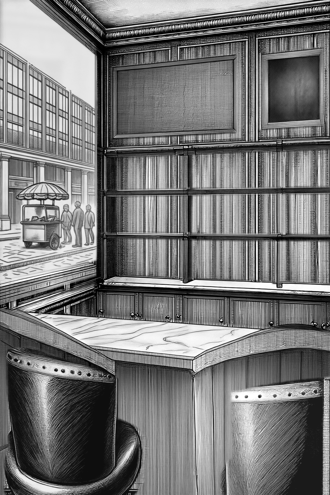

**The thinking.** Rendered in context - the plate as it stands behind this part, with only this part's own silhouette blocked in as values - so the pen, light and perspective are inherited; only the mask is laid back. Part note: the left-hand bar chair seen from behind: an upright curved back to mid-back height in SMOOTH, TIGHT, POLISHED dark leather with one broad soft sheen - no streaks, no ribbing, no hatching lines running down it - a slim padded roll along its top with a fine line of small brass nailheads, standing on a padded leather SEAT cushion that shows beside and below the back; plain straight walnut legs beneath. IDENTICAL to the other chair AND the right-hand bar chair seen from behind: an upright curved back to mid-back height in SMOOTH, TIGHT, POLISHED dark leather with one broad soft sheen - no streaks, no ribbing, no hatching lines running down it - a slim padded roll along its top with a fine line of small brass nailheads, standing on a padded leather SEAT cushion that shows beside and below the back; plain straight walnut legs beneath. IDENTICAL to the other chair

**Settings.** local/sensenova-u1.5, seed 11, full 40 steps cfg 4, tall canvas (drawn whole below the frame, cropped back), rendered together with chair-right, negative: cane, wicker, rattan, woven, basketwork, mesh, fabric weave, upholstery fabric, band, trim, strip, skirt, apron, valance, studded band, streaks, streaky, ribbed, corrugated, hatching lines, barrel, tub, drum, bottles, bottle, glasses, decanters, objects on shelves, lamp, sconce, light fixture

**Prompt.** [prompts/091-left-leather-club-chair-and-right-leather-club-chair-render-seed-11-tall-canvas-laid-in-full-plate.prompt.txt](prompts/091-left-leather-club-chair-and-right-leather-club-chair-render-seed-11-tall-canvas-laid-in-full-plate.prompt.txt)

*Logged 14:47.*

---

## 092. whole-plate assembled with cabinet-doors-under-ledge bartenders-marble-ledge back-bar-carcass back-bar-lower-shelf back-bar-upper-shelf television-blank chalkboard-blank window-frame-and-reveal window-glass-street-view main-bar-marble-counter left-leather-club-chair right-leather-club-chair and window-sign

**The thinking.** Base plus every approved, enabled part laid in order through its own silhouette; the TV's blank screen and the window's lettering are drawn in code last, because lettering is never left to the model.

*Logged 14:48.*

---

## 093. whole-plate assembled with cabinet-doors-under-ledge bartenders-marble-ledge back-bar-carcass back-bar-lower-shelf back-bar-upper-shelf television-blank chalkboard-blank window-frame-and-reveal window-glass-street-view main-bar-marble-counter left-leather-club-chair right-leather-club-chair and window-sign

**The thinking.** Base plus every approved, enabled part laid in order through its own silhouette; the TV's blank screen and the window's lettering are drawn in code last, because lettering is never left to the model.

*Logged 14:48.*

---

## 094. right-leather-club-chair render seed 7 tall-canvas laid in full plate

**The thinking.** Rendered in context - the plate as it stands behind this part, with only this part's own silhouette blocked in as values - so the pen, light and perspective are inherited; only the mask is laid back. Part note: the right-hand bar chair seen from behind: an upright curved back to mid-back height in SMOOTH, TIGHT, POLISHED dark leather with one broad soft sheen - no streaks, no ribbing, no hatching lines running down it - a slim padded roll along its top with a fine line of small brass nailheads, standing on a padded leather SEAT cushion that shows beside and below the back; plain straight walnut legs beneath. IDENTICAL to the other chair

**Settings.** local/sensenova-u1.5, seed 7, full 40 steps cfg 4, tall canvas (drawn whole below the frame, cropped back), negative: cane, wicker, rattan, woven, basketwork, mesh, fabric weave, upholstery fabric, band, trim, strip, skirt, apron, valance, studded band, streaks, streaky, ribbed, corrugated, hatching lines, barrel, tub, drum, bottles, bottle, glasses, decanters, objects on shelves, lamp, sconce, light fixture

**Prompt.** [prompts/094-right-leather-club-chair-render-seed-7-tall-canvas-laid-in-full-plate.prompt.txt](prompts/094-right-leather-club-chair-render-seed-7-tall-canvas-laid-in-full-plate.prompt.txt)

*Logged 14:49.*

---

## 095. back bar values: open shelves with the wall's own panelling behind them

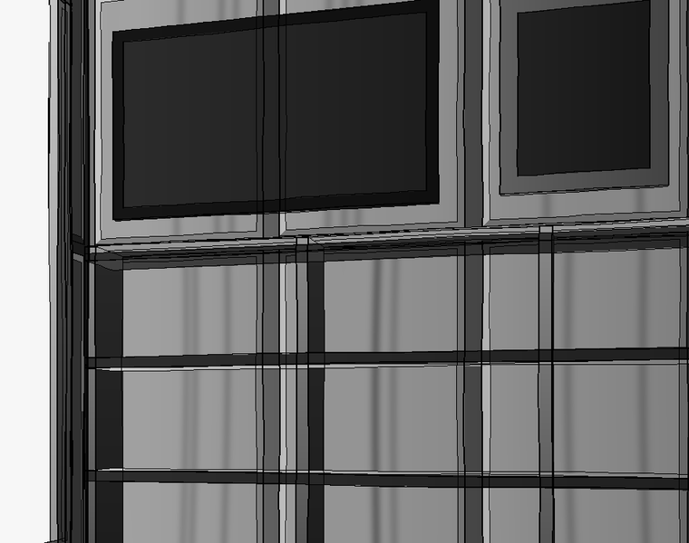

**The ask.** the chairs still look weird fix the seats and the leather and you messed up the shelves understand there is a wall behind the shelves you are really starting to go off track and messing this up the sign is looking more legible we just need a little bit better text that looks modern readable and classy

**The thinking.** I had built a back onto the unit: a dark walnut panel in each compartment, added because the model kept painting pictures into the recesses. The founder's correction is the simpler truth - the shelves stand against the wall, and the wall's panelling is what shows between them. So the compartment backs are removed from the construction entirely. Nothing is drawn behind the shelves, so nothing there belongs to the back bar's mask; the base render's wall shows through, and the model is given nothing to invent in. The unit is now cheeks, two uprights, two shelves and a top rail. The prompt line is rewritten to match: OPEN WALNUT SHELVING, NO BACK PANEL, the wall's own panelling between the shelves.

**Settings.** draw-room-lines.py: compartment panel() calls deleted; backbar part = cheeks, uprights, top rail; shelves as slabs; prompt 05 back-bar line rewritten

**Verdict.** construction - the wall is the back

*Logged 14:49.*

---

## 096. chair values: upright backs, a slim roll, a padded seat that shows, smooth leather

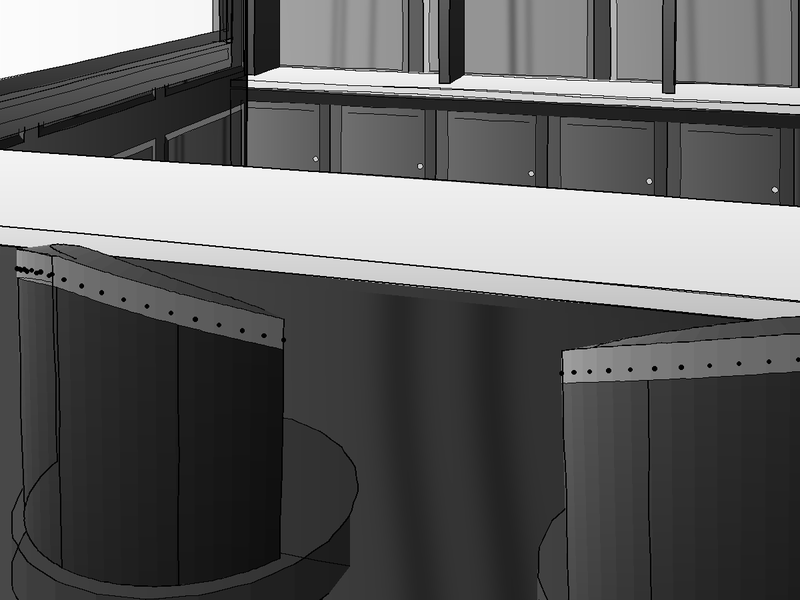

**The ask.** the chairs still look weird fix the seats and the leather and you messed up the shelves understand there is a wall behind the shelves you are really starting to go off track and messing this up the sign is looking more legible we just need a little bit better text that looks modern readable and classy

**The thinking.** The tub shape was the problem: a shoulder-high back wrapping almost fully round read as a barrel, and its hard sheen band rendered as streaks. The back is now 46 cm above the seat instead of 62, wraps only a little past the sides instead of nearly closing, has no flare, a slim 4.5 cm roll and a broad soft sheen (a gentle gradient, not a highlight band). The back now SITS ON the seat: its leather ends at the cushion's top instead of running down past it, and the cushion - 2 cm proud of the back, 8 cm thick, dark leather - is drawn first so that from behind you read back, then the cushion's edge, then the legs. (A first pass drew the cushion 5 cm proud with the back's leather hanging below it; in the values that projected as a pale disc beside each back, like a side table, and was corrected before rendering.) The prompt line describes the same thing: smooth, tight, polished leather with one broad sheen, no streaks, no ribbing, a seat cushion that shows; streaks, ribbing, barrel and tub go into the negative.

**Settings.** chair(): HB 0.46, ROLL 0.045, TOPW 0.05, R0/R1 0.26/0.27, HALF 1.30, drop 0.10, sheen 44+30f+40f^2; leather ends at SEAT_H; seat ring R0+0.02, 8 cm thick, top 66-48; negative + streaks, ribbed, hatching lines, barrel, tub, drum

**Verdict.** construction - a chair, not a tub

*Logged 14:49.*

---

## 097. sign face: Bahnschrift Bold, the DIN letter - modern, readable, classy

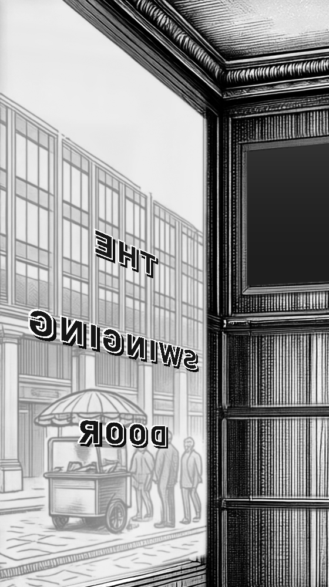

**The ask.** the chairs still look weird fix the seats and the leather and you messed up the shelves understand there is a wall behind the shelves you are really starting to go off track and messing this up the sign is looking more legible we just need a little bit better text that looks modern readable and classy

**The thinking.** Impact made the sign legible but it is a poster face, heavy and compressed. The founder asked for a little better text - modern, readable, classy. Bahnschrift is Windows' DIN-style face: the letter of European signage and instruments, open counters, even strokes, unmistakably modern. Set in Bold (the font is variable; the bold instance renders a third more ink than regular at the same size, though the advance widths are the same, so the width-bound size solve is unchanged). Everything else about the sign is untouched: three lines, mirrored by the pane's own winding, gilded in texture space, box solved from the pane.

**Settings.** sign-on-glass.py: FONT bahnschrift.ttf, set_variation_by_name('Bold'); TRACK 0.10; FROST 0.45; U 0.03-0.80, V 0.30-0.82

**Verdict.** typesetting - candidate for the founder

*Logged 14:49.*

---

## 098. right-leather-club-chair render seed 21 tall-canvas laid in full plate

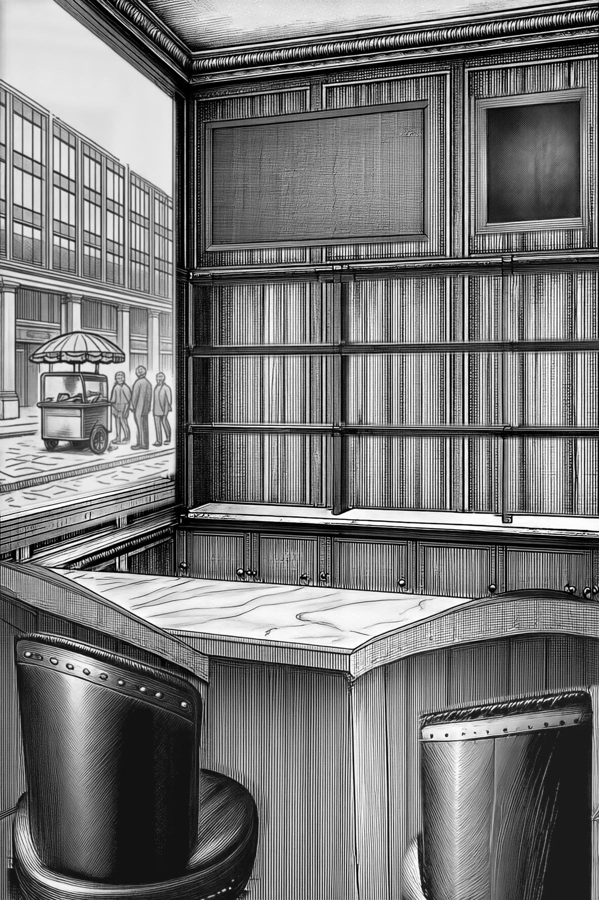

**The thinking.** Rendered in context - the plate as it stands behind this part, with only this part's own silhouette blocked in as values - so the pen, light and perspective are inherited; only the mask is laid back. Part note: the right-hand bar chair seen from behind: an upright curved back to mid-back height in SMOOTH, TIGHT, POLISHED dark leather with one broad soft sheen - no streaks, no ribbing, no hatching lines running down it - a slim padded roll along its top with a fine line of small brass nailheads, standing on a padded leather SEAT cushion that shows beside and below the back; plain straight walnut legs beneath. IDENTICAL to the other chair

**Settings.** local/sensenova-u1.5, seed 21, full 40 steps cfg 4, tall canvas (drawn whole below the frame, cropped back), negative: cane, wicker, rattan, woven, basketwork, mesh, fabric weave, upholstery fabric, band, trim, strip, skirt, apron, valance, studded band, streaks, streaky, ribbed, corrugated, hatching lines, barrel, tub, drum, bottles, bottle, glasses, decanters, objects on shelves, lamp, sconce, light fixture

**Prompt.** [prompts/098-right-leather-club-chair-render-seed-21-tall-canvas-laid-in-full-plate.prompt.txt](prompts/098-right-leather-club-chair-render-seed-21-tall-canvas-laid-in-full-plate.prompt.txt)

*Logged 14:49.*

---

## 099. right-leather-club-chair render seed 33 tall-canvas laid in full plate

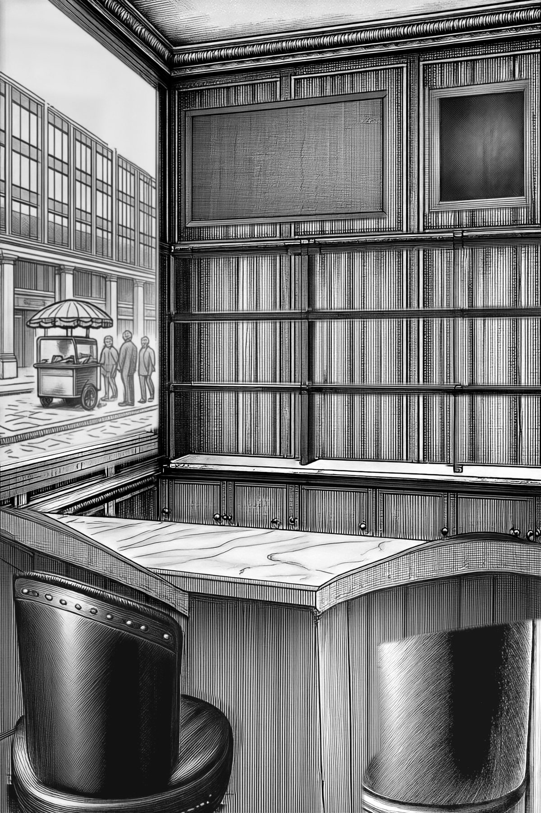

**The thinking.** Rendered in context - the plate as it stands behind this part, with only this part's own silhouette blocked in as values - so the pen, light and perspective are inherited; only the mask is laid back. Part note: the right-hand bar chair seen from behind: an upright curved back to mid-back height in SMOOTH, TIGHT, POLISHED dark leather with one broad soft sheen - no streaks, no ribbing, no hatching lines running down it - a slim padded roll along its top with a fine line of small brass nailheads, standing on a padded leather SEAT cushion that shows beside and below the back; plain straight walnut legs beneath. IDENTICAL to the other chair

**Settings.** local/sensenova-u1.5, seed 33, full 40 steps cfg 4, tall canvas (drawn whole below the frame, cropped back), negative: cane, wicker, rattan, woven, basketwork, mesh, fabric weave, upholstery fabric, band, trim, strip, skirt, apron, valance, studded band, streaks, streaky, ribbed, corrugated, hatching lines, barrel, tub, drum, bottles, bottle, glasses, decanters, objects on shelves, lamp, sconce, light fixture

**Prompt.** [prompts/099-right-leather-club-chair-render-seed-33-tall-canvas-laid-in-full-plate.prompt.txt](prompts/099-right-leather-club-chair-render-seed-33-tall-canvas-laid-in-full-plate.prompt.txt)

*Logged 14:50.*

---

## 100. right-leather-club-chair render seed 4 fast tall-canvas laid in full plate

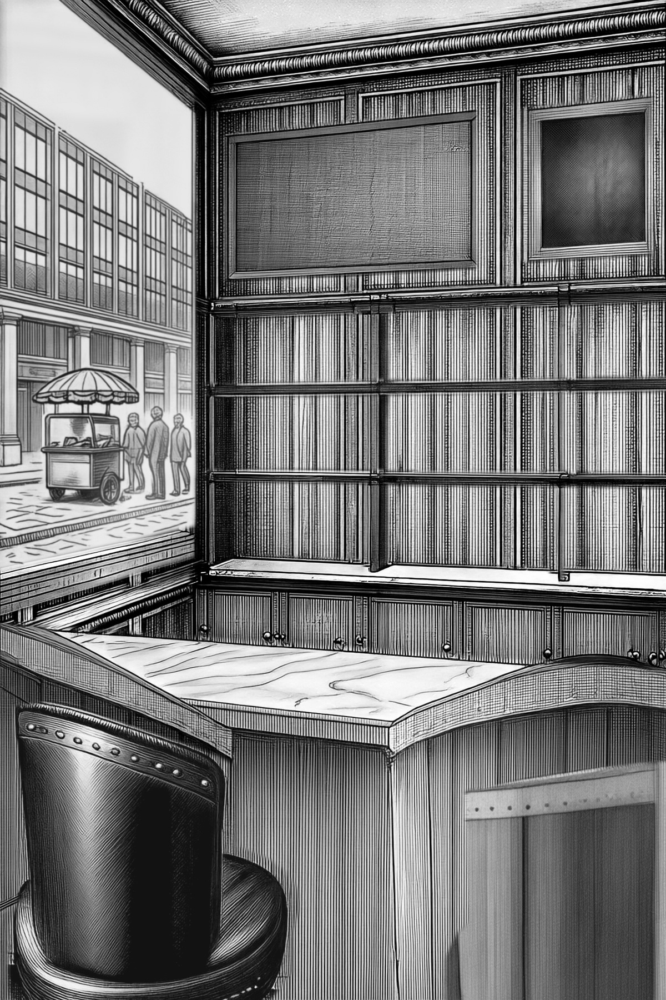

**The thinking.** Rendered in context - the plate as it stands behind this part, with only this part's own silhouette blocked in as values - so the pen, light and perspective are inherited; only the mask is laid back. Part note: the right-hand bar chair seen from behind: an upright curved back to mid-back height in SMOOTH, TIGHT, POLISHED dark leather with one broad soft sheen - no streaks, no ribbing, no hatching lines running down it - a slim padded roll along its top with a fine line of small brass nailheads, standing on a padded leather SEAT cushion that shows beside and below the back; plain straight walnut legs beneath. IDENTICAL to the other chair

**Settings.** local/sensenova-u1.5, seed 4, fast 8 steps cfg 1, tall canvas (drawn whole below the frame, cropped back), negative: cane, wicker, rattan, woven, basketwork, mesh, fabric weave, upholstery fabric, band, trim, strip, skirt, apron, valance, studded band, streaks, streaky, ribbed, corrugated, hatching lines, barrel, tub, drum, bottles, bottle, glasses, decanters, objects on shelves, lamp, sconce, light fixture

**Prompt.** [prompts/100-right-leather-club-chair-render-seed-4-fast-tall-canvas-laid-in-full-plate.prompt.txt](prompts/100-right-leather-club-chair-render-seed-4-fast-tall-canvas-laid-in-full-plate.prompt.txt)

*Logged 14:51.*

---

## 101. right-leather-club-chair render seed 7 fast tall-canvas laid in full plate

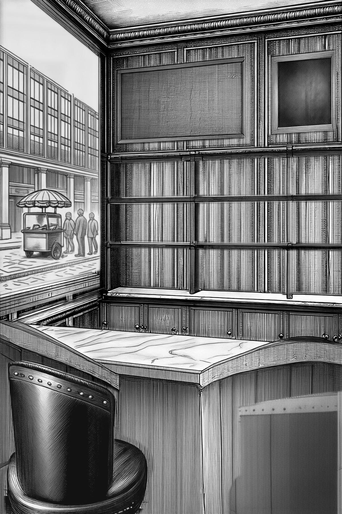

**The thinking.** Rendered in context - the plate as it stands behind this part, with only this part's own silhouette blocked in as values - so the pen, light and perspective are inherited; only the mask is laid back. Part note: the right-hand bar chair seen from behind: an upright curved back to mid-back height in SMOOTH, TIGHT, POLISHED dark leather with one broad soft sheen - no streaks, no ribbing, no hatching lines running down it - a slim padded roll along its top with a fine line of small brass nailheads, standing on a padded leather SEAT cushion that shows beside and below the back; plain straight walnut legs beneath. IDENTICAL to the other chair

**Settings.** local/sensenova-u1.5, seed 7, fast 8 steps cfg 1, tall canvas (drawn whole below the frame, cropped back), negative: cane, wicker, rattan, woven, basketwork, mesh, fabric weave, upholstery fabric, band, trim, strip, skirt, apron, valance, studded band, streaks, streaky, ribbed, corrugated, hatching lines, barrel, tub, drum, bottles, bottle, glasses, decanters, objects on shelves, lamp, sconce, light fixture

**Prompt.** [prompts/101-right-leather-club-chair-render-seed-7-fast-tall-canvas-laid-in-full-plate.prompt.txt](prompts/101-right-leather-club-chair-render-seed-7-fast-tall-canvas-laid-in-full-plate.prompt.txt)

*Logged 14:51.*

---

## 102. left-leather-club-chair and right-leather-club-chair render seed 7 tall-canvas laid in full plate

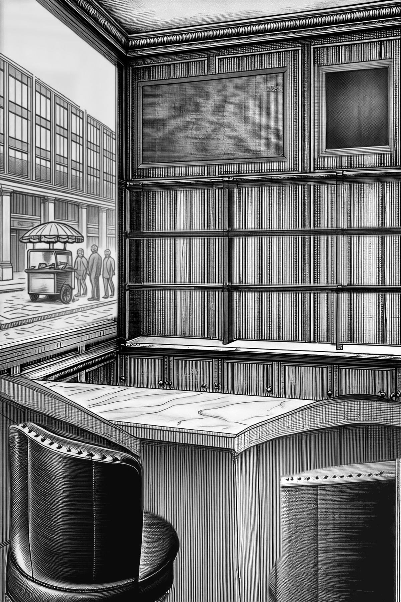

**The thinking.** Rendered in context - the plate as it stands behind this part, with only this part's own silhouette blocked in as values - so the pen, light and perspective are inherited; only the mask is laid back. Part note: the left-hand bar chair seen from behind: an upright curved back to mid-back height in SMOOTH, TIGHT, POLISHED dark leather with one broad soft sheen - no streaks, no ribbing, no hatching lines running down it - a slim padded roll along its top with a fine line of small brass nailheads, standing on a padded leather SEAT cushion that shows beside and below the back; plain straight walnut legs beneath. IDENTICAL to the other chair AND the right-hand bar chair seen from behind: an upright curved back to mid-back height in SMOOTH, TIGHT, POLISHED dark leather with one broad soft sheen - no streaks, no ribbing, no hatching lines running down it - a slim padded roll along its top with a fine line of small brass nailheads, standing on a padded leather SEAT cushion that shows beside and below the back; plain straight walnut legs beneath. IDENTICAL to the other chair

**Settings.** local/sensenova-u1.5, seed 7, full 40 steps cfg 4, tall canvas (drawn whole below the frame, cropped back), rendered together with chair-right, negative: cane, wicker, rattan, woven, basketwork, mesh, fabric weave, upholstery fabric, band, trim, strip, skirt, apron, valance, studded band, streaks, streaky, ribbed, corrugated, hatching lines, barrel, tub, drum, bottles, bottle, glasses, decanters, objects on shelves, lamp, sconce, light fixture

**Prompt.** [prompts/102-left-leather-club-chair-and-right-leather-club-chair-render-seed-7-tall-canvas-laid-in-full-plate.prompt.txt](prompts/102-left-leather-club-chair-and-right-leather-club-chair-render-seed-7-tall-canvas-laid-in-full-plate.prompt.txt)

*Logged 14:52.*

---

## 103. left-leather-club-chair and right-leather-club-chair render seed 21 tall-canvas laid in full plate

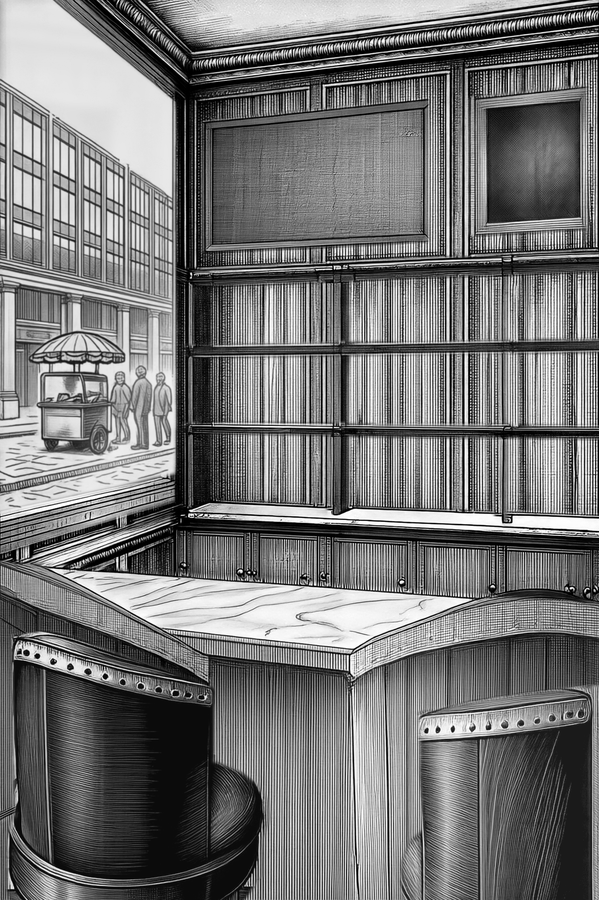

**The thinking.** Rendered in context - the plate as it stands behind this part, with only this part's own silhouette blocked in as values - so the pen, light and perspective are inherited; only the mask is laid back. Part note: the left-hand bar chair seen from behind: an upright curved back to mid-back height in SMOOTH, TIGHT, POLISHED dark leather with one broad soft sheen - no streaks, no ribbing, no hatching lines running down it - a slim padded roll along its top with a fine line of small brass nailheads, standing on a padded leather SEAT cushion that shows beside and below the back; plain straight walnut legs beneath. IDENTICAL to the other chair AND the right-hand bar chair seen from behind: an upright curved back to mid-back height in SMOOTH, TIGHT, POLISHED dark leather with one broad soft sheen - no streaks, no ribbing, no hatching lines running down it - a slim padded roll along its top with a fine line of small brass nailheads, standing on a padded leather SEAT cushion that shows beside and below the back; plain straight walnut legs beneath. IDENTICAL to the other chair

**Settings.** local/sensenova-u1.5, seed 21, full 40 steps cfg 4, tall canvas (drawn whole below the frame, cropped back), rendered together with chair-right, negative: cane, wicker, rattan, woven, basketwork, mesh, fabric weave, upholstery fabric, band, trim, strip, skirt, apron, valance, studded band, streaks, streaky, ribbed, corrugated, hatching lines, barrel, tub, drum, bottles, bottle, glasses, decanters, objects on shelves, lamp, sconce, light fixture

**Prompt.** [prompts/103-left-leather-club-chair-and-right-leather-club-chair-render-seed-21-tall-canvas-laid-in-full-plate.prompt.txt](prompts/103-left-leather-club-chair-and-right-leather-club-chair-render-seed-21-tall-canvas-laid-in-full-plate.prompt.txt)

*Logged 14:52.*

---

## 104. right chair sweep: pair seeds 4/7/21, solo full 21/33, solo fast 4/7 - none smooth with a roll

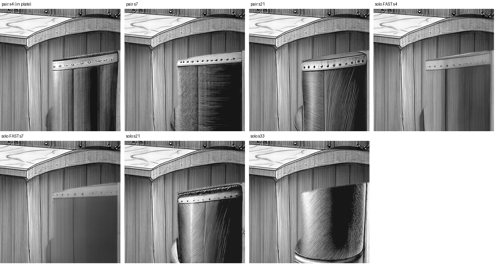

**The ask.** the chairs still look weird fix the seats and the leather

**The thinking.** With the new block-in the LEFT chair rendered exactly as asked on pair seed 4: smooth polished leather, one broad sheen, a nailhead roll, the cushion showing beneath. The RIGHT chair did not, on any route: the pair seeds hatched it into barrel staves (4) or a dense dark hatch (7) or brushed streaks (21); rendered alone, seed 33 gave smooth gloss but dropped the roll and read as a drum, seed 21 kept the roll and streaked; fast mode washed it to a pale flat mass. The difference between the two chairs is not the seed - it is that at the 16-degree pan the right chair's back is CUT by the frame's right edge (about 16 cm of it is out of frame), and a cut object is what this model re-imagines - the same failure the tall canvas cured for the bottom edge. So the fix is structural, not another sweep: the right chair moves in to x 1.22 so its whole back is inside the frame (the two cushions then sit 14 cm apart, ordinary bar spacing), and the pair is re-rendered on the tall canvas.

**Settings.** candidates: chair-left --with chair-right --tall s4/s7/s21; chair-right --tall s21/s33; chair-right --tall --fast s4/s7; next: STOOL_XS (0.52, 1.22)

**Verdict.** rejected all - move the right chair inside the frame

*Logged 14:53.*

---

## 105. left-leather-club-chair and right-leather-club-chair render seed 4 tall-canvas laid in full plate

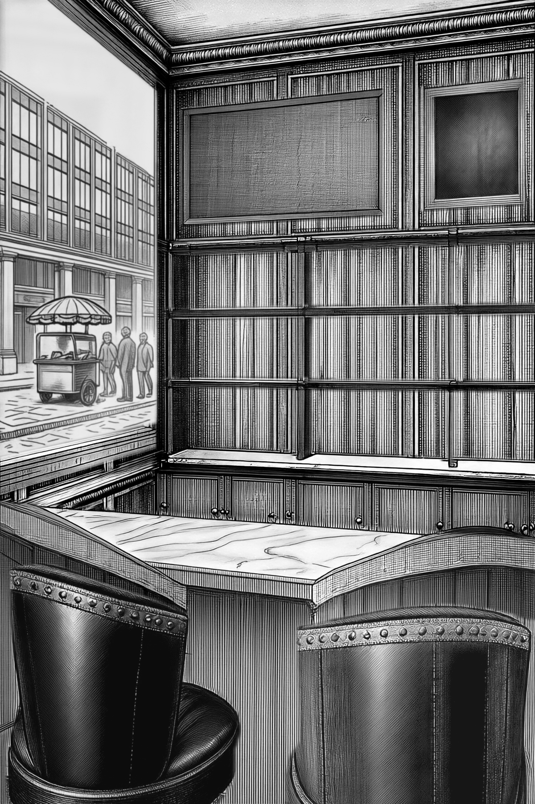

**The thinking.** Rendered in context - the plate as it stands behind this part, with only this part's own silhouette blocked in as values - so the pen, light and perspective are inherited; only the mask is laid back. Part note: the left-hand bar chair seen from behind: an upright curved back to mid-back height in SMOOTH, TIGHT, POLISHED dark leather with one broad soft sheen - no streaks, no ribbing, no hatching lines running down it - a slim padded roll along its top with a fine line of small brass nailheads, standing on a padded leather SEAT cushion that shows beside and below the back; plain straight walnut legs beneath. IDENTICAL to the other chair AND the right-hand bar chair seen from behind: an upright curved back to mid-back height in SMOOTH, TIGHT, POLISHED dark leather with one broad soft sheen - no streaks, no ribbing, no hatching lines running down it - a slim padded roll along its top with a fine line of small brass nailheads, standing on a padded leather SEAT cushion that shows beside and below the back; plain straight walnut legs beneath. IDENTICAL to the other chair

**Settings.** local/sensenova-u1.5, seed 4, full 40 steps cfg 4, tall canvas (drawn whole below the frame, cropped back), rendered together with chair-right, negative: cane, wicker, rattan, woven, basketwork, mesh, fabric weave, upholstery fabric, band, trim, strip, skirt, apron, valance, studded band, streaks, streaky, ribbed, corrugated, hatching lines, barrel, tub, drum, bottles, bottle, glasses, decanters, objects on shelves, lamp, sconce, light fixture

**Prompt.** [prompts/105-left-leather-club-chair-and-right-leather-club-chair-render-seed-4-tall-canvas-laid-in-full-plate.prompt.txt](prompts/105-left-leather-club-chair-and-right-leather-club-chair-render-seed-4-tall-canvas-laid-in-full-plate.prompt.txt)

*Logged 14:54.*

---

## 106. left-leather-club-chair and right-leather-club-chair render seed 21 tall-canvas laid in full plate

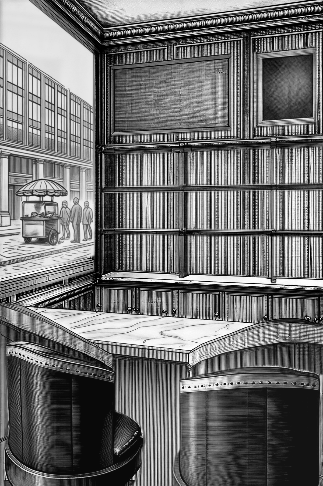

**The thinking.** Rendered in context - the plate as it stands behind this part, with only this part's own silhouette blocked in as values - so the pen, light and perspective are inherited; only the mask is laid back. Part note: the left-hand bar chair seen from behind: an upright curved back to mid-back height in SMOOTH, TIGHT, POLISHED dark leather with one broad soft sheen - no streaks, no ribbing, no hatching lines running down it - a slim padded roll along its top with a fine line of small brass nailheads, standing on a padded leather SEAT cushion that shows beside and below the back; plain straight walnut legs beneath. IDENTICAL to the other chair AND the right-hand bar chair seen from behind: an upright curved back to mid-back height in SMOOTH, TIGHT, POLISHED dark leather with one broad soft sheen - no streaks, no ribbing, no hatching lines running down it - a slim padded roll along its top with a fine line of small brass nailheads, standing on a padded leather SEAT cushion that shows beside and below the back; plain straight walnut legs beneath. IDENTICAL to the other chair

**Settings.** local/sensenova-u1.5, seed 21, full 40 steps cfg 4, tall canvas (drawn whole below the frame, cropped back), rendered together with chair-right, negative: cane, wicker, rattan, woven, basketwork, mesh, fabric weave, upholstery fabric, band, trim, strip, skirt, apron, valance, studded band, streaks, streaky, ribbed, corrugated, hatching lines, barrel, tub, drum, bottles, bottle, glasses, decanters, objects on shelves, lamp, sconce, light fixture

**Prompt.** [prompts/106-left-leather-club-chair-and-right-leather-club-chair-render-seed-21-tall-canvas-laid-in-full-plate.prompt.txt](prompts/106-left-leather-club-chair-and-right-leather-club-chair-render-seed-21-tall-canvas-laid-in-full-plate.prompt.txt)

*Logged 14:54.*

---

## 107. left-leather-club-chair and right-leather-club-chair render seed 33 tall-canvas laid in full plate

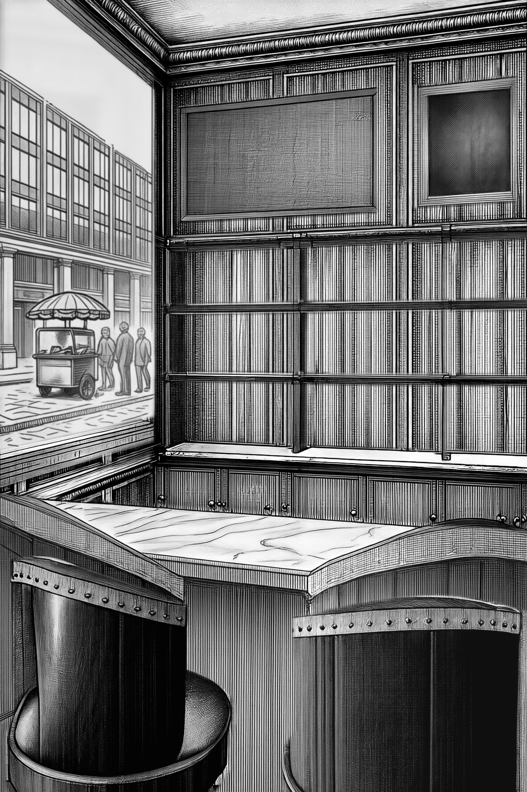

**The thinking.** Rendered in context - the plate as it stands behind this part, with only this part's own silhouette blocked in as values - so the pen, light and perspective are inherited; only the mask is laid back. Part note: the left-hand bar chair seen from behind: an upright curved back to mid-back height in SMOOTH, TIGHT, POLISHED dark leather with one broad soft sheen - no streaks, no ribbing, no hatching lines running down it - a slim padded roll along its top with a fine line of small brass nailheads, standing on a padded leather SEAT cushion that shows beside and below the back; plain straight walnut legs beneath. IDENTICAL to the other chair AND the right-hand bar chair seen from behind: an upright curved back to mid-back height in SMOOTH, TIGHT, POLISHED dark leather with one broad soft sheen - no streaks, no ribbing, no hatching lines running down it - a slim padded roll along its top with a fine line of small brass nailheads, standing on a padded leather SEAT cushion that shows beside and below the back; plain straight walnut legs beneath. IDENTICAL to the other chair

**Settings.** local/sensenova-u1.5, seed 33, full 40 steps cfg 4, tall canvas (drawn whole below the frame, cropped back), rendered together with chair-right, negative: cane, wicker, rattan, woven, basketwork, mesh, fabric weave, upholstery fabric, band, trim, strip, skirt, apron, valance, studded band, streaks, streaky, ribbed, corrugated, hatching lines, barrel, tub, drum, bottles, bottle, glasses, decanters, objects on shelves, lamp, sconce, light fixture

**Prompt.** [prompts/107-left-leather-club-chair-and-right-leather-club-chair-render-seed-33-tall-canvas-laid-in-full-plate.prompt.txt](prompts/107-left-leather-club-chair-and-right-leather-club-chair-render-seed-33-tall-canvas-laid-in-full-plate.prompt.txt)

*Logged 14:55.*

---

## 108. whole-plate assembled with cabinet-doors-under-ledge bartenders-marble-ledge back-bar-carcass back-bar-lower-shelf back-bar-upper-shelf television-blank chalkboard-blank window-frame-and-reveal window-glass-street-view main-bar-marble-counter left-leather-club-chair right-leather-club-chair and window-sign

**The thinking.** Base plus every approved, enabled part laid in order through its own silhouette; the TV's blank screen and the window's lettering are drawn in code last, because lettering is never left to the model.

*Logged 14:55.*

---

## 109. whole-plate assembled with cabinet-doors-under-ledge bartenders-marble-ledge back-bar-carcass back-bar-lower-shelf back-bar-upper-shelf television-blank chalkboard-blank window-frame-and-reveal window-glass-street-view main-bar-marble-counter left-leather-club-chair right-leather-club-chair and window-sign

**The thinking.** Base plus every approved, enabled part laid in order through its own silhouette; the TV's blank screen and the window's lettering are drawn in code last, because lettering is never left to the model.

*Logged 14:56.*

---

## 110. full plate: open shelves against the wall, upright chairs with seats, Bahnschrift sign

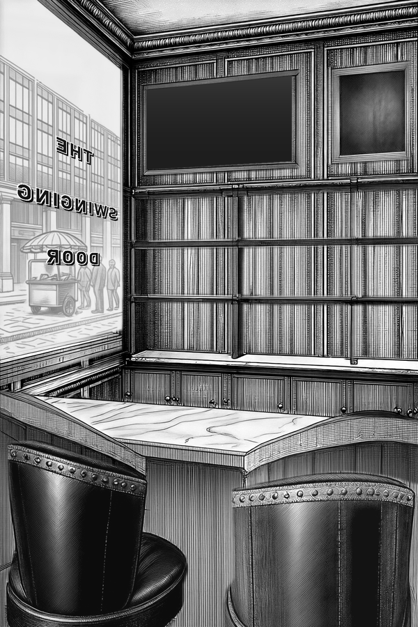

**The ask.** the chairs still look weird fix the seats and the leather and you messed up the shelves understand there is a wall behind the shelves you are really starting to go off track and messing this up the sign is looking more legible we just need a little bit better text that looks modern readable and classy

**The thinking.** The three corrections assembled. The back bar is open shelving against the wall; both chairs come from one pair render (seed 4) after the right chair was moved inside the frame - smooth polished leather, nailhead roll, cushion beneath; the sign is Bahnschrift Bold. Only the back bar, the two chairs and the sign changed; every other approved part (base, cabinets, ledge, shelves, television, chalkboard, window frame, glass, counter) is the same file laid through the same mask.

**Settings.** room-part.py build; backbar seed 7 (open shelves); chair pair seed 4 on the tall canvas with the right chair moved in to x 1.22; sign Bahnschrift Bold

**Verdict.** for the founder's verdict

*Logged 14:56.*

---

## 111. whole-plate assembled with cabinet-doors-under-ledge bartenders-marble-ledge television-blank chalkboard-blank window-frame-and-reveal window-glass-street-view main-bar-marble-counter and window-sign

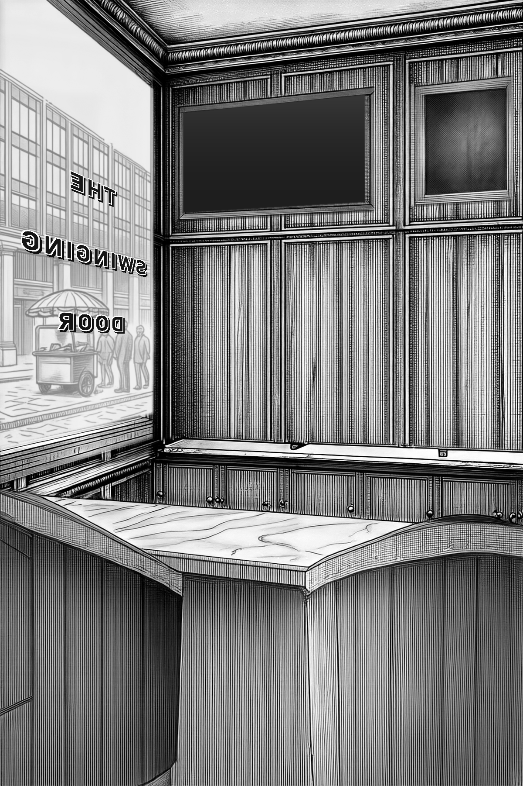

**The thinking.** Base plus every approved, enabled part laid in order through its own silhouette; the TV's blank screen and the window's lettering are drawn in code last, because lettering is never left to the model.

*Logged 15:08.*

---

## 112. bar alone, chairs removed: the counter's own render arches its right end - the 'duplicate chair back'

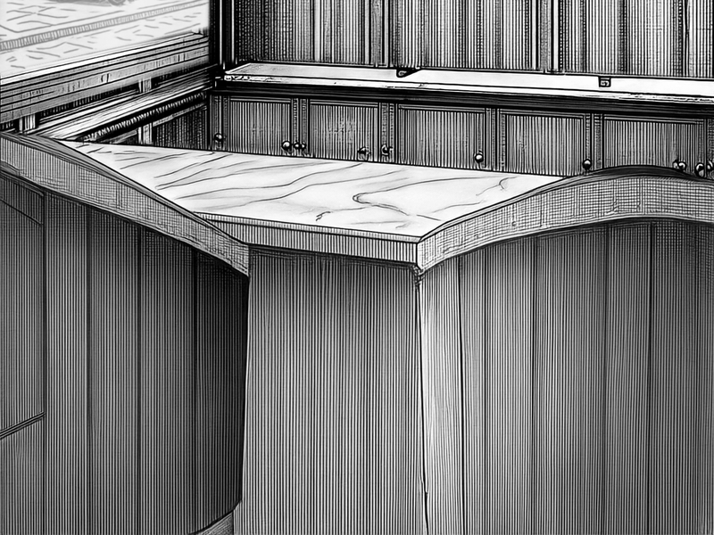

**The ask.** remove the chairs and see what the bar looks like then we can perfect the chairs separately modularly

**The thinking.** Chairs and the shelf unit switched off (DISABLED), both canvases redrawn, plate rebuilt from the approved parts. With nothing in front of it the defect is plain and it is the COUNTER's render, not a chair layer: the marble edge runs straight down to the right in the block-in, but the approved counter render bends the bar's right end up into an arch with a lip along it - the shape of a chair back - exactly where the old chair stood. That is what read as a duplicate back carried onto the bar. Fix: re-render the counter with the chairs absent and check the rendered edge against the block-in's straight line before approving.

**Settings.** DISABLED += backbar, shelf-lower, shelf-upper, chair-left, chair-right; build only, no render

**Verdict.** defect isolated to the counter part - re-render

*Logged 15:11.*

---

## 113. wall alone, shelf unit removed: the base's panelling where the shelves stood

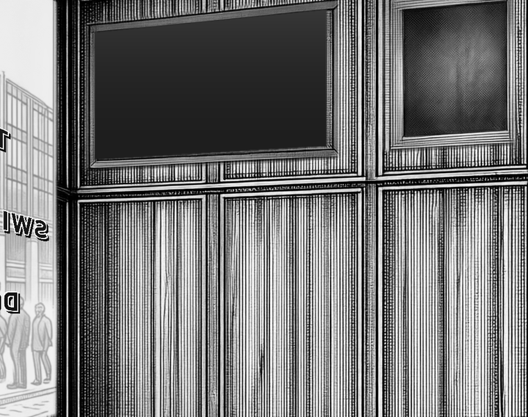

**The ask.** lets remove the shelf look at the wall and make sure its correct then build the shelf separately and add it back in once ive approved it

**The thinking.** The shelf unit is off, so this is the base render's wall between the frieze rail and the ledge: three bays of raised-and-fielded panels with stiles, the TV and chalkboard above. This is the wall the founder will approve before a shelf unit is designed against it as a built-in with real depth (thick cheeks with visible side faces, shelves with thickness and cast shadows, dividers that cannot vanish into the wall's stiles) - the last unit was thin lines on the wall and read as flat, and its right divider merged into a stile.

**Settings.** build only; base seed unchanged

**Verdict.** for the founder's approval

*Logged 15:11.*

---

## 114. main-bar-marble-counter render seed 7 laid in full plate

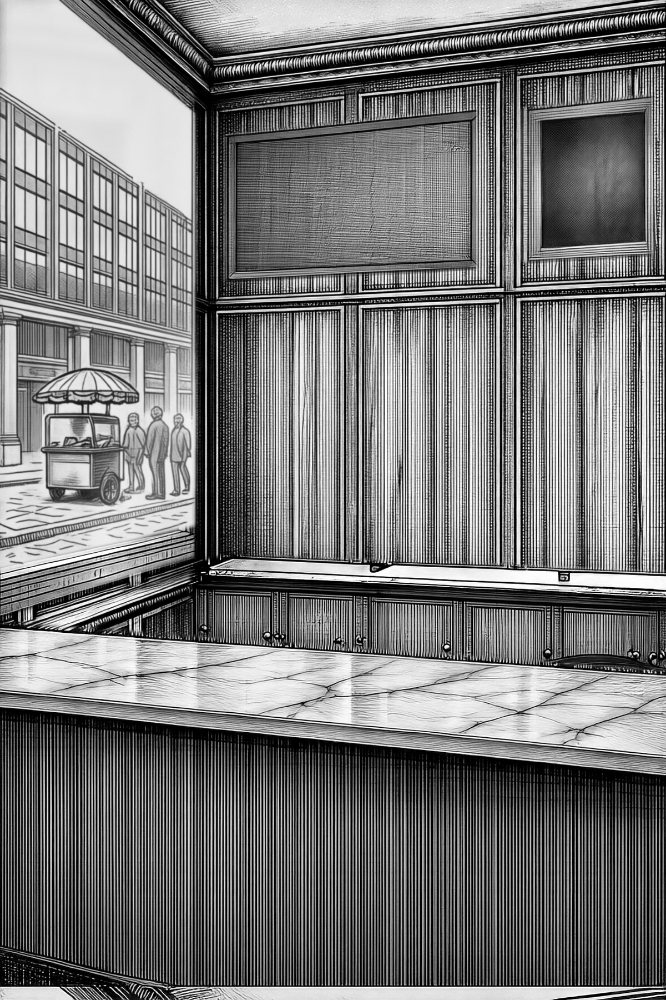

**The thinking.** Rendered in context - the plate as it stands behind this part, with only this part's own silhouette blocked in as values - so the pen, light and perspective are inherited; only the mask is laid back. Part note: the bar: the polished marble counter top, its slim moulded lip and the walnut-panelled bar front beneath it

**Settings.** local/sensenova-u1.5, seed 7, full 40 steps cfg 4, negative: post, pole, column, pillar, tap, beer tap, pump, handle, bottle, glass, object on the counter, lamp, bullnose, rounded nosing, moulded edge, bolster, cushion, padded edge, heavy dark veins, cracked stone, bottles, bottle, glasses, decanters, objects on shelves, chair, stool, seat, barstool, lamp, sconce, light fixture

**Prompt.** [prompts/114-main-bar-marble-counter-render-seed-7-laid-in-full-plate.prompt.txt](prompts/114-main-bar-marble-counter-render-seed-7-laid-in-full-plate.prompt.txt)

*Logged 15:14.*

---

## 115. main-bar-marble-counter render seed 11 laid in full plate

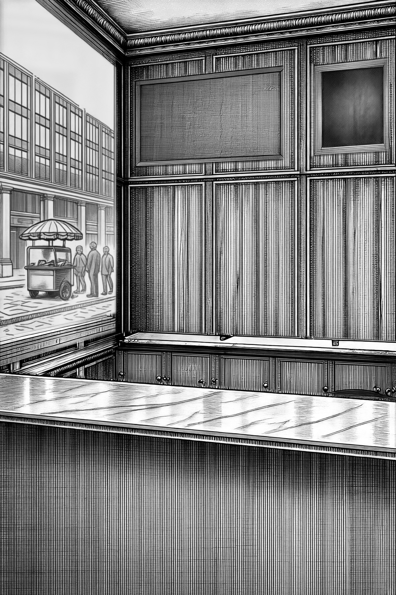

**The thinking.** Rendered in context - the plate as it stands behind this part, with only this part's own silhouette blocked in as values - so the pen, light and perspective are inherited; only the mask is laid back. Part note: the bar: the polished marble counter top, its slim moulded lip and the walnut-panelled bar front beneath it

**Settings.** local/sensenova-u1.5, seed 11, full 40 steps cfg 4, negative: post, pole, column, pillar, tap, beer tap, pump, handle, bottle, glass, object on the counter, lamp, bullnose, rounded nosing, moulded edge, bolster, cushion, padded edge, heavy dark veins, cracked stone, bottles, bottle, glasses, decanters, objects on shelves, chair, stool, seat, barstool, lamp, sconce, light fixture

**Prompt.** [prompts/115-main-bar-marble-counter-render-seed-11-laid-in-full-plate.prompt.txt](prompts/115-main-bar-marble-counter-render-seed-11-laid-in-full-plate.prompt.txt)

*Logged 15:14.*

---

## 116. main-bar-marble-counter render seed 21 laid in full plate

**The thinking.** Rendered in context - the plate as it stands behind this part, with only this part's own silhouette blocked in as values - so the pen, light and perspective are inherited; only the mask is laid back. Part note: the bar: the polished marble counter top, its slim moulded lip and the walnut-panelled bar front beneath it

**Settings.** local/sensenova-u1.5, seed 21, full 40 steps cfg 4, negative: post, pole, column, pillar, tap, beer tap, pump, handle, bottle, glass, object on the counter, lamp, bullnose, rounded nosing, moulded edge, bolster, cushion, padded edge, heavy dark veins, cracked stone, bottles, bottle, glasses, decanters, objects on shelves, chair, stool, seat, barstool, lamp, sconce, light fixture

**Prompt.** [prompts/116-main-bar-marble-counter-render-seed-21-laid-in-full-plate.prompt.txt](prompts/116-main-bar-marble-counter-render-seed-21-laid-in-full-plate.prompt.txt)

*Logged 15:14.*

---

## 117. main-bar-marble-counter render seed 33 laid in full plate

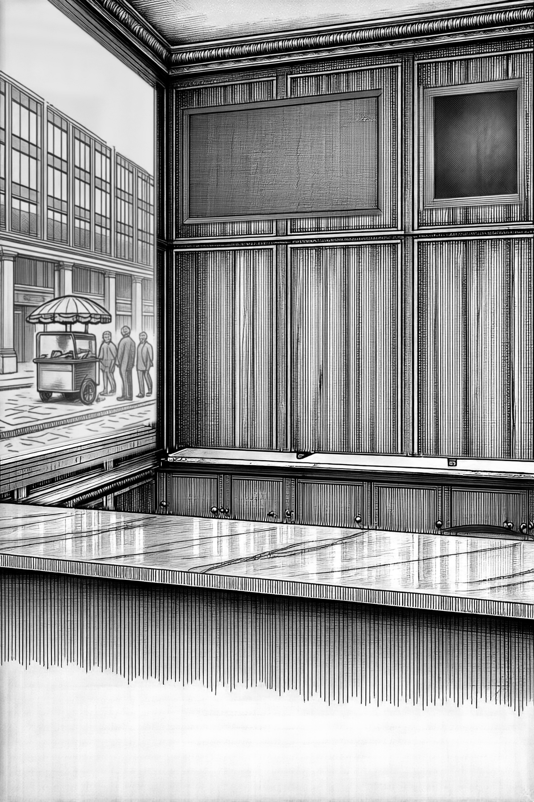

**The thinking.** Rendered in context - the plate as it stands behind this part, with only this part's own silhouette blocked in as values - so the pen, light and perspective are inherited; only the mask is laid back. Part note: the bar: the polished marble counter top, its slim moulded lip and the walnut-panelled bar front beneath it

**Settings.** local/sensenova-u1.5, seed 33, full 40 steps cfg 4, negative: post, pole, column, pillar, tap, beer tap, pump, handle, bottle, glass, object on the counter, lamp, bullnose, rounded nosing, moulded edge, bolster, cushion, padded edge, heavy dark veins, cracked stone, bottles, bottle, glasses, decanters, objects on shelves, chair, stool, seat, barstool, lamp, sconce, light fixture

**Prompt.** [prompts/117-main-bar-marble-counter-render-seed-33-laid-in-full-plate.prompt.txt](prompts/117-main-bar-marble-counter-render-seed-33-laid-in-full-plate.prompt.txt)

*Logged 15:15.*

---

## 118. whole-plate assembled with cabinet-doors-under-ledge bartenders-marble-ledge television-blank chalkboard-blank window-frame-and-reveal window-glass-street-view main-bar-marble-counter and window-sign

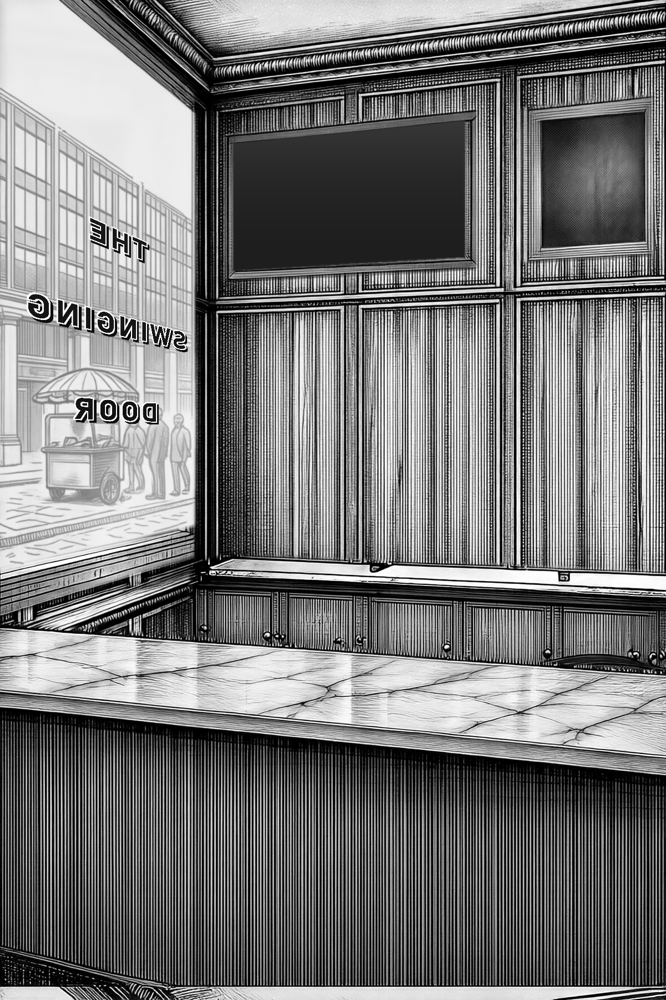

**The thinking.** Base plus every approved, enabled part laid in order through its own silhouette; the TV's blank screen and the window's lettering are drawn in code last, because lettering is never left to the model.

*Logged 15:16.*

---

## 119. counter re-rendered with the chairs off: seeds 7, 11, 21, 33 against the arched render - seed 7 chosen

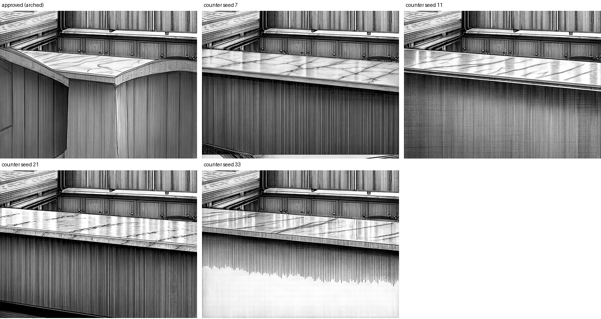

**The ask.** remove the chairs and see what the bar looks like

**The thinking.** All four re-renders keep the bar's near edge straight, so the arch was that one render, not the geometry or the prompt. Seed 33 breaks the bar front into white drips; seed 11 turns the marble top into reflective glass; seed 21 reeds the top with reflections and thickens the lip into a leather-like band; seed 7 is a clean straight slab of veined marble with a thin square lip over a plain hatched walnut front. Seed 7 replaces the arched counter in the plate; the arched version is kept as the previous counter version in the object history so it can be compared or restored.

**Settings.** room-part.py render counter --seed 7/11/21/33 (chairs, shelves disabled; NO_CHAIRS prompt swap; back-bar line dropped); approve counter s7

**Verdict.** seed 7 approved into the plate - bar shown to the founder for approval

*Logged 15:16.*

---

## 120. shelf unit round 1: three built-in designs by Opus teammates (niche, carcass, floating slabs) - values only, all three rejected by the critics

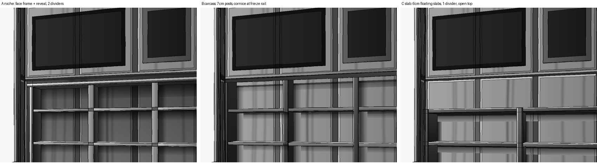

**The ask.** the shelves dont look like they were built into the wall it just looks flat ... build the shelf separately and add it back in once ive approved it

**The thinking.** Three teammates each redesigned the unit in a copy of the construction: A a niche let into the wall with a face frame and a shaded reveal; B a freestanding carcass with 7 cm posts, side faces, cast shadows and a cornice; C two 6 cm floating slabs housed into thick posts with the wall open above. Two critics per design (one arguing the founder's words, one arguing what the engraving model does with a block-in) rejected all three, and they agree on the cause: the unit's right end (BACKBAR_X 2.16 m) projects OUTSIDE the 1200 px frame at this camera, so no design has a visible right cheek - which is almost certainly what 'one of the dividers on the right side of the shelf is gone' has meant all along; dividers land on or beside the wall's stiles and merge with them; B's cornice sits on the wall's own frieze rail; A's recess shade did not actually reach the wall pixels; thin lit arrises vanish. Round 2 brings the right end inside the frame, places uprights by projected clearance from the stiles, and thickens every member. No GPU spent.

**Settings.** workflow wf_a9889947-83c: design:A/B/C (opus, high) + critique founder/model per variant; patches in scratchpad shelf-*/patch.diff

**Verdict.** all three rejected before rendering - fixes merged into round 2

*Logged 15:49.*

---

## 121. root cause of the duplicate chair back: the counter's block-in was cut from the single occluded values image, so the chair was inside it

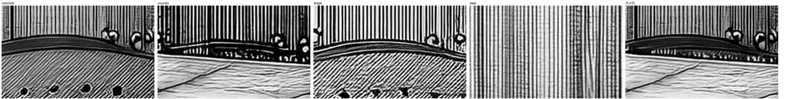

**The ask.** what i see you did was add the cusions but what also happened is a duplicate back of the chairs carried over to the bar

**The thinking.** Teammate diagnosis, verified against the files: since the own-silhouette masks (each part's FULL silhouette) were introduced, every part's block-in is still cut from ONE values image in which later parts overpaint earlier ones. The counter's mask therefore pulled 48.6% of its block-in from pixels the chairs had painted - a chair back, roll and nailheads - and the model drew that into the bar. Cabinets (70%) and the ledge were rendered under the same fault, so the strip just above the counter still carries the arch in the plate, and every counter re-render inherits it; that is why switching the chairs off did not clear it. Fix: a values image PER PART (each part drawn with only what stands behind it), then re-render cabinets, ledge and counter in lay order with the chairs off, verifying each with the teammate's straight-edge check.

**Settings.** check_edge.py: block-in bend 1.1 px PASS; approved s4 bend 43 px FAIL; plate cap 31 px FAIL; per-part values patch to follow

**Verdict.** root cause confirmed - structural fix before any more counter seeds

*Logged 15:49.*

---

## 122. wall check with the shelf unit off: construction correct, render reeded - every panel field is 40-48 vertical lines instead of a walnut board

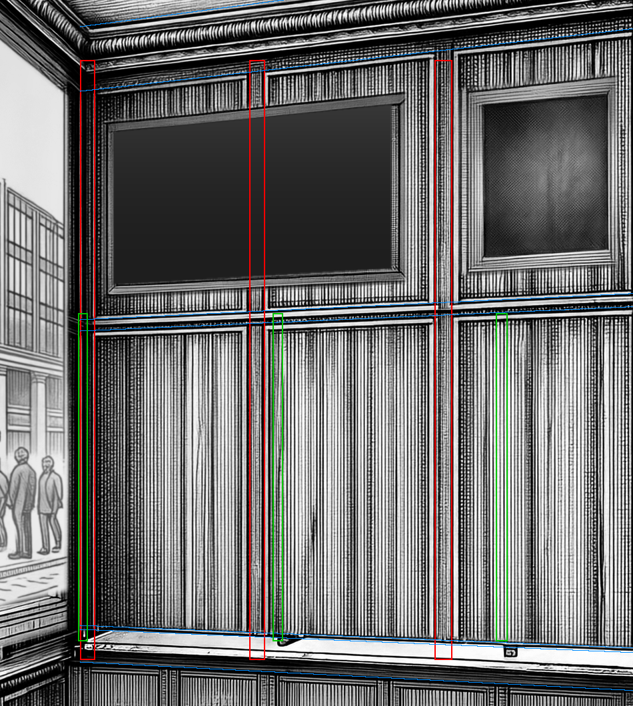

**The ask.** lets remove the shelf look at the wall and make sure its correct

**The thinking.** Teammate measurement against the construction: the bay module, stile positions, rails, corner, crown and ledge all land within a few pixels of the geometry (red boxes), so the WALL AS BUILT is right. The RENDER is not: each panel field is uniform vertical reeding at a 5 px pitch across its full height, the rendered stiles are twice their constructed width (spilling right), and the frieze rail is twice as deep. The base prompt names reeding, fluting, striping and corduroy as things to avoid four times in one paragraph - naming the failure is the likeliest reason the model produces it. Proposed: rewrite the panelling paragraph in positive terms only (smooth, evenly toned boards with two or three soft grain lines, the raised field catching light on one bevel) and re-render the base alone; the geometry stays. A shelf unit in front of reeded fields will always read flat.

**Settings.** wall-check crops in scratchpad/wall-check/; base render unchanged so far

**Verdict.** geometry approved; render to be re-done - base candidates to follow for the founder

*Logged 15:49.*

---

## 123. base-walls-crown-floor render seed 7 full plate

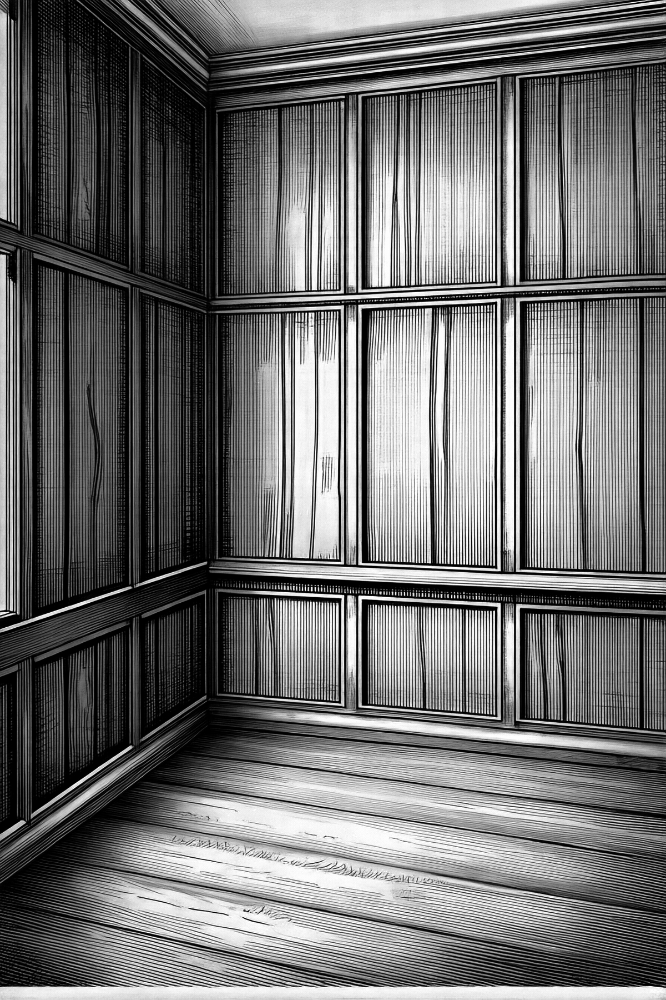

**The thinking.** The base is the architecture alone - walls, crown, floor - rendered from the construction's value drawing. Everything else is a part laid over it, so the base is chosen for its panelling and tone.

**Settings.** local/sensenova-u1.5, seed 7, full 40 steps cfg 4, levelled so the back wall's mean reads 112

**Prompt.** [prompts/123-base-walls-crown-floor-render-seed-7-full-plate.prompt.txt](prompts/123-base-walls-crown-floor-render-seed-7-full-plate.prompt.txt)

*Logged 15:51.*

---

## 124. base-walls-crown-floor render seed 21 full plate

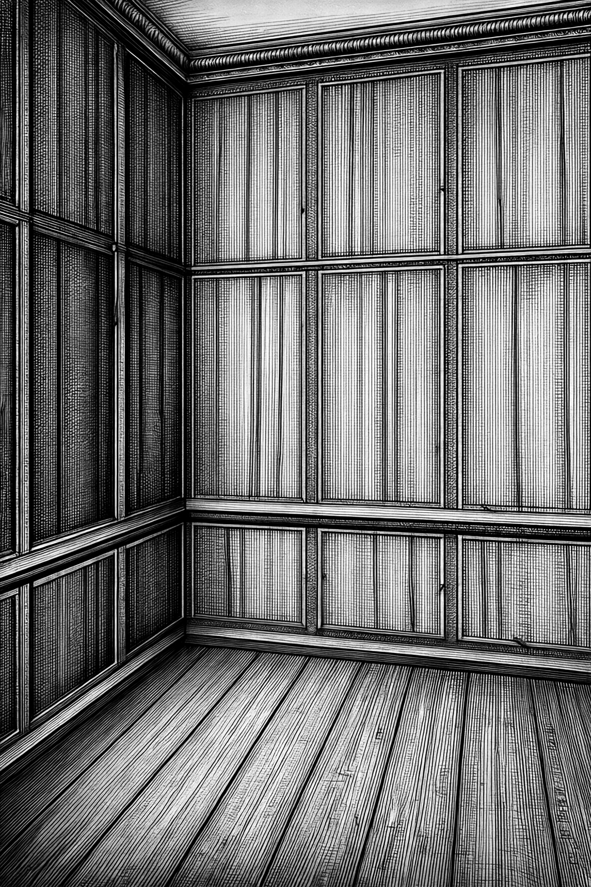

**The thinking.** The base is the architecture alone - walls, crown, floor - rendered from the construction's value drawing. Everything else is a part laid over it, so the base is chosen for its panelling and tone.

**Settings.** local/sensenova-u1.5, seed 21, full 40 steps cfg 4, levelled so the back wall's mean reads 112

**Prompt.** [prompts/124-base-walls-crown-floor-render-seed-21-full-plate.prompt.txt](prompts/124-base-walls-crown-floor-render-seed-21-full-plate.prompt.txt)

*Logged 15:51.*

---

## 125. base-walls-crown-floor render seed 33 full plate

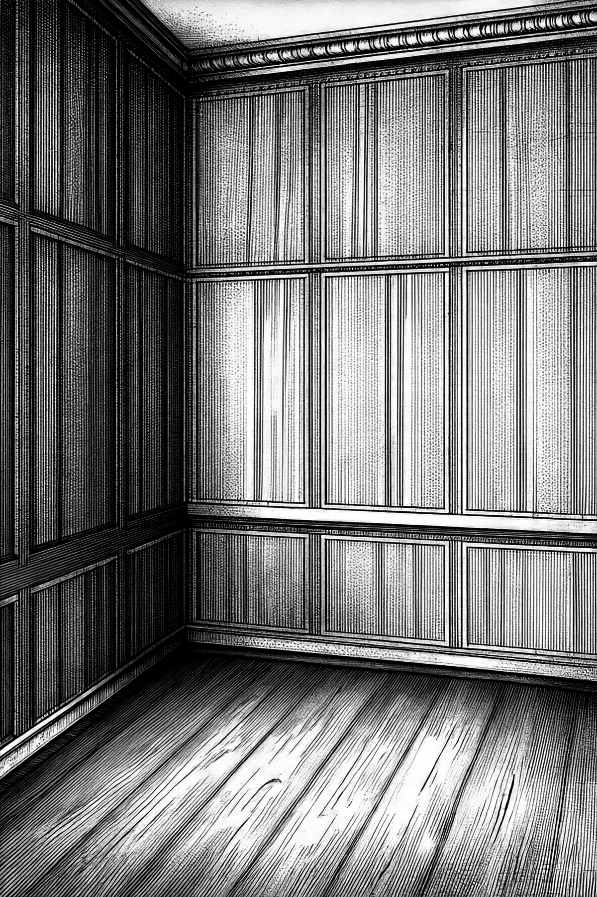

**The thinking.** The base is the architecture alone - walls, crown, floor - rendered from the construction's value drawing. Everything else is a part laid over it, so the base is chosen for its panelling and tone.

**Settings.** local/sensenova-u1.5, seed 33, full 40 steps cfg 4, levelled so the back wall's mean reads 112

**Prompt.** [prompts/125-base-walls-crown-floor-render-seed-33-full-plate.prompt.txt](prompts/125-base-walls-crown-floor-render-seed-33-full-plate.prompt.txt)

*Logged 15:51.*

---

## 126. base-walls-crown-floor render seed 44 full plate

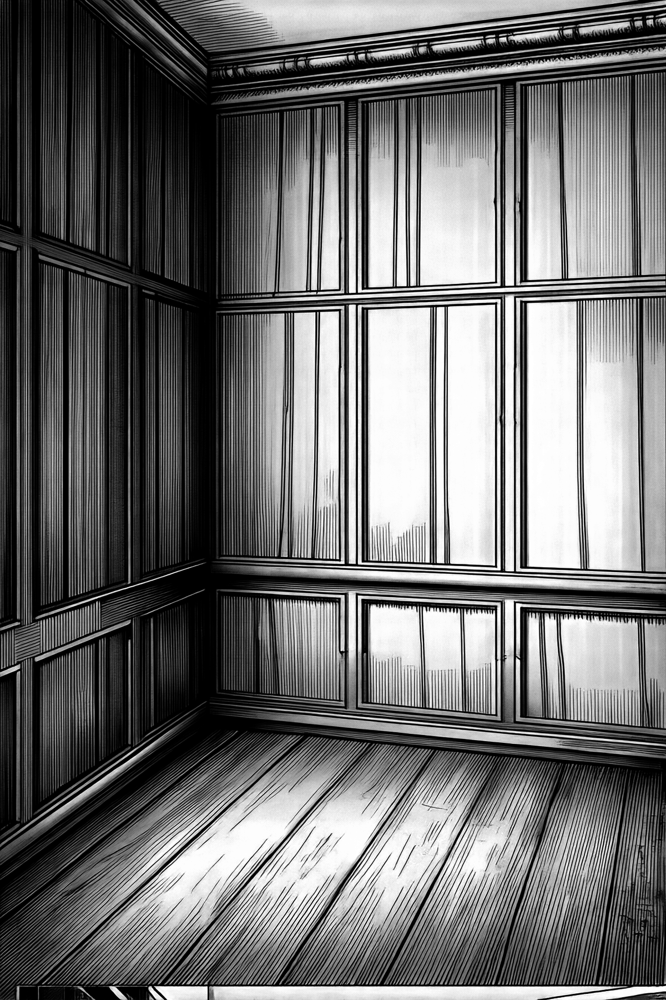

**The thinking.** The base is the architecture alone - walls, crown, floor - rendered from the construction's value drawing. Everything else is a part laid over it, so the base is chosen for its panelling and tone.

**Settings.** local/sensenova-u1.5, seed 44, full 40 steps cfg 4, levelled so the back wall's mean reads 112

**Prompt.** [prompts/126-base-walls-crown-floor-render-seed-44-full-plate.prompt.txt](prompts/126-base-walls-crown-floor-render-seed-44-full-plate.prompt.txt)

*Logged 15:52.*

---

## 127. base wall re-rendered with a positive-only panelling prompt: seeds 7, 21, 33, 44 - all worse than the current wall, prompt reverted

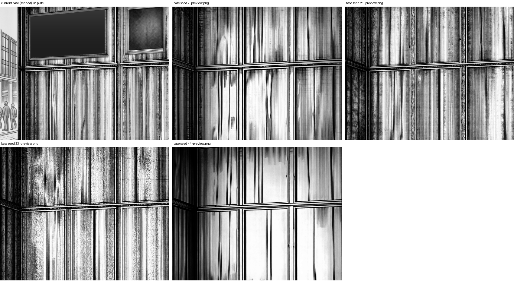

**The ask.** lets remove the shelf look at the wall and make sure its correct

**The thinking.** The teammate's hypothesis was that naming reeding, fluting and corduroy as things to avoid is what produces them, so the panelling paragraph was rewritten in positive terms only (smooth evenly toned boards, two or three soft wandering grain lines, the raised field lit on its left bevel). Four seeds: 7 blotchy white patches between thin verticals, 21 a cross-hatched mesh, 33 stipple above the rail and reeds below, 44 near-bare paper. The current wall is reeded but consistent in tone, which is the better ground for the objects in front of it. Prompt restored; the four candidates are filed in the base's history. The wall's texture stays open as its own module for later - the geometry is right, and the founder has not asked for the texture to change.

**Settings.** 08-base.prompt.txt panelling paragraph rewritten then restored (both kept beside it); render base --seed 7/21/33/44

**Verdict.** rejected all four - current base kept

*Logged 16:02.*

---

## 128. cabinet-doors-under-ledge render seed 7 laid in full plate

**The thinking.** Rendered in context - the plate as it stands behind this part, with only this part's own silhouette blocked in as values - so the pen, light and perspective are inherited; only the mask is laid back. Part note: the cabinets under the back bar's working ledge: a run of panelled walnut cupboard doors, each a raised-and-fielded panel with a small brass knob, down to a plinth

**Settings.** local/sensenova-u1.5, seed 7, full 40 steps cfg 4, negative: television, screen, monitor, black rectangle, picture, frame, poster, sign, lettering, bottles, glasses, mirror, mirrored panel, glass panel, white panel, lightbox, frosted glass, window, bottles, bottle, glasses, decanters, objects on shelves, chair, stool, seat, barstool, chalkboard, blackboard, framed board, picture, frame, lamp, sconce, light fixture, television, screen, monitor, flat screen

**Prompt.** [prompts/128-cabinet-doors-under-ledge-render-seed-7-laid-in-full-plate.prompt.txt](prompts/128-cabinet-doors-under-ledge-render-seed-7-laid-in-full-plate.prompt.txt)

*Logged 16:02.*

---

## 129. cabinet-doors-under-ledge render seed 21 laid in full plate

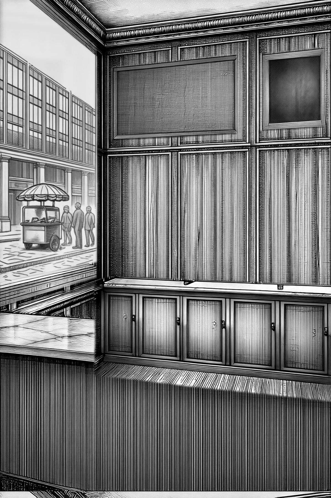

**The thinking.** Rendered in context - the plate as it stands behind this part, with only this part's own silhouette blocked in as values - so the pen, light and perspective are inherited; only the mask is laid back. Part note: the cabinets under the back bar's working ledge: a run of panelled walnut cupboard doors, each a raised-and-fielded panel with a small brass knob, down to a plinth

**Settings.** local/sensenova-u1.5, seed 21, full 40 steps cfg 4, negative: television, screen, monitor, black rectangle, picture, frame, poster, sign, lettering, bottles, glasses, mirror, mirrored panel, glass panel, white panel, lightbox, frosted glass, window, bottles, bottle, glasses, decanters, objects on shelves, chair, stool, seat, barstool, chalkboard, blackboard, framed board, picture, frame, lamp, sconce, light fixture, television, screen, monitor, flat screen

**Prompt.** [prompts/129-cabinet-doors-under-ledge-render-seed-21-laid-in-full-plate.prompt.txt](prompts/129-cabinet-doors-under-ledge-render-seed-21-laid-in-full-plate.prompt.txt)

*Logged 16:02.*

---

## 130. cabinet-doors-under-ledge render seed 33 laid in full plate

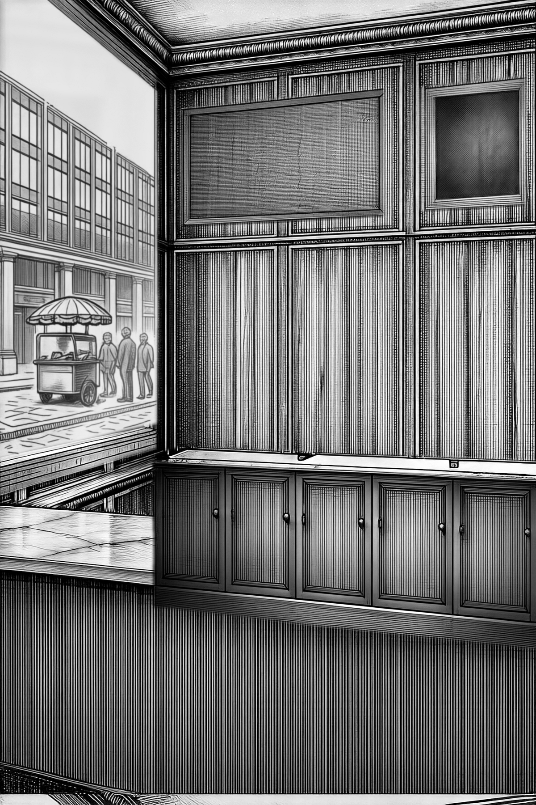

**The thinking.** Rendered in context - the plate as it stands behind this part, with only this part's own silhouette blocked in as values - so the pen, light and perspective are inherited; only the mask is laid back. Part note: the cabinets under the back bar's working ledge: a run of panelled walnut cupboard doors, each a raised-and-fielded panel with a small brass knob, down to a plinth

**Settings.** local/sensenova-u1.5, seed 33, full 40 steps cfg 4, negative: television, screen, monitor, black rectangle, picture, frame, poster, sign, lettering, bottles, glasses, mirror, mirrored panel, glass panel, white panel, lightbox, frosted glass, window, bottles, bottle, glasses, decanters, objects on shelves, chair, stool, seat, barstool, chalkboard, blackboard, framed board, picture, frame, lamp, sconce, light fixture, television, screen, monitor, flat screen

**Prompt.** [prompts/130-cabinet-doors-under-ledge-render-seed-33-laid-in-full-plate.prompt.txt](prompts/130-cabinet-doors-under-ledge-render-seed-33-laid-in-full-plate.prompt.txt)

*Logged 16:03.*

---

## 131. whole-plate assembled with cabinet-doors-under-ledge bartenders-marble-ledge television-blank chalkboard-blank window-frame-and-reveal window-glass-street-view main-bar-marble-counter and window-sign

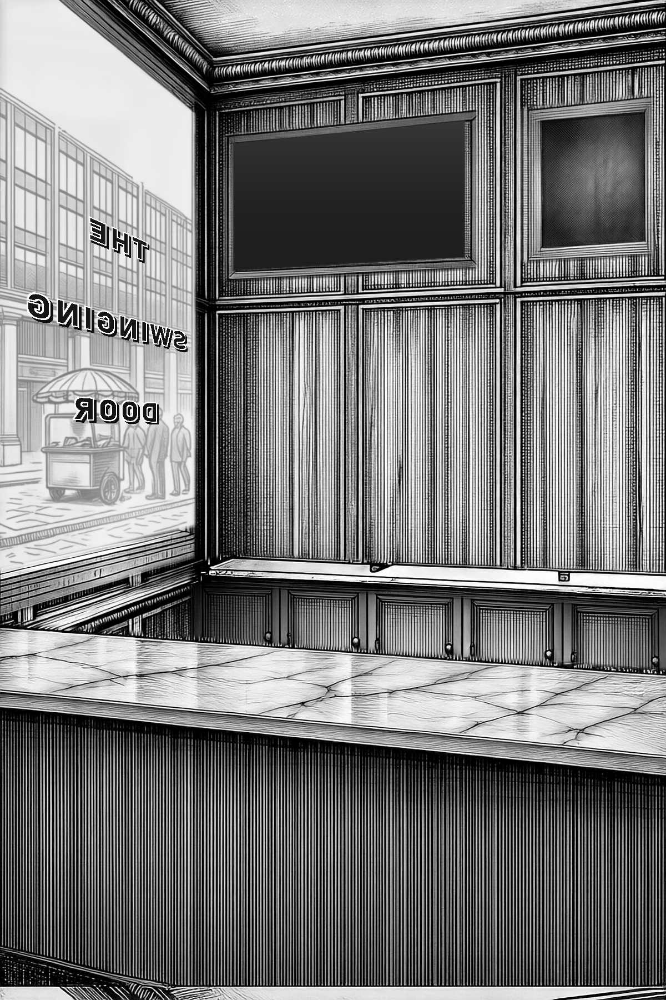

**The thinking.** Base plus every approved, enabled part laid in order through its own silhouette; the TV's blank screen and the window's lettering are drawn in code last, because lettering is never left to the model.

*Logged 16:03.*

---

## 132. bartenders-marble-ledge render seed 7 laid in full plate

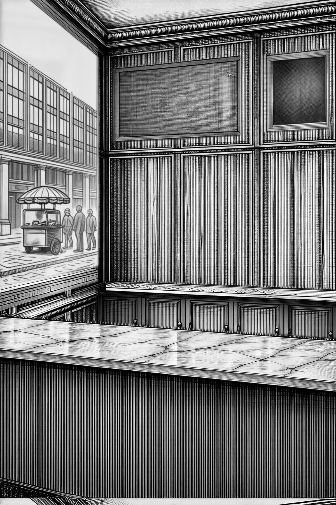

**The thinking.** Rendered in context - the plate as it stands behind this part, with only this part's own silhouette blocked in as values - so the pen, light and perspective are inherited; only the mask is laid back. Part note: the back bar's working ledge: a marble-topped counter at waist height running the width of the unit, its polished top pale and veined, its front a slim moulded marble edge, its back flush into the cabinet - empty, nothing standing on it

**Settings.** local/sensenova-u1.5, seed 7, full 40 steps cfg 4, negative: post, pole, column, pillar, tap, beer tap, pump, handle, bottle, glass, object on the counter, lamp, bullnose, rounded nosing, moulded edge, bolster, cushion, padded edge, heavy dark veins, cracked stone, bottles, bottle, glasses, decanters, objects on shelves, chair, stool, seat, barstool, chalkboard, blackboard, framed board, picture, frame, lamp, sconce, light fixture, television, screen, monitor, flat screen

**Prompt.** [prompts/132-bartenders-marble-ledge-render-seed-7-laid-in-full-plate.prompt.txt](prompts/132-bartenders-marble-ledge-render-seed-7-laid-in-full-plate.prompt.txt)

*Logged 16:06.*

---

## 133. bartenders-marble-ledge render seed 21 laid in full plate

**The thinking.** Rendered in context - the plate as it stands behind this part, with only this part's own silhouette blocked in as values - so the pen, light and perspective are inherited; only the mask is laid back. Part note: the back bar's working ledge: a marble-topped counter at waist height running the width of the unit, its polished top pale and veined, its front a slim moulded marble edge, its back flush into the cabinet - empty, nothing standing on it

**Settings.** local/sensenova-u1.5, seed 21, full 40 steps cfg 4, negative: post, pole, column, pillar, tap, beer tap, pump, handle, bottle, glass, object on the counter, lamp, bullnose, rounded nosing, moulded edge, bolster, cushion, padded edge, heavy dark veins, cracked stone, bottles, bottle, glasses, decanters, objects on shelves, chair, stool, seat, barstool, chalkboard, blackboard, framed board, picture, frame, lamp, sconce, light fixture, television, screen, monitor, flat screen

**Prompt.** [prompts/133-bartenders-marble-ledge-render-seed-21-laid-in-full-plate.prompt.txt](prompts/133-bartenders-marble-ledge-render-seed-21-laid-in-full-plate.prompt.txt)

*Logged 16:06.*

---

## 134. bartenders-marble-ledge render seed 33 laid in full plate

**The thinking.** Rendered in context - the plate as it stands behind this part, with only this part's own silhouette blocked in as values - so the pen, light and perspective are inherited; only the mask is laid back. Part note: the back bar's working ledge: a marble-topped counter at waist height running the width of the unit, its polished top pale and veined, its front a slim moulded marble edge, its back flush into the cabinet - empty, nothing standing on it

**Settings.** local/sensenova-u1.5, seed 33, full 40 steps cfg 4, negative: post, pole, column, pillar, tap, beer tap, pump, handle, bottle, glass, object on the counter, lamp, bullnose, rounded nosing, moulded edge, bolster, cushion, padded edge, heavy dark veins, cracked stone, bottles, bottle, glasses, decanters, objects on shelves, chair, stool, seat, barstool, chalkboard, blackboard, framed board, picture, frame, lamp, sconce, light fixture, television, screen, monitor, flat screen

**Prompt.** [prompts/134-bartenders-marble-ledge-render-seed-33-laid-in-full-plate.prompt.txt](prompts/134-bartenders-marble-ledge-render-seed-33-laid-in-full-plate.prompt.txt)

*Logged 16:07.*

---

## 135. whole-plate assembled with cabinet-doors-under-ledge bartenders-marble-ledge television-blank chalkboard-blank window-frame-and-reveal window-glass-street-view main-bar-marble-counter and window-sign

**The thinking.** Base plus every approved, enabled part laid in order through its own silhouette; the TV's blank screen and the window's lettering are drawn in code last, because lettering is never left to the model.

*Logged 16:07.*

---

## 136. main-bar-marble-counter render seed 7 laid in full plate

**The thinking.** Rendered in context - the plate as it stands behind this part, with only this part's own silhouette blocked in as values - so the pen, light and perspective are inherited; only the mask is laid back. Part note: the bar: the polished marble counter top, its slim moulded lip and the walnut-panelled bar front beneath it

**Settings.** local/sensenova-u1.5, seed 7, full 40 steps cfg 4, negative: post, pole, column, pillar, tap, beer tap, pump, handle, bottle, glass, object on the counter, lamp, bullnose, rounded nosing, moulded edge, bolster, cushion, padded edge, heavy dark veins, cracked stone, bottles, bottle, glasses, decanters, objects on shelves, chair, stool, seat, barstool, lamp, sconce, light fixture

**Prompt.** [prompts/136-main-bar-marble-counter-render-seed-7-laid-in-full-plate.prompt.txt](prompts/136-main-bar-marble-counter-render-seed-7-laid-in-full-plate.prompt.txt)

*Logged 16:08.*

---

## 137. main-bar-marble-counter render seed 21 laid in full plate

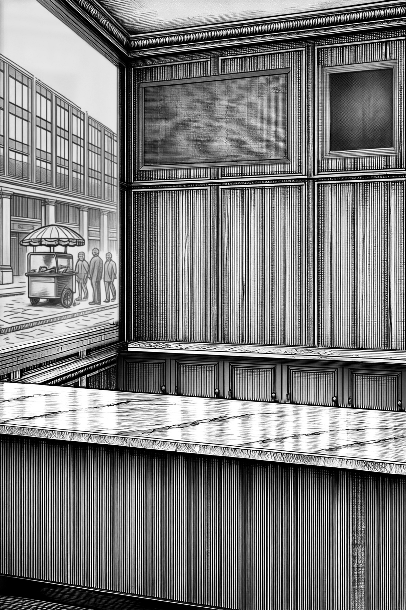

**The thinking.** Rendered in context - the plate as it stands behind this part, with only this part's own silhouette blocked in as values - so the pen, light and perspective are inherited; only the mask is laid back. Part note: the bar: the polished marble counter top, its slim moulded lip and the walnut-panelled bar front beneath it

**Settings.** local/sensenova-u1.5, seed 21, full 40 steps cfg 4, negative: post, pole, column, pillar, tap, beer tap, pump, handle, bottle, glass, object on the counter, lamp, bullnose, rounded nosing, moulded edge, bolster, cushion, padded edge, heavy dark veins, cracked stone, bottles, bottle, glasses, decanters, objects on shelves, chair, stool, seat, barstool, lamp, sconce, light fixture

**Prompt.** [prompts/137-main-bar-marble-counter-render-seed-21-laid-in-full-plate.prompt.txt](prompts/137-main-bar-marble-counter-render-seed-21-laid-in-full-plate.prompt.txt)

*Logged 16:08.*

---

## 138. main-bar-marble-counter render seed 33 laid in full plate

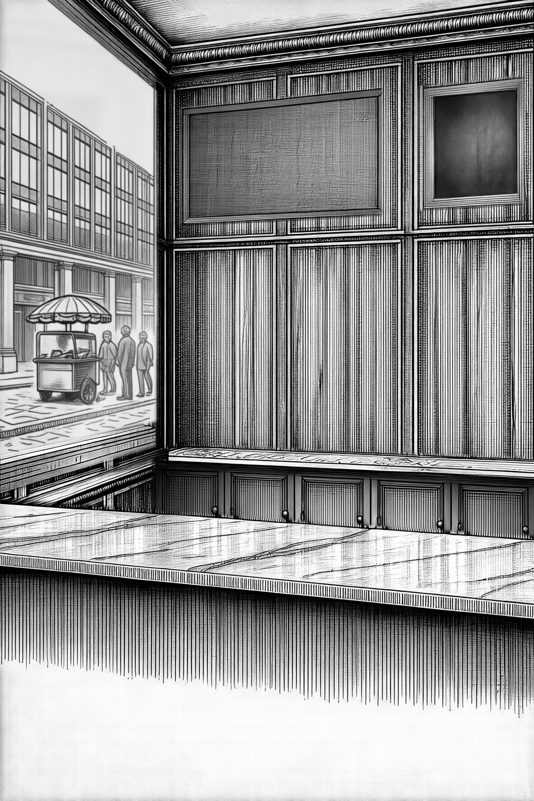

**The thinking.** Rendered in context - the plate as it stands behind this part, with only this part's own silhouette blocked in as values - so the pen, light and perspective are inherited; only the mask is laid back. Part note: the bar: the polished marble counter top, its slim moulded lip and the walnut-panelled bar front beneath it

**Settings.** local/sensenova-u1.5, seed 33, full 40 steps cfg 4, negative: post, pole, column, pillar, tap, beer tap, pump, handle, bottle, glass, object on the counter, lamp, bullnose, rounded nosing, moulded edge, bolster, cushion, padded edge, heavy dark veins, cracked stone, bottles, bottle, glasses, decanters, objects on shelves, chair, stool, seat, barstool, lamp, sconce, light fixture

**Prompt.** [prompts/138-main-bar-marble-counter-render-seed-33-laid-in-full-plate.prompt.txt](prompts/138-main-bar-marble-counter-render-seed-33-laid-in-full-plate.prompt.txt)

*Logged 16:08.*

---

## 139. main-bar-marble-counter render seed 44 laid in full plate

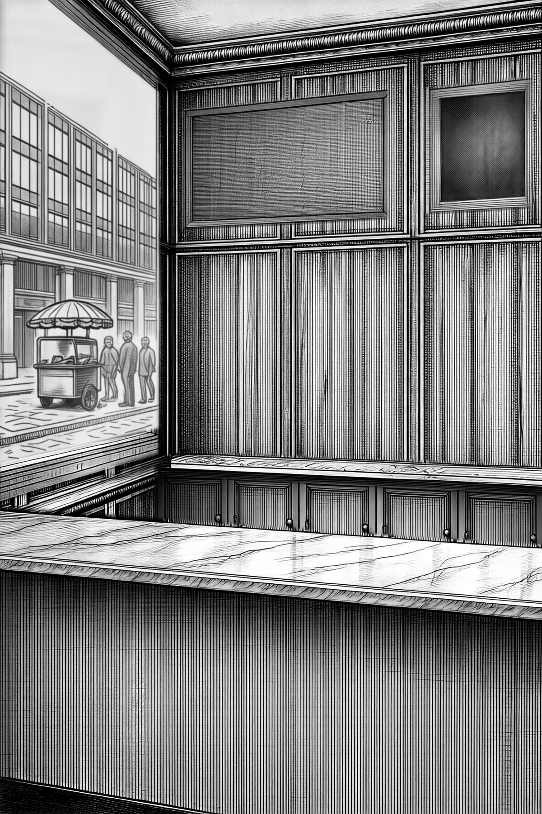

**The thinking.** Rendered in context - the plate as it stands behind this part, with only this part's own silhouette blocked in as values - so the pen, light and perspective are inherited; only the mask is laid back. Part note: the bar: the polished marble counter top, its slim moulded lip and the walnut-panelled bar front beneath it

**Settings.** local/sensenova-u1.5, seed 44, full 40 steps cfg 4, negative: post, pole, column, pillar, tap, beer tap, pump, handle, bottle, glass, object on the counter, lamp, bullnose, rounded nosing, moulded edge, bolster, cushion, padded edge, heavy dark veins, cracked stone, bottles, bottle, glasses, decanters, objects on shelves, chair, stool, seat, barstool, lamp, sconce, light fixture

**Prompt.** [prompts/139-main-bar-marble-counter-render-seed-44-laid-in-full-plate.prompt.txt](prompts/139-main-bar-marble-counter-render-seed-44-laid-in-full-plate.prompt.txt)

*Logged 16:09.*

---

## 140. whole-plate assembled with cabinet-doors-under-ledge bartenders-marble-ledge television-blank chalkboard-blank window-frame-and-reveal window-glass-street-view main-bar-marble-counter and window-sign

**The thinking.** Base plus every approved, enabled part laid in order through its own silhouette; the TV's blank screen and the window's lettering are drawn in code last, because lettering is never left to the model.

*Logged 16:09.*

---

## 141. whole-plate assembled with cabinet-doors-under-ledge bartenders-marble-ledge television-blank chalkboard-blank window-frame-and-reveal window-glass-street-view main-bar-marble-counter and window-sign

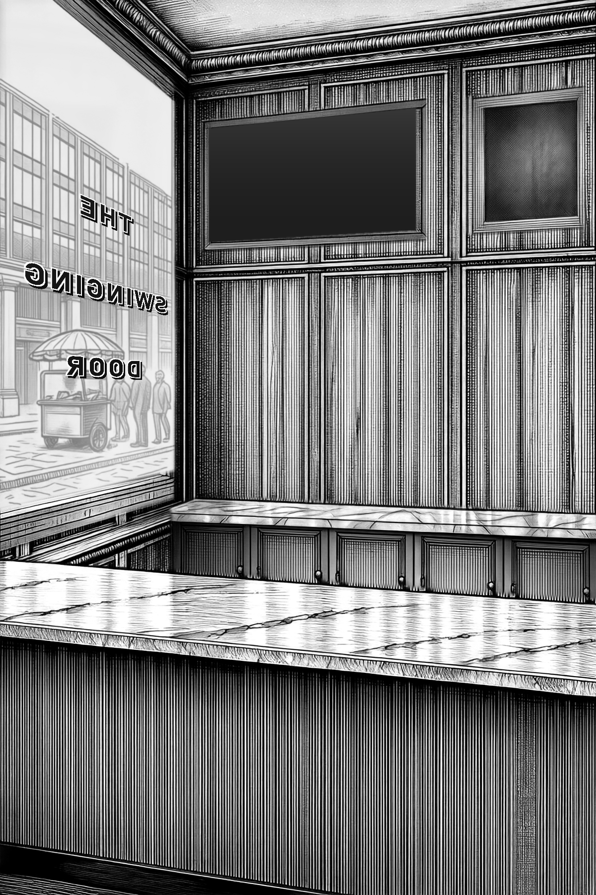

**The thinking.** Base plus every approved, enabled part laid in order through its own silhouette; the TV's blank screen and the window's lettering are drawn in code last, because lettering is never left to the model.

*Logged 16:10.*

---

## 142. the bar clean: cabinets s33, ledge s33, counter s21 re-rendered from their own block-ins - the plate passes the straight-edge check (6.0 px, was 31)

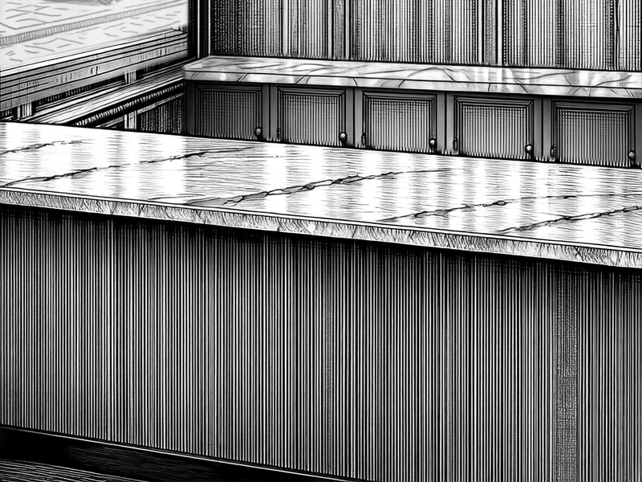

**The ask.** remove the chairs and see what the bar looks like

**The thinking.** With a values image per part, cabinets, ledge and counter were re-rendered in lay order with the chairs off, each seed judged on a plate assembled with the candidate at its own layer (the laid preview used to paint a candidate over the parts in front of it, which is why the first cabinets numbers were meaningless and the preview code was fixed). Cabinets s33 leaves the cleanest strip above the marble; the three ledge seeds tie numerically and s33 was chosen on look (pale polished slab, soft sparse veins, clean square lip; s21 was cracked ice); counter s21 and s33 tie at 6.0 px and s21 is approved. The finished plate's bar edge: worst deviation 6.0 px, bend 1.8 px - STRAIGHT. The arch that read as a duplicate chair back is gone from every layer.

**Settings.** run_bar_part2.py cabinets 7/21/33, ledge 7/21/33, counter 7/21/33/44; judge_plate.py + check_edge.py; approve cabinets s33, ledge s33, counter s21; build

**Verdict.** bar clean - for the founder's approval

*Logged 16:10.*

---

## 143. tools built by Opus teammates: per-object version history (every version of every object, filed and labelled) and the sticker desk (drag-and-drop layers over the rendered room)

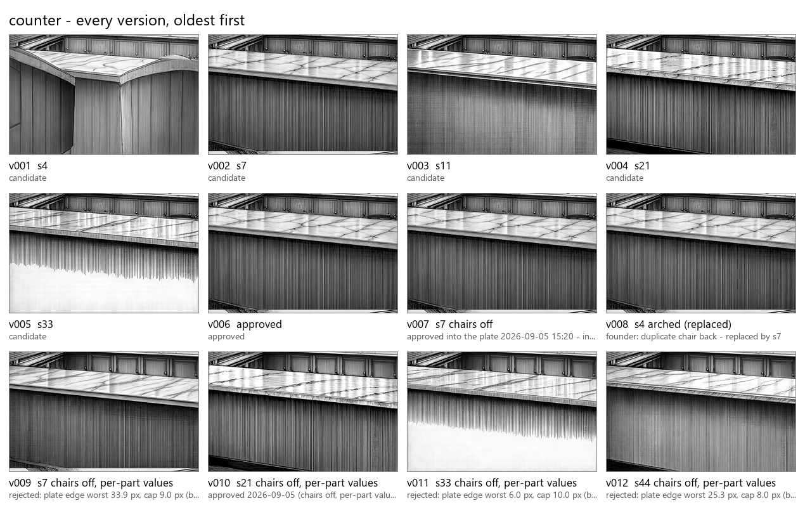

**The ask.** make sure everything you generate is organised and labeled so i can look back at each modular item ... maybe we need to generate the room then use all of these as stickers we can drag and drop into the correct space in the room

**The thinking.** Two teammates, verified: (1) scripts/object-history.py files every candidate and approved render of every object into canon/room-kit/v2/history/<object>/ as vNNN-date-label.png with a context crop, an INDEX.md of what changed, the seed and the verdict, and a SHEET.png of all versions side by side (this picture is the counter's: 12 versions from the first marble slab through the arched render the founder rejected to the clean seed 21); 'restore <object> vNNN' puts any earlier version back. 82 versions were backfilled from the two days of work. (2) scripts/stickers.py cuts every object into a transparent sticker exactly as the assembler tones it (recomposing them reproduces the plate to 0.02 grey levels), scripts/compose-layers.py rebuilds the room from base + stickers + layout.json, and scripts/sticker-desk.mjs is a local page where each object is a draggable layer with a visibility box and a version dropdown fed from the history - tick the chair on, drag it, pick seed 7 from the dropdown, press Compose, no render needed. Tested in the browser.

**Settings.** node scripts/sticker-desk.mjs -> http://127.0.0.1:8787; C:/Python313/python.exe scripts/object-history.py list|sheet|snapshot|restore

**Verdict.** in place - every object now has a labelled history and a movable layer

*Logged 16:12.*

---

## 144. shelf unit round 2: the three designs refined to the round-1 critiques (right end inside the frame, uprights placed by projected clearance, real member widths) - critics still 3 to 6 out of 10; rendering all three for the founder

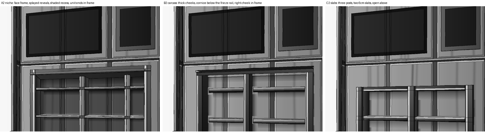

**The ask.** build the shelf seperatly and add it back in once ive approved it

**The thinking.** Every design now ends inside the frame with a visible right cheek, keeps its uprights clear of the wall's stiles (a sweep showed equal thirds are geometrically unavailable at this camera: only two divider positions clear the stiles), and stays off the wall's frieze rail. The critics' remaining objections split two ways. A2 (niche) shades the recess into a 60-92 band and reads as a dark hole - a window at night - with its right cheek the same value as the recess. B2 (carcass) and C2 (slabs) leave the wall behind the shelves untouched and read as a frame laid ON the panelling, with each bay bisected by a wall stile; both critics ask for a back panel, which the founder has ruled out ('there is a wall behind the shelves'). Shelf top faces are 5-7 px at this eye height whatever the depth - only the front-edge stack and shadows carry thickness. Decision: stop arguing in grey and render all three (carcass + both shelves as one candidate, two seeds each, unit switched off so the plate stays bare) and put the renders in front of the founder.

**Settings.** workflow wf_f79a804c-3cd: refine A2/B2/C2 (opus, high) + founder/model critics; patches in scratchpad/shelf2-*/patch.diff; renders via run_shelf_variants.py

**Verdict.** rendered candidates to follow for the founder's choice

*Logged 17:03.*

---

## 145. back-bar-carcass and back-bar-lower-shelf and back-bar-upper-shelf render seed 7 laid in full plate

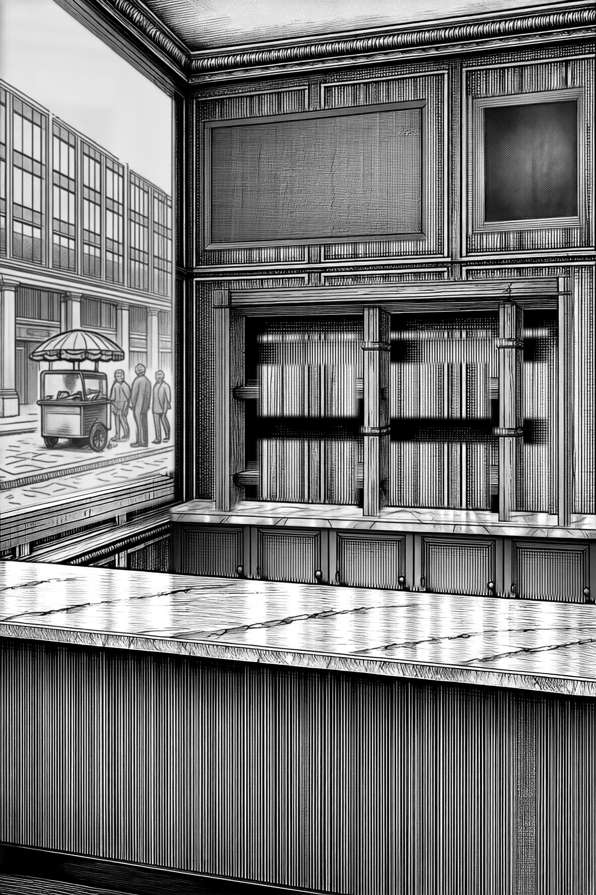

**The thinking.** Rendered in context - the plate as it stands behind this part, with only this part's own silhouette blocked in as values - so the pen, light and perspective are inherited; only the mask is laid back. Part note: the back bar's built-in NICHE: an alcove let into the panelled wall above the marble ledge, a moulded walnut architrave standing proud round its opening, the splayed reveal returning back into the wall down each side, a deep shadowed soffit across its head, and two thick walnut dividers standing inside it against the wall's own panelling - joinery, reveal and shadow, NOT a picture, a screen, a dark panel or a framed field AND the lower shelf inside the back bar's niche: three lengths of thick polished walnut board housed between the dividers, seen from a little above so the tops of the boards catch the daylight, each throwing a soft shadow down the panelled wall behind it AND the upper shelf inside the back bar's niche: three lengths of thick polished walnut board housed between the dividers, seen from a little below so the DARK underside of each board shows beneath its lit front edge, each throwing a soft shadow down the panelled wall behind it

**Settings.** local/sensenova-u1.5, seed 7, full 40 steps cfg 4, rendered together with shelf-lower, shelf-upper, negative: television, screen, monitor, black rectangle, picture, frame, poster, sign, lettering, bottles, glasses, mirror, mirrored panel, glass panel, white panel, lightbox, frosted glass, window, bottles, bottle, glasses, decanters, objects on shelves, chair, stool, seat, barstool, chalkboard, blackboard, framed board, picture, frame, lamp, sconce, light fixture, television, screen, monitor, flat screen

**Prompt.** [prompts/145-back-bar-carcass-and-back-bar-lower-shelf-and-back-bar-upper-shelf-render-seed-7-laid-in-full-plate.prompt.txt](prompts/145-back-bar-carcass-and-back-bar-lower-shelf-and-back-bar-upper-shelf-render-seed-7-laid-in-full-plate.prompt.txt)

*Logged 17:08.*

---

## 146. back-bar-carcass and back-bar-lower-shelf and back-bar-upper-shelf render seed 21 laid in full plate

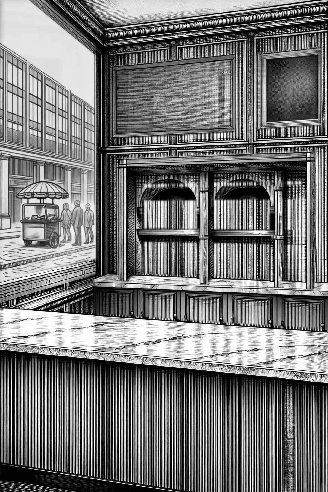

**The thinking.** Rendered in context - the plate as it stands behind this part, with only this part's own silhouette blocked in as values - so the pen, light and perspective are inherited; only the mask is laid back. Part note: the back bar's built-in NICHE: an alcove let into the panelled wall above the marble ledge, a moulded walnut architrave standing proud round its opening, the splayed reveal returning back into the wall down each side, a deep shadowed soffit across its head, and two thick walnut dividers standing inside it against the wall's own panelling - joinery, reveal and shadow, NOT a picture, a screen, a dark panel or a framed field AND the lower shelf inside the back bar's niche: three lengths of thick polished walnut board housed between the dividers, seen from a little above so the tops of the boards catch the daylight, each throwing a soft shadow down the panelled wall behind it AND the upper shelf inside the back bar's niche: three lengths of thick polished walnut board housed between the dividers, seen from a little below so the DARK underside of each board shows beneath its lit front edge, each throwing a soft shadow down the panelled wall behind it

**Settings.** local/sensenova-u1.5, seed 21, full 40 steps cfg 4, rendered together with shelf-lower, shelf-upper, negative: television, screen, monitor, black rectangle, picture, frame, poster, sign, lettering, bottles, glasses, mirror, mirrored panel, glass panel, white panel, lightbox, frosted glass, window, bottles, bottle, glasses, decanters, objects on shelves, chair, stool, seat, barstool, chalkboard, blackboard, framed board, picture, frame, lamp, sconce, light fixture, television, screen, monitor, flat screen

**Prompt.** [prompts/146-back-bar-carcass-and-back-bar-lower-shelf-and-back-bar-upper-shelf-render-seed-21-laid-in-full-plate.prompt.txt](prompts/146-back-bar-carcass-and-back-bar-lower-shelf-and-back-bar-upper-shelf-render-seed-21-laid-in-full-plate.prompt.txt)

*Logged 17:08.*

---

## 147. back-bar-carcass and back-bar-lower-shelf and back-bar-upper-shelf render seed 7 laid in full plate

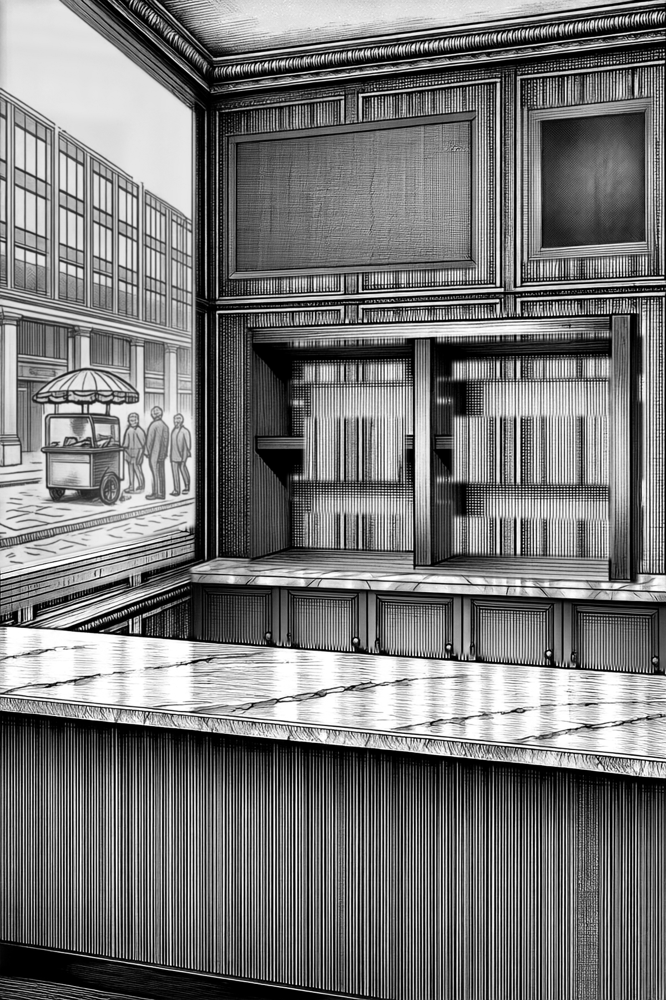

**The thinking.** Rendered in context - the plate as it stands behind this part, with only this part's own silhouette blocked in as values - so the pen, light and perspective are inherited; only the mask is laid back. Part note: the back bar's OPEN walnut carcass: a freestanding two-bay cabinet STANDING ON the marble ledge in front of the panelled wall and ending well short of it at both ends. Two thick solid walnut end cheeks and one thick central divider, each a 9 cm post with a bright polished arris down its window side and a hard dark edge down the other, and with its SIDE FACE visible running 30 cm back to the wall; a base rail it stands on, throwing a shadow across the marble in front; a top rail finished with a small cornice that oversails the front and lays a hard shadow on the wall beneath it. IT HAS NO BACK AND NO DOORS: the wall's own raised-and-fielded panelling runs on unbroken through both open bays, and the carcass casts its own shadow down the right of every post onto that panelling. Bare walnut joinery - NO glass, NO panel, NO picture, nothing hanging in the openings AND the lower shelves of the back bar: two separate 6 cm thick WALNUT boards, one housed between each pair of posts, seen from slightly ABOVE - the polished top of each board runs back to the panelled wall and its front edge shows as a bright top arris over a walnut board face over a dark undercut, each board laying a shadow on the wall beneath it. Wood, not marble, not stone; empty, nothing standing on them AND the upper shelves of the back bar: two separate 6 cm thick WALNUT boards, one housed between each pair of posts, seen from slightly BELOW - the UNDERSIDE of each board is in shadow, its front edge shows as a bright top arris over a walnut board face over a dark undercut, and each lays a shadow on the panelled wall beneath it

**Settings.** local/sensenova-u1.5, seed 7, full 40 steps cfg 4, rendered together with shelf-lower, shelf-upper, negative: television, screen, monitor, black rectangle, picture, frame, poster, sign, lettering, bottles, glasses, mirror, mirrored panel, glass panel, white panel, lightbox, frosted glass, window, bottles, bottle, glasses, decanters, objects on shelves, chair, stool, seat, barstool, chalkboard, blackboard, framed board, picture, frame, lamp, sconce, light fixture, television, screen, monitor, flat screen

**Prompt.** [prompts/147-back-bar-carcass-and-back-bar-lower-shelf-and-back-bar-upper-shelf-render-seed-7-laid-in-full-plate.prompt.txt](prompts/147-back-bar-carcass-and-back-bar-lower-shelf-and-back-bar-upper-shelf-render-seed-7-laid-in-full-plate.prompt.txt)

*Logged 17:14.*

---

## 148. back-bar-carcass and back-bar-lower-shelf and back-bar-upper-shelf render seed 21 laid in full plate

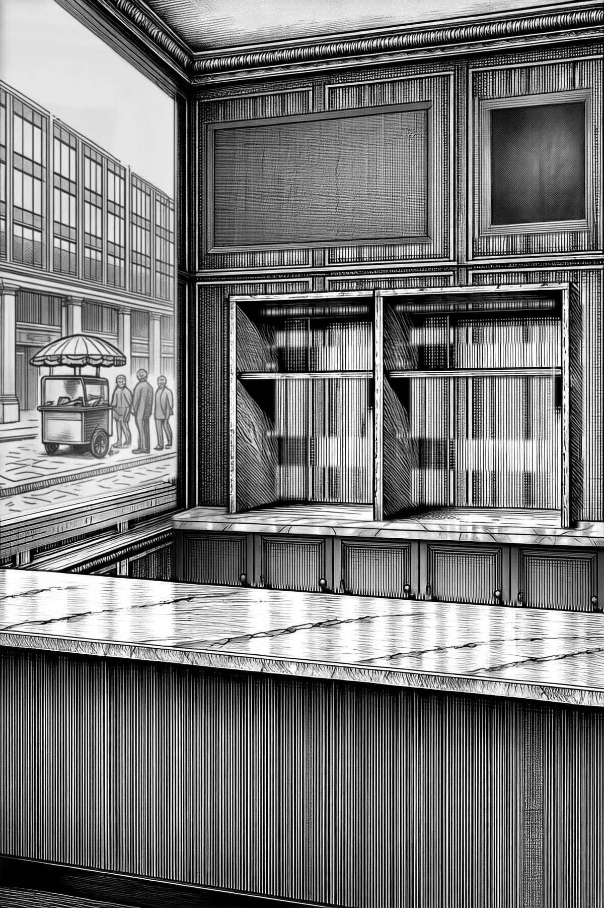

**The thinking.** Rendered in context - the plate as it stands behind this part, with only this part's own silhouette blocked in as values - so the pen, light and perspective are inherited; only the mask is laid back. Part note: the back bar's OPEN walnut carcass: a freestanding two-bay cabinet STANDING ON the marble ledge in front of the panelled wall and ending well short of it at both ends. Two thick solid walnut end cheeks and one thick central divider, each a 9 cm post with a bright polished arris down its window side and a hard dark edge down the other, and with its SIDE FACE visible running 30 cm back to the wall; a base rail it stands on, throwing a shadow across the marble in front; a top rail finished with a small cornice that oversails the front and lays a hard shadow on the wall beneath it. IT HAS NO BACK AND NO DOORS: the wall's own raised-and-fielded panelling runs on unbroken through both open bays, and the carcass casts its own shadow down the right of every post onto that panelling. Bare walnut joinery - NO glass, NO panel, NO picture, nothing hanging in the openings AND the lower shelves of the back bar: two separate 6 cm thick WALNUT boards, one housed between each pair of posts, seen from slightly ABOVE - the polished top of each board runs back to the panelled wall and its front edge shows as a bright top arris over a walnut board face over a dark undercut, each board laying a shadow on the wall beneath it. Wood, not marble, not stone; empty, nothing standing on them AND the upper shelves of the back bar: two separate 6 cm thick WALNUT boards, one housed between each pair of posts, seen from slightly BELOW - the UNDERSIDE of each board is in shadow, its front edge shows as a bright top arris over a walnut board face over a dark undercut, and each lays a shadow on the panelled wall beneath it

**Settings.** local/sensenova-u1.5, seed 21, full 40 steps cfg 4, rendered together with shelf-lower, shelf-upper, negative: television, screen, monitor, black rectangle, picture, frame, poster, sign, lettering, bottles, glasses, mirror, mirrored panel, glass panel, white panel, lightbox, frosted glass, window, bottles, bottle, glasses, decanters, objects on shelves, chair, stool, seat, barstool, chalkboard, blackboard, framed board, picture, frame, lamp, sconce, light fixture, television, screen, monitor, flat screen

**Prompt.** [prompts/148-back-bar-carcass-and-back-bar-lower-shelf-and-back-bar-upper-shelf-render-seed-21-laid-in-full-plate.prompt.txt](prompts/148-back-bar-carcass-and-back-bar-lower-shelf-and-back-bar-upper-shelf-render-seed-21-laid-in-full-plate.prompt.txt)

*Logged 17:14.*

---

## 149. back-bar-carcass and back-bar-lower-shelf and back-bar-upper-shelf render seed 7 laid in full plate

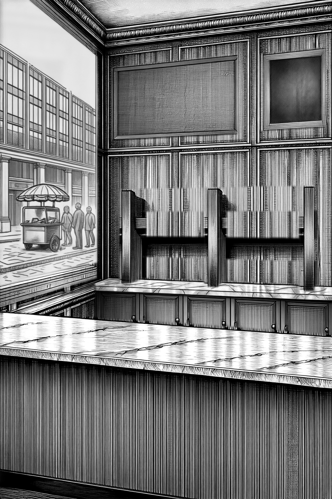

**The thinking.** Rendered in context - the plate as it stands behind this part, with only this part's own silhouette blocked in as values - so the pen, light and perspective are inherited; only the mask is laid back. Part note: the back bar's carcass: THREE THICK SOLID WALNUT POSTS standing on the marble ledge - a 12 cm post at each end and one 12 cm divider between them - each running UNBROKEN from the ledge up to the top of the upper shelf and stopping there, each with a bright lit arris down its window side and a dark one down the other, the two left-hand posts turning a deep side face toward the camera so they read as solid square posts standing OFF the panelled wall, and each throwing a soft shadow on the panelling beside it. There is NO back panel, NO top rail, NO cornice and NO shelf drawn here: the panelled wall shows between the posts and runs on above them to the frieze rail AND the lower shelf of the back bar: a HEAVY 7 cm SOLID WALNUT SLAB housed between the posts, seen from a little above so a sliver of its polished top shows, its front edge a thick board with a bright lit arris along the top and a dark undercut beneath, and a soft shadow thrown down the panelled wall below it - wood, not marble, not stone AND the upper shelf of the back bar: a HEAVY 7 cm SOLID WALNUT SLAB housed between the posts, seen from BELOW so its UNDERSIDE is in deep shadow, its front edge a thick dark board with a bright arris catching reflected light along its lower edge, and a soft shadow thrown down the panelled wall below it

**Settings.** local/sensenova-u1.5, seed 7, full 40 steps cfg 4, rendered together with shelf-lower, shelf-upper, negative: television, screen, monitor, black rectangle, picture, frame, poster, sign, lettering, bottles, glasses, mirror, mirrored panel, glass panel, white panel, lightbox, frosted glass, window, bottles, bottle, glasses, decanters, objects on shelves, chair, stool, seat, barstool, chalkboard, blackboard, framed board, picture, frame, lamp, sconce, light fixture, television, screen, monitor, flat screen

**Prompt.** [prompts/149-back-bar-carcass-and-back-bar-lower-shelf-and-back-bar-upper-shelf-render-seed-7-laid-in-full-plate.prompt.txt](prompts/149-back-bar-carcass-and-back-bar-lower-shelf-and-back-bar-upper-shelf-render-seed-7-laid-in-full-plate.prompt.txt)

*Logged 17:20.*

---

## 150. back-bar-carcass and back-bar-lower-shelf and back-bar-upper-shelf render seed 21 laid in full plate

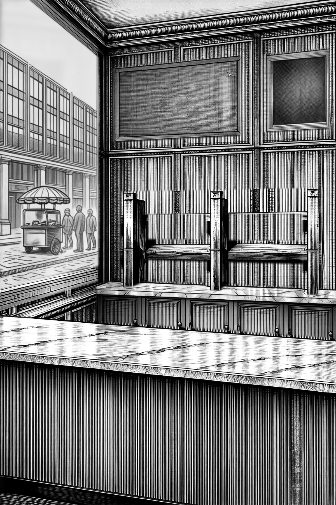

**The thinking.** Rendered in context - the plate as it stands behind this part, with only this part's own silhouette blocked in as values - so the pen, light and perspective are inherited; only the mask is laid back. Part note: the back bar's carcass: THREE THICK SOLID WALNUT POSTS standing on the marble ledge - a 12 cm post at each end and one 12 cm divider between them - each running UNBROKEN from the ledge up to the top of the upper shelf and stopping there, each with a bright lit arris down its window side and a dark one down the other, the two left-hand posts turning a deep side face toward the camera so they read as solid square posts standing OFF the panelled wall, and each throwing a soft shadow on the panelling beside it. There is NO back panel, NO top rail, NO cornice and NO shelf drawn here: the panelled wall shows between the posts and runs on above them to the frieze rail AND the lower shelf of the back bar: a HEAVY 7 cm SOLID WALNUT SLAB housed between the posts, seen from a little above so a sliver of its polished top shows, its front edge a thick board with a bright lit arris along the top and a dark undercut beneath, and a soft shadow thrown down the panelled wall below it - wood, not marble, not stone AND the upper shelf of the back bar: a HEAVY 7 cm SOLID WALNUT SLAB housed between the posts, seen from BELOW so its UNDERSIDE is in deep shadow, its front edge a thick dark board with a bright arris catching reflected light along its lower edge, and a soft shadow thrown down the panelled wall below it

**Settings.** local/sensenova-u1.5, seed 21, full 40 steps cfg 4, rendered together with shelf-lower, shelf-upper, negative: television, screen, monitor, black rectangle, picture, frame, poster, sign, lettering, bottles, glasses, mirror, mirrored panel, glass panel, white panel, lightbox, frosted glass, window, bottles, bottle, glasses, decanters, objects on shelves, chair, stool, seat, barstool, chalkboard, blackboard, framed board, picture, frame, lamp, sconce, light fixture, television, screen, monitor, flat screen

**Prompt.** [prompts/150-back-bar-carcass-and-back-bar-lower-shelf-and-back-bar-upper-shelf-render-seed-21-laid-in-full-plate.prompt.txt](prompts/150-back-bar-carcass-and-back-bar-lower-shelf-and-back-bar-upper-shelf-render-seed-21-laid-in-full-plate.prompt.txt)

*Logged 17:20.*

---

## 151. first renders of the three round-2 shelf designs: blurred bands where the shelves should be - a conditioning bug, not a verdict

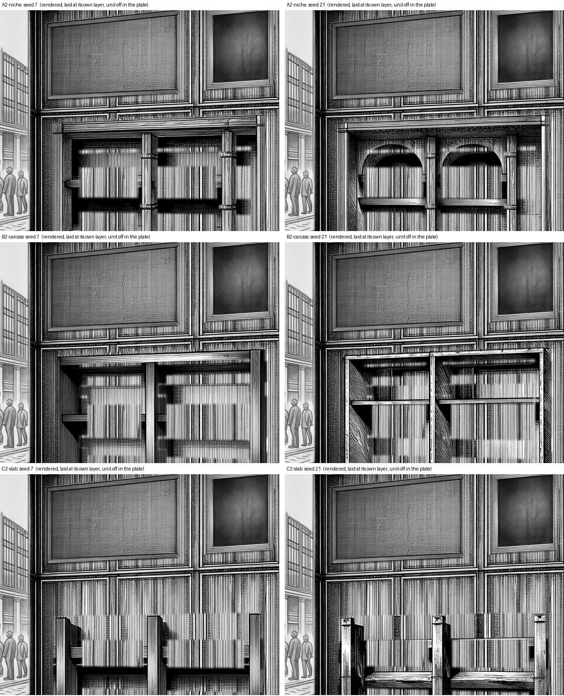

**The ask.** build the shelf seperatly and add it back in once ive approved it

**The thinking.** All six renders (carcass + both shelves as one candidate, two seeds per design, unit switched off so the plate stays bare) came back with smeared horizontal bands in place of the shelves and heavy invented timber - arches in one. The cause is in the assembler, not the designs: since every part got its own values image, a render with --with parts still cut ALL the block-ins from the FIRST part's values, and the carcass's values do not contain the shelves, so the model was handed bare wall where a shelf should be and painted a blur. Fixed: each --with part's block-in now comes from its own values image (normal and tall canvas), and the back-bar negative gains arch, doors, mullion, curtain, blur. All six re-rendered.

**Settings.** room-part.py cmd_render: per-part conditioning for --with; negatives extended; run_shelf_variants.py re-run

**Verdict.** discarded - re-rendering with the fix

*Logged 17:27.*

---

## 152. back-bar-carcass and back-bar-lower-shelf and back-bar-upper-shelf render seed 7 laid in full plate

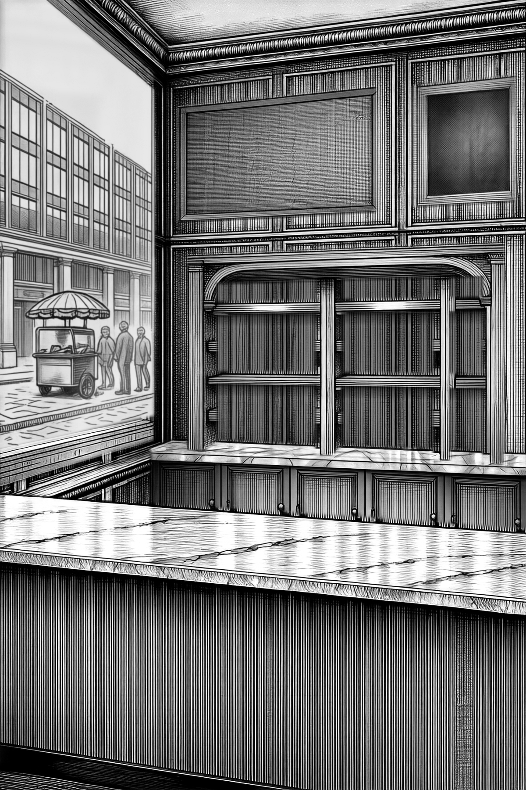

**The thinking.** Rendered in context - the plate as it stands behind this part, with only this part's own silhouette blocked in as values - so the pen, light and perspective are inherited; only the mask is laid back. Part note: the back bar's built-in NICHE: an alcove let into the panelled wall above the marble ledge, a moulded walnut architrave standing proud round its opening, the splayed reveal returning back into the wall down each side, a deep shadowed soffit across its head, and two thick walnut dividers standing inside it against the wall's own panelling - joinery, reveal and shadow, NOT a picture, a screen, a dark panel or a framed field AND the lower shelf inside the back bar's niche: three lengths of thick polished walnut board housed between the dividers, seen from a little above so the tops of the boards catch the daylight, each throwing a soft shadow down the panelled wall behind it AND the upper shelf inside the back bar's niche: three lengths of thick polished walnut board housed between the dividers, seen from a little below so the DARK underside of each board shows beneath its lit front edge, each throwing a soft shadow down the panelled wall behind it

**Settings.** local/sensenova-u1.5, seed 7, full 40 steps cfg 4, rendered together with shelf-lower, shelf-upper, negative: television, screen, monitor, black rectangle, picture, frame, poster, sign, lettering, bottles, glasses, mirror, mirrored panel, glass panel, white panel, lightbox, frosted glass, window, arch, arched opening, arcade, doors, cupboard doors, glazed doors, french doors, mullion, curtain, blur, smear, bottles, bottle, glasses, decanters, objects on shelves, chair, stool, seat, barstool, chalkboard, blackboard, framed board, picture, frame, lamp, sconce, light fixture, television, screen, monitor, flat screen

**Prompt.** [prompts/152-back-bar-carcass-and-back-bar-lower-shelf-and-back-bar-upper-shelf-render-seed-7-laid-in-full-plate.prompt.txt](prompts/152-back-bar-carcass-and-back-bar-lower-shelf-and-back-bar-upper-shelf-render-seed-7-laid-in-full-plate.prompt.txt)

*Logged 18:27.*

---

## 153. back-bar-carcass and back-bar-lower-shelf and back-bar-upper-shelf render seed 21 laid in full plate

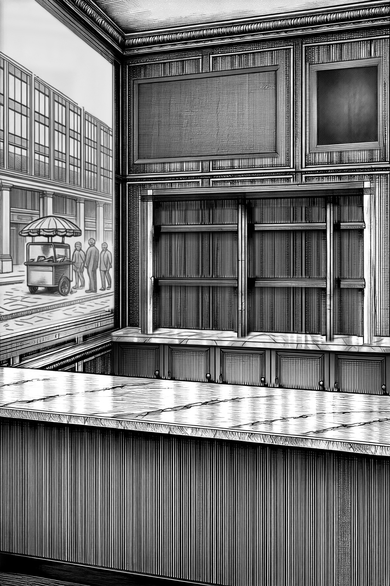

**The thinking.** Rendered in context - the plate as it stands behind this part, with only this part's own silhouette blocked in as values - so the pen, light and perspective are inherited; only the mask is laid back. Part note: the back bar's built-in NICHE: an alcove let into the panelled wall above the marble ledge, a moulded walnut architrave standing proud round its opening, the splayed reveal returning back into the wall down each side, a deep shadowed soffit across its head, and two thick walnut dividers standing inside it against the wall's own panelling - joinery, reveal and shadow, NOT a picture, a screen, a dark panel or a framed field AND the lower shelf inside the back bar's niche: three lengths of thick polished walnut board housed between the dividers, seen from a little above so the tops of the boards catch the daylight, each throwing a soft shadow down the panelled wall behind it AND the upper shelf inside the back bar's niche: three lengths of thick polished walnut board housed between the dividers, seen from a little below so the DARK underside of each board shows beneath its lit front edge, each throwing a soft shadow down the panelled wall behind it

**Settings.** local/sensenova-u1.5, seed 21, full 40 steps cfg 4, rendered together with shelf-lower, shelf-upper, negative: television, screen, monitor, black rectangle, picture, frame, poster, sign, lettering, bottles, glasses, mirror, mirrored panel, glass panel, white panel, lightbox, frosted glass, window, arch, arched opening, arcade, doors, cupboard doors, glazed doors, french doors, mullion, curtain, blur, smear, bottles, bottle, glasses, decanters, objects on shelves, chair, stool, seat, barstool, chalkboard, blackboard, framed board, picture, frame, lamp, sconce, light fixture, television, screen, monitor, flat screen

**Prompt.** [prompts/153-back-bar-carcass-and-back-bar-lower-shelf-and-back-bar-upper-shelf-render-seed-21-laid-in-full-plate.prompt.txt](prompts/153-back-bar-carcass-and-back-bar-lower-shelf-and-back-bar-upper-shelf-render-seed-21-laid-in-full-plate.prompt.txt)

*Logged 18:28.*

---

## 154. back-bar-carcass and back-bar-lower-shelf and back-bar-upper-shelf render seed 7 laid in full plate

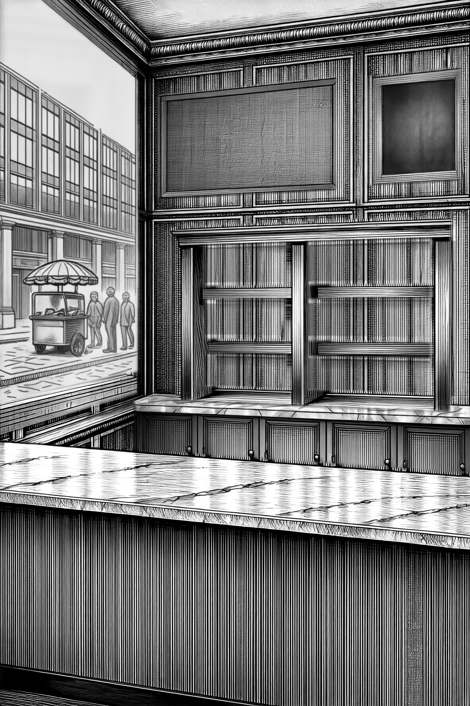

**The thinking.** Rendered in context - the plate as it stands behind this part, with only this part's own silhouette blocked in as values - so the pen, light and perspective are inherited; only the mask is laid back. Part note: the back bar's OPEN walnut carcass: a freestanding two-bay cabinet STANDING ON the marble ledge in front of the panelled wall and ending well short of it at both ends. Two thick solid walnut end cheeks and one thick central divider, each a 9-10 cm post with a bright polished arris down its window side and a hard dark edge down the other, and with its SIDE FACE visible running 30 cm back to the wall - the right-hand cheek shows its window-facing side, which is the brightest timber in the unit; a base rail it stands on, throwing a shadow across the marble in front; a top rail finished with a cornice that oversails the front and lays a hard shadow on the wall beneath it. IT HAS NO BACK AND NO DOORS: the wall's own raised-and-fielded panelling runs on unbroken through both open bays, and the carcass casts its own shadow down the right of every post onto that panelling. Bare walnut joinery - NO glass, NO panel, NO picture, nothing hanging in the openings AND the lower shelves of the back bar: two separate 8 cm thick WALNUT boards, one housed between each pair of posts, seen from slightly ABOVE - the polished top of each board runs back to the panelled wall and its front edge shows as a bright top arris over a walnut board face over a dark undercut, each board laying a shadow on the wall beneath it. Wood, not marble, not stone; empty, nothing standing on them AND the upper shelves of the back bar: two separate 8 cm thick WALNUT boards, one housed between each pair of posts, seen from slightly BELOW - the UNDERSIDE of each board is in shadow, its front edge shows as a bright top arris over a walnut board face over a dark undercut, and each lays a shadow on the panelled wall beneath it

**Settings.** local/sensenova-u1.5, seed 7, full 40 steps cfg 4, rendered together with shelf-lower, shelf-upper, negative: television, screen, monitor, black rectangle, picture, frame, poster, sign, lettering, bottles, glasses, mirror, mirrored panel, glass panel, white panel, lightbox, frosted glass, window, arch, arched opening, arcade, doors, cupboard doors, glazed doors, french doors, mullion, curtain, blur, smear, bottles, bottle, glasses, decanters, objects on shelves, chair, stool, seat, barstool, chalkboard, blackboard, framed board, picture, frame, lamp, sconce, light fixture, television, screen, monitor, flat screen

**Prompt.** [prompts/154-back-bar-carcass-and-back-bar-lower-shelf-and-back-bar-upper-shelf-render-seed-7-laid-in-full-plate.prompt.txt](prompts/154-back-bar-carcass-and-back-bar-lower-shelf-and-back-bar-upper-shelf-render-seed-7-laid-in-full-plate.prompt.txt)

*Logged 18:33.*

---

## 155. back-bar-carcass and back-bar-lower-shelf and back-bar-upper-shelf render seed 21 laid in full plate

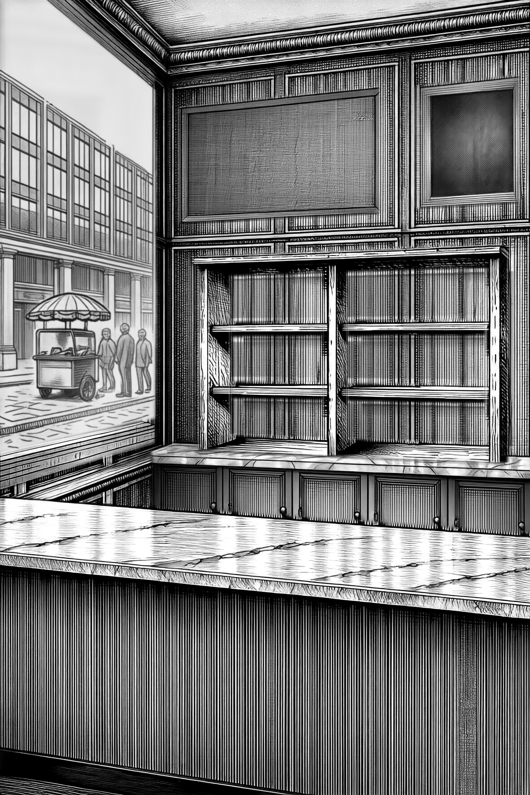

**The thinking.** Rendered in context - the plate as it stands behind this part, with only this part's own silhouette blocked in as values - so the pen, light and perspective are inherited; only the mask is laid back. Part note: the back bar's OPEN walnut carcass: a freestanding two-bay cabinet STANDING ON the marble ledge in front of the panelled wall and ending well short of it at both ends. Two thick solid walnut end cheeks and one thick central divider, each a 9-10 cm post with a bright polished arris down its window side and a hard dark edge down the other, and with its SIDE FACE visible running 30 cm back to the wall - the right-hand cheek shows its window-facing side, which is the brightest timber in the unit; a base rail it stands on, throwing a shadow across the marble in front; a top rail finished with a cornice that oversails the front and lays a hard shadow on the wall beneath it. IT HAS NO BACK AND NO DOORS: the wall's own raised-and-fielded panelling runs on unbroken through both open bays, and the carcass casts its own shadow down the right of every post onto that panelling. Bare walnut joinery - NO glass, NO panel, NO picture, nothing hanging in the openings AND the lower shelves of the back bar: two separate 8 cm thick WALNUT boards, one housed between each pair of posts, seen from slightly ABOVE - the polished top of each board runs back to the panelled wall and its front edge shows as a bright top arris over a walnut board face over a dark undercut, each board laying a shadow on the wall beneath it. Wood, not marble, not stone; empty, nothing standing on them AND the upper shelves of the back bar: two separate 8 cm thick WALNUT boards, one housed between each pair of posts, seen from slightly BELOW - the UNDERSIDE of each board is in shadow, its front edge shows as a bright top arris over a walnut board face over a dark undercut, and each lays a shadow on the panelled wall beneath it

**Settings.** local/sensenova-u1.5, seed 21, full 40 steps cfg 4, rendered together with shelf-lower, shelf-upper, negative: television, screen, monitor, black rectangle, picture, frame, poster, sign, lettering, bottles, glasses, mirror, mirrored panel, glass panel, white panel, lightbox, frosted glass, window, arch, arched opening, arcade, doors, cupboard doors, glazed doors, french doors, mullion, curtain, blur, smear, bottles, bottle, glasses, decanters, objects on shelves, chair, stool, seat, barstool, chalkboard, blackboard, framed board, picture, frame, lamp, sconce, light fixture, television, screen, monitor, flat screen

**Prompt.** [prompts/155-back-bar-carcass-and-back-bar-lower-shelf-and-back-bar-upper-shelf-render-seed-21-laid-in-full-plate.prompt.txt](prompts/155-back-bar-carcass-and-back-bar-lower-shelf-and-back-bar-upper-shelf-render-seed-21-laid-in-full-plate.prompt.txt)

*Logged 18:34.*

---

## 156. back-bar-carcass and back-bar-lower-shelf and back-bar-upper-shelf render seed 7 laid in full plate

**The thinking.** Rendered in context - the plate as it stands behind this part, with only this part's own silhouette blocked in as values - so the pen, light and perspective are inherited; only the mask is laid back. Part note: the back bar's carcass: THREE THICK SOLID WALNUT POSTS standing on the marble ledge - a 12 cm post at each end and one 12 cm divider between them - each running UNBROKEN from the ledge up past the upper shelf and stopping in a solid square head above it, each catching the window light down its near side so it reads BRIGHTER than the wall showing between the posts, with a dark arris down its far side, the two left-hand posts turning a deep side face toward the camera so they read as solid square posts standing OFF the panelled wall, and each throwing a soft shadow on the panelling beside it. There is NO back panel, NO top rail, NO cornice and NO shelf drawn here: the panelled wall shows between the posts and runs on above their heads to the frieze rail AND the lower shelf of the back bar: a HEAVY 8.5 cm SOLID WALNUT SLAB housed between the posts, seen from a little above so a sliver of its polished top shows, its front edge a thick board with a bright lit arris along the top and a dark undercut beneath, and a soft shadow thrown down the panelled wall below it - wood, not marble, not stone AND the upper shelf of the back bar: a HEAVY 8.5 cm SOLID WALNUT SLAB housed between the posts, seen from BELOW so its UNDERSIDE is in deep shadow, its front edge a thick dark board with a bright arris catching reflected light along its lower edge, and a soft shadow thrown down the panelled wall below it

**Settings.** local/sensenova-u1.5, seed 7, full 40 steps cfg 4, rendered together with shelf-lower, shelf-upper, negative: television, screen, monitor, black rectangle, picture, frame, poster, sign, lettering, bottles, glasses, mirror, mirrored panel, glass panel, white panel, lightbox, frosted glass, window, arch, arched opening, arcade, doors, cupboard doors, glazed doors, french doors, mullion, curtain, blur, smear, bottles, bottle, glasses, decanters, objects on shelves, chair, stool, seat, barstool, chalkboard, blackboard, framed board, picture, frame, lamp, sconce, light fixture, television, screen, monitor, flat screen

**Prompt.** [prompts/156-back-bar-carcass-and-back-bar-lower-shelf-and-back-bar-upper-shelf-render-seed-7-laid-in-full-plate.prompt.txt](prompts/156-back-bar-carcass-and-back-bar-lower-shelf-and-back-bar-upper-shelf-render-seed-7-laid-in-full-plate.prompt.txt)

*Logged 18:39.*

---

## 157. back-bar-carcass and back-bar-lower-shelf and back-bar-upper-shelf render seed 21 laid in full plate

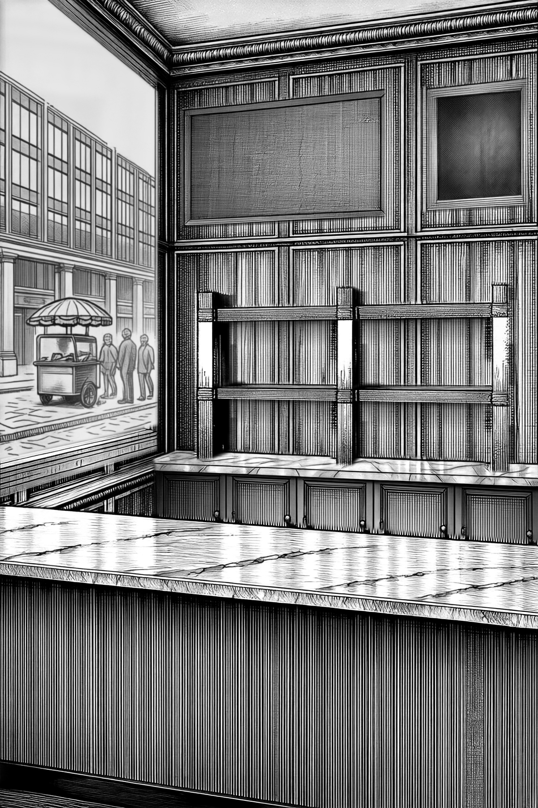

**The thinking.** Rendered in context - the plate as it stands behind this part, with only this part's own silhouette blocked in as values - so the pen, light and perspective are inherited; only the mask is laid back. Part note: the back bar's carcass: THREE THICK SOLID WALNUT POSTS standing on the marble ledge - a 12 cm post at each end and one 12 cm divider between them - each running UNBROKEN from the ledge up past the upper shelf and stopping in a solid square head above it, each catching the window light down its near side so it reads BRIGHTER than the wall showing between the posts, with a dark arris down its far side, the two left-hand posts turning a deep side face toward the camera so they read as solid square posts standing OFF the panelled wall, and each throwing a soft shadow on the panelling beside it. There is NO back panel, NO top rail, NO cornice and NO shelf drawn here: the panelled wall shows between the posts and runs on above their heads to the frieze rail AND the lower shelf of the back bar: a HEAVY 8.5 cm SOLID WALNUT SLAB housed between the posts, seen from a little above so a sliver of its polished top shows, its front edge a thick board with a bright lit arris along the top and a dark undercut beneath, and a soft shadow thrown down the panelled wall below it - wood, not marble, not stone AND the upper shelf of the back bar: a HEAVY 8.5 cm SOLID WALNUT SLAB housed between the posts, seen from BELOW so its UNDERSIDE is in deep shadow, its front edge a thick dark board with a bright arris catching reflected light along its lower edge, and a soft shadow thrown down the panelled wall below it

**Settings.** local/sensenova-u1.5, seed 21, full 40 steps cfg 4, rendered together with shelf-lower, shelf-upper, negative: television, screen, monitor, black rectangle, picture, frame, poster, sign, lettering, bottles, glasses, mirror, mirrored panel, glass panel, white panel, lightbox, frosted glass, window, arch, arched opening, arcade, doors, cupboard doors, glazed doors, french doors, mullion, curtain, blur, smear, bottles, bottle, glasses, decanters, objects on shelves, chair, stool, seat, barstool, chalkboard, blackboard, framed board, picture, frame, lamp, sconce, light fixture, television, screen, monitor, flat screen

**Prompt.** [prompts/157-back-bar-carcass-and-back-bar-lower-shelf-and-back-bar-upper-shelf-render-seed-21-laid-in-full-plate.prompt.txt](prompts/157-back-bar-carcass-and-back-bar-lower-shelf-and-back-bar-upper-shelf-render-seed-21-laid-in-full-plate.prompt.txt)

*Logged 18:40.*

---

## 158. shelf unit round 3 rendered: niche, carcass and floating slabs with shadows as a code layer - three candidates for the founder's choice

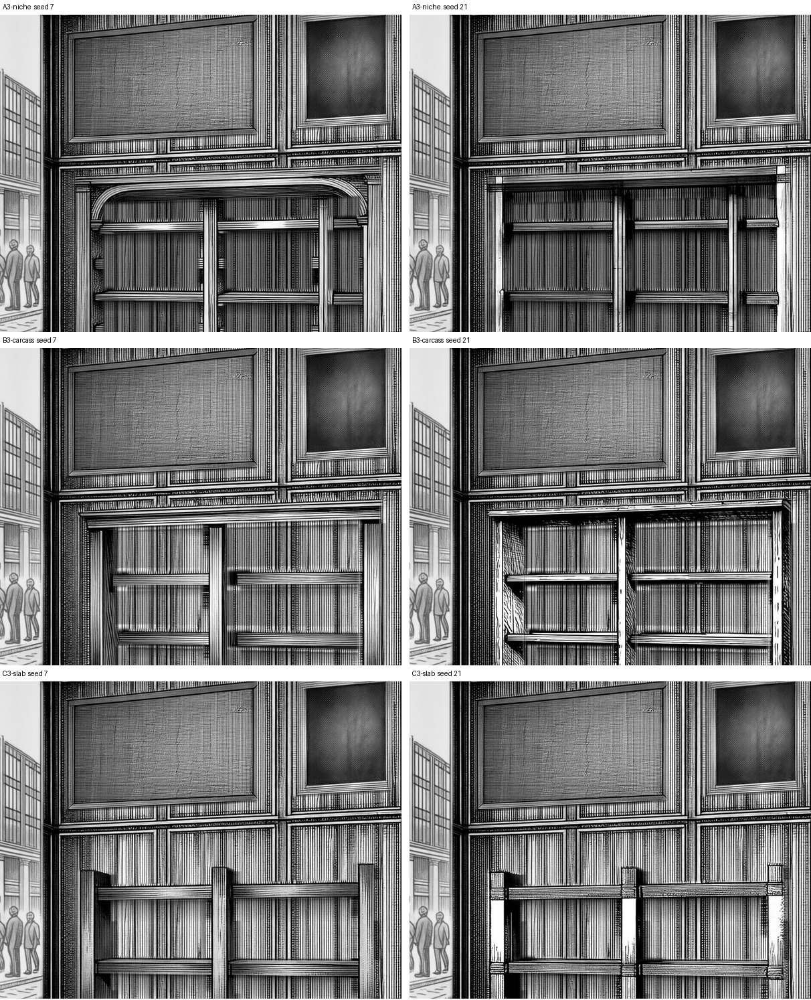

**The ask.** build the shelf seperatly and add it back in once ive approved it

**The thinking.** With cast shadows moved out of the masks into a multiplier layer the assembler applies to the rendered wall, all six renders are coherent for the first time: the wall's own panelling runs behind every unit, shelves show lit front edges and shadows beneath, both dividers and the right cheek are in the frame. Per design: the niche at seed 7 grew an arched head (rejected), seed 21 is a clean rectangular alcove with a face frame; the carcass at seed 21 is a solid dark-framed cabinet with visible cheek depth, seed 7 thinner; the floating slabs at seed 7 read as three posts and two heavy boards open above. None is added to the plate: the founder picks one, then it is switched on and re-rolled if wanted.

**Settings.** run_shelf_variants.py: each design's construction applied, unit kept in DISABLED, render backbar --with shelf-lower shelf-upper at seeds 7 and 21, laid at its own layer; construction restored to bare

**Verdict.** candidates A s21, B s21, C s7 sent to the founder

*Logged 18:45.*

---

## 159. whole-plate assembled with bartenders-marble-ledge back-bar-lower-shelf back-bar-upper-shelf back-bar-carcass television-blank chalkboard-blank window-frame-and-reveal window-glass-street-view main-bar-marble-counter and window-sign

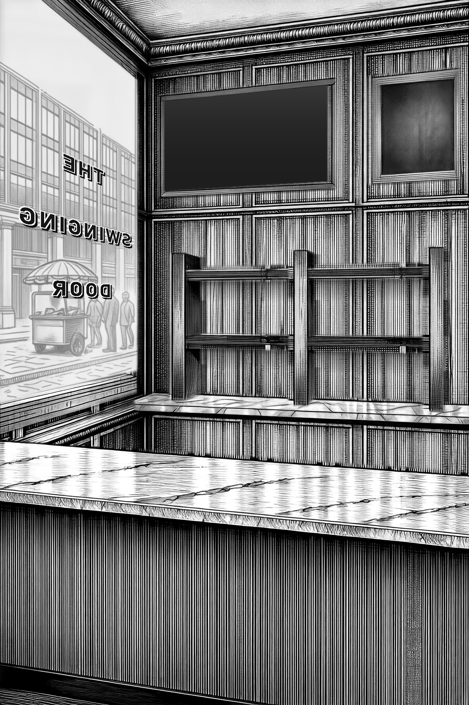

**The thinking.** Base plus every approved, enabled part laid in order through its own silhouette; the TV's blank screen and the window's lettering are drawn in code last, because lettering is never left to the model.

*Logged 19:32.*

---

## 160. whole-plate assembled with bartenders-marble-ledge back-bar-lower-shelf back-bar-upper-shelf back-bar-carcass television-blank chalkboard-blank window-frame-and-reveal window-glass-street-view main-bar-marble-counter and window-sign

**The thinking.** Base plus every approved, enabled part laid in order through its own silhouette; the TV's blank screen and the window's lettering are drawn in code last, because lettering is never left to the model.

*Logged 19:33.*

---

## 161. HIGHLIGHT OF THE DAY - the founder's pick: the floating-slab back bar, C slab seed 7

**The ask.** i like c3 slab 7 ... c2 slab 7 is beautiful and should be the highlight of the day

**The thinking.** Two heavy walnut slabs housed into three posts, standing on the marble ledge with the wall's own panelling open above and behind them; shadows applied as a code layer onto the rendered wall. Chosen by the founder over the built-in niche and the framed carcass. This is the version that goes into the plate; the founder also asks for no cabinets beneath the ledge, a better window sill to show off the signage, and a look at the small rail near the window.

**Settings.** construction: scratchpad/shelf3-C-slab/draw-room-lines.py adopted; backbar + shelf-lower + shelf-upper approved from work/backbar-C3-slab-s7.png; cabinets DISABLED

**Verdict.** FOUNDER APPROVED - highlight of the day

*Logged 19:33.*

---

## 162. whole-plate assembled with bartenders-marble-ledge back-bar-lower-shelf back-bar-upper-shelf back-bar-carcass television-blank chalkboard-blank window-frame-and-reveal window-glass-street-view main-bar-marble-counter and window-sign

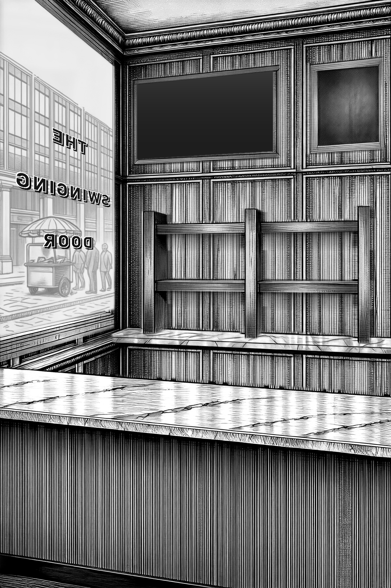

**The thinking.** Base plus every approved, enabled part laid in order through its own silhouette; the TV's blank screen and the window's lettering are drawn in code last, because lettering is never left to the model.

*Logged 19:33.*

---

## 163. plate with the founder's shelf unit in and the cabinets off - the state every modular part is reviewed against

**The ask.** i like c3 slab 7 ... there shouldnt be any cabinets

**The thinking.** The C3 construction is now the live one (its file kept beside the bare one), backbar and both shelves approved from the single seed-7 candidate, cabinets switched off so the wall's dado panelling shows under the ledge. Next: the sill under the window (the founder's 'little railing' is the stack of members under the pane), the sign, then Drew and Barclay on the chairs.

**Settings.** DISABLED = bottles, sconces, cabinets, chairs; approve backbar/shelf-lower/shelf-upper <- work/backbar-C3-slab-s7.png; build

**Verdict.** current plate

*Logged 19:35.*

---

## 164. window-frame-and-reveal render seed 7 laid in full plate

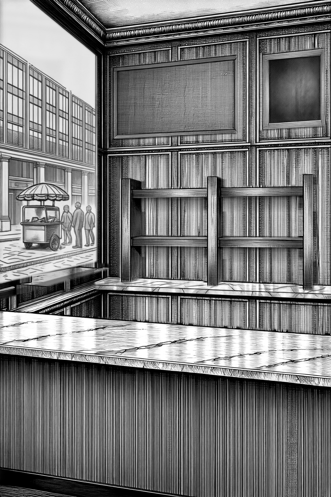

**The thinking.** Rendered in context - the plate as it stands behind this part, with only this part's own silhouette blocked in as values - so the pen, light and perspective are inherited; only the mask is laid back. Part note: the window's joinery: the opening cut through the panelled wall, its reveal, the wide walnut architrave on the room face running as a HEAD AND TWO JAMBS ONLY, and, stepped back inside the reveal, the dark sash frame that holds the single pane. UNDER THE PANE THERE IS ONE MEMBER AND ONLY ONE: a SILL OF PALE POLISHED MARBLE, the same stone as the bar counter, a thin slab with a plain SQUARE edge - no mouldings, no bullnose, no bead - running the width of the opening and a little past it at each end, projecting out of the wall into the room so that its POLISHED TOP FACE catches the daylight and its FRONT EDGE shows as a clean band beneath it, with a soft shadow thrown on the panelling below. The architrave's jambs run down and STOP ON THE STONE. There is NO rail, NO ledge, NO shelf, NO railing and NO second or third horizontal anywhere under the glass: the dark sash rail, then the marble, then panelling

**Settings.** local/sensenova-u1.5, seed 7, full 40 steps cfg 4, negative: bottles, bottle, glasses, decanters, objects on shelves, chair, stool, seat, barstool, lamp, sconce, light fixture

**Prompt.** [prompts/164-window-frame-and-reveal-render-seed-7-laid-in-full-plate.prompt.txt](prompts/164-window-frame-and-reveal-render-seed-7-laid-in-full-plate.prompt.txt)

*Logged 20:13.*

---

## 165. window-frame-and-reveal render seed 21 laid in full plate

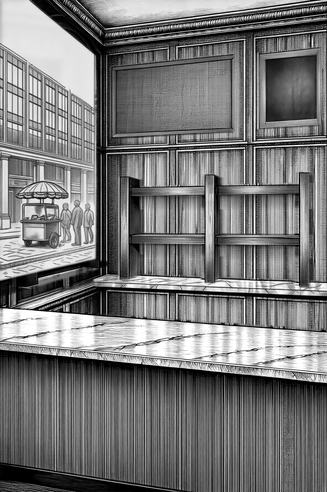

**The thinking.** Rendered in context - the plate as it stands behind this part, with only this part's own silhouette blocked in as values - so the pen, light and perspective are inherited; only the mask is laid back. Part note: the window's joinery: the opening cut through the panelled wall, its reveal, the wide walnut architrave on the room face running as a HEAD AND TWO JAMBS ONLY, and, stepped back inside the reveal, the dark sash frame that holds the single pane. UNDER THE PANE THERE IS ONE MEMBER AND ONLY ONE: a SILL OF PALE POLISHED MARBLE, the same stone as the bar counter, a thin slab with a plain SQUARE edge - no mouldings, no bullnose, no bead - running the width of the opening and a little past it at each end, projecting out of the wall into the room so that its POLISHED TOP FACE catches the daylight and its FRONT EDGE shows as a clean band beneath it, with a soft shadow thrown on the panelling below. The architrave's jambs run down and STOP ON THE STONE. There is NO rail, NO ledge, NO shelf, NO railing and NO second or third horizontal anywhere under the glass: the dark sash rail, then the marble, then panelling

**Settings.** local/sensenova-u1.5, seed 21, full 40 steps cfg 4, negative: bottles, bottle, glasses, decanters, objects on shelves, chair, stool, seat, barstool, lamp, sconce, light fixture

**Prompt.** [prompts/165-window-frame-and-reveal-render-seed-21-laid-in-full-plate.prompt.txt](prompts/165-window-frame-and-reveal-render-seed-21-laid-in-full-plate.prompt.txt)

*Logged 20:13.*

---

## 166. whole-plate assembled with bartenders-marble-ledge back-bar-lower-shelf back-bar-upper-shelf back-bar-carcass television-blank chalkboard-blank window-frame-and-reveal window-glass-street-view main-bar-marble-counter and window-sign

**The thinking.** Base plus every approved, enabled part laid in order through its own silhouette; the TV's blank screen and the window's lettering are drawn in code last, because lettering is never left to the model.

*Logged 20:14.*

---

## 167. whole-plate assembled with bartenders-marble-ledge back-bar-lower-shelf back-bar-upper-shelf back-bar-carcass television-blank chalkboard-blank window-frame-and-reveal window-glass-street-view main-bar-marble-counter left-leather-club-chair right-leather-club-chair and window-sign

**The thinking.** Base plus every approved, enabled part laid in order through its own silhouette; the TV's blank screen and the window's lettering are drawn in code last, because lettering is never left to the model.

*Logged 20:21.*

---

## 168. figure-drew render seed 7 laid in full plate

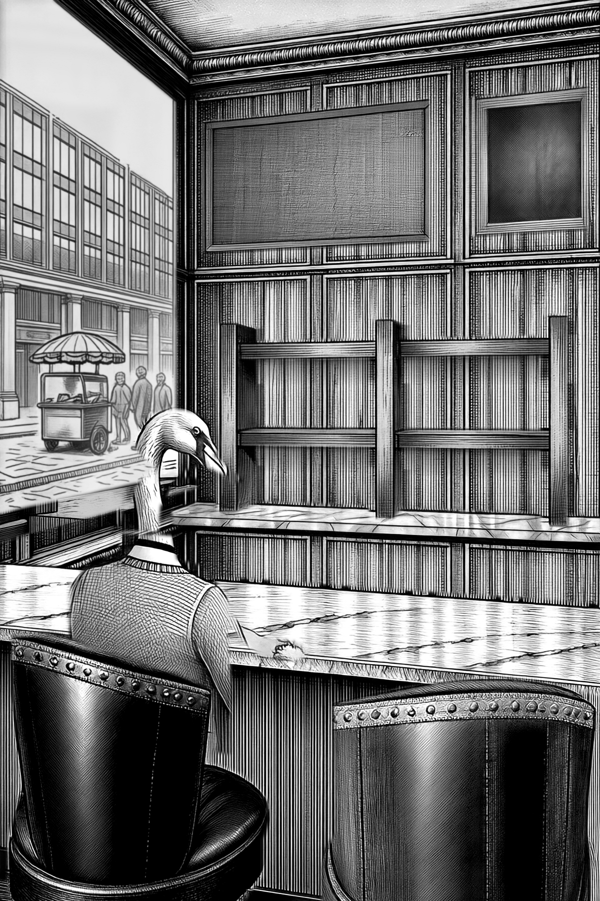

**The thinking.** Rendered in context - the plate as it stands behind this part, with only this part's own silhouette blocked in as values - so the pen, light and perspective are inherited; only the mask is laid back. Part note: the flamingo seated in the left-hand bar chair, seen from BEHIND and a little to his left: the curve of his back and shoulders rising out of the chair's leather roll, his long neck sweeping up and to the right in a deep question-mark, his head turned so we see the far side of his face in three-quarter back view, his heavy downturned beak pointing along the bar toward his companion, and his near feathered hand resting on the marble

**Settings.** local/sensenova-u1.5, seed 7, full 40 steps cfg 4, negative: text, letters, words, lettering, signage, sign, numbers, typography, writing, inscription, shop name, banner, poster, straight neck, stiff neck, goose, swan, pink, colour, bird dot eyes, blank eyes, bare human skin, wing mitts, tail, display plumes, hat, shoes, second flamingo, duplicate figure, floating, standing, front view, facing the camera, full face, flat fill, photographic

**Prompt.** [prompts/168-figure-drew-render-seed-7-laid-in-full-plate.prompt.txt](prompts/168-figure-drew-render-seed-7-laid-in-full-plate.prompt.txt)

*Logged 20:29.*

---

## 169. figure-drew render seed 21 laid in full plate

**The thinking.** Rendered in context - the plate as it stands behind this part, with only this part's own silhouette blocked in as values - so the pen, light and perspective are inherited; only the mask is laid back. Part note: the flamingo seated in the left-hand bar chair, seen from BEHIND and a little to his left: the curve of his back and shoulders rising out of the chair's leather roll, his long neck sweeping up and to the right in a deep question-mark, his head turned so we see the far side of his face in three-quarter back view, his heavy downturned beak pointing along the bar toward his companion, and his near feathered hand resting on the marble

**Settings.** local/sensenova-u1.5, seed 21, full 40 steps cfg 4, negative: text, letters, words, lettering, signage, sign, numbers, typography, writing, inscription, shop name, banner, poster, straight neck, stiff neck, goose, swan, pink, colour, bird dot eyes, blank eyes, bare human skin, wing mitts, tail, display plumes, hat, shoes, second flamingo, duplicate figure, floating, standing, front view, facing the camera, full face, flat fill, photographic

**Prompt.** [prompts/169-figure-drew-render-seed-21-laid-in-full-plate.prompt.txt](prompts/169-figure-drew-render-seed-21-laid-in-full-plate.prompt.txt)

*Logged 20:30.*

---

## 170. figure-drew render seed 33 laid in full plate

**The thinking.** Rendered in context - the plate as it stands behind this part, with only this part's own silhouette blocked in as values - so the pen, light and perspective are inherited; only the mask is laid back. Part note: the flamingo seated in the left-hand bar chair, seen from BEHIND and a little to his left: the curve of his back and shoulders rising out of the chair's leather roll, his long neck sweeping up and to the right in a deep question-mark, his head turned so we see the far side of his face in three-quarter back view, his heavy downturned beak pointing along the bar toward his companion, and his near feathered hand resting on the marble

**Settings.** local/sensenova-u1.5, seed 33, full 40 steps cfg 4, negative: text, letters, words, lettering, signage, sign, numbers, typography, writing, inscription, shop name, banner, poster, straight neck, stiff neck, goose, swan, pink, colour, bird dot eyes, blank eyes, bare human skin, wing mitts, tail, display plumes, hat, shoes, second flamingo, duplicate figure, floating, standing, front view, facing the camera, full face, flat fill, photographic

**Prompt.** [prompts/170-figure-drew-render-seed-33-laid-in-full-plate.prompt.txt](prompts/170-figure-drew-render-seed-33-laid-in-full-plate.prompt.txt)

*Logged 20:30.*

---

## 171. figure-drew render seed 44 laid in full plate

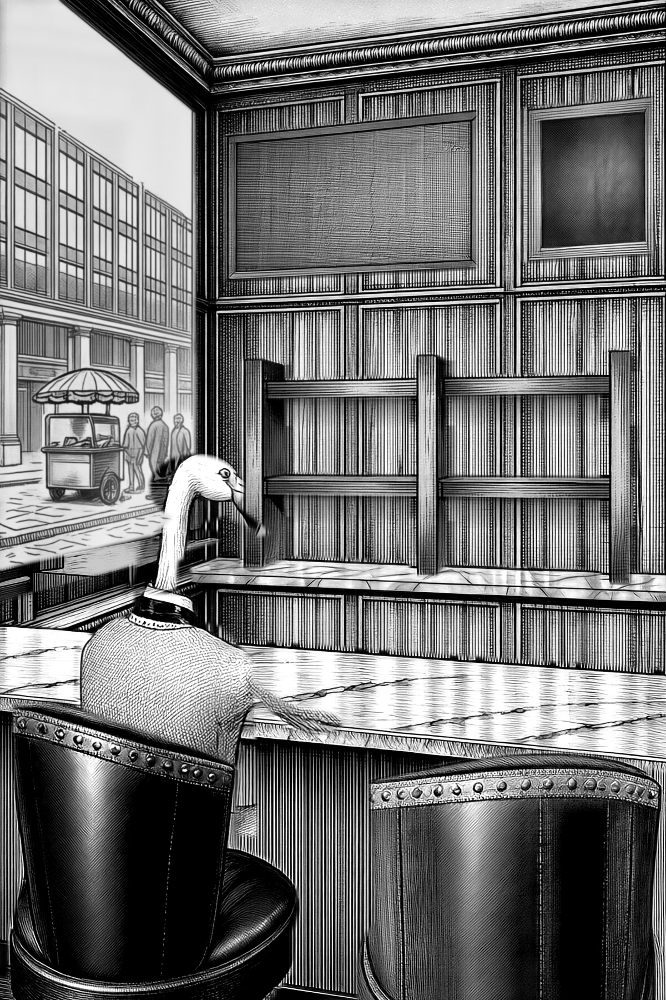

**The thinking.** Rendered in context - the plate as it stands behind this part, with only this part's own silhouette blocked in as values - so the pen, light and perspective are inherited; only the mask is laid back. Part note: the flamingo seated in the left-hand bar chair, seen from BEHIND and a little to his left: the curve of his back and shoulders rising out of the chair's leather roll, his long neck sweeping up and to the right in a deep question-mark, his head turned so we see the far side of his face in three-quarter back view, his heavy downturned beak pointing along the bar toward his companion, and his near feathered hand resting on the marble

**Settings.** local/sensenova-u1.5, seed 44, full 40 steps cfg 4, negative: text, letters, words, lettering, signage, sign, numbers, typography, writing, inscription, shop name, banner, poster, straight neck, stiff neck, goose, swan, pink, colour, bird dot eyes, blank eyes, bare human skin, wing mitts, tail, display plumes, hat, shoes, second flamingo, duplicate figure, floating, standing, front view, facing the camera, full face, flat fill, photographic

**Prompt.** [prompts/171-figure-drew-render-seed-44-laid-in-full-plate.prompt.txt](prompts/171-figure-drew-render-seed-44-laid-in-full-plate.prompt.txt)

*Logged 20:31.*

---

## 172. whole-plate assembled with bartenders-marble-ledge back-bar-lower-shelf back-bar-upper-shelf back-bar-carcass television-blank chalkboard-blank window-frame-and-reveal window-glass-street-view main-bar-marble-counter left-leather-club-chair right-leather-club-chair figure-drew and window-sign

**The thinking.** Base plus every approved, enabled part laid in order through its own silhouette; the TV's blank screen and the window's lettering are drawn in code last, because lettering is never left to the model.

*Logged 20:31.*

---

## 173. Drew seated in the left chair, seen from behind: seeds 7, 21, 33, 44 - seed 7 chosen

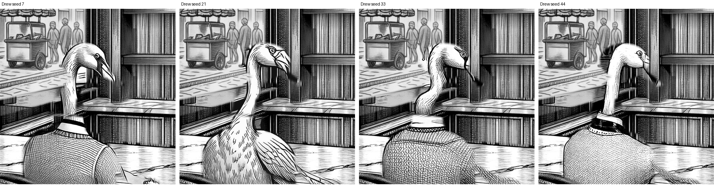

**The ask.** add in drew and barclay and the chairs so we can make the chairs look perfect for them so they really look like they are sitting

**The thinking.** Drew is a new modular part (figure-drew) laid after the chairs: a block-in of a seated figure from behind (torso in the chair, one arm to the marble, the question-mark neck, the head with the beak) at the cast plan's geometry - shoulders 1.32 m, crown 1.65 m on a 0.76 m seat - with his silhouette cut by the chair back so the leather stays in front of him, rendered with the flamingo's character block from the bible and the room prompt's empty-room sentence lifted for him. Seed 7 is Drew: the knitted vest with its ribbed collar across his back, the white collar band, the neck curving, the heavy beak in profile. Seed 21 rendered a bare bird with wings and no clothes, 33 an odd flat head, 44 a straight swan neck.

**Settings.** figure-drew: values block-in + PROMPT-BLOCKS character block; negatives straight neck, goose, swan, pink, wing mitts...; render seeds 7/21/33/44; approve s7

**Verdict.** seed 7 approved into the plate

*Logged 20:31.*

---

## 174. window sill: one marble slab under the pane replaces the stack of rails the founder read as a railing; the sign set in Franklin Gothic and lifted clear of the hot-dog cart

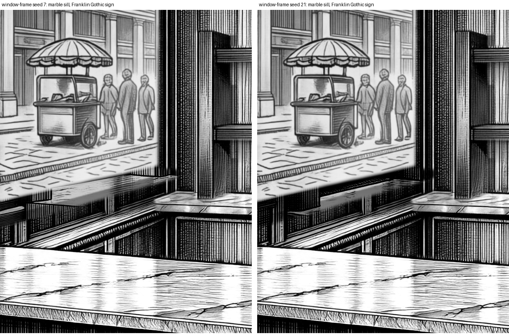

**The ask.** we need a better window sill to show off the signage ... the little railing near the window doesn't look quite right

**The thinking.** The reviewer measured four near-parallel members inside 60 rows under the pane (sash rail, inner sill wedge, the architrave's bottom member and its step line) - a railing. The sill designer replaced them with ONE marble sill 17 cm proud with the counter's 4 cm square lip and short horns, drawn inside the window-frame part. Rendered at seeds 7 and 21; seed 7 approved. The sign's face is now Franklin Gothic Medium (the reviewer's pick over Bahnschrift, Georgia and Palatino: heavier, cleaner, less technical) and its block is lifted so DOOR clears the cart's umbrella. A first build greyed the sill: the part's own shadow map fell on the sill itself - the assembler now keeps a part's shadow off its own silhouette.

**Settings.** draw-room-lines.py: SILL_D 0.17, SILL_T 0.04, SILL_HORN 0.155; sign-on-glass.py FONT framd.ttf, V 0.24-0.78; window-frame s7 approved

**Verdict.** approved - shown to the founder in the review

*Logged 20:31.*

---

## 175. figure-barclay render seed 7 laid in full plate

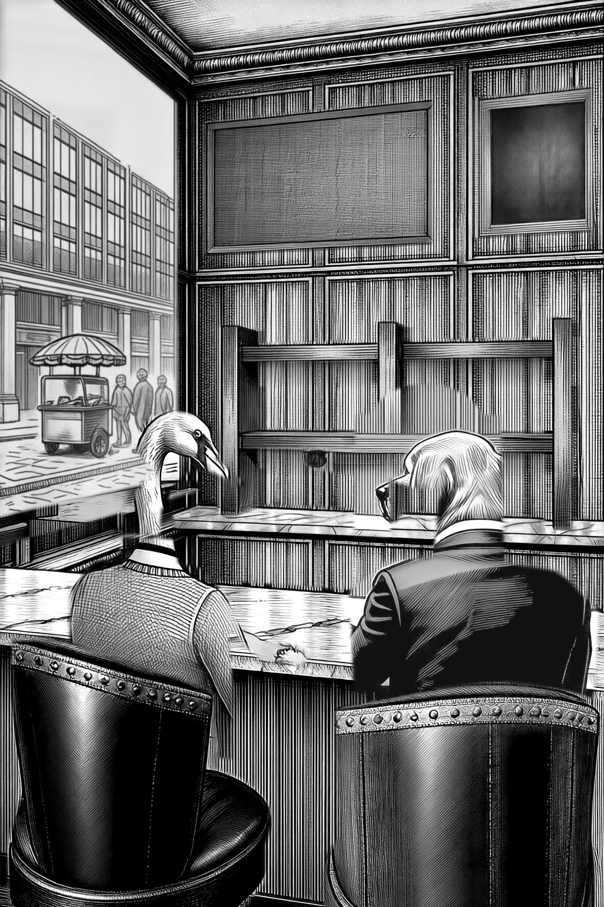

**The thinking.** Rendered in context - the plate as it stands behind this part, with only this part's own silhouette blocked in as values - so the pen, light and perspective are inherited; only the mask is laid back. Part note: the golden retriever seated in the right-hand bar chair, seen from BEHIND and a little to his right: his rounded shoulders and the back of his dark suit jacket rising out of the chair's leather roll, the back of his head with its drop ears turned left toward his companion so his muzzle shows in profile with the black nose, and his near hand resting on the marble

**Settings.** local/sensenova-u1.5, seed 7, full 40 steps cfg 4, negative: text, letters, words, lettering, signage, sign, numbers, typography, writing, inscription, shop name, banner, poster, generic dog, wolf, cartoon dog, tail, heavy neck beard, bare human skin, hat, standing, floating, second dog, duplicate figure, front view, facing the camera, full face, flat fill, photographic

**Prompt.** [prompts/175-figure-barclay-render-seed-7-laid-in-full-plate.prompt.txt](prompts/175-figure-barclay-render-seed-7-laid-in-full-plate.prompt.txt)

*Logged 20:32.*

---

## 176. figure-barclay render seed 21 laid in full plate

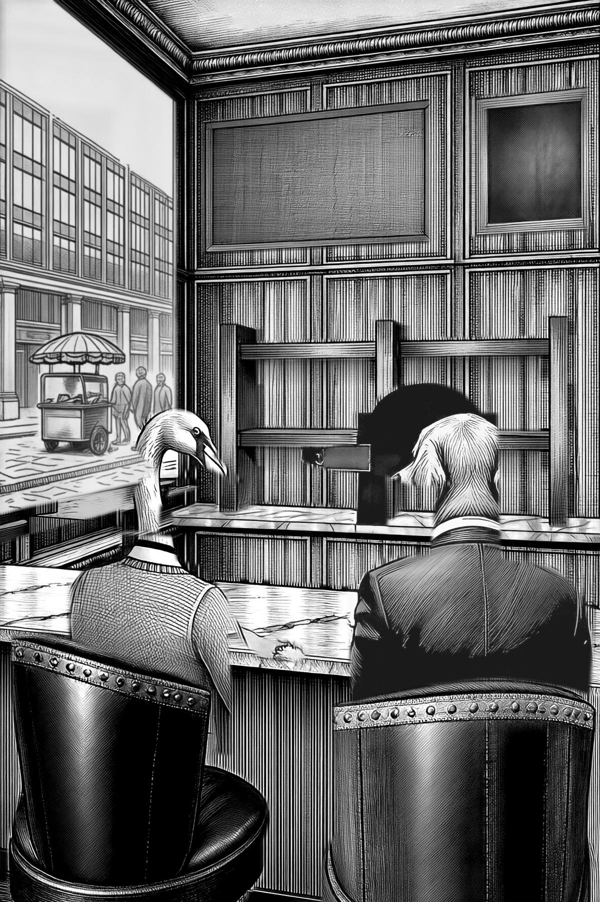

**The thinking.** Rendered in context - the plate as it stands behind this part, with only this part's own silhouette blocked in as values - so the pen, light and perspective are inherited; only the mask is laid back. Part note: the golden retriever seated in the right-hand bar chair, seen from BEHIND and a little to his right: his rounded shoulders and the back of his dark suit jacket rising out of the chair's leather roll, the back of his head with its drop ears turned left toward his companion so his muzzle shows in profile with the black nose, and his near hand resting on the marble

**Settings.** local/sensenova-u1.5, seed 21, full 40 steps cfg 4, negative: text, letters, words, lettering, signage, sign, numbers, typography, writing, inscription, shop name, banner, poster, generic dog, wolf, cartoon dog, tail, heavy neck beard, bare human skin, hat, standing, floating, second dog, duplicate figure, front view, facing the camera, full face, flat fill, photographic

**Prompt.** [prompts/176-figure-barclay-render-seed-21-laid-in-full-plate.prompt.txt](prompts/176-figure-barclay-render-seed-21-laid-in-full-plate.prompt.txt)

*Logged 20:32.*

---

## 177. figure-barclay render seed 33 laid in full plate

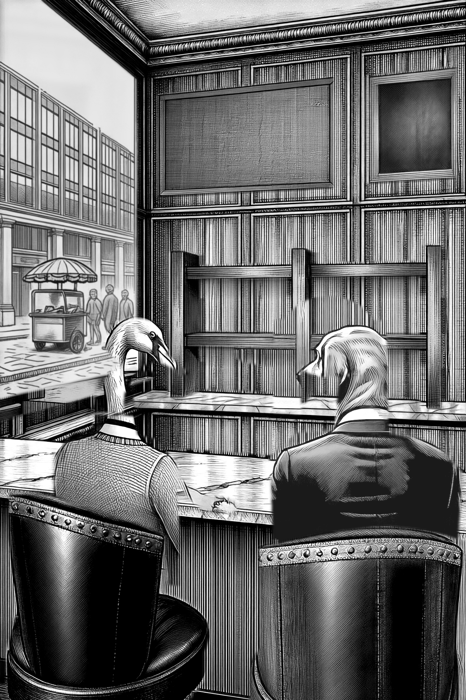

**The thinking.** Rendered in context - the plate as it stands behind this part, with only this part's own silhouette blocked in as values - so the pen, light and perspective are inherited; only the mask is laid back. Part note: the golden retriever seated in the right-hand bar chair, seen from BEHIND and a little to his right: his rounded shoulders and the back of his dark suit jacket rising out of the chair's leather roll, the back of his head with its drop ears turned left toward his companion so his muzzle shows in profile with the black nose, and his near hand resting on the marble

**Settings.** local/sensenova-u1.5, seed 33, full 40 steps cfg 4, negative: text, letters, words, lettering, signage, sign, numbers, typography, writing, inscription, shop name, banner, poster, generic dog, wolf, cartoon dog, tail, heavy neck beard, bare human skin, hat, standing, floating, second dog, duplicate figure, front view, facing the camera, full face, flat fill, photographic

**Prompt.** [prompts/177-figure-barclay-render-seed-33-laid-in-full-plate.prompt.txt](prompts/177-figure-barclay-render-seed-33-laid-in-full-plate.prompt.txt)

*Logged 20:33.*

---

## 178. whole-plate assembled with bartenders-marble-ledge back-bar-lower-shelf back-bar-upper-shelf back-bar-carcass television-blank chalkboard-blank window-frame-and-reveal window-glass-street-view main-bar-marble-counter left-leather-club-chair right-leather-club-chair figure-drew figure-barclay and window-sign

**The thinking.** Base plus every approved, enabled part laid in order through its own silhouette; the TV's blank screen and the window's lettering are drawn in code last, because lettering is never left to the model.

*Logged 20:33.*

---

## 179. Barclay seated in the right chair, seen from behind: seeds 7, 21, 33 - seed 7 chosen, rendered against the plate that already carries Drew

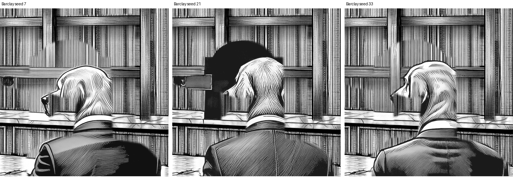

**The ask.** add in drew and barclay and the chairs

**The thinking.** Barclay is the second figure part, rendered after Drew was approved so the model matched his pen and light. Seed 7: the golden retriever's furred head with a drop ear, the muzzle in profile with the black nose, the dark suit jacket and pale collar rising out of the chair. Seed 21 grew a black mass behind the head; 33 lengthened the ears into a hound. His head covers the shelf unit's right divider for a band, as the cast plan warned.

**Settings.** figure-barclay: block-in + dog character block; negatives generic dog, wolf, tail...; render seeds 7/21/33; approve s7; build

**Verdict.** seed 7 approved - the pair shown to the founder

*Logged 20:34.*

---

## 180. the plate at the end of the day: sill, Franklin Gothic sign, floating slabs, chairs back on, Drew and Barclay seated

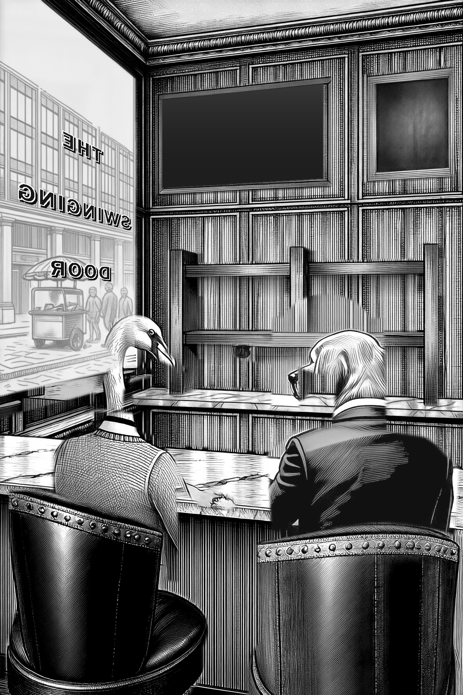

**The ask.** add in drew and barclay and the chairs so we can make the chairs look perfect for them so they really look like they are sitting and we see nice classy back of the chairs

**The thinking.** Every layer in: base, ledge, the founder's slab unit, TV, chalkboard, window frame with the new marble sill, the street, the counter, both chairs (the seed-4 pair), Drew (s7) and Barclay (s7) seated in them with the leather rolls crossing their backs, and the sign typeset last. The chairs are judged against the sitters now: mid-height backs, nailhead rolls, the sitters' shoulders inside the arms. For the founder: do the chairs look perfect for them, and do they really look like they are sitting?

**Settings.** build; stickers re-exported

**Verdict.** for the founder's verdict - shown with the layer-by-layer page

*Logged 20:36.*

---

## 181. whole-plate assembled with bartenders-marble-ledge back-bar-lower-shelf back-bar-upper-shelf back-bar-carcass television-blank chalkboard-blank window-frame-and-reveal window-glass-street-view main-bar-marble-counter and window-sign

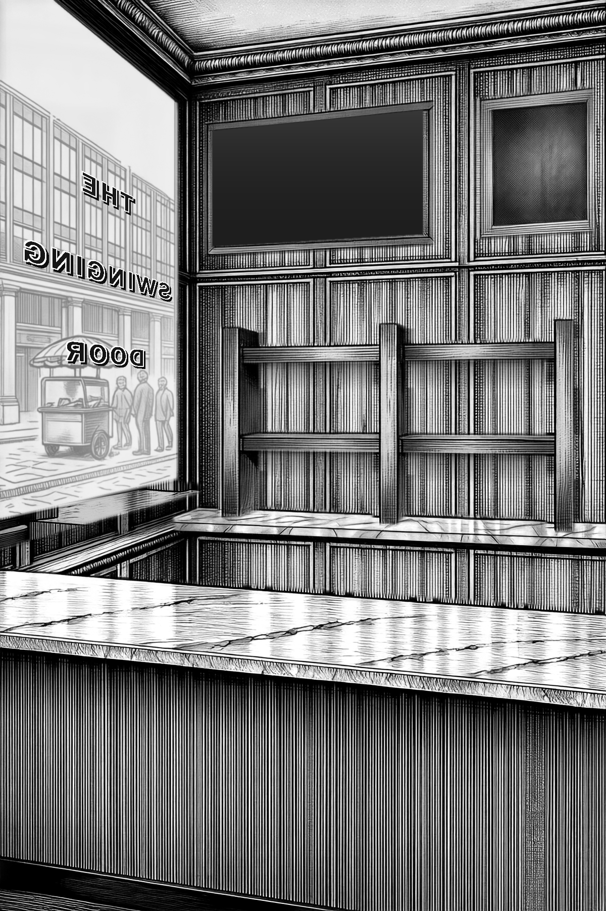

**The thinking.** Base plus every approved, enabled part laid in order through its own silhouette; the TV's blank screen and the window's lettering are drawn in code last, because lettering is never left to the model.

*Logged 21:01.*

---

## 182. the cast understood: Drew, Barclay and Abby read from their bibles by Opus teammates, and the recreation plan (reports/2026-09-05/CAST-PLAN.md)

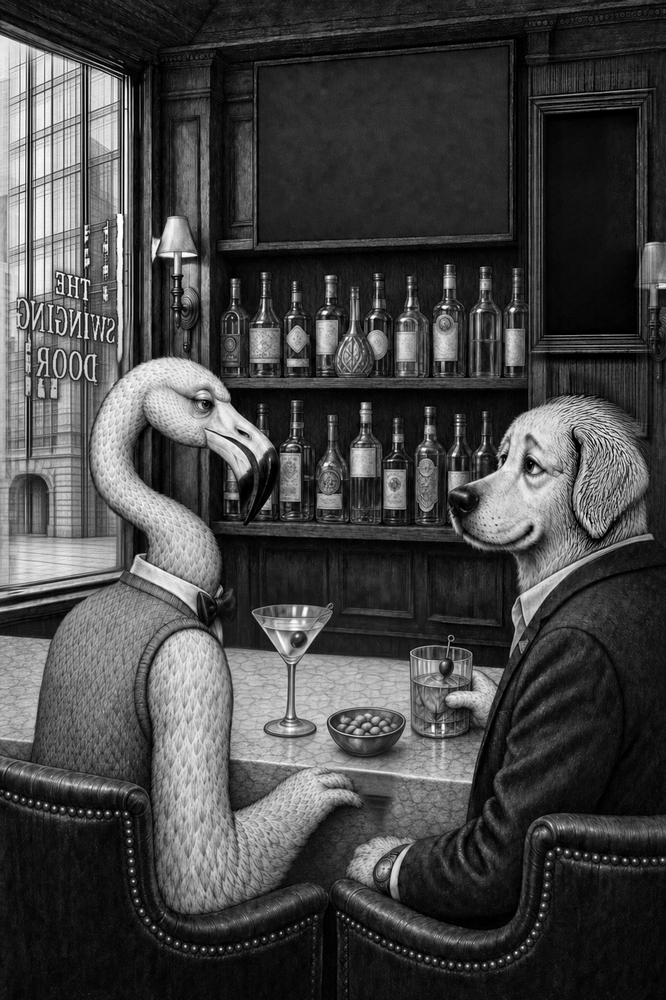

**The ask.** go to the cartoon cloned repo and get drew barclay and abby and recreate them perfectly ... multiple poses ... looking at each other ... friendly, great texture unique to their animal, eyes human and huggable

**The thinking.** Four readers (one per character, one for the old pipeline) and a planner. The bibles lock the identities precisely (Drew: ninety percent bird, the swan-shaped bill with the black outer third, one neck reversal, heavy-lidded human eyes, sweater vest, bow tie; Barclay: the retriever drawn like one, black lip-line, modest ruff, no tail, flag pin, wristwatch; Abby: the bartender at the ledge). The local server draws every pixel from noise - references condition, nothing keeps a face - so the plan is a hybrid: reference-guided render in context for body and pose, a code-side head transplant from the approved head tiles, shadows in code; 17 poses across the three, each a modular layer with its own mask, and a caption loop that swaps mouths and eyes by paste rather than re-rendering. Two canon conflicts need the founder's word first: the master prompt's wording of Drew's bill contradicts the bible, and the manifest still names a superseded model sheet as the locked master. The bar comes first, as instructed.

**Settings.** workflow cast-understanding (5 opus agents); plan saved to reports/2026-09-05/CAST-PLAN.md (193 KB)

**Verdict.** plan ready - two founder decisions requested before any render

*Logged 21:15.*

---

## 183. window-frame-and-reveal render seed 7 laid in full plate

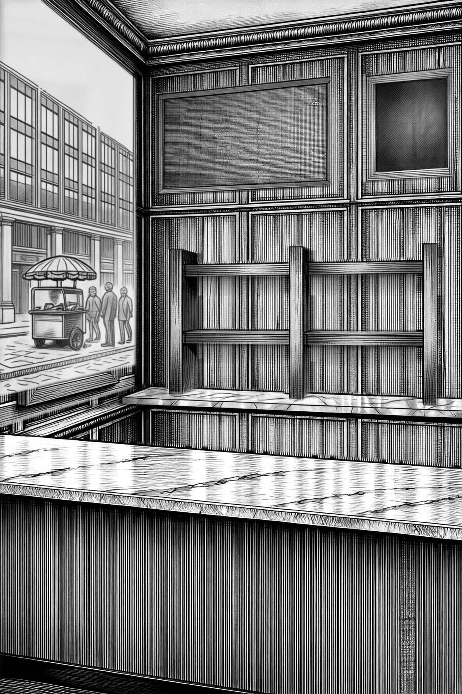

**The thinking.** Rendered in context - the plate as it stands behind this part, with only this part's own silhouette blocked in as values - so the pen, light and perspective are inherited; only the mask is laid back. Part note: the window's joinery: the opening cut through the panelled wall, its reveal, the wide architrave on the room face and, stepped back inside the reveal, the dark sash frame that holds the single pane

**Settings.** local/sensenova-u1.5, seed 7, full 40 steps cfg 4, negative: bottles, bottle, glasses, decanters, objects on shelves, chair, stool, seat, barstool, dog, retriever, person, figure, man, character, flamingo, bird, person, figure, man, character, lamp, sconce, light fixture

**Prompt.** [prompts/183-window-frame-and-reveal-render-seed-7-laid-in-full-plate.prompt.txt](prompts/183-window-frame-and-reveal-render-seed-7-laid-in-full-plate.prompt.txt)

*Logged 21:57.*

---

## 184. window-frame-and-reveal render seed 21 laid in full plate

**The thinking.** Rendered in context - the plate as it stands behind this part, with only this part's own silhouette blocked in as values - so the pen, light and perspective are inherited; only the mask is laid back. Part note: the window's joinery: the opening cut through the panelled wall, its reveal, the wide architrave on the room face and, stepped back inside the reveal, the dark sash frame that holds the single pane

**Settings.** local/sensenova-u1.5, seed 21, full 40 steps cfg 4, negative: bottles, bottle, glasses, decanters, objects on shelves, chair, stool, seat, barstool, dog, retriever, person, figure, man, character, flamingo, bird, person, figure, man, character, lamp, sconce, light fixture

**Prompt.** [prompts/184-window-frame-and-reveal-render-seed-21-laid-in-full-plate.prompt.txt](prompts/184-window-frame-and-reveal-render-seed-21-laid-in-full-plate.prompt.txt)

*Logged 21:57.*

---

## 185. bartenders-marble-ledge render seed 7 laid in full plate

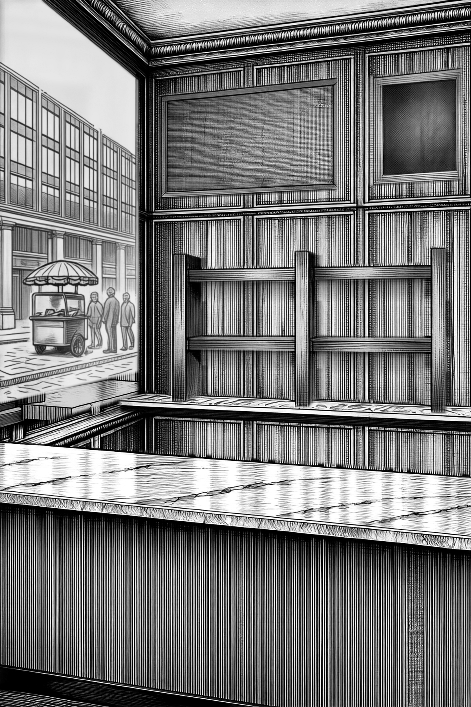

**The thinking.** Rendered in context - the plate as it stands behind this part, with only this part's own silhouette blocked in as values - so the pen, light and perspective are inherited; only the mask is laid back. Part note: the back bar's working ledge: a marble-topped counter at waist height running the width of the unit, its polished top pale and veined, its front a slim moulded marble edge, its back flush into the cabinet - empty, nothing standing on it

**Settings.** local/sensenova-u1.5, seed 7, full 40 steps cfg 4, negative: post, pole, column, pillar, tap, beer tap, pump, handle, bottle, glass, object on the counter, lamp, bullnose, rounded nosing, moulded edge, bolster, cushion, padded edge, heavy dark veins, cracked stone, bottles, bottle, glasses, decanters, objects on shelves, chair, stool, seat, barstool, chalkboard, blackboard, framed board, picture, frame, dog, retriever, person, figure, man, character, flamingo, bird, person, figure, man, character, lamp, sconce, light fixture, television, screen, monitor, flat screen

**Prompt.** [prompts/185-bartenders-marble-ledge-render-seed-7-laid-in-full-plate.prompt.txt](prompts/185-bartenders-marble-ledge-render-seed-7-laid-in-full-plate.prompt.txt)

*Logged 21:58.*

---

## 186. bartenders-marble-ledge render seed 33 laid in full plate

**The thinking.** Rendered in context - the plate as it stands behind this part, with only this part's own silhouette blocked in as values - so the pen, light and perspective are inherited; only the mask is laid back. Part note: the back bar's working ledge: a marble-topped counter at waist height running the width of the unit, its polished top pale and veined, its front a slim moulded marble edge, its back flush into the cabinet - empty, nothing standing on it

**Settings.** local/sensenova-u1.5, seed 33, full 40 steps cfg 4, negative: post, pole, column, pillar, tap, beer tap, pump, handle, bottle, glass, object on the counter, lamp, bullnose, rounded nosing, moulded edge, bolster, cushion, padded edge, heavy dark veins, cracked stone, bottles, bottle, glasses, decanters, objects on shelves, chair, stool, seat, barstool, chalkboard, blackboard, framed board, picture, frame, dog, retriever, person, figure, man, character, flamingo, bird, person, figure, man, character, lamp, sconce, light fixture, television, screen, monitor, flat screen

**Prompt.** [prompts/186-bartenders-marble-ledge-render-seed-33-laid-in-full-plate.prompt.txt](prompts/186-bartenders-marble-ledge-render-seed-33-laid-in-full-plate.prompt.txt)

*Logged 21:58.*

---

## 187. whole-plate assembled with bartenders-marble-ledge back-bar-lower-shelf back-bar-upper-shelf back-bar-carcass television-blank chalkboard-blank window-frame-and-reveal window-glass-street-view main-bar-marble-counter and window-sign

**The thinking.** Base plus every approved, enabled part laid in order through its own silhouette; the TV's blank screen and the window's lettering are drawn in code last, because lettering is never left to the model.

*Logged 21:59.*

---

## 188. window-frame-and-reveal render seed 7 laid in full plate

**The thinking.** Rendered in context - the plate as it stands behind this part, with only this part's own silhouette blocked in as values - so the pen, light and perspective are inherited; only the mask is laid back. Part note: the window's joinery, CLEAN STRAIGHT LINES: the opening cut through the panelled wall, its reveal, a plain flat square architrave on the room face - the same simple flat band on all four sides, the bottom exactly like the sides - and, stepped back inside the reveal, the dark sash frame that holds the single pane. There is NO window sill, NO projecting ledge or shelf under the pane, NO moulded nosing, NO rail: under the pane the flat architrave band simply meets the panelled wall

**Settings.** local/sensenova-u1.5, seed 7, full 40 steps cfg 4, negative: sill, window sill, stone sill, ledge, shelf, projecting sill, nosing, moulded nosing, moulding, cornice, railing, rail, balustrade, radiator, box, blur, smear, curtain, blind, bottles, bottle, glasses, decanters, objects on shelves, chair, stool, seat, barstool, dog, retriever, person, figure, man, character, flamingo, bird, person, figure, man, character, lamp, sconce, light fixture

**Prompt.** [prompts/188-window-frame-and-reveal-render-seed-7-laid-in-full-plate.prompt.txt](prompts/188-window-frame-and-reveal-render-seed-7-laid-in-full-plate.prompt.txt)

*Logged 22:06.*

---

## 189. window-frame-and-reveal render seed 21 laid in full plate

**The thinking.** Rendered in context - the plate as it stands behind this part, with only this part's own silhouette blocked in as values - so the pen, light and perspective are inherited; only the mask is laid back. Part note: the window's joinery, CLEAN STRAIGHT LINES: the opening cut through the panelled wall, its reveal, a plain flat square architrave on the room face - the same simple flat band on all four sides, the bottom exactly like the sides - and, stepped back inside the reveal, the dark sash frame that holds the single pane. There is NO window sill, NO projecting ledge or shelf under the pane, NO moulded nosing, NO rail: under the pane the flat architrave band simply meets the panelled wall

**Settings.** local/sensenova-u1.5, seed 21, full 40 steps cfg 4, negative: sill, window sill, stone sill, ledge, shelf, projecting sill, nosing, moulded nosing, moulding, cornice, railing, rail, balustrade, radiator, box, blur, smear, curtain, blind, bottles, bottle, glasses, decanters, objects on shelves, chair, stool, seat, barstool, dog, retriever, person, figure, man, character, flamingo, bird, person, figure, man, character, lamp, sconce, light fixture

**Prompt.** [prompts/189-window-frame-and-reveal-render-seed-21-laid-in-full-plate.prompt.txt](prompts/189-window-frame-and-reveal-render-seed-21-laid-in-full-plate.prompt.txt)

*Logged 22:06.*

---

## 190. window-frame-and-reveal render seed 33 laid in full plate

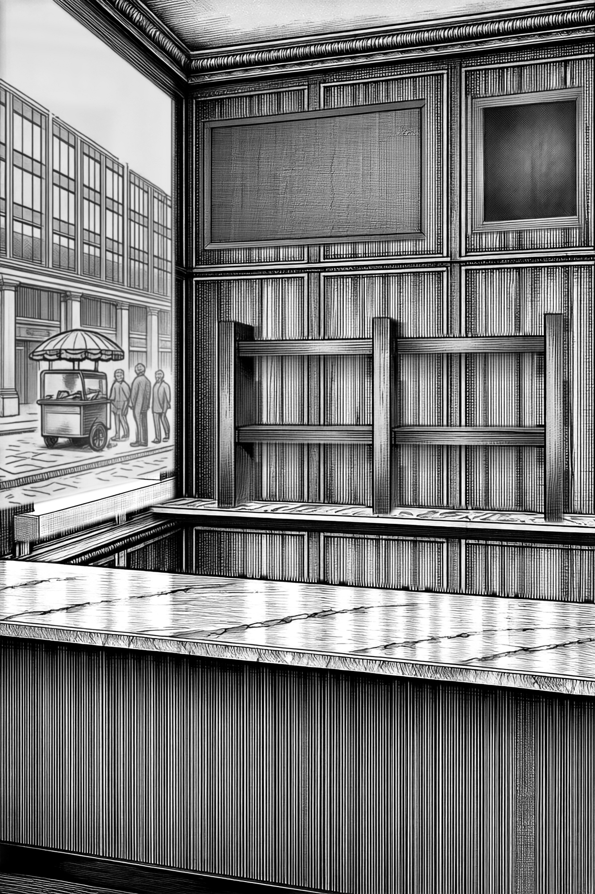

**The thinking.** Rendered in context - the plate as it stands behind this part, with only this part's own silhouette blocked in as values - so the pen, light and perspective are inherited; only the mask is laid back. Part note: the window's joinery, CLEAN STRAIGHT LINES: the opening cut through the panelled wall, its reveal, a plain flat square architrave on the room face - the same simple flat band on all four sides, the bottom exactly like the sides - and, stepped back inside the reveal, the dark sash frame that holds the single pane. There is NO window sill, NO projecting ledge or shelf under the pane, NO moulded nosing, NO rail: under the pane the flat architrave band simply meets the panelled wall

**Settings.** local/sensenova-u1.5, seed 33, full 40 steps cfg 4, negative: sill, window sill, stone sill, ledge, shelf, projecting sill, nosing, moulded nosing, moulding, cornice, railing, rail, balustrade, radiator, box, blur, smear, curtain, blind, bottles, bottle, glasses, decanters, objects on shelves, chair, stool, seat, barstool, dog, retriever, person, figure, man, character, flamingo, bird, person, figure, man, character, lamp, sconce, light fixture

**Prompt.** [prompts/190-window-frame-and-reveal-render-seed-33-laid-in-full-plate.prompt.txt](prompts/190-window-frame-and-reveal-render-seed-33-laid-in-full-plate.prompt.txt)

*Logged 22:06.*

---

## 191. window-frame-and-reveal render seed 7 laid in full plate

**The thinking.** Rendered in context - the plate as it stands behind this part, with only this part's own silhouette blocked in as values - so the pen, light and perspective are inherited; only the mask is laid back. Part note: the window's joinery, CLEAN STRAIGHT LINES: the opening cut through the panelled wall, its reveal, a plain flat square architrave on the room face - the same simple flat band on all four sides, the bottom exactly like the sides - and, stepped back inside the reveal, the dark sash frame that holds the single pane. There is NO window sill, NO projecting ledge or shelf under the pane, NO moulded nosing, NO rail: under the pane the flat architrave band simply meets the panelled wall

**Settings.** local/sensenova-u1.5, seed 7, full 40 steps cfg 4, negative: sill, window sill, stone sill, ledge, shelf, projecting sill, nosing, moulded nosing, moulding, cornice, railing, rail, balustrade, radiator, box, blur, smear, curtain, blind, bottles, bottle, glasses, decanters, objects on shelves, chair, stool, seat, barstool, dog, retriever, person, figure, man, character, flamingo, bird, person, figure, man, character, lamp, sconce, light fixture

**Prompt.** [prompts/191-window-frame-and-reveal-render-seed-7-laid-in-full-plate.prompt.txt](prompts/191-window-frame-and-reveal-render-seed-7-laid-in-full-plate.prompt.txt)

*Logged 22:14.*

---

## 192. window-frame-and-reveal render seed 21 laid in full plate

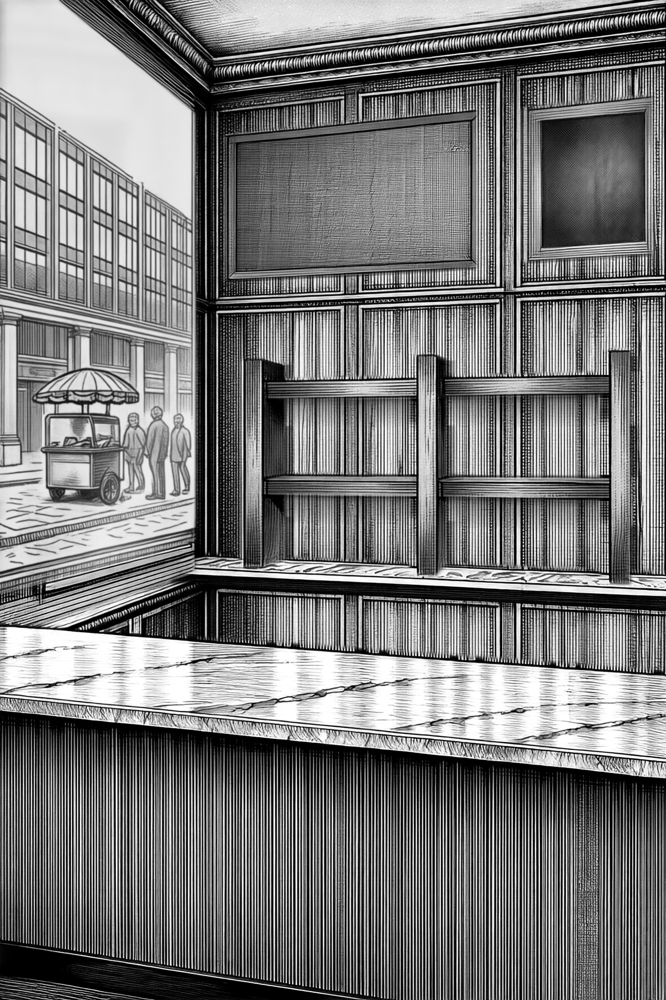

**The thinking.** Rendered in context - the plate as it stands behind this part, with only this part's own silhouette blocked in as values - so the pen, light and perspective are inherited; only the mask is laid back. Part note: the window's joinery, CLEAN STRAIGHT LINES: the opening cut through the panelled wall, its reveal, a plain flat square architrave on the room face - the same simple flat band on all four sides, the bottom exactly like the sides - and, stepped back inside the reveal, the dark sash frame that holds the single pane. There is NO window sill, NO projecting ledge or shelf under the pane, NO moulded nosing, NO rail: under the pane the flat architrave band simply meets the panelled wall

**Settings.** local/sensenova-u1.5, seed 21, full 40 steps cfg 4, negative: sill, window sill, stone sill, ledge, shelf, projecting sill, nosing, moulded nosing, moulding, cornice, railing, rail, balustrade, radiator, box, blur, smear, curtain, blind, bottles, bottle, glasses, decanters, objects on shelves, chair, stool, seat, barstool, dog, retriever, person, figure, man, character, flamingo, bird, person, figure, man, character, lamp, sconce, light fixture

**Prompt.** [prompts/192-window-frame-and-reveal-render-seed-21-laid-in-full-plate.prompt.txt](prompts/192-window-frame-and-reveal-render-seed-21-laid-in-full-plate.prompt.txt)

*Logged 22:15.*

---

## 193. window-glass-street-view render seed 21 laid in full plate

**The thinking.** Rendered in context - the plate as it stands behind this part, with only this part's own silhouette blocked in as values - so the pen, light and perspective are inherited; only the mask is laid back. Part note: the view through the window: the street, the building opposite, the hot dog cart and the people

**Settings.** local/sensenova-u1.5, seed 21, full 40 steps cfg 4, negative: text, letters, words, lettering, signage, sign, numbers, typography, writing, inscription, shop name, banner, poster, bottles, bottle, glasses, decanters, objects on shelves, chair, stool, seat, barstool, dog, retriever, person, figure, man, character, flamingo, bird, person, figure, man, character, lamp, sconce, light fixture

**Prompt.** [prompts/193-window-glass-street-view-render-seed-21-laid-in-full-plate.prompt.txt](prompts/193-window-glass-street-view-render-seed-21-laid-in-full-plate.prompt.txt)

*Logged 22:15.*

---

## 194. window-glass-street-view render seed 7 laid in full plate

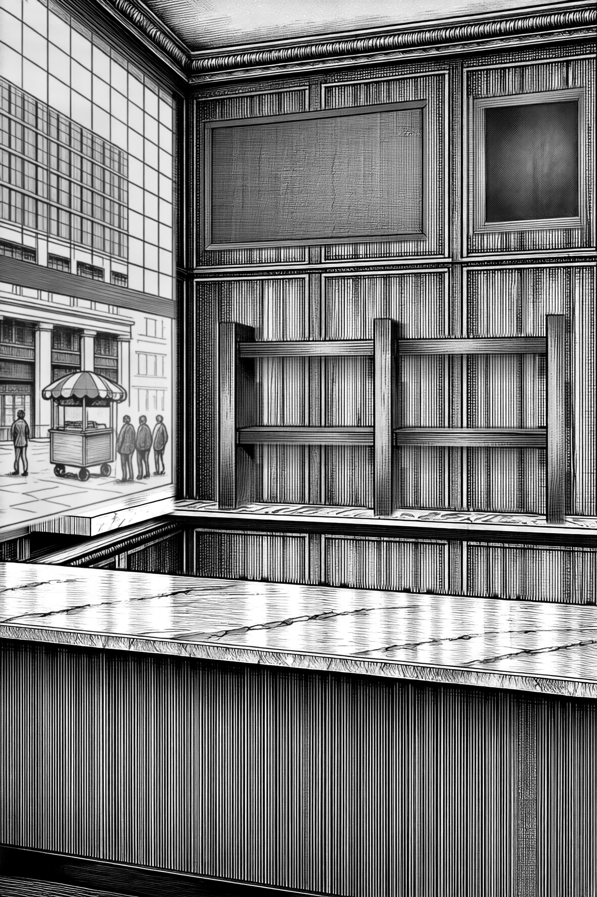

**The thinking.** Rendered in context - the plate as it stands behind this part, with only this part's own silhouette blocked in as values - so the pen, light and perspective are inherited; only the mask is laid back. Part note: the view through the window: the street, the building opposite, the hot dog cart and the people

**Settings.** local/sensenova-u1.5, seed 7, full 40 steps cfg 4, negative: text, letters, words, lettering, signage, sign, numbers, typography, writing, inscription, shop name, banner, poster, bottles, bottle, glasses, decanters, objects on shelves, chair, stool, seat, barstool, dog, retriever, person, figure, man, character, flamingo, bird, person, figure, man, character, lamp, sconce, light fixture

**Prompt.** [prompts/194-window-glass-street-view-render-seed-7-laid-in-full-plate.prompt.txt](prompts/194-window-glass-street-view-render-seed-7-laid-in-full-plate.prompt.txt)

*Logged 22:16.*

---

## 195. whole-plate assembled with bartenders-marble-ledge back-bar-lower-shelf back-bar-upper-shelf back-bar-carcass television-blank chalkboard-blank window-frame-and-reveal window-glass-street-view main-bar-marble-counter and window-sign

**The thinking.** Base plus every approved, enabled part laid in order through its own silhouette; the TV's blank screen and the window's lettering are drawn in code last, because lettering is never left to the model.

*Logged 22:16.*

---

## 196. whole-plate assembled with bartenders-marble-ledge back-bar-lower-shelf back-bar-upper-shelf back-bar-carcass television-blank chalkboard-blank window-frame-and-reveal window-glass-street-view main-bar-marble-counter and window-sign

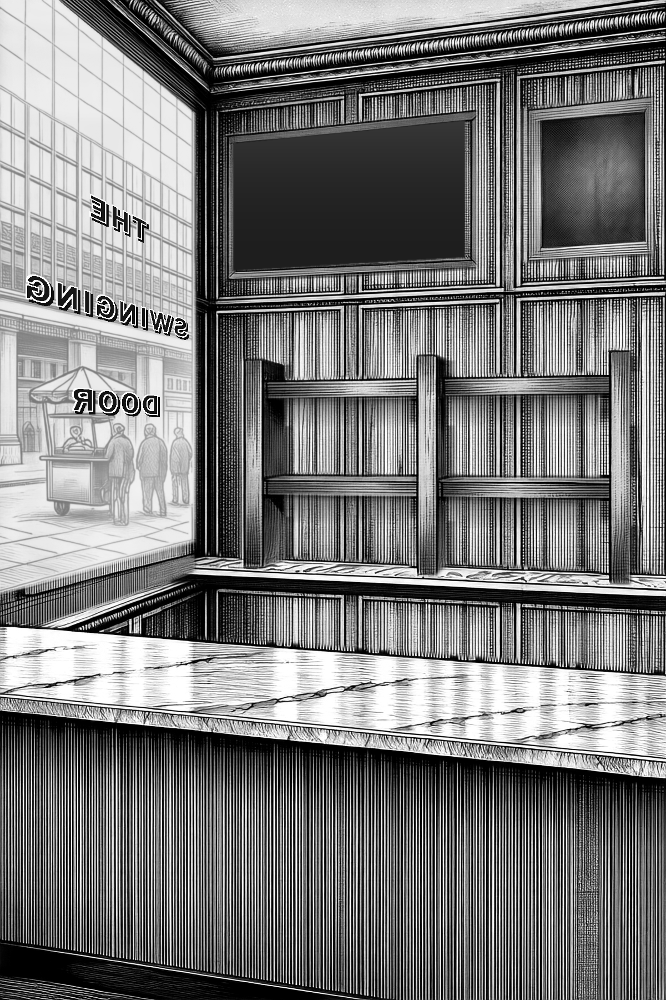

**The thinking.** Base plus every approved, enabled part laid in order through its own silhouette; the TV's blank screen and the window's lettering are drawn in code last, because lettering is never left to the model.

*Logged 22:17.*

---

## 197. the window made clean: sill removed, the pane brought down to sit on the marble, the bartender's ledge run into the window wall

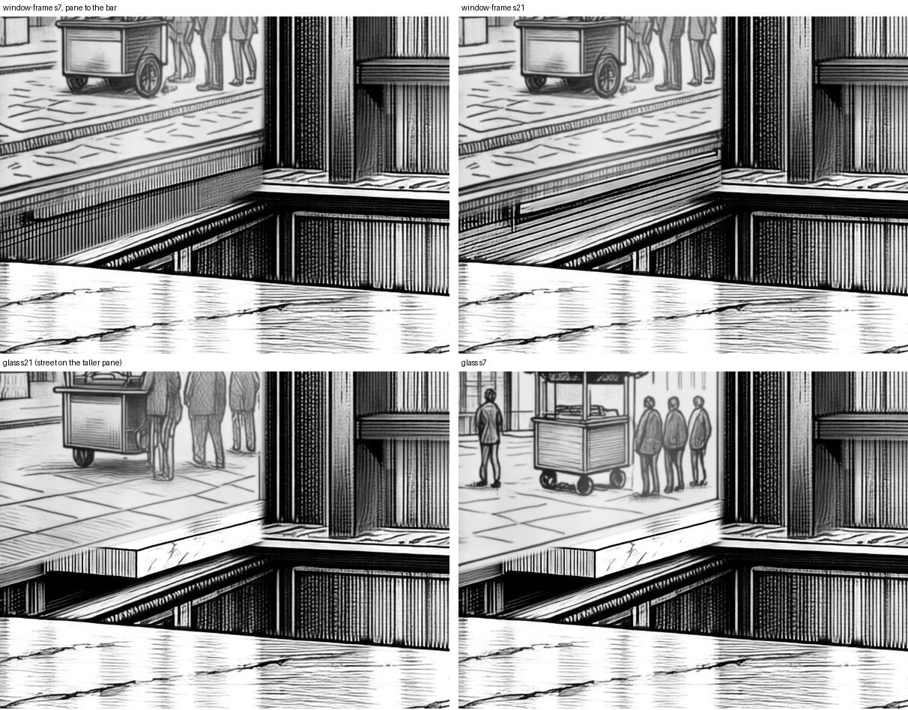

**The ask.** i really dislike this part we can remove it make the window clean lines and the corner have the bar go all the way to the window wall and look clean

**The thinking.** The sill came out (its patch reversed) and the inner sill wedge with it, and the ledge was extended from -0.675 m to the window wall at -0.80 m. The first re-renders still grew a rail under the pane: between the pane and the marble there were two stacked bands, the sash rail and the architrave's bottom member, and the model reads any such stack as a railing. The fix follows the founder's own first brief - one pane from bar level to the crown: the sash rail now sits on the marble (WINDOW_SILL = COUNTER_H) and the architrave's bottom hides behind the counter, so under the pane there is one line and then stone. The street was re-rendered for the taller pane (seed 21 keeps the cart-left, people-right composition). Frame seed 7 approved (seed 21 striped the band again), glass seed 21 approved.

**Settings.** sill patch reversed; BACKBAR_X (RETURN_X, 2.16); WINDOW_SILL = COUNTER_H + 0.005; window-frame note forbids a sill; negative sill/ledge/railing...; ledge s7, window-frame s7, glass s21 approved

**Verdict.** shown to the founder

*Logged 22:17.*

---

## 198. bartenders-marble-ledge render seed 7 laid in full plate

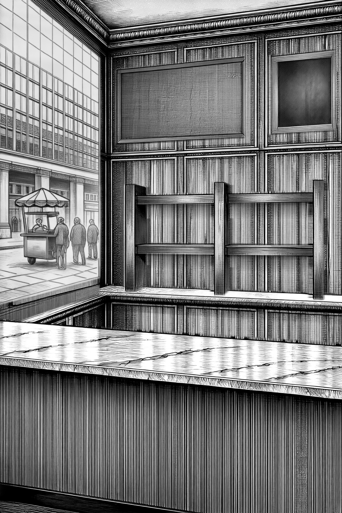

**The thinking.** Rendered in context - the plate as it stands behind this part, with only this part's own silhouette blocked in as values - so the pen, light and perspective are inherited; only the mask is laid back. Part note: the back bar's working ledge: a marble-topped counter at waist height running the width of the unit, its polished top pale and veined, its front a slim moulded marble edge, its back flush into the cabinet - empty, nothing standing on it

**Settings.** local/sensenova-u1.5, seed 7, full 40 steps cfg 4, negative: post, pole, column, pillar, tap, beer tap, pump, handle, bottle, glass, object on the counter, lamp, bullnose, rounded nosing, moulded edge, bolster, cushion, padded edge, heavy dark veins, cracked stone, bottles, bottle, glasses, decanters, objects on shelves, chair, stool, seat, barstool, chalkboard, blackboard, framed board, picture, frame, dog, retriever, person, figure, man, character, flamingo, bird, person, figure, man, character, lamp, sconce, light fixture, television, screen, monitor, flat screen

**Prompt.** [prompts/198-bartenders-marble-ledge-render-seed-7-laid-in-full-plate.prompt.txt](prompts/198-bartenders-marble-ledge-render-seed-7-laid-in-full-plate.prompt.txt)

*Logged 22:37.*

---

## 199. bartenders-marble-ledge render seed 21 laid in full plate

**The thinking.** Rendered in context - the plate as it stands behind this part, with only this part's own silhouette blocked in as values - so the pen, light and perspective are inherited; only the mask is laid back. Part note: the back bar's working ledge: a marble-topped counter at waist height running the width of the unit, its polished top pale and veined, its front a slim moulded marble edge, its back flush into the cabinet - empty, nothing standing on it

**Settings.** local/sensenova-u1.5, seed 21, full 40 steps cfg 4, negative: post, pole, column, pillar, tap, beer tap, pump, handle, bottle, glass, object on the counter, lamp, bullnose, rounded nosing, moulded edge, bolster, cushion, padded edge, heavy dark veins, cracked stone, bottles, bottle, glasses, decanters, objects on shelves, chair, stool, seat, barstool, chalkboard, blackboard, framed board, picture, frame, dog, retriever, person, figure, man, character, flamingo, bird, person, figure, man, character, lamp, sconce, light fixture, television, screen, monitor, flat screen

**Prompt.** [prompts/199-bartenders-marble-ledge-render-seed-21-laid-in-full-plate.prompt.txt](prompts/199-bartenders-marble-ledge-render-seed-21-laid-in-full-plate.prompt.txt)

*Logged 22:37.*

---

## 200. whole-plate assembled with bartenders-marble-ledge back-bar-lower-shelf back-bar-upper-shelf back-bar-carcass television-blank chalkboard-blank window-frame-and-reveal window-glass-street-view main-bar-marble-counter and window-sign

**The thinking.** Base plus every approved, enabled part laid in order through its own silhouette; the TV's blank screen and the window's lettering are drawn in code last, because lettering is never left to the model.

*Logged 22:39.*

---

## 201. the wall meeting the bartender's counter: one lip, shadow as a layer, the marble's straight edges inked in code

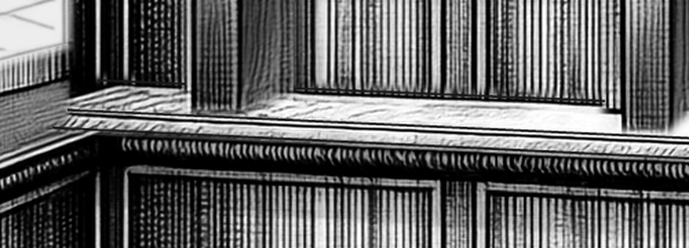

**The ask.** needs more working with the straight lines of the wall meeting the bar tenders counter. it should look clean

**The thinking.** Three faults at the junction: the wall's hatching bled into the marble because the ledge's back edge was soft in the render; under the lip two drawn bands (an underside the eye cannot see from above, and a flat shadow face) rendered as a heavy rail; and the marble was over-veined. The ledge is now one thin 4 cm square lip like the main bar's, its shadow on the panelling a multiplier layer, and - the new rule - the marble's straight edges (its meeting with the wall, the top and bottom of the lip; the same for the main bar) are inked from the construction's geometry after the render, clipped by whatever stands in front, so they stay straight whatever the model does. Seed 7 approved (calm veining). Remaining: a beaded rail under the lip, which is the base wall's dado moulding rendered deeper than drawn; hiding it means dropping the dado rail below the marble and re-rendering the base - a Monday decision.

**Settings.** draw-room-lines.py: ledge nose only + cast(); INK list -> ink.json; scripts/ink.py; room-part.py build and compose-layers.py ink the edges; ledge s7 approved

**Verdict.** shown to the founder

*Logged 22:40.*

---

## 202. day closed by the founder: the plate as approved, the end-of-day report for Rick finalized (output/pdf/ricks-studio-end-of-day-2026-09-05.pdf)

**The ask.** todays work is done finalize the pdf

**The thinking.** The founder closed the day on this plate: the floating-slab back bar, the marble bars with inked straight edges, the window as one pane to the marble with the Franklin Gothic sign, the ledge run into the window wall, no cabinets, chairs and characters out until the cast is recreated from the bibles. Monday: the characters go into the scene; open decisions carried over - the dado rail under the ledge (a base re-render), Drew's bill wording, Drew's locked reference.

**Settings.** scripts/build-rick-end-of-day-20260905.py (final); sources frozen with sha256 in tmp/pdfs/rick-end-of-day-20260905/

**Verdict.** founder: today's work is done

*Logged 22:49.*

---

## 203. email to Rick drafted to go with the end-of-day report (output/email/ricks-studio-end-of-day-email-2026-09-05.txt)

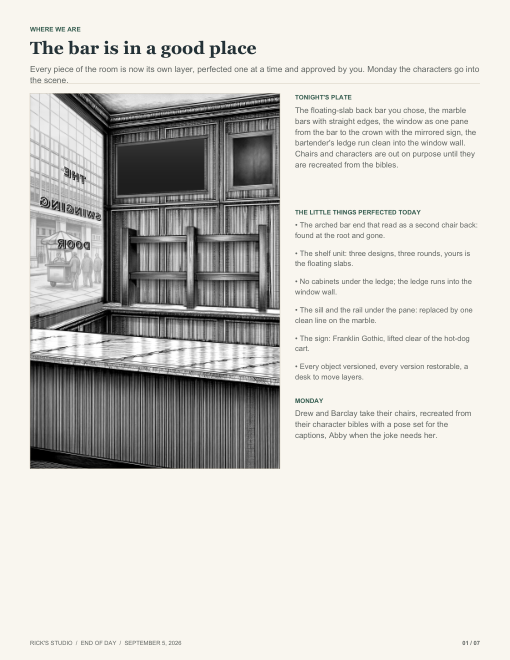

**The ask.** i need an email with it as well

**The thinking.** Written in the voice of the earlier progress emails: plain, first person, what was done and why, the characters on Monday. Not sent - saved for the founder to send with the PDF.

**Settings.** output/email/ricks-studio-end-of-day-email-2026-09-05.txt

**Verdict.** ready to send

*Logged 22:49.*

---

## 204. the cast, round 1 (Opus + Sonnet teammates): the published set Rick accepted, look cards and reference kits for Drew, Barclay and Abby, posed block-ins, and the judging tool

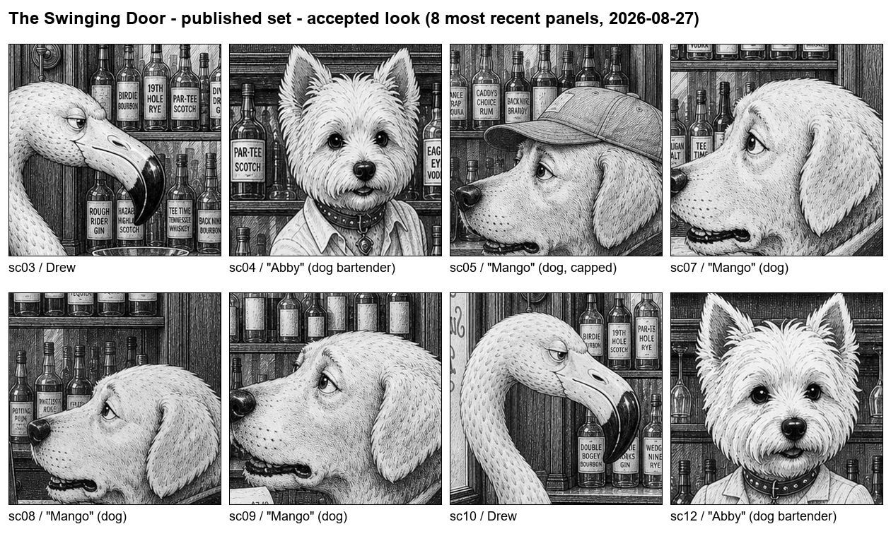

**The ask.** start to work on the 3 characters use opus and sonnet teammates to make sure the characters are huggable have beautiful texture for their species are huggable but professional look at the cartoons set etc understand what i mean

**The thinking.** Six teammates. The published set (eight most recent panels) shows what Rick has accepted: Drew's white stippled plumage and heavy-lidded eye, the retriever in profile with drop ears and worried brows, Abby as a West Highland terrier bartender - and one thing to fix at the source: every caption in that set calls the dog Mango, while the bible names him Barclay. Each character has a look card (what huggable but professional means for him or her in this canon, the stroke language of the species, the three things past renders got wrong), a reference kit cut from the approved plates (bust, head tile, study), the anchor-pose prompt with the bible's block verbatim, and a 14-line judge checklist. The pose block-ins (Drew and Barclay turned to each other, Abby at the ledge, both rests) are drawn in code with their silhouettes cut by the chairs, Drew's crown 20 px clear of the sign's DOOR. A judging tool lays each render beside the bust and head tile with the checklist. Next: Drew's anchor pose rendered with his bust and head as references, judged against the checklist.

**Settings.** workflow cast-recreation-round-1; look cards saved to reports/2026-09-05/CAST-LOOK-CARDS.md; kits in scratchpad/cast/{flamingo,dog,abby}/; poses patch scratchpad/cast/poses/figure-poses.patch; scripts/cast-qc.py

**Verdict.** ready to render

*Logged 23:36.*

---

## 205. cast pose block-ins on the plate: Drew turned to Barclay, Barclay turned to Drew, Abby behind the ledge - the construction drawing the characters are rendered from

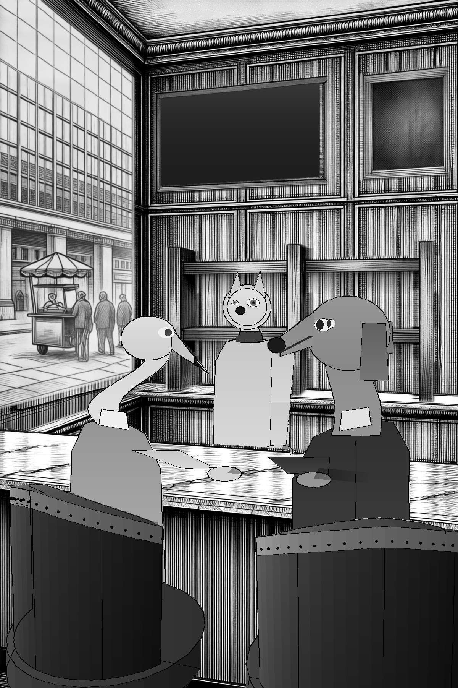

**The ask.** they will all need multiple poses and to be looking at each other for different captions

**The thinking.** The grey figures are the block-ins, not art: torso in the chair, the near hand on the marble, the neck, the head turned per the plan's yaw and pitch, Drew's bill as a slender wedge with a black outer third, Barclay's muzzle and drop ears, Abby's pointed ears and collar. Each pose is its own layer with its own mask and shadow, switched off until approved.

**Settings.** five poses: figure-drew-01-rest, figure-drew-02-toward, figure-barclay-01-rest, figure-barclay-02-toward, figure-abby-01-ledge

**Verdict.** block-ins verified against the sign and the shelf divider

*Logged 23:36.*

---

## 206. figure-drew-02-toward render seed 7 laid in full plate

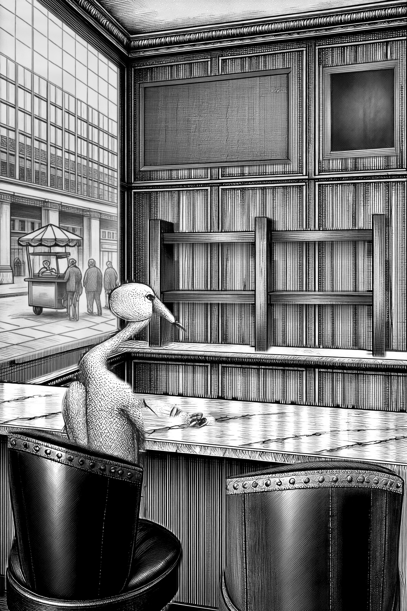

**The thinking.** Rendered in context - the plate as it stands behind this part, with only this part's own silhouette blocked in as values - so the pen, light and perspective are inherited; only the mask is laid back. Part note: DREW-02 TURNED TO BARCLAY, HEAD UP - the anchor pose. Drew SEATED IN THE LEFT-HAND CHAIR AT THE MARBLE COUNTER, SEEN FROM BEHIND AND SLIGHTLY TO HIS RIGHT - body turned 146 degrees from the lens so his right shoulder is toward us and the chair back stands in front of him - HIS HEAD TURNED BACK AND ACROSS TO BARCLAY IN THE RIGHT-HAND CHAIR: head yaw 118 degrees, and THE HEAD IS CARRIED UP, the line from the centre of his eye to the black tip of his bill lying 42 degrees below horizontal. His eye slides sideways at Barclay's face; the bill is CLOSED, a slender even-taper wedge whose BLACK OUTER THIRD IS THE OUTLINE with one bright highlight ribbon inside it. One neck reversal, the head carried forward of where the neck left the body. Near hand on the martini stem, at least three digits closed on it and one crossing in front. Shoulders 1.32 m, crown 1.65 m on a 0.76 m seat. Cropped at the counter: chest-up, no legs, no stools. He never looks at us.

**Settings.** local/sensenova-u1.5, seed 7, full 40 steps cfg 4, negative: text, letters, words, lettering, signage, sign, numbers, typography, writing, inscription, shop name, banner, poster, straight neck, stiff neck, goose, swan, pink, colour, bird dot eyes, blank eyes, bare human skin, wing mitts, tail, display plumes, hat, shoes, second flamingo, duplicate figure, floating, standing, front view, facing the camera, full face, flat fill, photographic

**Prompt.** [prompts/206-figure-drew-02-toward-render-seed-7-laid-in-full-plate.prompt.txt](prompts/206-figure-drew-02-toward-render-seed-7-laid-in-full-plate.prompt.txt)

*Logged 23:45.*

---

## 207. figure-drew-02-toward render seed 21 laid in full plate

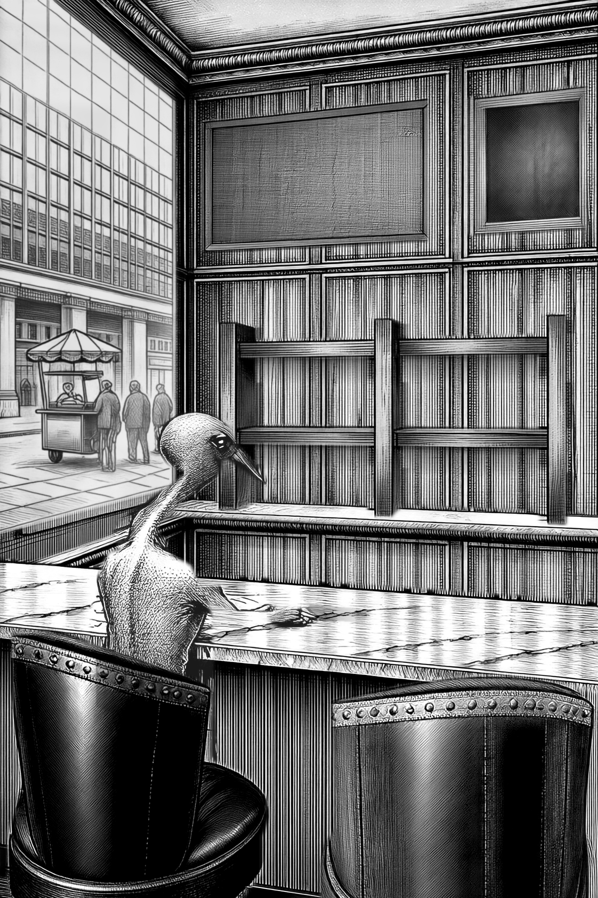

**The thinking.** Rendered in context - the plate as it stands behind this part, with only this part's own silhouette blocked in as values - so the pen, light and perspective are inherited; only the mask is laid back. Part note: DREW-02 TURNED TO BARCLAY, HEAD UP - the anchor pose. Drew SEATED IN THE LEFT-HAND CHAIR AT THE MARBLE COUNTER, SEEN FROM BEHIND AND SLIGHTLY TO HIS RIGHT - body turned 146 degrees from the lens so his right shoulder is toward us and the chair back stands in front of him - HIS HEAD TURNED BACK AND ACROSS TO BARCLAY IN THE RIGHT-HAND CHAIR: head yaw 118 degrees, and THE HEAD IS CARRIED UP, the line from the centre of his eye to the black tip of his bill lying 42 degrees below horizontal. His eye slides sideways at Barclay's face; the bill is CLOSED, a slender even-taper wedge whose BLACK OUTER THIRD IS THE OUTLINE with one bright highlight ribbon inside it. One neck reversal, the head carried forward of where the neck left the body. Near hand on the martini stem, at least three digits closed on it and one crossing in front. Shoulders 1.32 m, crown 1.65 m on a 0.76 m seat. Cropped at the counter: chest-up, no legs, no stools. He never looks at us.

**Settings.** local/sensenova-u1.5, seed 21, full 40 steps cfg 4, negative: text, letters, words, lettering, signage, sign, numbers, typography, writing, inscription, shop name, banner, poster, straight neck, stiff neck, goose, swan, pink, colour, bird dot eyes, blank eyes, bare human skin, wing mitts, tail, display plumes, hat, shoes, second flamingo, duplicate figure, floating, standing, front view, facing the camera, full face, flat fill, photographic

**Prompt.** [prompts/207-figure-drew-02-toward-render-seed-21-laid-in-full-plate.prompt.txt](prompts/207-figure-drew-02-toward-render-seed-21-laid-in-full-plate.prompt.txt)

*Logged 23:46.*

---

## 208. figure-drew-02-toward render seed 7 laid in full plate

**The thinking.** Rendered in context - the plate as it stands behind this part, with only this part's own silhouette blocked in as values - so the pen, light and perspective are inherited; only the mask is laid back. Part note: DREW-02 TURNED TO BARCLAY, HEAD UP - the anchor pose. Drew SEATED IN THE LEFT-HAND CHAIR AT THE MARBLE COUNTER, SEEN FROM BEHIND AND SLIGHTLY TO HIS RIGHT - body turned 146 degrees from the lens so his right shoulder is toward us and the chair back stands in front of him - HIS HEAD TURNED BACK AND ACROSS TO BARCLAY IN THE RIGHT-HAND CHAIR: head yaw 118 degrees, and THE HEAD IS CARRIED UP, the line from the centre of his eye to the black tip of his bill lying 42 degrees below horizontal. His eye slides sideways at Barclay's face; the bill is CLOSED, a slender even-taper wedge whose BLACK OUTER THIRD IS THE OUTLINE with one bright highlight ribbon inside it. One neck reversal, the head carried forward of where the neck left the body. Near hand on the martini stem, at least three digits closed on it and one crossing in front. Shoulders 1.32 m, crown 1.65 m on a 0.76 m seat. Cropped at the counter: chest-up, no legs, no stools. He never looks at us.

**Settings.** local/sensenova-u1.5, seed 7, full 40 steps cfg 4, negative: text, letters, words, lettering, signage, sign, numbers, typography, writing, inscription, shop name, banner, poster, straight neck, stiff neck, goose, swan, pink, colour, bird dot eyes, blank eyes, bare human skin, wing mitts, tail, display plumes, hat, shoes, second flamingo, duplicate figure, floating, standing, front view, facing the camera, full face, flat fill, photographic

**Prompt.** [prompts/208-figure-drew-02-toward-render-seed-7-laid-in-full-plate.prompt.txt](prompts/208-figure-drew-02-toward-render-seed-7-laid-in-full-plate.prompt.txt)

*Logged 23:46.*

---

## 209. figure-drew-02-toward render seed 33 laid in full plate

**The thinking.** Rendered in context - the plate as it stands behind this part, with only this part's own silhouette blocked in as values - so the pen, light and perspective are inherited; only the mask is laid back. Part note: DREW-02 TURNED TO BARCLAY, HEAD UP - the anchor pose. Drew SEATED IN THE LEFT-HAND CHAIR AT THE MARBLE COUNTER, SEEN FROM BEHIND AND SLIGHTLY TO HIS RIGHT - body turned 146 degrees from the lens so his right shoulder is toward us and the chair back stands in front of him - HIS HEAD TURNED BACK AND ACROSS TO BARCLAY IN THE RIGHT-HAND CHAIR: head yaw 118 degrees, and THE HEAD IS CARRIED UP, the line from the centre of his eye to the black tip of his bill lying 42 degrees below horizontal. His eye slides sideways at Barclay's face; the bill is CLOSED, a slender even-taper wedge whose BLACK OUTER THIRD IS THE OUTLINE with one bright highlight ribbon inside it. One neck reversal, the head carried forward of where the neck left the body. Near hand on the martini stem, at least three digits closed on it and one crossing in front. Shoulders 1.32 m, crown 1.65 m on a 0.76 m seat. Cropped at the counter: chest-up, no legs, no stools. He never looks at us.

**Settings.** local/sensenova-u1.5, seed 33, full 40 steps cfg 4, negative: text, letters, words, lettering, signage, sign, numbers, typography, writing, inscription, shop name, banner, poster, straight neck, stiff neck, goose, swan, pink, colour, bird dot eyes, blank eyes, bare human skin, wing mitts, tail, display plumes, hat, shoes, second flamingo, duplicate figure, floating, standing, front view, facing the camera, full face, flat fill, photographic

**Prompt.** [prompts/209-figure-drew-02-toward-render-seed-33-laid-in-full-plate.prompt.txt](prompts/209-figure-drew-02-toward-render-seed-33-laid-in-full-plate.prompt.txt)

*Logged 23:47.*

---

## 210. figure-drew-02-toward render seed 21 laid in full plate

**The thinking.** Rendered in context - the plate as it stands behind this part, with only this part's own silhouette blocked in as values - so the pen, light and perspective are inherited; only the mask is laid back. Part note: DREW-02 TURNED TO BARCLAY, HEAD UP - the anchor pose. Drew SEATED IN THE LEFT-HAND CHAIR AT THE MARBLE COUNTER, SEEN FROM BEHIND AND SLIGHTLY TO HIS RIGHT - body turned 146 degrees from the lens so his right shoulder is toward us and the chair back stands in front of him - HIS HEAD TURNED BACK AND ACROSS TO BARCLAY IN THE RIGHT-HAND CHAIR: head yaw 118 degrees, and THE HEAD IS CARRIED UP, the line from the centre of his eye to the black tip of his bill lying 42 degrees below horizontal. His eye slides sideways at Barclay's face; the bill is CLOSED, a slender even-taper wedge whose BLACK OUTER THIRD IS THE OUTLINE with one bright highlight ribbon inside it. One neck reversal, the head carried forward of where the neck left the body. Near hand on the martini stem, at least three digits closed on it and one crossing in front. Shoulders 1.32 m, crown 1.65 m on a 0.76 m seat. Cropped at the counter: chest-up, no legs, no stools. He never looks at us.

**Settings.** local/sensenova-u1.5, seed 21, full 40 steps cfg 4, negative: text, letters, words, lettering, signage, sign, numbers, typography, writing, inscription, shop name, banner, poster, straight neck, stiff neck, goose, swan, pink, colour, bird dot eyes, blank eyes, bare human skin, wing mitts, tail, display plumes, hat, shoes, second flamingo, duplicate figure, floating, standing, front view, facing the camera, full face, flat fill, photographic

**Prompt.** [prompts/210-figure-drew-02-toward-render-seed-21-laid-in-full-plate.prompt.txt](prompts/210-figure-drew-02-toward-render-seed-21-laid-in-full-plate.prompt.txt)

*Logged 23:47.*

---

## 211. figure-drew-02-toward render seed 44 laid in full plate

**The thinking.** Rendered in context - the plate as it stands behind this part, with only this part's own silhouette blocked in as values - so the pen, light and perspective are inherited; only the mask is laid back. Part note: DREW-02 TURNED TO BARCLAY, HEAD UP - the anchor pose. Drew SEATED IN THE LEFT-HAND CHAIR AT THE MARBLE COUNTER, SEEN FROM BEHIND AND SLIGHTLY TO HIS RIGHT - body turned 146 degrees from the lens so his right shoulder is toward us and the chair back stands in front of him - HIS HEAD TURNED BACK AND ACROSS TO BARCLAY IN THE RIGHT-HAND CHAIR: head yaw 118 degrees, and THE HEAD IS CARRIED UP, the line from the centre of his eye to the black tip of his bill lying 42 degrees below horizontal. His eye slides sideways at Barclay's face; the bill is CLOSED, a slender even-taper wedge whose BLACK OUTER THIRD IS THE OUTLINE with one bright highlight ribbon inside it. One neck reversal, the head carried forward of where the neck left the body. Near hand on the martini stem, at least three digits closed on it and one crossing in front. Shoulders 1.32 m, crown 1.65 m on a 0.76 m seat. Cropped at the counter: chest-up, no legs, no stools. He never looks at us.

**Settings.** local/sensenova-u1.5, seed 44, full 40 steps cfg 4, negative: text, letters, words, lettering, signage, sign, numbers, typography, writing, inscription, shop name, banner, poster, straight neck, stiff neck, goose, swan, pink, colour, bird dot eyes, blank eyes, bare human skin, wing mitts, tail, display plumes, hat, shoes, second flamingo, duplicate figure, floating, standing, front view, facing the camera, full face, flat fill, photographic

**Prompt.** [prompts/211-figure-drew-02-toward-render-seed-44-laid-in-full-plate.prompt.txt](prompts/211-figure-drew-02-toward-render-seed-44-laid-in-full-plate.prompt.txt)

*Logged 23:47.*

---

## 212. figure-drew-02-toward render seed 33 laid in full plate

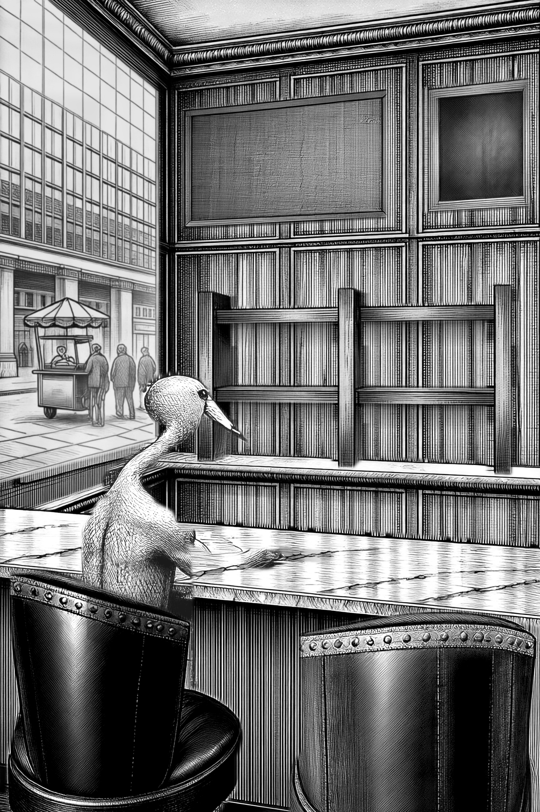

**The thinking.** Rendered in context - the plate as it stands behind this part, with only this part's own silhouette blocked in as values - so the pen, light and perspective are inherited; only the mask is laid back. Part note: DREW-02 TURNED TO BARCLAY, HEAD UP - the anchor pose. Drew SEATED IN THE LEFT-HAND CHAIR AT THE MARBLE COUNTER, SEEN FROM BEHIND AND SLIGHTLY TO HIS RIGHT - body turned 146 degrees from the lens so his right shoulder is toward us and the chair back stands in front of him - HIS HEAD TURNED BACK AND ACROSS TO BARCLAY IN THE RIGHT-HAND CHAIR: head yaw 118 degrees, and THE HEAD IS CARRIED UP, the line from the centre of his eye to the black tip of his bill lying 42 degrees below horizontal. His eye slides sideways at Barclay's face; the bill is CLOSED, a slender even-taper wedge whose BLACK OUTER THIRD IS THE OUTLINE with one bright highlight ribbon inside it. One neck reversal, the head carried forward of where the neck left the body. Near hand on the martini stem, at least three digits closed on it and one crossing in front. Shoulders 1.32 m, crown 1.65 m on a 0.76 m seat. Cropped at the counter: chest-up, no legs, no stools. He never looks at us.

**Settings.** local/sensenova-u1.5, seed 33, full 40 steps cfg 4, negative: text, letters, words, lettering, signage, sign, numbers, typography, writing, inscription, shop name, banner, poster, straight neck, stiff neck, goose, swan, pink, colour, bird dot eyes, blank eyes, bare human skin, wing mitts, tail, display plumes, hat, shoes, second flamingo, duplicate figure, floating, standing, front view, facing the camera, full face, flat fill, photographic

**Prompt.** [prompts/212-figure-drew-02-toward-render-seed-33-laid-in-full-plate.prompt.txt](prompts/212-figure-drew-02-toward-render-seed-33-laid-in-full-plate.prompt.txt)

*Logged 23:48.*

---

## 213. figure-drew-02-toward render seed 44 laid in full plate

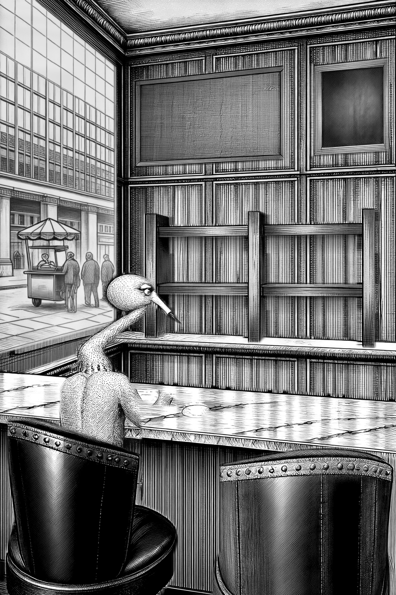

**The thinking.** Rendered in context - the plate as it stands behind this part, with only this part's own silhouette blocked in as values - so the pen, light and perspective are inherited; only the mask is laid back. Part note: DREW-02 TURNED TO BARCLAY, HEAD UP - the anchor pose. Drew SEATED IN THE LEFT-HAND CHAIR AT THE MARBLE COUNTER, SEEN FROM BEHIND AND SLIGHTLY TO HIS RIGHT - body turned 146 degrees from the lens so his right shoulder is toward us and the chair back stands in front of him - HIS HEAD TURNED BACK AND ACROSS TO BARCLAY IN THE RIGHT-HAND CHAIR: head yaw 118 degrees, and THE HEAD IS CARRIED UP, the line from the centre of his eye to the black tip of his bill lying 42 degrees below horizontal. His eye slides sideways at Barclay's face; the bill is CLOSED, a slender even-taper wedge whose BLACK OUTER THIRD IS THE OUTLINE with one bright highlight ribbon inside it. One neck reversal, the head carried forward of where the neck left the body. Near hand on the martini stem, at least three digits closed on it and one crossing in front. Shoulders 1.32 m, crown 1.65 m on a 0.76 m seat. Cropped at the counter: chest-up, no legs, no stools. He never looks at us.

**Settings.** local/sensenova-u1.5, seed 44, full 40 steps cfg 4, negative: text, letters, words, lettering, signage, sign, numbers, typography, writing, inscription, shop name, banner, poster, straight neck, stiff neck, goose, swan, pink, colour, bird dot eyes, blank eyes, bare human skin, wing mitts, tail, display plumes, hat, shoes, second flamingo, duplicate figure, floating, standing, front view, facing the camera, full face, flat fill, photographic

**Prompt.** [prompts/213-figure-drew-02-toward-render-seed-44-laid-in-full-plate.prompt.txt](prompts/213-figure-drew-02-toward-render-seed-44-laid-in-full-plate.prompt.txt)

*Logged 23:48.*

---

## 214. Drew, anchor pose, round 1: four seeds with his bust and head as references - undressed on every seed, no seed with the bible's bill; the neck reads on 7 and 33

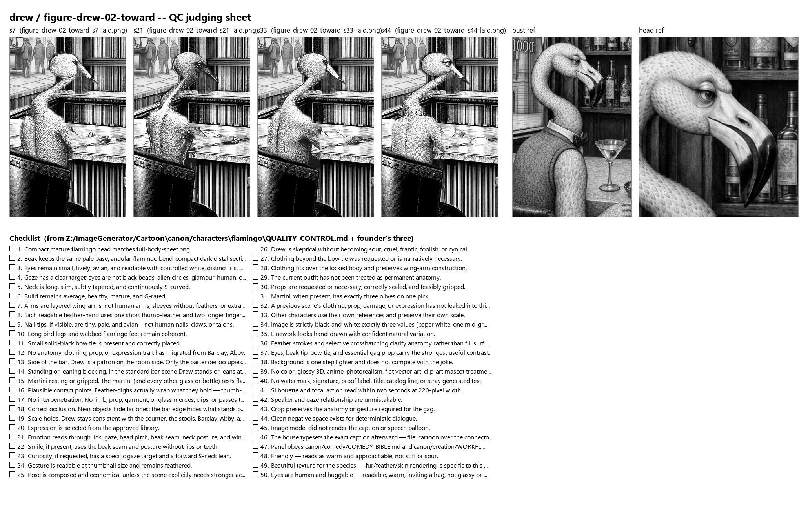

**The ask.** make sure the characters are huggable have beautiful texture for their species are huggable but professional

**The thinking.** First reference-guided renders of the new pose part, judged on the tool's sheet beside the bust and head tile. The plumage texture is right and the neck curves on two seeds, but every seed dropped the sweater vest, collar and bow tie into plain plumage - the look card's known failure number two - because the block-in's vest tone sat too close to the plumage; and the bill never took the black outer third. Round two: the vest goes to a garment tone in the block-in, the negatives forbid a bare bird, and the wardrobe sheet joins as a third reference. The bill will likely need the plan's head route: a separate head render and a code-side transplant.

**Settings.** figure-drew-02-toward, seeds 7/21/33/44, refs bust+head, prompt line from the bible, 40 steps

**Verdict.** all four rejected - round two running

*Logged 23:55.*

---

