# The Swinging Door - studio report, 2026-09-06

Built for Rick. Every image the studio generated today, in the order it happened, with the ask that drove it, the thinking behind the decision, the exact prompt and settings, and the verdict. Images are in `images/`, prompts in `prompts/`.

## 001. figure-drew-02-toward render seed 7 laid in full plate

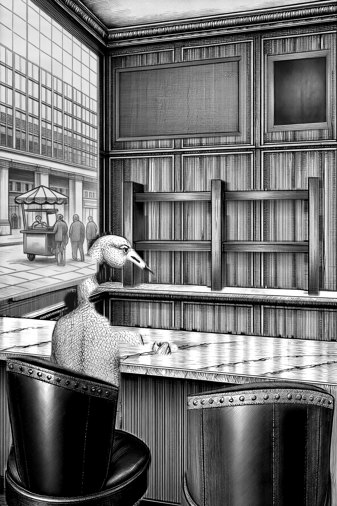

**The thinking.** Rendered in context - the plate as it stands behind this part, with only this part's own silhouette blocked in as values - so the pen, light and perspective are inherited; only the mask is laid back. Part note: DREW-02 TURNED TO BARCLAY, HEAD UP - the anchor pose. Drew SEATED IN THE LEFT-HAND CHAIR AT THE MARBLE COUNTER, SEEN FROM BEHIND AND SLIGHTLY TO HIS RIGHT - body turned 146 degrees from the lens so his right shoulder is toward us and the chair back stands in front of him - HIS HEAD TURNED BACK AND ACROSS TO BARCLAY IN THE RIGHT-HAND CHAIR: head yaw 118 degrees, and THE HEAD IS CARRIED UP, the line from the centre of his eye to the black tip of his bill lying 42 degrees below horizontal. His eye slides sideways at Barclay's face; the bill is CLOSED, a slender even-taper wedge whose BLACK OUTER THIRD IS THE OUTLINE with one bright highlight ribbon inside it. One neck reversal, the head carried forward of where the neck left the body. Near hand on the martini stem, at least three digits closed on it and one crossing in front. Shoulders 1.32 m, crown 1.65 m on a 0.76 m seat. Cropped at the counter: chest-up, no legs, no stools. He never looks at us.

**Settings.** local/sensenova-u1.5, seed 7, full 40 steps cfg 4, negative: text, letters, words, lettering, signage, sign, numbers, typography, writing, inscription, shop name, banner, poster, bare bird, unclothed, naked, no clothes, plain plumage over the whole torso, feathered torso without a vest, straight neck, stiff neck, goose, swan, pink, colour, bird dot eyes, blank eyes, bare human skin, wing mitts, tail, display plumes, hat, shoes, second flamingo, duplicate figure, floating, standing, front view, facing the camera, full face, flat fill, photographic

**Prompt.** [prompts/001-figure-drew-02-toward-render-seed-7-laid-in-full-plate.prompt.txt](prompts/001-figure-drew-02-toward-render-seed-7-laid-in-full-plate.prompt.txt)

*Logged 00:03.*

---

## 002. figure-drew-02-toward render seed 21 laid in full plate

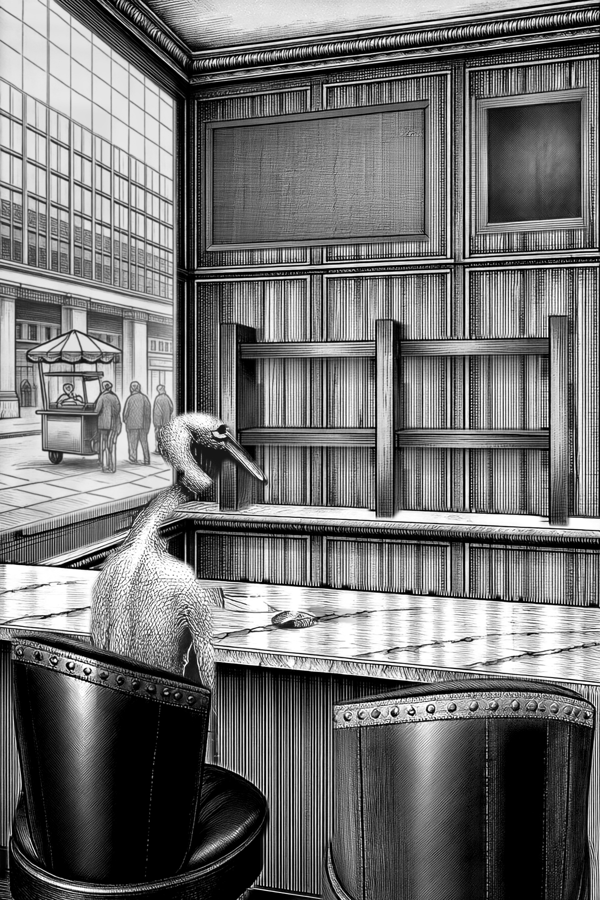

**The thinking.** Rendered in context - the plate as it stands behind this part, with only this part's own silhouette blocked in as values - so the pen, light and perspective are inherited; only the mask is laid back. Part note: DREW-02 TURNED TO BARCLAY, HEAD UP - the anchor pose. Drew SEATED IN THE LEFT-HAND CHAIR AT THE MARBLE COUNTER, SEEN FROM BEHIND AND SLIGHTLY TO HIS RIGHT - body turned 146 degrees from the lens so his right shoulder is toward us and the chair back stands in front of him - HIS HEAD TURNED BACK AND ACROSS TO BARCLAY IN THE RIGHT-HAND CHAIR: head yaw 118 degrees, and THE HEAD IS CARRIED UP, the line from the centre of his eye to the black tip of his bill lying 42 degrees below horizontal. His eye slides sideways at Barclay's face; the bill is CLOSED, a slender even-taper wedge whose BLACK OUTER THIRD IS THE OUTLINE with one bright highlight ribbon inside it. One neck reversal, the head carried forward of where the neck left the body. Near hand on the martini stem, at least three digits closed on it and one crossing in front. Shoulders 1.32 m, crown 1.65 m on a 0.76 m seat. Cropped at the counter: chest-up, no legs, no stools. He never looks at us.

**Settings.** local/sensenova-u1.5, seed 21, full 40 steps cfg 4, negative: text, letters, words, lettering, signage, sign, numbers, typography, writing, inscription, shop name, banner, poster, bare bird, unclothed, naked, no clothes, plain plumage over the whole torso, feathered torso without a vest, straight neck, stiff neck, goose, swan, pink, colour, bird dot eyes, blank eyes, bare human skin, wing mitts, tail, display plumes, hat, shoes, second flamingo, duplicate figure, floating, standing, front view, facing the camera, full face, flat fill, photographic

**Prompt.** [prompts/002-figure-drew-02-toward-render-seed-21-laid-in-full-plate.prompt.txt](prompts/002-figure-drew-02-toward-render-seed-21-laid-in-full-plate.prompt.txt)

*Logged 00:03.*

---

## 003. figure-drew-02-toward render seed 33 laid in full plate

**The thinking.** Rendered in context - the plate as it stands behind this part, with only this part's own silhouette blocked in as values - so the pen, light and perspective are inherited; only the mask is laid back. Part note: DREW-02 TURNED TO BARCLAY, HEAD UP - the anchor pose. Drew SEATED IN THE LEFT-HAND CHAIR AT THE MARBLE COUNTER, SEEN FROM BEHIND AND SLIGHTLY TO HIS RIGHT - body turned 146 degrees from the lens so his right shoulder is toward us and the chair back stands in front of him - HIS HEAD TURNED BACK AND ACROSS TO BARCLAY IN THE RIGHT-HAND CHAIR: head yaw 118 degrees, and THE HEAD IS CARRIED UP, the line from the centre of his eye to the black tip of his bill lying 42 degrees below horizontal. His eye slides sideways at Barclay's face; the bill is CLOSED, a slender even-taper wedge whose BLACK OUTER THIRD IS THE OUTLINE with one bright highlight ribbon inside it. One neck reversal, the head carried forward of where the neck left the body. Near hand on the martini stem, at least three digits closed on it and one crossing in front. Shoulders 1.32 m, crown 1.65 m on a 0.76 m seat. Cropped at the counter: chest-up, no legs, no stools. He never looks at us.

**Settings.** local/sensenova-u1.5, seed 33, full 40 steps cfg 4, negative: text, letters, words, lettering, signage, sign, numbers, typography, writing, inscription, shop name, banner, poster, bare bird, unclothed, naked, no clothes, plain plumage over the whole torso, feathered torso without a vest, straight neck, stiff neck, goose, swan, pink, colour, bird dot eyes, blank eyes, bare human skin, wing mitts, tail, display plumes, hat, shoes, second flamingo, duplicate figure, floating, standing, front view, facing the camera, full face, flat fill, photographic

**Prompt.** [prompts/003-figure-drew-02-toward-render-seed-33-laid-in-full-plate.prompt.txt](prompts/003-figure-drew-02-toward-render-seed-33-laid-in-full-plate.prompt.txt)

*Logged 00:04.*

---

## 004. figure-drew-02-toward render seed 44 laid in full plate

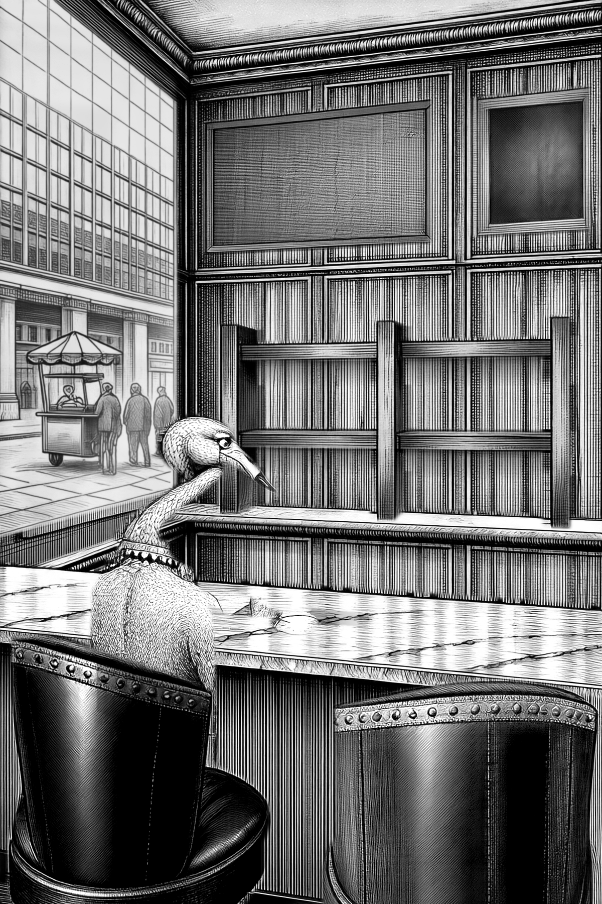

**The thinking.** Rendered in context - the plate as it stands behind this part, with only this part's own silhouette blocked in as values - so the pen, light and perspective are inherited; only the mask is laid back. Part note: DREW-02 TURNED TO BARCLAY, HEAD UP - the anchor pose. Drew SEATED IN THE LEFT-HAND CHAIR AT THE MARBLE COUNTER, SEEN FROM BEHIND AND SLIGHTLY TO HIS RIGHT - body turned 146 degrees from the lens so his right shoulder is toward us and the chair back stands in front of him - HIS HEAD TURNED BACK AND ACROSS TO BARCLAY IN THE RIGHT-HAND CHAIR: head yaw 118 degrees, and THE HEAD IS CARRIED UP, the line from the centre of his eye to the black tip of his bill lying 42 degrees below horizontal. His eye slides sideways at Barclay's face; the bill is CLOSED, a slender even-taper wedge whose BLACK OUTER THIRD IS THE OUTLINE with one bright highlight ribbon inside it. One neck reversal, the head carried forward of where the neck left the body. Near hand on the martini stem, at least three digits closed on it and one crossing in front. Shoulders 1.32 m, crown 1.65 m on a 0.76 m seat. Cropped at the counter: chest-up, no legs, no stools. He never looks at us.

**Settings.** local/sensenova-u1.5, seed 44, full 40 steps cfg 4, negative: text, letters, words, lettering, signage, sign, numbers, typography, writing, inscription, shop name, banner, poster, bare bird, unclothed, naked, no clothes, plain plumage over the whole torso, feathered torso without a vest, straight neck, stiff neck, goose, swan, pink, colour, bird dot eyes, blank eyes, bare human skin, wing mitts, tail, display plumes, hat, shoes, second flamingo, duplicate figure, floating, standing, front view, facing the camera, full face, flat fill, photographic

**Prompt.** [prompts/004-figure-drew-02-toward-render-seed-44-laid-in-full-plate.prompt.txt](prompts/004-figure-drew-02-toward-render-seed-44-laid-in-full-plate.prompt.txt)

*Logged 00:04.*

---

## 005. Drew, anchor pose, round 2: garment-tone vest, bare-bird negatives, wardrobe sheet as a third reference - still undressed on all four seeds

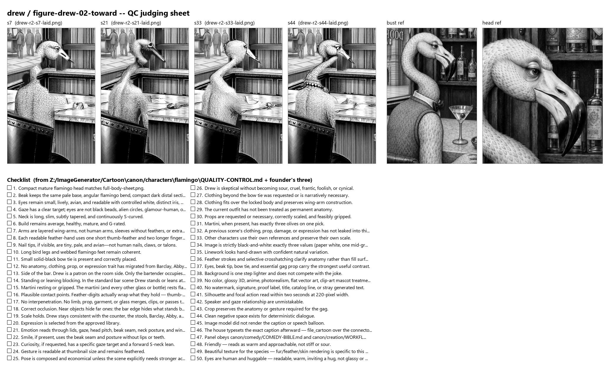

**The ask.** make sure the characters are huggable have beautiful texture for their species

**The thinking.** A darker vest tone in the block-in and a wardrobe sheet as a reference did not hold the garment: from behind, a mid tone on a bird's back is plumage to the model. The neck and the plumage strokes are right on seeds 7 and 33. The fix follows the room's own lesson - texture is drawn, not asked for: the vest carries a knit lattice and ribbed armhole bands in the block-in, and the from-behind staging study the founder scored highest (canon/vision/studies/duo-behind.png: Drew in his vest and collar over his shoulder, Barclay beside him) becomes the primary reference.

**Settings.** figure-drew-02-toward, seeds 7/21/33/44, refs bust+head+wardrobe-sheet, vest 104-128

**Verdict.** rejected - round three with a drawn knit and the duo-behind study

*Logged 00:09.*

---

## 006. figure-drew-02-toward render seed 7 laid in full plate

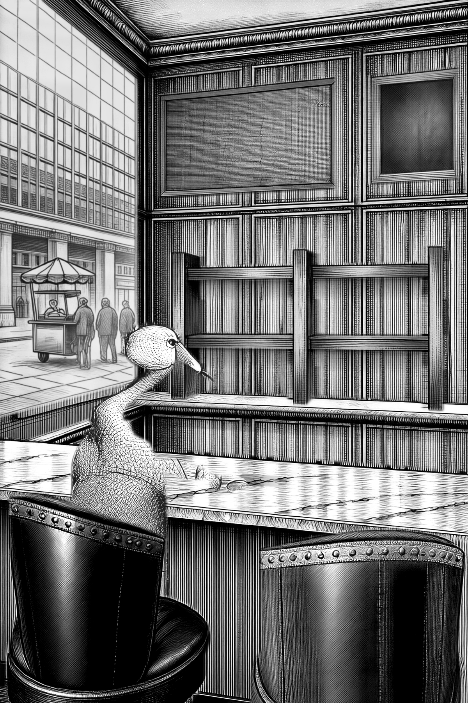

**The thinking.** Rendered in context - the plate as it stands behind this part, with only this part's own silhouette blocked in as values - so the pen, light and perspective are inherited; only the mask is laid back. Part note: DREW-02 TURNED TO BARCLAY, HEAD UP - the anchor pose. Drew SEATED IN THE LEFT-HAND CHAIR AT THE MARBLE COUNTER, SEEN FROM BEHIND AND SLIGHTLY TO HIS RIGHT - body turned 146 degrees from the lens so his right shoulder is toward us and the chair back stands in front of him - HIS HEAD TURNED BACK AND ACROSS TO BARCLAY IN THE RIGHT-HAND CHAIR: head yaw 118 degrees, and THE HEAD IS CARRIED UP, the line from the centre of his eye to the black tip of his bill lying 42 degrees below horizontal. His eye slides sideways at Barclay's face; the bill is CLOSED, a slender even-taper wedge whose BLACK OUTER THIRD IS THE OUTLINE with one bright highlight ribbon inside it. One neck reversal, the head carried forward of where the neck left the body. Near hand on the martini stem, at least three digits closed on it and one crossing in front. Shoulders 1.32 m, crown 1.65 m on a 0.76 m seat. Cropped at the counter: chest-up, no legs, no stools. He never looks at us.

**Settings.** local/sensenova-u1.5, seed 7, full 40 steps cfg 4, negative: text, letters, words, lettering, signage, sign, numbers, typography, writing, inscription, shop name, banner, poster, bare bird, unclothed, naked, no clothes, plain plumage over the whole torso, feathered torso without a vest, straight neck, stiff neck, goose, swan, pink, colour, bird dot eyes, blank eyes, bare human skin, wing mitts, tail, display plumes, hat, shoes, second flamingo, duplicate figure, floating, standing, front view, facing the camera, full face, flat fill, photographic

**Prompt.** [prompts/006-figure-drew-02-toward-render-seed-7-laid-in-full-plate.prompt.txt](prompts/006-figure-drew-02-toward-render-seed-7-laid-in-full-plate.prompt.txt)

*Logged 00:17.*

---

## 007. figure-drew-02-toward render seed 21 laid in full plate

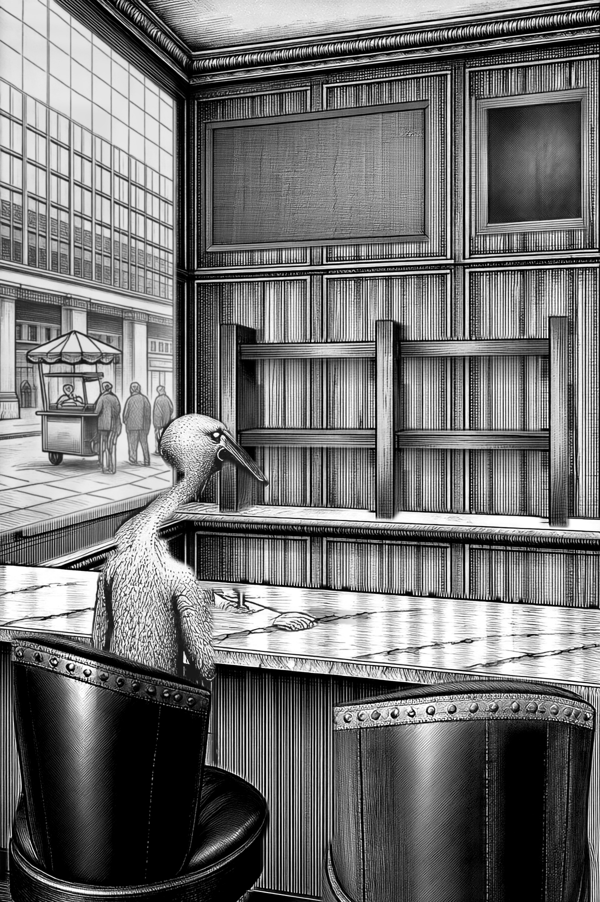

**The thinking.** Rendered in context - the plate as it stands behind this part, with only this part's own silhouette blocked in as values - so the pen, light and perspective are inherited; only the mask is laid back. Part note: DREW-02 TURNED TO BARCLAY, HEAD UP - the anchor pose. Drew SEATED IN THE LEFT-HAND CHAIR AT THE MARBLE COUNTER, SEEN FROM BEHIND AND SLIGHTLY TO HIS RIGHT - body turned 146 degrees from the lens so his right shoulder is toward us and the chair back stands in front of him - HIS HEAD TURNED BACK AND ACROSS TO BARCLAY IN THE RIGHT-HAND CHAIR: head yaw 118 degrees, and THE HEAD IS CARRIED UP, the line from the centre of his eye to the black tip of his bill lying 42 degrees below horizontal. His eye slides sideways at Barclay's face; the bill is CLOSED, a slender even-taper wedge whose BLACK OUTER THIRD IS THE OUTLINE with one bright highlight ribbon inside it. One neck reversal, the head carried forward of where the neck left the body. Near hand on the martini stem, at least three digits closed on it and one crossing in front. Shoulders 1.32 m, crown 1.65 m on a 0.76 m seat. Cropped at the counter: chest-up, no legs, no stools. He never looks at us.

**Settings.** local/sensenova-u1.5, seed 21, full 40 steps cfg 4, negative: text, letters, words, lettering, signage, sign, numbers, typography, writing, inscription, shop name, banner, poster, bare bird, unclothed, naked, no clothes, plain plumage over the whole torso, feathered torso without a vest, straight neck, stiff neck, goose, swan, pink, colour, bird dot eyes, blank eyes, bare human skin, wing mitts, tail, display plumes, hat, shoes, second flamingo, duplicate figure, floating, standing, front view, facing the camera, full face, flat fill, photographic

**Prompt.** [prompts/007-figure-drew-02-toward-render-seed-21-laid-in-full-plate.prompt.txt](prompts/007-figure-drew-02-toward-render-seed-21-laid-in-full-plate.prompt.txt)

*Logged 00:17.*

---

## 008. figure-drew-02-toward render seed 33 laid in full plate

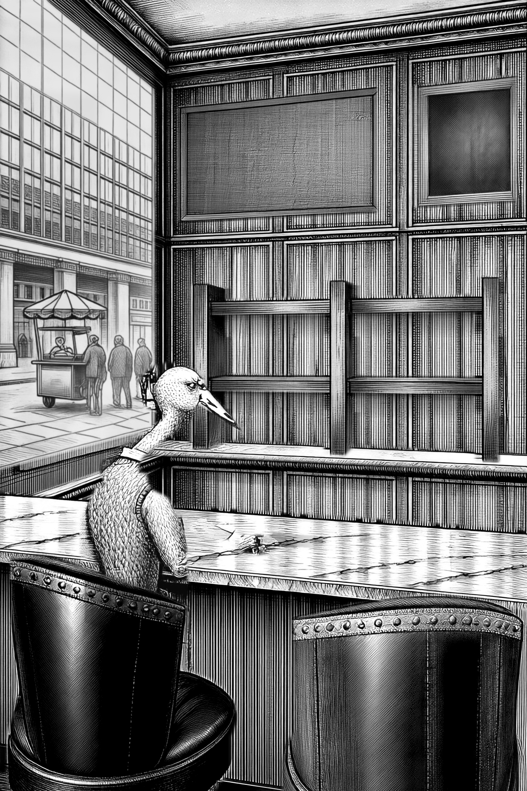

**The thinking.** Rendered in context - the plate as it stands behind this part, with only this part's own silhouette blocked in as values - so the pen, light and perspective are inherited; only the mask is laid back. Part note: DREW-02 TURNED TO BARCLAY, HEAD UP - the anchor pose. Drew SEATED IN THE LEFT-HAND CHAIR AT THE MARBLE COUNTER, SEEN FROM BEHIND AND SLIGHTLY TO HIS RIGHT - body turned 146 degrees from the lens so his right shoulder is toward us and the chair back stands in front of him - HIS HEAD TURNED BACK AND ACROSS TO BARCLAY IN THE RIGHT-HAND CHAIR: head yaw 118 degrees, and THE HEAD IS CARRIED UP, the line from the centre of his eye to the black tip of his bill lying 42 degrees below horizontal. His eye slides sideways at Barclay's face; the bill is CLOSED, a slender even-taper wedge whose BLACK OUTER THIRD IS THE OUTLINE with one bright highlight ribbon inside it. One neck reversal, the head carried forward of where the neck left the body. Near hand on the martini stem, at least three digits closed on it and one crossing in front. Shoulders 1.32 m, crown 1.65 m on a 0.76 m seat. Cropped at the counter: chest-up, no legs, no stools. He never looks at us.

**Settings.** local/sensenova-u1.5, seed 33, full 40 steps cfg 4, negative: text, letters, words, lettering, signage, sign, numbers, typography, writing, inscription, shop name, banner, poster, bare bird, unclothed, naked, no clothes, plain plumage over the whole torso, feathered torso without a vest, straight neck, stiff neck, goose, swan, pink, colour, bird dot eyes, blank eyes, bare human skin, wing mitts, tail, display plumes, hat, shoes, second flamingo, duplicate figure, floating, standing, front view, facing the camera, full face, flat fill, photographic

**Prompt.** [prompts/008-figure-drew-02-toward-render-seed-33-laid-in-full-plate.prompt.txt](prompts/008-figure-drew-02-toward-render-seed-33-laid-in-full-plate.prompt.txt)

*Logged 00:18.*

---

## 009. figure-drew-02-toward render seed 44 laid in full plate

**The thinking.** Rendered in context - the plate as it stands behind this part, with only this part's own silhouette blocked in as values - so the pen, light and perspective are inherited; only the mask is laid back. Part note: DREW-02 TURNED TO BARCLAY, HEAD UP - the anchor pose. Drew SEATED IN THE LEFT-HAND CHAIR AT THE MARBLE COUNTER, SEEN FROM BEHIND AND SLIGHTLY TO HIS RIGHT - body turned 146 degrees from the lens so his right shoulder is toward us and the chair back stands in front of him - HIS HEAD TURNED BACK AND ACROSS TO BARCLAY IN THE RIGHT-HAND CHAIR: head yaw 118 degrees, and THE HEAD IS CARRIED UP, the line from the centre of his eye to the black tip of his bill lying 42 degrees below horizontal. His eye slides sideways at Barclay's face; the bill is CLOSED, a slender even-taper wedge whose BLACK OUTER THIRD IS THE OUTLINE with one bright highlight ribbon inside it. One neck reversal, the head carried forward of where the neck left the body. Near hand on the martini stem, at least three digits closed on it and one crossing in front. Shoulders 1.32 m, crown 1.65 m on a 0.76 m seat. Cropped at the counter: chest-up, no legs, no stools. He never looks at us.

**Settings.** local/sensenova-u1.5, seed 44, full 40 steps cfg 4, negative: text, letters, words, lettering, signage, sign, numbers, typography, writing, inscription, shop name, banner, poster, bare bird, unclothed, naked, no clothes, plain plumage over the whole torso, feathered torso without a vest, straight neck, stiff neck, goose, swan, pink, colour, bird dot eyes, blank eyes, bare human skin, wing mitts, tail, display plumes, hat, shoes, second flamingo, duplicate figure, floating, standing, front view, facing the camera, full face, flat fill, photographic

**Prompt.** [prompts/009-figure-drew-02-toward-render-seed-44-laid-in-full-plate.prompt.txt](prompts/009-figure-drew-02-toward-render-seed-44-laid-in-full-plate.prompt.txt)

*Logged 00:18.*

---

## 010. Drew, anchor pose, round 3: knit lattice drawn into the vest, the from-behind study as reference - still a bare bird; the lattice came back as scales

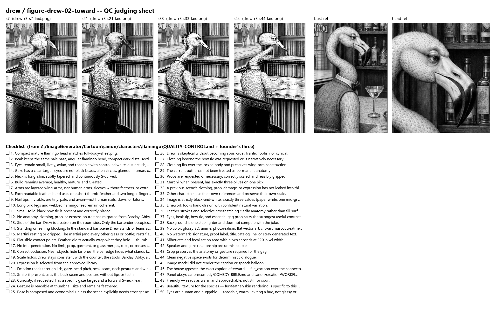

**The ask.** make sure the characters are huggable have beautiful texture for their species

**The thinking.** Twelve renders over three rounds say the whole-frame route cannot hold Drew's clothing from behind: he is a quarter of the frame, a bow tie is a few pixels, and the prompt only ever described Picture 1, so the reference pictures were treated as style. Two changes for round four, both in the assembler: the prompt now names the reference pictures as the character's own art to copy (identity, texture and clothing), and a figure renders from a 2:3 crop of the frame at the model's full resolution - four times the pixels on him - then scales back into place for laying.

**Settings.** figure-drew-02-toward seeds 7/21/33/44; refs bust+head+duo-behind; vest lattice 9 px at 62 with ribbed armholes

**Verdict.** rejected - round four as a detail render

*Logged 00:23.*

---

## 011. figure-drew-02-toward render seed 7 laid in full plate

**The thinking.** Rendered in context - the plate as it stands behind this part, with only this part's own silhouette blocked in as values - so the pen, light and perspective are inherited; only the mask is laid back. Part note: DREW-02 TURNED TO BARCLAY, HEAD UP - the anchor pose. Drew SEATED IN THE LEFT-HAND CHAIR AT THE MARBLE COUNTER, SEEN FROM BEHIND AND SLIGHTLY TO HIS RIGHT - body turned 146 degrees from the lens so his right shoulder is toward us and the chair back stands in front of him - HIS HEAD TURNED BACK AND ACROSS TO BARCLAY IN THE RIGHT-HAND CHAIR: head yaw 118 degrees, and THE HEAD IS CARRIED UP, the line from the centre of his eye to the black tip of his bill lying 42 degrees below horizontal. His eye slides sideways at Barclay's face; the bill is CLOSED, a slender even-taper wedge whose BLACK OUTER THIRD IS THE OUTLINE with one bright highlight ribbon inside it. One neck reversal, the head carried forward of where the neck left the body. Near hand on the martini stem, at least three digits closed on it and one crossing in front. Shoulders 1.32 m, crown 1.65 m on a 0.76 m seat. Cropped at the counter: chest-up, no legs, no stools. He never looks at us.

**Settings.** local/sensenova-u1.5, seed 7, full 40 steps cfg 4, negative: text, letters, words, lettering, signage, sign, numbers, typography, writing, inscription, shop name, banner, poster, bare bird, unclothed, naked, no clothes, plain plumage over the whole torso, feathered torso without a vest, straight neck, stiff neck, goose, swan, pink, colour, bird dot eyes, blank eyes, bare human skin, wing mitts, tail, display plumes, hat, shoes, second flamingo, duplicate figure, floating, standing, front view, facing the camera, full face, flat fill, photographic

**Prompt.** [prompts/011-figure-drew-02-toward-render-seed-7-laid-in-full-plate.prompt.txt](prompts/011-figure-drew-02-toward-render-seed-7-laid-in-full-plate.prompt.txt)

*Logged 00:35.*

---

## 012. figure-drew-02-toward render seed 21 laid in full plate

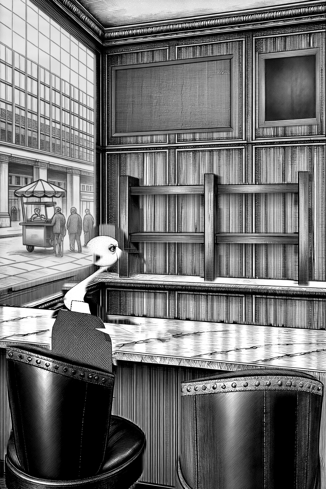

**The thinking.** Rendered in context - the plate as it stands behind this part, with only this part's own silhouette blocked in as values - so the pen, light and perspective are inherited; only the mask is laid back. Part note: DREW-02 TURNED TO BARCLAY, HEAD UP - the anchor pose. Drew SEATED IN THE LEFT-HAND CHAIR AT THE MARBLE COUNTER, SEEN FROM BEHIND AND SLIGHTLY TO HIS RIGHT - body turned 146 degrees from the lens so his right shoulder is toward us and the chair back stands in front of him - HIS HEAD TURNED BACK AND ACROSS TO BARCLAY IN THE RIGHT-HAND CHAIR: head yaw 118 degrees, and THE HEAD IS CARRIED UP, the line from the centre of his eye to the black tip of his bill lying 42 degrees below horizontal. His eye slides sideways at Barclay's face; the bill is CLOSED, a slender even-taper wedge whose BLACK OUTER THIRD IS THE OUTLINE with one bright highlight ribbon inside it. One neck reversal, the head carried forward of where the neck left the body. Near hand on the martini stem, at least three digits closed on it and one crossing in front. Shoulders 1.32 m, crown 1.65 m on a 0.76 m seat. Cropped at the counter: chest-up, no legs, no stools. He never looks at us.

**Settings.** local/sensenova-u1.5, seed 21, full 40 steps cfg 4, negative: text, letters, words, lettering, signage, sign, numbers, typography, writing, inscription, shop name, banner, poster, bare bird, unclothed, naked, no clothes, plain plumage over the whole torso, feathered torso without a vest, straight neck, stiff neck, goose, swan, pink, colour, bird dot eyes, blank eyes, bare human skin, wing mitts, tail, display plumes, hat, shoes, second flamingo, duplicate figure, floating, standing, front view, facing the camera, full face, flat fill, photographic

**Prompt.** [prompts/012-figure-drew-02-toward-render-seed-21-laid-in-full-plate.prompt.txt](prompts/012-figure-drew-02-toward-render-seed-21-laid-in-full-plate.prompt.txt)

*Logged 00:35.*

---

## 013. figure-drew-02-toward render seed 33 laid in full plate

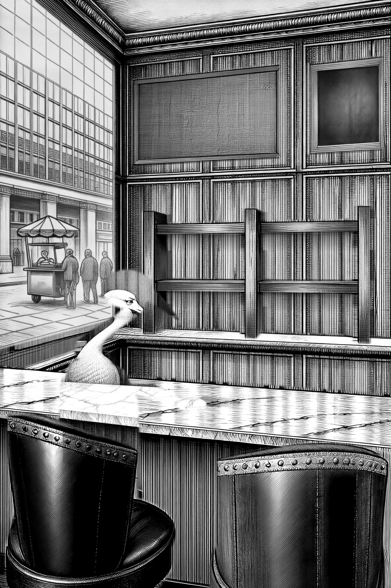

**The thinking.** Rendered in context - the plate as it stands behind this part, with only this part's own silhouette blocked in as values - so the pen, light and perspective are inherited; only the mask is laid back. Part note: DREW-02 TURNED TO BARCLAY, HEAD UP - the anchor pose. Drew SEATED IN THE LEFT-HAND CHAIR AT THE MARBLE COUNTER, SEEN FROM BEHIND AND SLIGHTLY TO HIS RIGHT - body turned 146 degrees from the lens so his right shoulder is toward us and the chair back stands in front of him - HIS HEAD TURNED BACK AND ACROSS TO BARCLAY IN THE RIGHT-HAND CHAIR: head yaw 118 degrees, and THE HEAD IS CARRIED UP, the line from the centre of his eye to the black tip of his bill lying 42 degrees below horizontal. His eye slides sideways at Barclay's face; the bill is CLOSED, a slender even-taper wedge whose BLACK OUTER THIRD IS THE OUTLINE with one bright highlight ribbon inside it. One neck reversal, the head carried forward of where the neck left the body. Near hand on the martini stem, at least three digits closed on it and one crossing in front. Shoulders 1.32 m, crown 1.65 m on a 0.76 m seat. Cropped at the counter: chest-up, no legs, no stools. He never looks at us.

**Settings.** local/sensenova-u1.5, seed 33, full 40 steps cfg 4, negative: text, letters, words, lettering, signage, sign, numbers, typography, writing, inscription, shop name, banner, poster, bare bird, unclothed, naked, no clothes, plain plumage over the whole torso, feathered torso without a vest, straight neck, stiff neck, goose, swan, pink, colour, bird dot eyes, blank eyes, bare human skin, wing mitts, tail, display plumes, hat, shoes, second flamingo, duplicate figure, floating, standing, front view, facing the camera, full face, flat fill, photographic

**Prompt.** [prompts/013-figure-drew-02-toward-render-seed-33-laid-in-full-plate.prompt.txt](prompts/013-figure-drew-02-toward-render-seed-33-laid-in-full-plate.prompt.txt)

*Logged 00:36.*

---

## 014. figure-drew-02-toward render seed 44 laid in full plate

**The thinking.** Rendered in context - the plate as it stands behind this part, with only this part's own silhouette blocked in as values - so the pen, light and perspective are inherited; only the mask is laid back. Part note: DREW-02 TURNED TO BARCLAY, HEAD UP - the anchor pose. Drew SEATED IN THE LEFT-HAND CHAIR AT THE MARBLE COUNTER, SEEN FROM BEHIND AND SLIGHTLY TO HIS RIGHT - body turned 146 degrees from the lens so his right shoulder is toward us and the chair back stands in front of him - HIS HEAD TURNED BACK AND ACROSS TO BARCLAY IN THE RIGHT-HAND CHAIR: head yaw 118 degrees, and THE HEAD IS CARRIED UP, the line from the centre of his eye to the black tip of his bill lying 42 degrees below horizontal. His eye slides sideways at Barclay's face; the bill is CLOSED, a slender even-taper wedge whose BLACK OUTER THIRD IS THE OUTLINE with one bright highlight ribbon inside it. One neck reversal, the head carried forward of where the neck left the body. Near hand on the martini stem, at least three digits closed on it and one crossing in front. Shoulders 1.32 m, crown 1.65 m on a 0.76 m seat. Cropped at the counter: chest-up, no legs, no stools. He never looks at us.

**Settings.** local/sensenova-u1.5, seed 44, full 40 steps cfg 4, negative: text, letters, words, lettering, signage, sign, numbers, typography, writing, inscription, shop name, banner, poster, bare bird, unclothed, naked, no clothes, plain plumage over the whole torso, feathered torso without a vest, straight neck, stiff neck, goose, swan, pink, colour, bird dot eyes, blank eyes, bare human skin, wing mitts, tail, display plumes, hat, shoes, second flamingo, duplicate figure, floating, standing, front view, facing the camera, full face, flat fill, photographic

**Prompt.** [prompts/014-figure-drew-02-toward-render-seed-44-laid-in-full-plate.prompt.txt](prompts/014-figure-drew-02-toward-render-seed-44-laid-in-full-plate.prompt.txt)

*Logged 00:36.*

---

## 015. Drew, anchor pose, round 4: the detail render works for the clothes - knit vest and collar on three seeds; the head is still a swan, so it gets its own render

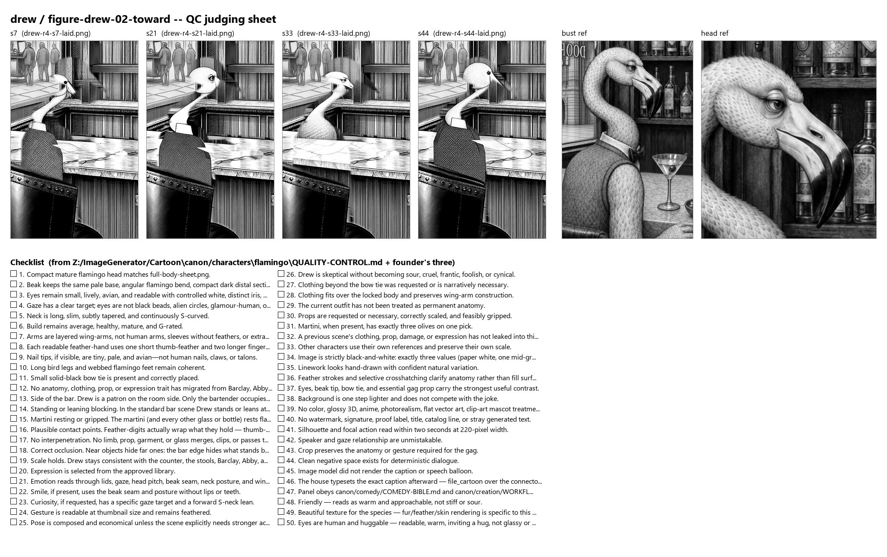

**The ask.** make sure the characters are huggable have beautiful texture for their species

**The thinking.** Rendered from a 2:3 crop of the frame at the model's full resolution, with the reference pictures named in the prompt as the character's own art, the vest finally arrived as a knitted garment with a pale collar (seeds 7, 21, 44). The heads did not: round skulls with short beaks, one with a human-ish eye. So the plan's head route starts now: the head rendered from a tight crop around it with the head tile leading the references, then composited onto the seed-7 body and laid for judging.

**Settings.** room-part.py --crop 60,700,700,1660 (1184x1776), refs bust+head+duo-behind named in the prompt; head crop 280,740,560,1160 seeds 101-104; combine_heads.py

**Verdict.** body route found - head route running

*Logged 00:41.*

---

## 016. figure-drew-02-toward render seed 101 laid in full plate

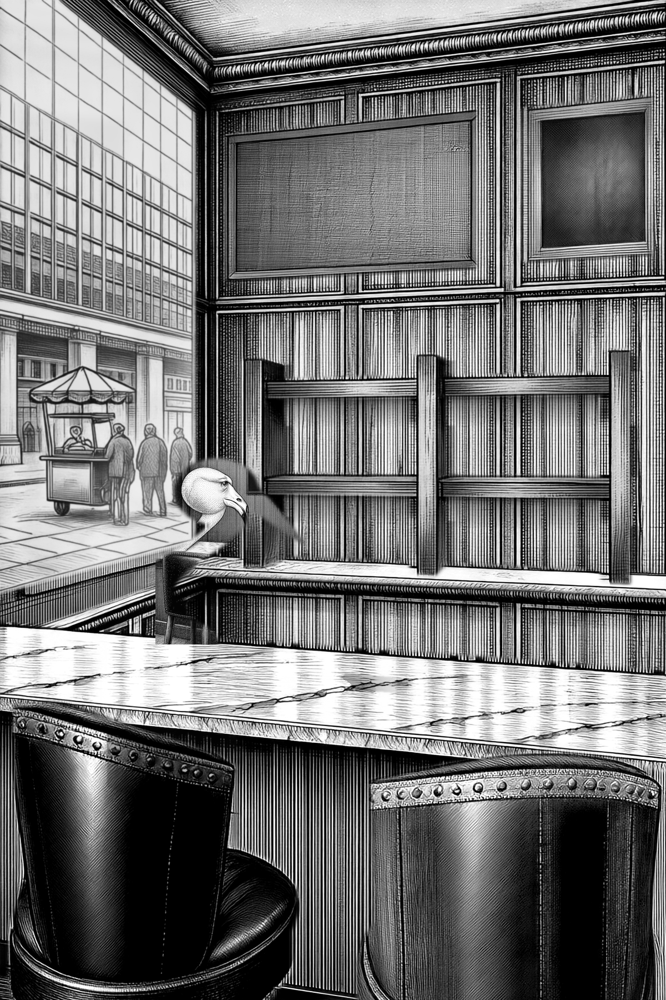

**The thinking.** Rendered in context - the plate as it stands behind this part, with only this part's own silhouette blocked in as values - so the pen, light and perspective are inherited; only the mask is laid back. Part note: DREW-02 TURNED TO BARCLAY, HEAD UP - the anchor pose. Drew SEATED IN THE LEFT-HAND CHAIR AT THE MARBLE COUNTER, SEEN FROM BEHIND AND SLIGHTLY TO HIS RIGHT - body turned 146 degrees from the lens so his right shoulder is toward us and the chair back stands in front of him - HIS HEAD TURNED BACK AND ACROSS TO BARCLAY IN THE RIGHT-HAND CHAIR: head yaw 118 degrees, and THE HEAD IS CARRIED UP, the line from the centre of his eye to the black tip of his bill lying 42 degrees below horizontal. His eye slides sideways at Barclay's face; the bill is CLOSED, a slender even-taper wedge whose BLACK OUTER THIRD IS THE OUTLINE with one bright highlight ribbon inside it. One neck reversal, the head carried forward of where the neck left the body. Near hand on the martini stem, at least three digits closed on it and one crossing in front. Shoulders 1.32 m, crown 1.65 m on a 0.76 m seat. Cropped at the counter: chest-up, no legs, no stools. He never looks at us.

**Settings.** local/sensenova-u1.5, seed 101, full 40 steps cfg 4, negative: text, letters, words, lettering, signage, sign, numbers, typography, writing, inscription, shop name, banner, poster, swan, goose, duck, round head, small beak, short beak, stubby beak, bird dot eye, bare bird, unclothed, naked, no clothes, plain plumage over the whole torso, feathered torso without a vest, straight neck, stiff neck, goose, swan, pink, colour, bird dot eyes, blank eyes, bare human skin, wing mitts, tail, display plumes, hat, shoes, second flamingo, duplicate figure, floating, standing, front view, facing the camera, full face, flat fill, photographic

**Prompt.** [prompts/016-figure-drew-02-toward-render-seed-101-laid-in-full-plate.prompt.txt](prompts/016-figure-drew-02-toward-render-seed-101-laid-in-full-plate.prompt.txt)

*Logged 00:44.*

---

## 017. figure-drew-02-toward render seed 102 laid in full plate

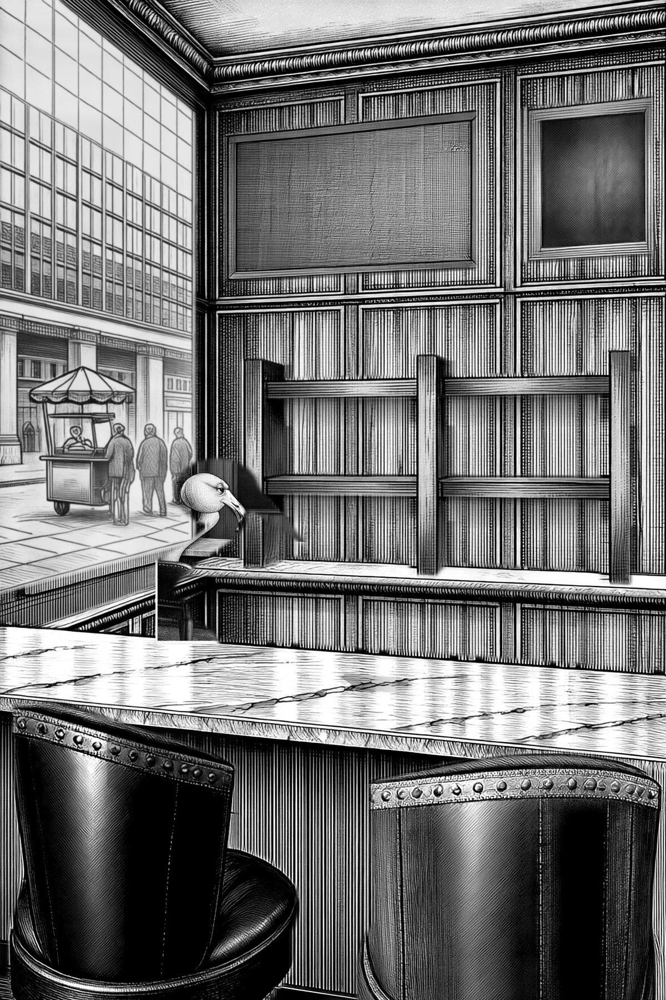

**The thinking.** Rendered in context - the plate as it stands behind this part, with only this part's own silhouette blocked in as values - so the pen, light and perspective are inherited; only the mask is laid back. Part note: DREW-02 TURNED TO BARCLAY, HEAD UP - the anchor pose. Drew SEATED IN THE LEFT-HAND CHAIR AT THE MARBLE COUNTER, SEEN FROM BEHIND AND SLIGHTLY TO HIS RIGHT - body turned 146 degrees from the lens so his right shoulder is toward us and the chair back stands in front of him - HIS HEAD TURNED BACK AND ACROSS TO BARCLAY IN THE RIGHT-HAND CHAIR: head yaw 118 degrees, and THE HEAD IS CARRIED UP, the line from the centre of his eye to the black tip of his bill lying 42 degrees below horizontal. His eye slides sideways at Barclay's face; the bill is CLOSED, a slender even-taper wedge whose BLACK OUTER THIRD IS THE OUTLINE with one bright highlight ribbon inside it. One neck reversal, the head carried forward of where the neck left the body. Near hand on the martini stem, at least three digits closed on it and one crossing in front. Shoulders 1.32 m, crown 1.65 m on a 0.76 m seat. Cropped at the counter: chest-up, no legs, no stools. He never looks at us.

**Settings.** local/sensenova-u1.5, seed 102, full 40 steps cfg 4, negative: text, letters, words, lettering, signage, sign, numbers, typography, writing, inscription, shop name, banner, poster, swan, goose, duck, round head, small beak, short beak, stubby beak, bird dot eye, bare bird, unclothed, naked, no clothes, plain plumage over the whole torso, feathered torso without a vest, straight neck, stiff neck, goose, swan, pink, colour, bird dot eyes, blank eyes, bare human skin, wing mitts, tail, display plumes, hat, shoes, second flamingo, duplicate figure, floating, standing, front view, facing the camera, full face, flat fill, photographic

**Prompt.** [prompts/017-figure-drew-02-toward-render-seed-102-laid-in-full-plate.prompt.txt](prompts/017-figure-drew-02-toward-render-seed-102-laid-in-full-plate.prompt.txt)

*Logged 00:45.*

---

## 018. figure-drew-02-toward render seed 103 laid in full plate

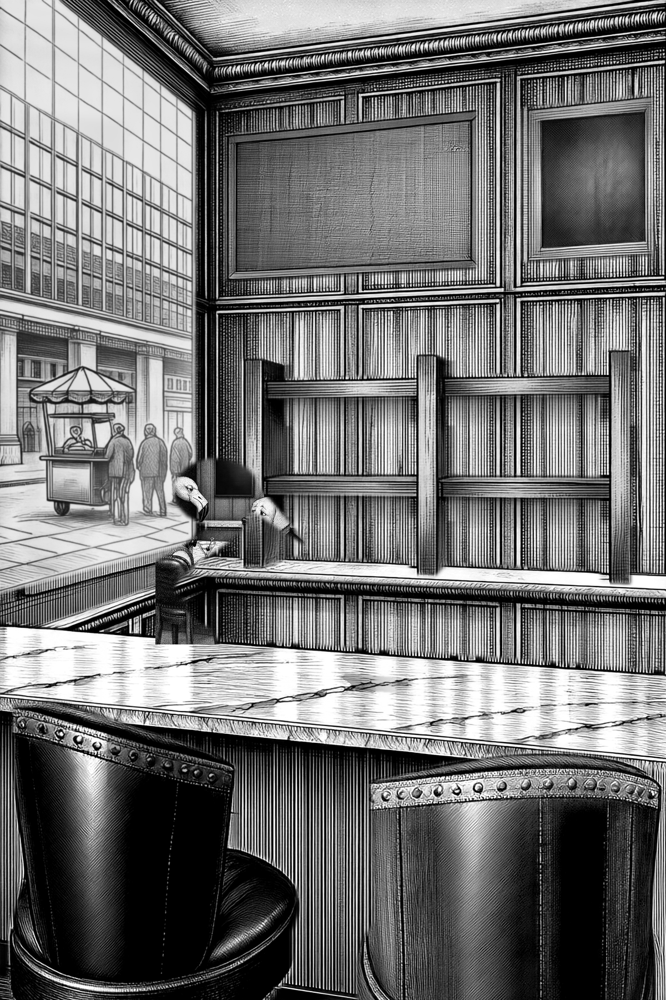

**The thinking.** Rendered in context - the plate as it stands behind this part, with only this part's own silhouette blocked in as values - so the pen, light and perspective are inherited; only the mask is laid back. Part note: DREW-02 TURNED TO BARCLAY, HEAD UP - the anchor pose. Drew SEATED IN THE LEFT-HAND CHAIR AT THE MARBLE COUNTER, SEEN FROM BEHIND AND SLIGHTLY TO HIS RIGHT - body turned 146 degrees from the lens so his right shoulder is toward us and the chair back stands in front of him - HIS HEAD TURNED BACK AND ACROSS TO BARCLAY IN THE RIGHT-HAND CHAIR: head yaw 118 degrees, and THE HEAD IS CARRIED UP, the line from the centre of his eye to the black tip of his bill lying 42 degrees below horizontal. His eye slides sideways at Barclay's face; the bill is CLOSED, a slender even-taper wedge whose BLACK OUTER THIRD IS THE OUTLINE with one bright highlight ribbon inside it. One neck reversal, the head carried forward of where the neck left the body. Near hand on the martini stem, at least three digits closed on it and one crossing in front. Shoulders 1.32 m, crown 1.65 m on a 0.76 m seat. Cropped at the counter: chest-up, no legs, no stools. He never looks at us.

**Settings.** local/sensenova-u1.5, seed 103, full 40 steps cfg 4, negative: text, letters, words, lettering, signage, sign, numbers, typography, writing, inscription, shop name, banner, poster, swan, goose, duck, round head, small beak, short beak, stubby beak, bird dot eye, bare bird, unclothed, naked, no clothes, plain plumage over the whole torso, feathered torso without a vest, straight neck, stiff neck, goose, swan, pink, colour, bird dot eyes, blank eyes, bare human skin, wing mitts, tail, display plumes, hat, shoes, second flamingo, duplicate figure, floating, standing, front view, facing the camera, full face, flat fill, photographic

**Prompt.** [prompts/018-figure-drew-02-toward-render-seed-103-laid-in-full-plate.prompt.txt](prompts/018-figure-drew-02-toward-render-seed-103-laid-in-full-plate.prompt.txt)

*Logged 00:45.*

---

## 019. figure-drew-02-toward render seed 104 laid in full plate

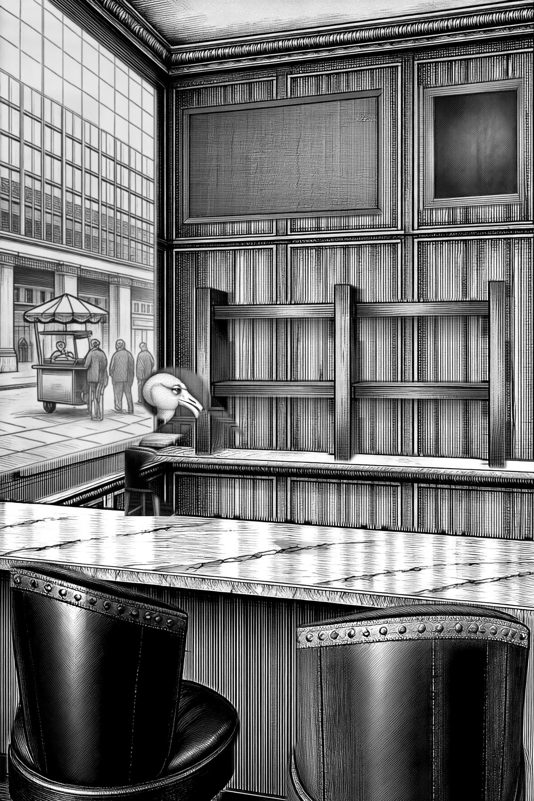

**The thinking.** Rendered in context - the plate as it stands behind this part, with only this part's own silhouette blocked in as values - so the pen, light and perspective are inherited; only the mask is laid back. Part note: DREW-02 TURNED TO BARCLAY, HEAD UP - the anchor pose. Drew SEATED IN THE LEFT-HAND CHAIR AT THE MARBLE COUNTER, SEEN FROM BEHIND AND SLIGHTLY TO HIS RIGHT - body turned 146 degrees from the lens so his right shoulder is toward us and the chair back stands in front of him - HIS HEAD TURNED BACK AND ACROSS TO BARCLAY IN THE RIGHT-HAND CHAIR: head yaw 118 degrees, and THE HEAD IS CARRIED UP, the line from the centre of his eye to the black tip of his bill lying 42 degrees below horizontal. His eye slides sideways at Barclay's face; the bill is CLOSED, a slender even-taper wedge whose BLACK OUTER THIRD IS THE OUTLINE with one bright highlight ribbon inside it. One neck reversal, the head carried forward of where the neck left the body. Near hand on the martini stem, at least three digits closed on it and one crossing in front. Shoulders 1.32 m, crown 1.65 m on a 0.76 m seat. Cropped at the counter: chest-up, no legs, no stools. He never looks at us.

**Settings.** local/sensenova-u1.5, seed 104, full 40 steps cfg 4, negative: text, letters, words, lettering, signage, sign, numbers, typography, writing, inscription, shop name, banner, poster, swan, goose, duck, round head, small beak, short beak, stubby beak, bird dot eye, bare bird, unclothed, naked, no clothes, plain plumage over the whole torso, feathered torso without a vest, straight neck, stiff neck, goose, swan, pink, colour, bird dot eyes, blank eyes, bare human skin, wing mitts, tail, display plumes, hat, shoes, second flamingo, duplicate figure, floating, standing, front view, facing the camera, full face, flat fill, photographic

**Prompt.** [prompts/019-figure-drew-02-toward-render-seed-104-laid-in-full-plate.prompt.txt](prompts/019-figure-drew-02-toward-render-seed-104-laid-in-full-plate.prompt.txt)

*Logged 00:46.*

---

## 020. Drew's head, rendered on its own from a tight crop with the head tile leading: seed 101 is the first proper Drew head - and why the composite showed a dark block beside it

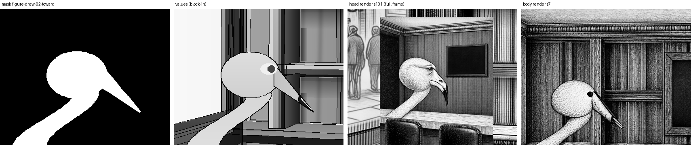

**The ask.** the eyes must look human and huggable ... great texture unique to their animal

**The thinking.** A head-only render at four times the scale, with the head tile as the first reference, gives a real Drew head: the heavy bill bending down to its black tip, the lidded eye with a visible white, plumage in fine strokes. Composited onto the seed-7 body through the figure's own silhouette, a dark block appeared beside the head: the block-in's bill was a long thin wedge (the bible's swan proportions), so the silhouette reached past every rendered bill into the head render's background. The approved plates and the published set both carry the heavier bill, so the block-in's bill is now deeper and bent down to match, and the bodies and heads are re-rendered against it. Decision carried to the founder: the bible's swan wording versus the plates' heavy bill.

**Settings.** head crop 280,740,560,1160 at 1184x1776, refs head+bust+duo-behind, seeds 101-104; combine_heads.py through mask x head window; bill depth 0.46 L, tip down 2.2 cm

**Verdict.** head route works - composite geometry being aligned

*Logged 00:54.*

---

## 021. figure-drew-02-toward render seed 7 laid in full plate

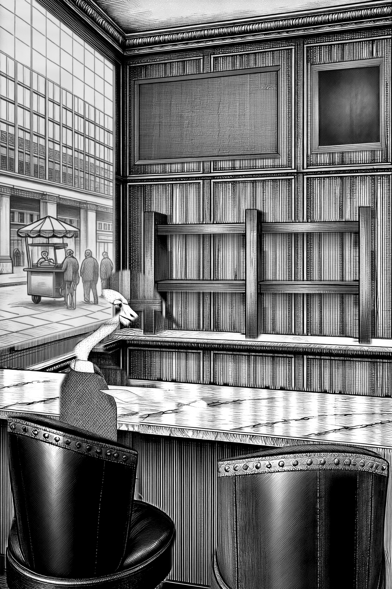

**The thinking.** Rendered in context - the plate as it stands behind this part, with only this part's own silhouette blocked in as values - so the pen, light and perspective are inherited; only the mask is laid back. Part note: DREW-02 TURNED TO BARCLAY, HEAD UP - the anchor pose. Drew SEATED IN THE LEFT-HAND CHAIR AT THE MARBLE COUNTER, SEEN FROM BEHIND AND SLIGHTLY TO HIS RIGHT - body turned 146 degrees from the lens so his right shoulder is toward us and the chair back stands in front of him - HIS HEAD TURNED BACK AND ACROSS TO BARCLAY IN THE RIGHT-HAND CHAIR: head yaw 118 degrees, and THE HEAD IS CARRIED UP, the line from the centre of his eye to the black tip of his bill lying 42 degrees below horizontal. His eye slides sideways at Barclay's face; the bill is CLOSED, a slender even-taper wedge whose BLACK OUTER THIRD IS THE OUTLINE with one bright highlight ribbon inside it. One neck reversal, the head carried forward of where the neck left the body. Near hand on the martini stem, at least three digits closed on it and one crossing in front. Shoulders 1.32 m, crown 1.65 m on a 0.76 m seat. Cropped at the counter: chest-up, no legs, no stools. He never looks at us.

**Settings.** local/sensenova-u1.5, seed 7, full 40 steps cfg 4, negative: text, letters, words, lettering, signage, sign, numbers, typography, writing, inscription, shop name, banner, poster, swan, goose, duck, round head, small beak, short beak, stubby beak, bird dot eye, bare bird, unclothed, naked, no clothes, plain plumage over the whole torso, feathered torso without a vest, straight neck, stiff neck, goose, swan, pink, colour, bird dot eyes, blank eyes, bare human skin, wing mitts, tail, display plumes, hat, shoes, second flamingo, duplicate figure, floating, standing, front view, facing the camera, full face, flat fill, photographic

**Prompt.** [prompts/021-figure-drew-02-toward-render-seed-7-laid-in-full-plate.prompt.txt](prompts/021-figure-drew-02-toward-render-seed-7-laid-in-full-plate.prompt.txt)

*Logged 00:58.*

---

## 022. figure-drew-02-toward render seed 44 laid in full plate

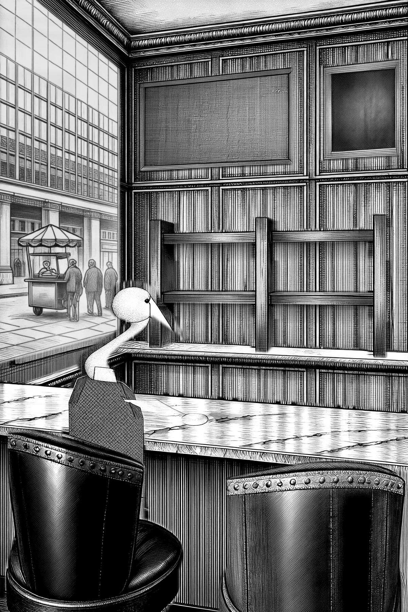

**The thinking.** Rendered in context - the plate as it stands behind this part, with only this part's own silhouette blocked in as values - so the pen, light and perspective are inherited; only the mask is laid back. Part note: DREW-02 TURNED TO BARCLAY, HEAD UP - the anchor pose. Drew SEATED IN THE LEFT-HAND CHAIR AT THE MARBLE COUNTER, SEEN FROM BEHIND AND SLIGHTLY TO HIS RIGHT - body turned 146 degrees from the lens so his right shoulder is toward us and the chair back stands in front of him - HIS HEAD TURNED BACK AND ACROSS TO BARCLAY IN THE RIGHT-HAND CHAIR: head yaw 118 degrees, and THE HEAD IS CARRIED UP, the line from the centre of his eye to the black tip of his bill lying 42 degrees below horizontal. His eye slides sideways at Barclay's face; the bill is CLOSED, a slender even-taper wedge whose BLACK OUTER THIRD IS THE OUTLINE with one bright highlight ribbon inside it. One neck reversal, the head carried forward of where the neck left the body. Near hand on the martini stem, at least three digits closed on it and one crossing in front. Shoulders 1.32 m, crown 1.65 m on a 0.76 m seat. Cropped at the counter: chest-up, no legs, no stools. He never looks at us.

**Settings.** local/sensenova-u1.5, seed 44, full 40 steps cfg 4, negative: text, letters, words, lettering, signage, sign, numbers, typography, writing, inscription, shop name, banner, poster, swan, goose, duck, round head, small beak, short beak, stubby beak, bird dot eye, bare bird, unclothed, naked, no clothes, plain plumage over the whole torso, feathered torso without a vest, straight neck, stiff neck, goose, swan, pink, colour, bird dot eyes, blank eyes, bare human skin, wing mitts, tail, display plumes, hat, shoes, second flamingo, duplicate figure, floating, standing, front view, facing the camera, full face, flat fill, photographic

**Prompt.** [prompts/022-figure-drew-02-toward-render-seed-44-laid-in-full-plate.prompt.txt](prompts/022-figure-drew-02-toward-render-seed-44-laid-in-full-plate.prompt.txt)

*Logged 00:58.*

---

## 023. figure-drew-02-toward render seed 101 laid in full plate

**The thinking.** Rendered in context - the plate as it stands behind this part, with only this part's own silhouette blocked in as values - so the pen, light and perspective are inherited; only the mask is laid back. Part note: DREW-02 TURNED TO BARCLAY, HEAD UP - the anchor pose. Drew SEATED IN THE LEFT-HAND CHAIR AT THE MARBLE COUNTER, SEEN FROM BEHIND AND SLIGHTLY TO HIS RIGHT - body turned 146 degrees from the lens so his right shoulder is toward us and the chair back stands in front of him - HIS HEAD TURNED BACK AND ACROSS TO BARCLAY IN THE RIGHT-HAND CHAIR: head yaw 118 degrees, and THE HEAD IS CARRIED UP, the line from the centre of his eye to the black tip of his bill lying 42 degrees below horizontal. His eye slides sideways at Barclay's face; the bill is CLOSED, a slender even-taper wedge whose BLACK OUTER THIRD IS THE OUTLINE with one bright highlight ribbon inside it. One neck reversal, the head carried forward of where the neck left the body. Near hand on the martini stem, at least three digits closed on it and one crossing in front. Shoulders 1.32 m, crown 1.65 m on a 0.76 m seat. Cropped at the counter: chest-up, no legs, no stools. He never looks at us.

**Settings.** local/sensenova-u1.5, seed 101, full 40 steps cfg 4, negative: text, letters, words, lettering, signage, sign, numbers, typography, writing, inscription, shop name, banner, poster, swan, goose, duck, round head, small beak, short beak, stubby beak, bird dot eye, bare bird, unclothed, naked, no clothes, plain plumage over the whole torso, feathered torso without a vest, straight neck, stiff neck, goose, swan, pink, colour, bird dot eyes, blank eyes, bare human skin, wing mitts, tail, display plumes, hat, shoes, second flamingo, duplicate figure, floating, standing, front view, facing the camera, full face, flat fill, photographic

**Prompt.** [prompts/023-figure-drew-02-toward-render-seed-101-laid-in-full-plate.prompt.txt](prompts/023-figure-drew-02-toward-render-seed-101-laid-in-full-plate.prompt.txt)

*Logged 00:58.*

---

## 024. figure-drew-02-toward render seed 102 laid in full plate

**The thinking.** Rendered in context - the plate as it stands behind this part, with only this part's own silhouette blocked in as values - so the pen, light and perspective are inherited; only the mask is laid back. Part note: DREW-02 TURNED TO BARCLAY, HEAD UP - the anchor pose. Drew SEATED IN THE LEFT-HAND CHAIR AT THE MARBLE COUNTER, SEEN FROM BEHIND AND SLIGHTLY TO HIS RIGHT - body turned 146 degrees from the lens so his right shoulder is toward us and the chair back stands in front of him - HIS HEAD TURNED BACK AND ACROSS TO BARCLAY IN THE RIGHT-HAND CHAIR: head yaw 118 degrees, and THE HEAD IS CARRIED UP, the line from the centre of his eye to the black tip of his bill lying 42 degrees below horizontal. His eye slides sideways at Barclay's face; the bill is CLOSED, a slender even-taper wedge whose BLACK OUTER THIRD IS THE OUTLINE with one bright highlight ribbon inside it. One neck reversal, the head carried forward of where the neck left the body. Near hand on the martini stem, at least three digits closed on it and one crossing in front. Shoulders 1.32 m, crown 1.65 m on a 0.76 m seat. Cropped at the counter: chest-up, no legs, no stools. He never looks at us.

**Settings.** local/sensenova-u1.5, seed 102, full 40 steps cfg 4, negative: text, letters, words, lettering, signage, sign, numbers, typography, writing, inscription, shop name, banner, poster, swan, goose, duck, round head, small beak, short beak, stubby beak, bird dot eye, bare bird, unclothed, naked, no clothes, plain plumage over the whole torso, feathered torso without a vest, straight neck, stiff neck, goose, swan, pink, colour, bird dot eyes, blank eyes, bare human skin, wing mitts, tail, display plumes, hat, shoes, second flamingo, duplicate figure, floating, standing, front view, facing the camera, full face, flat fill, photographic

**Prompt.** [prompts/024-figure-drew-02-toward-render-seed-102-laid-in-full-plate.prompt.txt](prompts/024-figure-drew-02-toward-render-seed-102-laid-in-full-plate.prompt.txt)

*Logged 00:59.*

---

## 025. figure-drew-02-toward render seed 104 laid in full plate

**The thinking.** Rendered in context - the plate as it stands behind this part, with only this part's own silhouette blocked in as values - so the pen, light and perspective are inherited; only the mask is laid back. Part note: DREW-02 TURNED TO BARCLAY, HEAD UP - the anchor pose. Drew SEATED IN THE LEFT-HAND CHAIR AT THE MARBLE COUNTER, SEEN FROM BEHIND AND SLIGHTLY TO HIS RIGHT - body turned 146 degrees from the lens so his right shoulder is toward us and the chair back stands in front of him - HIS HEAD TURNED BACK AND ACROSS TO BARCLAY IN THE RIGHT-HAND CHAIR: head yaw 118 degrees, and THE HEAD IS CARRIED UP, the line from the centre of his eye to the black tip of his bill lying 42 degrees below horizontal. His eye slides sideways at Barclay's face; the bill is CLOSED, a slender even-taper wedge whose BLACK OUTER THIRD IS THE OUTLINE with one bright highlight ribbon inside it. One neck reversal, the head carried forward of where the neck left the body. Near hand on the martini stem, at least three digits closed on it and one crossing in front. Shoulders 1.32 m, crown 1.65 m on a 0.76 m seat. Cropped at the counter: chest-up, no legs, no stools. He never looks at us.

**Settings.** local/sensenova-u1.5, seed 104, full 40 steps cfg 4, negative: text, letters, words, lettering, signage, sign, numbers, typography, writing, inscription, shop name, banner, poster, swan, goose, duck, round head, small beak, short beak, stubby beak, bird dot eye, bare bird, unclothed, naked, no clothes, plain plumage over the whole torso, feathered torso without a vest, straight neck, stiff neck, goose, swan, pink, colour, bird dot eyes, blank eyes, bare human skin, wing mitts, tail, display plumes, hat, shoes, second flamingo, duplicate figure, floating, standing, front view, facing the camera, full face, flat fill, photographic

**Prompt.** [prompts/025-figure-drew-02-toward-render-seed-104-laid-in-full-plate.prompt.txt](prompts/025-figure-drew-02-toward-render-seed-104-laid-in-full-plate.prompt.txt)

*Logged 00:59.*

---

## 026. Drew, round 5: body (knit vest) plus head renders composited through the silhouette - the head is right on seed 104, but the head render's own background leaks wherever the rendered head sits smaller than the block-in

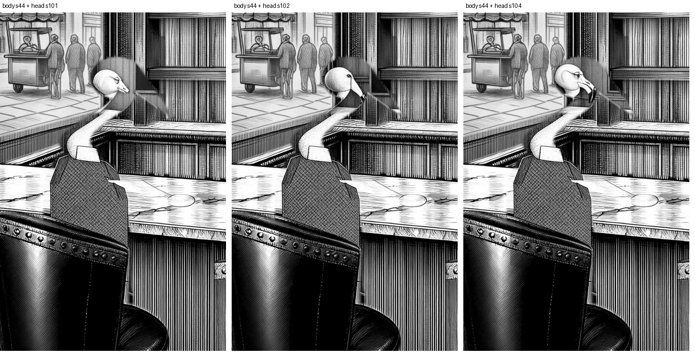

**The ask.** the eyes must look human and huggable

**The thinking.** With the deeper bill in the block-in, the body renders keep the vest and the head renders give a real Drew head (seed 104: heavy bill to a black tip, lidded eye, fine plumage). But a composite cut by the block-in's silhouette still shows the head render's re-imagined background wherever the rendered head is smaller or offset, and a mask taken from a render is unreliable in engraving line. Round six closes the loop without compositing: the good head render becomes the FIRST reference for the body render, so the body render draws that head at the block-in's position.

**Settings.** bodies s7/s44 crop 60,700,700,1660; heads s101/102/104 crop 280,740,560,1160; combine_heads.py window 300,815,540,985 x mask

**Verdict.** head identity found; composite retired in favour of the head-as-reference loop

*Logged 01:00.*

---

## 027. figure-drew-02-toward render seed 7 laid in full plate

**The thinking.** Rendered in context - the plate as it stands behind this part, with only this part's own silhouette blocked in as values - so the pen, light and perspective are inherited; only the mask is laid back. Part note: DREW-02 TURNED TO BARCLAY, HEAD UP - the anchor pose. Drew SEATED IN THE LEFT-HAND CHAIR AT THE MARBLE COUNTER, SEEN FROM BEHIND AND SLIGHTLY TO HIS RIGHT - body turned 146 degrees from the lens so his right shoulder is toward us and the chair back stands in front of him - HIS HEAD TURNED BACK AND ACROSS TO BARCLAY IN THE RIGHT-HAND CHAIR: head yaw 118 degrees, and THE HEAD IS CARRIED UP, the line from the centre of his eye to the black tip of his bill lying 42 degrees below horizontal. His eye slides sideways at Barclay's face; the bill is CLOSED, a slender even-taper wedge whose BLACK OUTER THIRD IS THE OUTLINE with one bright highlight ribbon inside it. One neck reversal, the head carried forward of where the neck left the body. Near hand on the martini stem, at least three digits closed on it and one crossing in front. Shoulders 1.32 m, crown 1.65 m on a 0.76 m seat. Cropped at the counter: chest-up, no legs, no stools. He never looks at us.

**Settings.** local/sensenova-u1.5, seed 7, full 40 steps cfg 4, negative: text, letters, words, lettering, signage, sign, numbers, typography, writing, inscription, shop name, banner, poster, swan, goose, duck, round head, small beak, short beak, stubby beak, bird dot eye, bare bird, unclothed, naked, no clothes, plain plumage over the whole torso, feathered torso without a vest, straight neck, stiff neck, goose, swan, pink, colour, bird dot eyes, blank eyes, bare human skin, wing mitts, tail, display plumes, hat, shoes, second flamingo, duplicate figure, floating, standing, front view, facing the camera, full face, flat fill, photographic

**Prompt.** [prompts/027-figure-drew-02-toward-render-seed-7-laid-in-full-plate.prompt.txt](prompts/027-figure-drew-02-toward-render-seed-7-laid-in-full-plate.prompt.txt)

*Logged 01:01.*

---

## 028. figure-drew-02-toward render seed 44 laid in full plate

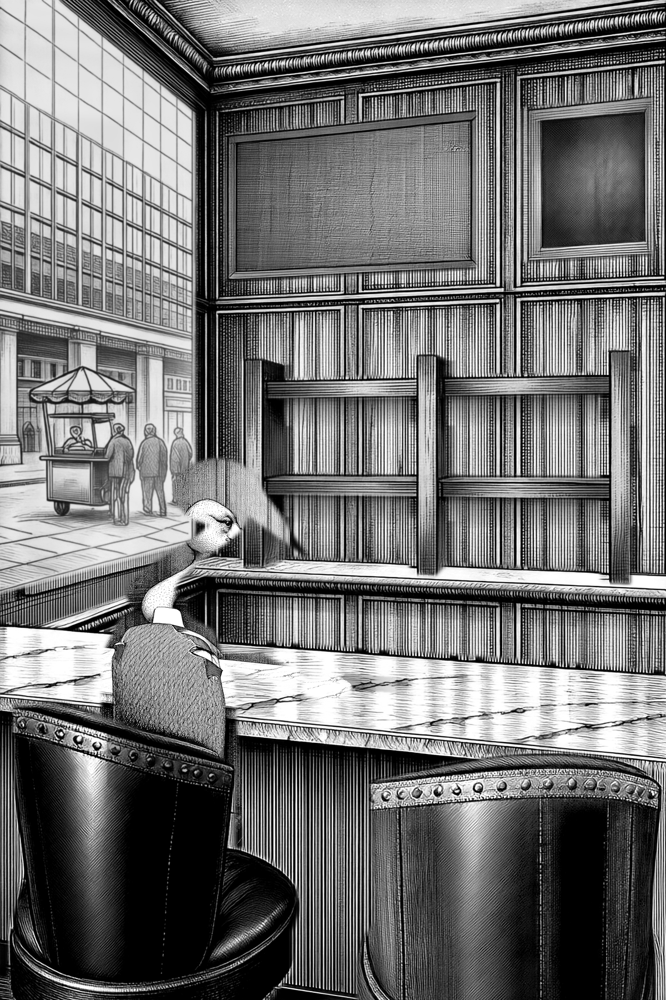

**The thinking.** Rendered in context - the plate as it stands behind this part, with only this part's own silhouette blocked in as values - so the pen, light and perspective are inherited; only the mask is laid back. Part note: DREW-02 TURNED TO BARCLAY, HEAD UP - the anchor pose. Drew SEATED IN THE LEFT-HAND CHAIR AT THE MARBLE COUNTER, SEEN FROM BEHIND AND SLIGHTLY TO HIS RIGHT - body turned 146 degrees from the lens so his right shoulder is toward us and the chair back stands in front of him - HIS HEAD TURNED BACK AND ACROSS TO BARCLAY IN THE RIGHT-HAND CHAIR: head yaw 118 degrees, and THE HEAD IS CARRIED UP, the line from the centre of his eye to the black tip of his bill lying 42 degrees below horizontal. His eye slides sideways at Barclay's face; the bill is CLOSED, a slender even-taper wedge whose BLACK OUTER THIRD IS THE OUTLINE with one bright highlight ribbon inside it. One neck reversal, the head carried forward of where the neck left the body. Near hand on the martini stem, at least three digits closed on it and one crossing in front. Shoulders 1.32 m, crown 1.65 m on a 0.76 m seat. Cropped at the counter: chest-up, no legs, no stools. He never looks at us.

**Settings.** local/sensenova-u1.5, seed 44, full 40 steps cfg 4, negative: text, letters, words, lettering, signage, sign, numbers, typography, writing, inscription, shop name, banner, poster, swan, goose, duck, round head, small beak, short beak, stubby beak, bird dot eye, bare bird, unclothed, naked, no clothes, plain plumage over the whole torso, feathered torso without a vest, straight neck, stiff neck, goose, swan, pink, colour, bird dot eyes, blank eyes, bare human skin, wing mitts, tail, display plumes, hat, shoes, second flamingo, duplicate figure, floating, standing, front view, facing the camera, full face, flat fill, photographic

**Prompt.** [prompts/028-figure-drew-02-toward-render-seed-44-laid-in-full-plate.prompt.txt](prompts/028-figure-drew-02-toward-render-seed-44-laid-in-full-plate.prompt.txt)

*Logged 01:01.*

---

## 029. figure-drew-02-toward render seed 201 laid in full plate

**The thinking.** Rendered in context - the plate as it stands behind this part, with only this part's own silhouette blocked in as values - so the pen, light and perspective are inherited; only the mask is laid back. Part note: DREW-02 TURNED TO BARCLAY, HEAD UP - the anchor pose. Drew SEATED IN THE LEFT-HAND CHAIR AT THE MARBLE COUNTER, SEEN FROM BEHIND AND SLIGHTLY TO HIS RIGHT - body turned 146 degrees from the lens so his right shoulder is toward us and the chair back stands in front of him - HIS HEAD TURNED BACK AND ACROSS TO BARCLAY IN THE RIGHT-HAND CHAIR: head yaw 118 degrees, and THE HEAD IS CARRIED UP, the line from the centre of his eye to the black tip of his bill lying 42 degrees below horizontal. His eye slides sideways at Barclay's face; the bill is CLOSED, a slender even-taper wedge whose BLACK OUTER THIRD IS THE OUTLINE with one bright highlight ribbon inside it. One neck reversal, the head carried forward of where the neck left the body. Near hand on the martini stem, at least three digits closed on it and one crossing in front. Shoulders 1.32 m, crown 1.65 m on a 0.76 m seat. Cropped at the counter: chest-up, no legs, no stools. He never looks at us.

**Settings.** local/sensenova-u1.5, seed 201, full 40 steps cfg 4, negative: text, letters, words, lettering, signage, sign, numbers, typography, writing, inscription, shop name, banner, poster, swan, goose, duck, round head, small beak, short beak, stubby beak, bird dot eye, bare bird, unclothed, naked, no clothes, plain plumage over the whole torso, feathered torso without a vest, straight neck, stiff neck, goose, swan, pink, colour, bird dot eyes, blank eyes, bare human skin, wing mitts, tail, display plumes, hat, shoes, second flamingo, duplicate figure, floating, standing, front view, facing the camera, full face, flat fill, photographic

**Prompt.** [prompts/029-figure-drew-02-toward-render-seed-201-laid-in-full-plate.prompt.txt](prompts/029-figure-drew-02-toward-render-seed-201-laid-in-full-plate.prompt.txt)

*Logged 01:03.*

---

## 030. figure-drew-02-toward render seed 202 laid in full plate

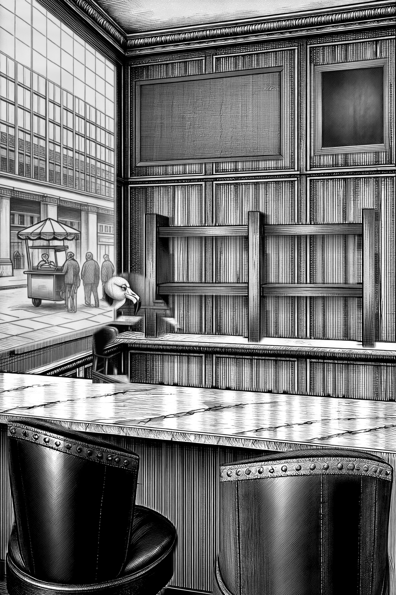

**The thinking.** Rendered in context - the plate as it stands behind this part, with only this part's own silhouette blocked in as values - so the pen, light and perspective are inherited; only the mask is laid back. Part note: DREW-02 TURNED TO BARCLAY, HEAD UP - the anchor pose. Drew SEATED IN THE LEFT-HAND CHAIR AT THE MARBLE COUNTER, SEEN FROM BEHIND AND SLIGHTLY TO HIS RIGHT - body turned 146 degrees from the lens so his right shoulder is toward us and the chair back stands in front of him - HIS HEAD TURNED BACK AND ACROSS TO BARCLAY IN THE RIGHT-HAND CHAIR: head yaw 118 degrees, and THE HEAD IS CARRIED UP, the line from the centre of his eye to the black tip of his bill lying 42 degrees below horizontal. His eye slides sideways at Barclay's face; the bill is CLOSED, a slender even-taper wedge whose BLACK OUTER THIRD IS THE OUTLINE with one bright highlight ribbon inside it. One neck reversal, the head carried forward of where the neck left the body. Near hand on the martini stem, at least three digits closed on it and one crossing in front. Shoulders 1.32 m, crown 1.65 m on a 0.76 m seat. Cropped at the counter: chest-up, no legs, no stools. He never looks at us.

**Settings.** local/sensenova-u1.5, seed 202, full 40 steps cfg 4, negative: text, letters, words, lettering, signage, sign, numbers, typography, writing, inscription, shop name, banner, poster, swan, goose, duck, round head, small beak, short beak, stubby beak, bird dot eye, bare bird, unclothed, naked, no clothes, plain plumage over the whole torso, feathered torso without a vest, straight neck, stiff neck, goose, swan, pink, colour, bird dot eyes, blank eyes, bare human skin, wing mitts, tail, display plumes, hat, shoes, second flamingo, duplicate figure, floating, standing, front view, facing the camera, full face, flat fill, photographic

**Prompt.** [prompts/030-figure-drew-02-toward-render-seed-202-laid-in-full-plate.prompt.txt](prompts/030-figure-drew-02-toward-render-seed-202-laid-in-full-plate.prompt.txt)

*Logged 01:03.*

---

## 031. Drew, round 6 and the keyed composite: the vest holds, the head is Drew on its own render, the join is the open problem - state saved for Monday (CAST-STATUS.md)

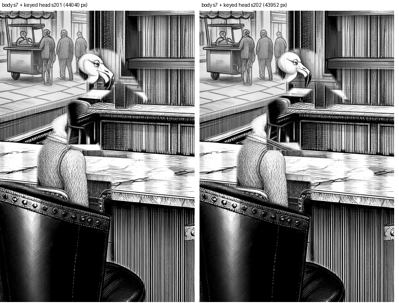

**The ask.** start to work on the 3 characters ... huggable, beautiful texture for their species, professional

**The thinking.** Handing the good head render to the body render as its first reference kept the knit vest but did not form the head inside the body. Rendering the head on a flat grey field and keying its silhouette from the render gives a fine head (seeds 201, 202) but the key still catches room fragments the model draws onto the field, and the neck join shows. That is the next problem, not a mystery: a plainer prompt for the head render and a tighter key, or head and neck rendered together. Everything is filed and the route is written down in reports/2026-09-06/CAST-STATUS.md.

**Settings.** 26 renders on figure-drew-02-toward across six rounds; tools: --ref, --crop, --plain, cast-qc.py, combine_keyed.py

**Verdict.** no pose approved yet; the body route and the head route are found; the join is Monday's first job

*Logged 01:04.*

---

