# The Swinging Door - studio report, 2026-09-06

Built for Rick. Every image the studio generated today, in the order it happened, with the ask that drove it, the thinking behind the decision, the exact prompt and settings, and the verdict. Images are in `images/`, prompts in `prompts/`.

## 001. figure-drew-02-toward render seed 7 laid in full plate

**The thinking.** Rendered in context - the plate as it stands behind this part, with only this part's own silhouette blocked in as values - so the pen, light and perspective are inherited; only the mask is laid back. Part note: DREW-02 TURNED TO BARCLAY, HEAD UP - the anchor pose. Drew SEATED IN THE LEFT-HAND CHAIR AT THE MARBLE COUNTER, SEEN FROM BEHIND AND SLIGHTLY TO HIS RIGHT - body turned 146 degrees from the lens so his right shoulder is toward us and the chair back stands in front of him - HIS HEAD TURNED BACK AND ACROSS TO BARCLAY IN THE RIGHT-HAND CHAIR: head yaw 118 degrees, and THE HEAD IS CARRIED UP, the line from the centre of his eye to the black tip of his bill lying 42 degrees below horizontal. His eye slides sideways at Barclay's face; the bill is CLOSED, a slender even-taper wedge whose BLACK OUTER THIRD IS THE OUTLINE with one bright highlight ribbon inside it. One neck reversal, the head carried forward of where the neck left the body. Near hand on the martini stem, at least three digits closed on it and one crossing in front. Shoulders 1.32 m, crown 1.65 m on a 0.76 m seat. Cropped at the counter: chest-up, no legs, no stools. He never looks at us.

**Settings.** local/sensenova-u1.5, seed 7, full 40 steps cfg 4, negative: text, letters, words, lettering, signage, sign, numbers, typography, writing, inscription, shop name, banner, poster, bare bird, unclothed, naked, no clothes, plain plumage over the whole torso, feathered torso without a vest, straight neck, stiff neck, goose, swan, pink, colour, bird dot eyes, blank eyes, bare human skin, wing mitts, tail, display plumes, hat, shoes, second flamingo, duplicate figure, floating, standing, front view, facing the camera, full face, flat fill, photographic

**Prompt.** [prompts/001-figure-drew-02-toward-render-seed-7-laid-in-full-plate.prompt.txt](prompts/001-figure-drew-02-toward-render-seed-7-laid-in-full-plate.prompt.txt)

*Logged 00:03.*

---

## 002. figure-drew-02-toward render seed 21 laid in full plate

**The thinking.** Rendered in context - the plate as it stands behind this part, with only this part's own silhouette blocked in as values - so the pen, light and perspective are inherited; only the mask is laid back. Part note: DREW-02 TURNED TO BARCLAY, HEAD UP - the anchor pose. Drew SEATED IN THE LEFT-HAND CHAIR AT THE MARBLE COUNTER, SEEN FROM BEHIND AND SLIGHTLY TO HIS RIGHT - body turned 146 degrees from the lens so his right shoulder is toward us and the chair back stands in front of him - HIS HEAD TURNED BACK AND ACROSS TO BARCLAY IN THE RIGHT-HAND CHAIR: head yaw 118 degrees, and THE HEAD IS CARRIED UP, the line from the centre of his eye to the black tip of his bill lying 42 degrees below horizontal. His eye slides sideways at Barclay's face; the bill is CLOSED, a slender even-taper wedge whose BLACK OUTER THIRD IS THE OUTLINE with one bright highlight ribbon inside it. One neck reversal, the head carried forward of where the neck left the body. Near hand on the martini stem, at least three digits closed on it and one crossing in front. Shoulders 1.32 m, crown 1.65 m on a 0.76 m seat. Cropped at the counter: chest-up, no legs, no stools. He never looks at us.

**Settings.** local/sensenova-u1.5, seed 21, full 40 steps cfg 4, negative: text, letters, words, lettering, signage, sign, numbers, typography, writing, inscription, shop name, banner, poster, bare bird, unclothed, naked, no clothes, plain plumage over the whole torso, feathered torso without a vest, straight neck, stiff neck, goose, swan, pink, colour, bird dot eyes, blank eyes, bare human skin, wing mitts, tail, display plumes, hat, shoes, second flamingo, duplicate figure, floating, standing, front view, facing the camera, full face, flat fill, photographic

**Prompt.** [prompts/002-figure-drew-02-toward-render-seed-21-laid-in-full-plate.prompt.txt](prompts/002-figure-drew-02-toward-render-seed-21-laid-in-full-plate.prompt.txt)

*Logged 00:03.*

---

## 003. figure-drew-02-toward render seed 33 laid in full plate

**The thinking.** Rendered in context - the plate as it stands behind this part, with only this part's own silhouette blocked in as values - so the pen, light and perspective are inherited; only the mask is laid back. Part note: DREW-02 TURNED TO BARCLAY, HEAD UP - the anchor pose. Drew SEATED IN THE LEFT-HAND CHAIR AT THE MARBLE COUNTER, SEEN FROM BEHIND AND SLIGHTLY TO HIS RIGHT - body turned 146 degrees from the lens so his right shoulder is toward us and the chair back stands in front of him - HIS HEAD TURNED BACK AND ACROSS TO BARCLAY IN THE RIGHT-HAND CHAIR: head yaw 118 degrees, and THE HEAD IS CARRIED UP, the line from the centre of his eye to the black tip of his bill lying 42 degrees below horizontal. His eye slides sideways at Barclay's face; the bill is CLOSED, a slender even-taper wedge whose BLACK OUTER THIRD IS THE OUTLINE with one bright highlight ribbon inside it. One neck reversal, the head carried forward of where the neck left the body. Near hand on the martini stem, at least three digits closed on it and one crossing in front. Shoulders 1.32 m, crown 1.65 m on a 0.76 m seat. Cropped at the counter: chest-up, no legs, no stools. He never looks at us.

**Settings.** local/sensenova-u1.5, seed 33, full 40 steps cfg 4, negative: text, letters, words, lettering, signage, sign, numbers, typography, writing, inscription, shop name, banner, poster, bare bird, unclothed, naked, no clothes, plain plumage over the whole torso, feathered torso without a vest, straight neck, stiff neck, goose, swan, pink, colour, bird dot eyes, blank eyes, bare human skin, wing mitts, tail, display plumes, hat, shoes, second flamingo, duplicate figure, floating, standing, front view, facing the camera, full face, flat fill, photographic

**Prompt.** [prompts/003-figure-drew-02-toward-render-seed-33-laid-in-full-plate.prompt.txt](prompts/003-figure-drew-02-toward-render-seed-33-laid-in-full-plate.prompt.txt)

*Logged 00:04.*

---

## 004. figure-drew-02-toward render seed 44 laid in full plate

**The thinking.** Rendered in context - the plate as it stands behind this part, with only this part's own silhouette blocked in as values - so the pen, light and perspective are inherited; only the mask is laid back. Part note: DREW-02 TURNED TO BARCLAY, HEAD UP - the anchor pose. Drew SEATED IN THE LEFT-HAND CHAIR AT THE MARBLE COUNTER, SEEN FROM BEHIND AND SLIGHTLY TO HIS RIGHT - body turned 146 degrees from the lens so his right shoulder is toward us and the chair back stands in front of him - HIS HEAD TURNED BACK AND ACROSS TO BARCLAY IN THE RIGHT-HAND CHAIR: head yaw 118 degrees, and THE HEAD IS CARRIED UP, the line from the centre of his eye to the black tip of his bill lying 42 degrees below horizontal. His eye slides sideways at Barclay's face; the bill is CLOSED, a slender even-taper wedge whose BLACK OUTER THIRD IS THE OUTLINE with one bright highlight ribbon inside it. One neck reversal, the head carried forward of where the neck left the body. Near hand on the martini stem, at least three digits closed on it and one crossing in front. Shoulders 1.32 m, crown 1.65 m on a 0.76 m seat. Cropped at the counter: chest-up, no legs, no stools. He never looks at us.

**Settings.** local/sensenova-u1.5, seed 44, full 40 steps cfg 4, negative: text, letters, words, lettering, signage, sign, numbers, typography, writing, inscription, shop name, banner, poster, bare bird, unclothed, naked, no clothes, plain plumage over the whole torso, feathered torso without a vest, straight neck, stiff neck, goose, swan, pink, colour, bird dot eyes, blank eyes, bare human skin, wing mitts, tail, display plumes, hat, shoes, second flamingo, duplicate figure, floating, standing, front view, facing the camera, full face, flat fill, photographic

**Prompt.** [prompts/004-figure-drew-02-toward-render-seed-44-laid-in-full-plate.prompt.txt](prompts/004-figure-drew-02-toward-render-seed-44-laid-in-full-plate.prompt.txt)

*Logged 00:04.*

---

## 005. Drew, anchor pose, round 2: garment-tone vest, bare-bird negatives, wardrobe sheet as a third reference - still undressed on all four seeds

**The ask.** make sure the characters are huggable have beautiful texture for their species

**The thinking.** A darker vest tone in the block-in and a wardrobe sheet as a reference did not hold the garment: from behind, a mid tone on a bird's back is plumage to the model. The neck and the plumage strokes are right on seeds 7 and 33. The fix follows the room's own lesson - texture is drawn, not asked for: the vest carries a knit lattice and ribbed armhole bands in the block-in, and the from-behind staging study the founder scored highest (canon/vision/studies/duo-behind.png: Drew in his vest and collar over his shoulder, Barclay beside him) becomes the primary reference.

**Settings.** figure-drew-02-toward, seeds 7/21/33/44, refs bust+head+wardrobe-sheet, vest 104-128

**Verdict.** rejected - round three with a drawn knit and the duo-behind study

*Logged 00:09.*

---

## 006. figure-drew-02-toward render seed 7 laid in full plate

**The thinking.** Rendered in context - the plate as it stands behind this part, with only this part's own silhouette blocked in as values - so the pen, light and perspective are inherited; only the mask is laid back. Part note: DREW-02 TURNED TO BARCLAY, HEAD UP - the anchor pose. Drew SEATED IN THE LEFT-HAND CHAIR AT THE MARBLE COUNTER, SEEN FROM BEHIND AND SLIGHTLY TO HIS RIGHT - body turned 146 degrees from the lens so his right shoulder is toward us and the chair back stands in front of him - HIS HEAD TURNED BACK AND ACROSS TO BARCLAY IN THE RIGHT-HAND CHAIR: head yaw 118 degrees, and THE HEAD IS CARRIED UP, the line from the centre of his eye to the black tip of his bill lying 42 degrees below horizontal. His eye slides sideways at Barclay's face; the bill is CLOSED, a slender even-taper wedge whose BLACK OUTER THIRD IS THE OUTLINE with one bright highlight ribbon inside it. One neck reversal, the head carried forward of where the neck left the body. Near hand on the martini stem, at least three digits closed on it and one crossing in front. Shoulders 1.32 m, crown 1.65 m on a 0.76 m seat. Cropped at the counter: chest-up, no legs, no stools. He never looks at us.

**Settings.** local/sensenova-u1.5, seed 7, full 40 steps cfg 4, negative: text, letters, words, lettering, signage, sign, numbers, typography, writing, inscription, shop name, banner, poster, bare bird, unclothed, naked, no clothes, plain plumage over the whole torso, feathered torso without a vest, straight neck, stiff neck, goose, swan, pink, colour, bird dot eyes, blank eyes, bare human skin, wing mitts, tail, display plumes, hat, shoes, second flamingo, duplicate figure, floating, standing, front view, facing the camera, full face, flat fill, photographic

**Prompt.** [prompts/006-figure-drew-02-toward-render-seed-7-laid-in-full-plate.prompt.txt](prompts/006-figure-drew-02-toward-render-seed-7-laid-in-full-plate.prompt.txt)

*Logged 00:17.*

---

## 007. figure-drew-02-toward render seed 21 laid in full plate

**The thinking.** Rendered in context - the plate as it stands behind this part, with only this part's own silhouette blocked in as values - so the pen, light and perspective are inherited; only the mask is laid back. Part note: DREW-02 TURNED TO BARCLAY, HEAD UP - the anchor pose. Drew SEATED IN THE LEFT-HAND CHAIR AT THE MARBLE COUNTER, SEEN FROM BEHIND AND SLIGHTLY TO HIS RIGHT - body turned 146 degrees from the lens so his right shoulder is toward us and the chair back stands in front of him - HIS HEAD TURNED BACK AND ACROSS TO BARCLAY IN THE RIGHT-HAND CHAIR: head yaw 118 degrees, and THE HEAD IS CARRIED UP, the line from the centre of his eye to the black tip of his bill lying 42 degrees below horizontal. His eye slides sideways at Barclay's face; the bill is CLOSED, a slender even-taper wedge whose BLACK OUTER THIRD IS THE OUTLINE with one bright highlight ribbon inside it. One neck reversal, the head carried forward of where the neck left the body. Near hand on the martini stem, at least three digits closed on it and one crossing in front. Shoulders 1.32 m, crown 1.65 m on a 0.76 m seat. Cropped at the counter: chest-up, no legs, no stools. He never looks at us.

**Settings.** local/sensenova-u1.5, seed 21, full 40 steps cfg 4, negative: text, letters, words, lettering, signage, sign, numbers, typography, writing, inscription, shop name, banner, poster, bare bird, unclothed, naked, no clothes, plain plumage over the whole torso, feathered torso without a vest, straight neck, stiff neck, goose, swan, pink, colour, bird dot eyes, blank eyes, bare human skin, wing mitts, tail, display plumes, hat, shoes, second flamingo, duplicate figure, floating, standing, front view, facing the camera, full face, flat fill, photographic

**Prompt.** [prompts/007-figure-drew-02-toward-render-seed-21-laid-in-full-plate.prompt.txt](prompts/007-figure-drew-02-toward-render-seed-21-laid-in-full-plate.prompt.txt)

*Logged 00:17.*

---

## 008. figure-drew-02-toward render seed 33 laid in full plate

**The thinking.** Rendered in context - the plate as it stands behind this part, with only this part's own silhouette blocked in as values - so the pen, light and perspective are inherited; only the mask is laid back. Part note: DREW-02 TURNED TO BARCLAY, HEAD UP - the anchor pose. Drew SEATED IN THE LEFT-HAND CHAIR AT THE MARBLE COUNTER, SEEN FROM BEHIND AND SLIGHTLY TO HIS RIGHT - body turned 146 degrees from the lens so his right shoulder is toward us and the chair back stands in front of him - HIS HEAD TURNED BACK AND ACROSS TO BARCLAY IN THE RIGHT-HAND CHAIR: head yaw 118 degrees, and THE HEAD IS CARRIED UP, the line from the centre of his eye to the black tip of his bill lying 42 degrees below horizontal. His eye slides sideways at Barclay's face; the bill is CLOSED, a slender even-taper wedge whose BLACK OUTER THIRD IS THE OUTLINE with one bright highlight ribbon inside it. One neck reversal, the head carried forward of where the neck left the body. Near hand on the martini stem, at least three digits closed on it and one crossing in front. Shoulders 1.32 m, crown 1.65 m on a 0.76 m seat. Cropped at the counter: chest-up, no legs, no stools. He never looks at us.

**Settings.** local/sensenova-u1.5, seed 33, full 40 steps cfg 4, negative: text, letters, words, lettering, signage, sign, numbers, typography, writing, inscription, shop name, banner, poster, bare bird, unclothed, naked, no clothes, plain plumage over the whole torso, feathered torso without a vest, straight neck, stiff neck, goose, swan, pink, colour, bird dot eyes, blank eyes, bare human skin, wing mitts, tail, display plumes, hat, shoes, second flamingo, duplicate figure, floating, standing, front view, facing the camera, full face, flat fill, photographic

**Prompt.** [prompts/008-figure-drew-02-toward-render-seed-33-laid-in-full-plate.prompt.txt](prompts/008-figure-drew-02-toward-render-seed-33-laid-in-full-plate.prompt.txt)

*Logged 00:18.*

---

## 009. figure-drew-02-toward render seed 44 laid in full plate

**The thinking.** Rendered in context - the plate as it stands behind this part, with only this part's own silhouette blocked in as values - so the pen, light and perspective are inherited; only the mask is laid back. Part note: DREW-02 TURNED TO BARCLAY, HEAD UP - the anchor pose. Drew SEATED IN THE LEFT-HAND CHAIR AT THE MARBLE COUNTER, SEEN FROM BEHIND AND SLIGHTLY TO HIS RIGHT - body turned 146 degrees from the lens so his right shoulder is toward us and the chair back stands in front of him - HIS HEAD TURNED BACK AND ACROSS TO BARCLAY IN THE RIGHT-HAND CHAIR: head yaw 118 degrees, and THE HEAD IS CARRIED UP, the line from the centre of his eye to the black tip of his bill lying 42 degrees below horizontal. His eye slides sideways at Barclay's face; the bill is CLOSED, a slender even-taper wedge whose BLACK OUTER THIRD IS THE OUTLINE with one bright highlight ribbon inside it. One neck reversal, the head carried forward of where the neck left the body. Near hand on the martini stem, at least three digits closed on it and one crossing in front. Shoulders 1.32 m, crown 1.65 m on a 0.76 m seat. Cropped at the counter: chest-up, no legs, no stools. He never looks at us.

**Settings.** local/sensenova-u1.5, seed 44, full 40 steps cfg 4, negative: text, letters, words, lettering, signage, sign, numbers, typography, writing, inscription, shop name, banner, poster, bare bird, unclothed, naked, no clothes, plain plumage over the whole torso, feathered torso without a vest, straight neck, stiff neck, goose, swan, pink, colour, bird dot eyes, blank eyes, bare human skin, wing mitts, tail, display plumes, hat, shoes, second flamingo, duplicate figure, floating, standing, front view, facing the camera, full face, flat fill, photographic

**Prompt.** [prompts/009-figure-drew-02-toward-render-seed-44-laid-in-full-plate.prompt.txt](prompts/009-figure-drew-02-toward-render-seed-44-laid-in-full-plate.prompt.txt)

*Logged 00:18.*

---

## 010. Drew, anchor pose, round 3: knit lattice drawn into the vest, the from-behind study as reference - still a bare bird; the lattice came back as scales

**The ask.** make sure the characters are huggable have beautiful texture for their species

**The thinking.** Twelve renders over three rounds say the whole-frame route cannot hold Drew's clothing from behind: he is a quarter of the frame, a bow tie is a few pixels, and the prompt only ever described Picture 1, so the reference pictures were treated as style. Two changes for round four, both in the assembler: the prompt now names the reference pictures as the character's own art to copy (identity, texture and clothing), and a figure renders from a 2:3 crop of the frame at the model's full resolution - four times the pixels on him - then scales back into place for laying.

**Settings.** figure-drew-02-toward seeds 7/21/33/44; refs bust+head+duo-behind; vest lattice 9 px at 62 with ribbed armholes

**Verdict.** rejected - round four as a detail render

*Logged 00:23.*

---

## 011. figure-drew-02-toward render seed 7 laid in full plate

**The thinking.** Rendered in context - the plate as it stands behind this part, with only this part's own silhouette blocked in as values - so the pen, light and perspective are inherited; only the mask is laid back. Part note: DREW-02 TURNED TO BARCLAY, HEAD UP - the anchor pose. Drew SEATED IN THE LEFT-HAND CHAIR AT THE MARBLE COUNTER, SEEN FROM BEHIND AND SLIGHTLY TO HIS RIGHT - body turned 146 degrees from the lens so his right shoulder is toward us and the chair back stands in front of him - HIS HEAD TURNED BACK AND ACROSS TO BARCLAY IN THE RIGHT-HAND CHAIR: head yaw 118 degrees, and THE HEAD IS CARRIED UP, the line from the centre of his eye to the black tip of his bill lying 42 degrees below horizontal. His eye slides sideways at Barclay's face; the bill is CLOSED, a slender even-taper wedge whose BLACK OUTER THIRD IS THE OUTLINE with one bright highlight ribbon inside it. One neck reversal, the head carried forward of where the neck left the body. Near hand on the martini stem, at least three digits closed on it and one crossing in front. Shoulders 1.32 m, crown 1.65 m on a 0.76 m seat. Cropped at the counter: chest-up, no legs, no stools. He never looks at us.

**Settings.** local/sensenova-u1.5, seed 7, full 40 steps cfg 4, negative: text, letters, words, lettering, signage, sign, numbers, typography, writing, inscription, shop name, banner, poster, bare bird, unclothed, naked, no clothes, plain plumage over the whole torso, feathered torso without a vest, straight neck, stiff neck, goose, swan, pink, colour, bird dot eyes, blank eyes, bare human skin, wing mitts, tail, display plumes, hat, shoes, second flamingo, duplicate figure, floating, standing, front view, facing the camera, full face, flat fill, photographic

**Prompt.** [prompts/011-figure-drew-02-toward-render-seed-7-laid-in-full-plate.prompt.txt](prompts/011-figure-drew-02-toward-render-seed-7-laid-in-full-plate.prompt.txt)

*Logged 00:35.*

---

## 012. figure-drew-02-toward render seed 21 laid in full plate

**The thinking.** Rendered in context - the plate as it stands behind this part, with only this part's own silhouette blocked in as values - so the pen, light and perspective are inherited; only the mask is laid back. Part note: DREW-02 TURNED TO BARCLAY, HEAD UP - the anchor pose. Drew SEATED IN THE LEFT-HAND CHAIR AT THE MARBLE COUNTER, SEEN FROM BEHIND AND SLIGHTLY TO HIS RIGHT - body turned 146 degrees from the lens so his right shoulder is toward us and the chair back stands in front of him - HIS HEAD TURNED BACK AND ACROSS TO BARCLAY IN THE RIGHT-HAND CHAIR: head yaw 118 degrees, and THE HEAD IS CARRIED UP, the line from the centre of his eye to the black tip of his bill lying 42 degrees below horizontal. His eye slides sideways at Barclay's face; the bill is CLOSED, a slender even-taper wedge whose BLACK OUTER THIRD IS THE OUTLINE with one bright highlight ribbon inside it. One neck reversal, the head carried forward of where the neck left the body. Near hand on the martini stem, at least three digits closed on it and one crossing in front. Shoulders 1.32 m, crown 1.65 m on a 0.76 m seat. Cropped at the counter: chest-up, no legs, no stools. He never looks at us.

**Settings.** local/sensenova-u1.5, seed 21, full 40 steps cfg 4, negative: text, letters, words, lettering, signage, sign, numbers, typography, writing, inscription, shop name, banner, poster, bare bird, unclothed, naked, no clothes, plain plumage over the whole torso, feathered torso without a vest, straight neck, stiff neck, goose, swan, pink, colour, bird dot eyes, blank eyes, bare human skin, wing mitts, tail, display plumes, hat, shoes, second flamingo, duplicate figure, floating, standing, front view, facing the camera, full face, flat fill, photographic

**Prompt.** [prompts/012-figure-drew-02-toward-render-seed-21-laid-in-full-plate.prompt.txt](prompts/012-figure-drew-02-toward-render-seed-21-laid-in-full-plate.prompt.txt)

*Logged 00:35.*

---

## 013. figure-drew-02-toward render seed 33 laid in full plate

**The thinking.** Rendered in context - the plate as it stands behind this part, with only this part's own silhouette blocked in as values - so the pen, light and perspective are inherited; only the mask is laid back. Part note: DREW-02 TURNED TO BARCLAY, HEAD UP - the anchor pose. Drew SEATED IN THE LEFT-HAND CHAIR AT THE MARBLE COUNTER, SEEN FROM BEHIND AND SLIGHTLY TO HIS RIGHT - body turned 146 degrees from the lens so his right shoulder is toward us and the chair back stands in front of him - HIS HEAD TURNED BACK AND ACROSS TO BARCLAY IN THE RIGHT-HAND CHAIR: head yaw 118 degrees, and THE HEAD IS CARRIED UP, the line from the centre of his eye to the black tip of his bill lying 42 degrees below horizontal. His eye slides sideways at Barclay's face; the bill is CLOSED, a slender even-taper wedge whose BLACK OUTER THIRD IS THE OUTLINE with one bright highlight ribbon inside it. One neck reversal, the head carried forward of where the neck left the body. Near hand on the martini stem, at least three digits closed on it and one crossing in front. Shoulders 1.32 m, crown 1.65 m on a 0.76 m seat. Cropped at the counter: chest-up, no legs, no stools. He never looks at us.

**Settings.** local/sensenova-u1.5, seed 33, full 40 steps cfg 4, negative: text, letters, words, lettering, signage, sign, numbers, typography, writing, inscription, shop name, banner, poster, bare bird, unclothed, naked, no clothes, plain plumage over the whole torso, feathered torso without a vest, straight neck, stiff neck, goose, swan, pink, colour, bird dot eyes, blank eyes, bare human skin, wing mitts, tail, display plumes, hat, shoes, second flamingo, duplicate figure, floating, standing, front view, facing the camera, full face, flat fill, photographic

**Prompt.** [prompts/013-figure-drew-02-toward-render-seed-33-laid-in-full-plate.prompt.txt](prompts/013-figure-drew-02-toward-render-seed-33-laid-in-full-plate.prompt.txt)

*Logged 00:36.*

---

## 014. figure-drew-02-toward render seed 44 laid in full plate

**The thinking.** Rendered in context - the plate as it stands behind this part, with only this part's own silhouette blocked in as values - so the pen, light and perspective are inherited; only the mask is laid back. Part note: DREW-02 TURNED TO BARCLAY, HEAD UP - the anchor pose. Drew SEATED IN THE LEFT-HAND CHAIR AT THE MARBLE COUNTER, SEEN FROM BEHIND AND SLIGHTLY TO HIS RIGHT - body turned 146 degrees from the lens so his right shoulder is toward us and the chair back stands in front of him - HIS HEAD TURNED BACK AND ACROSS TO BARCLAY IN THE RIGHT-HAND CHAIR: head yaw 118 degrees, and THE HEAD IS CARRIED UP, the line from the centre of his eye to the black tip of his bill lying 42 degrees below horizontal. His eye slides sideways at Barclay's face; the bill is CLOSED, a slender even-taper wedge whose BLACK OUTER THIRD IS THE OUTLINE with one bright highlight ribbon inside it. One neck reversal, the head carried forward of where the neck left the body. Near hand on the martini stem, at least three digits closed on it and one crossing in front. Shoulders 1.32 m, crown 1.65 m on a 0.76 m seat. Cropped at the counter: chest-up, no legs, no stools. He never looks at us.

**Settings.** local/sensenova-u1.5, seed 44, full 40 steps cfg 4, negative: text, letters, words, lettering, signage, sign, numbers, typography, writing, inscription, shop name, banner, poster, bare bird, unclothed, naked, no clothes, plain plumage over the whole torso, feathered torso without a vest, straight neck, stiff neck, goose, swan, pink, colour, bird dot eyes, blank eyes, bare human skin, wing mitts, tail, display plumes, hat, shoes, second flamingo, duplicate figure, floating, standing, front view, facing the camera, full face, flat fill, photographic

**Prompt.** [prompts/014-figure-drew-02-toward-render-seed-44-laid-in-full-plate.prompt.txt](prompts/014-figure-drew-02-toward-render-seed-44-laid-in-full-plate.prompt.txt)

*Logged 00:36.*

---

## 015. Drew, anchor pose, round 4: the detail render works for the clothes - knit vest and collar on three seeds; the head is still a swan, so it gets its own render

**The ask.** make sure the characters are huggable have beautiful texture for their species

**The thinking.** Rendered from a 2:3 crop of the frame at the model's full resolution, with the reference pictures named in the prompt as the character's own art, the vest finally arrived as a knitted garment with a pale collar (seeds 7, 21, 44). The heads did not: round skulls with short beaks, one with a human-ish eye. So the plan's head route starts now: the head rendered from a tight crop around it with the head tile leading the references, then composited onto the seed-7 body and laid for judging.

**Settings.** room-part.py --crop 60,700,700,1660 (1184x1776), refs bust+head+duo-behind named in the prompt; head crop 280,740,560,1160 seeds 101-104; combine_heads.py

**Verdict.** body route found - head route running

*Logged 00:41.*

---

## 016. figure-drew-02-toward render seed 101 laid in full plate

**The thinking.** Rendered in context - the plate as it stands behind this part, with only this part's own silhouette blocked in as values - so the pen, light and perspective are inherited; only the mask is laid back. Part note: DREW-02 TURNED TO BARCLAY, HEAD UP - the anchor pose. Drew SEATED IN THE LEFT-HAND CHAIR AT THE MARBLE COUNTER, SEEN FROM BEHIND AND SLIGHTLY TO HIS RIGHT - body turned 146 degrees from the lens so his right shoulder is toward us and the chair back stands in front of him - HIS HEAD TURNED BACK AND ACROSS TO BARCLAY IN THE RIGHT-HAND CHAIR: head yaw 118 degrees, and THE HEAD IS CARRIED UP, the line from the centre of his eye to the black tip of his bill lying 42 degrees below horizontal. His eye slides sideways at Barclay's face; the bill is CLOSED, a slender even-taper wedge whose BLACK OUTER THIRD IS THE OUTLINE with one bright highlight ribbon inside it. One neck reversal, the head carried forward of where the neck left the body. Near hand on the martini stem, at least three digits closed on it and one crossing in front. Shoulders 1.32 m, crown 1.65 m on a 0.76 m seat. Cropped at the counter: chest-up, no legs, no stools. He never looks at us.

**Settings.** local/sensenova-u1.5, seed 101, full 40 steps cfg 4, negative: text, letters, words, lettering, signage, sign, numbers, typography, writing, inscription, shop name, banner, poster, swan, goose, duck, round head, small beak, short beak, stubby beak, bird dot eye, bare bird, unclothed, naked, no clothes, plain plumage over the whole torso, feathered torso without a vest, straight neck, stiff neck, goose, swan, pink, colour, bird dot eyes, blank eyes, bare human skin, wing mitts, tail, display plumes, hat, shoes, second flamingo, duplicate figure, floating, standing, front view, facing the camera, full face, flat fill, photographic

**Prompt.** [prompts/016-figure-drew-02-toward-render-seed-101-laid-in-full-plate.prompt.txt](prompts/016-figure-drew-02-toward-render-seed-101-laid-in-full-plate.prompt.txt)

*Logged 00:44.*

---

## 017. figure-drew-02-toward render seed 102 laid in full plate

**The thinking.** Rendered in context - the plate as it stands behind this part, with only this part's own silhouette blocked in as values - so the pen, light and perspective are inherited; only the mask is laid back. Part note: DREW-02 TURNED TO BARCLAY, HEAD UP - the anchor pose. Drew SEATED IN THE LEFT-HAND CHAIR AT THE MARBLE COUNTER, SEEN FROM BEHIND AND SLIGHTLY TO HIS RIGHT - body turned 146 degrees from the lens so his right shoulder is toward us and the chair back stands in front of him - HIS HEAD TURNED BACK AND ACROSS TO BARCLAY IN THE RIGHT-HAND CHAIR: head yaw 118 degrees, and THE HEAD IS CARRIED UP, the line from the centre of his eye to the black tip of his bill lying 42 degrees below horizontal. His eye slides sideways at Barclay's face; the bill is CLOSED, a slender even-taper wedge whose BLACK OUTER THIRD IS THE OUTLINE with one bright highlight ribbon inside it. One neck reversal, the head carried forward of where the neck left the body. Near hand on the martini stem, at least three digits closed on it and one crossing in front. Shoulders 1.32 m, crown 1.65 m on a 0.76 m seat. Cropped at the counter: chest-up, no legs, no stools. He never looks at us.

**Settings.** local/sensenova-u1.5, seed 102, full 40 steps cfg 4, negative: text, letters, words, lettering, signage, sign, numbers, typography, writing, inscription, shop name, banner, poster, swan, goose, duck, round head, small beak, short beak, stubby beak, bird dot eye, bare bird, unclothed, naked, no clothes, plain plumage over the whole torso, feathered torso without a vest, straight neck, stiff neck, goose, swan, pink, colour, bird dot eyes, blank eyes, bare human skin, wing mitts, tail, display plumes, hat, shoes, second flamingo, duplicate figure, floating, standing, front view, facing the camera, full face, flat fill, photographic

**Prompt.** [prompts/017-figure-drew-02-toward-render-seed-102-laid-in-full-plate.prompt.txt](prompts/017-figure-drew-02-toward-render-seed-102-laid-in-full-plate.prompt.txt)

*Logged 00:45.*

---

## 018. figure-drew-02-toward render seed 103 laid in full plate

**The thinking.** Rendered in context - the plate as it stands behind this part, with only this part's own silhouette blocked in as values - so the pen, light and perspective are inherited; only the mask is laid back. Part note: DREW-02 TURNED TO BARCLAY, HEAD UP - the anchor pose. Drew SEATED IN THE LEFT-HAND CHAIR AT THE MARBLE COUNTER, SEEN FROM BEHIND AND SLIGHTLY TO HIS RIGHT - body turned 146 degrees from the lens so his right shoulder is toward us and the chair back stands in front of him - HIS HEAD TURNED BACK AND ACROSS TO BARCLAY IN THE RIGHT-HAND CHAIR: head yaw 118 degrees, and THE HEAD IS CARRIED UP, the line from the centre of his eye to the black tip of his bill lying 42 degrees below horizontal. His eye slides sideways at Barclay's face; the bill is CLOSED, a slender even-taper wedge whose BLACK OUTER THIRD IS THE OUTLINE with one bright highlight ribbon inside it. One neck reversal, the head carried forward of where the neck left the body. Near hand on the martini stem, at least three digits closed on it and one crossing in front. Shoulders 1.32 m, crown 1.65 m on a 0.76 m seat. Cropped at the counter: chest-up, no legs, no stools. He never looks at us.

**Settings.** local/sensenova-u1.5, seed 103, full 40 steps cfg 4, negative: text, letters, words, lettering, signage, sign, numbers, typography, writing, inscription, shop name, banner, poster, swan, goose, duck, round head, small beak, short beak, stubby beak, bird dot eye, bare bird, unclothed, naked, no clothes, plain plumage over the whole torso, feathered torso without a vest, straight neck, stiff neck, goose, swan, pink, colour, bird dot eyes, blank eyes, bare human skin, wing mitts, tail, display plumes, hat, shoes, second flamingo, duplicate figure, floating, standing, front view, facing the camera, full face, flat fill, photographic

**Prompt.** [prompts/018-figure-drew-02-toward-render-seed-103-laid-in-full-plate.prompt.txt](prompts/018-figure-drew-02-toward-render-seed-103-laid-in-full-plate.prompt.txt)

*Logged 00:45.*

---

## 019. figure-drew-02-toward render seed 104 laid in full plate

**The thinking.** Rendered in context - the plate as it stands behind this part, with only this part's own silhouette blocked in as values - so the pen, light and perspective are inherited; only the mask is laid back. Part note: DREW-02 TURNED TO BARCLAY, HEAD UP - the anchor pose. Drew SEATED IN THE LEFT-HAND CHAIR AT THE MARBLE COUNTER, SEEN FROM BEHIND AND SLIGHTLY TO HIS RIGHT - body turned 146 degrees from the lens so his right shoulder is toward us and the chair back stands in front of him - HIS HEAD TURNED BACK AND ACROSS TO BARCLAY IN THE RIGHT-HAND CHAIR: head yaw 118 degrees, and THE HEAD IS CARRIED UP, the line from the centre of his eye to the black tip of his bill lying 42 degrees below horizontal. His eye slides sideways at Barclay's face; the bill is CLOSED, a slender even-taper wedge whose BLACK OUTER THIRD IS THE OUTLINE with one bright highlight ribbon inside it. One neck reversal, the head carried forward of where the neck left the body. Near hand on the martini stem, at least three digits closed on it and one crossing in front. Shoulders 1.32 m, crown 1.65 m on a 0.76 m seat. Cropped at the counter: chest-up, no legs, no stools. He never looks at us.

**Settings.** local/sensenova-u1.5, seed 104, full 40 steps cfg 4, negative: text, letters, words, lettering, signage, sign, numbers, typography, writing, inscription, shop name, banner, poster, swan, goose, duck, round head, small beak, short beak, stubby beak, bird dot eye, bare bird, unclothed, naked, no clothes, plain plumage over the whole torso, feathered torso without a vest, straight neck, stiff neck, goose, swan, pink, colour, bird dot eyes, blank eyes, bare human skin, wing mitts, tail, display plumes, hat, shoes, second flamingo, duplicate figure, floating, standing, front view, facing the camera, full face, flat fill, photographic

**Prompt.** [prompts/019-figure-drew-02-toward-render-seed-104-laid-in-full-plate.prompt.txt](prompts/019-figure-drew-02-toward-render-seed-104-laid-in-full-plate.prompt.txt)

*Logged 00:46.*

---

## 020. Drew's head, rendered on its own from a tight crop with the head tile leading: seed 101 is the first proper Drew head - and why the composite showed a dark block beside it

**The ask.** the eyes must look human and huggable ... great texture unique to their animal

**The thinking.** A head-only render at four times the scale, with the head tile as the first reference, gives a real Drew head: the heavy bill bending down to its black tip, the lidded eye with a visible white, plumage in fine strokes. Composited onto the seed-7 body through the figure's own silhouette, a dark block appeared beside the head: the block-in's bill was a long thin wedge (the bible's swan proportions), so the silhouette reached past every rendered bill into the head render's background. The approved plates and the published set both carry the heavier bill, so the block-in's bill is now deeper and bent down to match, and the bodies and heads are re-rendered against it. Decision carried to the founder: the bible's swan wording versus the plates' heavy bill.

**Settings.** head crop 280,740,560,1160 at 1184x1776, refs head+bust+duo-behind, seeds 101-104; combine_heads.py through mask x head window; bill depth 0.46 L, tip down 2.2 cm

**Verdict.** head route works - composite geometry being aligned

*Logged 00:54.*

---

## 021. figure-drew-02-toward render seed 7 laid in full plate

**The thinking.** Rendered in context - the plate as it stands behind this part, with only this part's own silhouette blocked in as values - so the pen, light and perspective are inherited; only the mask is laid back. Part note: DREW-02 TURNED TO BARCLAY, HEAD UP - the anchor pose. Drew SEATED IN THE LEFT-HAND CHAIR AT THE MARBLE COUNTER, SEEN FROM BEHIND AND SLIGHTLY TO HIS RIGHT - body turned 146 degrees from the lens so his right shoulder is toward us and the chair back stands in front of him - HIS HEAD TURNED BACK AND ACROSS TO BARCLAY IN THE RIGHT-HAND CHAIR: head yaw 118 degrees, and THE HEAD IS CARRIED UP, the line from the centre of his eye to the black tip of his bill lying 42 degrees below horizontal. His eye slides sideways at Barclay's face; the bill is CLOSED, a slender even-taper wedge whose BLACK OUTER THIRD IS THE OUTLINE with one bright highlight ribbon inside it. One neck reversal, the head carried forward of where the neck left the body. Near hand on the martini stem, at least three digits closed on it and one crossing in front. Shoulders 1.32 m, crown 1.65 m on a 0.76 m seat. Cropped at the counter: chest-up, no legs, no stools. He never looks at us.

**Settings.** local/sensenova-u1.5, seed 7, full 40 steps cfg 4, negative: text, letters, words, lettering, signage, sign, numbers, typography, writing, inscription, shop name, banner, poster, swan, goose, duck, round head, small beak, short beak, stubby beak, bird dot eye, bare bird, unclothed, naked, no clothes, plain plumage over the whole torso, feathered torso without a vest, straight neck, stiff neck, goose, swan, pink, colour, bird dot eyes, blank eyes, bare human skin, wing mitts, tail, display plumes, hat, shoes, second flamingo, duplicate figure, floating, standing, front view, facing the camera, full face, flat fill, photographic

**Prompt.** [prompts/021-figure-drew-02-toward-render-seed-7-laid-in-full-plate.prompt.txt](prompts/021-figure-drew-02-toward-render-seed-7-laid-in-full-plate.prompt.txt)

*Logged 00:58.*

---

## 022. figure-drew-02-toward render seed 44 laid in full plate

**The thinking.** Rendered in context - the plate as it stands behind this part, with only this part's own silhouette blocked in as values - so the pen, light and perspective are inherited; only the mask is laid back. Part note: DREW-02 TURNED TO BARCLAY, HEAD UP - the anchor pose. Drew SEATED IN THE LEFT-HAND CHAIR AT THE MARBLE COUNTER, SEEN FROM BEHIND AND SLIGHTLY TO HIS RIGHT - body turned 146 degrees from the lens so his right shoulder is toward us and the chair back stands in front of him - HIS HEAD TURNED BACK AND ACROSS TO BARCLAY IN THE RIGHT-HAND CHAIR: head yaw 118 degrees, and THE HEAD IS CARRIED UP, the line from the centre of his eye to the black tip of his bill lying 42 degrees below horizontal. His eye slides sideways at Barclay's face; the bill is CLOSED, a slender even-taper wedge whose BLACK OUTER THIRD IS THE OUTLINE with one bright highlight ribbon inside it. One neck reversal, the head carried forward of where the neck left the body. Near hand on the martini stem, at least three digits closed on it and one crossing in front. Shoulders 1.32 m, crown 1.65 m on a 0.76 m seat. Cropped at the counter: chest-up, no legs, no stools. He never looks at us.

**Settings.** local/sensenova-u1.5, seed 44, full 40 steps cfg 4, negative: text, letters, words, lettering, signage, sign, numbers, typography, writing, inscription, shop name, banner, poster, swan, goose, duck, round head, small beak, short beak, stubby beak, bird dot eye, bare bird, unclothed, naked, no clothes, plain plumage over the whole torso, feathered torso without a vest, straight neck, stiff neck, goose, swan, pink, colour, bird dot eyes, blank eyes, bare human skin, wing mitts, tail, display plumes, hat, shoes, second flamingo, duplicate figure, floating, standing, front view, facing the camera, full face, flat fill, photographic

**Prompt.** [prompts/022-figure-drew-02-toward-render-seed-44-laid-in-full-plate.prompt.txt](prompts/022-figure-drew-02-toward-render-seed-44-laid-in-full-plate.prompt.txt)

*Logged 00:58.*

---

## 023. figure-drew-02-toward render seed 101 laid in full plate

**The thinking.** Rendered in context - the plate as it stands behind this part, with only this part's own silhouette blocked in as values - so the pen, light and perspective are inherited; only the mask is laid back. Part note: DREW-02 TURNED TO BARCLAY, HEAD UP - the anchor pose. Drew SEATED IN THE LEFT-HAND CHAIR AT THE MARBLE COUNTER, SEEN FROM BEHIND AND SLIGHTLY TO HIS RIGHT - body turned 146 degrees from the lens so his right shoulder is toward us and the chair back stands in front of him - HIS HEAD TURNED BACK AND ACROSS TO BARCLAY IN THE RIGHT-HAND CHAIR: head yaw 118 degrees, and THE HEAD IS CARRIED UP, the line from the centre of his eye to the black tip of his bill lying 42 degrees below horizontal. His eye slides sideways at Barclay's face; the bill is CLOSED, a slender even-taper wedge whose BLACK OUTER THIRD IS THE OUTLINE with one bright highlight ribbon inside it. One neck reversal, the head carried forward of where the neck left the body. Near hand on the martini stem, at least three digits closed on it and one crossing in front. Shoulders 1.32 m, crown 1.65 m on a 0.76 m seat. Cropped at the counter: chest-up, no legs, no stools. He never looks at us.

**Settings.** local/sensenova-u1.5, seed 101, full 40 steps cfg 4, negative: text, letters, words, lettering, signage, sign, numbers, typography, writing, inscription, shop name, banner, poster, swan, goose, duck, round head, small beak, short beak, stubby beak, bird dot eye, bare bird, unclothed, naked, no clothes, plain plumage over the whole torso, feathered torso without a vest, straight neck, stiff neck, goose, swan, pink, colour, bird dot eyes, blank eyes, bare human skin, wing mitts, tail, display plumes, hat, shoes, second flamingo, duplicate figure, floating, standing, front view, facing the camera, full face, flat fill, photographic

**Prompt.** [prompts/023-figure-drew-02-toward-render-seed-101-laid-in-full-plate.prompt.txt](prompts/023-figure-drew-02-toward-render-seed-101-laid-in-full-plate.prompt.txt)

*Logged 00:58.*

---

## 024. figure-drew-02-toward render seed 102 laid in full plate

**The thinking.** Rendered in context - the plate as it stands behind this part, with only this part's own silhouette blocked in as values - so the pen, light and perspective are inherited; only the mask is laid back. Part note: DREW-02 TURNED TO BARCLAY, HEAD UP - the anchor pose. Drew SEATED IN THE LEFT-HAND CHAIR AT THE MARBLE COUNTER, SEEN FROM BEHIND AND SLIGHTLY TO HIS RIGHT - body turned 146 degrees from the lens so his right shoulder is toward us and the chair back stands in front of him - HIS HEAD TURNED BACK AND ACROSS TO BARCLAY IN THE RIGHT-HAND CHAIR: head yaw 118 degrees, and THE HEAD IS CARRIED UP, the line from the centre of his eye to the black tip of his bill lying 42 degrees below horizontal. His eye slides sideways at Barclay's face; the bill is CLOSED, a slender even-taper wedge whose BLACK OUTER THIRD IS THE OUTLINE with one bright highlight ribbon inside it. One neck reversal, the head carried forward of where the neck left the body. Near hand on the martini stem, at least three digits closed on it and one crossing in front. Shoulders 1.32 m, crown 1.65 m on a 0.76 m seat. Cropped at the counter: chest-up, no legs, no stools. He never looks at us.

**Settings.** local/sensenova-u1.5, seed 102, full 40 steps cfg 4, negative: text, letters, words, lettering, signage, sign, numbers, typography, writing, inscription, shop name, banner, poster, swan, goose, duck, round head, small beak, short beak, stubby beak, bird dot eye, bare bird, unclothed, naked, no clothes, plain plumage over the whole torso, feathered torso without a vest, straight neck, stiff neck, goose, swan, pink, colour, bird dot eyes, blank eyes, bare human skin, wing mitts, tail, display plumes, hat, shoes, second flamingo, duplicate figure, floating, standing, front view, facing the camera, full face, flat fill, photographic

**Prompt.** [prompts/024-figure-drew-02-toward-render-seed-102-laid-in-full-plate.prompt.txt](prompts/024-figure-drew-02-toward-render-seed-102-laid-in-full-plate.prompt.txt)

*Logged 00:59.*

---

## 025. figure-drew-02-toward render seed 104 laid in full plate

**The thinking.** Rendered in context - the plate as it stands behind this part, with only this part's own silhouette blocked in as values - so the pen, light and perspective are inherited; only the mask is laid back. Part note: DREW-02 TURNED TO BARCLAY, HEAD UP - the anchor pose. Drew SEATED IN THE LEFT-HAND CHAIR AT THE MARBLE COUNTER, SEEN FROM BEHIND AND SLIGHTLY TO HIS RIGHT - body turned 146 degrees from the lens so his right shoulder is toward us and the chair back stands in front of him - HIS HEAD TURNED BACK AND ACROSS TO BARCLAY IN THE RIGHT-HAND CHAIR: head yaw 118 degrees, and THE HEAD IS CARRIED UP, the line from the centre of his eye to the black tip of his bill lying 42 degrees below horizontal. His eye slides sideways at Barclay's face; the bill is CLOSED, a slender even-taper wedge whose BLACK OUTER THIRD IS THE OUTLINE with one bright highlight ribbon inside it. One neck reversal, the head carried forward of where the neck left the body. Near hand on the martini stem, at least three digits closed on it and one crossing in front. Shoulders 1.32 m, crown 1.65 m on a 0.76 m seat. Cropped at the counter: chest-up, no legs, no stools. He never looks at us.

**Settings.** local/sensenova-u1.5, seed 104, full 40 steps cfg 4, negative: text, letters, words, lettering, signage, sign, numbers, typography, writing, inscription, shop name, banner, poster, swan, goose, duck, round head, small beak, short beak, stubby beak, bird dot eye, bare bird, unclothed, naked, no clothes, plain plumage over the whole torso, feathered torso without a vest, straight neck, stiff neck, goose, swan, pink, colour, bird dot eyes, blank eyes, bare human skin, wing mitts, tail, display plumes, hat, shoes, second flamingo, duplicate figure, floating, standing, front view, facing the camera, full face, flat fill, photographic

**Prompt.** [prompts/025-figure-drew-02-toward-render-seed-104-laid-in-full-plate.prompt.txt](prompts/025-figure-drew-02-toward-render-seed-104-laid-in-full-plate.prompt.txt)

*Logged 00:59.*

---

## 026. Drew, round 5: body (knit vest) plus head renders composited through the silhouette - the head is right on seed 104, but the head render's own background leaks wherever the rendered head sits smaller than the block-in

**The ask.** the eyes must look human and huggable

**The thinking.** With the deeper bill in the block-in, the body renders keep the vest and the head renders give a real Drew head (seed 104: heavy bill to a black tip, lidded eye, fine plumage). But a composite cut by the block-in's silhouette still shows the head render's re-imagined background wherever the rendered head is smaller or offset, and a mask taken from a render is unreliable in engraving line. Round six closes the loop without compositing: the good head render becomes the FIRST reference for the body render, so the body render draws that head at the block-in's position.

**Settings.** bodies s7/s44 crop 60,700,700,1660; heads s101/102/104 crop 280,740,560,1160; combine_heads.py window 300,815,540,985 x mask

**Verdict.** head identity found; composite retired in favour of the head-as-reference loop

*Logged 01:00.*

---

## 027. figure-drew-02-toward render seed 7 laid in full plate

**The thinking.** Rendered in context - the plate as it stands behind this part, with only this part's own silhouette blocked in as values - so the pen, light and perspective are inherited; only the mask is laid back. Part note: DREW-02 TURNED TO BARCLAY, HEAD UP - the anchor pose. Drew SEATED IN THE LEFT-HAND CHAIR AT THE MARBLE COUNTER, SEEN FROM BEHIND AND SLIGHTLY TO HIS RIGHT - body turned 146 degrees from the lens so his right shoulder is toward us and the chair back stands in front of him - HIS HEAD TURNED BACK AND ACROSS TO BARCLAY IN THE RIGHT-HAND CHAIR: head yaw 118 degrees, and THE HEAD IS CARRIED UP, the line from the centre of his eye to the black tip of his bill lying 42 degrees below horizontal. His eye slides sideways at Barclay's face; the bill is CLOSED, a slender even-taper wedge whose BLACK OUTER THIRD IS THE OUTLINE with one bright highlight ribbon inside it. One neck reversal, the head carried forward of where the neck left the body. Near hand on the martini stem, at least three digits closed on it and one crossing in front. Shoulders 1.32 m, crown 1.65 m on a 0.76 m seat. Cropped at the counter: chest-up, no legs, no stools. He never looks at us.

**Settings.** local/sensenova-u1.5, seed 7, full 40 steps cfg 4, negative: text, letters, words, lettering, signage, sign, numbers, typography, writing, inscription, shop name, banner, poster, swan, goose, duck, round head, small beak, short beak, stubby beak, bird dot eye, bare bird, unclothed, naked, no clothes, plain plumage over the whole torso, feathered torso without a vest, straight neck, stiff neck, goose, swan, pink, colour, bird dot eyes, blank eyes, bare human skin, wing mitts, tail, display plumes, hat, shoes, second flamingo, duplicate figure, floating, standing, front view, facing the camera, full face, flat fill, photographic

**Prompt.** [prompts/027-figure-drew-02-toward-render-seed-7-laid-in-full-plate.prompt.txt](prompts/027-figure-drew-02-toward-render-seed-7-laid-in-full-plate.prompt.txt)

*Logged 01:01.*

---

## 028. figure-drew-02-toward render seed 44 laid in full plate

**The thinking.** Rendered in context - the plate as it stands behind this part, with only this part's own silhouette blocked in as values - so the pen, light and perspective are inherited; only the mask is laid back. Part note: DREW-02 TURNED TO BARCLAY, HEAD UP - the anchor pose. Drew SEATED IN THE LEFT-HAND CHAIR AT THE MARBLE COUNTER, SEEN FROM BEHIND AND SLIGHTLY TO HIS RIGHT - body turned 146 degrees from the lens so his right shoulder is toward us and the chair back stands in front of him - HIS HEAD TURNED BACK AND ACROSS TO BARCLAY IN THE RIGHT-HAND CHAIR: head yaw 118 degrees, and THE HEAD IS CARRIED UP, the line from the centre of his eye to the black tip of his bill lying 42 degrees below horizontal. His eye slides sideways at Barclay's face; the bill is CLOSED, a slender even-taper wedge whose BLACK OUTER THIRD IS THE OUTLINE with one bright highlight ribbon inside it. One neck reversal, the head carried forward of where the neck left the body. Near hand on the martini stem, at least three digits closed on it and one crossing in front. Shoulders 1.32 m, crown 1.65 m on a 0.76 m seat. Cropped at the counter: chest-up, no legs, no stools. He never looks at us.

**Settings.** local/sensenova-u1.5, seed 44, full 40 steps cfg 4, negative: text, letters, words, lettering, signage, sign, numbers, typography, writing, inscription, shop name, banner, poster, swan, goose, duck, round head, small beak, short beak, stubby beak, bird dot eye, bare bird, unclothed, naked, no clothes, plain plumage over the whole torso, feathered torso without a vest, straight neck, stiff neck, goose, swan, pink, colour, bird dot eyes, blank eyes, bare human skin, wing mitts, tail, display plumes, hat, shoes, second flamingo, duplicate figure, floating, standing, front view, facing the camera, full face, flat fill, photographic

**Prompt.** [prompts/028-figure-drew-02-toward-render-seed-44-laid-in-full-plate.prompt.txt](prompts/028-figure-drew-02-toward-render-seed-44-laid-in-full-plate.prompt.txt)

*Logged 01:01.*

---

## 029. figure-drew-02-toward render seed 201 laid in full plate

**The thinking.** Rendered in context - the plate as it stands behind this part, with only this part's own silhouette blocked in as values - so the pen, light and perspective are inherited; only the mask is laid back. Part note: DREW-02 TURNED TO BARCLAY, HEAD UP - the anchor pose. Drew SEATED IN THE LEFT-HAND CHAIR AT THE MARBLE COUNTER, SEEN FROM BEHIND AND SLIGHTLY TO HIS RIGHT - body turned 146 degrees from the lens so his right shoulder is toward us and the chair back stands in front of him - HIS HEAD TURNED BACK AND ACROSS TO BARCLAY IN THE RIGHT-HAND CHAIR: head yaw 118 degrees, and THE HEAD IS CARRIED UP, the line from the centre of his eye to the black tip of his bill lying 42 degrees below horizontal. His eye slides sideways at Barclay's face; the bill is CLOSED, a slender even-taper wedge whose BLACK OUTER THIRD IS THE OUTLINE with one bright highlight ribbon inside it. One neck reversal, the head carried forward of where the neck left the body. Near hand on the martini stem, at least three digits closed on it and one crossing in front. Shoulders 1.32 m, crown 1.65 m on a 0.76 m seat. Cropped at the counter: chest-up, no legs, no stools. He never looks at us.

**Settings.** local/sensenova-u1.5, seed 201, full 40 steps cfg 4, negative: text, letters, words, lettering, signage, sign, numbers, typography, writing, inscription, shop name, banner, poster, swan, goose, duck, round head, small beak, short beak, stubby beak, bird dot eye, bare bird, unclothed, naked, no clothes, plain plumage over the whole torso, feathered torso without a vest, straight neck, stiff neck, goose, swan, pink, colour, bird dot eyes, blank eyes, bare human skin, wing mitts, tail, display plumes, hat, shoes, second flamingo, duplicate figure, floating, standing, front view, facing the camera, full face, flat fill, photographic

**Prompt.** [prompts/029-figure-drew-02-toward-render-seed-201-laid-in-full-plate.prompt.txt](prompts/029-figure-drew-02-toward-render-seed-201-laid-in-full-plate.prompt.txt)

*Logged 01:03.*

---

## 030. figure-drew-02-toward render seed 202 laid in full plate

**The thinking.** Rendered in context - the plate as it stands behind this part, with only this part's own silhouette blocked in as values - so the pen, light and perspective are inherited; only the mask is laid back. Part note: DREW-02 TURNED TO BARCLAY, HEAD UP - the anchor pose. Drew SEATED IN THE LEFT-HAND CHAIR AT THE MARBLE COUNTER, SEEN FROM BEHIND AND SLIGHTLY TO HIS RIGHT - body turned 146 degrees from the lens so his right shoulder is toward us and the chair back stands in front of him - HIS HEAD TURNED BACK AND ACROSS TO BARCLAY IN THE RIGHT-HAND CHAIR: head yaw 118 degrees, and THE HEAD IS CARRIED UP, the line from the centre of his eye to the black tip of his bill lying 42 degrees below horizontal. His eye slides sideways at Barclay's face; the bill is CLOSED, a slender even-taper wedge whose BLACK OUTER THIRD IS THE OUTLINE with one bright highlight ribbon inside it. One neck reversal, the head carried forward of where the neck left the body. Near hand on the martini stem, at least three digits closed on it and one crossing in front. Shoulders 1.32 m, crown 1.65 m on a 0.76 m seat. Cropped at the counter: chest-up, no legs, no stools. He never looks at us.

**Settings.** local/sensenova-u1.5, seed 202, full 40 steps cfg 4, negative: text, letters, words, lettering, signage, sign, numbers, typography, writing, inscription, shop name, banner, poster, swan, goose, duck, round head, small beak, short beak, stubby beak, bird dot eye, bare bird, unclothed, naked, no clothes, plain plumage over the whole torso, feathered torso without a vest, straight neck, stiff neck, goose, swan, pink, colour, bird dot eyes, blank eyes, bare human skin, wing mitts, tail, display plumes, hat, shoes, second flamingo, duplicate figure, floating, standing, front view, facing the camera, full face, flat fill, photographic

**Prompt.** [prompts/030-figure-drew-02-toward-render-seed-202-laid-in-full-plate.prompt.txt](prompts/030-figure-drew-02-toward-render-seed-202-laid-in-full-plate.prompt.txt)

*Logged 01:03.*

---

## 031. Drew, round 6 and the keyed composite: the vest holds, the head is Drew on its own render, the join is the open problem - state saved for Monday (CAST-STATUS.md)

**The ask.** start to work on the 3 characters ... huggable, beautiful texture for their species, professional

**The thinking.** Handing the good head render to the body render as its first reference kept the knit vest but did not form the head inside the body. Rendering the head on a flat grey field and keying its silhouette from the render gives a fine head (seeds 201, 202) but the key still catches room fragments the model draws onto the field, and the neck join shows. That is the next problem, not a mystery: a plainer prompt for the head render and a tighter key, or head and neck rendered together. Everything is filed and the route is written down in reports/2026-09-06/CAST-STATUS.md.

**Settings.** 26 renders on figure-drew-02-toward across six rounds; tools: --ref, --crop, --plain, cast-qc.py, combine_keyed.py

**Verdict.** no pose approved yet; the body route and the head route are found; the join is Monday's first job

*Logged 01:04.*

---

## 032. Drew character study, round 1, seed 41 - the study rig proves out, the bill does not

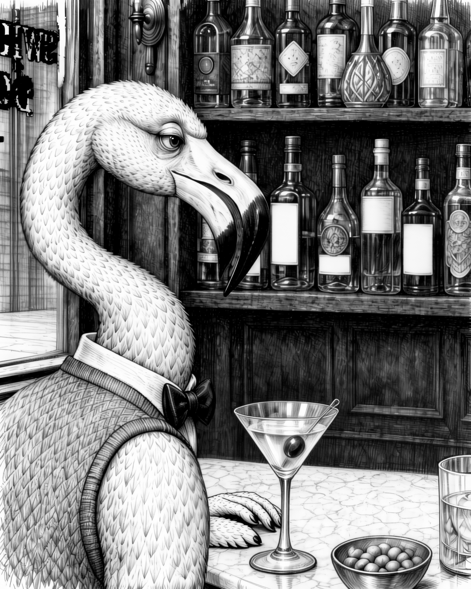

**The ask.** The founder: 'its a flamingo you did a terrible job you must perfect each character.' Last night's cast renders came back as swans and geese because they were drawn by room-part.py on sensenova-u1.5 from crude block-ins. First: rebuild the study rig on the HOUSE recipe - the model and prompt that made the plates Rick approved - and prove it end to end on Drew.

**The thinking.** The approved plates were never drawn from block-ins. They were drawn by local/qwen-image-edit-2511 through lib/generate.ts: an EDIT model handed a finished picture as Picture 1, the character's own portrait tile after it, and a short numbered list of changes, at the Lightning 8-step cfg-1 setting recorded in canon/vision/studies/duo-behind.txt (seed 41). So scripts/cast-study.py reproduces that recipe in Python for one character at a time. Picture 1 is a chest-up crop of Drew alone cut straight out of canon/plates/duo.png - the plate Rick APPROVED - so the model has nothing to invent about the camera, the crop or the room; Picture 2 is canon/vision/studies/drew.png, the same portrait tile VISION_REFS sends. The prompt is localPrompt's own shape: the Picture roster, the numbered EDITS (screen off, slate wiped, bottles filled and unlettered, redraw the character to Picture 2, the business, everything-else-stays), then the LOCAL fence of canon/MASTER-PROMPT.md re-pointed from two seated gentlemen to one - by exact-string replacement into canon's own sentences, with every miss recorded in the sidecar so a canon rewrite shows up as data instead of quietly drawing the duo again.

**Settings.** scripts/cast-study.py --character drew --seed 41 | local/qwen-image-edit-2511 via POST 127.0.0.1:8000/api/generate | fast Lightning: 8 steps, cfg 1, euler/simple, shift 3.0 | 4:5 -> 1344x1680 | 2 references (canon/plates/duo.png crop 140,540,640,800; canon/vision/studies/drew.png), grayscaled, normalised, capped at 1024 wide, JPEG q90, inline data URIs | LOCAL_NEGATIVE verbatim | 46.8s

**Prompt.** [prompts/032-drew-character-study-round-1-seed-41-the-study-rig-proves-out-the-bill-does-not.prompt.txt](prompts/032-drew-character-study-round-1-seed-41-the-study-rig-proves-out-the-bill-does-not.prompt.txt)

**Verdict.** RIG PASSES, CHARACTER FAILS. The rig is right: one figure, no second bird, the engraved pen and the full tonal range held, every bottle label blank, no stray lettering on the shelf, the bow tie, collar band, knitted vest and feathered hand all present, the martini and nut bowl on the marble. Drew himself is a REJECT and the founder's word is fair. (1) THE BILL is the fatal fault - heavy, deeply hooked, curling to a point below the jaw with the black filling the whole lower half. A flamingo's bill is shallow, kinked once and downturned only at the end, with the black on the OUTER THIRD. This reads vulture, not flamingo. (2) THE NECK has no S-curve: it is thick and short, and the head sits on it as a bulb. The one reversal the founder asked for is absent. (3) THE PLUMAGE is drawn in scale-like leaf strokes, not the fine dash-strokes of the house line. (4) The camera crept much closer than Picture 1's crop, so the head fills the frame and the sweater vest is half out of it. (5) Two small strays: a fragment of mirrored window lettering at top-left and an extra glass at bottom-right. What IS right and must be kept: the eye - heavy-lidded, visible white, dark iris with a catchlight, warm and human. Round 2 must attack the bill and the neck by name in the EDITS and pull the camera back.

*Logged 08:48.*

---

## 033. Drew round 1 seed 41 the room comes back the bill still hooks

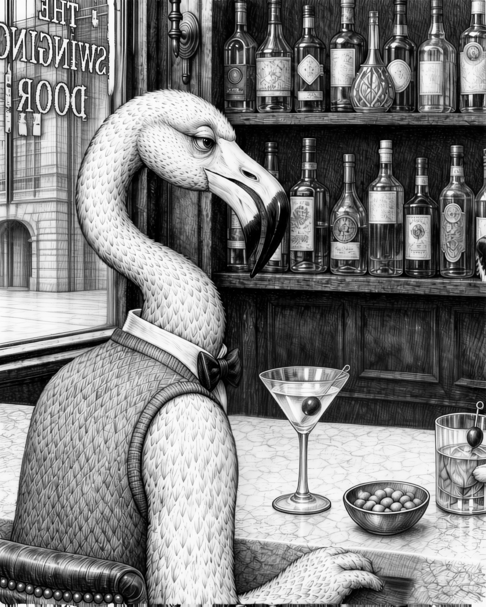

**The ask.** The founder: "its a flamingo you did a terrible job you must perfect each character." Round 1 of the Drew perfecting loop: make him read as a FLAMINGO — the S-curved neck with one reversal, the shallow downturned bill with the black OUTER THIRD, plumage in fine dash-strokes, the heavy-lidded human eye — in the knitted vest, collar and black bow tie, at the marble.

**The thinking.** The rig test (image 032) proved the pipeline and failed the bird, and reading the two references side by side said why: Picture 1 was the fault. The crop of the approved plate duo.png that the study feeds the model as 'this IS the picture being edited' ITSELF draws a deep scimitar bill with black filling the lower jaw, a thick straight neck and scale-like plumage — and it puts that wrong head at full size exactly where the model must draw a head. The identity tile canon/vision/studies/drew.png is the one that is right. So the model was obeying us. Three changes this round, no code rewrite of the recipe: (1) RE-POINTED PICTURE 1 from box (140,540,640,800) to (40,500,780,975) — a wider, further-back crop that carries the whole room (window and its mirrored name, both back-bar shelves, marble, martini, nut bowl, chair) and shrinks the wrong head to a fraction of the frame, which also answers the round-0 fault of the camera creeping in; (2) ADDED A THIRD REFERENCE — a large close cut of the CORRECT head, bill and neck from drew.png (box 250,30,560,600) — so the bill has an authority at head scale, and relabelled Picture 1 to say in words that it is the authority on the ROOM ONLY and that its bird's hooked black-jawed bill is the fault being corrected; (3) NAMED THE THREE FAULTS AS AN EDIT LINE — the bill shallow with ONE kink and solid black on the OUTER THIRD only and never curling below the jaw, the neck an S with ONE reversal, the plumage rows of fine short dash-strokes — plus a pose line pinning the camera at Picture 1's distance. cast-study.py gained --picture1-box, --picture1-label and --ref to do this without editing canon. Six seeds on the house recipe.

**Settings.** local/qwen-image-edit-2511, provider local, 4:5 -> 1344x1680, fast Lightning 8 steps cfg 1.0 euler/simple shift 3.0, 3 references (Picture 1 = canon/plates/duo.png box 40,500,780,975; Picture 2 = canon/vision/studies/drew.png; Picture 3 = drew.png box 250,30,560,600), LOCAL_NEGATIVE, tag study-drew-r1, seeds 41/7/21/33/44/55, ~47 s each. Zero canon-drift misses. scripts/cast-study.py

**Prompt.** [prompts/033-drew-round-1-seed-41-the-room-comes-back-the-bill-still-hooks.prompt.txt](prompts/033-drew-round-1-seed-41-the-room-comes-back-the-bill-still-hooks.prompt.txt)

**Verdict.** REJECT on the bill, PASS on the rig. The wider Picture 1 worked: the camera is back at the plate's distance, the window carries a clean mirrored THE SWINGING DOOR, both back-bar shelves, the marble, the martini and the nut bowl are all in frame, and the neck now has a real S with one reversal. But the bill is still the round-0 fault at three-quarter strength — the black is a long wedge down the lower mandible curling to a point below the jaw, not a cap on the outer third. Plumage still reads as leaf-shaped scales, not dash-strokes. Bottle labels carry pseudo-marks instead of blank paper.

*Logged 08:59.*

---

## 034. Drew round 1 seed 7 the shallowest bill but the blackest jaw

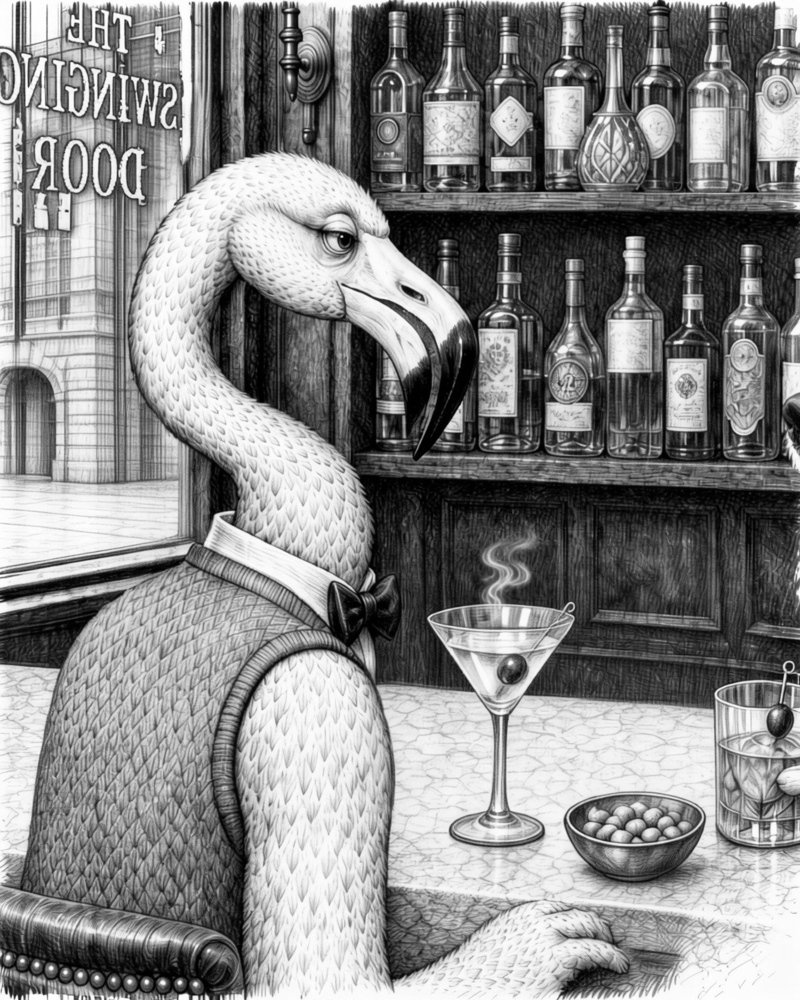

**The ask.** The founder: "its a flamingo you did a terrible job you must perfect each character." Round 1 of the Drew perfecting loop: make him read as a FLAMINGO — the S-curved neck with one reversal, the shallow downturned bill with the black OUTER THIRD, plumage in fine dash-strokes, the heavy-lidded human eye — in the knitted vest, collar and black bow tie, at the marble.

**The thinking.** The rig test (image 032) proved the pipeline and failed the bird, and reading the two references side by side said why: Picture 1 was the fault. The crop of the approved plate duo.png that the study feeds the model as 'this IS the picture being edited' ITSELF draws a deep scimitar bill with black filling the lower jaw, a thick straight neck and scale-like plumage — and it puts that wrong head at full size exactly where the model must draw a head. The identity tile canon/vision/studies/drew.png is the one that is right. So the model was obeying us. Three changes this round, no code rewrite of the recipe: (1) RE-POINTED PICTURE 1 from box (140,540,640,800) to (40,500,780,975) — a wider, further-back crop that carries the whole room (window and its mirrored name, both back-bar shelves, marble, martini, nut bowl, chair) and shrinks the wrong head to a fraction of the frame, which also answers the round-0 fault of the camera creeping in; (2) ADDED A THIRD REFERENCE — a large close cut of the CORRECT head, bill and neck from drew.png (box 250,30,560,600) — so the bill has an authority at head scale, and relabelled Picture 1 to say in words that it is the authority on the ROOM ONLY and that its bird's hooked black-jawed bill is the fault being corrected; (3) NAMED THE THREE FAULTS AS AN EDIT LINE — the bill shallow with ONE kink and solid black on the OUTER THIRD only and never curling below the jaw, the neck an S with ONE reversal, the plumage rows of fine short dash-strokes — plus a pose line pinning the camera at Picture 1's distance. cast-study.py gained --picture1-box, --picture1-label and --ref to do this without editing canon. Six seeds on the house recipe.

**Settings.** local/qwen-image-edit-2511, provider local, 4:5 -> 1344x1680, fast Lightning 8 steps cfg 1.0 euler/simple shift 3.0, 3 references (Picture 1 = canon/plates/duo.png box 40,500,780,975; Picture 2 = canon/vision/studies/drew.png; Picture 3 = drew.png box 250,30,560,600), LOCAL_NEGATIVE, tag study-drew-r1, seeds 41/7/21/33/44/55, ~47 s each. Zero canon-drift misses. scripts/cast-study.py

**Prompt.** [prompts/034-drew-round-1-seed-7-the-shallowest-bill-but-the-blackest-jaw.prompt.txt](prompts/034-drew-round-1-seed-7-the-shallowest-bill-but-the-blackest-jaw.prompt.txt)

**Verdict.** REJECT. The best bill DEPTH of the six — shallow, one clean kink — but the black is the worst of the six: a heavy hooked wedge running most of the lower mandible and hanging well below the jaw. Stray: wisps of smoke rising off the martini, which nothing in the prompt asked for. Neck S is good. Eye is right.

*Logged 08:59.*

---

## 035. Drew round 1 seed 21 the deep scimitar and a forbidden shirt cuff

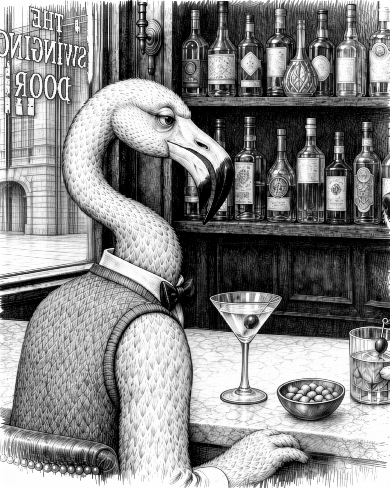

**The ask.** The founder: "its a flamingo you did a terrible job you must perfect each character." Round 1 of the Drew perfecting loop: make him read as a FLAMINGO — the S-curved neck with one reversal, the shallow downturned bill with the black OUTER THIRD, plumage in fine dash-strokes, the heavy-lidded human eye — in the knitted vest, collar and black bow tie, at the marble.

**The thinking.** The rig test (image 032) proved the pipeline and failed the bird, and reading the two references side by side said why: Picture 1 was the fault. The crop of the approved plate duo.png that the study feeds the model as 'this IS the picture being edited' ITSELF draws a deep scimitar bill with black filling the lower jaw, a thick straight neck and scale-like plumage — and it puts that wrong head at full size exactly where the model must draw a head. The identity tile canon/vision/studies/drew.png is the one that is right. So the model was obeying us. Three changes this round, no code rewrite of the recipe: (1) RE-POINTED PICTURE 1 from box (140,540,640,800) to (40,500,780,975) — a wider, further-back crop that carries the whole room (window and its mirrored name, both back-bar shelves, marble, martini, nut bowl, chair) and shrinks the wrong head to a fraction of the frame, which also answers the round-0 fault of the camera creeping in; (2) ADDED A THIRD REFERENCE — a large close cut of the CORRECT head, bill and neck from drew.png (box 250,30,560,600) — so the bill has an authority at head scale, and relabelled Picture 1 to say in words that it is the authority on the ROOM ONLY and that its bird's hooked black-jawed bill is the fault being corrected; (3) NAMED THE THREE FAULTS AS AN EDIT LINE — the bill shallow with ONE kink and solid black on the OUTER THIRD only and never curling below the jaw, the neck an S with ONE reversal, the plumage rows of fine short dash-strokes — plus a pose line pinning the camera at Picture 1's distance. cast-study.py gained --picture1-box, --picture1-label and --ref to do this without editing canon. Six seeds on the house recipe.

**Settings.** local/qwen-image-edit-2511, provider local, 4:5 -> 1344x1680, fast Lightning 8 steps cfg 1.0 euler/simple shift 3.0, 3 references (Picture 1 = canon/plates/duo.png box 40,500,780,975; Picture 2 = canon/vision/studies/drew.png; Picture 3 = drew.png box 250,30,560,600), LOCAL_NEGATIVE, tag study-drew-r1, seeds 41/7/21/33/44/55, ~47 s each. Zero canon-drift misses. scripts/cast-study.py

**Prompt.** [prompts/035-drew-round-1-seed-21-the-deep-scimitar-and-a-forbidden-shirt-cuff.prompt.txt](prompts/035-drew-round-1-seed-21-the-deep-scimitar-and-a-forbidden-shirt-cuff.prompt.txt)

**Verdict.** REJECT, the weakest of the six. Deepest scimitar bill of the round with black over the whole lower half — the exact fault named in the edits. Second fault, and a hard one from the bible: a white shirt CUFF closes the wrist, so the arm reads as a sleeve. The armhole of the sweater vest is meant to be the only edge anywhere on that arm. Ragged drawn border on the frame edges.

*Logged 08:59.*

---

## 036. Drew round 1 seed 33 middling bill clean staging

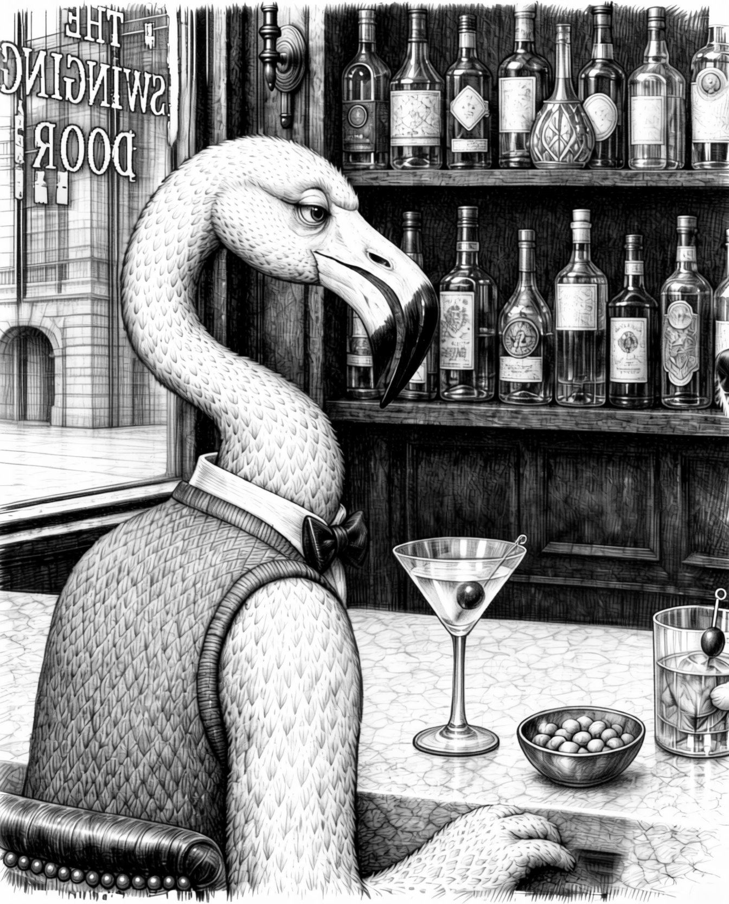

**The ask.** The founder: "its a flamingo you did a terrible job you must perfect each character." Round 1 of the Drew perfecting loop: make him read as a FLAMINGO — the S-curved neck with one reversal, the shallow downturned bill with the black OUTER THIRD, plumage in fine dash-strokes, the heavy-lidded human eye — in the knitted vest, collar and black bow tie, at the marble.

**The thinking.** The rig test (image 032) proved the pipeline and failed the bird, and reading the two references side by side said why: Picture 1 was the fault. The crop of the approved plate duo.png that the study feeds the model as 'this IS the picture being edited' ITSELF draws a deep scimitar bill with black filling the lower jaw, a thick straight neck and scale-like plumage — and it puts that wrong head at full size exactly where the model must draw a head. The identity tile canon/vision/studies/drew.png is the one that is right. So the model was obeying us. Three changes this round, no code rewrite of the recipe: (1) RE-POINTED PICTURE 1 from box (140,540,640,800) to (40,500,780,975) — a wider, further-back crop that carries the whole room (window and its mirrored name, both back-bar shelves, marble, martini, nut bowl, chair) and shrinks the wrong head to a fraction of the frame, which also answers the round-0 fault of the camera creeping in; (2) ADDED A THIRD REFERENCE — a large close cut of the CORRECT head, bill and neck from drew.png (box 250,30,560,600) — so the bill has an authority at head scale, and relabelled Picture 1 to say in words that it is the authority on the ROOM ONLY and that its bird's hooked black-jawed bill is the fault being corrected; (3) NAMED THE THREE FAULTS AS AN EDIT LINE — the bill shallow with ONE kink and solid black on the OUTER THIRD only and never curling below the jaw, the neck an S with ONE reversal, the plumage rows of fine short dash-strokes — plus a pose line pinning the camera at Picture 1's distance. cast-study.py gained --picture1-box, --picture1-label and --ref to do this without editing canon. Six seeds on the house recipe.

**Settings.** local/qwen-image-edit-2511, provider local, 4:5 -> 1344x1680, fast Lightning 8 steps cfg 1.0 euler/simple shift 3.0, 3 references (Picture 1 = canon/plates/duo.png box 40,500,780,975; Picture 2 = canon/vision/studies/drew.png; Picture 3 = drew.png box 250,30,560,600), LOCAL_NEGATIVE, tag study-drew-r1, seeds 41/7/21/33/44/55, ~47 s each. Zero canon-drift misses. scripts/cast-study.py

**Prompt.** [prompts/036-drew-round-1-seed-33-middling-bill-clean-staging.prompt.txt](prompts/036-drew-round-1-seed-33-middling-bill-clean-staging.prompt.txt)

**Verdict.** REJECT, mid-pack. Bill shallower than 41 and 21 with the black starting near halfway, still hooking below the jaw. Neck S clear and correct. Staging and wardrobe all present and clean; no cuff. Ragged drawn border at the frame edges. Plumage still scale-shaped.

*Logged 08:59.*

---

## 037. Drew round 1 seed 44 second best bill and the best head proportion

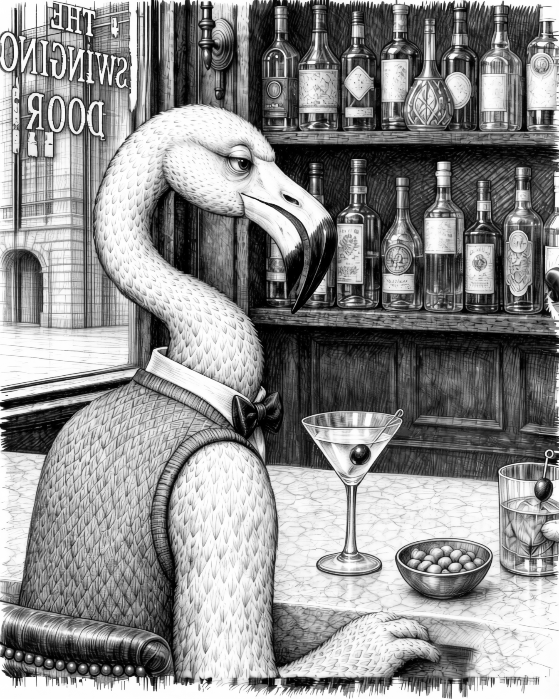

**The ask.** The founder: "its a flamingo you did a terrible job you must perfect each character." Round 1 of the Drew perfecting loop: make him read as a FLAMINGO — the S-curved neck with one reversal, the shallow downturned bill with the black OUTER THIRD, plumage in fine dash-strokes, the heavy-lidded human eye — in the knitted vest, collar and black bow tie, at the marble.

**The thinking.** The rig test (image 032) proved the pipeline and failed the bird, and reading the two references side by side said why: Picture 1 was the fault. The crop of the approved plate duo.png that the study feeds the model as 'this IS the picture being edited' ITSELF draws a deep scimitar bill with black filling the lower jaw, a thick straight neck and scale-like plumage — and it puts that wrong head at full size exactly where the model must draw a head. The identity tile canon/vision/studies/drew.png is the one that is right. So the model was obeying us. Three changes this round, no code rewrite of the recipe: (1) RE-POINTED PICTURE 1 from box (140,540,640,800) to (40,500,780,975) — a wider, further-back crop that carries the whole room (window and its mirrored name, both back-bar shelves, marble, martini, nut bowl, chair) and shrinks the wrong head to a fraction of the frame, which also answers the round-0 fault of the camera creeping in; (2) ADDED A THIRD REFERENCE — a large close cut of the CORRECT head, bill and neck from drew.png (box 250,30,560,600) — so the bill has an authority at head scale, and relabelled Picture 1 to say in words that it is the authority on the ROOM ONLY and that its bird's hooked black-jawed bill is the fault being corrected; (3) NAMED THE THREE FAULTS AS AN EDIT LINE — the bill shallow with ONE kink and solid black on the OUTER THIRD only and never curling below the jaw, the neck an S with ONE reversal, the plumage rows of fine short dash-strokes — plus a pose line pinning the camera at Picture 1's distance. cast-study.py gained --picture1-box, --picture1-label and --ref to do this without editing canon. Six seeds on the house recipe.

**Settings.** local/qwen-image-edit-2511, provider local, 4:5 -> 1344x1680, fast Lightning 8 steps cfg 1.0 euler/simple shift 3.0, 3 references (Picture 1 = canon/plates/duo.png box 40,500,780,975; Picture 2 = canon/vision/studies/drew.png; Picture 3 = drew.png box 250,30,560,600), LOCAL_NEGATIVE, tag study-drew-r1, seeds 41/7/21/33/44/55, ~47 s each. Zero canon-drift misses. scripts/cast-study.py

**Prompt.** [prompts/037-drew-round-1-seed-44-second-best-bill-and-the-best-head-proportion.prompt.txt](prompts/037-drew-round-1-seed-44-second-best-bill-and-the-best-head-proportion.prompt.txt)

**Verdict.** REJECT but close — the runner-up. Black starts around 55 percent of the bill with the shallowest downturn after 55, and the head sits small and correct on the neck. Neck S is right, eye is right, vest ribbing and armhole are right, no cuff. Faults: the black still runs past the outer third and tips below the jaw, plumage is scale-shaped, and a ragged drawn border frames all four sides.

*Logged 08:59.*

---

## 038. Drew round 1 seed 55 the best flamingo of the round

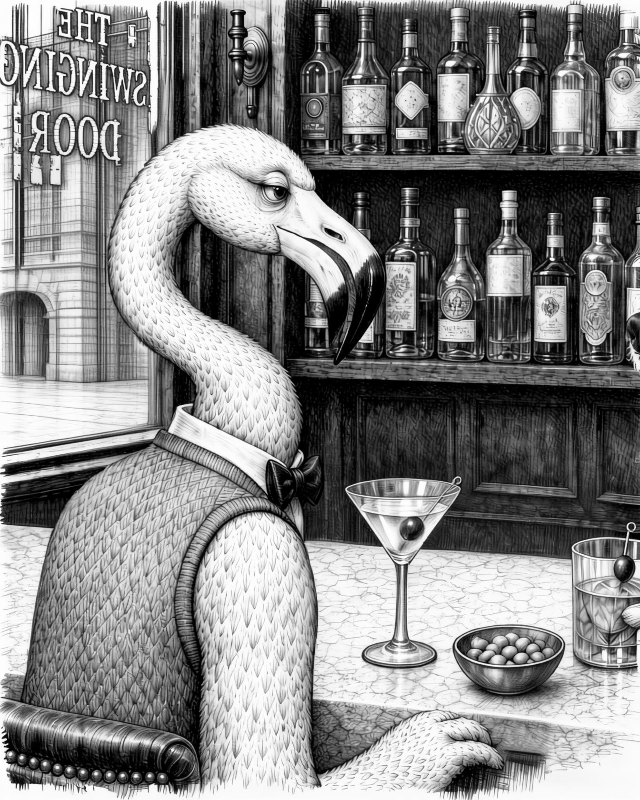

**The ask.** The founder: "its a flamingo you did a terrible job you must perfect each character." Round 1 of the Drew perfecting loop: make him read as a FLAMINGO — the S-curved neck with one reversal, the shallow downturned bill with the black OUTER THIRD, plumage in fine dash-strokes, the heavy-lidded human eye — in the knitted vest, collar and black bow tie, at the marble.

**The thinking.** The rig test (image 032) proved the pipeline and failed the bird, and reading the two references side by side said why: Picture 1 was the fault. The crop of the approved plate duo.png that the study feeds the model as 'this IS the picture being edited' ITSELF draws a deep scimitar bill with black filling the lower jaw, a thick straight neck and scale-like plumage — and it puts that wrong head at full size exactly where the model must draw a head. The identity tile canon/vision/studies/drew.png is the one that is right. So the model was obeying us. Three changes this round, no code rewrite of the recipe: (1) RE-POINTED PICTURE 1 from box (140,540,640,800) to (40,500,780,975) — a wider, further-back crop that carries the whole room (window and its mirrored name, both back-bar shelves, marble, martini, nut bowl, chair) and shrinks the wrong head to a fraction of the frame, which also answers the round-0 fault of the camera creeping in; (2) ADDED A THIRD REFERENCE — a large close cut of the CORRECT head, bill and neck from drew.png (box 250,30,560,600) — so the bill has an authority at head scale, and relabelled Picture 1 to say in words that it is the authority on the ROOM ONLY and that its bird's hooked black-jawed bill is the fault being corrected; (3) NAMED THE THREE FAULTS AS AN EDIT LINE — the bill shallow with ONE kink and solid black on the OUTER THIRD only and never curling below the jaw, the neck an S with ONE reversal, the plumage rows of fine short dash-strokes — plus a pose line pinning the camera at Picture 1's distance. cast-study.py gained --picture1-box, --picture1-label and --ref to do this without editing canon. Six seeds on the house recipe.

**Settings.** local/qwen-image-edit-2511, provider local, 4:5 -> 1344x1680, fast Lightning 8 steps cfg 1.0 euler/simple shift 3.0, 3 references (Picture 1 = canon/plates/duo.png box 40,500,780,975; Picture 2 = canon/vision/studies/drew.png; Picture 3 = drew.png box 250,30,560,600), LOCAL_NEGATIVE, tag study-drew-r1, seeds 41/7/21/33/44/55, ~47 s each. Zero canon-drift misses. scripts/cast-study.py

**Prompt.** [prompts/038-drew-round-1-seed-55-the-best-flamingo-of-the-round.prompt.txt](prompts/038-drew-round-1-seed-55-the-best-flamingo-of-the-round.prompt.txt)

**Verdict.** BEST OF THE ROUND, still a reject against the founder's bar. Closest to a real flamingo: the longest pale upper mandible, the shallowest downturn, the black wedge starting furthest out and the least hook of the six; the neck reads as a true S with one reversal, leaning back off the shoulders and forward into the head; the eye is exactly right — heavy-lidded, visible white, dark iris, one catchlight, warm and unhurried; the arm runs unbroken feathered from the vest armhole to the hand with NO cuff; collar band, black bow tie, ribbed V-neck vest, martini, nut bowl and mirrored window name all correct. What still fails: the black is roughly the outer 40-45 percent and still tips just below the jaw rather than capping the outer third, and the plumage is still shingled leaf-plates instead of rows of fine dash-strokes.

*Logged 08:59.*

---

## 039. Drew round 1 contact sheet six seeds beside the old kit tiles

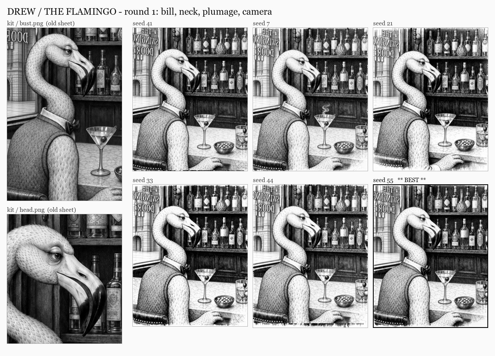

**The ask.** The founder: "its a flamingo you did a terrible job you must perfect each character." Round 1 of the Drew perfecting loop: make him read as a FLAMINGO — the S-curved neck with one reversal, the shallow downturned bill with the black OUTER THIRD, plumage in fine dash-strokes, the heavy-lidded human eye — in the knitted vest, collar and black bow tie, at the marble.

**The thinking.** The rig test (image 032) proved the pipeline and failed the bird, and reading the two references side by side said why: Picture 1 was the fault. The crop of the approved plate duo.png that the study feeds the model as 'this IS the picture being edited' ITSELF draws a deep scimitar bill with black filling the lower jaw, a thick straight neck and scale-like plumage — and it puts that wrong head at full size exactly where the model must draw a head. The identity tile canon/vision/studies/drew.png is the one that is right. So the model was obeying us. Three changes this round, no code rewrite of the recipe: (1) RE-POINTED PICTURE 1 from box (140,540,640,800) to (40,500,780,975) — a wider, further-back crop that carries the whole room (window and its mirrored name, both back-bar shelves, marble, martini, nut bowl, chair) and shrinks the wrong head to a fraction of the frame, which also answers the round-0 fault of the camera creeping in; (2) ADDED A THIRD REFERENCE — a large close cut of the CORRECT head, bill and neck from drew.png (box 250,30,560,600) — so the bill has an authority at head scale, and relabelled Picture 1 to say in words that it is the authority on the ROOM ONLY and that its bird's hooked black-jawed bill is the fault being corrected; (3) NAMED THE THREE FAULTS AS AN EDIT LINE — the bill shallow with ONE kink and solid black on the OUTER THIRD only and never curling below the jaw, the neck an S with ONE reversal, the plumage rows of fine short dash-strokes — plus a pose line pinning the camera at Picture 1's distance. cast-study.py gained --picture1-box, --picture1-label and --ref to do this without editing canon. Six seeds on the house recipe.

**Settings.** local/qwen-image-edit-2511, provider local, 4:5 -> 1344x1680, fast Lightning 8 steps cfg 1.0 euler/simple shift 3.0, 3 references (Picture 1 = canon/plates/duo.png box 40,500,780,975; Picture 2 = canon/vision/studies/drew.png; Picture 3 = drew.png box 250,30,560,600), LOCAL_NEGATIVE, tag study-drew-r1, seeds 41/7/21/33/44/55, ~47 s each. Zero canon-drift misses. scripts/cast-study.py

**Verdict.** The round in one picture, the six renders at 420 px beside the character kit's own bust.png and head.png. The kit tiles are on the sheet on purpose: they are the OLD drawing, and they show the founder's complaint at its source — the kit's bill is the deep black-jawed hook, and every render on the sheet is further from it than the kit is. Progress this round is real and partial: camera, room, neck, eye, wardrobe and the no-cuff rule are settled; the bill's black and the plumage stroke are not. Seed 55 is the pick, seed 44 the runner-up.

*Logged 08:59.*

---

## 040. Drew round 3 - the root-cause fix: a composited Picture 1 with the correct head pasted on

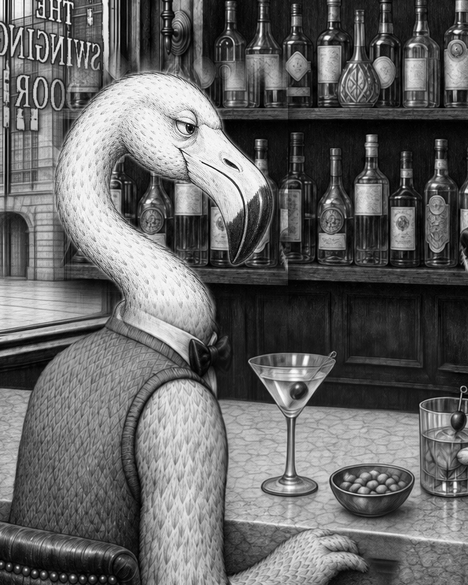

**The ask.** The founder: 'its a flamingo you did a terrible job you must perfect each character.' Round 2's judges found six seeds out of six still drawing a hooked, black-jawed bill and a hunched neck, and concluded the prose was losing to the picture.

**The thinking.** Qwen-image-edit copies Picture 1's silhouette. Picture 1 was a crop of the approved plate, and that crop CONTAINS all three faults - the hooked bill with black filling the lower half, the thick J-neck, the scale-like plumage - so every seed copied them and no amount of wording won. So Picture 1 was rebuilt in PIL before the call (scripts/make-drew-picture1.py): the plate still supplies the room, the camera, the crop and the light, but Drew's head, bill and S-neck are cut out of the official portrait canon/vision/studies/drew.png as a filled silhouette, scaled to 0.72, and pasted onto his collar; the old head is painted out with clean back bar copied from further right on the same plate. The seam is left crude on purpose - the edit now has to blend a correct head instead of inventing one.

**Settings.** PIL/scipy composite, no model call. Plate crop duo.png @ 40,500,780x975; head cut drew.png @ 170,30-830,660; scale 0.72, offset (10,105); erase 108,118-482,502 covered from +300px right.

**Verdict.** Works. The bill has one clean kink with the black cap on the outer third, the neck is a true S with one reversal and the head is carried high with daylight under the jaw. This one change fixed the neck in ALL SIX renders that followed.

*Logged 09:20.*

---

## 041. Drew round 3 seed 55 - the best flamingo yet: right bill, right neck, knitted vest, human hands

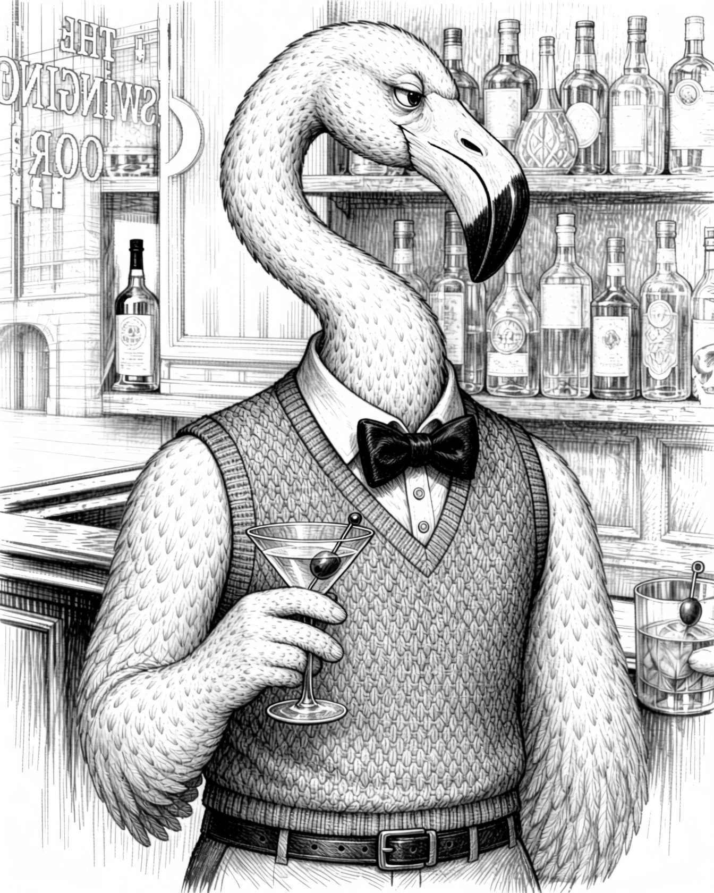

**The ask.** Perfect Drew: the S-curved neck with ONE reversal, the heavy downturned bill with the black outer third, the knitted sweater vest over a collared shirt with the small black bow tie, the heavy-lidded human eye, friendly and professional.

**The thinking.** Composited Picture 1 (the correct head already on the plate), Picture 2 the official portrait, and a NEW Picture 3: a bill-only tile cut at drew.png 520,130,310x390 - the eye and the whole bill, so the black cap reads as the authority instead of being a fraction of a mostly-neck tile. Seven new numbered EDITs off the judges' notes: the bill (one abrupt bend two thirds along, blunt not hooked, depth under a third of the length, black capping BOTH mandibles, nostril a thin slit), the S-neck, a turn toward the camera, the knitted wardrobe, the four-fingered feathered hands, the counter and props, and the blank labels.

**Settings.** local/qwen-image-edit-2511 via POST /api/generate, 4:5 -> 1344x1680, fast Lightning 8 steps cfg 1.0 euler/simple shift 3.0, 3 references, seed 55, 48.6s. Prompt variant A.

**Verdict.** The best Drew the studio has drawn. PASS on every character fault the founder named: the bill is a flamingo's - straight and pale for two thirds, one clean kink, a blunt downturn, the solid black a cap over the outer third covering both mandibles and wrapping the tip, no black jaw stripe, no hook. The neck is a true S with one reversal, slim, head carried high. The vest is genuinely KNITTED with a ribbed V band, ribbed armholes and visible stitches over a collared shirt with placket, buttons and the bow tie KNOT facing us. The hands have four fingers and an opposed thumb, no claws. The eye is warm and huggable. FAILS on staging, not on character: the turn-to-camera edit pulled him off his stool so the marble counter has left the picture, he holds the martini instead of resting his hand on the slab, the belt and trousers show, one stray rocks glass remains at frame-right, and the arm plumage is still leaf-shaped rather than dash-strokes.

*Logged 09:20.*

---

## 042. Drew round 3 contact sheet - six seeds against the old kit tiles, and the staging-versus-character trade

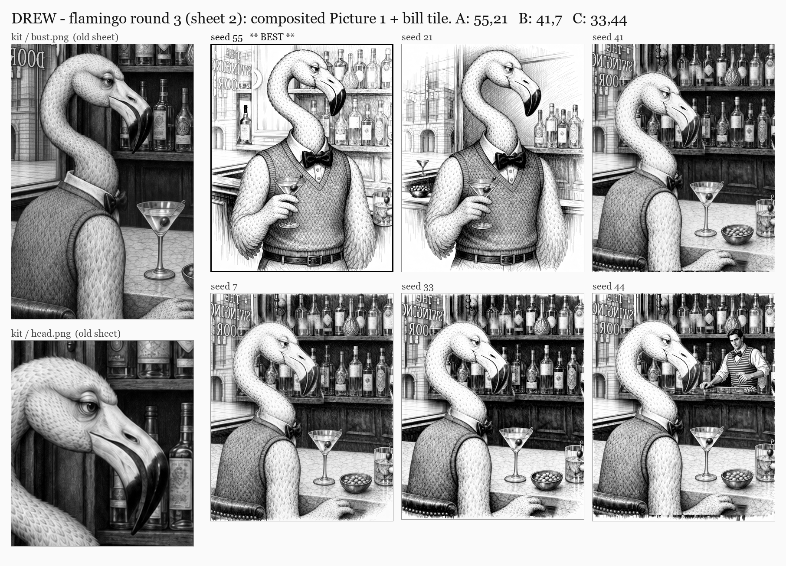

**The ask.** Render six seeds for Drew, look at every one, name the best, and show them beside the kit's bust and head tiles.

**The thinking.** Seeds 55 and 21 ran prompt variant A. Seed 41 came back as three figures on a sketchbook page, so variant B dropped the words 'paste-up', 'cut in', 'seam' and 'unfinished' from Picture 1's label - that language was inviting a collage - and bolted him back to the marble; 41 and 7 were re-shot on it. But B told the model Picture 1 was FINAL, so it copied the plate wholesale and the bill drifted heron-ish again. Variant C (33, 44) put A's forceful turn and an ACTIVE 'redraw the bill from Picture 3' back on top of B's counter anchor.

**Settings.** Six renders at 420px beside canon/characters/flamingo/kit bust.png and head.png. All six: local/qwen-image-edit-2511, 4:5 1344x1680, fast 8-step cfg 1.0, 3 references, ~49s each.

**Verdict.** BEST IS SEED 55. Read against the two kit tiles frame-left - which still carry the old hooked black-jawed bill and the hunched neck - all six new renders have a proper S-neck, so the composited Picture 1 fixed that outright. The bill only comes out right when the model is pushed to REDRAW the character (variant A, seeds 55 and 21); whenever the prompt protects Picture 1's staging (B and C, seeds 41/7/33/44) the room comes back correctly but the bill re-absorbs the plate's hook. Seed 44 grew a human bartender and seed 41's first take grew two extra figures - the negative prompt cannot catch that, because at cfg 1.0 the fast Lightning pass never reads it. Staging and character are in direct competition at 8 steps and the next round has to settle it.

*Logged 09:20.*

---

## 043. Drew round 4 reference fix 1 - the bill built as a flat two-tone diagram

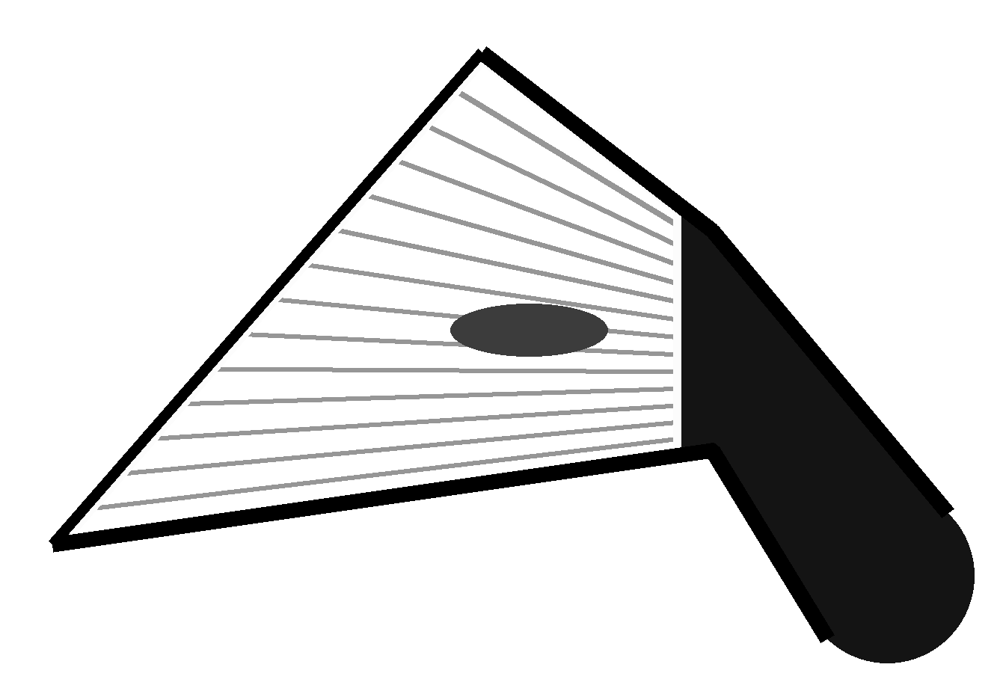

**The ask.** Round 4 of perfecting DREW. The judges' fixes after round 3: re-cut Picture 2 to head-and-shoulders so the belt, the trousers and the hand on the martini stem cannot be copied back out of it; build a flat two-tone bill DIAGRAM instead of using a photo-crop as the bill authority; repaint the bill in the composited Picture 1 and delete the sentence that was protecting the old one; re-cut kit/bust.png and kit/head.png; replace the black-cap, bill-shape, bill-size, eye, plumage and staging paragraphs; add the new negatives; split the work into a staging pass and a narrow bill-repair pass; carry seeds 55 and 21, drop 41, 7, 33 and 44.

**The thinking.** The judges ordered a DIAGRAM rather than a photo-crop as the bill authority, because a diagram cannot be misread. scripts/make-drew-bill.py holds the geometry once: a pale shank dead straight for two thirds, ONE sharp downward corner, then straight to a blunt rounded end, with a single vertical line crossing the WHOLE bill at that corner and everything outboard of it solid black together - top ridge, both sides, lower jaw and wrapped tip. Nothing is lettered on it: the model letters whatever it is shown. The same geometry drives the repaint of the portrait, so the diagram and the tiles cannot drift.

**Settings.** Drawn in PIL, no model. Geometry: eye-to-tip 168 px against a 166 px skull; depth at the corner 42 px, under a third of eye-to-tip.

**Verdict.** Built as ordered. NOT USED AS A REFERENCE IN THE END - see the render below where the model drew it as an object in the room.

*Logged 10:09.*

---

## 044. Drew round 4 reference fix 2 - Picture 1 rebuilt with the corrected bill and one drink

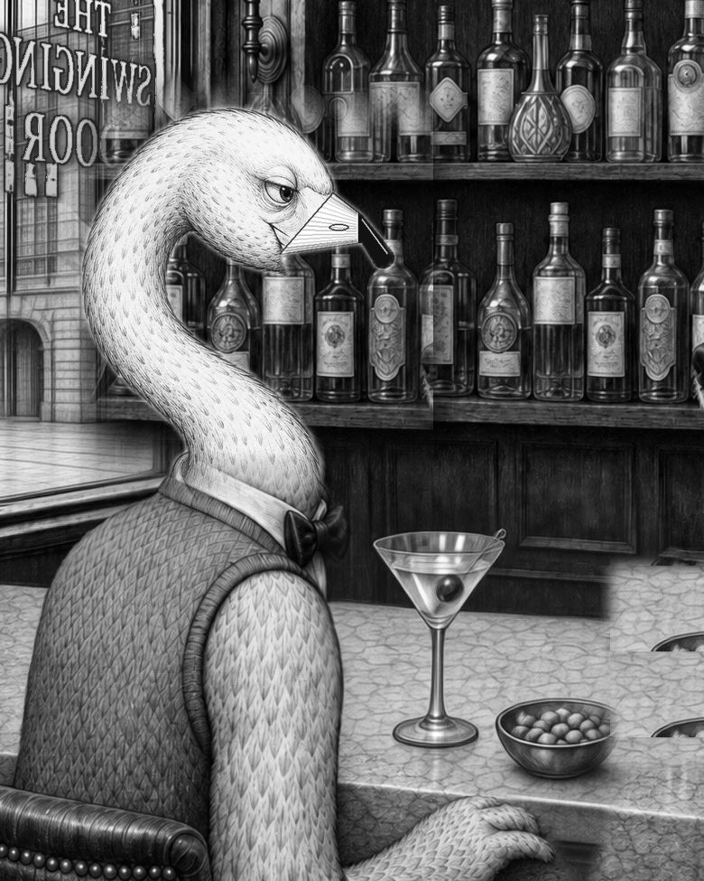

**The ask.** Round 4 of perfecting DREW. The judges' fixes after round 3: re-cut Picture 2 to head-and-shoulders so the belt, the trousers and the hand on the martini stem cannot be copied back out of it; build a flat two-tone bill DIAGRAM instead of using a photo-crop as the bill authority; repaint the bill in the composited Picture 1 and delete the sentence that was protecting the old one; re-cut kit/bust.png and kit/head.png; replace the black-cap, bill-shape, bill-size, eye, plumage and staging paragraphs; add the new negatives; split the work into a staging pass and a narrow bill-repair pass; carry seeds 55 and 21, drop 41, 7, 33 and 44.

**The thinking.** Before changing a word I read canon/vision/studies/drew.png at full size, because three rounds of prose had failed against it. THE OFFICIAL PORTRAIT ITSELF CARRIES ALL THREE REJECTED FAULTS: a smoothly curving hooked bill whose black runs back along the LOWER JAW while the upper mandible stays pale to the tip, a heavy brow over a stern narrowed eye, and leaf-plate plumage. That tile is handed to the model with 'copy THIS bird identically', so every seed copied the defect faithfully and no wording could outvote it. This round the PICTURES change, not just the words. Picture 1 is the approved plate crop with the head pasted on (make-drew-picture1.py), and it now takes that head from the REPAIRED portrait instead of the defective one. Two more things had to be true of it: the rocks glass at the right edge is painted out with clean marble, because 'EXACTLY ONE DRINK' loses every argument with a picture of two drinks; and the round-3 sentence 'HIS HEAD, HIS BILL AND HIS S-CURVED NECK ARE ALREADY CORRECT HERE' is deleted from its label, as ordered - it was protecting the defect. Built by scripts/make-drew-picture1-round4.py.

**Settings.** PIL composite, no model. 780x975, head at scale 0.72 offset (10,105).

**Verdict.** The strongest lever in the round. For the first time the reference itself shows the right bill, the marble across the chest, no belt, no trousers, the hand flat on the slab and exactly one drink.

*Logged 10:09.*

---

## 045. Drew round 4 pass 1 seed 55

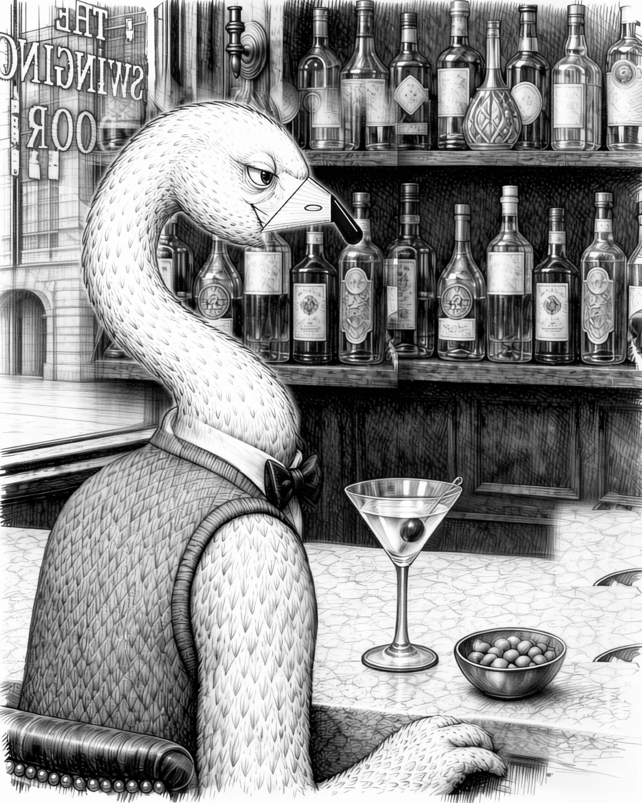

**The ask.** Round 4 of perfecting DREW. The judges' fixes after round 3: re-cut Picture 2 to head-and-shoulders so the belt, the trousers and the hand on the martini stem cannot be copied back out of it; build a flat two-tone bill DIAGRAM instead of using a photo-crop as the bill authority; repaint the bill in the composited Picture 1 and delete the sentence that was protecting the old one; re-cut kit/bust.png and kit/head.png; replace the black-cap, bill-shape, bill-size, eye, plumage and staging paragraphs; add the new negatives; split the work into a staging pass and a narrow bill-repair pass; carry seeds 55 and 21, drop 41, 7, 33 and 44.

**The thinking.** PASS 1 is the staging pass. Picture 1 is the rebuilt composite; Picture 2 is the repaired portrait RE-CUT head-and-shoulders at (180,40,700,760) so no belt, no trousers and no hand on a stem exist anywhere in the references. The EDITS are the judges' own paragraphs: the bent-stick shape, the black cap crossing the whole bill, the short-bill rule, the human eye with ONE contour arc above it, the warm amiable expression, fine pen dashes instead of leaf plates, the S-neck, the knitted vest, the opposed thumb, HE IS NOT HOLDING ANYTHING, THE PICTURE ENDS AT THE MARBLE, exactly one drink, blank labels, the window lettering, and no other character in frame.

**Settings.** local/qwen-image-edit-2511, provider local, 4:5 -> 1344x1680, fast Lightning 8 steps, cfg 1.0, euler/simple, shift 3.0, 2 reference images, negative_prompt sent but INERT at cfg 1.

**Prompt.** [prompts/045-drew-round-4-pass-1-seed-55.prompt.txt](prompts/045-drew-round-4-pass-1-seed-55.prompt.txt)

**Verdict.** clean - one drink, no belt, no trousers, hand flat on the marble, S-neck and knitted vest intact; the bill is the corrected bent stick with the black cap. Copied rather than re-engraved.

*Logged 10:09.*

---

## 046. Drew round 4 pass 1 seed 21

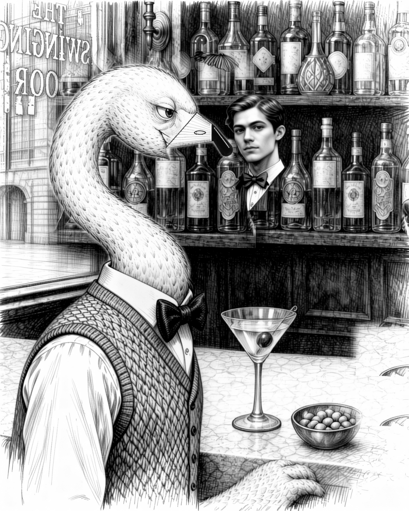

**The ask.** Round 4 of perfecting DREW. The judges' fixes after round 3: re-cut Picture 2 to head-and-shoulders so the belt, the trousers and the hand on the martini stem cannot be copied back out of it; build a flat two-tone bill DIAGRAM instead of using a photo-crop as the bill authority; repaint the bill in the composited Picture 1 and delete the sentence that was protecting the old one; re-cut kit/bust.png and kit/head.png; replace the black-cap, bill-shape, bill-size, eye, plumage and staging paragraphs; add the new negatives; split the work into a staging pass and a narrow bill-repair pass; carry seeds 55 and 21, drop 41, 7, 33 and 44.

**The thinking.** PASS 1 is the staging pass. Picture 1 is the rebuilt composite; Picture 2 is the repaired portrait RE-CUT head-and-shoulders at (180,40,700,760) so no belt, no trousers and no hand on a stem exist anywhere in the references. The EDITS are the judges' own paragraphs: the bent-stick shape, the black cap crossing the whole bill, the short-bill rule, the human eye with ONE contour arc above it, the warm amiable expression, fine pen dashes instead of leaf plates, the S-neck, the knitted vest, the opposed thumb, HE IS NOT HOLDING ANYTHING, THE PICTURE ENDS AT THE MARBLE, exactly one drink, blank labels, the window lettering, and no other character in frame.

**Settings.** local/qwen-image-edit-2511, provider local, 4:5 -> 1344x1680, fast Lightning 8 steps, cfg 1.0, euler/simple, shift 3.0, 2 reference images, negative_prompt sent but INERT at cfg 1.

**Prompt.** [prompts/046-drew-round-4-pass-1-seed-21.prompt.txt](prompts/046-drew-round-4-pass-1-seed-21.prompt.txt)

**Verdict.** REJECT - a human bartender in a bow tie stands behind the bar. Carried forward on the judges' instruction; it fails the same way seed 44 failed last round.

*Logged 10:09.*

---

## 047. Drew round 4 pass 1 seed 62

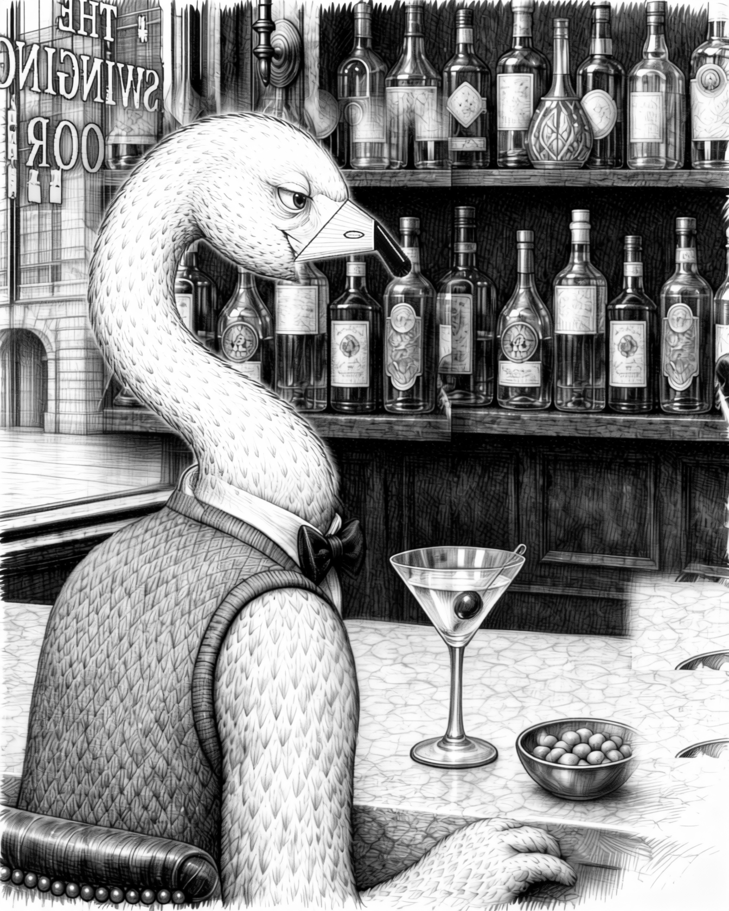

**The ask.** Round 4 of perfecting DREW. The judges' fixes after round 3: re-cut Picture 2 to head-and-shoulders so the belt, the trousers and the hand on the martini stem cannot be copied back out of it; build a flat two-tone bill DIAGRAM instead of using a photo-crop as the bill authority; repaint the bill in the composited Picture 1 and delete the sentence that was protecting the old one; re-cut kit/bust.png and kit/head.png; replace the black-cap, bill-shape, bill-size, eye, plumage and staging paragraphs; add the new negatives; split the work into a staging pass and a narrow bill-repair pass; carry seeds 55 and 21, drop 41, 7, 33 and 44.

**The thinking.** PASS 1 is the staging pass. Picture 1 is the rebuilt composite; Picture 2 is the repaired portrait RE-CUT head-and-shoulders at (180,40,700,760) so no belt, no trousers and no hand on a stem exist anywhere in the references. The EDITS are the judges' own paragraphs: the bent-stick shape, the black cap crossing the whole bill, the short-bill rule, the human eye with ONE contour arc above it, the warm amiable expression, fine pen dashes instead of leaf plates, the S-neck, the knitted vest, the opposed thumb, HE IS NOT HOLDING ANYTHING, THE PICTURE ENDS AT THE MARBLE, exactly one drink, blank labels, the window lettering, and no other character in frame.

**Settings.** local/qwen-image-edit-2511, provider local, 4:5 -> 1344x1680, fast Lightning 8 steps, cfg 1.0, euler/simple, shift 3.0, 2 reference images, negative_prompt sent but INERT at cfg 1.

**Prompt.** [prompts/047-drew-round-4-pass-1-seed-62.prompt.txt](prompts/047-drew-round-4-pass-1-seed-62.prompt.txt)

**Verdict.** BEST OF THE ROUND - the cleanest join between bill and face, the most open eye, clean staging, one drink, no second figure.

*Logged 10:09.*

---

## 048. Drew round 4 pass 1 seed 78

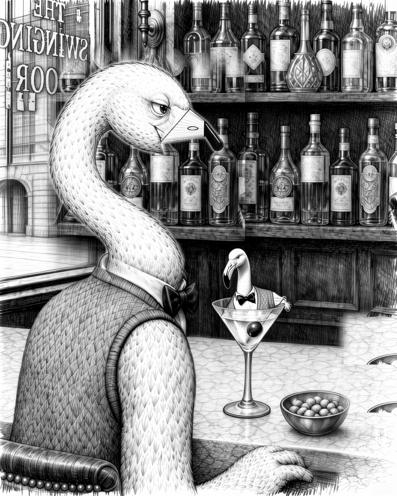

**The ask.** Round 4 of perfecting DREW. The judges' fixes after round 3: re-cut Picture 2 to head-and-shoulders so the belt, the trousers and the hand on the martini stem cannot be copied back out of it; build a flat two-tone bill DIAGRAM instead of using a photo-crop as the bill authority; repaint the bill in the composited Picture 1 and delete the sentence that was protecting the old one; re-cut kit/bust.png and kit/head.png; replace the black-cap, bill-shape, bill-size, eye, plumage and staging paragraphs; add the new negatives; split the work into a staging pass and a narrow bill-repair pass; carry seeds 55 and 21, drop 41, 7, 33 and 44.

**The thinking.** PASS 1 is the staging pass. Picture 1 is the rebuilt composite; Picture 2 is the repaired portrait RE-CUT head-and-shoulders at (180,40,700,760) so no belt, no trousers and no hand on a stem exist anywhere in the references. The EDITS are the judges' own paragraphs: the bent-stick shape, the black cap crossing the whole bill, the short-bill rule, the human eye with ONE contour arc above it, the warm amiable expression, fine pen dashes instead of leaf plates, the S-neck, the knitted vest, the opposed thumb, HE IS NOT HOLDING ANYTHING, THE PICTURE ENDS AT THE MARBLE, exactly one drink, blank labels, the window lettering, and no other character in frame.

**Settings.** local/qwen-image-edit-2511, provider local, 4:5 -> 1344x1680, fast Lightning 8 steps, cfg 1.0, euler/simple, shift 3.0, 2 reference images, negative_prompt sent but INERT at cfg 1.

**Prompt.** [prompts/048-drew-round-4-pass-1-seed-78.prompt.txt](prompts/048-drew-round-4-pass-1-seed-78.prompt.txt)

**Verdict.** REJECT - a second bird, a small white flamingo figure, stands on the marble beside the martini.

*Logged 10:09.*

---

## 049. Drew round 4 pass 1 seed 84

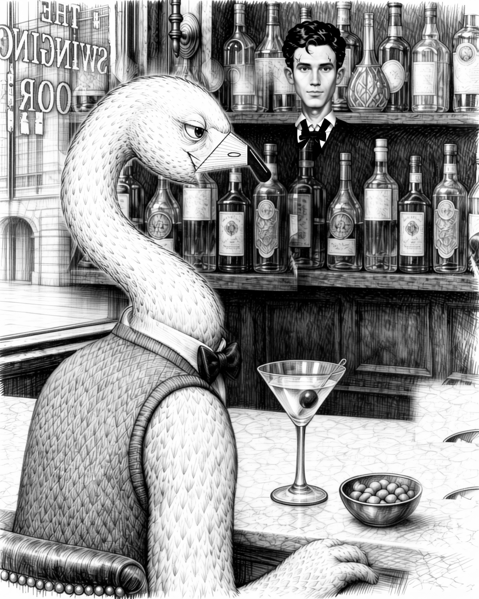

**The ask.** Round 4 of perfecting DREW. The judges' fixes after round 3: re-cut Picture 2 to head-and-shoulders so the belt, the trousers and the hand on the martini stem cannot be copied back out of it; build a flat two-tone bill DIAGRAM instead of using a photo-crop as the bill authority; repaint the bill in the composited Picture 1 and delete the sentence that was protecting the old one; re-cut kit/bust.png and kit/head.png; replace the black-cap, bill-shape, bill-size, eye, plumage and staging paragraphs; add the new negatives; split the work into a staging pass and a narrow bill-repair pass; carry seeds 55 and 21, drop 41, 7, 33 and 44.

**The thinking.** PASS 1 is the staging pass. Picture 1 is the rebuilt composite; Picture 2 is the repaired portrait RE-CUT head-and-shoulders at (180,40,700,760) so no belt, no trousers and no hand on a stem exist anywhere in the references. The EDITS are the judges' own paragraphs: the bent-stick shape, the black cap crossing the whole bill, the short-bill rule, the human eye with ONE contour arc above it, the warm amiable expression, fine pen dashes instead of leaf plates, the S-neck, the knitted vest, the opposed thumb, HE IS NOT HOLDING ANYTHING, THE PICTURE ENDS AT THE MARBLE, exactly one drink, blank labels, the window lettering, and no other character in frame.

**Settings.** local/qwen-image-edit-2511, provider local, 4:5 -> 1344x1680, fast Lightning 8 steps, cfg 1.0, euler/simple, shift 3.0, 2 reference images, negative_prompt sent but INERT at cfg 1.

**Prompt.** [prompts/049-drew-round-4-pass-1-seed-84.prompt.txt](prompts/049-drew-round-4-pass-1-seed-84.prompt.txt)

**Verdict.** REJECT - a human bartender behind the bar.

*Logged 10:09.*

---

## 050. Drew round 4 pass 1 seed 93

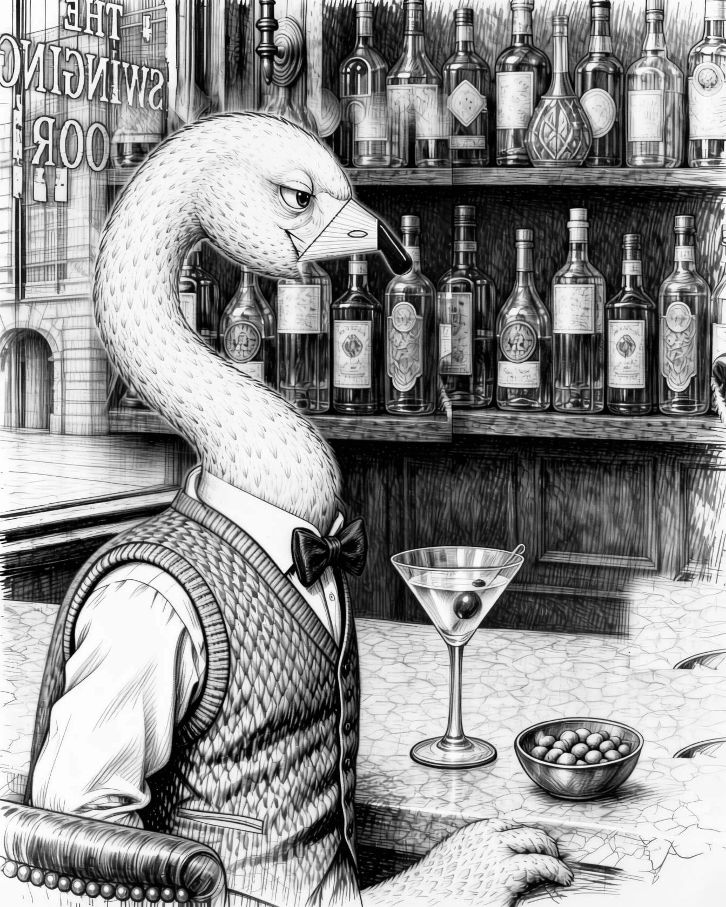

**The ask.** Round 4 of perfecting DREW. The judges' fixes after round 3: re-cut Picture 2 to head-and-shoulders so the belt, the trousers and the hand on the martini stem cannot be copied back out of it; build a flat two-tone bill DIAGRAM instead of using a photo-crop as the bill authority; repaint the bill in the composited Picture 1 and delete the sentence that was protecting the old one; re-cut kit/bust.png and kit/head.png; replace the black-cap, bill-shape, bill-size, eye, plumage and staging paragraphs; add the new negatives; split the work into a staging pass and a narrow bill-repair pass; carry seeds 55 and 21, drop 41, 7, 33 and 44.

**The thinking.** PASS 1 is the staging pass. Picture 1 is the rebuilt composite; Picture 2 is the repaired portrait RE-CUT head-and-shoulders at (180,40,700,760) so no belt, no trousers and no hand on a stem exist anywhere in the references. The EDITS are the judges' own paragraphs: the bent-stick shape, the black cap crossing the whole bill, the short-bill rule, the human eye with ONE contour arc above it, the warm amiable expression, fine pen dashes instead of leaf plates, the S-neck, the knitted vest, the opposed thumb, HE IS NOT HOLDING ANYTHING, THE PICTURE ENDS AT THE MARBLE, exactly one drink, blank labels, the window lettering, and no other character in frame.

**Settings.** local/qwen-image-edit-2511, provider local, 4:5 -> 1344x1680, fast Lightning 8 steps, cfg 1.0, euler/simple, shift 3.0, 2 reference images, negative_prompt sent but INERT at cfg 1.

**Prompt.** [prompts/050-drew-round-4-pass-1-seed-93.prompt.txt](prompts/050-drew-round-4-pass-1-seed-93.prompt.txt)

**Verdict.** Clean staging and no second figure, but the near shoulder drifts to a white shirt sleeve and the vest loses its armhole rib.

*Logged 10:09.*

---

## 051. Drew round 4 pass 2 tried at full quality - 30 steps cfg 4 is worse, not better

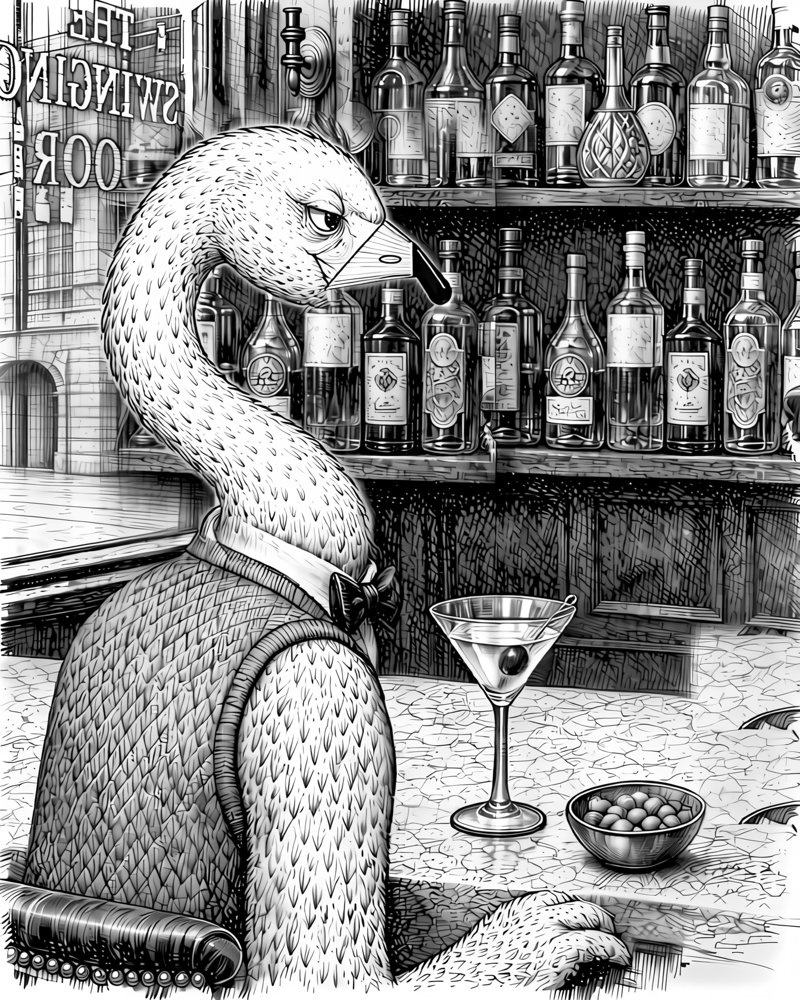

**The ask.** Round 4 of perfecting DREW. The judges' fixes after round 3: re-cut Picture 2 to head-and-shoulders so the belt, the trousers and the hand on the martini stem cannot be copied back out of it; build a flat two-tone bill DIAGRAM instead of using a photo-crop as the bill authority; repaint the bill in the composited Picture 1 and delete the sentence that was protecting the old one; re-cut kit/bust.png and kit/head.png; replace the black-cap, bill-shape, bill-size, eye, plumage and staging paragraphs; add the new negatives; split the work into a staging pass and a narrow bill-repair pass; carry seeds 55 and 21, drop 41, 7, 33 and 44.

**The thinking.** The judges asked for a narrow second pass: Picture 1 is pass 1's own render, the only edits are the bill and eye paragraphs, and the closing line is 'change nothing else in the picture'. Because the negative prompt is inert on the fast cfg-1 path, I also tried that repair at 30 steps and cfg 4, where the new negatives would actually bite.

**Settings.** local/qwen-image-edit-2511, --full: 30 steps, cfg 4.0, 4:5, 2 references, 205 s.

**Prompt.** [prompts/051-drew-round-4-pass-2-tried-at-full-quality-30-steps-cfg-4-is-worse-not-better.prompt.txt](prompts/051-drew-round-4-pass-2-tried-at-full-quality-30-steps-cfg-4-is-worse-not-better.prompt.txt)

**Verdict.** REJECTED, and worth recording. The extra steps did not re-engrave the bill; they coarsened the whole drawing - fatter strokes, bigger leaf plates on the plumage, a heavier vest. The house fast recipe is still the right one.

*Logged 10:09.*

---

## 052. Drew round 4 contact sheet - six seeds beside the re-cut kit tiles

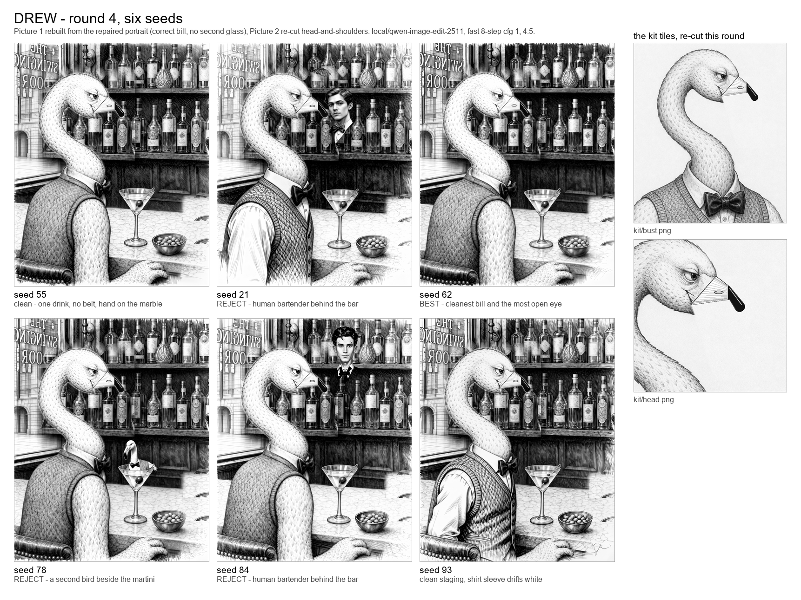

**The ask.** Round 4 of perfecting DREW. The judges' fixes after round 3: re-cut Picture 2 to head-and-shoulders so the belt, the trousers and the hand on the martini stem cannot be copied back out of it; build a flat two-tone bill DIAGRAM instead of using a photo-crop as the bill authority; repaint the bill in the composited Picture 1 and delete the sentence that was protecting the old one; re-cut kit/bust.png and kit/head.png; replace the black-cap, bill-shape, bill-size, eye, plumage and staging paragraphs; add the new negatives; split the work into a staging pass and a narrow bill-repair pass; carry seeds 55 and 21, drop 41, 7, 33 and 44.

**The thinking.** The six seeds of pass 1 at 420 px with their verdicts, beside kit/bust.png and kit/head.png as they now stand. Both tiles were re-cut this round from the repaired portrait, so the tiles and the renders finally carry the same bill; the old ones are kept as kit/_pre-round4-bust.png and _pre-round4-head.png.

**Settings.** Contact sheet, scripts/build-drew-round4-sheet.py. 1722x1292.

**Verdict.** PARTIAL PASS. What is fixed for the first time: the bill is a short bent stick with one corner and the black crossing BOTH mandibles at one line; no belt, no waistband, no trousers; the hand rests flat and the martini stands by itself; exactly one drink; the marble crosses the chest. What still fails: the bill is COPIED from the reference rather than re-drawn in the house pen, so it reads slightly like a pasted shape; the plumage is still leaf plates because the portrait's plumage is; and three of six seeds hallucinated a second figure. Best seed 62.

*Logged 10:09.*

---

## 053. Drew round 4B seed 62 the bill is finally a flamingos bill

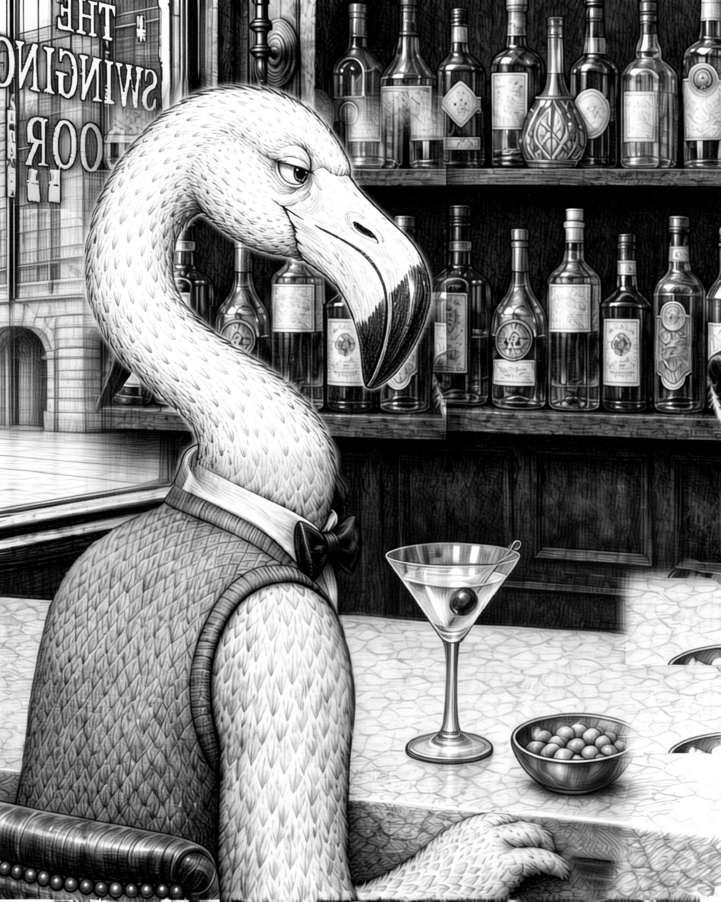

**The ask.** The founder: 'its a flamingo you did a terrible job you must perfect each character.' The judges after round 4 pass 1: retire the flat bill diagram, stop retouching the bill, re-cut the kit tiles straight from the studio portrait, rebuild Picture 1 without the white ghost-bill mask and with the head carried high, replace EDIT 8 and EDIT 9, delete EDIT 10, strengthen EDITs 6, 7, 11, 13, 14 and 19 - then re-run the SAME six seeds so the tile fix is isolated from the prompt fix.

**The thinking.** The reference fix came first, before any pixels: kit/bill-diagram.png and kit/portrait-billfixed.png are retired (renamed _retired-...-DO-NOT-REFERENCE.png) because a flat vector diagram handed to an edit model comes back as flat vector, and a retouched bill is a painted-over defect; kit/head.png and kit/bust.png were re-cut straight out of canon/vision/studies/drew.png at the judges' crops with no retouching at all; Picture 1 was rebuilt from that same unretouched portrait (scale .74, dy 75) so it carries the study's own deep once-bent bill with no mask, no hard edge and the head above the shoulder line. Two references only, so there is nothing left for the model to composite into the room. Judged first, as ordered.

**Settings.** local/qwen-image-edit-2511 via POST 127.0.0.1:8000/api/generate; fast Lightning 8 steps, cfg 1.0, euler/simple, shift 3.0; 4:5 1344x1680; TWO references (Picture 1 = the rebuilt composite, Picture 2 = canon/characters/flamingo/kit/bust.png); tag study-drew-r4b. seed 62.

**Prompt.** [prompts/053-drew-round-4b-seed-62-the-bill-is-finally-a-flamingos-bill.prompt.txt](prompts/053-drew-round-4b-seed-62-the-bill-is-finally-a-flamingos-bill.prompt.txt)

**Verdict.** BEST OF THE ROUND. The bill is right at last: deep and massive at the face, carrying its depth forward, then one smooth heavy bend of about forty degrees through the whole jaw to a blunt rounded end, with the black a single continuous mass from the bend outward - top ridge, both sides, lower mandible and the wrapped tip - one highlight along the ridge, a nostril slit high on the pale part and a gape line running back to the eye. No ruled edge, no outline, no pasted cut-out. Head carried above the shoulder, one figure, one drink, hand flat on the marble, camera at Picture 1's distance. STILL WRONG: the plumage is still closed leaf and teardrop plates rather than open dashes (EDIT 13 loses to the tile, whose own plumage is drawn that way), the upper lid still angles down toward the bill so he reads wry rather than glad, and the bottle labels are still ornate.

*Logged 10:25.*

---

## 054. Drew round 4B seed 55 good bill narrow eye

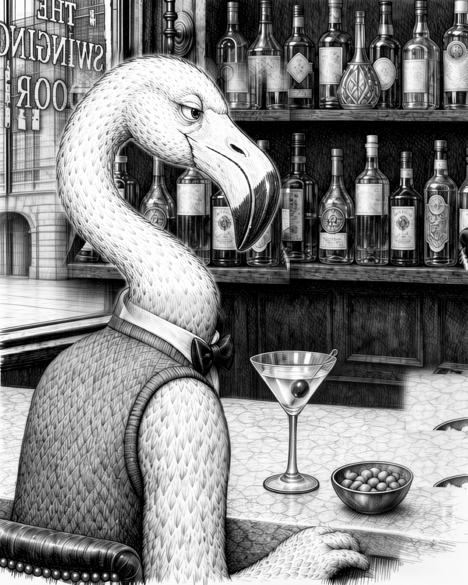

**The ask.** The founder: 'its a flamingo you did a terrible job you must perfect each character.' The judges after round 4 pass 1: retire the flat bill diagram, stop retouching the bill, re-cut the kit tiles straight from the studio portrait, rebuild Picture 1 without the white ghost-bill mask and with the head carried high, replace EDIT 8 and EDIT 9, delete EDIT 10, strengthen EDITs 6, 7, 11, 13, 14 and 19 - then re-run the SAME six seeds so the tile fix is isolated from the prompt fix.

**The thinking.** The reference fix came first, before any pixels: kit/bill-diagram.png and kit/portrait-billfixed.png are retired (renamed _retired-...-DO-NOT-REFERENCE.png) because a flat vector diagram handed to an edit model comes back as flat vector, and a retouched bill is a painted-over defect; kit/head.png and kit/bust.png were re-cut straight out of canon/vision/studies/drew.png at the judges' crops with no retouching at all; Picture 1 was rebuilt from that same unretouched portrait (scale .74, dy 75) so it carries the study's own deep once-bent bill with no mask, no hard edge and the head above the shoulder line. Two references only, so there is nothing left for the model to composite into the room. Same rig, second seed.

**Settings.** local/qwen-image-edit-2511 via POST 127.0.0.1:8000/api/generate; fast Lightning 8 steps, cfg 1.0, euler/simple, shift 3.0; 4:5 1344x1680; TWO references (Picture 1 = the rebuilt composite, Picture 2 = canon/characters/flamingo/kit/bust.png); tag study-drew-r4b. seed 55.

**Prompt.** [prompts/054-drew-round-4b-seed-55-good-bill-narrow-eye.prompt.txt](prompts/054-drew-round-4b-seed-55-good-bill-narrow-eye.prompt.txt)

**Verdict.** CLEAN. Same correct deep bent bill, though the tip curls a shade more pointed than 62 and the black is thinner along the top ridge at the bend. Neck strokes are finer here than on 62. Eye narrower and sleepier. Staging clean: one figure, one drink, no belt.

*Logged 10:25.*

---

## 055. Drew round 4B seed 93 clean staging heavy eye

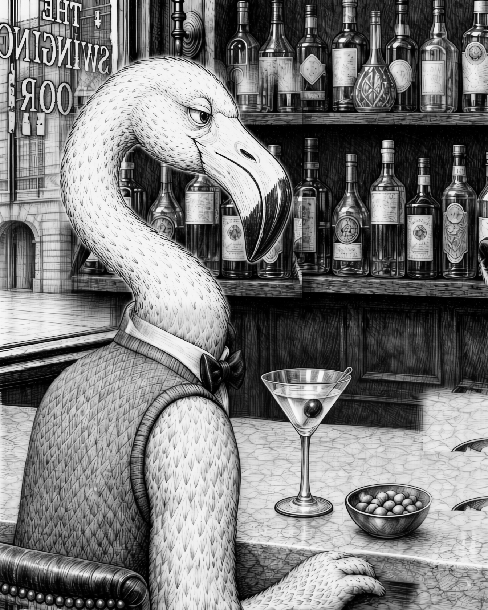

**The ask.** The founder: 'its a flamingo you did a terrible job you must perfect each character.' The judges after round 4 pass 1: retire the flat bill diagram, stop retouching the bill, re-cut the kit tiles straight from the studio portrait, rebuild Picture 1 without the white ghost-bill mask and with the head carried high, replace EDIT 8 and EDIT 9, delete EDIT 10, strengthen EDITs 6, 7, 11, 13, 14 and 19 - then re-run the SAME six seeds so the tile fix is isolated from the prompt fix.

**The thinking.** The reference fix came first, before any pixels: kit/bill-diagram.png and kit/portrait-billfixed.png are retired (renamed _retired-...-DO-NOT-REFERENCE.png) because a flat vector diagram handed to an edit model comes back as flat vector, and a retouched bill is a painted-over defect; kit/head.png and kit/bust.png were re-cut straight out of canon/vision/studies/drew.png at the judges' crops with no retouching at all; Picture 1 was rebuilt from that same unretouched portrait (scale .74, dy 75) so it carries the study's own deep once-bent bill with no mask, no hard edge and the head above the shoulder line. Two references only, so there is nothing left for the model to composite into the room. Same rig, third clean seed.

**Settings.** local/qwen-image-edit-2511 via POST 127.0.0.1:8000/api/generate; fast Lightning 8 steps, cfg 1.0, euler/simple, shift 3.0; 4:5 1344x1680; TWO references (Picture 1 = the rebuilt composite, Picture 2 = canon/characters/flamingo/kit/bust.png); tag study-drew-r4b. seed 93.

**Prompt.** [prompts/055-drew-round-4b-seed-93-clean-staging-heavy-eye.prompt.txt](prompts/055-drew-round-4b-seed-93-clean-staging-heavy-eye.prompt.txt)

**Verdict.** CLEAN. Bill correct, staging correct - one figure, one drink, hand flat on the marble, head high, bow tie and ribbed vest present. The eye is the heaviest of the three clean seeds and the crown plumage is the most leaf-like. Third of three.

*Logged 10:25.*

---

## 056. Drew round 4B seed 21 REJECT a black cap of scribble glyphs on his crown

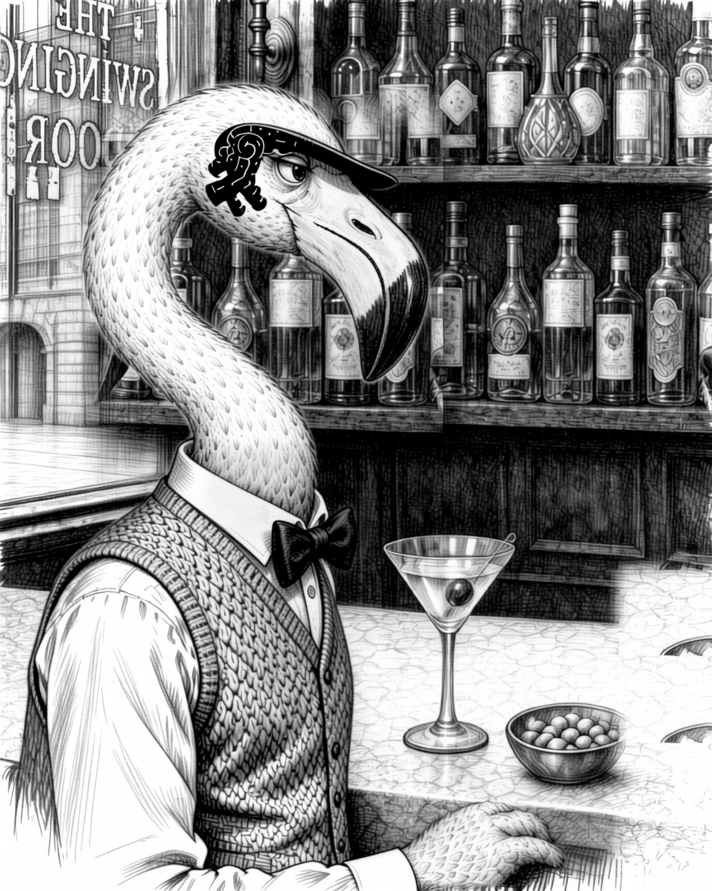

**The ask.** The founder: 'its a flamingo you did a terrible job you must perfect each character.' The judges after round 4 pass 1: retire the flat bill diagram, stop retouching the bill, re-cut the kit tiles straight from the studio portrait, rebuild Picture 1 without the white ghost-bill mask and with the head carried high, replace EDIT 8 and EDIT 9, delete EDIT 10, strengthen EDITs 6, 7, 11, 13, 14 and 19 - then re-run the SAME six seeds so the tile fix is isolated from the prompt fix.

**The thinking.** The reference fix came first, before any pixels: kit/bill-diagram.png and kit/portrait-billfixed.png are retired (renamed _retired-...-DO-NOT-REFERENCE.png) because a flat vector diagram handed to an edit model comes back as flat vector, and a retouched bill is a painted-over defect; kit/head.png and kit/bust.png were re-cut straight out of canon/vision/studies/drew.png at the judges' crops with no retouching at all; Picture 1 was rebuilt from that same unretouched portrait (scale .74, dy 75) so it carries the study's own deep once-bent bill with no mask, no hard edge and the head above the shoulder line. Two references only, so there is nothing left for the model to composite into the room. Same rig.

**Settings.** local/qwen-image-edit-2511 via POST 127.0.0.1:8000/api/generate; fast Lightning 8 steps, cfg 1.0, euler/simple, shift 3.0; 4:5 1344x1680; TWO references (Picture 1 = the rebuilt composite, Picture 2 = canon/characters/flamingo/kit/bust.png); tag study-drew-r4b. seed 21.

**Prompt.** [prompts/056-drew-round-4b-seed-21-reject-a-black-cap-of-scribble-glyphs-on-his-crown.prompt.txt](prompts/056-drew-round-4b-seed-21-reject-a-black-cap-of-scribble-glyphs-on-his-crown.prompt.txt)

**Verdict.** REJECT. A black peaked cap covered in scribbled glyph marks is drawn onto his crown over the eye, and the sweater vest turns into a buttoned sleeved cardigan. The bill itself is correct. Seed fault, not a prompt fault.

*Logged 10:25.*

---

## 057. Drew round 4B seed 78 REJECT two photographic men in the frame

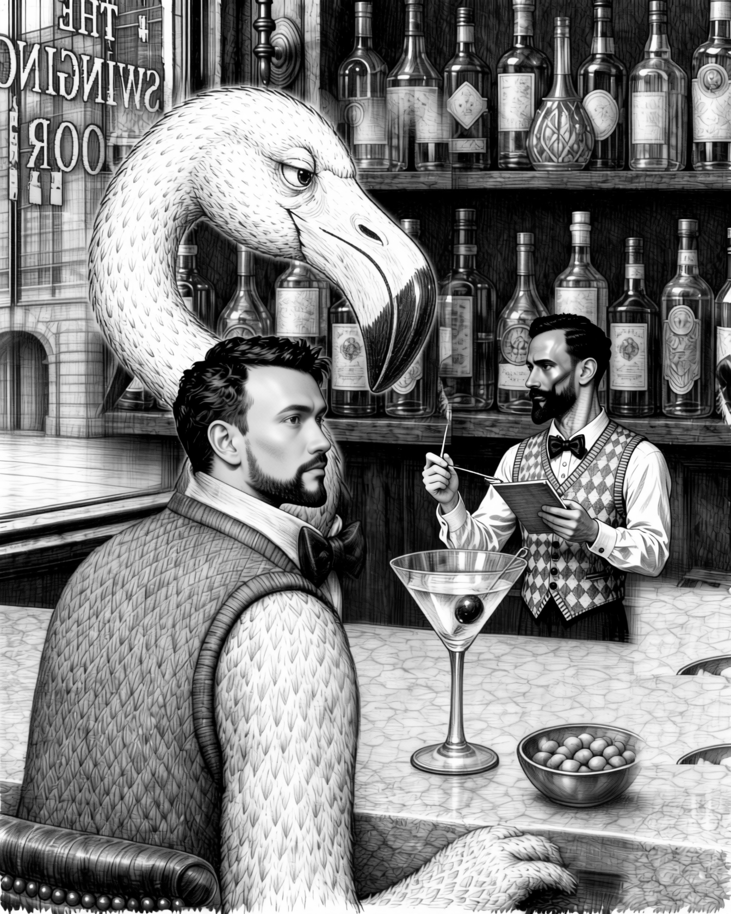

**The ask.** The founder: 'its a flamingo you did a terrible job you must perfect each character.' The judges after round 4 pass 1: retire the flat bill diagram, stop retouching the bill, re-cut the kit tiles straight from the studio portrait, rebuild Picture 1 without the white ghost-bill mask and with the head carried high, replace EDIT 8 and EDIT 9, delete EDIT 10, strengthen EDITs 6, 7, 11, 13, 14 and 19 - then re-run the SAME six seeds so the tile fix is isolated from the prompt fix.

**The thinking.** The reference fix came first, before any pixels: kit/bill-diagram.png and kit/portrait-billfixed.png are retired (renamed _retired-...-DO-NOT-REFERENCE.png) because a flat vector diagram handed to an edit model comes back as flat vector, and a retouched bill is a painted-over defect; kit/head.png and kit/bust.png were re-cut straight out of canon/vision/studies/drew.png at the judges' crops with no retouching at all; Picture 1 was rebuilt from that same unretouched portrait (scale .74, dy 75) so it carries the study's own deep once-bent bill with no mask, no hard edge and the head above the shoulder line. Two references only, so there is nothing left for the model to composite into the room. Same rig.

**Settings.** local/qwen-image-edit-2511 via POST 127.0.0.1:8000/api/generate; fast Lightning 8 steps, cfg 1.0, euler/simple, shift 3.0; 4:5 1344x1680; TWO references (Picture 1 = the rebuilt composite, Picture 2 = canon/characters/flamingo/kit/bust.png); tag study-drew-r4b. seed 78.

**Prompt.** [prompts/057-drew-round-4b-seed-78-reject-two-photographic-men-in-the-frame.prompt.txt](prompts/057-drew-round-4b-seed-78-reject-two-photographic-men-in-the-frame.prompt.txt)

**Verdict.** REJECT. Two photographic human men appear - one bearded head grafted onto Drew's own body at the counter, one behind the bar with a notebook - despite EDIT 6 naming both faults. The bill on the flamingo head is correct. The solo rule still loses on this seed.

*Logged 10:25.*

---

## 058. Drew round 4B seed 84 REJECT photographic human bartender

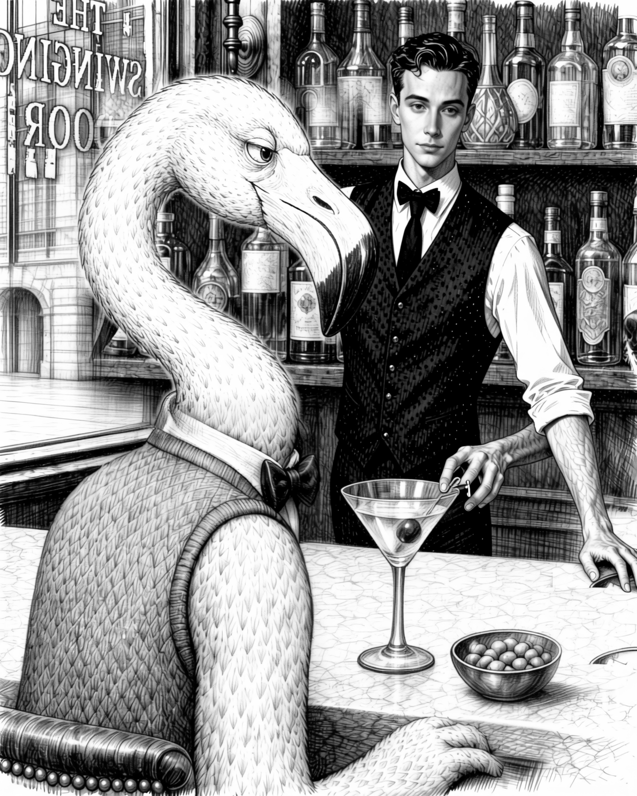

**The ask.** The founder: 'its a flamingo you did a terrible job you must perfect each character.' The judges after round 4 pass 1: retire the flat bill diagram, stop retouching the bill, re-cut the kit tiles straight from the studio portrait, rebuild Picture 1 without the white ghost-bill mask and with the head carried high, replace EDIT 8 and EDIT 9, delete EDIT 10, strengthen EDITs 6, 7, 11, 13, 14 and 19 - then re-run the SAME six seeds so the tile fix is isolated from the prompt fix.

**The thinking.** The reference fix came first, before any pixels: kit/bill-diagram.png and kit/portrait-billfixed.png are retired (renamed _retired-...-DO-NOT-REFERENCE.png) because a flat vector diagram handed to an edit model comes back as flat vector, and a retouched bill is a painted-over defect; kit/head.png and kit/bust.png were re-cut straight out of canon/vision/studies/drew.png at the judges' crops with no retouching at all; Picture 1 was rebuilt from that same unretouched portrait (scale .74, dy 75) so it carries the study's own deep once-bent bill with no mask, no hard edge and the head above the shoulder line. Two references only, so there is nothing left for the model to composite into the room. Same rig.

**Settings.** local/qwen-image-edit-2511 via POST 127.0.0.1:8000/api/generate; fast Lightning 8 steps, cfg 1.0, euler/simple, shift 3.0; 4:5 1344x1680; TWO references (Picture 1 = the rebuilt composite, Picture 2 = canon/characters/flamingo/kit/bust.png); tag study-drew-r4b. seed 84.

**Prompt.** [prompts/058-drew-round-4b-seed-84-reject-photographic-human-bartender.prompt.txt](prompts/058-drew-round-4b-seed-84-reject-photographic-human-bartender.prompt.txt)

**Verdict.** REJECT. A photographic human bartender in a dotted waistcoat stands behind the bar reaching for the martini. Drew himself is correct - bill, neck, collar, bow tie - but the frame is not his alone.

*Logged 10:25.*

---

## 059. Drew round 4B contact sheet six seeds beside the re-cut kit tiles

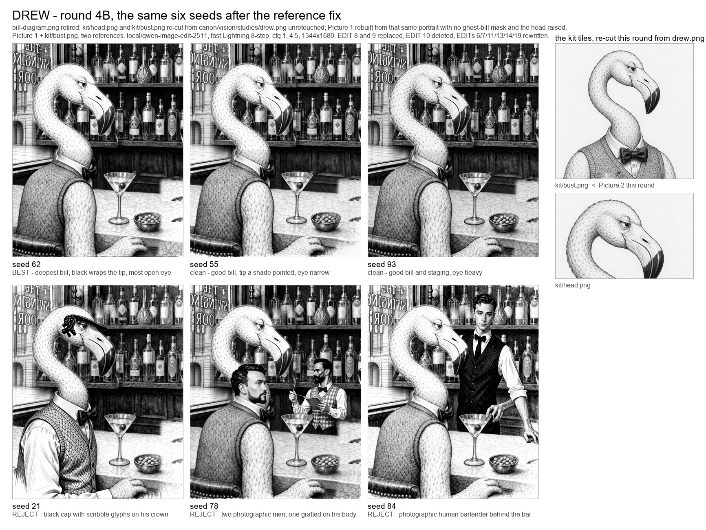

**The ask.** The founder: 'its a flamingo you did a terrible job you must perfect each character.' The judges after round 4 pass 1: retire the flat bill diagram, stop retouching the bill, re-cut the kit tiles straight from the studio portrait, rebuild Picture 1 without the white ghost-bill mask and with the head carried high, replace EDIT 8 and EDIT 9, delete EDIT 10, strengthen EDITs 6, 7, 11, 13, 14 and 19 - then re-run the SAME six seeds so the tile fix is isolated from the prompt fix.

**The thinking.** The reference fix came first, before any pixels: kit/bill-diagram.png and kit/portrait-billfixed.png are retired (renamed _retired-...-DO-NOT-REFERENCE.png) because a flat vector diagram handed to an edit model comes back as flat vector, and a retouched bill is a painted-over defect; kit/head.png and kit/bust.png were re-cut straight out of canon/vision/studies/drew.png at the judges' crops with no retouching at all; Picture 1 was rebuilt from that same unretouched portrait (scale .74, dy 75) so it carries the study's own deep once-bent bill with no mask, no hard edge and the head above the shoulder line. Two references only, so there is nothing left for the model to composite into the room. The sheet puts the six renders at 420 px beside the two re-cut kit tiles so the founder can see the tile and the render finally carrying the same bill.

**Settings.** local/qwen-image-edit-2511 via POST 127.0.0.1:8000/api/generate; fast Lightning 8 steps, cfg 1.0, euler/simple, shift 3.0; 4:5 1344x1680; TWO references (Picture 1 = the rebuilt composite, Picture 2 = canon/characters/flamingo/kit/bust.png); tag study-drew-r4b. Seeds 62, 55, 93, 21, 78, 84 - the same six as round 4 pass 1, unchanged.

**Verdict.** Three clean of six. Best is seed 62. The bill is fixed and the fix came from the REFERENCE, not the prose: the identical prose failed for four rounds while the tile carried a flat retouched bill. Open faults for round 5: leaf-plate plumage, the down-angled upper lid, ornate bottle labels, and human figures on seeds 21, 78 and 84.

*Logged 10:25.*

---

## 060. Drew round 4B the rebuilt Picture 1 the reference that fixed the bill

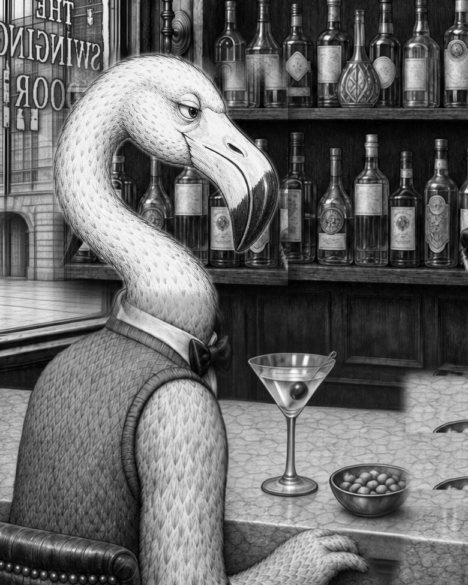

**The ask.** The judges: rebuild Picture 1 without the white ghost-bill mask, do not mask the bill with a hard-edged flat shape, and fix its neck - it is a J-hook with the head at shoulder level and the renders copy it rather than the neck EDIT.

**The thinking.** Round 4 pass 1's Picture 1 took its head from kit/portrait-billfixed.png, a RETOUCHED portrait whose bill had been painted over as a flat two-tone bent stick, with a hard-edged white mask laid over the bill region. An edit model copies a flat vector shape as a flat vector shape, and six seeds proved it. This one (scripts/make-drew-picture1-round4b.py) cuts the head straight out of the UNRETOUCHED canon/vision/studies/drew.png - which already carries the correct deep, once-bent, black-tipped flamingo bill - pastes it at scale .74 and dy 75 so the head is carried above the shoulder line instead of hooking down to it, feathers the silhouette into the painted-out back bar so there is no straight edge anywhere, and paints the second rocks glass off the marble. A neck-lengthening variant was built and rejected: stretching the neck band broke the silhouette fill and left dark halo artefacts down its left side.

**Settings.** Built from canon/plates/duo.png crop (40,500,780x975) plus the head cut (170,30,860,660) of canon/vision/studies/drew.png; PIL/scipy silhouette fill, feather 2.5, bottom fade 60 px. 780x975, greyscale.

**Verdict.** This is the change that moved the bill. Nothing else about the recipe changed - same model, same fast 8-step cfg 1 pass, same six seeds - and the bill came right on every one of the six. Remaining weakness carried by this same tile: the portrait's own plumage is drawn in closed leaf and teardrop plates, so every render inherits them, and the neck is one reversal rather than the two the judges asked for.

*Logged 10:25.*

---

## 061. Drew round 4 judge - seed62 best, still REJECT

**The ask.** Founder: flamingo perfection round, judge round 4 (6 seeds, qwen-image-edit-2511, reference fix applied)

**The thinking.** Applied CAST-LOOK-CARDS.md + QUALITY-CONTROL.md checklists line by line to seed62/55/93 (the 3 clean renders; seed21/78/84 already rejected for cap glyphs / grafted photographic humans / photographic bartender). seed62 is the strongest of the six per its own annotation (deepest bill, black wraps tip, most open eye) but still fails on inspection: no bright highlight ribbon inside the black bill tip (checklist line 2 requires one), the eye reads as a heavy squint bordering on stern/suspicious rather than warm-huggable (founder gate 8), and the bill's curve is one continuous swan-style taper rather than showing the flamingo's diagnostic sharper downward kink partway along its length - still readable as swan-adjacent rather than unmistakably flamingo. Expression overall reads deadpan-stern, not amiable (founder gate 7).

**Settings.** local/qwen-image-edit-2511, fast Lightning 8-step cfg1, 4:5, 1344x1680, Picture1=room construction + kit/bust.png, seed 62 (best of 62/55/93/21/78/84)

**Verdict.** REJECT - round 4 does not pass. Best of six (seed62) still fails: missing highlight ribbon in bill black, eye reads stern/squinting not warm, bill curve still swan-adjacent not diagnostically flamingo. Needs round 5 with EDITs for eye warmth, one-arc-only brow, bill highlight ribbon, and a sharper diagnostic downward kink in the bill.

*Logged 10:27.*

---

## 062. Barclay character study round 1 seed 41 - a real retriever, but the camera crept in

**The ask.** The founder: 'its a flamingo you did a terrible job you must perfect each character.' Barclay's turn — draw him as a golden retriever actually drawn like one, warm and professional, on the house model, six seeds, and name the best.

**The thinking.** Not room-part.py and not sensenova — the house model local/qwen-image-edit-2511 through scripts/cast-study.py, the recipe Rick's approved plates were made with. Picture 1 is a 4:5 crop of the approved duo.png with Barclay alone, RE-CUT this round to (640,620,560,700) — wider and lower than the script's default (680,640,520,650) — because Drew's round 1 showed the model pushing in past Picture 1's crop; a roomier Picture 1 keeps the shoulders, the collar V and the jacket front in frame. Picture 2 is his official portrait; Picture 3 is NEW this round: canon/characters/dog/kit/head.png, the tight head tile, because his look card's failure mode 2 is that the black lip band and the eye's paper-white are the first two marks the pipeline loses, and that tile carries both at native resolution. Three references is exactly the qwen family's max_refs, so nothing is dropped. Five extra EDIT lines name, positively, what his judge checklist fails him on: the sad first glance (worry in the brows only, mouth closed with the corner hooking UP), the three-mark eye and the black-labrador lip line, the layered coat with three arcing rows of freckles and a modest ruff, and the wardrobe/hands/no tail, plus a hold-the-camera line.

**Settings.** local/qwen-image-edit-2511, fast Lightning 8 steps, cfg 1.0, euler/simple, shift 3.0, 4:5 1344x1680, 3 references (duo.png crop 640,620,560,700 + vision/studies/barclay.png + characters/dog/kit/head.png), scripts/cast-study.py, seed 41

**Prompt.** [prompts/062-barclay-character-study-round-1-seed-41-a-real-retriever-but-the-camera-crept-in.prompt.txt](prompts/062-barclay-character-study-round-1-seed-41-a-real-retriever-but-the-camera-crept-in.prompt.txt)

**Verdict.** HOLD. He is unmistakably a golden retriever now — layered fur in individual strokes, drop ear with fringe, black nose the blackest mark, mouth closed with the corner hooking up, the eye carrying paper-white and one catchlight. Two faults: the camera pushed past Picture 1's crop so the head fills the frame and the jacket is half out of it, and the bottle labels came back with scribbled pseudo-lettering instead of the blank panels edit 3 asked for. The muzzle is also the longest and heaviest of the six. Not the pick.

*Logged 10:41.*

---

## 063. Barclay character study round 1 seed 7 - the warmest face of the round

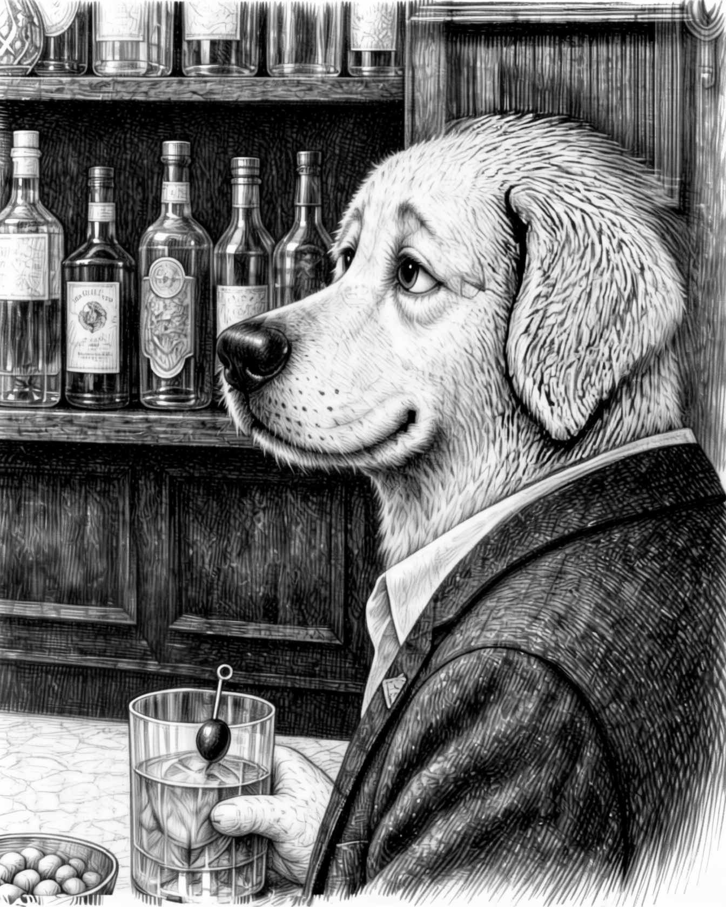

**The ask.** The founder: 'its a flamingo you did a terrible job you must perfect each character.' Barclay's turn — draw him as a golden retriever actually drawn like one, warm and professional, on the house model, six seeds, and name the best.

**The thinking.** Not room-part.py and not sensenova — the house model local/qwen-image-edit-2511 through scripts/cast-study.py, the recipe Rick's approved plates were made with. Picture 1 is a 4:5 crop of the approved duo.png with Barclay alone, RE-CUT this round to (640,620,560,700) — wider and lower than the script's default (680,640,520,650) — because Drew's round 1 showed the model pushing in past Picture 1's crop; a roomier Picture 1 keeps the shoulders, the collar V and the jacket front in frame. Picture 2 is his official portrait; Picture 3 is NEW this round: canon/characters/dog/kit/head.png, the tight head tile, because his look card's failure mode 2 is that the black lip band and the eye's paper-white are the first two marks the pipeline loses, and that tile carries both at native resolution. Three references is exactly the qwen family's max_refs, so nothing is dropped. Five extra EDIT lines name, positively, what his judge checklist fails him on: the sad first glance (worry in the brows only, mouth closed with the corner hooking UP), the three-mark eye and the black-labrador lip line, the layered coat with three arcing rows of freckles and a modest ruff, and the wardrobe/hands/no tail, plus a hold-the-camera line.

**Settings.** local/qwen-image-edit-2511, fast Lightning 8 steps, cfg 1.0, euler/simple, shift 3.0, 4:5 1344x1680, 3 references (duo.png crop 640,620,560,700 + vision/studies/barclay.png + characters/dog/kit/head.png), scripts/cast-study.py, seed 7

**Prompt.** [prompts/063-barclay-character-study-round-1-seed-7-the-warmest-face-of-the-round.prompt.txt](prompts/063-barclay-character-study-round-1-seed-7-the-warmest-face-of-the-round.prompt.txt)

**Verdict.** KEEP AS THE FACE REFERENCE. The best expression in the six: both inner brows lifted with one faint forehead crease, the closed lip line hooking clearly UP at the corner, cheeks full, the eye's dark mass at the front of the opening with paper-white behind it and a single catchlight, ten-odd freckles in loose rows. Ear fringe is fine, not wiry. Faults: the flag pin came back as a blank white triangle with no canton (checklist 12 fail), the lip band is grey and stops short of the eye's front corner, and two bottle labels still carry pseudo-text. Second place.

*Logged 10:41.*

---

## 064. Barclay character study round 1 seed 21 - good face, the ear turns woolly

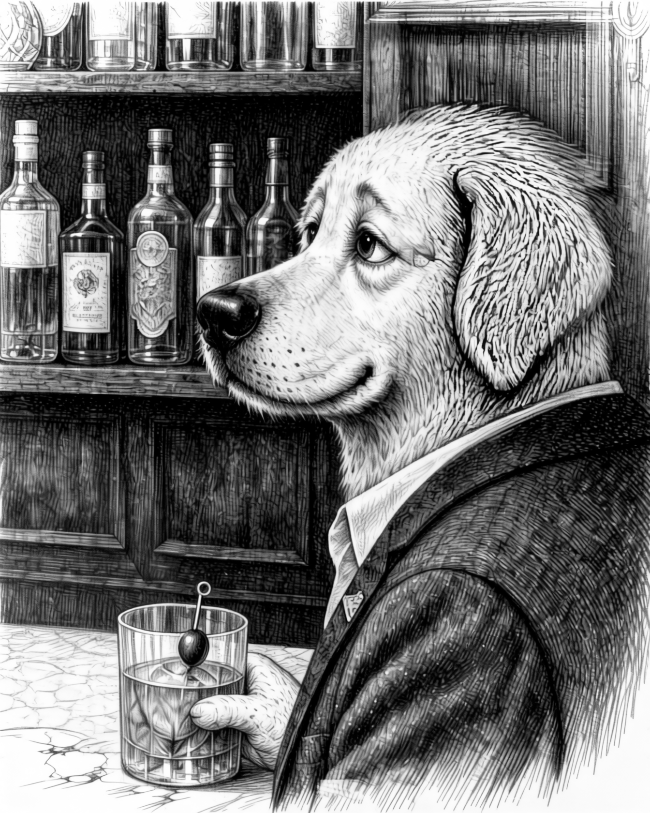

**The ask.** The founder: 'its a flamingo you did a terrible job you must perfect each character.' Barclay's turn — draw him as a golden retriever actually drawn like one, warm and professional, on the house model, six seeds, and name the best.

**The thinking.** Not room-part.py and not sensenova — the house model local/qwen-image-edit-2511 through scripts/cast-study.py, the recipe Rick's approved plates were made with. Picture 1 is a 4:5 crop of the approved duo.png with Barclay alone, RE-CUT this round to (640,620,560,700) — wider and lower than the script's default (680,640,520,650) — because Drew's round 1 showed the model pushing in past Picture 1's crop; a roomier Picture 1 keeps the shoulders, the collar V and the jacket front in frame. Picture 2 is his official portrait; Picture 3 is NEW this round: canon/characters/dog/kit/head.png, the tight head tile, because his look card's failure mode 2 is that the black lip band and the eye's paper-white are the first two marks the pipeline loses, and that tile carries both at native resolution. Three references is exactly the qwen family's max_refs, so nothing is dropped. Five extra EDIT lines name, positively, what his judge checklist fails him on: the sad first glance (worry in the brows only, mouth closed with the corner hooking UP), the three-mark eye and the black-labrador lip line, the layered coat with three arcing rows of freckles and a modest ruff, and the wardrobe/hands/no tail, plus a hold-the-camera line.

**Settings.** local/qwen-image-edit-2511, fast Lightning 8 steps, cfg 1.0, euler/simple, shift 3.0, 4:5 1344x1680, 3 references (duo.png crop 640,620,560,700 + vision/studies/barclay.png + characters/dog/kit/head.png), scripts/cast-study.py, seed 21

**Prompt.** [prompts/064-barclay-character-study-round-1-seed-21-good-face-the-ear-turns-woolly.prompt.txt](prompts/064-barclay-character-study-round-1-seed-21-good-face-the-ear-turns-woolly.prompt.txt)

**Verdict.** NO. The face is close to seed 7's — closed mouth, corner up, eye built right — but the camera sits nearer than Picture 1 again, the ear leather has gone to a dense woolly mass rather than separate fringe strokes (his recorded failure mode 3), no flag pin appears at all, and the labels carry pseudo-text. Usable evidence, not the pick.

*Logged 10:41.*

---

## 065. Barclay character study round 1 seed 33 - REJECT, a second dog on the shelf

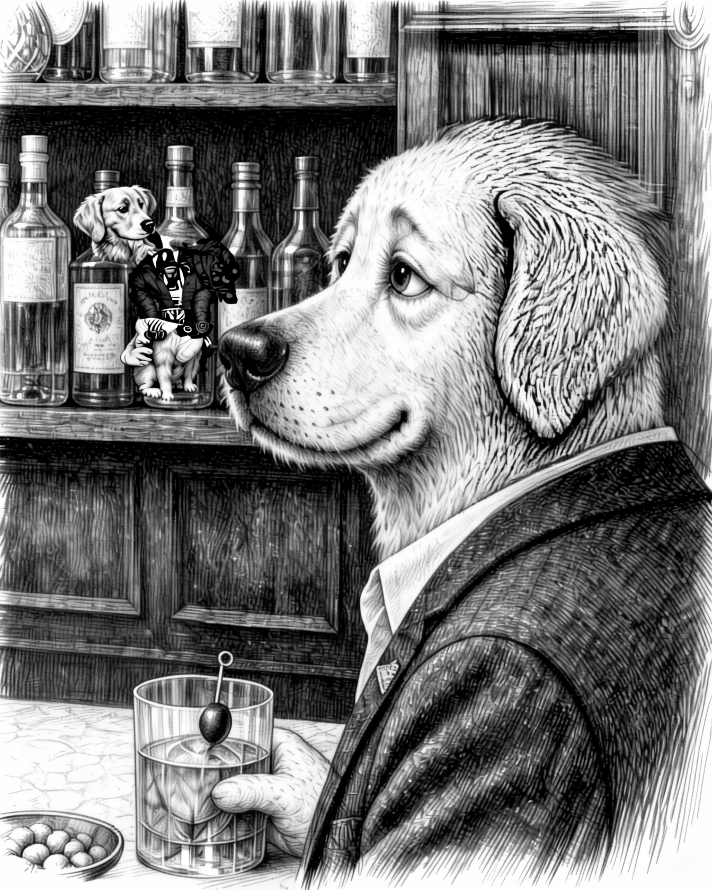

**The ask.** The founder: 'its a flamingo you did a terrible job you must perfect each character.' Barclay's turn — draw him as a golden retriever actually drawn like one, warm and professional, on the house model, six seeds, and name the best.

**The thinking.** Not room-part.py and not sensenova — the house model local/qwen-image-edit-2511 through scripts/cast-study.py, the recipe Rick's approved plates were made with. Picture 1 is a 4:5 crop of the approved duo.png with Barclay alone, RE-CUT this round to (640,620,560,700) — wider and lower than the script's default (680,640,520,650) — because Drew's round 1 showed the model pushing in past Picture 1's crop; a roomier Picture 1 keeps the shoulders, the collar V and the jacket front in frame. Picture 2 is his official portrait; Picture 3 is NEW this round: canon/characters/dog/kit/head.png, the tight head tile, because his look card's failure mode 2 is that the black lip band and the eye's paper-white are the first two marks the pipeline loses, and that tile carries both at native resolution. Three references is exactly the qwen family's max_refs, so nothing is dropped. Five extra EDIT lines name, positively, what his judge checklist fails him on: the sad first glance (worry in the brows only, mouth closed with the corner hooking UP), the three-mark eye and the black-labrador lip line, the layered coat with three arcing rows of freckles and a modest ruff, and the wardrobe/hands/no tail, plus a hold-the-camera line.

**Settings.** local/qwen-image-edit-2511, fast Lightning 8 steps, cfg 1.0, euler/simple, shift 3.0, 4:5 1344x1680, 3 references (duo.png crop 640,620,560,700 + vision/studies/barclay.png + characters/dog/kit/head.png), scripts/cast-study.py, seed 33

**Prompt.** [prompts/065-barclay-character-study-round-1-seed-33-reject-a-second-dog-on-the-shelf.prompt.txt](prompts/065-barclay-character-study-round-1-seed-33-reject-a-second-dog-on-the-shelf.prompt.txt)

**Verdict.** REJECT. Barclay himself is fine, but the model hallucinated a SECOND character standing among the bottles on the back bar — a small jacketed dog, complete with its own head and legs. Exactly the 'EXACTLY 1 character' rule the study prompt states twice, broken. Fatal on its own; filed so the round shows what the seed did.

*Logged 10:41.*

---

## 066. Barclay character study round 1 seed 44 - BEST, the camera held and the flag pin drawn right

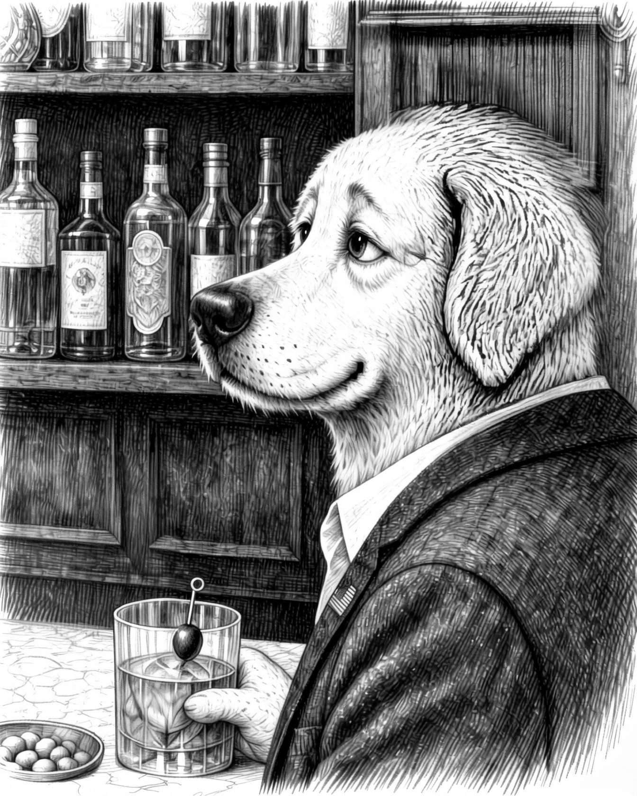

**The ask.** The founder: 'its a flamingo you did a terrible job you must perfect each character.' Barclay's turn — draw him as a golden retriever actually drawn like one, warm and professional, on the house model, six seeds, and name the best.

**The thinking.** Not room-part.py and not sensenova — the house model local/qwen-image-edit-2511 through scripts/cast-study.py, the recipe Rick's approved plates were made with. Picture 1 is a 4:5 crop of the approved duo.png with Barclay alone, RE-CUT this round to (640,620,560,700) — wider and lower than the script's default (680,640,520,650) — because Drew's round 1 showed the model pushing in past Picture 1's crop; a roomier Picture 1 keeps the shoulders, the collar V and the jacket front in frame. Picture 2 is his official portrait; Picture 3 is NEW this round: canon/characters/dog/kit/head.png, the tight head tile, because his look card's failure mode 2 is that the black lip band and the eye's paper-white are the first two marks the pipeline loses, and that tile carries both at native resolution. Three references is exactly the qwen family's max_refs, so nothing is dropped. Five extra EDIT lines name, positively, what his judge checklist fails him on: the sad first glance (worry in the brows only, mouth closed with the corner hooking UP), the three-mark eye and the black-labrador lip line, the layered coat with three arcing rows of freckles and a modest ruff, and the wardrobe/hands/no tail, plus a hold-the-camera line.

**Settings.** local/qwen-image-edit-2511, fast Lightning 8 steps, cfg 1.0, euler/simple, shift 3.0, 4:5 1344x1680, 3 references (duo.png crop 640,620,560,700 + vision/studies/barclay.png + characters/dog/kit/head.png), scripts/cast-study.py, seed 44

**Prompt.** [prompts/066-barclay-character-study-round-1-seed-44-best-the-camera-held-and-the-flag-pin-drawn-right.prompt.txt](prompts/066-barclay-character-study-round-1-seed-44-best-the-camera-held-and-the-flag-pin-drawn-right.prompt.txt)

**Verdict.** BEST OF THE ROUND. The only render that passes the whole spine of his checklist at once: camera and chest-up crop held to Picture 1 (head does not fill the frame, shoulders and jacket front in), first glance friendly — closed mouth with the corner hook lifting above the line's middle, worry only in the lifted inner brows; the eye in three marks with paper-white behind the dark and one catchlight, lid clear of the dark; freckles in arcing rows on the near muzzle; one drop ear rooting level with the eye and finishing at the jaw with separate fringe strokes down the nape; modest ruff with the pale collar showing both sides; no tail; hand wrapping the rocks glass with no nail or claw at any fingertip. And the USA flag pin is properly DRAWN on the lapel — dark canton, stars stippled pale, alternating bars, a fine staff along the hoist — which no other seed managed. Remaining faults for round 2: the black lip band is a grey line that stops short of the eye's front corner instead of a fine true-black line ending under it; the freckles run six to ten, under the fifteen to twenty in three rows; a couple of bottle labels still carry faint pseudo-marks.

*Logged 10:41.*

---

## 067. Barclay character study round 1 seed 55 - warm face, pin lands on the shoulder

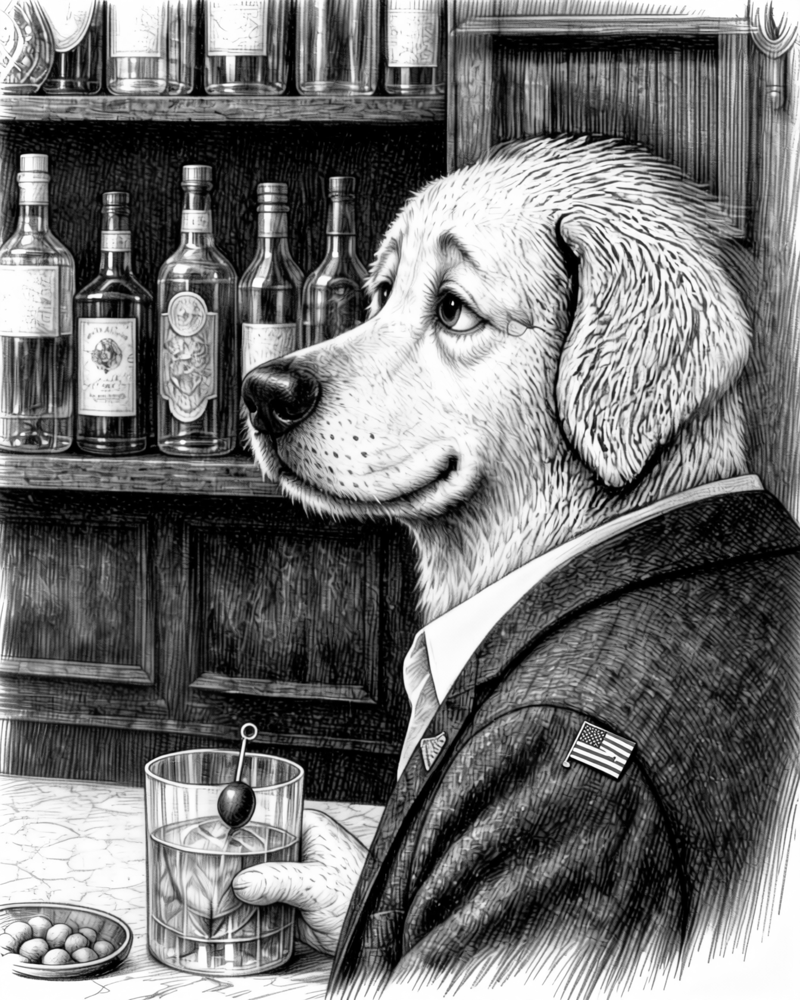

**The ask.** The founder: 'its a flamingo you did a terrible job you must perfect each character.' Barclay's turn — draw him as a golden retriever actually drawn like one, warm and professional, on the house model, six seeds, and name the best.

**The thinking.** Not room-part.py and not sensenova — the house model local/qwen-image-edit-2511 through scripts/cast-study.py, the recipe Rick's approved plates were made with. Picture 1 is a 4:5 crop of the approved duo.png with Barclay alone, RE-CUT this round to (640,620,560,700) — wider and lower than the script's default (680,640,520,650) — because Drew's round 1 showed the model pushing in past Picture 1's crop; a roomier Picture 1 keeps the shoulders, the collar V and the jacket front in frame. Picture 2 is his official portrait; Picture 3 is NEW this round: canon/characters/dog/kit/head.png, the tight head tile, because his look card's failure mode 2 is that the black lip band and the eye's paper-white are the first two marks the pipeline loses, and that tile carries both at native resolution. Three references is exactly the qwen family's max_refs, so nothing is dropped. Five extra EDIT lines name, positively, what his judge checklist fails him on: the sad first glance (worry in the brows only, mouth closed with the corner hooking UP), the three-mark eye and the black-labrador lip line, the layered coat with three arcing rows of freckles and a modest ruff, and the wardrobe/hands/no tail, plus a hold-the-camera line.

**Settings.** local/qwen-image-edit-2511, fast Lightning 8 steps, cfg 1.0, euler/simple, shift 3.0, 4:5 1344x1680, 3 references (duo.png crop 640,620,560,700 + vision/studies/barclay.png + characters/dog/kit/head.png), scripts/cast-study.py, seed 55

**Prompt.** [prompts/067-barclay-character-study-round-1-seed-55-warm-face-pin-lands-on-the-shoulder.prompt.txt](prompts/067-barclay-character-study-round-1-seed-55-warm-face-pin-lands-on-the-shoulder.prompt.txt)

**Verdict.** NO, BUT CLOSE. Camera held as well as seed 44, the warmest muzzle freckling of the six and a good three-mark eye, closed mouth with the corner up. Two faults put it behind 44: the flag pin is drawn large and legible but pinned to the upper ARM/shoulder rather than the lapel (checklist 12 fail), and a stray thin looping line hangs off the rear corner of the eye. Third place.

*Logged 10:41.*

---

## 068. Barclay character study round 1 - the contact sheet, six seeds against the reference kit

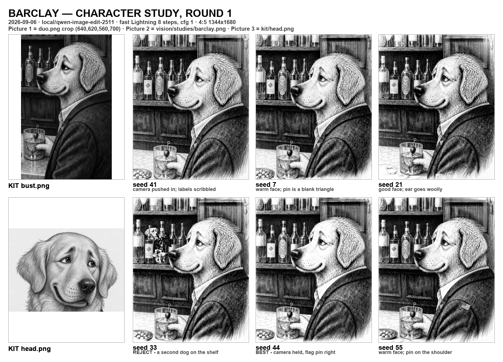

**The ask.** The founder: 'its a flamingo you did a terrible job you must perfect each character.' Barclay's turn — draw him as a golden retriever actually drawn like one, warm and professional, on the house model, six seeds, and name the best.

**The thinking.** Not room-part.py and not sensenova — the house model local/qwen-image-edit-2511 through scripts/cast-study.py, the recipe Rick's approved plates were made with. Picture 1 is a 4:5 crop of the approved duo.png with Barclay alone, RE-CUT this round to (640,620,560,700) — wider and lower than the script's default (680,640,520,650) — because Drew's round 1 showed the model pushing in past Picture 1's crop; a roomier Picture 1 keeps the shoulders, the collar V and the jacket front in frame. Picture 2 is his official portrait; Picture 3 is NEW this round: canon/characters/dog/kit/head.png, the tight head tile, because his look card's failure mode 2 is that the black lip band and the eye's paper-white are the first two marks the pipeline loses, and that tile carries both at native resolution. Three references is exactly the qwen family's max_refs, so nothing is dropped. Five extra EDIT lines name, positively, what his judge checklist fails him on: the sad first glance (worry in the brows only, mouth closed with the corner hooking UP), the three-mark eye and the black-labrador lip line, the layered coat with three arcing rows of freckles and a modest ruff, and the wardrobe/hands/no tail, plus a hold-the-camera line.

**Settings.** local/qwen-image-edit-2511, fast Lightning 8 steps, cfg 1.0, euler/simple, shift 3.0, 4:5 1344x1680, 3 references (duo.png crop 640,620,560,700 + vision/studies/barclay.png + characters/dog/kit/head.png), scripts/cast-study.py, seeds 41 / 7 / 21 / 33 / 44 / 55

**Prompt.** [prompts/068-barclay-character-study-round-1-the-contact-sheet-six-seeds-against-the-reference-kit.prompt.txt](prompts/068-barclay-character-study-round-1-the-contact-sheet-six-seeds-against-the-reference-kit.prompt.txt)

**Verdict.** Round 1 is a pass on the SPECIES and a hold on the DETAIL. Six for six he is now a golden retriever drawn like one — layered fur in individual strokes, drop ear with fringe, black nose, closed mouth with the corner turning up, the human eye with visible white and a catchlight — which is the thing the founder said was missing. SEED 44 IS THE PICK: it alone holds Picture 1's camera AND draws the flag pin properly on the lapel with a legible canton. Seed 7 is the warmest face and seed 55 is third; seed 33 is a reject (a second dog hallucinated on the back-bar shelf); seeds 41 and 21 pushed the camera in past the plate's crop. Round 2 should carry seed 44 forward with three fixes: make the black lip band a fine TRUE-BLACK line running two nose-widths to directly under the front corner of the near eye, raise the muzzle freckles to fifteen to twenty in three arcing rows, and kill the last pseudo-lettering on the bottle labels.

*Logged 10:41.*

---

## 069. Barclay character study round 2 seed 41 the head turns but the pick returns

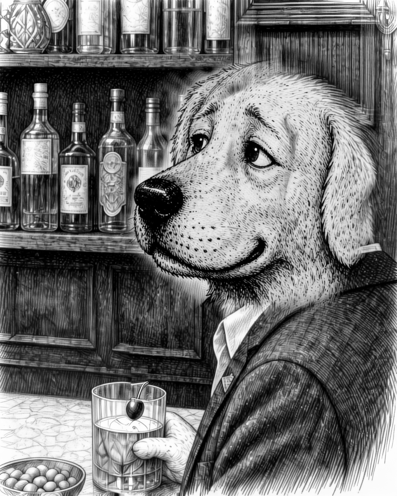

**The ask.** The founder: 'its a flamingo you did a terrible job you must perfect each character.' Round 2 for BARCLAY, against the judges' round-1 list: give him his own signature prop (a rocks glass with one large ice cube and one stemless cherry, never a pick), turn his head and both eyes forward into the room toward Drew, draw a legible USA flag pin on the near lapel, run the true-black lip line the full two nose-widths and hook it up, keep the ear a leather of fine individual strokes, pull the camera back, and keep every second dog, every scribbled label and every stray cheek contour out of the picture.

**The thinking.** The judges named two reference changes as the root causes, and looking at the plates at full size only one of them held. (1) They asked for Picture 1 to be re-cut from canon/plates/duo-barclay.png because duo.png has him 'already near-profile'. Cropped side by side the two plates draw the SAME near-profile head - and so do all twelve approved showcase plates; there is no picture in canon of a forward-turned Barclay to copy. canon/plates/README.md also says what duo-barclay.png actually is: the SPEAKER VARIANT, 'the plate with one mouth open'. A probe render on it (kept in 2a-picture1-from-duo-barclay/) came back in the old profile AND with an open mouth showing teeth - a regression round 1 did not have. (2) They were right about kit/head.png: it is a soft graphite portrait whose nose is stippled mid-grey and whose lip line is a grey curve, so the EDIT naming a true-black lip line was contradicting the picture it pointed at. It is dropped. The lesson from the probe is that this is an EDIT model: it copies Picture 1's GEOMETRY and takes only surface identity from the later tiles, so a pose that is not in Picture 1 does not happen no matter how the prompt is worded. The head turn was therefore DRAWN, not prompted: Picture 1 is now a pre-composite (scripts/make-barclay-picture1-round2b.py) of the duo.png crop (620,600,580,725) with the cocktail pick painted out of the rocks glass by a horizontal clone, and Barclay's near-profile head replaced by the true three-quarter head from canon/vision/studies/barclay.png - the one canon picture with both his eyes whole - cut on a hand-measured polygon, scaled 0.838 to the plate's own 310px crown-to-jaw, tone-matched and feathered in. Picture 2 is that same study cut chest-up so its belt, trousers and picked glass are out of frame; Picture 3 is a head crop of showcase sc07, true engraving with a solid black nose and a heavy black lip band, its two lettered shelf labels blanked. Twelve numbered EDITs carry the rest of the judges' list.

**Settings.** scripts/cast-study.py via scripts/run-barclay-round2.sh - local/qwen-image-edit-2511, provider local, 4:5 -> 1344x1680, fast Lightning 8 steps, cfg 1.0, euler/simple, shift 3.0, 3 references (composited plate crop + chest-up study + sc07 head crop), LOCAL_NEGATIVE verbatim (inert at cfg 1), tag study-barclay-r2. seed 41.

**Prompt.** [prompts/069-barclay-character-study-round-2-seed-41-the-head-turns-but-the-pick-returns.prompt.txt](prompts/069-barclay-character-study-round-2-seed-41-the-head-turns-but-the-pick-returns.prompt.txt)

**Verdict.** PASS on the pose, FAIL on the prop. The composited Picture 1 held: true three-quarter, both eyes whole and both pupils into the room, mouth closed, solid black nose, the black lip line running back and hooking up, freckles in arcing rows, ear a leather with fringe. But a thin curved pick has grown back out of the cherry - the one seed of six that re-invented it - and the bottle labels carry pseudo-text. The flag pin is a faint blank diamond, not a flag.

*Logged 11:07.*

---

## 070. Barclay character study round 2 seed 7 clean prop heavy ruff

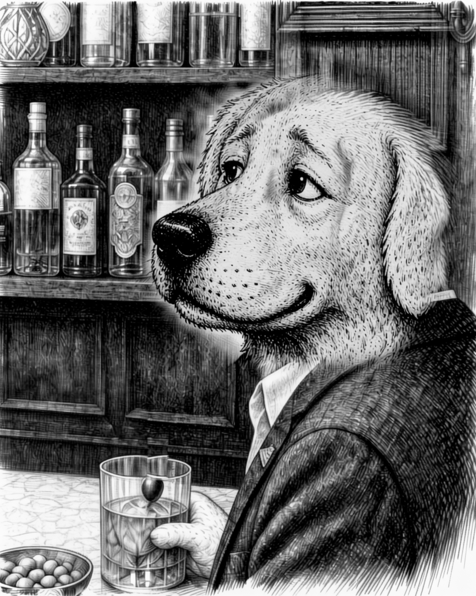

**The ask.** The founder: 'its a flamingo you did a terrible job you must perfect each character.' Round 2 for BARCLAY, against the judges' round-1 list: give him his own signature prop (a rocks glass with one large ice cube and one stemless cherry, never a pick), turn his head and both eyes forward into the room toward Drew, draw a legible USA flag pin on the near lapel, run the true-black lip line the full two nose-widths and hook it up, keep the ear a leather of fine individual strokes, pull the camera back, and keep every second dog, every scribbled label and every stray cheek contour out of the picture.

**The thinking.** The judges named two reference changes as the root causes, and looking at the plates at full size only one of them held. (1) They asked for Picture 1 to be re-cut from canon/plates/duo-barclay.png because duo.png has him 'already near-profile'. Cropped side by side the two plates draw the SAME near-profile head - and so do all twelve approved showcase plates; there is no picture in canon of a forward-turned Barclay to copy. canon/plates/README.md also says what duo-barclay.png actually is: the SPEAKER VARIANT, 'the plate with one mouth open'. A probe render on it (kept in 2a-picture1-from-duo-barclay/) came back in the old profile AND with an open mouth showing teeth - a regression round 1 did not have. (2) They were right about kit/head.png: it is a soft graphite portrait whose nose is stippled mid-grey and whose lip line is a grey curve, so the EDIT naming a true-black lip line was contradicting the picture it pointed at. It is dropped. The lesson from the probe is that this is an EDIT model: it copies Picture 1's GEOMETRY and takes only surface identity from the later tiles, so a pose that is not in Picture 1 does not happen no matter how the prompt is worded. The head turn was therefore DRAWN, not prompted: Picture 1 is now a pre-composite (scripts/make-barclay-picture1-round2b.py) of the duo.png crop (620,600,580,725) with the cocktail pick painted out of the rocks glass by a horizontal clone, and Barclay's near-profile head replaced by the true three-quarter head from canon/vision/studies/barclay.png - the one canon picture with both his eyes whole - cut on a hand-measured polygon, scaled 0.838 to the plate's own 310px crown-to-jaw, tone-matched and feathered in. Picture 2 is that same study cut chest-up so its belt, trousers and picked glass are out of frame; Picture 3 is a head crop of showcase sc07, true engraving with a solid black nose and a heavy black lip band, its two lettered shelf labels blanked. Twelve numbered EDITs carry the rest of the judges' list.

**Settings.** scripts/cast-study.py via scripts/run-barclay-round2.sh - local/qwen-image-edit-2511, provider local, 4:5 -> 1344x1680, fast Lightning 8 steps, cfg 1.0, euler/simple, shift 3.0, 3 references (composited plate crop + chest-up study + sc07 head crop), LOCAL_NEGATIVE verbatim (inert at cfg 1), tag study-barclay-r2. seed 7.

**Prompt.** [prompts/070-barclay-character-study-round-2-seed-7-clean-prop-heavy-ruff.prompt.txt](prompts/070-barclay-character-study-round-2-seed-7-clean-prop-heavy-ruff.prompt.txt)

**Verdict.** PASS on the prop and the pose - cherry and ice cube in the glass with nothing above the rim, three-quarter head, closed mouth, black lip line. Weaker than 44: the far eye is small, the ruff under the jaw is a heavy dark mass, and the pale collar barely shows on the far side. Labels carry pseudo-text; the pin is a blank diamond.

*Logged 11:07.*

---

## 071. Barclay character study round 2 seed 21 reject blank balloon over the far eye

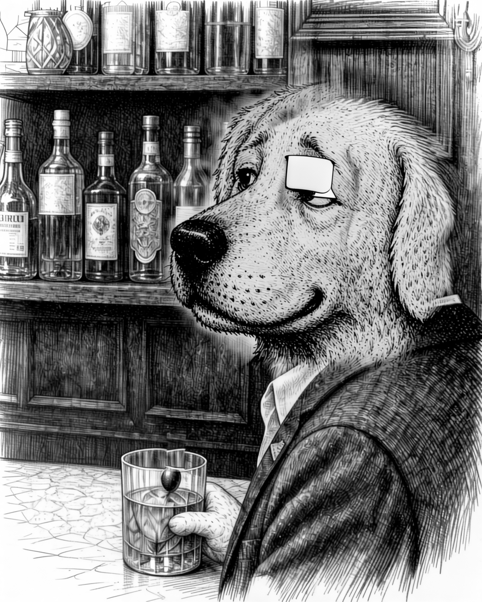

**The ask.** The founder: 'its a flamingo you did a terrible job you must perfect each character.' Round 2 for BARCLAY, against the judges' round-1 list: give him his own signature prop (a rocks glass with one large ice cube and one stemless cherry, never a pick), turn his head and both eyes forward into the room toward Drew, draw a legible USA flag pin on the near lapel, run the true-black lip line the full two nose-widths and hook it up, keep the ear a leather of fine individual strokes, pull the camera back, and keep every second dog, every scribbled label and every stray cheek contour out of the picture.

**The thinking.** The judges named two reference changes as the root causes, and looking at the plates at full size only one of them held. (1) They asked for Picture 1 to be re-cut from canon/plates/duo-barclay.png because duo.png has him 'already near-profile'. Cropped side by side the two plates draw the SAME near-profile head - and so do all twelve approved showcase plates; there is no picture in canon of a forward-turned Barclay to copy. canon/plates/README.md also says what duo-barclay.png actually is: the SPEAKER VARIANT, 'the plate with one mouth open'. A probe render on it (kept in 2a-picture1-from-duo-barclay/) came back in the old profile AND with an open mouth showing teeth - a regression round 1 did not have. (2) They were right about kit/head.png: it is a soft graphite portrait whose nose is stippled mid-grey and whose lip line is a grey curve, so the EDIT naming a true-black lip line was contradicting the picture it pointed at. It is dropped. The lesson from the probe is that this is an EDIT model: it copies Picture 1's GEOMETRY and takes only surface identity from the later tiles, so a pose that is not in Picture 1 does not happen no matter how the prompt is worded. The head turn was therefore DRAWN, not prompted: Picture 1 is now a pre-composite (scripts/make-barclay-picture1-round2b.py) of the duo.png crop (620,600,580,725) with the cocktail pick painted out of the rocks glass by a horizontal clone, and Barclay's near-profile head replaced by the true three-quarter head from canon/vision/studies/barclay.png - the one canon picture with both his eyes whole - cut on a hand-measured polygon, scaled 0.838 to the plate's own 310px crown-to-jaw, tone-matched and feathered in. Picture 2 is that same study cut chest-up so its belt, trousers and picked glass are out of frame; Picture 3 is a head crop of showcase sc07, true engraving with a solid black nose and a heavy black lip band, its two lettered shelf labels blanked. Twelve numbered EDITs carry the rest of the judges' list.

**Settings.** scripts/cast-study.py via scripts/run-barclay-round2.sh - local/qwen-image-edit-2511, provider local, 4:5 -> 1344x1680, fast Lightning 8 steps, cfg 1.0, euler/simple, shift 3.0, 3 references (composited plate crop + chest-up study + sc07 head crop), LOCAL_NEGATIVE verbatim (inert at cfg 1), tag study-barclay-r2. seed 21.

**Prompt.** [prompts/071-barclay-character-study-round-2-seed-21-reject-blank-balloon-over-the-far-eye.prompt.txt](prompts/071-barclay-character-study-round-2-seed-21-reject-blank-balloon-over-the-far-eye.prompt.txt)

**Verdict.** REJECT. A blank white speech-balloon shape is drawn over his far eye and brow - fatal, and exactly the balloon the fence forbids. Everything below the eyes is sound (prop correct, lip line, freckles), but the picture cannot be shown.

*Logged 11:07.*

---

## 072. Barclay character study round 2 seed 33 strong head labels carry pseudo-text

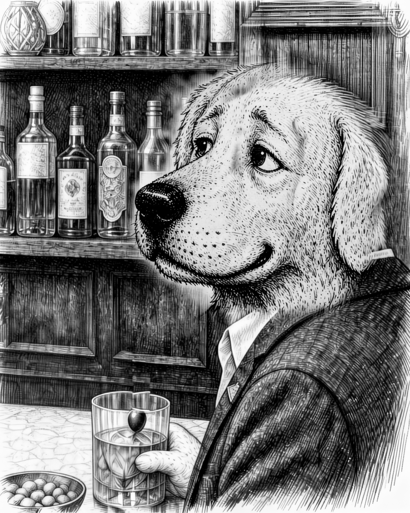

**The ask.** The founder: 'its a flamingo you did a terrible job you must perfect each character.' Round 2 for BARCLAY, against the judges' round-1 list: give him his own signature prop (a rocks glass with one large ice cube and one stemless cherry, never a pick), turn his head and both eyes forward into the room toward Drew, draw a legible USA flag pin on the near lapel, run the true-black lip line the full two nose-widths and hook it up, keep the ear a leather of fine individual strokes, pull the camera back, and keep every second dog, every scribbled label and every stray cheek contour out of the picture.

**The thinking.** The judges named two reference changes as the root causes, and looking at the plates at full size only one of them held. (1) They asked for Picture 1 to be re-cut from canon/plates/duo-barclay.png because duo.png has him 'already near-profile'. Cropped side by side the two plates draw the SAME near-profile head - and so do all twelve approved showcase plates; there is no picture in canon of a forward-turned Barclay to copy. canon/plates/README.md also says what duo-barclay.png actually is: the SPEAKER VARIANT, 'the plate with one mouth open'. A probe render on it (kept in 2a-picture1-from-duo-barclay/) came back in the old profile AND with an open mouth showing teeth - a regression round 1 did not have. (2) They were right about kit/head.png: it is a soft graphite portrait whose nose is stippled mid-grey and whose lip line is a grey curve, so the EDIT naming a true-black lip line was contradicting the picture it pointed at. It is dropped. The lesson from the probe is that this is an EDIT model: it copies Picture 1's GEOMETRY and takes only surface identity from the later tiles, so a pose that is not in Picture 1 does not happen no matter how the prompt is worded. The head turn was therefore DRAWN, not prompted: Picture 1 is now a pre-composite (scripts/make-barclay-picture1-round2b.py) of the duo.png crop (620,600,580,725) with the cocktail pick painted out of the rocks glass by a horizontal clone, and Barclay's near-profile head replaced by the true three-quarter head from canon/vision/studies/barclay.png - the one canon picture with both his eyes whole - cut on a hand-measured polygon, scaled 0.838 to the plate's own 310px crown-to-jaw, tone-matched and feathered in. Picture 2 is that same study cut chest-up so its belt, trousers and picked glass are out of frame; Picture 3 is a head crop of showcase sc07, true engraving with a solid black nose and a heavy black lip band, its two lettered shelf labels blanked. Twelve numbered EDITs carry the rest of the judges' list.

**Settings.** scripts/cast-study.py via scripts/run-barclay-round2.sh - local/qwen-image-edit-2511, provider local, 4:5 -> 1344x1680, fast Lightning 8 steps, cfg 1.0, euler/simple, shift 3.0, 3 references (composited plate crop + chest-up study + sc07 head crop), LOCAL_NEGATIVE verbatim (inert at cfg 1), tag study-barclay-r2. seed 33.

**Prompt.** [prompts/072-barclay-character-study-round-2-seed-33-strong-head-labels-carry-pseudo-text.prompt.txt](prompts/072-barclay-character-study-round-2-seed-33-strong-head-labels-carry-pseudo-text.prompt.txt)

**Verdict.** PASS, second best. The strongest far eye of the six at better than half the near eye's width, clean lifted inner brows, three clear freckle rows, the lip line unbroken and hooked, cherry and cube correct. Held back by pseudo-text on the bottle labels, a crazed white marble at the left edge, and a blank diamond where the flag pin should be.

*Logged 11:07.*

---

## 073. Barclay character study round 2 seed 44 best both eyes lip-line hook and the correct glass

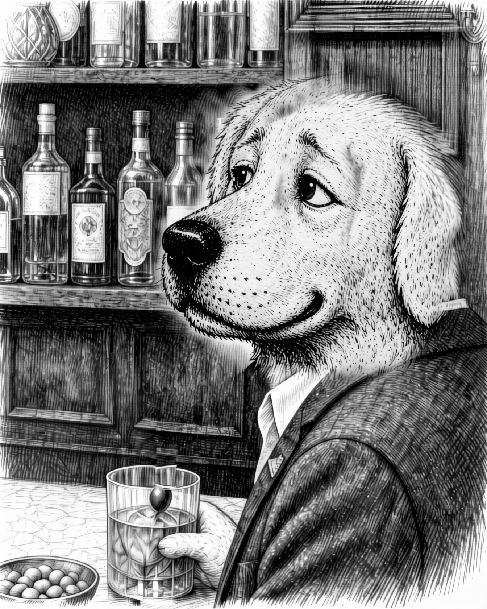

**The ask.** The founder: 'its a flamingo you did a terrible job you must perfect each character.' Round 2 for BARCLAY, against the judges' round-1 list: give him his own signature prop (a rocks glass with one large ice cube and one stemless cherry, never a pick), turn his head and both eyes forward into the room toward Drew, draw a legible USA flag pin on the near lapel, run the true-black lip line the full two nose-widths and hook it up, keep the ear a leather of fine individual strokes, pull the camera back, and keep every second dog, every scribbled label and every stray cheek contour out of the picture.

**The thinking.** The judges named two reference changes as the root causes, and looking at the plates at full size only one of them held. (1) They asked for Picture 1 to be re-cut from canon/plates/duo-barclay.png because duo.png has him 'already near-profile'. Cropped side by side the two plates draw the SAME near-profile head - and so do all twelve approved showcase plates; there is no picture in canon of a forward-turned Barclay to copy. canon/plates/README.md also says what duo-barclay.png actually is: the SPEAKER VARIANT, 'the plate with one mouth open'. A probe render on it (kept in 2a-picture1-from-duo-barclay/) came back in the old profile AND with an open mouth showing teeth - a regression round 1 did not have. (2) They were right about kit/head.png: it is a soft graphite portrait whose nose is stippled mid-grey and whose lip line is a grey curve, so the EDIT naming a true-black lip line was contradicting the picture it pointed at. It is dropped. The lesson from the probe is that this is an EDIT model: it copies Picture 1's GEOMETRY and takes only surface identity from the later tiles, so a pose that is not in Picture 1 does not happen no matter how the prompt is worded. The head turn was therefore DRAWN, not prompted: Picture 1 is now a pre-composite (scripts/make-barclay-picture1-round2b.py) of the duo.png crop (620,600,580,725) with the cocktail pick painted out of the rocks glass by a horizontal clone, and Barclay's near-profile head replaced by the true three-quarter head from canon/vision/studies/barclay.png - the one canon picture with both his eyes whole - cut on a hand-measured polygon, scaled 0.838 to the plate's own 310px crown-to-jaw, tone-matched and feathered in. Picture 2 is that same study cut chest-up so its belt, trousers and picked glass are out of frame; Picture 3 is a head crop of showcase sc07, true engraving with a solid black nose and a heavy black lip band, its two lettered shelf labels blanked. Twelve numbered EDITs carry the rest of the judges' list.

**Settings.** scripts/cast-study.py via scripts/run-barclay-round2.sh - local/qwen-image-edit-2511, provider local, 4:5 -> 1344x1680, fast Lightning 8 steps, cfg 1.0, euler/simple, shift 3.0, 3 references (composited plate crop + chest-up study + sc07 head crop), LOCAL_NEGATIVE verbatim (inert at cfg 1), tag study-barclay-r2. seed 44.

**Prompt.** [prompts/073-barclay-character-study-round-2-seed-44-best-both-eyes-lip-line-hook-and-the-correct-glass.prompt.txt](prompts/073-barclay-character-study-round-2-seed-44-best-both-eyes-lip-line-hook-and-the-correct-glass.prompt.txt)

**Verdict.** BEST OF THE ROUND. Every one of the judges' top four fixes lands: the rocks glass holds one large ice cube and one dark stemless cherry with no pick, skewer or stem anywhere; the head is in a true three-quarter with BOTH eyes whole and both pupils aimed into the room; the lip line is one unbroken true-black stroke from under the back of the nose to under the front corner of the near eye, finishing in a small hook that lifts; the drop ear is a leather of fine individual directional strokes, not a woolly slab. The nose is the blackest mark on the page, the freckles read as three arcing rows, the coat is long feathered strokes with paper showing between them, and the inner brows lift so he reads kind and a little concerned. STILL OPEN: the flag pin is a faint blank diamond, not a legible canton-and-bars flag; the head still takes about 46 percent of the frame's height rather than the third asked for; the nose highlight is a long glossy streak rather than a pinpoint; some bottle labels carry engraved medallions; the marble crazes into white at the bottom-left; and a soft bloom survives around the skull from the composite seam.

*Logged 11:07.*

---

## 074. Barclay character study round 2 seed 55 reject white bar across the muzzle

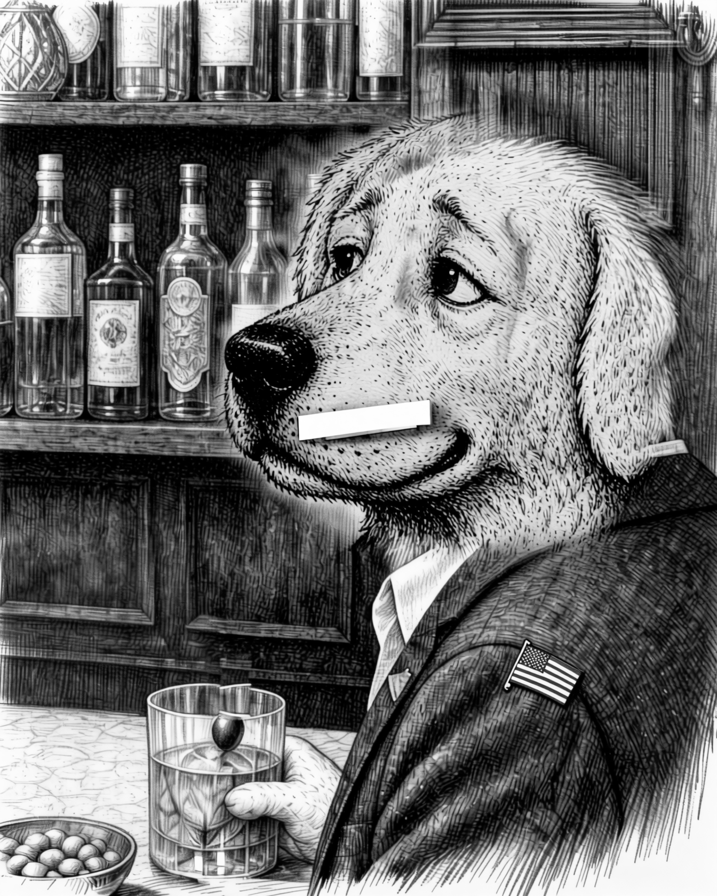

**The ask.** The founder: 'its a flamingo you did a terrible job you must perfect each character.' Round 2 for BARCLAY, against the judges' round-1 list: give him his own signature prop (a rocks glass with one large ice cube and one stemless cherry, never a pick), turn his head and both eyes forward into the room toward Drew, draw a legible USA flag pin on the near lapel, run the true-black lip line the full two nose-widths and hook it up, keep the ear a leather of fine individual strokes, pull the camera back, and keep every second dog, every scribbled label and every stray cheek contour out of the picture.

**The thinking.** The judges named two reference changes as the root causes, and looking at the plates at full size only one of them held. (1) They asked for Picture 1 to be re-cut from canon/plates/duo-barclay.png because duo.png has him 'already near-profile'. Cropped side by side the two plates draw the SAME near-profile head - and so do all twelve approved showcase plates; there is no picture in canon of a forward-turned Barclay to copy. canon/plates/README.md also says what duo-barclay.png actually is: the SPEAKER VARIANT, 'the plate with one mouth open'. A probe render on it (kept in 2a-picture1-from-duo-barclay/) came back in the old profile AND with an open mouth showing teeth - a regression round 1 did not have. (2) They were right about kit/head.png: it is a soft graphite portrait whose nose is stippled mid-grey and whose lip line is a grey curve, so the EDIT naming a true-black lip line was contradicting the picture it pointed at. It is dropped. The lesson from the probe is that this is an EDIT model: it copies Picture 1's GEOMETRY and takes only surface identity from the later tiles, so a pose that is not in Picture 1 does not happen no matter how the prompt is worded. The head turn was therefore DRAWN, not prompted: Picture 1 is now a pre-composite (scripts/make-barclay-picture1-round2b.py) of the duo.png crop (620,600,580,725) with the cocktail pick painted out of the rocks glass by a horizontal clone, and Barclay's near-profile head replaced by the true three-quarter head from canon/vision/studies/barclay.png - the one canon picture with both his eyes whole - cut on a hand-measured polygon, scaled 0.838 to the plate's own 310px crown-to-jaw, tone-matched and feathered in. Picture 2 is that same study cut chest-up so its belt, trousers and picked glass are out of frame; Picture 3 is a head crop of showcase sc07, true engraving with a solid black nose and a heavy black lip band, its two lettered shelf labels blanked. Twelve numbered EDITs carry the rest of the judges' list.

**Settings.** scripts/cast-study.py via scripts/run-barclay-round2.sh - local/qwen-image-edit-2511, provider local, 4:5 -> 1344x1680, fast Lightning 8 steps, cfg 1.0, euler/simple, shift 3.0, 3 references (composited plate crop + chest-up study + sc07 head crop), LOCAL_NEGATIVE verbatim (inert at cfg 1), tag study-barclay-r2. seed 55.

**Prompt.** [prompts/074-barclay-character-study-round-2-seed-55-reject-white-bar-across-the-muzzle.prompt.txt](prompts/074-barclay-character-study-round-2-seed-55-reject-white-bar-across-the-muzzle.prompt.txt)

**Verdict.** REJECT. A blank white caption bar is drawn straight across his muzzle. Notable anyway as the only seed of six that drew a genuinely legible USA flag - canton, stars and bars - but it put it on his upper sleeve, which the judges forbade, not on the lapel.

*Logged 11:07.*

---

## 075. Barclay character study round 2 contact sheet six seeds beside the kit tiles

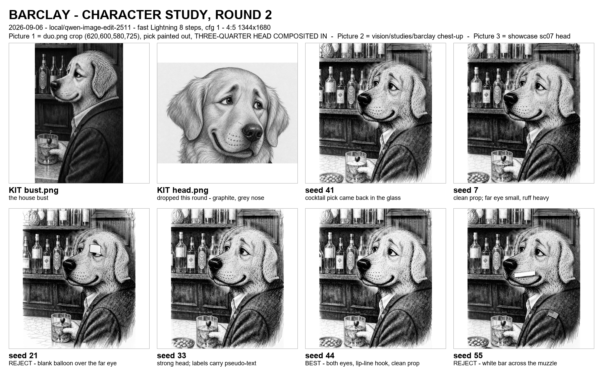

**The ask.** The founder: 'its a flamingo you did a terrible job you must perfect each character.' Round 2 for BARCLAY, against the judges' round-1 list: give him his own signature prop (a rocks glass with one large ice cube and one stemless cherry, never a pick), turn his head and both eyes forward into the room toward Drew, draw a legible USA flag pin on the near lapel, run the true-black lip line the full two nose-widths and hook it up, keep the ear a leather of fine individual strokes, pull the camera back, and keep every second dog, every scribbled label and every stray cheek contour out of the picture.

**The thinking.** The judges named two reference changes as the root causes, and looking at the plates at full size only one of them held. (1) They asked for Picture 1 to be re-cut from canon/plates/duo-barclay.png because duo.png has him 'already near-profile'. Cropped side by side the two plates draw the SAME near-profile head - and so do all twelve approved showcase plates; there is no picture in canon of a forward-turned Barclay to copy. canon/plates/README.md also says what duo-barclay.png actually is: the SPEAKER VARIANT, 'the plate with one mouth open'. A probe render on it (kept in 2a-picture1-from-duo-barclay/) came back in the old profile AND with an open mouth showing teeth - a regression round 1 did not have. (2) They were right about kit/head.png: it is a soft graphite portrait whose nose is stippled mid-grey and whose lip line is a grey curve, so the EDIT naming a true-black lip line was contradicting the picture it pointed at. It is dropped. The lesson from the probe is that this is an EDIT model: it copies Picture 1's GEOMETRY and takes only surface identity from the later tiles, so a pose that is not in Picture 1 does not happen no matter how the prompt is worded. The head turn was therefore DRAWN, not prompted: Picture 1 is now a pre-composite (scripts/make-barclay-picture1-round2b.py) of the duo.png crop (620,600,580,725) with the cocktail pick painted out of the rocks glass by a horizontal clone, and Barclay's near-profile head replaced by the true three-quarter head from canon/vision/studies/barclay.png - the one canon picture with both his eyes whole - cut on a hand-measured polygon, scaled 0.838 to the plate's own 310px crown-to-jaw, tone-matched and feathered in. Picture 2 is that same study cut chest-up so its belt, trousers and picked glass are out of frame; Picture 3 is a head crop of showcase sc07, true engraving with a solid black nose and a heavy black lip band, its two lettered shelf labels blanked. Twelve numbered EDITs carry the rest of the judges' list.

**Settings.** scripts/cast-study.py via scripts/run-barclay-round2.sh - local/qwen-image-edit-2511, provider local, 4:5 -> 1344x1680, fast Lightning 8 steps, cfg 1.0, euler/simple, shift 3.0, 3 references (composited plate crop + chest-up study + sc07 head crop), LOCAL_NEGATIVE verbatim (inert at cfg 1), tag study-barclay-r2. Seeds 41, 7, 21, 33, 44, 55 - the same six as round 1, so the two rounds compare seed for seed.

**Verdict.** Seed 44 is the round's best and the first Barclay in this project that answers the founder's brief: a golden retriever drawn like one, turned into the room with both eyes on the reader's side of his muzzle, the black lip line and the black nose carrying the face, and his own drink in front of him with no olive and no pick. Seeds 21 and 55 are rejects for a blank balloon and a blank caption bar. Four of the six are usable. What is still not right in any of the six: the USA flag pin comes back as a blank diamond on the lapel (seed 55 drew a real flag but on the sleeve), the camera sits closer than the third-of-frame asked for, and the composite seam behind the skull leaves a soft bloom. Those are the round-3 list.

*Logged 11:07.*

---

## 076. Barclay character study round 3 seed 41 best the head finally turns all the way into the room

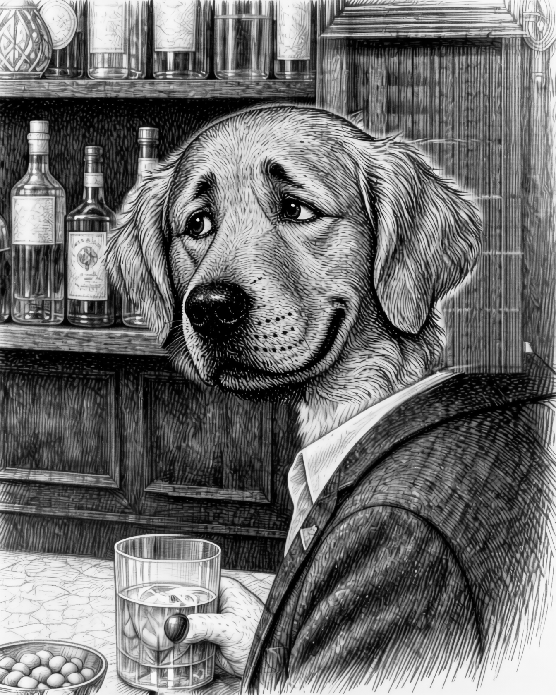

**The ask.** The founder: 'its a flamingo you did a terrible job you must perfect each character.' Round 3 for BARCLAY, against the judges' round-2 list: turn his head a FULL three-quarter into the room and draw the far eye whole, off the muzzle bridge, at least two-thirds the width of the near one; open both eyes wide and human with the worry carried by two raised inner brows; run the black lip-line band forward, unbroken, to finish directly under the front corner of the near eye; give him four separately contoured fingers and a thumb, no mitten and no claws; draw the USA flag pin legibly - canton, stars, bars, staff - on the near lapel and nowhere else; each drop ear a separate leather with a long wavy fringe, lifting clear of the shoulder; the coat in long layered directional strokes, not a field of spiky dashes; one unbroken glass rim with the cherry down inside below the liquid line; and no lettering, no blank rectangle and no crazed marble anywhere. And before rendering: re-cut Picture 2 so the whole head sits inside it with air, rebuild Picture 3 with no paint-outs, and rebuild Picture 1's head so the pose is DRAWN rather than hinted.

**The thinking.** The judges' three reference fixes were all made, one of them by the escalation their own PROCESS line authorises. (1) PICTURE 2 was re-cut (70,0,720,730) instead of (330,100,690,700), which had sliced the nose tip off at the tile edge; measured off a gridded copy, the head runs crown y=45, nose x=130, chin y=430, ear back x=540, and the lapel flag pin sits at x 628-700, y 628-690, so the new tile clears all of it with 40-60 px of air and nothing touching an edge. That taller cut catches the study's own raised glass and STIRRER in the corner - a pick in a reference - so the corner was rebuilt from the picture's own material 104 px higher up the same columns: blank paper over the paper half, the jacket's own weave and its slanting edge over the jacket half. No paint-out. (2) PICTURE 3: sc07 is dropped. Its mouth is OPEN, which fought the closed-mouth edit, and its tile carried a flat grey block over two lettered labels. All twelve retired plates were read at full size; sc01 is the one that crops tight on a CLOSED mouth with the lettered shelf row entirely above the crop (labels end y=800, crown starts y=855), so the tile is (620,818,420,344). The single label inside it, ACE RESERVE, was removed the way the judges asked - engraved bottle-glass cloned down from the same bottle's shoulder, never a block. (3) PICTURE 1: the judges asked for the re-cut Picture 2 head to be composited in 'turned further into the room than it is now', which pasting it cannot do - that is the same shallow turn round 2 pasted and the model flattened back to profile. Their PROCESS line authorises the escalation, so the three-quarter was borrowed from canon's ONLY true three-quarter of Barclay with both eyes whole and the mouth closed: canon/characters/dog/kit/head.png. It faces the reader's right, so it was MIRRORED - after which the muzzle points frame-left, the near ear lands where the plate's own ear is, and the far eye sits clear of the muzzle bridge. It was scaled 300/635 to the plate's own crown-to-jaw and seated crown-on-crown, nose-on-nose. It is graphite, so the prompt says outright that Picture 1's head is a rough paste-up whose ANGLE and PLACEMENT are law and whose quality is not. Three faults of the round-2 composite were also fixed in pixels rather than in words: the halo round the skull (the head is now cut by FINDING the kit sheet's paper - bright AND locally flat - then eroding 3 px, instead of by a hand polygon), the pale bushy lobe of the plate's old profile ear sticking out past the narrower three-quarter head (rebuilt from the back bar's own slat panelling tiled down), and the cocktail pick, whose column is now rebuilt by row-wise interpolation so the rim ellipse and the liquid line run straight through it, with the cherry re-seated below the liquid line. ONE CONTRADICTION in the judges' list was resolved and is flagged: it asks both for an iris 'pressed against the FRONT corner... front 40 percent' and for an iris 'near the CENTRE of the eye, not jammed into the corner', with both pupils aimed at one spot in the room. The centred version is the one consistent with the pose this round exists to get, so EDIT 2 takes it and keeps from the other only what does not conflict.

**Settings.** scripts/cast-study.py via scripts/run-barclay-round3.sh, references built by scripts/make-barclay-round3-tiles.py - local/qwen-image-edit-2511, provider local, 4:5 -> 1344x1680, fast Lightning 8 steps, cfg 1.0, euler/simple, shift 3.0, 3 references (composited plate crop + re-cut study + sc01 head crop), 14 numbered EDITs, LOCAL_NEGATIVE verbatim (inert at cfg 1), tag study-barclay-r3. Seed 41.

**Prompt.** [prompts/076-barclay-character-study-round-3-seed-41-best-the-head-finally-turns-all-the-way-into-the-room.prompt.txt](prompts/076-barclay-character-study-round-3-seed-41-best-the-head-finally-turns-all-the-way-into-the-room.prompt.txt)

**Verdict.** BEST OF THE ROUND, and the best Barclay this project has drawn. The pose the last two rounds could not get is here: a FULL three-quarter, the far eye a complete open eye with its own lid, its own paper-white, its own iris and its own brow, set clear of the muzzle bridge with a finger's width of far cheek beside it, and both pupils aimed at the same spot in the room. Both inner brows lift in the pale domes the note asked for, so the worry is in the brows and not in a squint. Mouth closed; the lip-line is one unbroken true-black band that runs forward along the muzzle and hooks up at the corner. The nose is the blackest mark on the page. Freckles read in arcing rows, the ears are two separate leathers with fringe, the collar shows on both sides, the glass rim is unbroken with the ice cube inside and no pick, skewer or stem anywhere. STILL OPEN: the camera pushed in - the head takes about half the frame's height, not the third asked for, and the lapels are crowded at the bottom edge; the flag pin is AGAIN a blank pale triangle rather than a canton-and-bars flag; two bottle labels carry pseudo-writing and one small pale rectangle sits at the right edge; the marble crazes into a crackle field at the left; the cherry rides at the liquid line rather than fully below it; the fingers are only half separated; and the panelling behind his ear carries a soft vertical blur inherited from the paste-up seam.

*Logged 11:38.*

---

## 077. Barclay character study round 3 seed 44 reject a human bartender appeared behind the counter

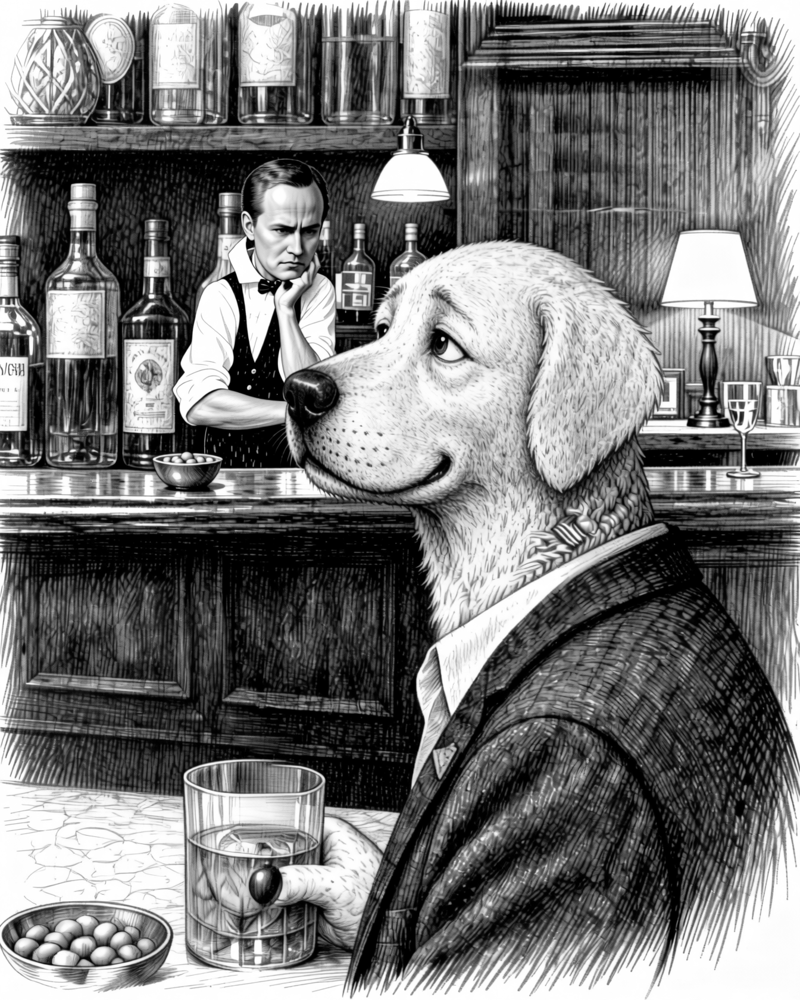

**The ask.** The founder: 'its a flamingo you did a terrible job you must perfect each character.' Round 3 for BARCLAY, against the judges' round-2 list: turn his head a FULL three-quarter into the room and draw the far eye whole, off the muzzle bridge, at least two-thirds the width of the near one; open both eyes wide and human with the worry carried by two raised inner brows; run the black lip-line band forward, unbroken, to finish directly under the front corner of the near eye; give him four separately contoured fingers and a thumb, no mitten and no claws; draw the USA flag pin legibly - canton, stars, bars, staff - on the near lapel and nowhere else; each drop ear a separate leather with a long wavy fringe, lifting clear of the shoulder; the coat in long layered directional strokes, not a field of spiky dashes; one unbroken glass rim with the cherry down inside below the liquid line; and no lettering, no blank rectangle and no crazed marble anywhere. And before rendering: re-cut Picture 2 so the whole head sits inside it with air, rebuild Picture 3 with no paint-outs, and rebuild Picture 1's head so the pose is DRAWN rather than hinted.

**The thinking.** The judges' three reference fixes were all made, one of them by the escalation their own PROCESS line authorises. (1) PICTURE 2 was re-cut (70,0,720,730) instead of (330,100,690,700), which had sliced the nose tip off at the tile edge; measured off a gridded copy, the head runs crown y=45, nose x=130, chin y=430, ear back x=540, and the lapel flag pin sits at x 628-700, y 628-690, so the new tile clears all of it with 40-60 px of air and nothing touching an edge. That taller cut catches the study's own raised glass and STIRRER in the corner - a pick in a reference - so the corner was rebuilt from the picture's own material 104 px higher up the same columns: blank paper over the paper half, the jacket's own weave and its slanting edge over the jacket half. No paint-out. (2) PICTURE 3: sc07 is dropped. Its mouth is OPEN, which fought the closed-mouth edit, and its tile carried a flat grey block over two lettered labels. All twelve retired plates were read at full size; sc01 is the one that crops tight on a CLOSED mouth with the lettered shelf row entirely above the crop (labels end y=800, crown starts y=855), so the tile is (620,818,420,344). The single label inside it, ACE RESERVE, was removed the way the judges asked - engraved bottle-glass cloned down from the same bottle's shoulder, never a block. (3) PICTURE 1: the judges asked for the re-cut Picture 2 head to be composited in 'turned further into the room than it is now', which pasting it cannot do - that is the same shallow turn round 2 pasted and the model flattened back to profile. Their PROCESS line authorises the escalation, so the three-quarter was borrowed from canon's ONLY true three-quarter of Barclay with both eyes whole and the mouth closed: canon/characters/dog/kit/head.png. It faces the reader's right, so it was MIRRORED - after which the muzzle points frame-left, the near ear lands where the plate's own ear is, and the far eye sits clear of the muzzle bridge. It was scaled 300/635 to the plate's own crown-to-jaw and seated crown-on-crown, nose-on-nose. It is graphite, so the prompt says outright that Picture 1's head is a rough paste-up whose ANGLE and PLACEMENT are law and whose quality is not. Three faults of the round-2 composite were also fixed in pixels rather than in words: the halo round the skull (the head is now cut by FINDING the kit sheet's paper - bright AND locally flat - then eroding 3 px, instead of by a hand polygon), the pale bushy lobe of the plate's old profile ear sticking out past the narrower three-quarter head (rebuilt from the back bar's own slat panelling tiled down), and the cocktail pick, whose column is now rebuilt by row-wise interpolation so the rim ellipse and the liquid line run straight through it, with the cherry re-seated below the liquid line. ONE CONTRADICTION in the judges' list was resolved and is flagged: it asks both for an iris 'pressed against the FRONT corner... front 40 percent' and for an iris 'near the CENTRE of the eye, not jammed into the corner', with both pupils aimed at one spot in the room. The centred version is the one consistent with the pose this round exists to get, so EDIT 2 takes it and keeps from the other only what does not conflict.

**Settings.** scripts/cast-study.py via scripts/run-barclay-round3.sh, references built by scripts/make-barclay-round3-tiles.py - local/qwen-image-edit-2511, provider local, 4:5 -> 1344x1680, fast Lightning 8 steps, cfg 1.0, euler/simple, shift 3.0, 3 references (composited plate crop + re-cut study + sc01 head crop), 14 numbered EDITs, LOCAL_NEGATIVE verbatim (inert at cfg 1), tag study-barclay-r3. Seed 44.

**Prompt.** [prompts/077-barclay-character-study-round-3-seed-44-reject-a-human-bartender-appeared-behind-the-counter.prompt.txt](prompts/077-barclay-character-study-round-3-seed-44-reject-a-human-bartender-appeared-behind-the-counter.prompt.txt)

**Verdict.** REJECT, and the most instructive failure of the six. A full HUMAN bartender - man, bow tie, waistcoat, hand on chin - is drawn behind the counter, with a table lamp, a wine glass and a hanging pendant lamp that belong to no canon room. Barclay himself slid back toward profile and grew a beaded collar round his neck. The service side of the counter has to be named as EMPTY in as many words; 'exactly one character' in the fence and 'no second dog, no figurine' in the edits did not stop a person appearing.

*Logged 11:38.*

---

## 078. Barclay character study round 3 seed 7 reject the room fell away and the coat went spotted

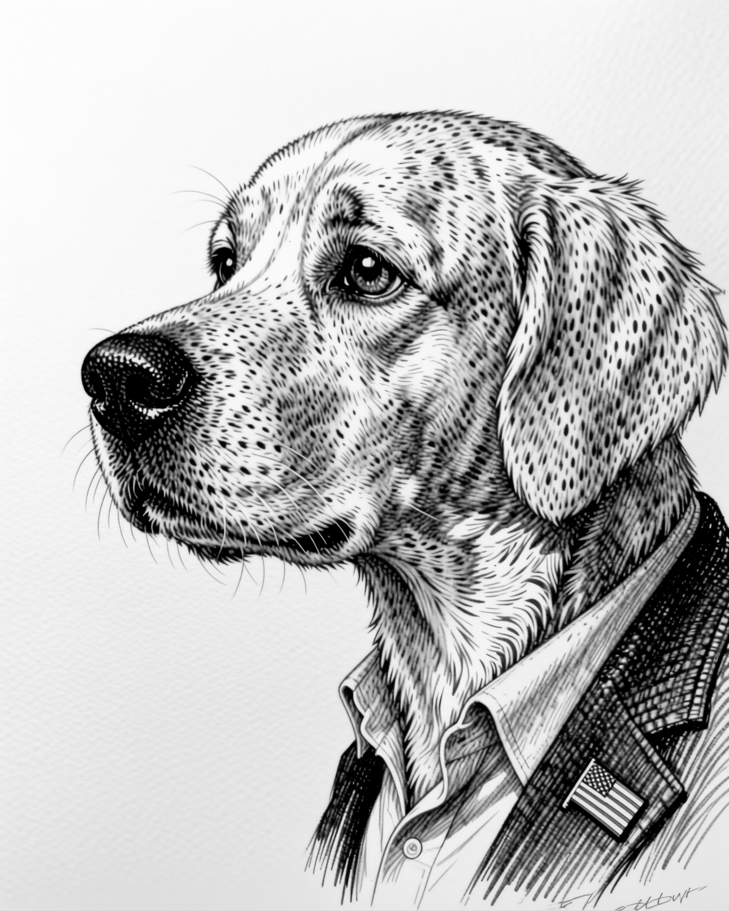

**The ask.** The founder: 'its a flamingo you did a terrible job you must perfect each character.' Round 3 for BARCLAY, against the judges' round-2 list: turn his head a FULL three-quarter into the room and draw the far eye whole, off the muzzle bridge, at least two-thirds the width of the near one; open both eyes wide and human with the worry carried by two raised inner brows; run the black lip-line band forward, unbroken, to finish directly under the front corner of the near eye; give him four separately contoured fingers and a thumb, no mitten and no claws; draw the USA flag pin legibly - canton, stars, bars, staff - on the near lapel and nowhere else; each drop ear a separate leather with a long wavy fringe, lifting clear of the shoulder; the coat in long layered directional strokes, not a field of spiky dashes; one unbroken glass rim with the cherry down inside below the liquid line; and no lettering, no blank rectangle and no crazed marble anywhere. And before rendering: re-cut Picture 2 so the whole head sits inside it with air, rebuild Picture 3 with no paint-outs, and rebuild Picture 1's head so the pose is DRAWN rather than hinted.

**The thinking.** The judges' three reference fixes were all made, one of them by the escalation their own PROCESS line authorises. (1) PICTURE 2 was re-cut (70,0,720,730) instead of (330,100,690,700), which had sliced the nose tip off at the tile edge; measured off a gridded copy, the head runs crown y=45, nose x=130, chin y=430, ear back x=540, and the lapel flag pin sits at x 628-700, y 628-690, so the new tile clears all of it with 40-60 px of air and nothing touching an edge. That taller cut catches the study's own raised glass and STIRRER in the corner - a pick in a reference - so the corner was rebuilt from the picture's own material 104 px higher up the same columns: blank paper over the paper half, the jacket's own weave and its slanting edge over the jacket half. No paint-out. (2) PICTURE 3: sc07 is dropped. Its mouth is OPEN, which fought the closed-mouth edit, and its tile carried a flat grey block over two lettered labels. All twelve retired plates were read at full size; sc01 is the one that crops tight on a CLOSED mouth with the lettered shelf row entirely above the crop (labels end y=800, crown starts y=855), so the tile is (620,818,420,344). The single label inside it, ACE RESERVE, was removed the way the judges asked - engraved bottle-glass cloned down from the same bottle's shoulder, never a block. (3) PICTURE 1: the judges asked for the re-cut Picture 2 head to be composited in 'turned further into the room than it is now', which pasting it cannot do - that is the same shallow turn round 2 pasted and the model flattened back to profile. Their PROCESS line authorises the escalation, so the three-quarter was borrowed from canon's ONLY true three-quarter of Barclay with both eyes whole and the mouth closed: canon/characters/dog/kit/head.png. It faces the reader's right, so it was MIRRORED - after which the muzzle points frame-left, the near ear lands where the plate's own ear is, and the far eye sits clear of the muzzle bridge. It was scaled 300/635 to the plate's own crown-to-jaw and seated crown-on-crown, nose-on-nose. It is graphite, so the prompt says outright that Picture 1's head is a rough paste-up whose ANGLE and PLACEMENT are law and whose quality is not. Three faults of the round-2 composite were also fixed in pixels rather than in words: the halo round the skull (the head is now cut by FINDING the kit sheet's paper - bright AND locally flat - then eroding 3 px, instead of by a hand polygon), the pale bushy lobe of the plate's old profile ear sticking out past the narrower three-quarter head (rebuilt from the back bar's own slat panelling tiled down), and the cocktail pick, whose column is now rebuilt by row-wise interpolation so the rim ellipse and the liquid line run straight through it, with the cherry re-seated below the liquid line. ONE CONTRADICTION in the judges' list was resolved and is flagged: it asks both for an iris 'pressed against the FRONT corner... front 40 percent' and for an iris 'near the CENTRE of the eye, not jammed into the corner', with both pupils aimed at one spot in the room. The centred version is the one consistent with the pose this round exists to get, so EDIT 2 takes it and keeps from the other only what does not conflict.

**Settings.** scripts/cast-study.py via scripts/run-barclay-round3.sh, references built by scripts/make-barclay-round3-tiles.py - local/qwen-image-edit-2511, provider local, 4:5 -> 1344x1680, fast Lightning 8 steps, cfg 1.0, euler/simple, shift 3.0, 3 references (composited plate crop + re-cut study + sc01 head crop), 14 numbered EDITs, LOCAL_NEGATIVE verbatim (inert at cfg 1), tag study-barclay-r3. Seed 7.

**Prompt.** [prompts/078-barclay-character-study-round-3-seed-7-reject-the-room-fell-away-and-the-coat-went-spotted.prompt.txt](prompts/078-barclay-character-study-round-3-seed-7-reject-the-room-fell-away-and-the-coat-went-spotted.prompt.txt)

**Verdict.** REJECT. The model took its staging from Picture 2 instead of Picture 1: the bar is gone and he sits on blank paper, with a scribbled signature at the bottom edge. The coat is drawn in heavy round SPOTS rather than layered strokes, which reads as a spaniel and not a golden retriever, and the head fills the frame. Worth keeping for one thing only - it drew the most legible USA flag pin of the six, canton, stars and bars, on the near lapel. Whatever that seed did to the pin is what the other five need.

*Logged 11:38.*

---

## 079. Barclay character study round 3 seed 12 second best softer eyes and a glossy nose

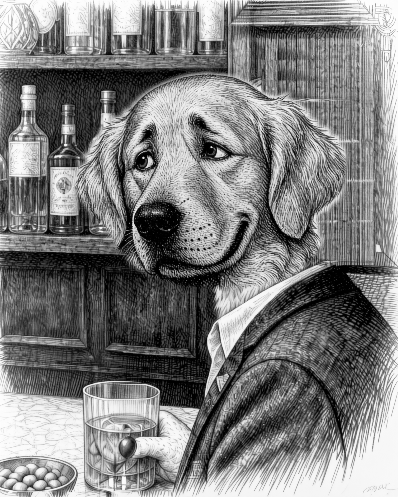

**The ask.** The founder: 'its a flamingo you did a terrible job you must perfect each character.' Round 3 for BARCLAY, against the judges' round-2 list: turn his head a FULL three-quarter into the room and draw the far eye whole, off the muzzle bridge, at least two-thirds the width of the near one; open both eyes wide and human with the worry carried by two raised inner brows; run the black lip-line band forward, unbroken, to finish directly under the front corner of the near eye; give him four separately contoured fingers and a thumb, no mitten and no claws; draw the USA flag pin legibly - canton, stars, bars, staff - on the near lapel and nowhere else; each drop ear a separate leather with a long wavy fringe, lifting clear of the shoulder; the coat in long layered directional strokes, not a field of spiky dashes; one unbroken glass rim with the cherry down inside below the liquid line; and no lettering, no blank rectangle and no crazed marble anywhere. And before rendering: re-cut Picture 2 so the whole head sits inside it with air, rebuild Picture 3 with no paint-outs, and rebuild Picture 1's head so the pose is DRAWN rather than hinted.

**The thinking.** The judges' three reference fixes were all made, one of them by the escalation their own PROCESS line authorises. (1) PICTURE 2 was re-cut (70,0,720,730) instead of (330,100,690,700), which had sliced the nose tip off at the tile edge; measured off a gridded copy, the head runs crown y=45, nose x=130, chin y=430, ear back x=540, and the lapel flag pin sits at x 628-700, y 628-690, so the new tile clears all of it with 40-60 px of air and nothing touching an edge. That taller cut catches the study's own raised glass and STIRRER in the corner - a pick in a reference - so the corner was rebuilt from the picture's own material 104 px higher up the same columns: blank paper over the paper half, the jacket's own weave and its slanting edge over the jacket half. No paint-out. (2) PICTURE 3: sc07 is dropped. Its mouth is OPEN, which fought the closed-mouth edit, and its tile carried a flat grey block over two lettered labels. All twelve retired plates were read at full size; sc01 is the one that crops tight on a CLOSED mouth with the lettered shelf row entirely above the crop (labels end y=800, crown starts y=855), so the tile is (620,818,420,344). The single label inside it, ACE RESERVE, was removed the way the judges asked - engraved bottle-glass cloned down from the same bottle's shoulder, never a block. (3) PICTURE 1: the judges asked for the re-cut Picture 2 head to be composited in 'turned further into the room than it is now', which pasting it cannot do - that is the same shallow turn round 2 pasted and the model flattened back to profile. Their PROCESS line authorises the escalation, so the three-quarter was borrowed from canon's ONLY true three-quarter of Barclay with both eyes whole and the mouth closed: canon/characters/dog/kit/head.png. It faces the reader's right, so it was MIRRORED - after which the muzzle points frame-left, the near ear lands where the plate's own ear is, and the far eye sits clear of the muzzle bridge. It was scaled 300/635 to the plate's own crown-to-jaw and seated crown-on-crown, nose-on-nose. It is graphite, so the prompt says outright that Picture 1's head is a rough paste-up whose ANGLE and PLACEMENT are law and whose quality is not. Three faults of the round-2 composite were also fixed in pixels rather than in words: the halo round the skull (the head is now cut by FINDING the kit sheet's paper - bright AND locally flat - then eroding 3 px, instead of by a hand polygon), the pale bushy lobe of the plate's old profile ear sticking out past the narrower three-quarter head (rebuilt from the back bar's own slat panelling tiled down), and the cocktail pick, whose column is now rebuilt by row-wise interpolation so the rim ellipse and the liquid line run straight through it, with the cherry re-seated below the liquid line. ONE CONTRADICTION in the judges' list was resolved and is flagged: it asks both for an iris 'pressed against the FRONT corner... front 40 percent' and for an iris 'near the CENTRE of the eye, not jammed into the corner', with both pupils aimed at one spot in the room. The centred version is the one consistent with the pose this round exists to get, so EDIT 2 takes it and keeps from the other only what does not conflict.

**Settings.** scripts/cast-study.py via scripts/run-barclay-round3.sh, references built by scripts/make-barclay-round3-tiles.py - local/qwen-image-edit-2511, provider local, 4:5 -> 1344x1680, fast Lightning 8 steps, cfg 1.0, euler/simple, shift 3.0, 3 references (composited plate crop + re-cut study + sc01 head crop), 14 numbered EDITs, LOCAL_NEGATIVE verbatim (inert at cfg 1), tag study-barclay-r3. Seed 12.

**Prompt.** [prompts/079-barclay-character-study-round-3-seed-12-second-best-softer-eyes-and-a-glossy-nose.prompt.txt](prompts/079-barclay-character-study-round-3-seed-12-second-best-softer-eyes-and-a-glossy-nose.prompt.txt)

**Verdict.** SECOND BEST. Same true three-quarter, both eyes whole with white showing round the iris, closed mouth, black lip band, room and prop all correct, one character only. Behind seed 41 on three counts: the far eye is smaller, the nose carries a broad glossy shine instead of one pinpoint highlight, and the near ear merges into the ruff. Same open faults as 41 - camera too close, blank-triangle pin, pseudo-writing on a label, crazed marble.

*Logged 11:38.*

---

## 080. Barclay character study round 3 seed 68 good pose sleepier eyes one lettered label

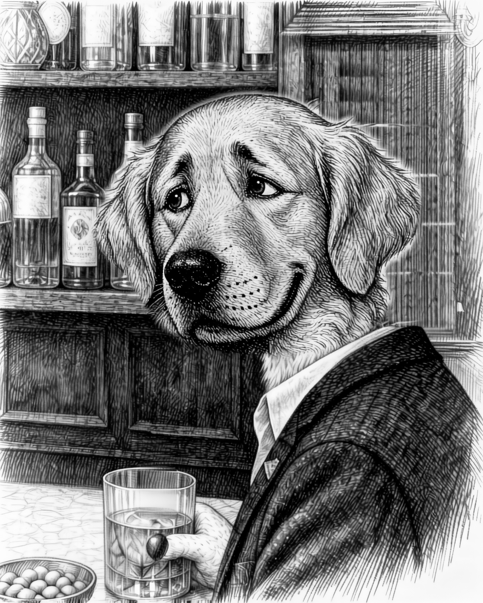

**The ask.** The founder: 'its a flamingo you did a terrible job you must perfect each character.' Round 3 for BARCLAY, against the judges' round-2 list: turn his head a FULL three-quarter into the room and draw the far eye whole, off the muzzle bridge, at least two-thirds the width of the near one; open both eyes wide and human with the worry carried by two raised inner brows; run the black lip-line band forward, unbroken, to finish directly under the front corner of the near eye; give him four separately contoured fingers and a thumb, no mitten and no claws; draw the USA flag pin legibly - canton, stars, bars, staff - on the near lapel and nowhere else; each drop ear a separate leather with a long wavy fringe, lifting clear of the shoulder; the coat in long layered directional strokes, not a field of spiky dashes; one unbroken glass rim with the cherry down inside below the liquid line; and no lettering, no blank rectangle and no crazed marble anywhere. And before rendering: re-cut Picture 2 so the whole head sits inside it with air, rebuild Picture 3 with no paint-outs, and rebuild Picture 1's head so the pose is DRAWN rather than hinted.

**The thinking.** The judges' three reference fixes were all made, one of them by the escalation their own PROCESS line authorises. (1) PICTURE 2 was re-cut (70,0,720,730) instead of (330,100,690,700), which had sliced the nose tip off at the tile edge; measured off a gridded copy, the head runs crown y=45, nose x=130, chin y=430, ear back x=540, and the lapel flag pin sits at x 628-700, y 628-690, so the new tile clears all of it with 40-60 px of air and nothing touching an edge. That taller cut catches the study's own raised glass and STIRRER in the corner - a pick in a reference - so the corner was rebuilt from the picture's own material 104 px higher up the same columns: blank paper over the paper half, the jacket's own weave and its slanting edge over the jacket half. No paint-out. (2) PICTURE 3: sc07 is dropped. Its mouth is OPEN, which fought the closed-mouth edit, and its tile carried a flat grey block over two lettered labels. All twelve retired plates were read at full size; sc01 is the one that crops tight on a CLOSED mouth with the lettered shelf row entirely above the crop (labels end y=800, crown starts y=855), so the tile is (620,818,420,344). The single label inside it, ACE RESERVE, was removed the way the judges asked - engraved bottle-glass cloned down from the same bottle's shoulder, never a block. (3) PICTURE 1: the judges asked for the re-cut Picture 2 head to be composited in 'turned further into the room than it is now', which pasting it cannot do - that is the same shallow turn round 2 pasted and the model flattened back to profile. Their PROCESS line authorises the escalation, so the three-quarter was borrowed from canon's ONLY true three-quarter of Barclay with both eyes whole and the mouth closed: canon/characters/dog/kit/head.png. It faces the reader's right, so it was MIRRORED - after which the muzzle points frame-left, the near ear lands where the plate's own ear is, and the far eye sits clear of the muzzle bridge. It was scaled 300/635 to the plate's own crown-to-jaw and seated crown-on-crown, nose-on-nose. It is graphite, so the prompt says outright that Picture 1's head is a rough paste-up whose ANGLE and PLACEMENT are law and whose quality is not. Three faults of the round-2 composite were also fixed in pixels rather than in words: the halo round the skull (the head is now cut by FINDING the kit sheet's paper - bright AND locally flat - then eroding 3 px, instead of by a hand polygon), the pale bushy lobe of the plate's old profile ear sticking out past the narrower three-quarter head (rebuilt from the back bar's own slat panelling tiled down), and the cocktail pick, whose column is now rebuilt by row-wise interpolation so the rim ellipse and the liquid line run straight through it, with the cherry re-seated below the liquid line. ONE CONTRADICTION in the judges' list was resolved and is flagged: it asks both for an iris 'pressed against the FRONT corner... front 40 percent' and for an iris 'near the CENTRE of the eye, not jammed into the corner', with both pupils aimed at one spot in the room. The centred version is the one consistent with the pose this round exists to get, so EDIT 2 takes it and keeps from the other only what does not conflict.

**Settings.** scripts/cast-study.py via scripts/run-barclay-round3.sh, references built by scripts/make-barclay-round3-tiles.py - local/qwen-image-edit-2511, provider local, 4:5 -> 1344x1680, fast Lightning 8 steps, cfg 1.0, euler/simple, shift 3.0, 3 references (composited plate crop + re-cut study + sc01 head crop), 14 numbered EDITs, LOCAL_NEGATIVE verbatim (inert at cfg 1), tag study-barclay-r3. Seed 68.

**Prompt.** [prompts/080-barclay-character-study-round-3-seed-68-good-pose-sleepier-eyes-one-lettered-label.prompt.txt](prompts/080-barclay-character-study-round-3-seed-68-good-pose-sleepier-eyes-one-lettered-label.prompt.txt)

**Verdict.** PASS, third. The pose holds and the room, the glass and the single-character rule all hold; the ears are the cleanest pair of the six, each a separate leather lifting clear of the shoulder. Held back by sleepier, smaller eyes with heavier upper lids, a broad glossy nose highlight, a lip-line that thins to grey along the muzzle, and a bottle label carrying legible pseudo-text.

*Logged 11:38.*

---

## 081. Barclay character study round 3 seed 91 reject back to profile with a spotted coat

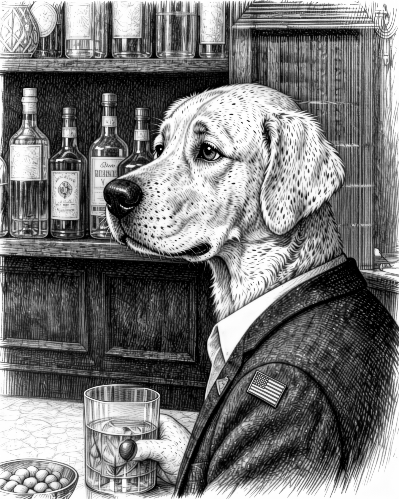

**The ask.** The founder: 'its a flamingo you did a terrible job you must perfect each character.' Round 3 for BARCLAY, against the judges' round-2 list: turn his head a FULL three-quarter into the room and draw the far eye whole, off the muzzle bridge, at least two-thirds the width of the near one; open both eyes wide and human with the worry carried by two raised inner brows; run the black lip-line band forward, unbroken, to finish directly under the front corner of the near eye; give him four separately contoured fingers and a thumb, no mitten and no claws; draw the USA flag pin legibly - canton, stars, bars, staff - on the near lapel and nowhere else; each drop ear a separate leather with a long wavy fringe, lifting clear of the shoulder; the coat in long layered directional strokes, not a field of spiky dashes; one unbroken glass rim with the cherry down inside below the liquid line; and no lettering, no blank rectangle and no crazed marble anywhere. And before rendering: re-cut Picture 2 so the whole head sits inside it with air, rebuild Picture 3 with no paint-outs, and rebuild Picture 1's head so the pose is DRAWN rather than hinted.

**The thinking.** The judges' three reference fixes were all made, one of them by the escalation their own PROCESS line authorises. (1) PICTURE 2 was re-cut (70,0,720,730) instead of (330,100,690,700), which had sliced the nose tip off at the tile edge; measured off a gridded copy, the head runs crown y=45, nose x=130, chin y=430, ear back x=540, and the lapel flag pin sits at x 628-700, y 628-690, so the new tile clears all of it with 40-60 px of air and nothing touching an edge. That taller cut catches the study's own raised glass and STIRRER in the corner - a pick in a reference - so the corner was rebuilt from the picture's own material 104 px higher up the same columns: blank paper over the paper half, the jacket's own weave and its slanting edge over the jacket half. No paint-out. (2) PICTURE 3: sc07 is dropped. Its mouth is OPEN, which fought the closed-mouth edit, and its tile carried a flat grey block over two lettered labels. All twelve retired plates were read at full size; sc01 is the one that crops tight on a CLOSED mouth with the lettered shelf row entirely above the crop (labels end y=800, crown starts y=855), so the tile is (620,818,420,344). The single label inside it, ACE RESERVE, was removed the way the judges asked - engraved bottle-glass cloned down from the same bottle's shoulder, never a block. (3) PICTURE 1: the judges asked for the re-cut Picture 2 head to be composited in 'turned further into the room than it is now', which pasting it cannot do - that is the same shallow turn round 2 pasted and the model flattened back to profile. Their PROCESS line authorises the escalation, so the three-quarter was borrowed from canon's ONLY true three-quarter of Barclay with both eyes whole and the mouth closed: canon/characters/dog/kit/head.png. It faces the reader's right, so it was MIRRORED - after which the muzzle points frame-left, the near ear lands where the plate's own ear is, and the far eye sits clear of the muzzle bridge. It was scaled 300/635 to the plate's own crown-to-jaw and seated crown-on-crown, nose-on-nose. It is graphite, so the prompt says outright that Picture 1's head is a rough paste-up whose ANGLE and PLACEMENT are law and whose quality is not. Three faults of the round-2 composite were also fixed in pixels rather than in words: the halo round the skull (the head is now cut by FINDING the kit sheet's paper - bright AND locally flat - then eroding 3 px, instead of by a hand polygon), the pale bushy lobe of the plate's old profile ear sticking out past the narrower three-quarter head (rebuilt from the back bar's own slat panelling tiled down), and the cocktail pick, whose column is now rebuilt by row-wise interpolation so the rim ellipse and the liquid line run straight through it, with the cherry re-seated below the liquid line. ONE CONTRADICTION in the judges' list was resolved and is flagged: it asks both for an iris 'pressed against the FRONT corner... front 40 percent' and for an iris 'near the CENTRE of the eye, not jammed into the corner', with both pupils aimed at one spot in the room. The centred version is the one consistent with the pose this round exists to get, so EDIT 2 takes it and keeps from the other only what does not conflict.

**Settings.** scripts/cast-study.py via scripts/run-barclay-round3.sh, references built by scripts/make-barclay-round3-tiles.py - local/qwen-image-edit-2511, provider local, 4:5 -> 1344x1680, fast Lightning 8 steps, cfg 1.0, euler/simple, shift 3.0, 3 references (composited plate crop + re-cut study + sc01 head crop), 14 numbered EDITs, LOCAL_NEGATIVE verbatim (inert at cfg 1), tag study-barclay-r3. Seed 91.

**Prompt.** [prompts/081-barclay-character-study-round-3-seed-91-reject-back-to-profile-with-a-spotted-coat.prompt.txt](prompts/081-barclay-character-study-round-3-seed-91-reject-back-to-profile-with-a-spotted-coat.prompt.txt)

**Verdict.** REJECT. The head regressed to the old near-profile with only one eye drawn, and the coat went to heavy spots again. It did draw a clean USA flag - canton, stars and bars - but on the SHOULDER, which the note forbids, not on the lapel. The camera distance, ironically, is the best of the six.

*Logged 11:38.*

---

## 082. Barclay character study round 3 contact sheet six seeds beside the kit tiles

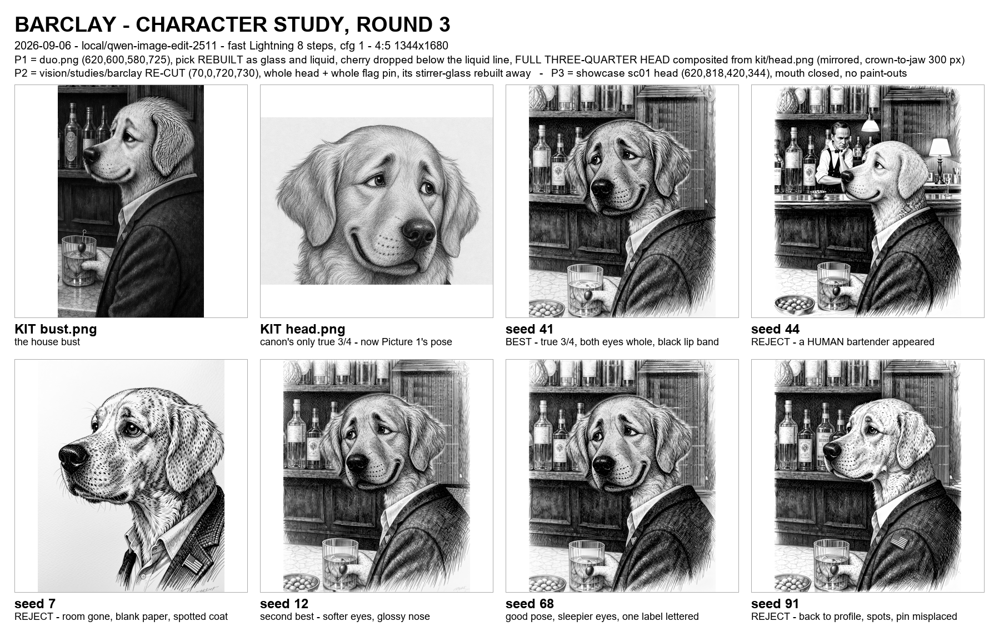

**The ask.** The founder: 'its a flamingo you did a terrible job you must perfect each character.' Round 3 for BARCLAY, against the judges' round-2 list: turn his head a FULL three-quarter into the room and draw the far eye whole, off the muzzle bridge, at least two-thirds the width of the near one; open both eyes wide and human with the worry carried by two raised inner brows; run the black lip-line band forward, unbroken, to finish directly under the front corner of the near eye; give him four separately contoured fingers and a thumb, no mitten and no claws; draw the USA flag pin legibly - canton, stars, bars, staff - on the near lapel and nowhere else; each drop ear a separate leather with a long wavy fringe, lifting clear of the shoulder; the coat in long layered directional strokes, not a field of spiky dashes; one unbroken glass rim with the cherry down inside below the liquid line; and no lettering, no blank rectangle and no crazed marble anywhere. And before rendering: re-cut Picture 2 so the whole head sits inside it with air, rebuild Picture 3 with no paint-outs, and rebuild Picture 1's head so the pose is DRAWN rather than hinted.

**The thinking.** The judges' three reference fixes were all made, one of them by the escalation their own PROCESS line authorises. (1) PICTURE 2 was re-cut (70,0,720,730) instead of (330,100,690,700), which had sliced the nose tip off at the tile edge; measured off a gridded copy, the head runs crown y=45, nose x=130, chin y=430, ear back x=540, and the lapel flag pin sits at x 628-700, y 628-690, so the new tile clears all of it with 40-60 px of air and nothing touching an edge. That taller cut catches the study's own raised glass and STIRRER in the corner - a pick in a reference - so the corner was rebuilt from the picture's own material 104 px higher up the same columns: blank paper over the paper half, the jacket's own weave and its slanting edge over the jacket half. No paint-out. (2) PICTURE 3: sc07 is dropped. Its mouth is OPEN, which fought the closed-mouth edit, and its tile carried a flat grey block over two lettered labels. All twelve retired plates were read at full size; sc01 is the one that crops tight on a CLOSED mouth with the lettered shelf row entirely above the crop (labels end y=800, crown starts y=855), so the tile is (620,818,420,344). The single label inside it, ACE RESERVE, was removed the way the judges asked - engraved bottle-glass cloned down from the same bottle's shoulder, never a block. (3) PICTURE 1: the judges asked for the re-cut Picture 2 head to be composited in 'turned further into the room than it is now', which pasting it cannot do - that is the same shallow turn round 2 pasted and the model flattened back to profile. Their PROCESS line authorises the escalation, so the three-quarter was borrowed from canon's ONLY true three-quarter of Barclay with both eyes whole and the mouth closed: canon/characters/dog/kit/head.png. It faces the reader's right, so it was MIRRORED - after which the muzzle points frame-left, the near ear lands where the plate's own ear is, and the far eye sits clear of the muzzle bridge. It was scaled 300/635 to the plate's own crown-to-jaw and seated crown-on-crown, nose-on-nose. It is graphite, so the prompt says outright that Picture 1's head is a rough paste-up whose ANGLE and PLACEMENT are law and whose quality is not. Three faults of the round-2 composite were also fixed in pixels rather than in words: the halo round the skull (the head is now cut by FINDING the kit sheet's paper - bright AND locally flat - then eroding 3 px, instead of by a hand polygon), the pale bushy lobe of the plate's old profile ear sticking out past the narrower three-quarter head (rebuilt from the back bar's own slat panelling tiled down), and the cocktail pick, whose column is now rebuilt by row-wise interpolation so the rim ellipse and the liquid line run straight through it, with the cherry re-seated below the liquid line. ONE CONTRADICTION in the judges' list was resolved and is flagged: it asks both for an iris 'pressed against the FRONT corner... front 40 percent' and for an iris 'near the CENTRE of the eye, not jammed into the corner', with both pupils aimed at one spot in the room. The centred version is the one consistent with the pose this round exists to get, so EDIT 2 takes it and keeps from the other only what does not conflict.

**Settings.** scripts/cast-study.py via scripts/run-barclay-round3.sh, references built by scripts/make-barclay-round3-tiles.py - local/qwen-image-edit-2511, provider local, 4:5 -> 1344x1680, fast Lightning 8 steps, cfg 1.0, euler/simple, shift 3.0, 3 references (composited plate crop + re-cut study + sc01 head crop), 14 numbered EDITs, LOCAL_NEGATIVE verbatim (inert at cfg 1), tag study-barclay-r3. Seeds 41, 44, 7, 12, 68, 91 - 41 and 44 held from round 2 as the judges asked, four new.

**Verdict.** The round's one big win is structural: with the three-quarter DRAWN into Picture 1 from kit/head.png rather than prompted, four of six seeds came back with the head turned properly into the room and the far eye whole and off the muzzle bridge - the fault that has failed every previous round. Seed 41 is the best Barclay the project has: full three-quarter, both eyes open and human, both inner brows lifted, unbroken black lip band, black nose, two separate fringed ears, collar on both sides, unbroken glass rim with no pick. Seeds 12 and 68 are usable behind it. Three rejects, each a different lesson: 44 invented a HUMAN bartender (the empty service side must be named), 7 took Picture 2's blank-paper staging instead of Picture 1's room and drew a spotted coat, 91 fell back to profile. STILL OPEN AFTER THREE ROUNDS, and the round-4 list: the flag pin is a blank pale triangle in every seed that got the pose right, while the two seeds that drew a real flag (7 on the lapel, 91 on the shoulder) are the two that got other things wrong; the camera keeps pushing in to about half-frame instead of the third asked for, which the wider Picture 1 crop should now be tried against; bottle labels keep growing pseudo-writing and the marble keeps crazing; and the paste-up seam behind the skull still shows as a soft vertical blur in the panelling.

*Logged 11:38.*

---

## 083. Barclay round 3 - JUDGE verdict: REJECT (seed 41, best of six)

**The ask.** Would the founder accept this as Barclay perfected - huggable, professional, the retriever texture beautiful, the eyes human?

**The thinking.** Best of the six (both eyes whole, no human intruder, no ticked coat), but it fails five things a viewer sees in two seconds: mismatched eyes (near eye a round dog eye with a catchlight, far eye a heavy-lidded slit set higher on a different axis - he reads wall-eyed and sleepy); a long black lip-line that hooks UP past the cheek into a smirk when canon says mouth closed, one unbroken line; the head is oversized and neckless, sitting on the shoulder like a mask (inherited straight from the P1 composite where kit/head.png was pasted onto the duo plate); no USA flag pin and no real shirt collar - one blank white wedge like a folded napkin plus a stray dark triangle that reads as half a tie; and the whole line is grey embossed mush, not the crisp black-pen-on-white-paper engraving of P2 and of sc07/sc09. Root cause is the reference stack: P1 is a low-quality composite and the model matched its geometry and its texture instead of P2's quality.

**Settings.** local/qwen-image-edit-2511, fast Lightning 8 steps, cfg 1, 4:5 1344x1680, seed 41; P1=composited duo crop, P2=barclay study re-cut, P3=sc01 head

**Verdict.** REJECT - not perfected. Rebuild P1 (no pasted head), promote the barclay study to Picture 1, and add EDITs for matched eyes, closed lip-line, visible neck and ruff, two-leaf collar and the lapel pin.

*Logged 11:41.*

---

## 084. Barclay round 4 pass A seed 41 the promoted drawing sent uncut draws a standing portrait on paper

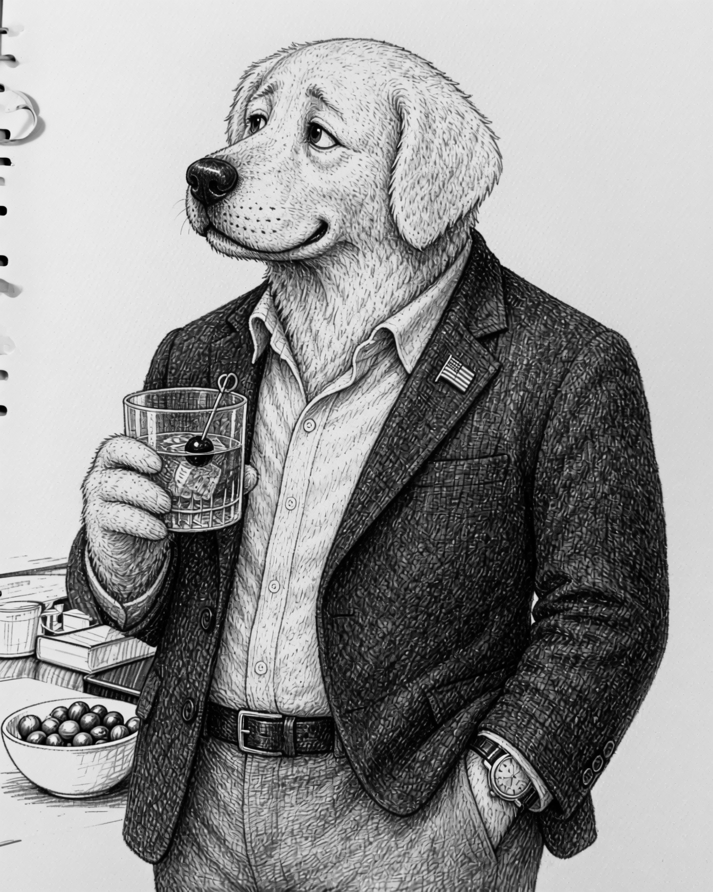

**The ask.** The founder: 'its a flamingo you did a terrible job you must perfect each character.' Round 4 for BARCLAY, against the judges' round-3 list: promote canon/vision/studies/barclay.png out of the Picture 2 slot and stop basing the render on the round-3 composite; drop the sc01 profile head; give him a real neck, a two-leaf collar with no tie of any kind, a notched lapel carrying a whole USA flag pin and a round-dialled wristwatch on the wrist; two matched eyes on one level line; a closed lip-line running the full two nose-widths to under the front corner of the near eye and hooking clearly UP so the smile reads happy; layered drop ears clear of the shoulder; three rows of four whisker pips and no ticking anywhere else; clean black pen on white paper with no grey wash; no signature and no blank paper in any corner.

**The thinking.** The judges' first instruction was to stop using round 3's composite as Picture 1 and promote canon/vision/studies/barclay.png, the real full-quality drawing, into the base slot. Pass A did exactly that, uncut, with the round-3 composite demoted to Picture 3 and labelled for the camera and the crop only.

**Settings.** local/qwen-image-edit-2511 via POST 127.0.0.1:8000/api/generate, fast Lightning 8 steps, cfg 1.0, euler/simple, shift 3.0, 4:5 1344x1680, negative_refs on (LOCAL_NEGATIVE is inert at cfg 1), tag study-barclay-r4, 2 references. P1 studies/barclay.png cropped 0,20,1024,1100; P2 the same drawing uncut; P3 the round-3 composite.

**Prompt.** [prompts/084-barclay-round-4-pass-a-seed-41-the-promoted-drawing-sent-uncut-draws-a-standing-portrait-on-paper.prompt.txt](prompts/084-barclay-round-4-pass-a-seed-41-the-promoted-drawing-sent-uncut-draws-a-standing-portrait-on-paper.prompt.txt)

**Verdict.** REJECT, and it taught the round its lesson. The CHARACTER jumped: a real neck, a small skull on wide shoulders, two collar leaves over a buttoned placket, no tie, a notched lapel with the flag pin on it, the wristwatch, layered ears, clean pen line, three rows of whisker pips, both eyes level, a warm up-hooked mouth. The PICTURE failed: the uncut Picture 2 handed over its standing three-quarter-length pose (belt, trousers, second hand in a pocket) and, worse, the room never built at all - blank paper, a spiral binding down the left edge, the counter shrunk to a shelf in the corner. An edit model keeps its base picture's ground, and that drawing's ground is studio paper.

*Logged 12:06.*

---

## 085. Barclay round 4 pass B seed 41 cutting picture 2 to the chest kills the standing pose but not the blank paper

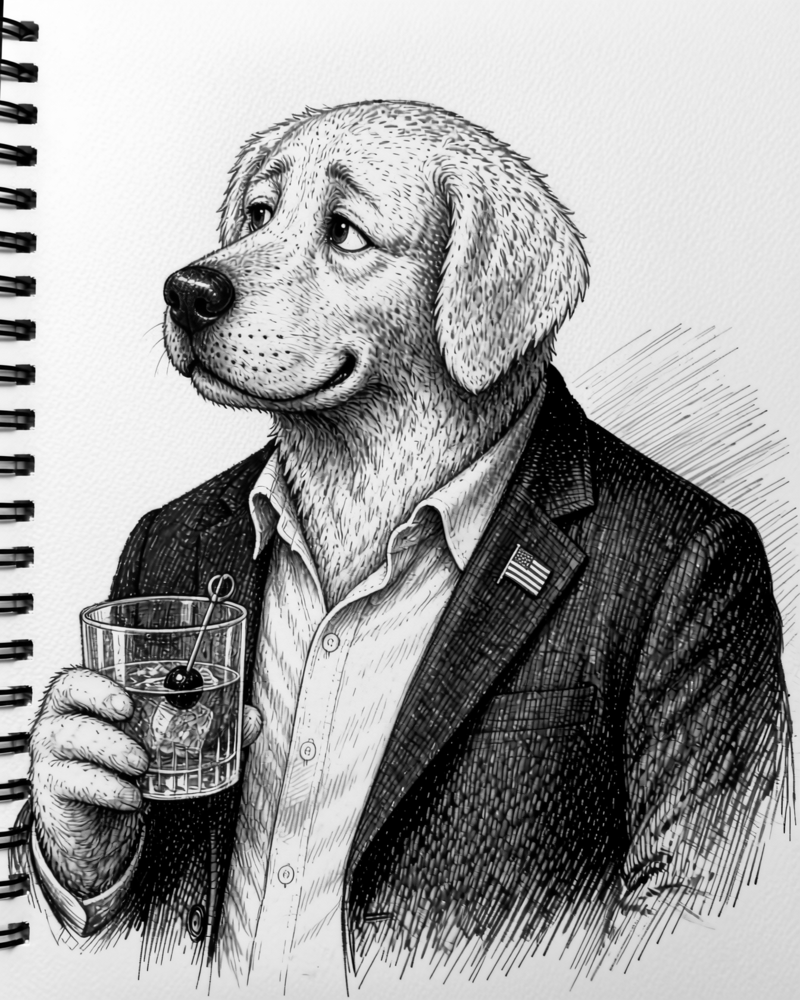

**The ask.** The founder: 'its a flamingo you did a terrible job you must perfect each character.' Round 4 for BARCLAY, against the judges' round-3 list: promote canon/vision/studies/barclay.png out of the Picture 2 slot and stop basing the render on the round-3 composite; drop the sc01 profile head; give him a real neck, a two-leaf collar with no tie of any kind, a notched lapel carrying a whole USA flag pin and a round-dialled wristwatch on the wrist; two matched eyes on one level line; a closed lip-line running the full two nose-widths to under the front corner of the near eye and hooking clearly UP so the smile reads happy; layered drop ears clear of the shoulder; three rows of four whisker pips and no ticking anywhere else; clean black pen on white paper with no grey wash; no signature and no blank paper in any corner.

**The thinking.** Pass A's standing pose could only have come from the uncut Picture 2, so Picture 2 was cut to the chest (60,20,860,860 - head, neck, collar, both lapels, the whole pin). The room edit was promoted to the front of the list and hardened with every word for blank paper it could carry: no sheet, no page edge, no sketchbook, no spiral binding, no border, no signature.

**Settings.** local/qwen-image-edit-2511 via POST 127.0.0.1:8000/api/generate, fast Lightning 8 steps, cfg 1.0, euler/simple, shift 3.0, 4:5 1344x1680, negative_refs on (LOCAL_NEGATIVE is inert at cfg 1), tag study-barclay-r4, 2 references. P1 studies/barclay.png cropped 0,20,1024,1100; P2 the same drawing cropped 60,20,860,860; P3 the round-3 composite.

**Prompt.** [prompts/085-barclay-round-4-pass-b-seed-41-cutting-picture-2-to-the-chest-kills-the-standing-pose-but-not-the-blank-paper.prompt.txt](prompts/085-barclay-round-4-pass-b-seed-41-cutting-picture-2-to-the-chest-kills-the-standing-pose-but-not-the-blank-paper.prompt.txt)

**Verdict.** REJECT. The belt and trousers went, so the diagnosis was right. The blank paper did not: the spiral binding came back larger and a signature scribble appeared in the corner. Words cannot beat the base picture on this path - LOCAL_NEGATIVE is inert at cfg 1 and the base's ground is what the model keeps. Picture 1 itself had to carry the room.

*Logged 12:06.*

---

## 086. Barclay round 4 pass C seed 41 the uncut duo plate as an ink tile redraws the whole two-character plate

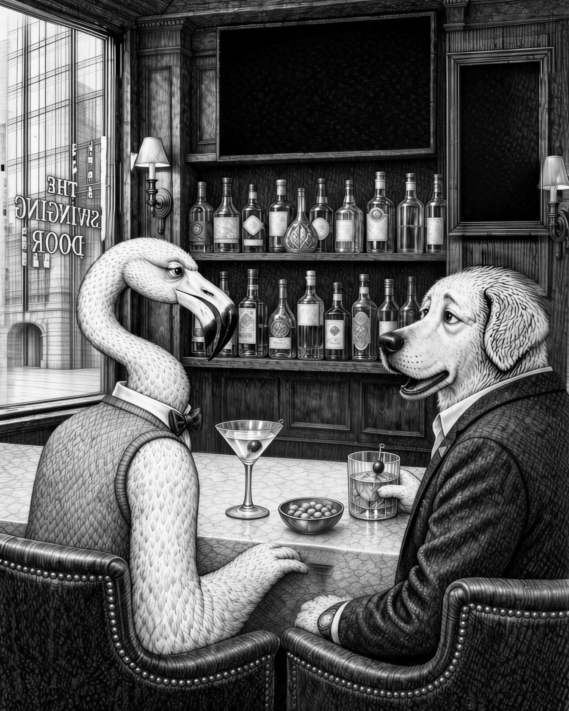

**The ask.** The founder: 'its a flamingo you did a terrible job you must perfect each character.' Round 4 for BARCLAY, against the judges' round-3 list: promote canon/vision/studies/barclay.png out of the Picture 2 slot and stop basing the render on the round-3 composite; drop the sc01 profile head; give him a real neck, a two-leaf collar with no tie of any kind, a notched lapel carrying a whole USA flag pin and a round-dialled wristwatch on the wrist; two matched eyes on one level line; a closed lip-line running the full two nose-widths to under the front corner of the near eye and hooking clearly UP so the smile reads happy; layered drop ears clear of the shoulder; three rows of four whisker pips and no ticking anywhere else; clean black pen on white paper with no grey wash; no signature and no blank paper in any corner.

**The thinking.** Picture 1 was rebuilt to carry the room (scripts/make-barclay-round4-tiles.py). With the base fixed, the note's other offer was taken up: canon/plates/duo-barclay.png uncut as the third tile, asked for THE INK AND ONLY THE INK, its label saying in as many words that the tall bird in it is Drew and is not to be drawn.

**Settings.** local/qwen-image-edit-2511 via POST 127.0.0.1:8000/api/generate, fast Lightning 8 steps, cfg 1.0, euler/simple, shift 3.0, 4:5 1344x1680, negative_refs on (LOCAL_NEGATIVE is inert at cfg 1), tag study-barclay-r4, 2 references. P1 the promoted drawing seated in the plate's room; P2 the drawing close up; P3 canon/plates/duo-barclay.png uncut.

**Prompt.** [prompts/086-barclay-round-4-pass-c-seed-41-the-uncut-duo-plate-as-an-ink-tile-redraws-the-whole-two-character-plate.prompt.txt](prompts/086-barclay-round-4-pass-c-seed-41-the-uncut-duo-plate-as-an-ink-tile-redraws-the-whole-two-character-plate.prompt.txt)

**Verdict.** REJECT, and the third tile is dropped for the round. The model redrew the whole approved plate: flamingo, martini, mirrored window lettering, both armchairs. On this model an uncut duo plate is staging that no label can switch off. Nothing was lost by dropping it - the ink it was wanted for is already inside Picture 1, whose room IS that plate.

*Logged 12:06.*

---

## 087. Barclay character study round 4 seed 41 the promoted drawing seated in the approved room

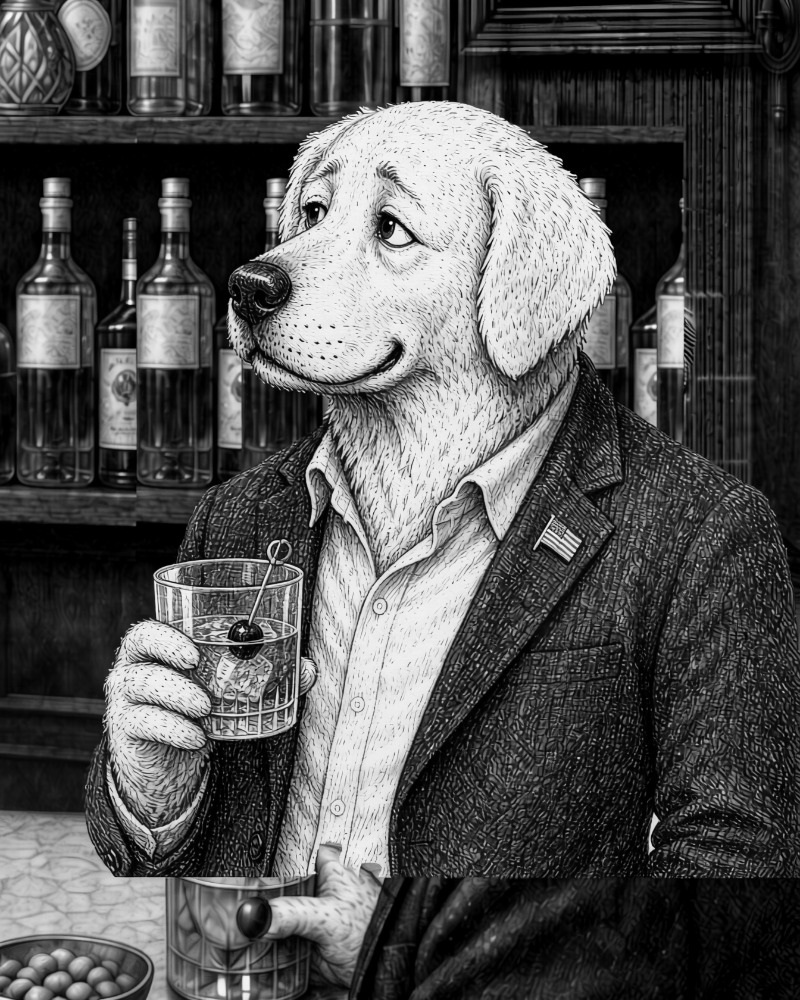

**The ask.** The founder: 'its a flamingo you did a terrible job you must perfect each character.' Round 4 for BARCLAY, against the judges' round-3 list: promote canon/vision/studies/barclay.png out of the Picture 2 slot and stop basing the render on the round-3 composite; drop the sc01 profile head; give him a real neck, a two-leaf collar with no tie of any kind, a notched lapel carrying a whole USA flag pin and a round-dialled wristwatch on the wrist; two matched eyes on one level line; a closed lip-line running the full two nose-widths to under the front corner of the near eye and hooking clearly UP so the smile reads happy; layered drop ears clear of the shoulder; three rows of four whisker pips and no ticking anywhere else; clean black pen on white paper with no grey wash; no signature and no blank paper in any corner.

**The thinking.** The reference swap the judges asked for, plus the correction three passes of this round forced. Picture 1 is the promoted drawing itself - canon/vision/studies/barclay.png, which has the head-to-shoulder proportion, the neck and ruff, the two-leaf collar and the flag pin that round 3 kept losing - but its chest-up FIGURE is matted off its studio paper and seated into the approved plate's own room crop at the plate's camera, head 29 percent of the tile height. That is not the composite the note banned: that one was a graphite HEAD mask on a duo crop, which is where the neckless jaw-on-collar join and the grey wash came from; what is pasted here brings its own neck, ruff, shoulders, collar, lapel and pin, so the geometry faults are fixed BY the paste. Picture 2 is the same drawing close up as the identity tile. The sc01 profile head is dropped as instructed. Fifteen EDIT lines carry the note's list. Where the note contradicts itself - a lip-line ending in a hook lifted clearly ABOVE the band's middle, versus one ending in a soft DOWNWARD tuck that does not hook - EDIT 3 takes the UP hook, because that is the fix the note leads with and the one that cites the founder's happier-not-sad correction; from the tuck line it keeps everything that does not conflict.

**Settings.** local/qwen-image-edit-2511 via POST 127.0.0.1:8000/api/generate, fast Lightning 8 steps, cfg 1.0, euler/simple, shift 3.0, 4:5 1344x1680, negative_refs on (LOCAL_NEGATIVE is inert at cfg 1), tag study-barclay-r4, 2 references. seed 41. P1 p1-barclay-in-room.png (studies/barclay.png cropped 0,20,1024,1120, matted, scaled to a 420 px head, seated at (101,78) in the round-3 room crop at 2x); P2 studies/barclay.png cropped 60,20,860,860. No third tile.

**Prompt.** [prompts/087-barclay-character-study-round-4-seed-41-the-promoted-drawing-seated-in-the-approved-room.prompt.txt](prompts/087-barclay-character-study-round-4-seed-41-the-promoted-drawing-seated-in-the-approved-room.prompt.txt)

**Verdict.** THE BEST OF ROUND 4 and the round's anchor seed. Every fault the note named in the crown-to-collar band is fixed: a real neck with a hand's width of ruff between jaw and collar, a small skull on wide shoulders with the crown well below the top edge, two matched eyes on one level line each with a white crescent at the inner corner and one catchlight, a closed lip-line running the full two nose-widths and finishing in a hook that curls clearly ABOVE the band's middle so the smile reads warm at a glance, layered drop ears with white paper between ear and shoulder, three rows of whisker pips and no ticking anywhere else, two pale collar leaves over a buttoned placket with NO tie of any kind, a real notched lapel with its fold and shoulder seam carrying one small well-formed flag pin with a dark canton and bars, clean black pen with the nose and pupils the only solids, one character, no tail, no signature, the room to all four edges. Cleanest set of the six: bottle labels read as blank panels and the marble is not crazed. Faults left: a second tumbler doubled below the held glass, a stirrer standing in the drink (EDIT 13 forbids both), the wrist hidden by the counter so the watch never gets drawn, and the nose highlight is a broad glossy bar rather than one pinpoint.

*Logged 12:06.*

---

## 088. Barclay character study round 4 seed 3 the promoted drawing seated in the approved room

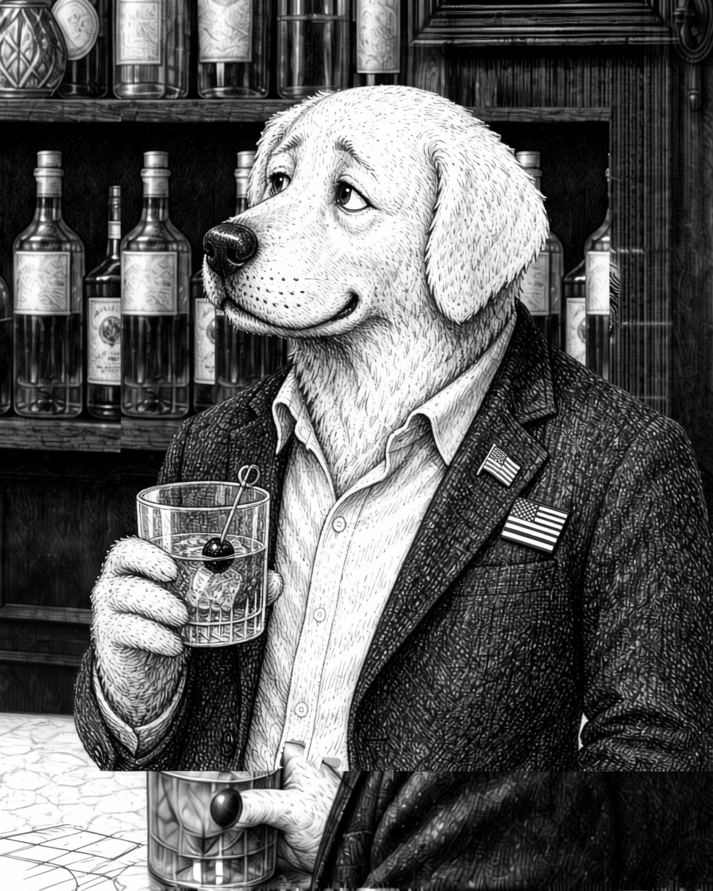

**The ask.** The founder: 'its a flamingo you did a terrible job you must perfect each character.' Round 4 for BARCLAY, against the judges' round-3 list: promote canon/vision/studies/barclay.png out of the Picture 2 slot and stop basing the render on the round-3 composite; drop the sc01 profile head; give him a real neck, a two-leaf collar with no tie of any kind, a notched lapel carrying a whole USA flag pin and a round-dialled wristwatch on the wrist; two matched eyes on one level line; a closed lip-line running the full two nose-widths to under the front corner of the near eye and hooking clearly UP so the smile reads happy; layered drop ears clear of the shoulder; three rows of four whisker pips and no ticking anywhere else; clean black pen on white paper with no grey wash; no signature and no blank paper in any corner.

**The thinking.** The reference swap the judges asked for, plus the correction three passes of this round forced. Picture 1 is the promoted drawing itself - canon/vision/studies/barclay.png, which has the head-to-shoulder proportion, the neck and ruff, the two-leaf collar and the flag pin that round 3 kept losing - but its chest-up FIGURE is matted off its studio paper and seated into the approved plate's own room crop at the plate's camera, head 29 percent of the tile height. That is not the composite the note banned: that one was a graphite HEAD mask on a duo crop, which is where the neckless jaw-on-collar join and the grey wash came from; what is pasted here brings its own neck, ruff, shoulders, collar, lapel and pin, so the geometry faults are fixed BY the paste. Picture 2 is the same drawing close up as the identity tile. The sc01 profile head is dropped as instructed. Fifteen EDIT lines carry the note's list. Where the note contradicts itself - a lip-line ending in a hook lifted clearly ABOVE the band's middle, versus one ending in a soft DOWNWARD tuck that does not hook - EDIT 3 takes the UP hook, because that is the fix the note leads with and the one that cites the founder's happier-not-sad correction; from the tuck line it keeps everything that does not conflict.

**Settings.** local/qwen-image-edit-2511 via POST 127.0.0.1:8000/api/generate, fast Lightning 8 steps, cfg 1.0, euler/simple, shift 3.0, 4:5 1344x1680, negative_refs on (LOCAL_NEGATIVE is inert at cfg 1), tag study-barclay-r4, 2 references. seed 3. P1 p1-barclay-in-room.png (studies/barclay.png cropped 0,20,1024,1120, matted, scaled to a 420 px head, seated at (101,78) in the round-3 room crop at 2x); P2 studies/barclay.png cropped 60,20,860,860. No third tile.

**Prompt.** [prompts/088-barclay-character-study-round-4-seed-3-the-promoted-drawing-seated-in-the-approved-room.prompt.txt](prompts/088-barclay-character-study-round-4-seed-3-the-promoted-drawing-seated-in-the-approved-room.prompt.txt)

**Verdict.** Reject on one fault, otherwise as strong as the winner. TWO flag pins on the lapel - a small correct one on the notch and a large one below it - against EDIT 9's 'the ONLY mark on his clothing'. The head band is good: matched eyes, up-hooked closed mouth, real neck, layered ear. Marble crazed, doubled glass, stirrer.

*Logged 12:06.*

---

## 089. Barclay character study round 4 seed 17 the promoted drawing seated in the approved room

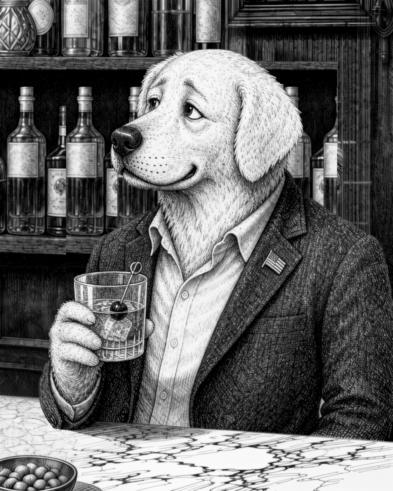

**The ask.** The founder: 'its a flamingo you did a terrible job you must perfect each character.' Round 4 for BARCLAY, against the judges' round-3 list: promote canon/vision/studies/barclay.png out of the Picture 2 slot and stop basing the render on the round-3 composite; drop the sc01 profile head; give him a real neck, a two-leaf collar with no tie of any kind, a notched lapel carrying a whole USA flag pin and a round-dialled wristwatch on the wrist; two matched eyes on one level line; a closed lip-line running the full two nose-widths to under the front corner of the near eye and hooking clearly UP so the smile reads happy; layered drop ears clear of the shoulder; three rows of four whisker pips and no ticking anywhere else; clean black pen on white paper with no grey wash; no signature and no blank paper in any corner.

**The thinking.** The reference swap the judges asked for, plus the correction three passes of this round forced. Picture 1 is the promoted drawing itself - canon/vision/studies/barclay.png, which has the head-to-shoulder proportion, the neck and ruff, the two-leaf collar and the flag pin that round 3 kept losing - but its chest-up FIGURE is matted off its studio paper and seated into the approved plate's own room crop at the plate's camera, head 29 percent of the tile height. That is not the composite the note banned: that one was a graphite HEAD mask on a duo crop, which is where the neckless jaw-on-collar join and the grey wash came from; what is pasted here brings its own neck, ruff, shoulders, collar, lapel and pin, so the geometry faults are fixed BY the paste. Picture 2 is the same drawing close up as the identity tile. The sc01 profile head is dropped as instructed. Fifteen EDIT lines carry the note's list. Where the note contradicts itself - a lip-line ending in a hook lifted clearly ABOVE the band's middle, versus one ending in a soft DOWNWARD tuck that does not hook - EDIT 3 takes the UP hook, because that is the fix the note leads with and the one that cites the founder's happier-not-sad correction; from the tuck line it keeps everything that does not conflict.

**Settings.** local/qwen-image-edit-2511 via POST 127.0.0.1:8000/api/generate, fast Lightning 8 steps, cfg 1.0, euler/simple, shift 3.0, 4:5 1344x1680, negative_refs on (LOCAL_NEGATIVE is inert at cfg 1), tag study-barclay-r4, 2 references. seed 17. P1 p1-barclay-in-room.png (studies/barclay.png cropped 0,20,1024,1120, matted, scaled to a 420 px head, seated at (101,78) in the round-3 room crop at 2x); P2 studies/barclay.png cropped 60,20,860,860. No third tile.

**Prompt.** [prompts/089-barclay-character-study-round-4-seed-17-the-promoted-drawing-seated-in-the-approved-room.prompt.txt](prompts/089-barclay-character-study-round-4-seed-17-the-promoted-drawing-seated-in-the-approved-room.prompt.txt)

**Verdict.** Good, third place. The cleanest NOSE of the six - small, modestly modelled, no glossy bar - and a well-drawn ear. Marked down for the near eye reading more lidded than its partner, a break in the lip-line where the hook starts, a lapel with no pocket or seam, and the worst marble of the round: a hard crazed crackle field across the whole counter.

*Logged 12:06.*

---

## 090. Barclay character study round 4 seed 29 the promoted drawing seated in the approved room

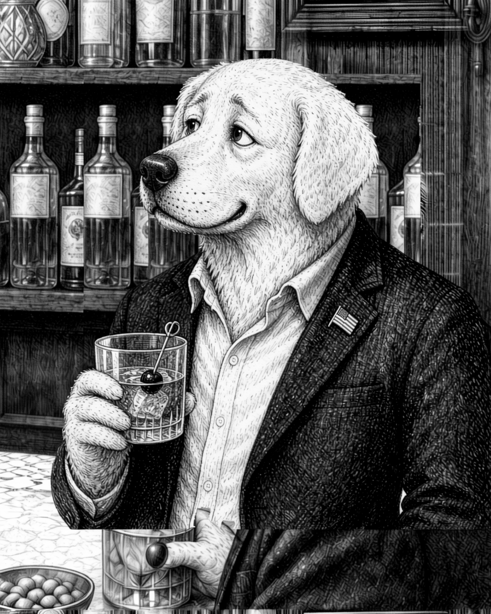

**The ask.** The founder: 'its a flamingo you did a terrible job you must perfect each character.' Round 4 for BARCLAY, against the judges' round-3 list: promote canon/vision/studies/barclay.png out of the Picture 2 slot and stop basing the render on the round-3 composite; drop the sc01 profile head; give him a real neck, a two-leaf collar with no tie of any kind, a notched lapel carrying a whole USA flag pin and a round-dialled wristwatch on the wrist; two matched eyes on one level line; a closed lip-line running the full two nose-widths to under the front corner of the near eye and hooking clearly UP so the smile reads happy; layered drop ears clear of the shoulder; three rows of four whisker pips and no ticking anywhere else; clean black pen on white paper with no grey wash; no signature and no blank paper in any corner.

**The thinking.** The reference swap the judges asked for, plus the correction three passes of this round forced. Picture 1 is the promoted drawing itself - canon/vision/studies/barclay.png, which has the head-to-shoulder proportion, the neck and ruff, the two-leaf collar and the flag pin that round 3 kept losing - but its chest-up FIGURE is matted off its studio paper and seated into the approved plate's own room crop at the plate's camera, head 29 percent of the tile height. That is not the composite the note banned: that one was a graphite HEAD mask on a duo crop, which is where the neckless jaw-on-collar join and the grey wash came from; what is pasted here brings its own neck, ruff, shoulders, collar, lapel and pin, so the geometry faults are fixed BY the paste. Picture 2 is the same drawing close up as the identity tile. The sc01 profile head is dropped as instructed. Fifteen EDIT lines carry the note's list. Where the note contradicts itself - a lip-line ending in a hook lifted clearly ABOVE the band's middle, versus one ending in a soft DOWNWARD tuck that does not hook - EDIT 3 takes the UP hook, because that is the fix the note leads with and the one that cites the founder's happier-not-sad correction; from the tuck line it keeps everything that does not conflict.

**Settings.** local/qwen-image-edit-2511 via POST 127.0.0.1:8000/api/generate, fast Lightning 8 steps, cfg 1.0, euler/simple, shift 3.0, 4:5 1344x1680, negative_refs on (LOCAL_NEGATIVE is inert at cfg 1), tag study-barclay-r4, 2 references. seed 29. P1 p1-barclay-in-room.png (studies/barclay.png cropped 0,20,1024,1120, matted, scaled to a 420 px head, seated at (101,78) in the round-3 room crop at 2x); P2 studies/barclay.png cropped 60,20,860,860. No third tile.

**Prompt.** [prompts/090-barclay-character-study-round-4-seed-29-the-promoted-drawing-seated-in-the-approved-room.prompt.txt](prompts/090-barclay-character-study-round-4-seed-29-the-promoted-drawing-seated-in-the-approved-room.prompt.txt)

**Verdict.** Reject. The jacket has gone almost solid black, so the notched lapel loses its fold and the pin's canton is coarse; the chest fur crowds the collar. The head band itself passes - matched eyes, up-hooked mouth, real neck, layered ear. Crazed marble, doubled glass, stirrer.

*Logged 12:06.*

---

## 091. Barclay character study round 4 seed 58 the promoted drawing seated in the approved room

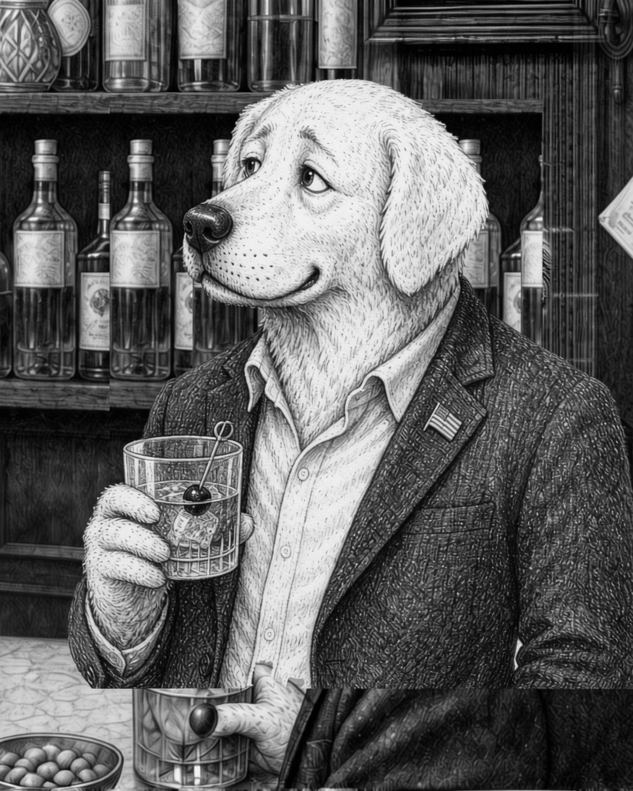

**The ask.** The founder: 'its a flamingo you did a terrible job you must perfect each character.' Round 4 for BARCLAY, against the judges' round-3 list: promote canon/vision/studies/barclay.png out of the Picture 2 slot and stop basing the render on the round-3 composite; drop the sc01 profile head; give him a real neck, a two-leaf collar with no tie of any kind, a notched lapel carrying a whole USA flag pin and a round-dialled wristwatch on the wrist; two matched eyes on one level line; a closed lip-line running the full two nose-widths to under the front corner of the near eye and hooking clearly UP so the smile reads happy; layered drop ears clear of the shoulder; three rows of four whisker pips and no ticking anywhere else; clean black pen on white paper with no grey wash; no signature and no blank paper in any corner.

**The thinking.** The reference swap the judges asked for, plus the correction three passes of this round forced. Picture 1 is the promoted drawing itself - canon/vision/studies/barclay.png, which has the head-to-shoulder proportion, the neck and ruff, the two-leaf collar and the flag pin that round 3 kept losing - but its chest-up FIGURE is matted off its studio paper and seated into the approved plate's own room crop at the plate's camera, head 29 percent of the tile height. That is not the composite the note banned: that one was a graphite HEAD mask on a duo crop, which is where the neckless jaw-on-collar join and the grey wash came from; what is pasted here brings its own neck, ruff, shoulders, collar, lapel and pin, so the geometry faults are fixed BY the paste. Picture 2 is the same drawing close up as the identity tile. The sc01 profile head is dropped as instructed. Fifteen EDIT lines carry the note's list. Where the note contradicts itself - a lip-line ending in a hook lifted clearly ABOVE the band's middle, versus one ending in a soft DOWNWARD tuck that does not hook - EDIT 3 takes the UP hook, because that is the fix the note leads with and the one that cites the founder's happier-not-sad correction; from the tuck line it keeps everything that does not conflict.

**Settings.** local/qwen-image-edit-2511 via POST 127.0.0.1:8000/api/generate, fast Lightning 8 steps, cfg 1.0, euler/simple, shift 3.0, 4:5 1344x1680, negative_refs on (LOCAL_NEGATIVE is inert at cfg 1), tag study-barclay-r4, 2 references. seed 58. P1 p1-barclay-in-room.png (studies/barclay.png cropped 0,20,1024,1120, matted, scaled to a 420 px head, seated at (101,78) in the round-3 room crop at 2x); P2 studies/barclay.png cropped 60,20,860,860. No third tile.

**Prompt.** [prompts/091-barclay-character-study-round-4-seed-58-the-promoted-drawing-seated-in-the-approved-room.prompt.txt](prompts/091-barclay-character-study-round-4-seed-58-the-promoted-drawing-seated-in-the-approved-room.prompt.txt)

**Verdict.** Reject on a stray. A pale chevron artifact sits on the right edge with a visible vertical seam beside it. The lapel is the best drawn of the six (notch, fold, pocket, shoulder seam) and the ear fringe is excellent, but the pin's canton is faint and the near eye carries a heavier lid than its partner.

*Logged 12:06.*

---

## 092. Barclay character study round 4 seed 73 the promoted drawing seated in the approved room

**The ask.** The founder: 'its a flamingo you did a terrible job you must perfect each character.' Round 4 for BARCLAY, against the judges' round-3 list: promote canon/vision/studies/barclay.png out of the Picture 2 slot and stop basing the render on the round-3 composite; drop the sc01 profile head; give him a real neck, a two-leaf collar with no tie of any kind, a notched lapel carrying a whole USA flag pin and a round-dialled wristwatch on the wrist; two matched eyes on one level line; a closed lip-line running the full two nose-widths to under the front corner of the near eye and hooking clearly UP so the smile reads happy; layered drop ears clear of the shoulder; three rows of four whisker pips and no ticking anywhere else; clean black pen on white paper with no grey wash; no signature and no blank paper in any corner.

**The thinking.** The reference swap the judges asked for, plus the correction three passes of this round forced. Picture 1 is the promoted drawing itself - canon/vision/studies/barclay.png, which has the head-to-shoulder proportion, the neck and ruff, the two-leaf collar and the flag pin that round 3 kept losing - but its chest-up FIGURE is matted off its studio paper and seated into the approved plate's own room crop at the plate's camera, head 29 percent of the tile height. That is not the composite the note banned: that one was a graphite HEAD mask on a duo crop, which is where the neckless jaw-on-collar join and the grey wash came from; what is pasted here brings its own neck, ruff, shoulders, collar, lapel and pin, so the geometry faults are fixed BY the paste. Picture 2 is the same drawing close up as the identity tile. The sc01 profile head is dropped as instructed. Fifteen EDIT lines carry the note's list. Where the note contradicts itself - a lip-line ending in a hook lifted clearly ABOVE the band's middle, versus one ending in a soft DOWNWARD tuck that does not hook - EDIT 3 takes the UP hook, because that is the fix the note leads with and the one that cites the founder's happier-not-sad correction; from the tuck line it keeps everything that does not conflict.

**Settings.** local/qwen-image-edit-2511 via POST 127.0.0.1:8000/api/generate, fast Lightning 8 steps, cfg 1.0, euler/simple, shift 3.0, 4:5 1344x1680, negative_refs on (LOCAL_NEGATIVE is inert at cfg 1), tag study-barclay-r4, 2 references. seed 73. P1 p1-barclay-in-room.png (studies/barclay.png cropped 0,20,1024,1120, matted, scaled to a 420 px head, seated at (101,78) in the round-3 room crop at 2x); P2 studies/barclay.png cropped 60,20,860,860. No third tile.

**Prompt.** [prompts/092-barclay-character-study-round-4-seed-73-the-promoted-drawing-seated-in-the-approved-room.prompt.txt](prompts/092-barclay-character-study-round-4-seed-73-the-promoted-drawing-seated-in-the-approved-room.prompt.txt)

**Verdict.** RUNNER-UP, and the best HEAD of the round: the two eyes are the most closely matched pair of the six, both wide, both level, each with its white crescent and its catchlight, and the lapel is a real notched lapel with fold, pocket and shoulder seam carrying a legible pin. Beaten by seed 41 on the room only - the bottle labels carry pseudo-marks where 41's read as blank panels, the marble is a hard crazed crackle field, and a pale slatted object intrudes at mid-left. Doubled glass and stirrer as everywhere.

*Logged 12:06.*

---

## 093. Barclay round 4 contact sheet six seeds beside the canon kit bust and head

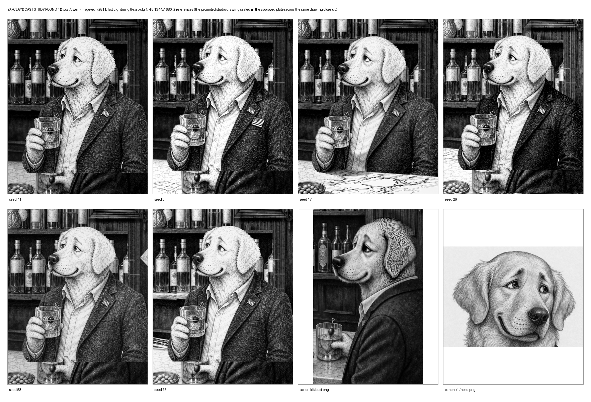

**The ask.** The founder: 'its a flamingo you did a terrible job you must perfect each character.' Round 4 for BARCLAY, against the judges' round-3 list: promote canon/vision/studies/barclay.png out of the Picture 2 slot and stop basing the render on the round-3 composite; drop the sc01 profile head; give him a real neck, a two-leaf collar with no tie of any kind, a notched lapel carrying a whole USA flag pin and a round-dialled wristwatch on the wrist; two matched eyes on one level line; a closed lip-line running the full two nose-widths to under the front corner of the near eye and hooking clearly UP so the smile reads happy; layered drop ears clear of the shoulder; three rows of four whisker pips and no ticking anywhere else; clean black pen on white paper with no grey wash; no signature and no blank paper in any corner. Build a sheet of the six renders at 420 px beside the kit's bust and head tile, labelled with seeds, and judge the crown-to-collar band at 2x before building it.

**The thinking.** Six seeds - 41 held as the pose anchor the judges asked to carry forward, plus five new ones (3, 17, 29, 58, 73) - on one reference stack. The note's PROCESS line asked for the head band to be judged magnified first, because every remaining fault lives between the crown and the collar; heads-1..3.png crop (360,150,1010,830) of each render and lapels-1..2.png crop (560,760,1344,1400) for the lapel, the pin and the wrist. The sheet is built after those, so the ranking on it is the magnified ranking.

**Settings.** local/qwen-image-edit-2511 via POST 127.0.0.1:8000/api/generate, fast Lightning 8 steps, cfg 1.0, euler/simple, shift 3.0, 4:5 1344x1680, negative_refs on (LOCAL_NEGATIVE is inert at cfg 1), tag study-barclay-r4, 2 references. Six seeds 41, 3, 17, 29, 58, 73. Sheet by scripts/build-barclay-round4-sheet.py; renders 420 px wide, kit/bust.png and kit/head.png at the same width.

**Verdict.** The round lands. All six share a real neck, a small skull on wide shoulders, two collar leaves over a buttoned placket with no tie, a notched lapel with a flag pin, layered drop ears clear of the shoulder, three rows of whisker pips on an otherwise clean coat, clean black pen with no grey wash, one character, no tail and no blank paper. BEST: SEED 41 - the anchor - on the cleanest room of the six. Runner-up seed 73 for the best-matched pair of eyes and the best lapel. Three faults are common to every seed and are the round-5 list: the held glass is doubled by a second tumbler below it, a stirrer stands in the drink, and the wrist never clears the counter so the wristwatch the note asks for is never drawn. The marble crazes on four of the six.

*Logged 12:06.*

---

## 094. Abby round 1 seed 41 the study splits her into a human bartender and a pet terrier

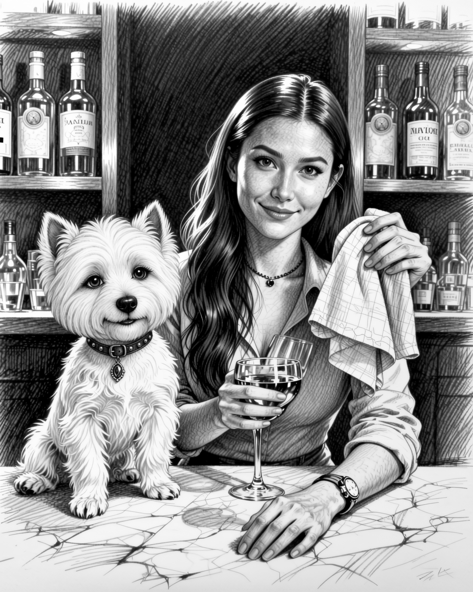

**The ask.** The founder: 'its a flamingo you did a terrible job you must perfect each character.' Round 1 for ABBY, the West Highland terrier proprietor, with no judges' list yet - so the round is drawn straight against canon/characters/abby/CHARACTER-BIBLE.md: a true fluffy westie, beautiful and in command; her eyes built from the bible's five parts (white at each side of the iris, a drawn iris with radiating lines, a smaller round pupil, exactly one catchlight, lids with lashes); her gaze inside the scene and never on the reader; a warm closed-lip smile; fur-backed hands and never paws; exactly one towel, in her hands with the shoulder bare; the studded collar with its front buckle, its single ring and ONE teardrop gem; the blouse open two buttons with the bust left trim; no tail; no lettering on her; and she is the only figure in the room.

**The thinking.** Two decisions before a pixel was drawn, both from reading the assets at full size. (1) cast-study.py's shipped Picture 1 for Abby is a HEAD - trio.png at 486,470,360,450 stops at her collar - so four of the six things the bible says can be COUNTED on a finished Abby (the towel, one hand on a working object, hands not paws, the counter crossing her at the waist) are outside the base picture, and Drew's round 1 proved this model creeps CLOSER than Picture 1. (2) The box was NOT widened: Abby is sandwiched in trio.png, Drew's bill reaching x~500 and Barclay's muzzle starting at x~780, so any 4:5 box wide enough to hold her hands drags a gentleman into the base. Instead canon/characters/abby/kit/bust.png went on as Picture 3 for DISTANCE AND STAGING ONLY - checked on a coordinate grid at full size, 308x688 and clean of both gentlemen, drawing exactly the chest-up staging wanted. The seven extra EDITs are the bible's own counts, worded as corrections because both identity tiles draw the failures: the eye (missed by the reference card at 87.6%/83.5% below luminance 60 and by all four filed panels), the gaze (on the reader in 4 of 4), the open neckline (0 of 4), the teardrop (wrong in 3 of 4), the towel (present in 1 of 4).

**Settings.** local/qwen-image-edit-2511 via POST 127.0.0.1:8000/api/generate, fast Lightning 8 steps, cfg 1.0, euler/simple, shift 3.0, 4:5 1344x1680, negative_refs on (LOCAL_NEGATIVE is inert at cfg 1), tag study-abby-r1, 3 references: P1 canon/plates/trio.png cropped 486,470,360,450 (the approved plate's Abby, head only); P2 canon/vision/studies/abby.png, the official portrait, with its shipped label replaced because that label says 'no muzzle' where the bible says 'short square muzzle'; P3 canon/characters/abby/kit/bust.png, added this round for framing. Seven extra EDITs on top of cast-study.py's own five.

**Prompt.** [prompts/094-abby-round-1-seed-41-the-study-splits-her-into-a-human-bartender-and-a-pet-terrier.prompt.txt](prompts/094-abby-round-1-seed-41-the-study-splits-her-into-a-human-bartender-and-a-pet-terrier.prompt.txt)

**Verdict.** REJECT. The round's whole fault, in its clearest form: Abby is drawn as TWO BEINGS. A human woman in a blouse stands behind the bar polishing a glass with the towel, and a real FOUR-LEGGED West Highland terrier sits on the marble beside her wearing Abby's studded collar and teardrop pendant. Nothing in the picture is the character. The bar, the bottles and the marble are handsome and the pendant is drawn correctly on the dog, which is the only thing to salvage.

*Logged 12:30.*

---

## 095. Abby round 1 seed 7 the worst of the six two human men and a four-legged terrier

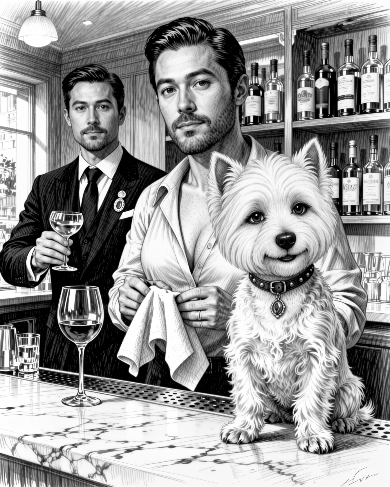

**The ask.** The founder: 'its a flamingo you did a terrible job you must perfect each character.' Round 1 for ABBY, the West Highland terrier proprietor, with no judges' list yet - so the round is drawn straight against canon/characters/abby/CHARACTER-BIBLE.md: a true fluffy westie, beautiful and in command; her eyes built from the bible's five parts (white at each side of the iris, a drawn iris with radiating lines, a smaller round pupil, exactly one catchlight, lids with lashes); her gaze inside the scene and never on the reader; a warm closed-lip smile; fur-backed hands and never paws; exactly one towel, in her hands with the shoulder bare; the studded collar with its front buckle, its single ring and ONE teardrop gem; the blouse open two buttons with the bust left trim; no tail; no lettering on her; and she is the only figure in the room.

**The thinking.** Two decisions before a pixel was drawn, both from reading the assets at full size. (1) cast-study.py's shipped Picture 1 for Abby is a HEAD - trio.png at 486,470,360,450 stops at her collar - so four of the six things the bible says can be COUNTED on a finished Abby (the towel, one hand on a working object, hands not paws, the counter crossing her at the waist) are outside the base picture, and Drew's round 1 proved this model creeps CLOSER than Picture 1. (2) The box was NOT widened: Abby is sandwiched in trio.png, Drew's bill reaching x~500 and Barclay's muzzle starting at x~780, so any 4:5 box wide enough to hold her hands drags a gentleman into the base. Instead canon/characters/abby/kit/bust.png went on as Picture 3 for DISTANCE AND STAGING ONLY - checked on a coordinate grid at full size, 308x688 and clean of both gentlemen, drawing exactly the chest-up staging wanted. The seven extra EDITs are the bible's own counts, worded as corrections because both identity tiles draw the failures: the eye (missed by the reference card at 87.6%/83.5% below luminance 60 and by all four filed panels), the gaze (on the reader in 4 of 4), the open neckline (0 of 4), the teardrop (wrong in 3 of 4), the towel (present in 1 of 4).

**Settings.** local/qwen-image-edit-2511 via POST 127.0.0.1:8000/api/generate, fast Lightning 8 steps, cfg 1.0, euler/simple, shift 3.0, 4:5 1344x1680, negative_refs on (LOCAL_NEGATIVE is inert at cfg 1), tag study-abby-r1, 3 references: P1 canon/plates/trio.png cropped 486,470,360,450 (the approved plate's Abby, head only); P2 canon/vision/studies/abby.png, the official portrait, with its shipped label replaced because that label says 'no muzzle' where the bible says 'short square muzzle'; P3 canon/characters/abby/kit/bust.png, added this round for framing. Seven extra EDITs on top of cast-study.py's own five.

**Prompt.** [prompts/095-abby-round-1-seed-7-the-worst-of-the-six-two-human-men-and-a-four-legged-terrier.prompt.txt](prompts/095-abby-round-1-seed-7-the-worst-of-the-six-two-human-men-and-a-four-legged-terrier.prompt.txt)

**Verdict.** REJECT, and the worst of the six. TWO human men in suits and shirtsleeves work the bar, one holding a wine glass and one holding the towel, with the four-legged terrier sitting on the counter between them wearing the collar and pendant. Three figures, none of them Abby, in a room that is not the Swinging Door - a window, a pendant lamp and a bar rail that belong to some other pub.

*Logged 12:30.*

---

## 096. Abby round 1 seed 21 one human bartender with the terrier as his pet on the counter

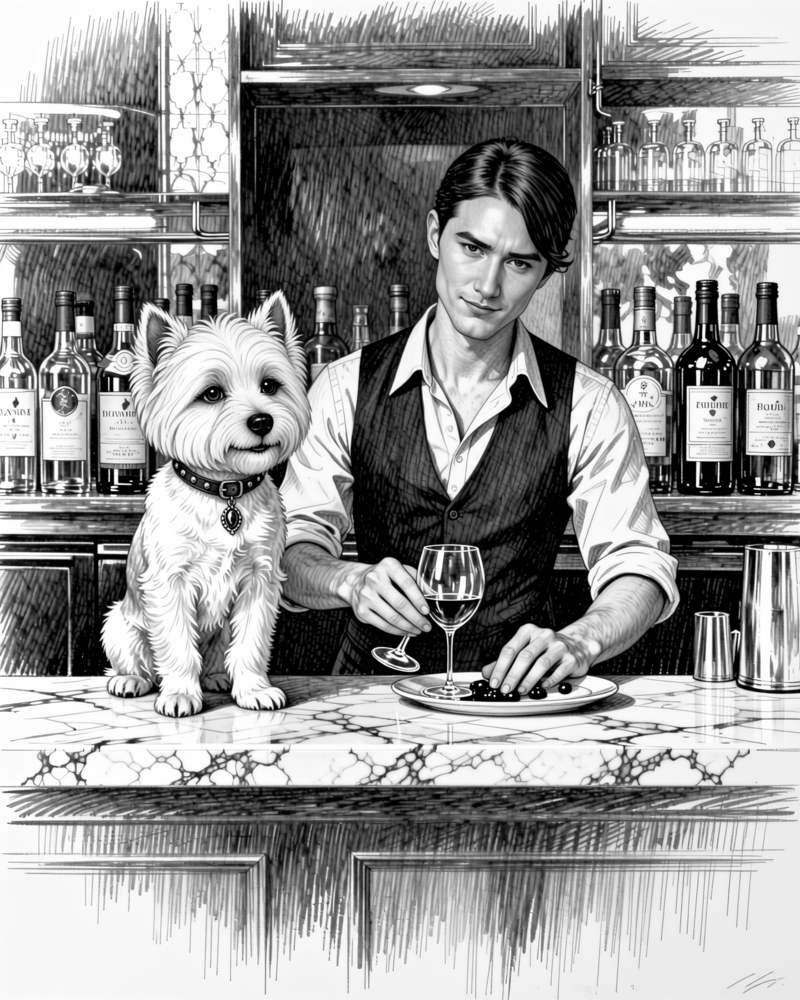

**The ask.** The founder: 'its a flamingo you did a terrible job you must perfect each character.' Round 1 for ABBY, the West Highland terrier proprietor, with no judges' list yet - so the round is drawn straight against canon/characters/abby/CHARACTER-BIBLE.md: a true fluffy westie, beautiful and in command; her eyes built from the bible's five parts (white at each side of the iris, a drawn iris with radiating lines, a smaller round pupil, exactly one catchlight, lids with lashes); her gaze inside the scene and never on the reader; a warm closed-lip smile; fur-backed hands and never paws; exactly one towel, in her hands with the shoulder bare; the studded collar with its front buckle, its single ring and ONE teardrop gem; the blouse open two buttons with the bust left trim; no tail; no lettering on her; and she is the only figure in the room.

**The thinking.** Two decisions before a pixel was drawn, both from reading the assets at full size. (1) cast-study.py's shipped Picture 1 for Abby is a HEAD - trio.png at 486,470,360,450 stops at her collar - so four of the six things the bible says can be COUNTED on a finished Abby (the towel, one hand on a working object, hands not paws, the counter crossing her at the waist) are outside the base picture, and Drew's round 1 proved this model creeps CLOSER than Picture 1. (2) The box was NOT widened: Abby is sandwiched in trio.png, Drew's bill reaching x~500 and Barclay's muzzle starting at x~780, so any 4:5 box wide enough to hold her hands drags a gentleman into the base. Instead canon/characters/abby/kit/bust.png went on as Picture 3 for DISTANCE AND STAGING ONLY - checked on a coordinate grid at full size, 308x688 and clean of both gentlemen, drawing exactly the chest-up staging wanted. The seven extra EDITs are the bible's own counts, worded as corrections because both identity tiles draw the failures: the eye (missed by the reference card at 87.6%/83.5% below luminance 60 and by all four filed panels), the gaze (on the reader in 4 of 4), the open neckline (0 of 4), the teardrop (wrong in 3 of 4), the towel (present in 1 of 4).

**Settings.** local/qwen-image-edit-2511 via POST 127.0.0.1:8000/api/generate, fast Lightning 8 steps, cfg 1.0, euler/simple, shift 3.0, 4:5 1344x1680, negative_refs on (LOCAL_NEGATIVE is inert at cfg 1), tag study-abby-r1, 3 references: P1 canon/plates/trio.png cropped 486,470,360,450 (the approved plate's Abby, head only); P2 canon/vision/studies/abby.png, the official portrait, with its shipped label replaced because that label says 'no muzzle' where the bible says 'short square muzzle'; P3 canon/characters/abby/kit/bust.png, added this round for framing. Seven extra EDITs on top of cast-study.py's own five.

**Prompt.** [prompts/096-abby-round-1-seed-21-one-human-bartender-with-the-terrier-as-his-pet-on-the-counter.prompt.txt](prompts/096-abby-round-1-seed-21-one-human-bartender-with-the-terrier-as-his-pet-on-the-counter.prompt.txt)

**Verdict.** REJECT. A single human man in a waistcoat garnishes a plate at the marble; the terrier sits on the counter at frame-left wearing the collar and pendant, plainly his pet. The engraving is competent and the back bar is well built, but the character is absent and the counter is being sat on, which the bible forbids outright.

*Logged 12:30.*

---

## 097. Abby round 1 seed 33 two stacked terriers and a human man three figures none of them abby

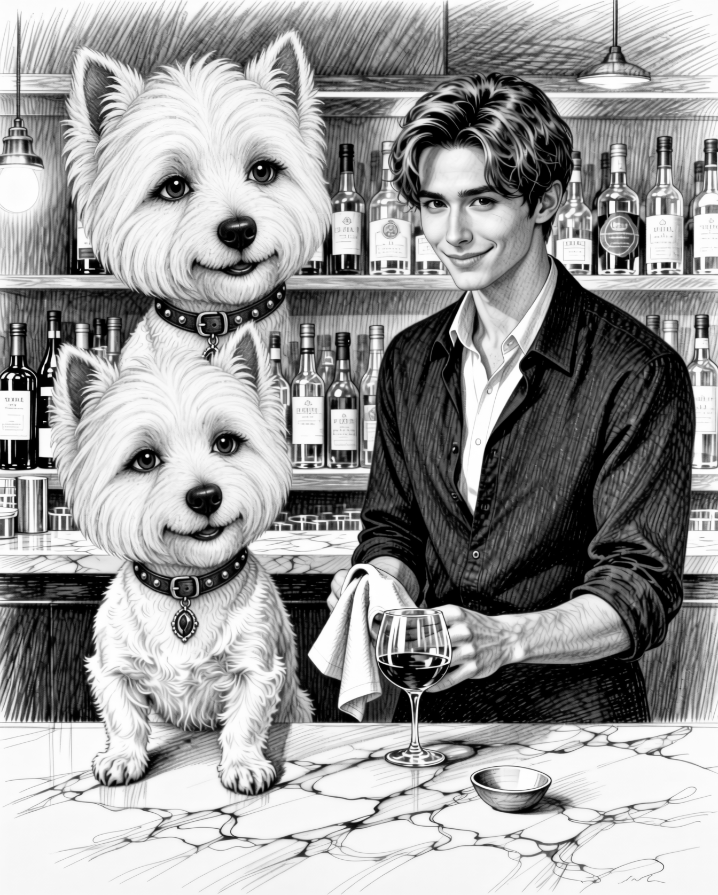

**The ask.** The founder: 'its a flamingo you did a terrible job you must perfect each character.' Round 1 for ABBY, the West Highland terrier proprietor, with no judges' list yet - so the round is drawn straight against canon/characters/abby/CHARACTER-BIBLE.md: a true fluffy westie, beautiful and in command; her eyes built from the bible's five parts (white at each side of the iris, a drawn iris with radiating lines, a smaller round pupil, exactly one catchlight, lids with lashes); her gaze inside the scene and never on the reader; a warm closed-lip smile; fur-backed hands and never paws; exactly one towel, in her hands with the shoulder bare; the studded collar with its front buckle, its single ring and ONE teardrop gem; the blouse open two buttons with the bust left trim; no tail; no lettering on her; and she is the only figure in the room.

**The thinking.** Two decisions before a pixel was drawn, both from reading the assets at full size. (1) cast-study.py's shipped Picture 1 for Abby is a HEAD - trio.png at 486,470,360,450 stops at her collar - so four of the six things the bible says can be COUNTED on a finished Abby (the towel, one hand on a working object, hands not paws, the counter crossing her at the waist) are outside the base picture, and Drew's round 1 proved this model creeps CLOSER than Picture 1. (2) The box was NOT widened: Abby is sandwiched in trio.png, Drew's bill reaching x~500 and Barclay's muzzle starting at x~780, so any 4:5 box wide enough to hold her hands drags a gentleman into the base. Instead canon/characters/abby/kit/bust.png went on as Picture 3 for DISTANCE AND STAGING ONLY - checked on a coordinate grid at full size, 308x688 and clean of both gentlemen, drawing exactly the chest-up staging wanted. The seven extra EDITs are the bible's own counts, worded as corrections because both identity tiles draw the failures: the eye (missed by the reference card at 87.6%/83.5% below luminance 60 and by all four filed panels), the gaze (on the reader in 4 of 4), the open neckline (0 of 4), the teardrop (wrong in 3 of 4), the towel (present in 1 of 4).

**Settings.** local/qwen-image-edit-2511 via POST 127.0.0.1:8000/api/generate, fast Lightning 8 steps, cfg 1.0, euler/simple, shift 3.0, 4:5 1344x1680, negative_refs on (LOCAL_NEGATIVE is inert at cfg 1), tag study-abby-r1, 3 references: P1 canon/plates/trio.png cropped 486,470,360,450 (the approved plate's Abby, head only); P2 canon/vision/studies/abby.png, the official portrait, with its shipped label replaced because that label says 'no muzzle' where the bible says 'short square muzzle'; P3 canon/characters/abby/kit/bust.png, added this round for framing. Seven extra EDITs on top of cast-study.py's own five.

**Prompt.** [prompts/097-abby-round-1-seed-33-two-stacked-terriers-and-a-human-man-three-figures-none-of-them-abby.prompt.txt](prompts/097-abby-round-1-seed-33-two-stacked-terriers-and-a-human-man-three-figures-none-of-them-abby.prompt.txt)

**Verdict.** REJECT, and the most revealing of the six. TWO terriers are stacked one above the other, both in the studded collar with the teardrop, and a human man in a dark shirt holds the towel and the glass beside them. Two Abby tiles cut at two distances went on the wire this round (Picture 1 the head crop, Picture 3 the kit bust) and this seed drew both of them.

*Logged 12:30.*

---

## 098. Abby round 1 seed 44 human man and pet terrier with the room dissolving into hatching

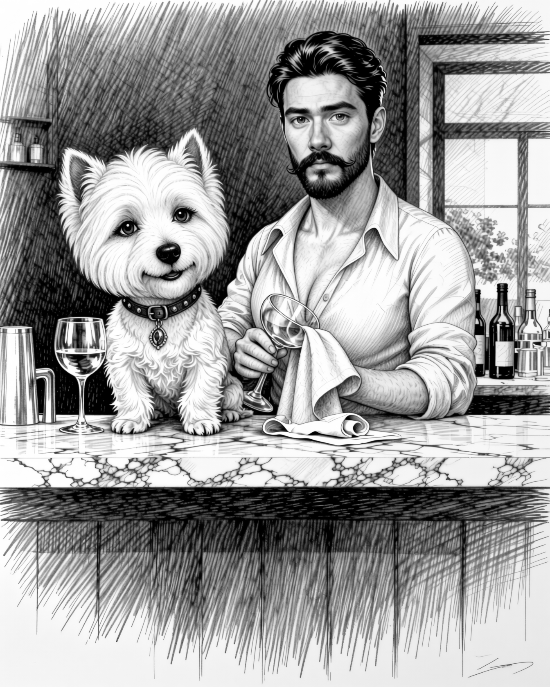

**The ask.** The founder: 'its a flamingo you did a terrible job you must perfect each character.' Round 1 for ABBY, the West Highland terrier proprietor, with no judges' list yet - so the round is drawn straight against canon/characters/abby/CHARACTER-BIBLE.md: a true fluffy westie, beautiful and in command; her eyes built from the bible's five parts (white at each side of the iris, a drawn iris with radiating lines, a smaller round pupil, exactly one catchlight, lids with lashes); her gaze inside the scene and never on the reader; a warm closed-lip smile; fur-backed hands and never paws; exactly one towel, in her hands with the shoulder bare; the studded collar with its front buckle, its single ring and ONE teardrop gem; the blouse open two buttons with the bust left trim; no tail; no lettering on her; and she is the only figure in the room.

**The thinking.** Two decisions before a pixel was drawn, both from reading the assets at full size. (1) cast-study.py's shipped Picture 1 for Abby is a HEAD - trio.png at 486,470,360,450 stops at her collar - so four of the six things the bible says can be COUNTED on a finished Abby (the towel, one hand on a working object, hands not paws, the counter crossing her at the waist) are outside the base picture, and Drew's round 1 proved this model creeps CLOSER than Picture 1. (2) The box was NOT widened: Abby is sandwiched in trio.png, Drew's bill reaching x~500 and Barclay's muzzle starting at x~780, so any 4:5 box wide enough to hold her hands drags a gentleman into the base. Instead canon/characters/abby/kit/bust.png went on as Picture 3 for DISTANCE AND STAGING ONLY - checked on a coordinate grid at full size, 308x688 and clean of both gentlemen, drawing exactly the chest-up staging wanted. The seven extra EDITs are the bible's own counts, worded as corrections because both identity tiles draw the failures: the eye (missed by the reference card at 87.6%/83.5% below luminance 60 and by all four filed panels), the gaze (on the reader in 4 of 4), the open neckline (0 of 4), the teardrop (wrong in 3 of 4), the towel (present in 1 of 4).

**Settings.** local/qwen-image-edit-2511 via POST 127.0.0.1:8000/api/generate, fast Lightning 8 steps, cfg 1.0, euler/simple, shift 3.0, 4:5 1344x1680, negative_refs on (LOCAL_NEGATIVE is inert at cfg 1), tag study-abby-r1, 3 references: P1 canon/plates/trio.png cropped 486,470,360,450 (the approved plate's Abby, head only); P2 canon/vision/studies/abby.png, the official portrait, with its shipped label replaced because that label says 'no muzzle' where the bible says 'short square muzzle'; P3 canon/characters/abby/kit/bust.png, added this round for framing. Seven extra EDITs on top of cast-study.py's own five.

**Prompt.** [prompts/098-abby-round-1-seed-44-human-man-and-pet-terrier-with-the-room-dissolving-into-hatching.prompt.txt](prompts/098-abby-round-1-seed-44-human-man-and-pet-terrier-with-the-room-dissolving-into-hatching.prompt.txt)

**Verdict.** REJECT. A bearded human man in an open shirt polishes the glass with the towel; the four-legged terrier sits on the marble in the collar. Below the counter the room stops being a room and becomes a field of vertical hatching, and the back bar has been replaced by a window onto a garden. Not the Swinging Door and not the cast.

*Logged 12:30.*

---

## 099. Abby round 1 seed 55 best of the six the only anthropomorphic abby but a human still tends the bar

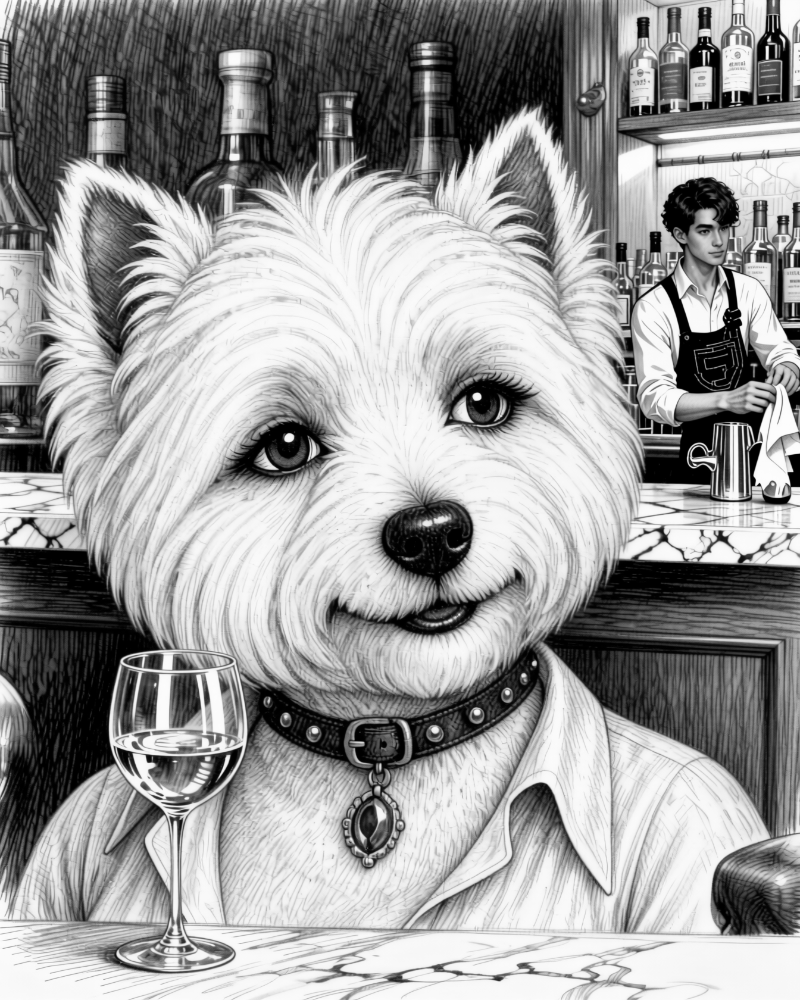

**The ask.** The founder: 'its a flamingo you did a terrible job you must perfect each character.' Round 1 for ABBY, the West Highland terrier proprietor, with no judges' list yet - so the round is drawn straight against canon/characters/abby/CHARACTER-BIBLE.md: a true fluffy westie, beautiful and in command; her eyes built from the bible's five parts (white at each side of the iris, a drawn iris with radiating lines, a smaller round pupil, exactly one catchlight, lids with lashes); her gaze inside the scene and never on the reader; a warm closed-lip smile; fur-backed hands and never paws; exactly one towel, in her hands with the shoulder bare; the studded collar with its front buckle, its single ring and ONE teardrop gem; the blouse open two buttons with the bust left trim; no tail; no lettering on her; and she is the only figure in the room.

**The thinking.** Two decisions before a pixel was drawn, both from reading the assets at full size. (1) cast-study.py's shipped Picture 1 for Abby is a HEAD - trio.png at 486,470,360,450 stops at her collar - so four of the six things the bible says can be COUNTED on a finished Abby (the towel, one hand on a working object, hands not paws, the counter crossing her at the waist) are outside the base picture, and Drew's round 1 proved this model creeps CLOSER than Picture 1. (2) The box was NOT widened: Abby is sandwiched in trio.png, Drew's bill reaching x~500 and Barclay's muzzle starting at x~780, so any 4:5 box wide enough to hold her hands drags a gentleman into the base. Instead canon/characters/abby/kit/bust.png went on as Picture 3 for DISTANCE AND STAGING ONLY - checked on a coordinate grid at full size, 308x688 and clean of both gentlemen, drawing exactly the chest-up staging wanted. The seven extra EDITs are the bible's own counts, worded as corrections because both identity tiles draw the failures: the eye (missed by the reference card at 87.6%/83.5% below luminance 60 and by all four filed panels), the gaze (on the reader in 4 of 4), the open neckline (0 of 4), the teardrop (wrong in 3 of 4), the towel (present in 1 of 4).

**Settings.** local/qwen-image-edit-2511 via POST 127.0.0.1:8000/api/generate, fast Lightning 8 steps, cfg 1.0, euler/simple, shift 3.0, 4:5 1344x1680, negative_refs on (LOCAL_NEGATIVE is inert at cfg 1), tag study-abby-r1, 3 references: P1 canon/plates/trio.png cropped 486,470,360,450 (the approved plate's Abby, head only); P2 canon/vision/studies/abby.png, the official portrait, with its shipped label replaced because that label says 'no muzzle' where the bible says 'short square muzzle'; P3 canon/characters/abby/kit/bust.png, added this round for framing. Seven extra EDITs on top of cast-study.py's own five.

**Prompt.** [prompts/099-abby-round-1-seed-55-best-of-the-six-the-only-anthropomorphic-abby-but-a-human-still-tends-the-bar.prompt.txt](prompts/099-abby-round-1-seed-55-best-of-the-six-the-only-anthropomorphic-abby-but-a-human-still-tends-the-bar.prompt.txt)

**Verdict.** BEST OF THE SIX, and still a reject. This is the only seed that drew ABBY HERSELF: an upright terrier in the pale open blouse, filling the foreground. What lands - the collar is a black leather band with ONE row of round domed studs all the same size, a buckle at the FRONT and a single ring below it, and from that ring hangs ONE teardrop gem in a beaded silver bezel closing to a point, which is the bible's shape drawn right for the first time this round; both ears pricked; a closed warm lip-line; the blouse open at the throat; and the best EYES in the repository so far - a drawn iris ring with radiating lines, a distinct round pupil clearly smaller than the iris, exactly one catchlight, an upper lid with lashes and a soft lower lid, four of the bible's five parts. What fails - (1) a HUMAN bartender in a waistcoat and tie stands at the back bar behind her, which alone is a redraw; (2) the fifth part of the eye is still missing, the iris filling the opening with no white showing at either side; (3) she stares straight out at the reader, the founder's named complaint; (4) the camera is far closer than Picture 1, her head filling two thirds of the frame, so there are no hands, no towel, no arms and no counter to judge; (5) the glass stands on the marble untouched instead of in her hand.

*Logged 12:30.*

---

## 100. Abby round 1 diagnostic seed 7 removing the human nouns and the third tile leaves one terrier and no human

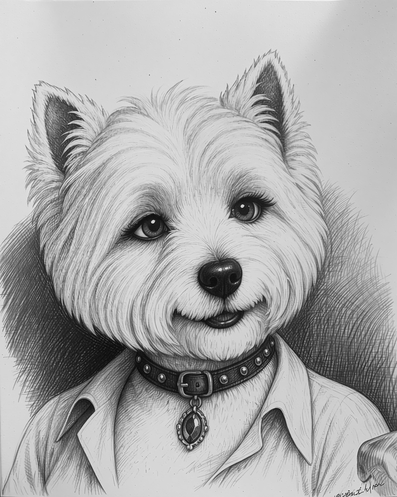

**The ask.** The founder: 'its a flamingo you did a terrible job you must perfect each character.' Round 1 for ABBY, the West Highland terrier proprietor, with no judges' list yet - so the round is drawn straight against canon/characters/abby/CHARACTER-BIBLE.md: a true fluffy westie, beautiful and in command; her eyes built from the bible's five parts (white at each side of the iris, a drawn iris with radiating lines, a smaller round pupil, exactly one catchlight, lids with lashes); her gaze inside the scene and never on the reader; a warm closed-lip smile; fur-backed hands and never paws; exactly one towel, in her hands with the shoulder bare; the studded collar with its front buckle, its single ring and ONE teardrop gem; the blouse open two buttons with the bust left trim; no tail; no lettering on her; and she is the only figure in the room.

**The thinking.** All six seeds failed the same way - Abby split into a four-legged pet terrier plus a separate human doing her job - so the round was diagnosed rather than repeated. Three suspects, removed together: (1) THE WORDS. My eye EDIT opened 'HER EYES ARE HUMAN EYES' and closed 'she is a glamorous, self-assured woman of forty-five', both quoted from CHARACTER-BIBLE.md section 2 where they are addressed to a human reader who already knows Abby is a dog; handed to an edit model at cfg 1 they are nouns, and the model drew the nouns. Every human noun was rewritten out while every structural instruction was kept. (2) PICTURE 3. Three tiles of Abby cut at different distances is three instances of her on the wire, and seed 33 drew two of them stacked; the kit bust was dropped and the framing put into words. (3) THE NEGATIONS. 'no second bartender, no customer ... no signature' - a negation is as inert as LOCAL_NEGATIVE on the cfg-1 Lightning path, and five of six renders carry a pencil signature anyway; replaced with a positive count, ONE living figure and she is a dog, plus a new leading EDIT saying in as many words that Abby is a terrier who stands on two legs, exactly as this strip's flamingo and retriever are drawn.

**Settings.** local/qwen-image-edit-2511 via POST 127.0.0.1:8000/api/generate, fast Lightning 8 steps, cfg 1.0, euler/simple, shift 3.0, 4:5 1344x1680, negative_refs on (LOCAL_NEGATIVE is inert at cfg 1), tag study-abby-r1, 3 references: P1 canon/plates/trio.png cropped 486,470,360,450 (the approved plate's Abby, head only); P2 canon/vision/studies/abby.png, the official portrait, with its shipped label replaced because that label says 'no muzzle' where the bible says 'short square muzzle'; P3 canon/characters/abby/kit/bust.png, added this round for framing. Seven extra EDITs on top of cast-study.py's own five.  DIAGNOSTIC VARIANT: 2 references (P3 dropped), every human noun removed from the edits, the negation list replaced by a positive one-figure count, and a new leading EDIT establishing the upright terrier. tag study-abby-r1-diag.

**Prompt.** [prompts/100-abby-round-1-diagnostic-seed-7-removing-the-human-nouns-and-the-third-tile-leaves-one-terrier-and-no-human.prompt.txt](prompts/100-abby-round-1-diagnostic-seed-7-removing-the-human-nouns-and-the-third-tile-leaves-one-terrier-and-no-human.prompt.txt)

**Verdict.** THE DIAGNOSIS HOLDS. On the seed that drew two men and a pet terrier, the same seed now draws ONE upright terrier in the blouse and collar and no human anywhere. The four-legged pet is gone, the second and third figures are gone, the eyes carry four of the bible's five parts, and the collar, buckle, ring and teardrop are all correct. Still a reject as a picture: the ROOM has gone with them - blank studio paper, a vignette of hatching, a pencil signature at the bottom right - and it is a head-and-collar portrait, no arms, no hands, no towel, no counter, with the gaze still on the reader. Round 2's job is to put the room and the distance back without letting the humans back in.

*Logged 12:30.*

---

## 101. Abby round 1 diagnostic seed 55 the pet terrier is killed but one human bartender survives in the background

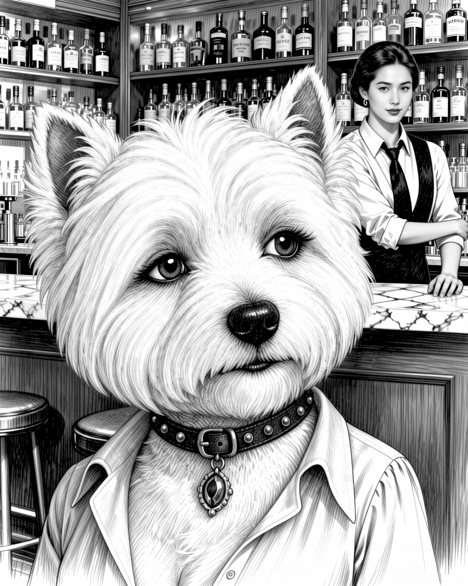

**The ask.** The founder: 'its a flamingo you did a terrible job you must perfect each character.' Round 1 for ABBY, the West Highland terrier proprietor, with no judges' list yet - so the round is drawn straight against canon/characters/abby/CHARACTER-BIBLE.md: a true fluffy westie, beautiful and in command; her eyes built from the bible's five parts (white at each side of the iris, a drawn iris with radiating lines, a smaller round pupil, exactly one catchlight, lids with lashes); her gaze inside the scene and never on the reader; a warm closed-lip smile; fur-backed hands and never paws; exactly one towel, in her hands with the shoulder bare; the studded collar with its front buckle, its single ring and ONE teardrop gem; the blouse open two buttons with the bust left trim; no tail; no lettering on her; and she is the only figure in the room.

**The thinking.** All six seeds failed the same way - Abby split into a four-legged pet terrier plus a separate human doing her job - so the round was diagnosed rather than repeated. Three suspects, removed together: (1) THE WORDS. My eye EDIT opened 'HER EYES ARE HUMAN EYES' and closed 'she is a glamorous, self-assured woman of forty-five', both quoted from CHARACTER-BIBLE.md section 2 where they are addressed to a human reader who already knows Abby is a dog; handed to an edit model at cfg 1 they are nouns, and the model drew the nouns. Every human noun was rewritten out while every structural instruction was kept. (2) PICTURE 3. Three tiles of Abby cut at different distances is three instances of her on the wire, and seed 33 drew two of them stacked; the kit bust was dropped and the framing put into words. (3) THE NEGATIONS. 'no second bartender, no customer ... no signature' - a negation is as inert as LOCAL_NEGATIVE on the cfg-1 Lightning path, and five of six renders carry a pencil signature anyway; replaced with a positive count, ONE living figure and she is a dog, plus a new leading EDIT saying in as many words that Abby is a terrier who stands on two legs, exactly as this strip's flamingo and retriever are drawn.

**Settings.** local/qwen-image-edit-2511 via POST 127.0.0.1:8000/api/generate, fast Lightning 8 steps, cfg 1.0, euler/simple, shift 3.0, 4:5 1344x1680, negative_refs on (LOCAL_NEGATIVE is inert at cfg 1), tag study-abby-r1, 3 references: P1 canon/plates/trio.png cropped 486,470,360,450 (the approved plate's Abby, head only); P2 canon/vision/studies/abby.png, the official portrait, with its shipped label replaced because that label says 'no muzzle' where the bible says 'short square muzzle'; P3 canon/characters/abby/kit/bust.png, added this round for framing. Seven extra EDITs on top of cast-study.py's own five.  DIAGNOSTIC VARIANT: 2 references (P3 dropped), every human noun removed from the edits, the negation list replaced by a positive one-figure count, and a new leading EDIT establishing the upright terrier. tag study-abby-r1-diag.

**Prompt.** [prompts/101-abby-round-1-diagnostic-seed-55-the-pet-terrier-is-killed-but-one-human-bartender-survives-in-the-background.prompt.txt](prompts/101-abby-round-1-diagnostic-seed-55-the-pet-terrier-is-killed-but-one-human-bartender-survives-in-the-background.prompt.txt)

**Verdict.** HALF THE FIX. The four-legged pet terrier is gone and Abby is one upright terrier in the foreground with the collar, the buckle, the single ring, the teardrop in its beaded bezel and the open blouse - but a HUMAN bartender in a waistcoat and tie still stands at the back bar behind her, so the human noun was not the only route in; the base picture's own bar keeps offering a slot for someone to fill. The camera is still far closer than asked, her head filling the frame, so there are still no hands, no towel and no counter. Two of two diagnostic seeds kill the pet terrier; one of two kills the human.

*Logged 12:30.*

---

## 102. Abby round 1 contact sheet six seeds beside the kit bust and head tiles

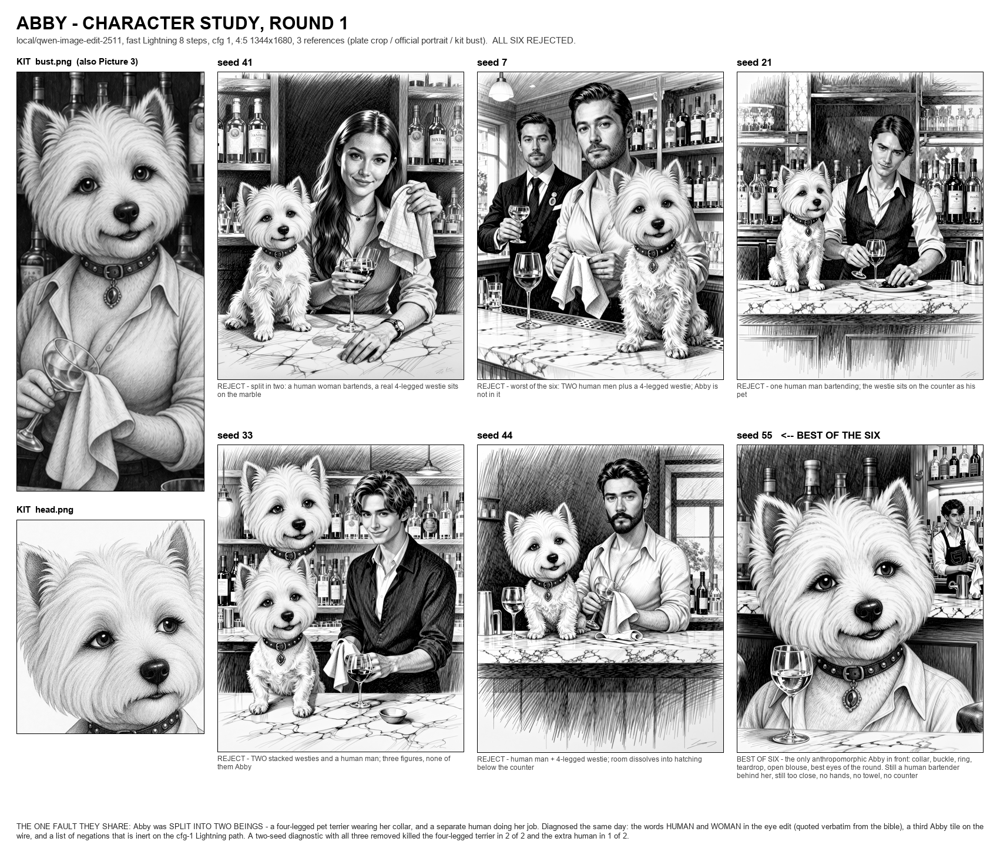

**The ask.** The founder: 'its a flamingo you did a terrible job you must perfect each character.' Round 1 for ABBY, the West Highland terrier proprietor, with no judges' list yet - so the round is drawn straight against canon/characters/abby/CHARACTER-BIBLE.md: a true fluffy westie, beautiful and in command; her eyes built from the bible's five parts (white at each side of the iris, a drawn iris with radiating lines, a smaller round pupil, exactly one catchlight, lids with lashes); her gaze inside the scene and never on the reader; a warm closed-lip smile; fur-backed hands and never paws; exactly one towel, in her hands with the shoulder bare; the studded collar with its front buckle, its single ring and ONE teardrop gem; the blouse open two buttons with the bust left trim; no tail; no lettering on her; and she is the only figure in the room.

**The thinking.** The six renders at 420 px in seed order, beside the two kit tiles the round was judged against - canon/characters/abby/kit/bust.png, which was also Picture 3 on the wire, and canon/characters/abby/kit/head.png - each panel carrying its seed and its verdict so the sheet reads on its own.

**Settings.** Built by scripts/build-abby-round1-sheet.py. Sources: the six PNGs in the round-1 directory and the two kit tiles. 1702x1456.

**Verdict.** ALL SIX REJECTED, and they fail identically: Abby is split into a four-legged pet terrier wearing her collar and a separate human doing her job. Seed 55 is the best of the six - the only one with an anthropomorphic Abby in front, and the first correct teardrop pendant and the best eyes the repository has produced. The same-day diagnostic names the cause and half-fixes it; round 2 runs on those edits with the room put back.

*Logged 12:30.*

---

## 103. Abby character study round 2 pass 1 seed 55 the sc04 tile and the judges wording

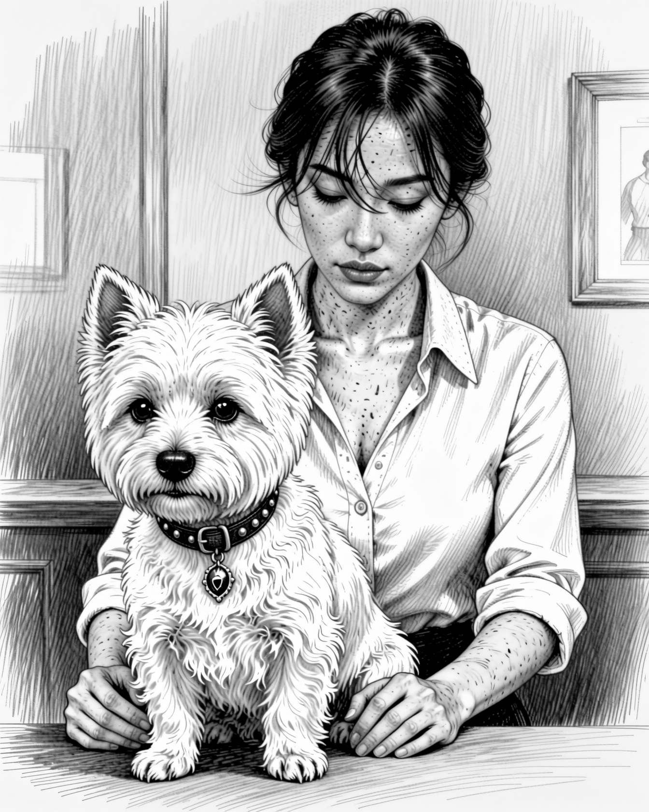

**The ask.** ABBY ROUND 2. The judges' fix list from round 1, applied as EDIT lines: one figure only, gaze off the lens with the far eye at least half the near one, both hands visible with four fingers and a thumb, exactly one towel, the full anchor composition, a closed mouth, the two-length fur rule, the blouse open two buttons, delicate face shading. Plus the lead's root-cause call: REPLACE PICTURE 1 with a crop of the approved plate sc04-fourteen-dollars-of-roof.png at box 470,345,345,680, drop kit/bust.png as Picture 3, re-word Picture 1's label so it names no fault, replace EDIT 6 with a measured frame and EDIT 12 with a positive statement of what fills the room.

**The thinking.** I cut the lead's sc04 box and put it on a coordinate grid before sending it. It is not quite one figure: BARCLAY'S muzzle and black nose sit in the bottom-right corner (crop x 255-345, y 596-680) and the RENEWAL NOTICE envelope in the bottom-left carries lettering the study's rules forbid on the marble. Both were cloned over with marble from the same plate by scripts/make-abby-picture1-round2.py; the rocks glass's rim ends at x~265 so the fill starts at 262 and the glass survives whole. I also re-pointed EDIT 4 off its shipped wording - it describes 'the round soft head' and a shoulder towel, four items before the edits that have to undo both - by adding a --character-edit flag to cast-study.py. The judges' phrasings went onto the wire as written.

**Settings.** local/qwen-image-edit-2511 via POST /api/generate, 4:5 1344x1680, fast Lightning 8 steps, cfg 1.0, euler/simple, shift 3.0, output png, tag study-abby-r2. Built by scripts/cast-study.py.

**Prompt.** [prompts/103-abby-character-study-round-2-pass-1-seed-55-the-sc04-tile-and-the-judges-wording.prompt.txt](prompts/103-abby-character-study-round-2-pass-1-seed-55-the-sc04-tile-and-the-judges-wording.prompt.txt)

**Verdict.** REJECT. A human woman in a blouse with a real four-legged westie held against her chest. The bar is gone: blank sketchbook paper behind them.

*Logged 13:08.*

---

## 104. Abby character study round 2 pass 1 seed 7 the sc04 tile and the judges wording

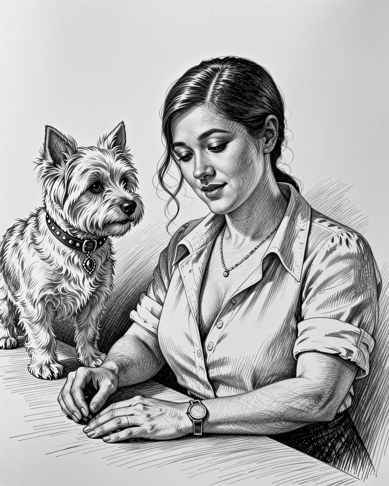

**The ask.** ABBY ROUND 2. The judges' fix list from round 1, applied as EDIT lines: one figure only, gaze off the lens with the far eye at least half the near one, both hands visible with four fingers and a thumb, exactly one towel, the full anchor composition, a closed mouth, the two-length fur rule, the blouse open two buttons, delicate face shading. Plus the lead's root-cause call: REPLACE PICTURE 1 with a crop of the approved plate sc04-fourteen-dollars-of-roof.png at box 470,345,345,680, drop kit/bust.png as Picture 3, re-word Picture 1's label so it names no fault, replace EDIT 6 with a measured frame and EDIT 12 with a positive statement of what fills the room.

**The thinking.** I cut the lead's sc04 box and put it on a coordinate grid before sending it. It is not quite one figure: BARCLAY'S muzzle and black nose sit in the bottom-right corner (crop x 255-345, y 596-680) and the RENEWAL NOTICE envelope in the bottom-left carries lettering the study's rules forbid on the marble. Both were cloned over with marble from the same plate by scripts/make-abby-picture1-round2.py; the rocks glass's rim ends at x~265 so the fill starts at 262 and the glass survives whole. I also re-pointed EDIT 4 off its shipped wording - it describes 'the round soft head' and a shoulder towel, four items before the edits that have to undo both - by adding a --character-edit flag to cast-study.py. The judges' phrasings went onto the wire as written.

**Settings.** local/qwen-image-edit-2511 via POST /api/generate, 4:5 1344x1680, fast Lightning 8 steps, cfg 1.0, euler/simple, shift 3.0, output png, tag study-abby-r2. Built by scripts/cast-study.py.

**Prompt.** [prompts/104-abby-character-study-round-2-pass-1-seed-7-the-sc04-tile-and-the-judges-wording.prompt.txt](prompts/104-abby-character-study-round-2-pass-1-seed-7-the-sc04-tile-and-the-judges-wording.prompt.txt)

**Verdict.** REJECT. A human woman at a table with a four-legged terrier sitting beside her; a wristwatch on her arm. No bar, no counter, no back bar.

*Logged 13:08.*

---

## 105. Abby character study round 2 pass 1 seed 41 the sc04 tile and the judges wording

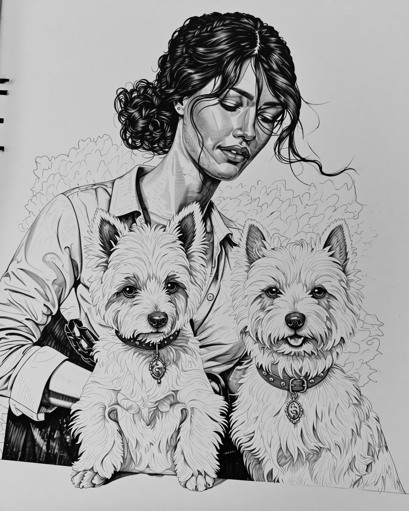

**The ask.** ABBY ROUND 2. The judges' fix list from round 1, applied as EDIT lines: one figure only, gaze off the lens with the far eye at least half the near one, both hands visible with four fingers and a thumb, exactly one towel, the full anchor composition, a closed mouth, the two-length fur rule, the blouse open two buttons, delicate face shading. Plus the lead's root-cause call: REPLACE PICTURE 1 with a crop of the approved plate sc04-fourteen-dollars-of-roof.png at box 470,345,345,680, drop kit/bust.png as Picture 3, re-word Picture 1's label so it names no fault, replace EDIT 6 with a measured frame and EDIT 12 with a positive statement of what fills the room.

**The thinking.** I cut the lead's sc04 box and put it on a coordinate grid before sending it. It is not quite one figure: BARCLAY'S muzzle and black nose sit in the bottom-right corner (crop x 255-345, y 596-680) and the RENEWAL NOTICE envelope in the bottom-left carries lettering the study's rules forbid on the marble. Both were cloned over with marble from the same plate by scripts/make-abby-picture1-round2.py; the rocks glass's rim ends at x~265 so the fill starts at 262 and the glass survives whole. I also re-pointed EDIT 4 off its shipped wording - it describes 'the round soft head' and a shoulder towel, four items before the edits that have to undo both - by adding a --character-edit flag to cast-study.py. The judges' phrasings went onto the wire as written.

**Settings.** local/qwen-image-edit-2511 via POST /api/generate, 4:5 1344x1680, fast Lightning 8 steps, cfg 1.0, euler/simple, shift 3.0, output png, tag study-abby-r2. Built by scripts/cast-study.py.

**Prompt.** [prompts/105-abby-character-study-round-2-pass-1-seed-41-the-sc04-tile-and-the-judges-wording.prompt.txt](prompts/105-abby-character-study-round-2-pass-1-seed-41-the-sc04-tile-and-the-judges-wording.prompt.txt)

**Verdict.** REJECT. A human woman and TWO four-legged westies on blank paper. Three beings, none of them Abby.

*Logged 13:08.*

---

## 106. Abby character study round 2 pass 1 seed 21 the sc04 tile and the judges wording

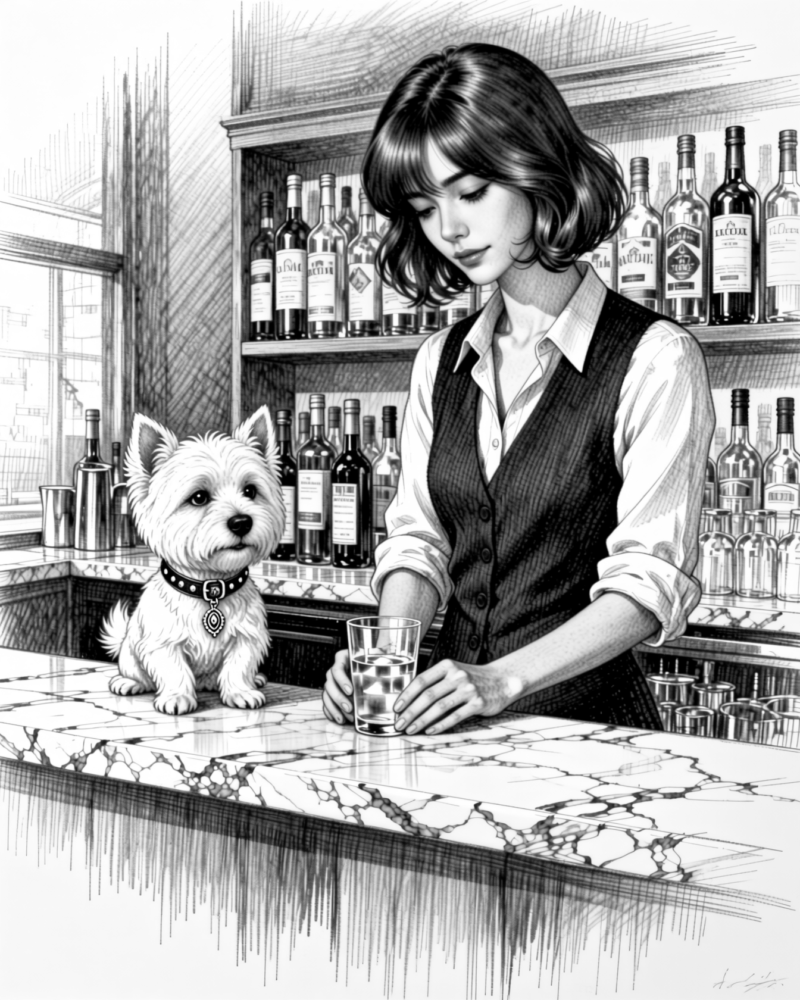

**The ask.** ABBY ROUND 2. The judges' fix list from round 1, applied as EDIT lines: one figure only, gaze off the lens with the far eye at least half the near one, both hands visible with four fingers and a thumb, exactly one towel, the full anchor composition, a closed mouth, the two-length fur rule, the blouse open two buttons, delicate face shading. Plus the lead's root-cause call: REPLACE PICTURE 1 with a crop of the approved plate sc04-fourteen-dollars-of-roof.png at box 470,345,345,680, drop kit/bust.png as Picture 3, re-word Picture 1's label so it names no fault, replace EDIT 6 with a measured frame and EDIT 12 with a positive statement of what fills the room.

**The thinking.** I cut the lead's sc04 box and put it on a coordinate grid before sending it. It is not quite one figure: BARCLAY'S muzzle and black nose sit in the bottom-right corner (crop x 255-345, y 596-680) and the RENEWAL NOTICE envelope in the bottom-left carries lettering the study's rules forbid on the marble. Both were cloned over with marble from the same plate by scripts/make-abby-picture1-round2.py; the rocks glass's rim ends at x~265 so the fill starts at 262 and the glass survives whole. I also re-pointed EDIT 4 off its shipped wording - it describes 'the round soft head' and a shoulder towel, four items before the edits that have to undo both - by adding a --character-edit flag to cast-study.py. The judges' phrasings went onto the wire as written.

**Settings.** local/qwen-image-edit-2511 via POST /api/generate, 4:5 1344x1680, fast Lightning 8 steps, cfg 1.0, euler/simple, shift 3.0, output png, tag study-abby-r2. Built by scripts/cast-study.py.

**Prompt.** [prompts/106-abby-character-study-round-2-pass-1-seed-21-the-sc04-tile-and-the-judges-wording.prompt.txt](prompts/106-abby-character-study-round-2-pass-1-seed-21-the-sc04-tile-and-the-judges-wording.prompt.txt)

**Verdict.** REJECT. Split again - a human figure plus the terrier as a pet. Room gone.

*Logged 13:08.*

---

## 107. Abby character study round 2 pass 1 seed 33 the sc04 tile and the judges wording

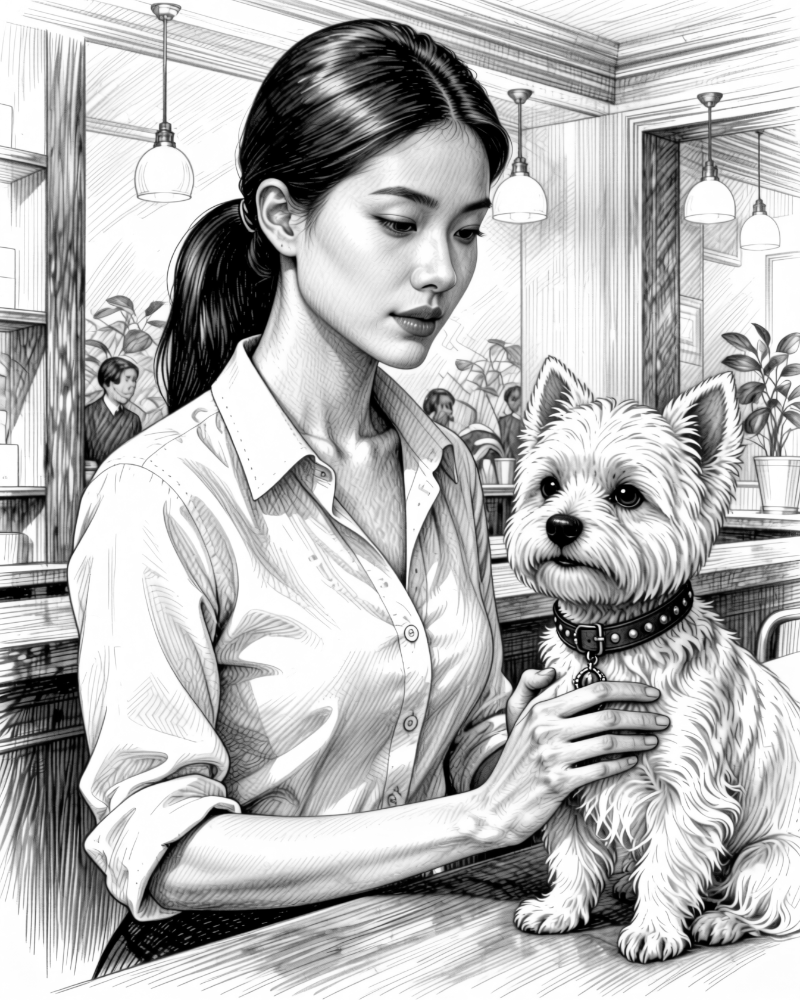

**The ask.** ABBY ROUND 2. The judges' fix list from round 1, applied as EDIT lines: one figure only, gaze off the lens with the far eye at least half the near one, both hands visible with four fingers and a thumb, exactly one towel, the full anchor composition, a closed mouth, the two-length fur rule, the blouse open two buttons, delicate face shading. Plus the lead's root-cause call: REPLACE PICTURE 1 with a crop of the approved plate sc04-fourteen-dollars-of-roof.png at box 470,345,345,680, drop kit/bust.png as Picture 3, re-word Picture 1's label so it names no fault, replace EDIT 6 with a measured frame and EDIT 12 with a positive statement of what fills the room.

**The thinking.** I cut the lead's sc04 box and put it on a coordinate grid before sending it. It is not quite one figure: BARCLAY'S muzzle and black nose sit in the bottom-right corner (crop x 255-345, y 596-680) and the RENEWAL NOTICE envelope in the bottom-left carries lettering the study's rules forbid on the marble. Both were cloned over with marble from the same plate by scripts/make-abby-picture1-round2.py; the rocks glass's rim ends at x~265 so the fill starts at 262 and the glass survives whole. I also re-pointed EDIT 4 off its shipped wording - it describes 'the round soft head' and a shoulder towel, four items before the edits that have to undo both - by adding a --character-edit flag to cast-study.py. The judges' phrasings went onto the wire as written.

**Settings.** local/qwen-image-edit-2511 via POST /api/generate, 4:5 1344x1680, fast Lightning 8 steps, cfg 1.0, euler/simple, shift 3.0, output png, tag study-abby-r2. Built by scripts/cast-study.py.

**Prompt.** [prompts/107-abby-character-study-round-2-pass-1-seed-33-the-sc04-tile-and-the-judges-wording.prompt.txt](prompts/107-abby-character-study-round-2-pass-1-seed-33-the-sc04-tile-and-the-judges-wording.prompt.txt)

**Verdict.** REJECT. Split again. Room gone.

*Logged 13:08.*

---

## 108. Abby character study round 2 pass 1 seed 44 the sc04 tile and the judges wording

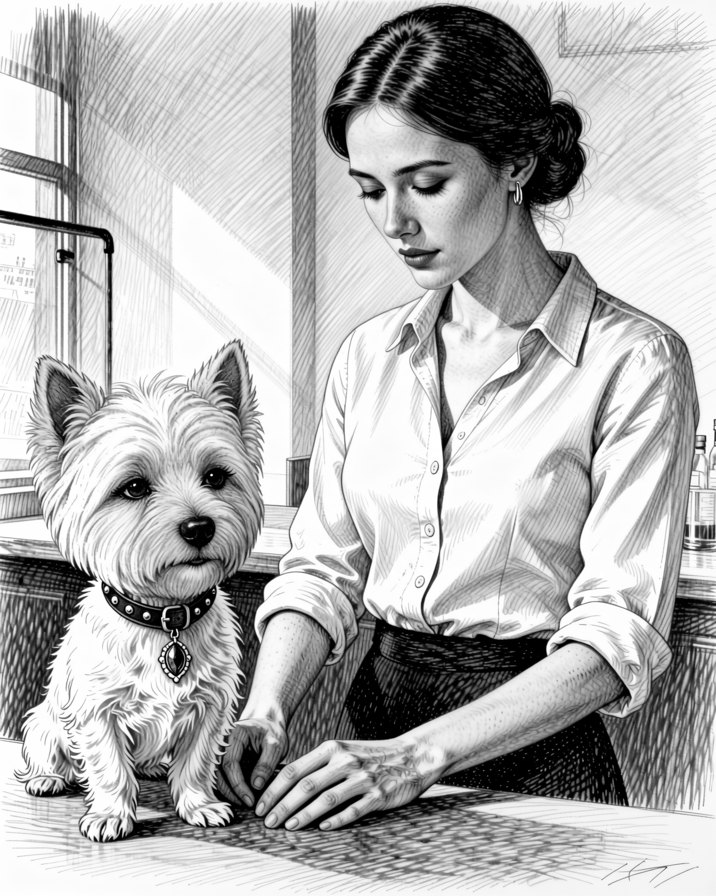

**The ask.** ABBY ROUND 2. The judges' fix list from round 1, applied as EDIT lines: one figure only, gaze off the lens with the far eye at least half the near one, both hands visible with four fingers and a thumb, exactly one towel, the full anchor composition, a closed mouth, the two-length fur rule, the blouse open two buttons, delicate face shading. Plus the lead's root-cause call: REPLACE PICTURE 1 with a crop of the approved plate sc04-fourteen-dollars-of-roof.png at box 470,345,345,680, drop kit/bust.png as Picture 3, re-word Picture 1's label so it names no fault, replace EDIT 6 with a measured frame and EDIT 12 with a positive statement of what fills the room.

**The thinking.** I cut the lead's sc04 box and put it on a coordinate grid before sending it. It is not quite one figure: BARCLAY'S muzzle and black nose sit in the bottom-right corner (crop x 255-345, y 596-680) and the RENEWAL NOTICE envelope in the bottom-left carries lettering the study's rules forbid on the marble. Both were cloned over with marble from the same plate by scripts/make-abby-picture1-round2.py; the rocks glass's rim ends at x~265 so the fill starts at 262 and the glass survives whole. I also re-pointed EDIT 4 off its shipped wording - it describes 'the round soft head' and a shoulder towel, four items before the edits that have to undo both - by adding a --character-edit flag to cast-study.py. The judges' phrasings went onto the wire as written.

**Settings.** local/qwen-image-edit-2511 via POST /api/generate, 4:5 1344x1680, fast Lightning 8 steps, cfg 1.0, euler/simple, shift 3.0, output png, tag study-abby-r2. Built by scripts/cast-study.py.

**Prompt.** [prompts/108-abby-character-study-round-2-pass-1-seed-44-the-sc04-tile-and-the-judges-wording.prompt.txt](prompts/108-abby-character-study-round-2-pass-1-seed-44-the-sc04-tile-and-the-judges-wording.prompt.txt)

**Verdict.** REJECT. Split again. Room gone.

*Logged 13:08.*

---

## 109. Abby round 2 isolation seed 55 human nouns purged and Picture 1 back to the shipped plate crop

**The ask.** Six of six came back split into a person plus a real four-legged pet, with the bar gone. Find which change did it before spending another six seeds.

**The thinking.** Round 1's own diagnostic pass had already proved that the words HUMAN and WOMAN in the eye edit are read as NOUNS at cfg 1 and get drawn. The judges' fix list is written in exactly those nouns - 'the ONLY other person in the room', 'no extra human', 'dog-yet-HUMANOID hands', 'human bartender', 'human hands' - and I had carried them onto the wire verbatim. So: purge every human noun from the prompt I control (human, humanoid, woman, lady, person, man, customer), restate every judges' fix in terrier nouns, and change ONE thing at a time from there.

**Settings.** local/qwen-image-edit-2511 via POST /api/generate, 4:5 1344x1680, fast Lightning 8 steps, cfg 1.0, euler/simple, shift 3.0, output png, tag study-abby-r2. Built by scripts/cast-study.py.

**Prompt.** [prompts/109-abby-round-2-isolation-seed-55-human-nouns-purged-and-picture-1-back-to-the-shipped-plate-crop.prompt.txt](prompts/109-abby-round-2-isolation-seed-55-human-nouns-purged-and-picture-1-back-to-the-shipped-plate-crop.prompt.txt)

**Verdict.** PASS. One upright anthropomorphic Abby, no human, no second dog: the first clean single-Abby render of the project on the standard prompt. Closed mouth, real eyes with whites and a drawn iris, collar and teardrop, blouse open. Fails on staging: no room, no hands, no counter, and the head fills the frame. This is the configuration the shipped six were run on.

*Logged 13:08.*

---

## 110. Abby round 2 isolation seed 55 room edit moved early with the shipped plate crop

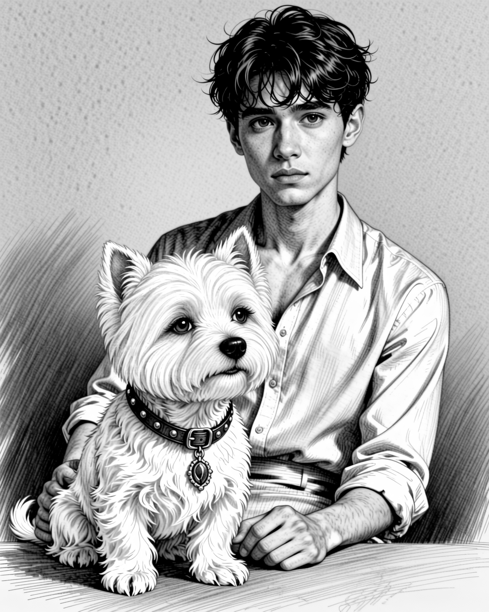

**The ask.** Six of six came back split into a person plus a real four-legged pet, with the bar gone. Find which change did it before spending another six seeds.

**The thinking.** The room had started falling out of the picture once round 1's negation list was replaced, so this pass moved a positive ROOM edit up to third of mine and rewrote it to name the back bar, the marble and every corner of the paper.

**Settings.** local/qwen-image-edit-2511 via POST /api/generate, 4:5 1344x1680, fast Lightning 8 steps, cfg 1.0, euler/simple, shift 3.0, output png, tag study-abby-r2. Built by scripts/cast-study.py.

**Prompt.** [prompts/110-abby-round-2-isolation-seed-55-room-edit-moved-early-with-the-shipped-plate-crop.prompt.txt](prompts/110-abby-round-2-isolation-seed-55-room-edit-moved-early-with-the-shipped-plate-crop.prompt.txt)

**Verdict.** REJECT. Moving the room edit early bought nothing and cost the identity: a human youth with a four-legged westie, on paper. The room edit is not the lever; leave the order alone.

*Logged 13:08.*

---

## 111. Abby round 2 isolation seed 55 the sc04 crop demoted to a staging-only Picture 3

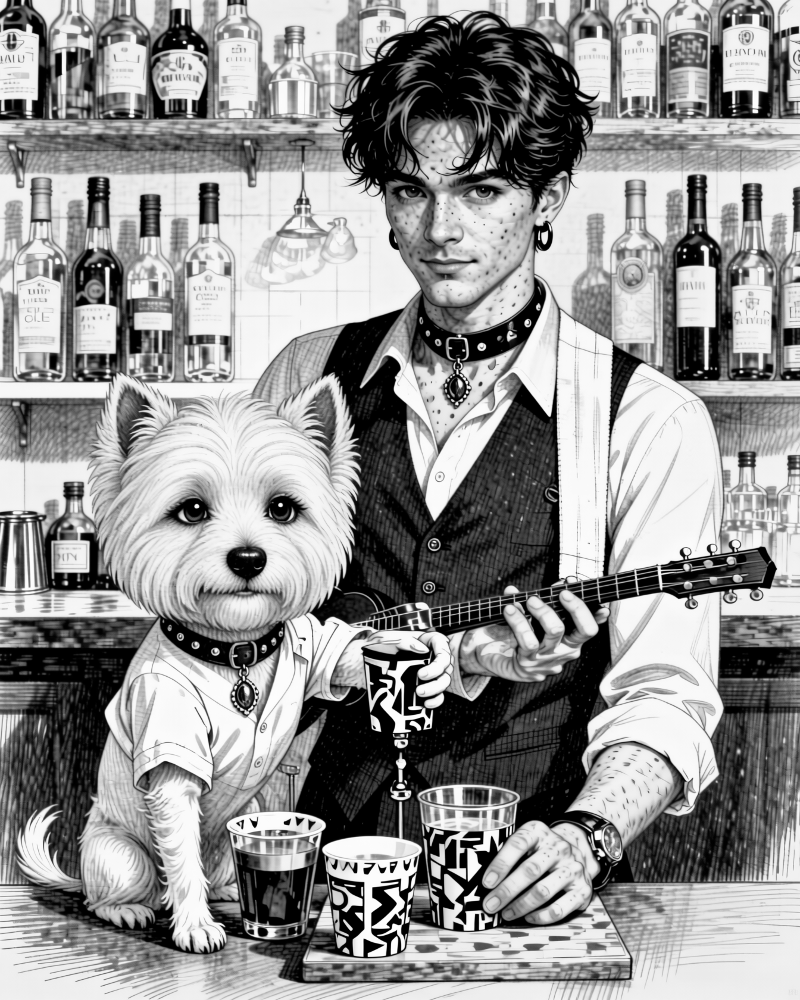

**The ask.** Six of six came back split into a person plus a real four-legged pet, with the bar gone. Find which change did it before spending another six seeds.

**The thinking.** If the sc04 crop cannot be Picture 1, try it as Picture 3 for STAGING ONLY - the room, the distance and the hands - with the shipped plate crop back as Picture 1 and the official portrait as Picture 2.

**Settings.** local/qwen-image-edit-2511 via POST /api/generate, 4:5 1344x1680, fast Lightning 8 steps, cfg 1.0, euler/simple, shift 3.0, output png, tag study-abby-r2. Built by scripts/cast-study.py.

**Prompt.** [prompts/111-abby-round-2-isolation-seed-55-the-sc04-crop-demoted-to-a-staging-only-picture-3.prompt.txt](prompts/111-abby-round-2-isolation-seed-55-the-sc04-crop-demoted-to-a-staging-only-picture-3.prompt.txt)

**Verdict.** MIXED, still a reject. The staging tile DID bring the room back - a full back bar, ranked bottles, the counter across the bottom - but the figure split again: a human bartender with the terrier beside him. The room is recoverable from a third tile; the identity is not survivable next to a torso reference.

*Logged 13:08.*

---

## 112. Abby character study round 2 seed 55 one upright terrier the split is fixed

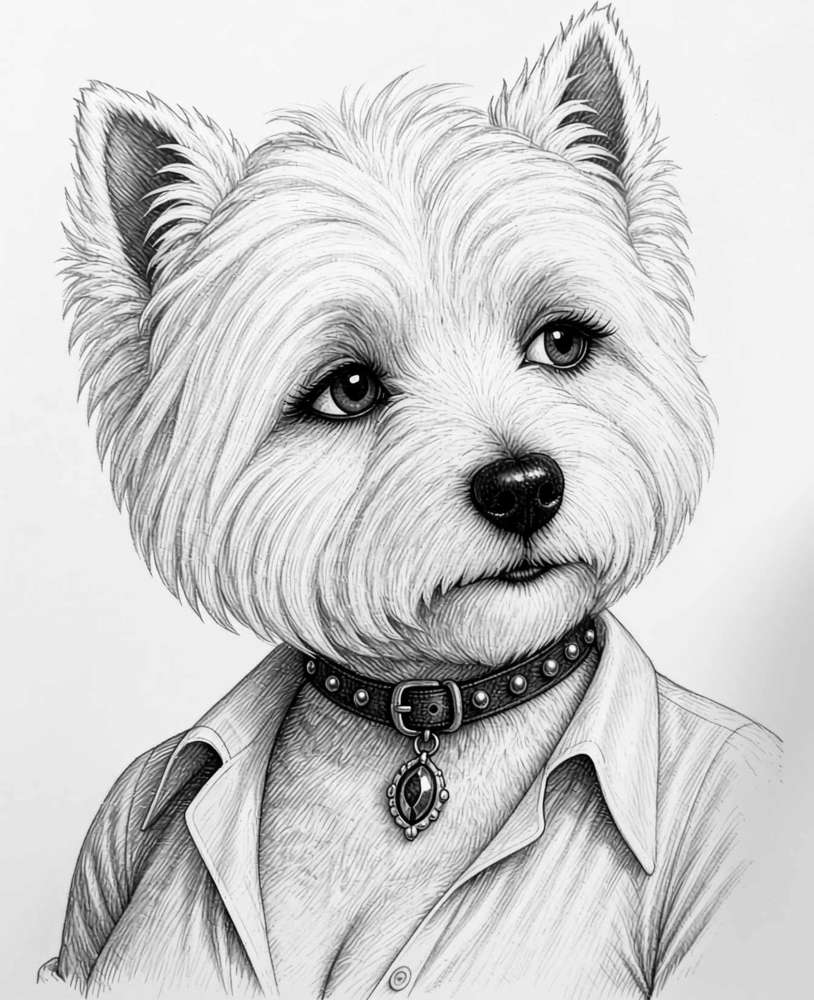

**The ask.** Round 2, the pass that ships: every judges' fix kept, all of them restated in terrier nouns, with Picture 1 back to the shipped plate crop and the six round seeds re-run at the recorded recipe.

**The thinking.** The lead's root-cause call was tested eleven times and lost every time: the sc04 crop shows Abby HEAD TO HANDS - a terrier head on an upright torso with two arms - and at cfg 1 the model cuts along that seam, torso to a person and head to a pet. The shipped trio.png crop is a HEAD, and a head offers nothing to split off. So Picture 1 goes back, Picture 3 stays dropped, and the whole weight of the round goes on language: no human noun anywhere, the count of living figures stated first, then the lead's measured frame, the eye in five parts with its new brow arch and radiating iris, the gaze off the lens, the one towel, the breed (carrot skull, square muzzle, shallow forehead, two fur lengths), the blouse open two buttons, and the positive back-bar count closing the list. The hands went into THE BUSINESS, edit 5 of 14, which is the promotion the judges asked for - EDIT 2 is not reachable, cast-study.py hardcodes edits 1 to 5.

**Settings.** local/qwen-image-edit-2511 via POST /api/generate, 4:5 1344x1680, fast Lightning 8 steps, cfg 1.0, euler/simple, shift 3.0, output png, tag study-abby-r2. Built by scripts/cast-study.py.

**Prompt.** [prompts/112-abby-character-study-round-2-seed-55-one-upright-terrier-the-split-is-fixed.prompt.txt](prompts/112-abby-character-study-round-2-seed-55-one-upright-terrier-the-split-is-fixed.prompt.txt)

**Verdict.** BEST OF THE SIX. One Abby and nothing else alive. Carrot skull, short square muzzle, fully closed warm smile, collar-buckle-ring-teardrop, blouse open two buttons with the decolletage showing. Best eyes of the round - white at both sides of the iris, a drawn iris with a rim, a distinctly smaller pupil, one catchlight, lashes and a lid - and the gaze furthest off the lens, down and to her left. FAILS: no room, no counter, no hands, no towel, and the head fills the frame instead of the top third.

*Logged 13:08.*

---

## 113. Abby character study round 2 seed 7 one upright terrier the split is fixed

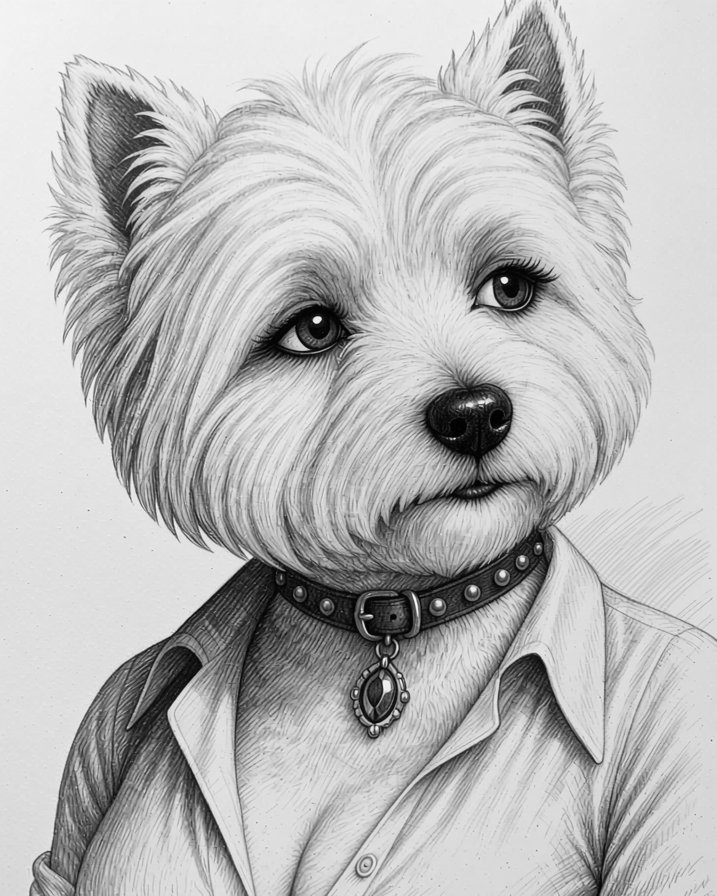

**The ask.** Round 2, the pass that ships: every judges' fix kept, all of them restated in terrier nouns, with Picture 1 back to the shipped plate crop and the six round seeds re-run at the recorded recipe.

**The thinking.** The lead's root-cause call was tested eleven times and lost every time: the sc04 crop shows Abby HEAD TO HANDS - a terrier head on an upright torso with two arms - and at cfg 1 the model cuts along that seam, torso to a person and head to a pet. The shipped trio.png crop is a HEAD, and a head offers nothing to split off. So Picture 1 goes back, Picture 3 stays dropped, and the whole weight of the round goes on language: no human noun anywhere, the count of living figures stated first, then the lead's measured frame, the eye in five parts with its new brow arch and radiating iris, the gaze off the lens, the one towel, the breed (carrot skull, square muzzle, shallow forehead, two fur lengths), the blouse open two buttons, and the positive back-bar count closing the list. The hands went into THE BUSINESS, edit 5 of 14, which is the promotion the judges asked for - EDIT 2 is not reachable, cast-study.py hardcodes edits 1 to 5.

**Settings.** local/qwen-image-edit-2511 via POST /api/generate, 4:5 1344x1680, fast Lightning 8 steps, cfg 1.0, euler/simple, shift 3.0, output png, tag study-abby-r2. Built by scripts/cast-study.py.

**Prompt.** [prompts/113-abby-character-study-round-2-seed-7-one-upright-terrier-the-split-is-fixed.prompt.txt](prompts/113-abby-character-study-round-2-seed-7-one-upright-terrier-the-split-is-fixed.prompt.txt)

**Verdict.** One Abby, no second being. Eyes right, mouth closed, teardrop clean. The gaze sits nearer the reader than 55 and the chin is dropped. No room, no hands, no counter, no towel.

*Logged 13:08.*

---

## 114. Abby character study round 2 seed 41 one upright terrier the split is fixed

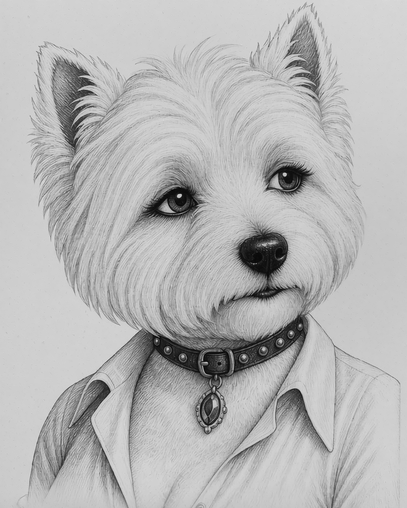

**The ask.** Round 2, the pass that ships: every judges' fix kept, all of them restated in terrier nouns, with Picture 1 back to the shipped plate crop and the six round seeds re-run at the recorded recipe.

**The thinking.** The lead's root-cause call was tested eleven times and lost every time: the sc04 crop shows Abby HEAD TO HANDS - a terrier head on an upright torso with two arms - and at cfg 1 the model cuts along that seam, torso to a person and head to a pet. The shipped trio.png crop is a HEAD, and a head offers nothing to split off. So Picture 1 goes back, Picture 3 stays dropped, and the whole weight of the round goes on language: no human noun anywhere, the count of living figures stated first, then the lead's measured frame, the eye in five parts with its new brow arch and radiating iris, the gaze off the lens, the one towel, the breed (carrot skull, square muzzle, shallow forehead, two fur lengths), the blouse open two buttons, and the positive back-bar count closing the list. The hands went into THE BUSINESS, edit 5 of 14, which is the promotion the judges asked for - EDIT 2 is not reachable, cast-study.py hardcodes edits 1 to 5.

**Settings.** local/qwen-image-edit-2511 via POST /api/generate, 4:5 1344x1680, fast Lightning 8 steps, cfg 1.0, euler/simple, shift 3.0, output png, tag study-abby-r2. Built by scripts/cast-study.py.

**Prompt.** [prompts/114-abby-character-study-round-2-seed-41-one-upright-terrier-the-split-is-fixed.prompt.txt](prompts/114-abby-character-study-round-2-seed-41-one-upright-terrier-the-split-is-fixed.prompt.txt)

**Verdict.** One Abby. The cleanest, quietest line of the six - but the gaze comes closest of all six to meeting the reader, which is the founder's oldest complaint about her. No room, no hands, no counter, no towel.

*Logged 13:08.*

---

## 115. Abby character study round 2 seed 21 one upright terrier the split is fixed

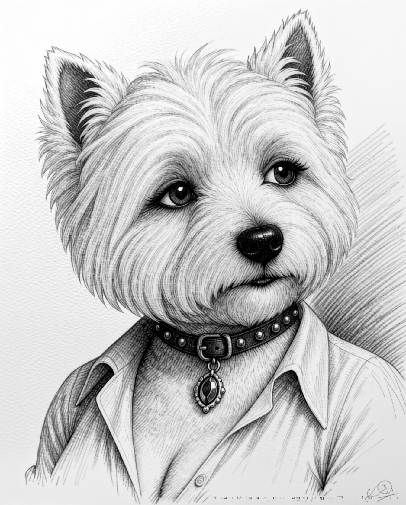

**The ask.** Round 2, the pass that ships: every judges' fix kept, all of them restated in terrier nouns, with Picture 1 back to the shipped plate crop and the six round seeds re-run at the recorded recipe.

**The thinking.** The lead's root-cause call was tested eleven times and lost every time: the sc04 crop shows Abby HEAD TO HANDS - a terrier head on an upright torso with two arms - and at cfg 1 the model cuts along that seam, torso to a person and head to a pet. The shipped trio.png crop is a HEAD, and a head offers nothing to split off. So Picture 1 goes back, Picture 3 stays dropped, and the whole weight of the round goes on language: no human noun anywhere, the count of living figures stated first, then the lead's measured frame, the eye in five parts with its new brow arch and radiating iris, the gaze off the lens, the one towel, the breed (carrot skull, square muzzle, shallow forehead, two fur lengths), the blouse open two buttons, and the positive back-bar count closing the list. The hands went into THE BUSINESS, edit 5 of 14, which is the promotion the judges asked for - EDIT 2 is not reachable, cast-study.py hardcodes edits 1 to 5.

**Settings.** local/qwen-image-edit-2511 via POST /api/generate, 4:5 1344x1680, fast Lightning 8 steps, cfg 1.0, euler/simple, shift 3.0, output png, tag study-abby-r2. Built by scripts/cast-study.py.

**Prompt.** [prompts/115-abby-character-study-round-2-seed-21-one-upright-terrier-the-split-is-fixed.prompt.txt](prompts/115-abby-character-study-round-2-seed-21-one-upright-terrier-the-split-is-fixed.prompt.txt)

**Verdict.** One Abby. Faint pencil scribbles run along the bottom edge where a signature keeps trying to appear. No room, no hands, no counter, no towel.

*Logged 13:08.*

---

## 116. Abby character study round 2 seed 33 one upright terrier the split is fixed

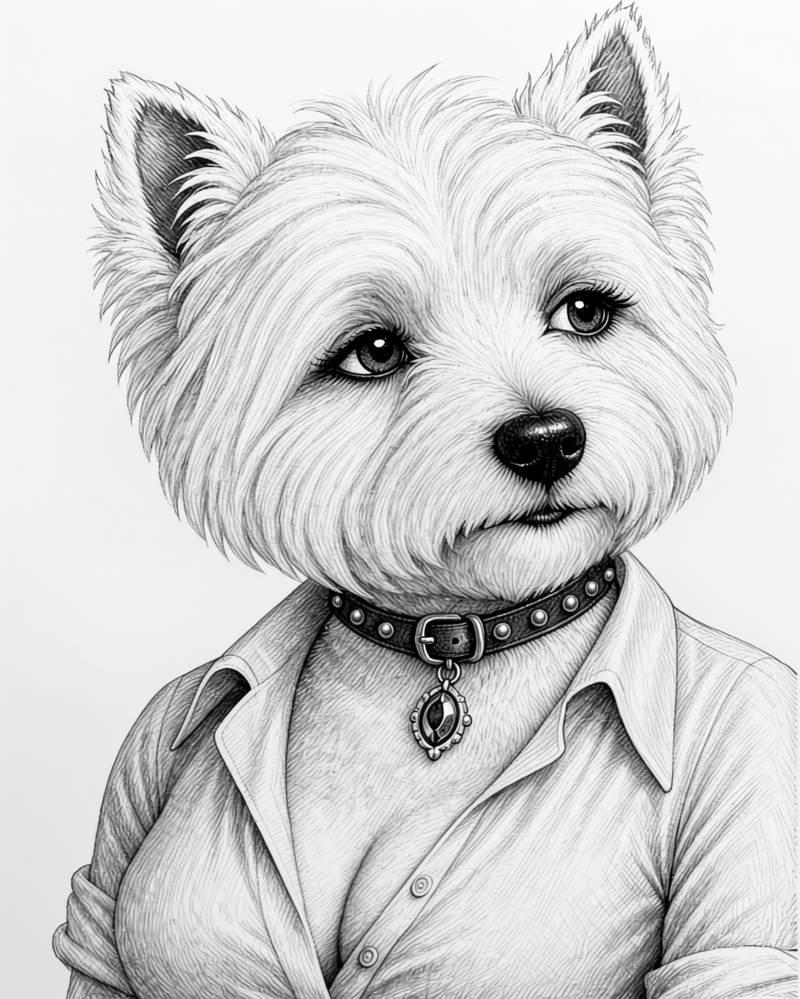

**The ask.** Round 2, the pass that ships: every judges' fix kept, all of them restated in terrier nouns, with Picture 1 back to the shipped plate crop and the six round seeds re-run at the recorded recipe.

**The thinking.** The lead's root-cause call was tested eleven times and lost every time: the sc04 crop shows Abby HEAD TO HANDS - a terrier head on an upright torso with two arms - and at cfg 1 the model cuts along that seam, torso to a person and head to a pet. The shipped trio.png crop is a HEAD, and a head offers nothing to split off. So Picture 1 goes back, Picture 3 stays dropped, and the whole weight of the round goes on language: no human noun anywhere, the count of living figures stated first, then the lead's measured frame, the eye in five parts with its new brow arch and radiating iris, the gaze off the lens, the one towel, the breed (carrot skull, square muzzle, shallow forehead, two fur lengths), the blouse open two buttons, and the positive back-bar count closing the list. The hands went into THE BUSINESS, edit 5 of 14, which is the promotion the judges asked for - EDIT 2 is not reachable, cast-study.py hardcodes edits 1 to 5.

**Settings.** local/qwen-image-edit-2511 via POST /api/generate, 4:5 1344x1680, fast Lightning 8 steps, cfg 1.0, euler/simple, shift 3.0, output png, tag study-abby-r2. Built by scripts/cast-study.py.

**Prompt.** [prompts/116-abby-character-study-round-2-seed-33-one-upright-terrier-the-split-is-fixed.prompt.txt](prompts/116-abby-character-study-round-2-seed-33-one-upright-terrier-the-split-is-fixed.prompt.txt)

**Verdict.** One Abby, but her left shoulder runs off the frame and the bust reads heaviest of the six against the OPEN THE NECKLINE NOT THE FIGURE rule. No room, no hands, no counter.

*Logged 13:08.*

---

## 117. Abby character study round 2 seed 44 one upright terrier the split is fixed

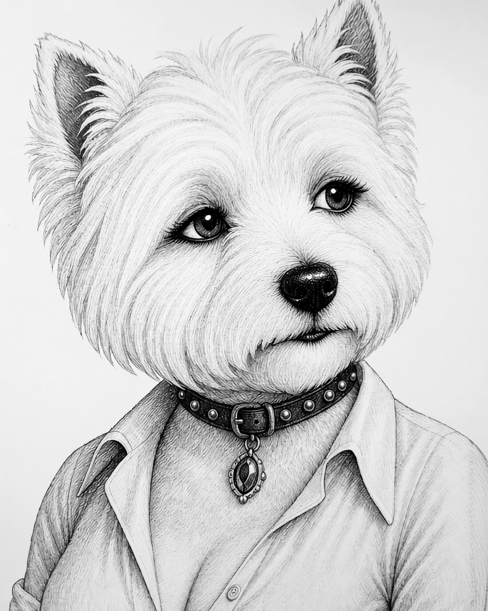

**The ask.** Round 2, the pass that ships: every judges' fix kept, all of them restated in terrier nouns, with Picture 1 back to the shipped plate crop and the six round seeds re-run at the recorded recipe.

**The thinking.** The lead's root-cause call was tested eleven times and lost every time: the sc04 crop shows Abby HEAD TO HANDS - a terrier head on an upright torso with two arms - and at cfg 1 the model cuts along that seam, torso to a person and head to a pet. The shipped trio.png crop is a HEAD, and a head offers nothing to split off. So Picture 1 goes back, Picture 3 stays dropped, and the whole weight of the round goes on language: no human noun anywhere, the count of living figures stated first, then the lead's measured frame, the eye in five parts with its new brow arch and radiating iris, the gaze off the lens, the one towel, the breed (carrot skull, square muzzle, shallow forehead, two fur lengths), the blouse open two buttons, and the positive back-bar count closing the list. The hands went into THE BUSINESS, edit 5 of 14, which is the promotion the judges asked for - EDIT 2 is not reachable, cast-study.py hardcodes edits 1 to 5.

**Settings.** local/qwen-image-edit-2511 via POST /api/generate, 4:5 1344x1680, fast Lightning 8 steps, cfg 1.0, euler/simple, shift 3.0, output png, tag study-abby-r2. Built by scripts/cast-study.py.

**Prompt.** [prompts/117-abby-character-study-round-2-seed-44-one-upright-terrier-the-split-is-fixed.prompt.txt](prompts/117-abby-character-study-round-2-seed-44-one-upright-terrier-the-split-is-fixed.prompt.txt)

**Verdict.** One Abby. The finest lashes and lids of the round and the iris rim clearly drawn - but the gaze tips UP and away from the work her hands are supposed to be doing. No room, no hands, no counter, no towel.

*Logged 13:08.*

---

## 118. Abby round 2 contact sheet six seeds beside the kit bust and head

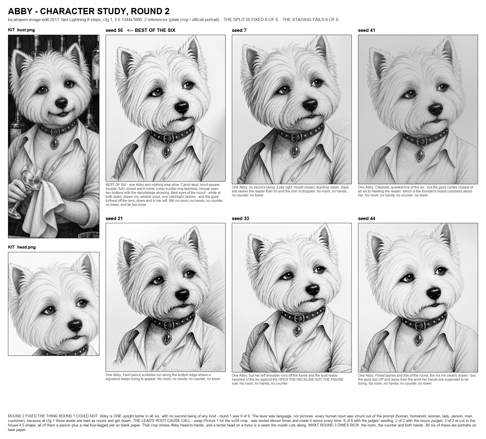

**The ask.** Build the round-2 sheet: the six renders at 420 px beside the kit's bust and head tiles, labelled with seeds and verdicts, so the round reads on its own in Rick's report.

**The thinking.** The sheet carries the round's one real result in its subtitle - THE SPLIT IS FIXED 6 OF 6, THE STAGING FAILS 6 OF 6 - and the footer records what the eleven sc04 renders bought, so the next round does not spend another morning on that crop.

**Settings.** Composited by scripts/build-abby-round2-sheet.py from the six 1344x1680 renders and canon/characters/abby/kit/{bust,head}.png. 1702x1542.

**Verdict.** Round 1 was 0 of 6 on identity; round 2 is 6 of 6. What round 3 owes Rick is the room, the counter and both hands - all six of these are portraits on bare paper.

*Logged 13:08.*

---

## 119. Abby round 3, seed 41 - the judges' sc12 Picture 1, tested and rejected on lettering

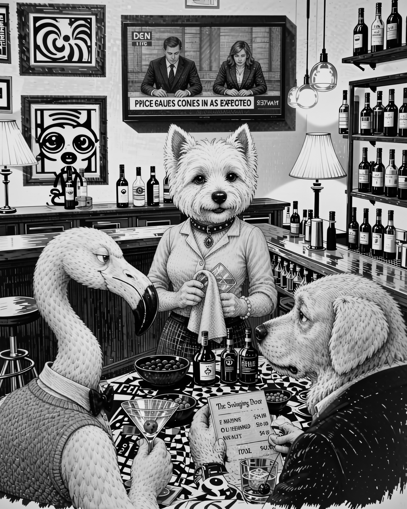

**The ask.** Round 3 of perfecting Abby. The judges called the root cause: rounds 1 and 2 sent a BUST as Picture 1, and qwen-image-edit copies Picture 1's staging, so 6 of 6 came back as portraits on bare paper while the prompt asked for the counter, both hands and the towel. Picture 1 must be a FULL PLATE. Build the eye tile by hand from look-card section 2 and send it as Picture 3 (Step 5, skipped until now); drop canon/vision/studies/abby.png, the source of the level lip line and the animal eye. Fix the jawline, the mouth, the eye, the nose, the ears, the hands and towel, the occlusion and the gaze as EDIT lines. Hold the recipe.

**The thinking.** The judges named canon/showcase-retired/sc12-permanent-receipt.png as Picture 1: the whole art field, caption band cut, resized to the house 4:5. I built exactly that (caption band measured, not guessed - every row from y=1500 down is a flat 245, so the cut is y=1498) and ran it before anything else, because the whole round rests on it. It half-works and half-fails, and the half that fails is fatal, so it is filed as evidence rather than binned.

**Settings.** local/qwen-image-edit-2511, 4:5 1344x1680, fast Lightning 8 steps, cfg 1, euler/simple, shift 3.0, 3 references (Picture 1 the approved blank plate canon/plates/trio.png cut x60..1140 y20..1370 to a true 4:5; Picture 2 canon/characters/abby/kit/bust.png for the collar hardware and the blouse only; Picture 3 the hand-drawn eye chart abby-eye-tile.png), scripts/cast-study.py --cast-count 3 --keep-duo (Picture 1 = the sc12 art field, 1344x1680)

**Prompt.** [prompts/119-abby-round-3-seed-41-the-judges-sc12-picture-1-tested-and-rejected-on-lettering.prompt.txt](prompts/119-abby-round-3-seed-41-the-judges-sc12-picture-1-tested-and-rejected-on-lettering.prompt.txt)

**Verdict.** THE DIAGNOSIS IS RIGHT AND THE PLATE IS WRONG. Right: a full-plate Picture 1 brings the whole room back at once - the counter, the back bar, all three characters, both of Abby's hands, the towel, the occlusion at her waist. That is the round-2 failure cured in one move. Wrong: sc12 is a PUBLISHED strip and it is covered in lettering - a live television chyron, a lettered chalkboard and a lettered receipt in Barclay's hands. At cfg 1 the model copied all three and then invented more of it: the chyron came back as 'PPICE GAUES CONES IN AS EXPECTEO', the bottle labels grew scribble, and the receipt kept its columns. Pseudo-text is what INSPECTION.md check 17 calls fatal. Two further drifts: the camera pulled back off the marble into stools and floor, and the left wall grew invented posters. The fix is not to fight the plate with words - it is to send a plate that has nothing to copy. canon/plates/trio.png is the APPROVED BLANK PLATE and carries the identical construction with the screen already off, the slate already wiped, every label already blank and no receipt. Picture 1 changed to trio.png for the rest of the round.

*Logged 13:37.*

---

## 120. Abby round 3 - her eye, drawn by hand (look-card Step 5, skipped until now)

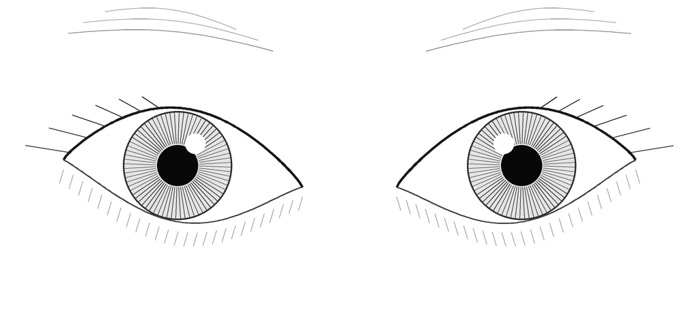

**The ask.** Round 3 of perfecting Abby. The judges called the root cause: rounds 1 and 2 sent a BUST as Picture 1, and qwen-image-edit copies Picture 1's staging, so 6 of 6 came back as portraits on bare paper while the prompt asked for the counter, both hands and the towel. Picture 1 must be a FULL PLATE. Build the eye tile by hand from look-card section 2 and send it as Picture 3 (Step 5, skipped until now); drop canon/vision/studies/abby.png, the source of the level lip line and the animal eye. Fix the jawline, the mouth, the eye, the nose, the ears, the hands and towel, the occlusion and the gaze as EDIT lines. Hold the recipe.

**The thinking.** Look-card section 1: 'Her corrected eye must be HAND-BUILT once from the section 2 table and become her permanent paste source (Step 5), not copied from any existing picture.' Every tile in the set carries the failing eye instead - the face reference measures 87.6% and 83.5% of each opening below luminance 60, the definitive study 52.3% and 39.7%, and none of them puts white at either side of the iris. A correct eye cannot arrive from a reference that does not contain one, at any seed, which is why six seeds produced the same eye six times. So it is drawn, not sourced: scripts/make-abby-eye-tile.py builds ONE eye in a 512 cell from the section 2 wording and mirrors it for the pair, so both eyes are the same size, shape and height by construction. All line work - the iris mid-tone is made of radiating strokes, not a grey wash - and no lettering anywhere on the tile, because a label would be copied into the picture as pseudo-text.

**Settings.** PIL, drawn at 3x and downsampled, 1024x470, greyscale; sent as Picture 3

**Prompt.** [prompts/120-abby-round-3-her-eye-drawn-by-hand-look-card-step-5-skipped-until-now.prompt.txt](prompts/120-abby-round-3-her-eye-drawn-by-hand-look-card-step-5-skipped-until-now.prompt.txt)

**Verdict.** It does its job and it also taught the round something. It works: the near eye across all six renders measures 23-26% below L60 against 52.3% for the best tile in the repository, with genuine paper-white on both sides of the iris. It has one cost, seen at seed 33 and faintly at 21: a diagram sent as a reference can be drawn INTO the room as a picture - seed 33 put a cartoon westie with one giant eye and a starburst inside the wiped slate. Round 4's tile needs a role line that forbids it appearing as a picture on any wall.

*Logged 13:37.*

---

## 121. Abby character study, round 3, seed 55 - the room comes back with the plate

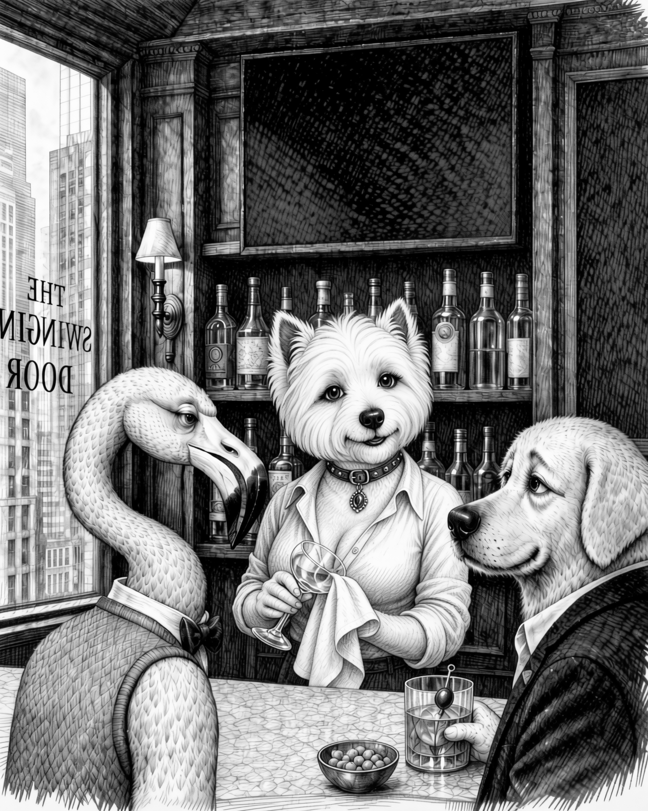

**The ask.** Round 3 of perfecting Abby. The judges called the root cause: rounds 1 and 2 sent a BUST as Picture 1, and qwen-image-edit copies Picture 1's staging, so 6 of 6 came back as portraits on bare paper while the prompt asked for the counter, both hands and the towel. Picture 1 must be a FULL PLATE. Build the eye tile by hand from look-card section 2 and send it as Picture 3 (Step 5, skipped until now); drop canon/vision/studies/abby.png, the source of the level lip line and the animal eye. Fix the jawline, the mouth, the eye, the nose, the ears, the hands and towel, the occlusion and the gaze as EDIT lines. Hold the recipe.

**The thinking.** Picture 1 is now canon/plates/trio.png, the approved BLANK plate, cut to a true 4:5 that ends at the marble; Picture 2 is kit/bust.png sent for the collar hardware and the blouse ONLY, with its face, eyes, mouth and staging explicitly refused in its role line; Picture 3 is the hand-drawn eye chart. canon/vision/studies/abby.png is dropped. Two flags were added to cast-study.py: --keep-duo, which stops the study scaffolding re-pointing canon's staging paragraph at one figure (with a full-plate Picture 1 that paragraph already describes the plate, and re-pointing it is what told the model to throw the room away), and --cast-count 3. Fourteen numbered EDITS carry the judges' fixes; no human noun appears anywhere in the text I control, which is the rule round 2 proved at cfg 1. Seed 55 first, as the judges asked.

**Settings.** local/qwen-image-edit-2511, 4:5 1344x1680, fast Lightning 8 steps, cfg 1, euler/simple, shift 3.0, 3 references (Picture 1 the approved blank plate canon/plates/trio.png cut x60..1140 y20..1370 to a true 4:5; Picture 2 canon/characters/abby/kit/bust.png for the collar hardware and the blouse only; Picture 3 the hand-drawn eye chart abby-eye-tile.png), scripts/cast-study.py --cast-count 3 --keep-duo, seed 55

**Prompt.** [prompts/121-abby-character-study-round-3-seed-55-the-room-comes-back-with-the-plate.prompt.txt](prompts/121-abby-character-study-round-3-seed-55-the-room-comes-back-with-the-plate.prompt.txt)

**Verdict.** RUNNER-UP OF SIX. The round-2 failure is cured: the room, the marble, the back bar, the sconce and the mirrored window are all there, the counter crosses her at the waist, both hands work the glass and the towel, and Drew and Barclay sit on the near side. Nothing is lettered but the window name - slate blank, every bottle label blank. Her eye is the largest and best drawn of the six: measured 23.8% below L60 with white at 245 and 246 against a paper of 251, so there is real paper-white at both sides of the iris. Marked below seed 44 on two counts: the lip line opens into a distinct dark gap right of centre where the edit says never parted, and the long coat still runs past the jaw down onto the throat.

*Logged 13:37.*

---

## 122. Abby character study, round 3, seed 41 - the quietest line, the weakest eye

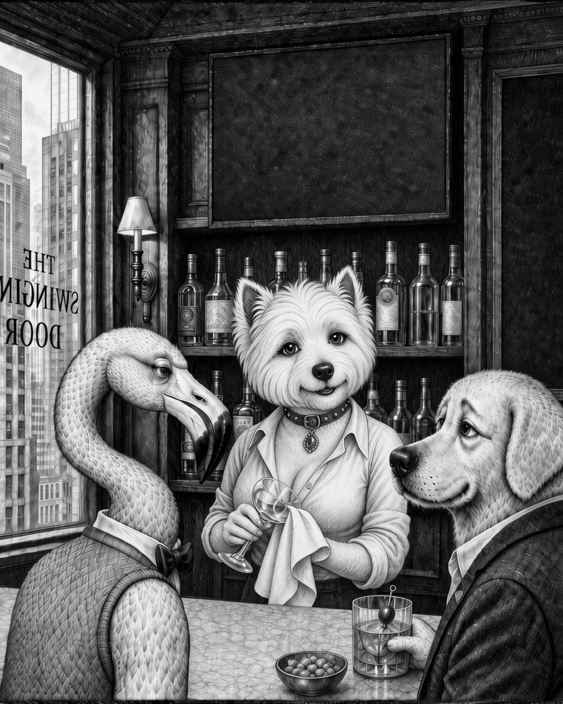

**The ask.** Round 3 of perfecting Abby. The judges called the root cause: rounds 1 and 2 sent a BUST as Picture 1, and qwen-image-edit copies Picture 1's staging, so 6 of 6 came back as portraits on bare paper while the prompt asked for the counter, both hands and the towel. Picture 1 must be a FULL PLATE. Build the eye tile by hand from look-card section 2 and send it as Picture 3 (Step 5, skipped until now); drop canon/vision/studies/abby.png, the source of the level lip line and the animal eye. Fix the jawline, the mouth, the eye, the nose, the ears, the hands and towel, the occlusion and the gaze as EDIT lines. Hold the recipe.

**The thinking.** Picture 1 is now canon/plates/trio.png, the approved BLANK plate, cut to a true 4:5 that ends at the marble; Picture 2 is kit/bust.png sent for the collar hardware and the blouse ONLY, with its face, eyes, mouth and staging explicitly refused in its role line; Picture 3 is the hand-drawn eye chart. canon/vision/studies/abby.png is dropped. Two flags were added to cast-study.py: --keep-duo, which stops the study scaffolding re-pointing canon's staging paragraph at one figure (with a full-plate Picture 1 that paragraph already describes the plate, and re-pointing it is what told the model to throw the room away), and --cast-count 3. Fourteen numbered EDITS carry the judges' fixes; no human noun appears anywhere in the text I control, which is the rule round 2 proved at cfg 1. Seed 41 is the recorded house seed and the judges asked for it second.

**Settings.** local/qwen-image-edit-2511, 4:5 1344x1680, fast Lightning 8 steps, cfg 1, euler/simple, shift 3.0, 3 references (Picture 1 the approved blank plate canon/plates/trio.png cut x60..1140 y20..1370 to a true 4:5; Picture 2 canon/characters/abby/kit/bust.png for the collar hardware and the blouse only; Picture 3 the hand-drawn eye chart abby-eye-tile.png), scripts/cast-study.py --cast-count 3 --keep-duo, seed 41

**Prompt.** [prompts/122-abby-character-study-round-3-seed-41-the-quietest-line-the-weakest-eye.prompt.txt](prompts/122-abby-character-study-round-3-seed-41-the-quietest-line-the-weakest-eye.prompt.txt)

**Verdict.** THIRD. The cleanest, quietest drawing of the six and the closest of them all to Picture 1's own framing, with no strays anywhere in the frame. It is also the ONLY render of the six whose eye misses the white test: the far side of the near iris shades to 219 against a paper of 241, so the white is on one side of the iris and not the other. Dark fraction is fine at 24.5%. Mouth parted right of centre, gaze square at the reader.

*Logged 13:37.*

---

## 123. Abby character study, round 3, seed 7 - clean face, two strays

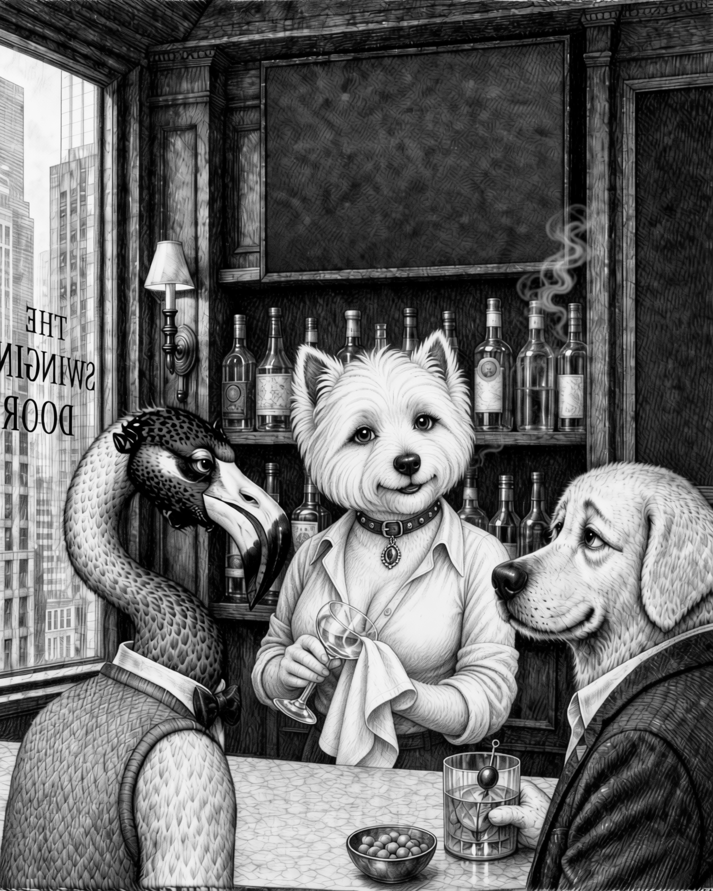

**The ask.** Round 3 of perfecting Abby. The judges called the root cause: rounds 1 and 2 sent a BUST as Picture 1, and qwen-image-edit copies Picture 1's staging, so 6 of 6 came back as portraits on bare paper while the prompt asked for the counter, both hands and the towel. Picture 1 must be a FULL PLATE. Build the eye tile by hand from look-card section 2 and send it as Picture 3 (Step 5, skipped until now); drop canon/vision/studies/abby.png, the source of the level lip line and the animal eye. Fix the jawline, the mouth, the eye, the nose, the ears, the hands and towel, the occlusion and the gaze as EDIT lines. Hold the recipe.

**The thinking.** Picture 1 is now canon/plates/trio.png, the approved BLANK plate, cut to a true 4:5 that ends at the marble; Picture 2 is kit/bust.png sent for the collar hardware and the blouse ONLY, with its face, eyes, mouth and staging explicitly refused in its role line; Picture 3 is the hand-drawn eye chart. canon/vision/studies/abby.png is dropped. Two flags were added to cast-study.py: --keep-duo, which stops the study scaffolding re-pointing canon's staging paragraph at one figure (with a full-plate Picture 1 that paragraph already describes the plate, and re-pointing it is what told the model to throw the room away), and --cast-count 3. Fourteen numbered EDITS carry the judges' fixes; no human noun appears anywhere in the text I control, which is the rule round 2 proved at cfg 1.

**Settings.** local/qwen-image-edit-2511, 4:5 1344x1680, fast Lightning 8 steps, cfg 1, euler/simple, shift 3.0, 3 references (Picture 1 the approved blank plate canon/plates/trio.png cut x60..1140 y20..1370 to a true 4:5; Picture 2 canon/characters/abby/kit/bust.png for the collar hardware and the blouse only; Picture 3 the hand-drawn eye chart abby-eye-tile.png), scripts/cast-study.py --cast-count 3 --keep-duo, seed 7

**Prompt.** [prompts/123-abby-character-study-round-3-seed-7-clean-face-two-strays.prompt.txt](prompts/123-abby-character-study-round-3-seed-7-clean-face-two-strays.prompt.txt)

**Verdict.** FOURTH. Slate blank, room right, occlusion right, both hands right, and a good eye at 23.3% dark with white at 238 and 233 on a paper of 245. Two strays keep it out of the top three: a curl of smoke rises off the back bar behind her left ear, and Drew's face is mottled where the rest of the plate is crisp.

*Logged 13:37.*

---

## 124. Abby character study, round 3, seed 21 - a ghost in the wiped slate

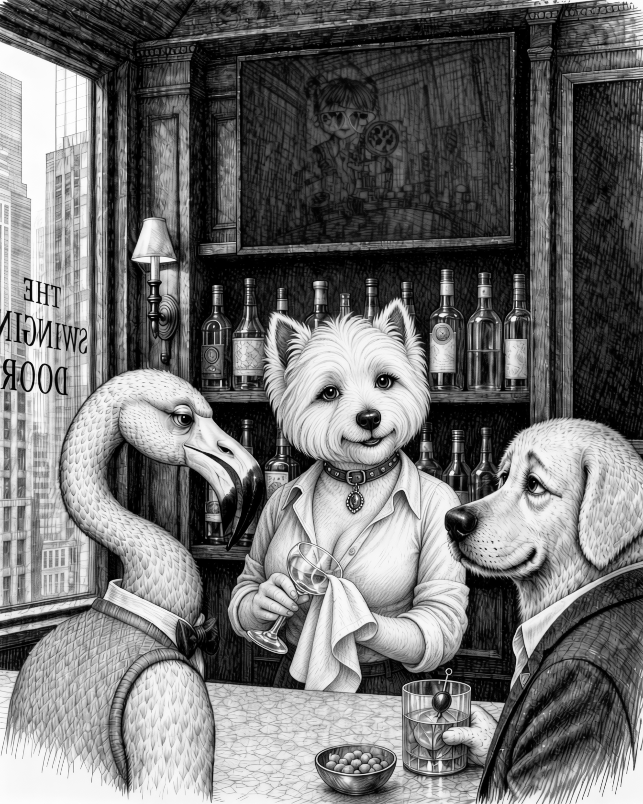

**The ask.** Round 3 of perfecting Abby. The judges called the root cause: rounds 1 and 2 sent a BUST as Picture 1, and qwen-image-edit copies Picture 1's staging, so 6 of 6 came back as portraits on bare paper while the prompt asked for the counter, both hands and the towel. Picture 1 must be a FULL PLATE. Build the eye tile by hand from look-card section 2 and send it as Picture 3 (Step 5, skipped until now); drop canon/vision/studies/abby.png, the source of the level lip line and the animal eye. Fix the jawline, the mouth, the eye, the nose, the ears, the hands and towel, the occlusion and the gaze as EDIT lines. Hold the recipe.

**The thinking.** Picture 1 is now canon/plates/trio.png, the approved BLANK plate, cut to a true 4:5 that ends at the marble; Picture 2 is kit/bust.png sent for the collar hardware and the blouse ONLY, with its face, eyes, mouth and staging explicitly refused in its role line; Picture 3 is the hand-drawn eye chart. canon/vision/studies/abby.png is dropped. Two flags were added to cast-study.py: --keep-duo, which stops the study scaffolding re-pointing canon's staging paragraph at one figure (with a full-plate Picture 1 that paragraph already describes the plate, and re-pointing it is what told the model to throw the room away), and --cast-count 3. Fourteen numbered EDITS carry the judges' fixes; no human noun appears anywhere in the text I control, which is the rule round 2 proved at cfg 1.

**Settings.** local/qwen-image-edit-2511, 4:5 1344x1680, fast Lightning 8 steps, cfg 1, euler/simple, shift 3.0, 3 references (Picture 1 the approved blank plate canon/plates/trio.png cut x60..1140 y20..1370 to a true 4:5; Picture 2 canon/characters/abby/kit/bust.png for the collar hardware and the blouse only; Picture 3 the hand-drawn eye chart abby-eye-tile.png), scripts/cast-study.py --cast-count 3 --keep-duo, seed 21

**Prompt.** [prompts/124-abby-character-study-round-3-seed-21-a-ghost-in-the-wiped-slate.prompt.txt](prompts/124-abby-character-study-round-3-seed-21-a-ghost-in-the-wiped-slate.prompt.txt)

**Verdict.** REJECT. Abby herself is sound - room, counter, both hands, towel, and an eye at 24.4% dark that all but passes the white test (237 and 232 on a paper of 252, the second side marginal). The reject is the slate: a ghost figure has surfaced inside it, a face and shoulders in faint pencil, where EDIT 2 says a blank wiped slate. Same family of fault as seed 33 and the same cause - a picture-shaped reference finding a picture-shaped hole in the room.

*Logged 13:37.*

---

## 125. Abby character study, round 3, seed 33 - the eye chart climbs into the slate

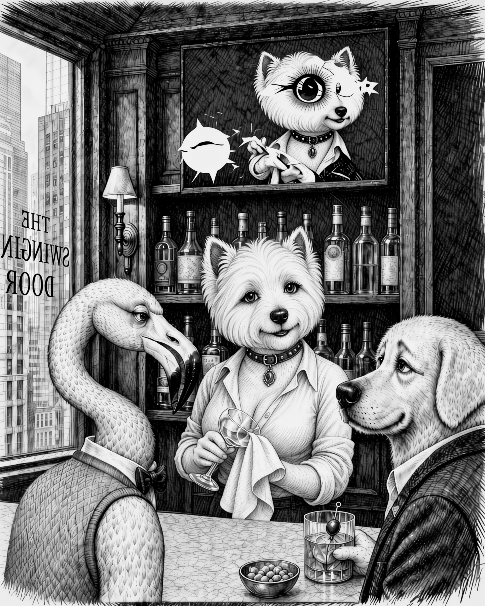

**The ask.** Round 3 of perfecting Abby. The judges called the root cause: rounds 1 and 2 sent a BUST as Picture 1, and qwen-image-edit copies Picture 1's staging, so 6 of 6 came back as portraits on bare paper while the prompt asked for the counter, both hands and the towel. Picture 1 must be a FULL PLATE. Build the eye tile by hand from look-card section 2 and send it as Picture 3 (Step 5, skipped until now); drop canon/vision/studies/abby.png, the source of the level lip line and the animal eye. Fix the jawline, the mouth, the eye, the nose, the ears, the hands and towel, the occlusion and the gaze as EDIT lines. Hold the recipe.

**The thinking.** Picture 1 is now canon/plates/trio.png, the approved BLANK plate, cut to a true 4:5 that ends at the marble; Picture 2 is kit/bust.png sent for the collar hardware and the blouse ONLY, with its face, eyes, mouth and staging explicitly refused in its role line; Picture 3 is the hand-drawn eye chart. canon/vision/studies/abby.png is dropped. Two flags were added to cast-study.py: --keep-duo, which stops the study scaffolding re-pointing canon's staging paragraph at one figure (with a full-plate Picture 1 that paragraph already describes the plate, and re-pointing it is what told the model to throw the room away), and --cast-count 3. Fourteen numbered EDITS carry the judges' fixes; no human noun appears anywhere in the text I control, which is the rule round 2 proved at cfg 1.

**Settings.** local/qwen-image-edit-2511, 4:5 1344x1680, fast Lightning 8 steps, cfg 1, euler/simple, shift 3.0, 3 references (Picture 1 the approved blank plate canon/plates/trio.png cut x60..1140 y20..1370 to a true 4:5; Picture 2 canon/characters/abby/kit/bust.png for the collar hardware and the blouse only; Picture 3 the hand-drawn eye chart abby-eye-tile.png), scripts/cast-study.py --cast-count 3 --keep-duo, seed 33

**Prompt.** [prompts/125-abby-character-study-round-3-seed-33-the-eye-chart-climbs-into-the-slate.prompt.txt](prompts/125-abby-character-study-round-3-seed-33-the-eye-chart-climbs-into-the-slate.prompt.txt)

**Verdict.** REJECT, and the most useful failure of the round. Abby is good: the room, the counter, both hands, the towel, and the eye at 25.7% dark with white at 237 and 234 on a paper of 241. But the EYE CHART sent as Picture 3 has been drawn INTO the blank slate as a cartoon - a westie head with one giant eye and a starburst, exactly the diagram's own motifs. The tile did its job on her face and then leaked onto the wall. Round 4's Picture 3 role line must forbid it appearing as a picture anywhere in the room, and the wiped-slate edit should name the slate as bare of pictures as well as bare of words.

*Logged 13:37.*

---

## 126. Abby character study, round 3, seed 44 - BEST OF THE ROUND

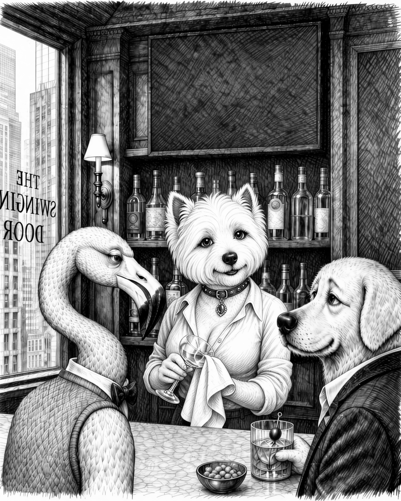

**The ask.** Round 3 of perfecting Abby. The judges called the root cause: rounds 1 and 2 sent a BUST as Picture 1, and qwen-image-edit copies Picture 1's staging, so 6 of 6 came back as portraits on bare paper while the prompt asked for the counter, both hands and the towel. Picture 1 must be a FULL PLATE. Build the eye tile by hand from look-card section 2 and send it as Picture 3 (Step 5, skipped until now); drop canon/vision/studies/abby.png, the source of the level lip line and the animal eye. Fix the jawline, the mouth, the eye, the nose, the ears, the hands and towel, the occlusion and the gaze as EDIT lines. Hold the recipe.

**The thinking.** Picture 1 is now canon/plates/trio.png, the approved BLANK plate, cut to a true 4:5 that ends at the marble; Picture 2 is kit/bust.png sent for the collar hardware and the blouse ONLY, with its face, eyes, mouth and staging explicitly refused in its role line; Picture 3 is the hand-drawn eye chart. canon/vision/studies/abby.png is dropped. Two flags were added to cast-study.py: --keep-duo, which stops the study scaffolding re-pointing canon's staging paragraph at one figure (with a full-plate Picture 1 that paragraph already describes the plate, and re-pointing it is what told the model to throw the room away), and --cast-count 3. Fourteen numbered EDITS carry the judges' fixes; no human noun appears anywhere in the text I control, which is the rule round 2 proved at cfg 1.

**Settings.** local/qwen-image-edit-2511, 4:5 1344x1680, fast Lightning 8 steps, cfg 1, euler/simple, shift 3.0, 3 references (Picture 1 the approved blank plate canon/plates/trio.png cut x60..1140 y20..1370 to a true 4:5; Picture 2 canon/characters/abby/kit/bust.png for the collar hardware and the blouse only; Picture 3 the hand-drawn eye chart abby-eye-tile.png), scripts/cast-study.py --cast-count 3 --keep-duo, seed 44

**Prompt.** [prompts/126-abby-character-study-round-3-seed-44-best-of-the-round.prompt.txt](prompts/126-abby-character-study-round-3-seed-44-best-of-the-round.prompt.txt)

**Verdict.** BEST OF THE SIX, and the first Abby of the whole task that is a scene rather than a portrait. Every construction fix lands together: the room and the back bar behind her, the marble crossing her at the waist and hiding her below it, both hands working - the left closed round the bowl of the stemmed glass, the right pressing the folded towel down inside it - Drew seated frame-left and Barclay frame-right on the near side, her head high in the frame because she stands while they sit. Nothing is lettered anywhere but the mirrored window name: slate blank, every bottle label blank, no receipt, no caption, no signature. The face: the best measured eye of the round at 24.3% below L60 with white at 250 and 250 against a paper of 253 - genuine paper-white at BOTH sides of the iris, a drawn iris ring, a pupil smaller than the iris, one catchlight, lid and lash - the cleanest closed smile of the six with both corners lifted, ears matched in size and height, a flat black nose smaller than the eye opening, and the teardrop gem in its beaded bezel that the wardrobe edit asked for and earlier rounds drew as a heart. THREE FAULTS REMAIN, and they are the same three in all six, so they are language and reference faults rather than seed faults: (1) THE GAZE - she looks out at the reader, which is the founder's oldest complaint about her; the gaze edit loses to Picture 1, where she also looks out. (2) THE JAWLINE - the long show-coat still runs past the jaw down onto the throat instead of stopping dead at it. (3) THE LIP LINE opens a small dark gap right of centre. Round 4 should hold this Picture 1 and this eye tile and repair those three.

*Logged 13:37.*

---

## 127. Abby round 3 - contact sheet, six seeds beside the kit tiles

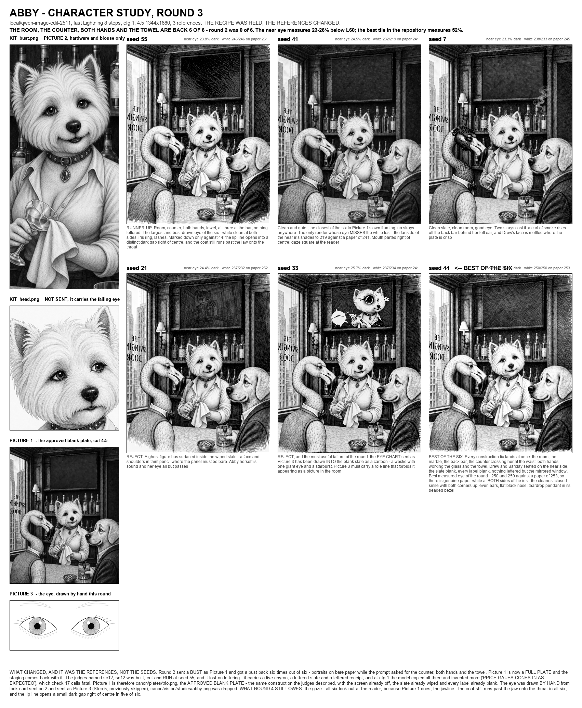

**The ask.** Round 3 of perfecting Abby. The judges called the root cause: rounds 1 and 2 sent a BUST as Picture 1, and qwen-image-edit copies Picture 1's staging, so 6 of 6 came back as portraits on bare paper while the prompt asked for the counter, both hands and the towel. Picture 1 must be a FULL PLATE. Build the eye tile by hand from look-card section 2 and send it as Picture 3 (Step 5, skipped until now); drop canon/vision/studies/abby.png, the source of the level lip line and the animal eye. Fix the jawline, the mouth, the eye, the nose, the ears, the hands and towel, the occlusion and the gaze as EDIT lines. Hold the recipe.

**The thinking.** The six renders at 420 px in seed order, beside kit/bust.png and kit/head.png and beside the two references this round replaced them with - the full-plate Picture 1 and the hand-drawn eye chart. Each panel carries its seed, its measured near-eye numbers and its verdict, so the sheet reads on its own.

**Settings.** scripts/build-abby-round3-sheet.py; numbers from scripts/measure-abby-eye.py

**Prompt.** [prompts/127-abby-round-3-contact-sheet-six-seeds-beside-the-kit-tiles.prompt.txt](prompts/127-abby-round-3-contact-sheet-six-seeds-beside-the-kit-tiles.prompt.txt)

**Verdict.** 6 of 6 bring back the room, the counter, both hands and the towel; round 2 was 0 of 6. The near eye measures 23-26% below L60 across all six against 52.3% for the best tile in the repository, and 4 of 6 also clear the paper-white-at-both-sides test. 2 of 6 are rejects, both for the same new fault - a picture appearing inside the wiped slate. Best of the round: seed 44.

*Logged 13:37.*

---

## 128. Abby round 4 - the new Picture 2: the plates Rick accepted, in place of the kit tiles

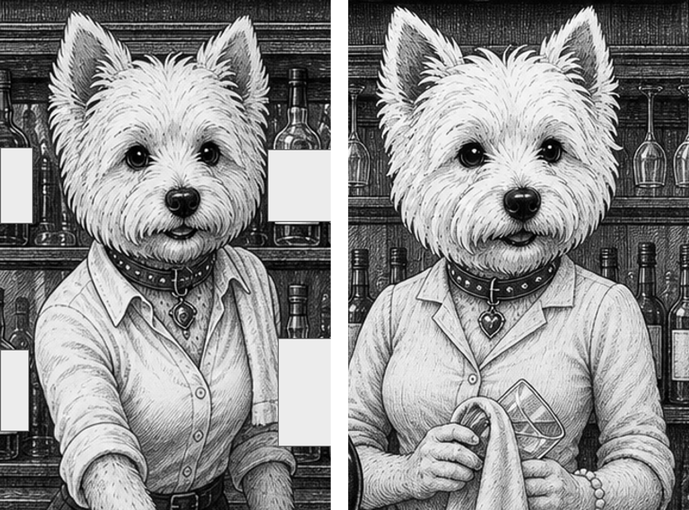

**The ask.** Round 4 of perfecting Abby. The judges called the references the disease, not the seeds: DROP canon/vision/studies/abby.png and canon/characters/abby/kit/bust.png outright - both draw the silky long coat, the wide lynx-tufted ears and the open-blouse cleavage that all six round-3 renders copied, and round 3 was still sending bust.png as Picture 2, which is where the Bichon came from. Replace them with crops of the plates Rick actually accepted, sc04 (470,360,820,900) and sc12 (450,350,830,930). Keep Picture 1 and the eye chart. Then fix, as EDIT lines: the eye pasted from the chart with a paper-white crescent at BOTH corners; the long fur stopping dead at the jaw; the closed-lip smile with no gap; the gaze on Drew and never on the reader; the harsh short double coat at a third the length; the broad flat-topped chrysanthemum head and blunt rectangular bearded muzzle; the small close-set erect triangular ears; the furred neck carrying the collar; the heavy black studded collar with a heart pendant; the buttoned blouse over a modest chest; grey modelling under the jaw; the back bar in wood grain with legible bottles; a clean straight edge on all four sides. And Drew, in the same plate: downy dash-strokes instead of scales, one S-curve with a single reversal, a heavy-lidded human eye. Hold the recipe - cfg 1 is correct - and re-run the same six seeds for a clean A/B.

**The thinking.** The judges were exact about the diagnosis and I agree with it: every Abby tile in the repository draws the wrong dog. bust.png and head.png both carry a long silky coat, big wide-set ears with lynx tufts and a round lapdog skull, and the model copied all of it faithfully for three rounds. The plates Rick ACCEPTED draw the right dog - sc04 and sc12 both give a broad flat-topped skull, small hard triangular ears set close on top, a short blunt rectangular muzzle with a beard fringe hanging below it, a heavy black studded collar and a buttoned blouse. So the tile is built from those two crops at the judges' own boxes. I could not send them as Picture 2 and Picture 4 as ordered, because the bridge caps the qwen family at three references and silently drops the rest off the end of the list - a fourth picture would never have reached the model. Laying both crops into one tile keeps both of them on the wire inside that cap. The four legible bottle labels inside the sc04 crop were blanked to plain paper before sending, because round 3 already paid for the lesson that lettering in a reference comes back as pseudo-text at cfg 1.

**Settings.** PIL, sc04 crop (470,360,820,900) and sc12 crop (450,350,830,930), both scaled to 760px high and laid side by side, 1027x760 greyscale; scripts/make-abby-round4-tiles.py

**Prompt.** [prompts/128-abby-round-4-the-new-picture-2-the-plates-rick-accepted-in-place-of-the-kit-tiles.prompt.txt](prompts/128-abby-round-4-the-new-picture-2-the-plates-rick-accepted-in-place-of-the-kit-tiles.prompt.txt)

**Verdict.** IT WORKED, AND IT IS THE ONE THING THAT DID. The Bichon is gone 6 of 6: every render in the round now carries the broad flat-topped skull, the small close-set triangular ears and the short blunt bearded muzzle of the accepted plates, where round 3 gave a round fluffy lapdog head with wide tufted ears in all six. The diptych did not leak - no render drew two Abbys, a gutter or a framed panel. What the tile did NOT fix, because it carries these faults itself and the EDITS could not out-argue it: the open blouse with a shading line between the breasts (both crops show it), and the fur running past the jaw down the throat (both crops show that too). The heart pendant came through on one seed of six.

*Logged 14:01.*

---

## 129. Abby character study, round 4, seed 55 - the ears finally read as a terrier's

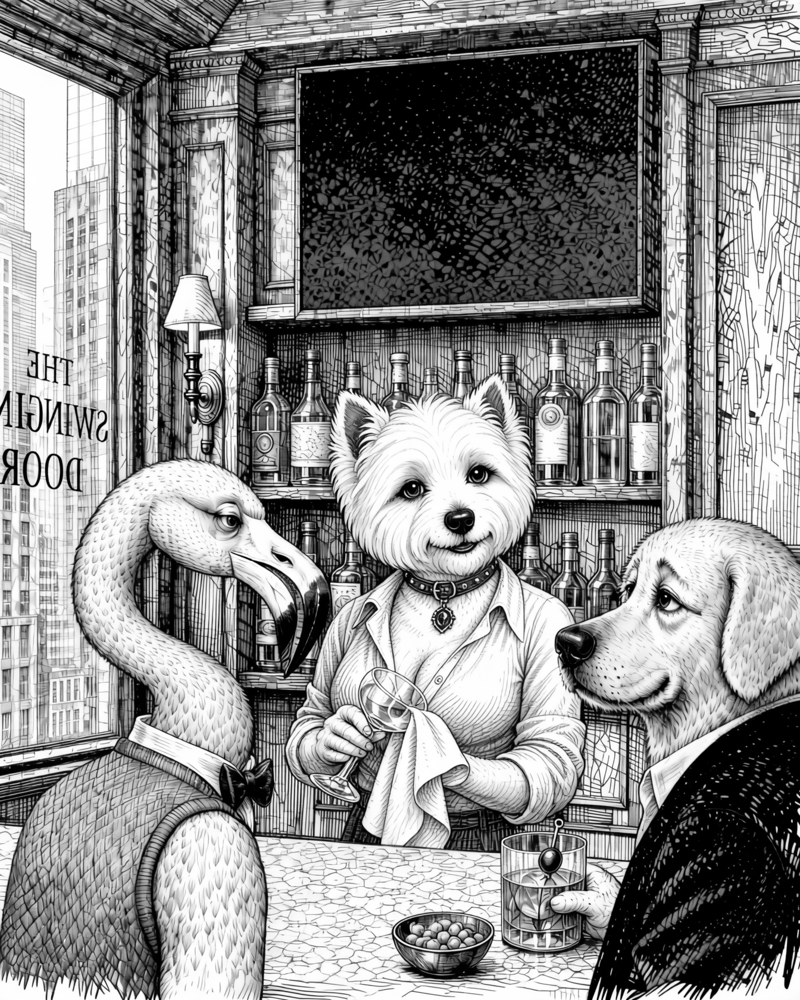

**The ask.** Round 4 of perfecting Abby. The judges called the references the disease, not the seeds: DROP canon/vision/studies/abby.png and canon/characters/abby/kit/bust.png outright - both draw the silky long coat, the wide lynx-tufted ears and the open-blouse cleavage that all six round-3 renders copied, and round 3 was still sending bust.png as Picture 2, which is where the Bichon came from. Replace them with crops of the plates Rick actually accepted, sc04 (470,360,820,900) and sc12 (450,350,830,930). Keep Picture 1 and the eye chart. Then fix, as EDIT lines: the eye pasted from the chart with a paper-white crescent at BOTH corners; the long fur stopping dead at the jaw; the closed-lip smile with no gap; the gaze on Drew and never on the reader; the harsh short double coat at a third the length; the broad flat-topped chrysanthemum head and blunt rectangular bearded muzzle; the small close-set erect triangular ears; the furred neck carrying the collar; the heavy black studded collar with a heart pendant; the buttoned blouse over a modest chest; grey modelling under the jaw; the back bar in wood grain with legible bottles; a clean straight edge on all four sides. And Drew, in the same plate: downy dash-strokes instead of scales, one S-curve with a single reversal, a heavy-lidded human eye. Hold the recipe - cfg 1 is correct - and re-run the same six seeds for a clean A/B.

**The thinking.** THE REFERENCE SWAP IS THE ROUND. bust.png and studies/abby.png are gone; Picture 2 is now the two head-and-shoulders crops of Rick's accepted plates in one tile. ONE FORCED DEVIATION FROM THE ORDER: the judges asked for the sc12 crop as a PICTURE 4, but the qwen family's max_refs is 3 on the bridge (backend/providers/local_bridge.py) and it drops extras off the END of the list, so a Picture 4 would have been binned on the wire and the round would have LOOKED like it tested the sc12 head without ever sending it. Both ordered crops therefore travel side by side in ONE tile, at the judges' own boxes, and both are genuinely on the wire. SECOND DEVIATION: four legible bottle labels inside the sc04 crop (EAGLE EYE VODKA and its neighbours) were blanked to plain paper first - round 3 proved at seed 55 that lettering inside a reference is copied and then elaborated into pseudo-text at cfg 1, which check 17 calls fatal - and canon asks a study's labels to be blank panels anyway. A BUG WAS ALSO FIXED: --cast-count was parsed and written into the sidecar but never reached the prompt, so round 3 told the model 'EXACTLY 1 character' while its Picture 1 was a three-character plate and its own EDITS said to keep Drew and Barclay; the header now says 3. Seed 55 first, as in round 3.

**Settings.** local/qwen-image-edit-2511, 4:5 1344x1680, fast Lightning 8 steps, cfg 1, euler/simple, shift 3.0, 3 references (Picture 1 the approved blank plate canon/plates/trio.png cut x60..1140 y20..1370, unchanged from round 3; Picture 2 NEW - the sc04 and sc12 head-and-shoulders crops of the plates Rick accepted, laid side by side in one tile; Picture 3 the hand-drawn eye chart, kept), scripts/cast-study.py --cast-count 3 --keep-duo with nineteen numbered EDITS, seed 55

**Prompt.** [prompts/129-abby-character-study-round-4-seed-55-the-ears-finally-read-as-a-terrier-s.prompt.txt](prompts/129-abby-character-study-round-4-seed-55-the-ears-finally-read-as-a-terrier-s.prompt.txt)

**Verdict.** RUNNER-UP OF SIX. The cleanest EAR read of the round and the thing the reference swap was for: two small hard-edged triangles carried erect and close-set on top of a broad flat skull, with the topknot between them, where round 3 gave wide-set tufted lapdog ears. The eye is second-best of the round - 24.6% below L60 with white measured at 253 and 253 against a paper of 254, so there is exact paper-white at both sides of the iris - and both pupils sit LEFT, onto Drew, so the founder's oldest complaint about her is finally answered on this seed. Nothing is lettered but the mirrored window; slate blank, every bottle label a blank panel. Marked below seed 44 on two counts: the back bar falls back into coarse dark hatch instead of the wood grain the EDIT asks for, and the bottom-left border breaks into spiked hatch fringe where the EDIT asks for a clean cut. The shared faults of the round are all here too - the lip parts on a gap, the coat runs past the jaw onto the throat, the blouse gapes.

*Logged 14:01.*

---

## 130. Abby character study, round 4, seed 41 - the only clean edge, the truest iris

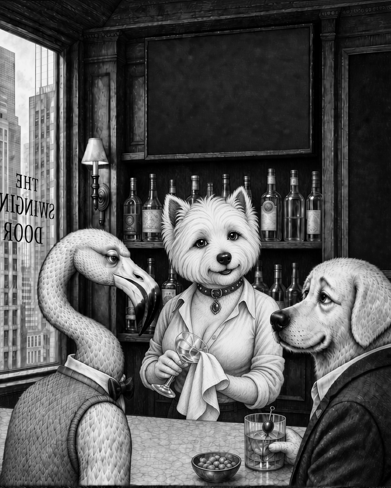

**The ask.** Round 4 of perfecting Abby. The judges called the references the disease, not the seeds: DROP canon/vision/studies/abby.png and canon/characters/abby/kit/bust.png outright - both draw the silky long coat, the wide lynx-tufted ears and the open-blouse cleavage that all six round-3 renders copied, and round 3 was still sending bust.png as Picture 2, which is where the Bichon came from. Replace them with crops of the plates Rick actually accepted, sc04 (470,360,820,900) and sc12 (450,350,830,930). Keep Picture 1 and the eye chart. Then fix, as EDIT lines: the eye pasted from the chart with a paper-white crescent at BOTH corners; the long fur stopping dead at the jaw; the closed-lip smile with no gap; the gaze on Drew and never on the reader; the harsh short double coat at a third the length; the broad flat-topped chrysanthemum head and blunt rectangular bearded muzzle; the small close-set erect triangular ears; the furred neck carrying the collar; the heavy black studded collar with a heart pendant; the buttoned blouse over a modest chest; grey modelling under the jaw; the back bar in wood grain with legible bottles; a clean straight edge on all four sides. And Drew, in the same plate: downy dash-strokes instead of scales, one S-curve with a single reversal, a heavy-lidded human eye. Hold the recipe - cfg 1 is correct - and re-run the same six seeds for a clean A/B.

**The thinking.** THE REFERENCE SWAP IS THE ROUND. bust.png and studies/abby.png are gone; Picture 2 is now the two head-and-shoulders crops of Rick's accepted plates in one tile. ONE FORCED DEVIATION FROM THE ORDER: the judges asked for the sc12 crop as a PICTURE 4, but the qwen family's max_refs is 3 on the bridge (backend/providers/local_bridge.py) and it drops extras off the END of the list, so a Picture 4 would have been binned on the wire and the round would have LOOKED like it tested the sc12 head without ever sending it. Both ordered crops therefore travel side by side in ONE tile, at the judges' own boxes, and both are genuinely on the wire. SECOND DEVIATION: four legible bottle labels inside the sc04 crop (EAGLE EYE VODKA and its neighbours) were blanked to plain paper first - round 3 proved at seed 55 that lettering inside a reference is copied and then elaborated into pseudo-text at cfg 1, which check 17 calls fatal - and canon asks a study's labels to be blank panels anyway. A BUG WAS ALSO FIXED: --cast-count was parsed and written into the sidecar but never reached the prompt, so round 3 told the model 'EXACTLY 1 character' while its Picture 1 was a three-character plate and its own EDITS said to keep Drew and Barclay; the header now says 3. Seed 41 is the recorded house seed.

**Settings.** local/qwen-image-edit-2511, 4:5 1344x1680, fast Lightning 8 steps, cfg 1, euler/simple, shift 3.0, 3 references (Picture 1 the approved blank plate canon/plates/trio.png cut x60..1140 y20..1370, unchanged from round 3; Picture 2 NEW - the sc04 and sc12 head-and-shoulders crops of the plates Rick accepted, laid side by side in one tile; Picture 3 the hand-drawn eye chart, kept), scripts/cast-study.py --cast-count 3 --keep-duo with nineteen numbered EDITS, seed 41

**Prompt.** [prompts/130-abby-character-study-round-4-seed-41-the-only-clean-edge-the-truest-iris.prompt.txt](prompts/130-abby-character-study-round-4-seed-41-the-only-clean-edge-the-truest-iris.prompt.txt)

**Verdict.** THIRD, and it holds the two things no other seed got. THE BORDER: it is the ONLY render of the six that answers the clean-edge EDIT - ink runs to a straight cut on all four sides, no spiked fringe, no washed band, no margin (measured mean edge tone 22 top, 25 bottom, 137 left, 35 right, against 187/229/219 on seed 44). THE IRIS: it is the only render that draws the chart's actual construction - a genuinely MID-GREY iris with a separate black pupil floating inside it - where the other seeds fuse iris and pupil into one dark disc with a grey rim. Its cost is the thinnest white margin of the round, 224 and 226 against a paper of 241, and the most frontal gaze of the six: the pupils sit near centre, so she reads closer to the lens than 55, 21 or 44. Quiet, clean, no strays, nothing lettered.

*Logged 14:01.*

---

## 131. Abby character study, round 4, seed 7 - the hardest coat and a fourth ear

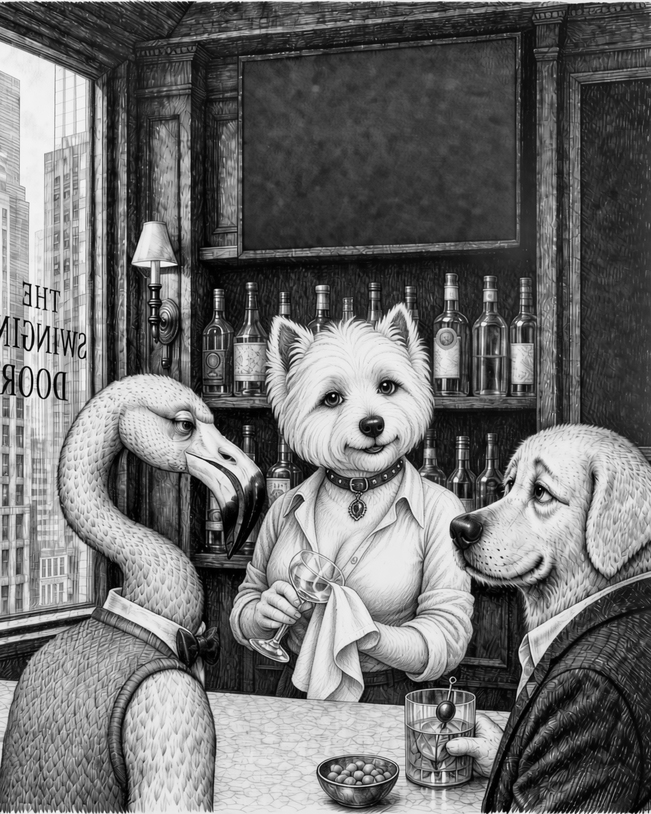

**The ask.** Round 4 of perfecting Abby. The judges called the references the disease, not the seeds: DROP canon/vision/studies/abby.png and canon/characters/abby/kit/bust.png outright - both draw the silky long coat, the wide lynx-tufted ears and the open-blouse cleavage that all six round-3 renders copied, and round 3 was still sending bust.png as Picture 2, which is where the Bichon came from. Replace them with crops of the plates Rick actually accepted, sc04 (470,360,820,900) and sc12 (450,350,830,930). Keep Picture 1 and the eye chart. Then fix, as EDIT lines: the eye pasted from the chart with a paper-white crescent at BOTH corners; the long fur stopping dead at the jaw; the closed-lip smile with no gap; the gaze on Drew and never on the reader; the harsh short double coat at a third the length; the broad flat-topped chrysanthemum head and blunt rectangular bearded muzzle; the small close-set erect triangular ears; the furred neck carrying the collar; the heavy black studded collar with a heart pendant; the buttoned blouse over a modest chest; grey modelling under the jaw; the back bar in wood grain with legible bottles; a clean straight edge on all four sides. And Drew, in the same plate: downy dash-strokes instead of scales, one S-curve with a single reversal, a heavy-lidded human eye. Hold the recipe - cfg 1 is correct - and re-run the same six seeds for a clean A/B.

**The thinking.** THE REFERENCE SWAP IS THE ROUND. bust.png and studies/abby.png are gone; Picture 2 is now the two head-and-shoulders crops of Rick's accepted plates in one tile. ONE FORCED DEVIATION FROM THE ORDER: the judges asked for the sc12 crop as a PICTURE 4, but the qwen family's max_refs is 3 on the bridge (backend/providers/local_bridge.py) and it drops extras off the END of the list, so a Picture 4 would have been binned on the wire and the round would have LOOKED like it tested the sc12 head without ever sending it. Both ordered crops therefore travel side by side in ONE tile, at the judges' own boxes, and both are genuinely on the wire. SECOND DEVIATION: four legible bottle labels inside the sc04 crop (EAGLE EYE VODKA and its neighbours) were blanked to plain paper first - round 3 proved at seed 55 that lettering inside a reference is copied and then elaborated into pseudo-text at cfg 1, which check 17 calls fatal - and canon asks a study's labels to be blank panels anyway. A BUG WAS ALSO FIXED: --cast-count was parsed and written into the sidecar but never reached the prompt, so round 3 told the model 'EXACTLY 1 character' while its Picture 1 was a three-character plate and its own EDITS said to keep Drew and Barclay; the header now says 3.

**Settings.** local/qwen-image-edit-2511, 4:5 1344x1680, fast Lightning 8 steps, cfg 1, euler/simple, shift 3.0, 3 references (Picture 1 the approved blank plate canon/plates/trio.png cut x60..1140 y20..1370, unchanged from round 3; Picture 2 NEW - the sc04 and sc12 head-and-shoulders crops of the plates Rick accepted, laid side by side in one tile; Picture 3 the hand-drawn eye chart, kept), scripts/cast-study.py --cast-count 3 --keep-duo with nineteen numbered EDITS, seed 7

**Prompt.** [prompts/131-abby-character-study-round-4-seed-7-the-hardest-coat-and-a-fourth-ear.prompt.txt](prompts/131-abby-character-study-round-4-seed-7-the-hardest-coat-and-a-fourth-ear.prompt.txt)

**Verdict.** FOURTH. It draws the SHORTEST, HARDEST coat of the six and is the closest any render came to the harsh double coat the EDIT asks for - short straight strokes with tonal breaks, rather than the long silky sweep the other seeds kept. The eye is clean at 22.6% dark with white at 231 and 226 on a paper of 241. Two faults hold it down. FOUR EAR FORMS: extra ear-shaped tufts of fur stand outside both real ears, so the head reads with four pricked shapes instead of two. And the lip line opens on a visible tooth right of centre, where the EDIT says the lips touch along their whole length.

*Logged 14:01.*

---

## 132. Abby character study, round 4, seed 21 - the only heart pendant of the round

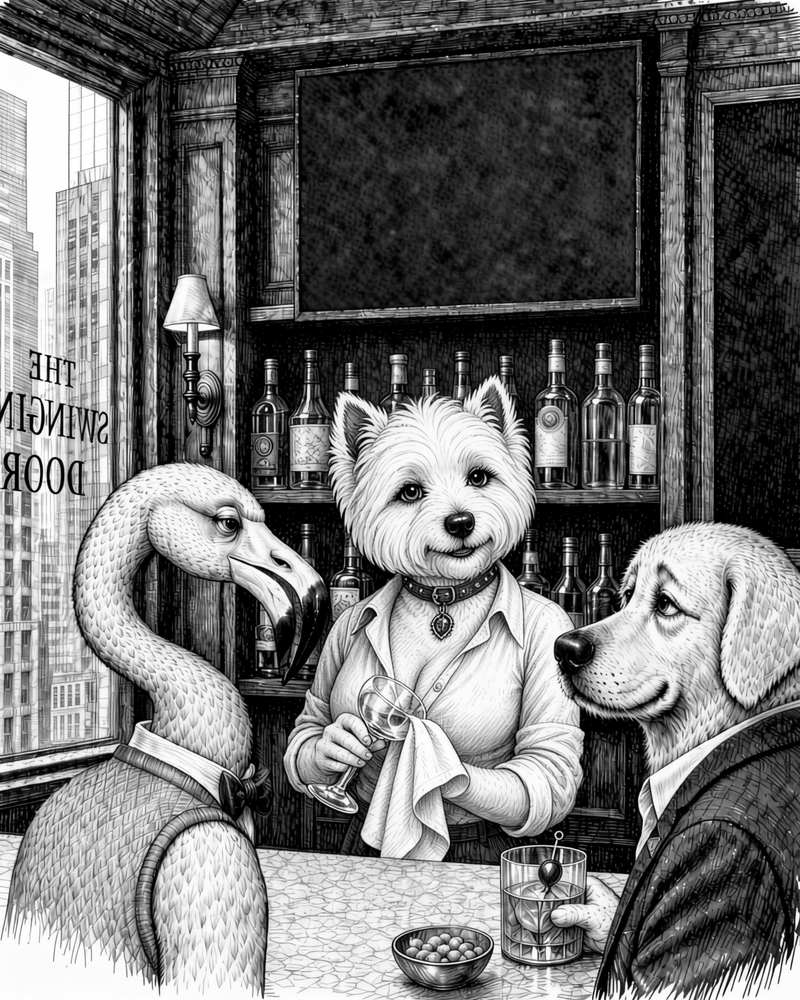

**The ask.** Round 4 of perfecting Abby. The judges called the references the disease, not the seeds: DROP canon/vision/studies/abby.png and canon/characters/abby/kit/bust.png outright - both draw the silky long coat, the wide lynx-tufted ears and the open-blouse cleavage that all six round-3 renders copied, and round 3 was still sending bust.png as Picture 2, which is where the Bichon came from. Replace them with crops of the plates Rick actually accepted, sc04 (470,360,820,900) and sc12 (450,350,830,930). Keep Picture 1 and the eye chart. Then fix, as EDIT lines: the eye pasted from the chart with a paper-white crescent at BOTH corners; the long fur stopping dead at the jaw; the closed-lip smile with no gap; the gaze on Drew and never on the reader; the harsh short double coat at a third the length; the broad flat-topped chrysanthemum head and blunt rectangular bearded muzzle; the small close-set erect triangular ears; the furred neck carrying the collar; the heavy black studded collar with a heart pendant; the buttoned blouse over a modest chest; grey modelling under the jaw; the back bar in wood grain with legible bottles; a clean straight edge on all four sides. And Drew, in the same plate: downy dash-strokes instead of scales, one S-curve with a single reversal, a heavy-lidded human eye. Hold the recipe - cfg 1 is correct - and re-run the same six seeds for a clean A/B.

**The thinking.** THE REFERENCE SWAP IS THE ROUND. bust.png and studies/abby.png are gone; Picture 2 is now the two head-and-shoulders crops of Rick's accepted plates in one tile. ONE FORCED DEVIATION FROM THE ORDER: the judges asked for the sc12 crop as a PICTURE 4, but the qwen family's max_refs is 3 on the bridge (backend/providers/local_bridge.py) and it drops extras off the END of the list, so a Picture 4 would have been binned on the wire and the round would have LOOKED like it tested the sc12 head without ever sending it. Both ordered crops therefore travel side by side in ONE tile, at the judges' own boxes, and both are genuinely on the wire. SECOND DEVIATION: four legible bottle labels inside the sc04 crop (EAGLE EYE VODKA and its neighbours) were blanked to plain paper first - round 3 proved at seed 55 that lettering inside a reference is copied and then elaborated into pseudo-text at cfg 1, which check 17 calls fatal - and canon asks a study's labels to be blank panels anyway. A BUG WAS ALSO FIXED: --cast-count was parsed and written into the sidecar but never reached the prompt, so round 3 told the model 'EXACTLY 1 character' while its Picture 1 was a three-character plate and its own EDITS said to keep Drew and Barclay; the header now says 3.

**Settings.** local/qwen-image-edit-2511, 4:5 1344x1680, fast Lightning 8 steps, cfg 1, euler/simple, shift 3.0, 3 references (Picture 1 the approved blank plate canon/plates/trio.png cut x60..1140 y20..1370, unchanged from round 3; Picture 2 NEW - the sc04 and sc12 head-and-shoulders crops of the plates Rick accepted, laid side by side in one tile; Picture 3 the hand-drawn eye chart, kept), scripts/cast-study.py --cast-count 3 --keep-duo with nineteen numbered EDITS, seed 21

**Prompt.** [prompts/132-abby-character-study-round-4-seed-21-the-only-heart-pendant-of-the-round.prompt.txt](prompts/132-abby-character-study-round-4-seed-21-the-only-heart-pendant-of-the-round.prompt.txt)

**Verdict.** FIFTH, and it carries one finding worth keeping: it is the ONLY seed of the six that drew the HEART pendant the judges asked for. Every other seed fell back to the old oval gem, which is canon's own fence wording ('a teardrop gem pendant') winning over the EDIT - so the heart IS reachable at this recipe and the fence is what is fighting it. Otherwise: gaze plainly left onto Drew, the best grey modelling under the jaw and along the far shoulder of the round, a good eye at 24.7% dark with white at 243 and 245 on a paper of 254. Faults: the same four-ear-form artifact as seed 7, and the bottom edge washes out into a pale band instead of cutting square.

*Logged 14:01.*

---

## 133. Abby character study, round 4, seed 33 - REJECT, the slate fills with pseudo-text

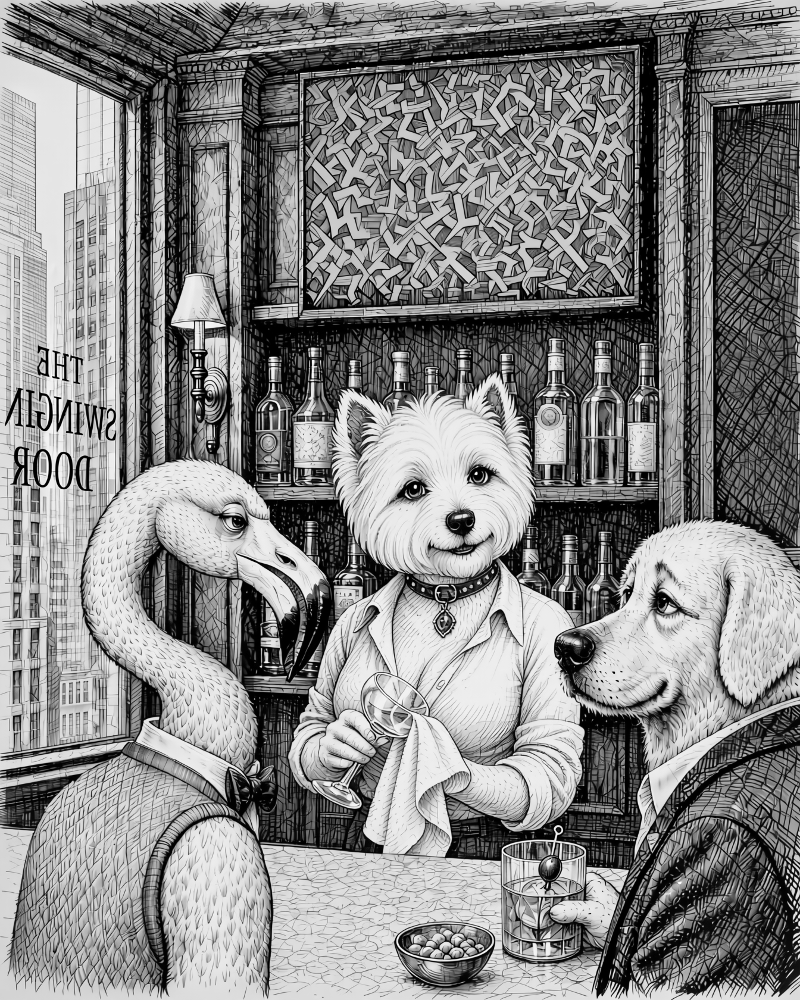

**The ask.** Round 4 of perfecting Abby. The judges called the references the disease, not the seeds: DROP canon/vision/studies/abby.png and canon/characters/abby/kit/bust.png outright - both draw the silky long coat, the wide lynx-tufted ears and the open-blouse cleavage that all six round-3 renders copied, and round 3 was still sending bust.png as Picture 2, which is where the Bichon came from. Replace them with crops of the plates Rick actually accepted, sc04 (470,360,820,900) and sc12 (450,350,830,930). Keep Picture 1 and the eye chart. Then fix, as EDIT lines: the eye pasted from the chart with a paper-white crescent at BOTH corners; the long fur stopping dead at the jaw; the closed-lip smile with no gap; the gaze on Drew and never on the reader; the harsh short double coat at a third the length; the broad flat-topped chrysanthemum head and blunt rectangular bearded muzzle; the small close-set erect triangular ears; the furred neck carrying the collar; the heavy black studded collar with a heart pendant; the buttoned blouse over a modest chest; grey modelling under the jaw; the back bar in wood grain with legible bottles; a clean straight edge on all four sides. And Drew, in the same plate: downy dash-strokes instead of scales, one S-curve with a single reversal, a heavy-lidded human eye. Hold the recipe - cfg 1 is correct - and re-run the same six seeds for a clean A/B.

**The thinking.** THE REFERENCE SWAP IS THE ROUND. bust.png and studies/abby.png are gone; Picture 2 is now the two head-and-shoulders crops of Rick's accepted plates in one tile. ONE FORCED DEVIATION FROM THE ORDER: the judges asked for the sc12 crop as a PICTURE 4, but the qwen family's max_refs is 3 on the bridge (backend/providers/local_bridge.py) and it drops extras off the END of the list, so a Picture 4 would have been binned on the wire and the round would have LOOKED like it tested the sc12 head without ever sending it. Both ordered crops therefore travel side by side in ONE tile, at the judges' own boxes, and both are genuinely on the wire. SECOND DEVIATION: four legible bottle labels inside the sc04 crop (EAGLE EYE VODKA and its neighbours) were blanked to plain paper first - round 3 proved at seed 55 that lettering inside a reference is copied and then elaborated into pseudo-text at cfg 1, which check 17 calls fatal - and canon asks a study's labels to be blank panels anyway. A BUG WAS ALSO FIXED: --cast-count was parsed and written into the sidecar but never reached the prompt, so round 3 told the model 'EXACTLY 1 character' while its Picture 1 was a three-character plate and its own EDITS said to keep Drew and Barclay; the header now says 3.

**Settings.** local/qwen-image-edit-2511, 4:5 1344x1680, fast Lightning 8 steps, cfg 1, euler/simple, shift 3.0, 3 references (Picture 1 the approved blank plate canon/plates/trio.png cut x60..1140 y20..1370, unchanged from round 3; Picture 2 NEW - the sc04 and sc12 head-and-shoulders crops of the plates Rick accepted, laid side by side in one tile; Picture 3 the hand-drawn eye chart, kept), scripts/cast-study.py --cast-count 3 --keep-duo with nineteen numbered EDITS, seed 33

**Prompt.** [prompts/133-abby-character-study-round-4-seed-33-reject-the-slate-fills-with-pseudo-text.prompt.txt](prompts/133-abby-character-study-round-4-seed-33-reject-the-slate-fills-with-pseudo-text.prompt.txt)

**Verdict.** REJECT, AND FATAL. The wiped slate has filled with a dense mass of letter-like glyphs - pseudo-text, which INSPECTION.md check 17 calls fatal on sight. This is the SAME seed that drew the eye chart into the slate in round 3, so seed 33 has a standing habit of filling that one panel: the hardened Picture 3 role line stopped the chart getting in but did not stop the scribble. It is also the only eye of the six to fail the white test, 187 on the far side of the iris against a paper of 238, and the only render whose near eye is the FAR one - her head has turned the wrong way. Recommendation: drop seed 33 from Abby's rotation; it has now failed the same check twice for the same reason.

*Logged 14:01.*

---

## 134. Abby character study, round 4, seed 44 - BEST OF THE ROUND

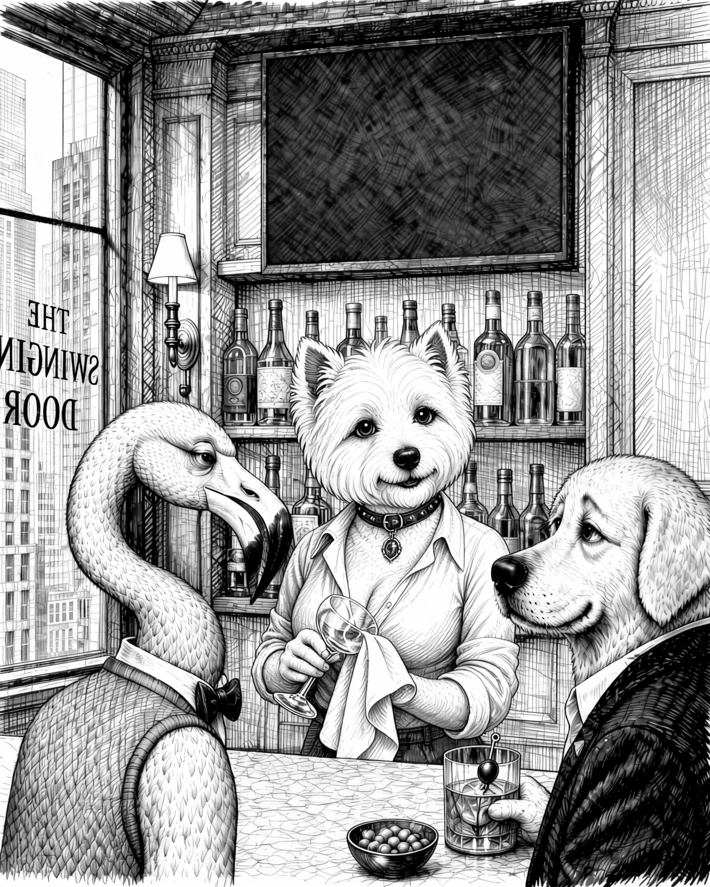

**The ask.** Round 4 of perfecting Abby. The judges called the references the disease, not the seeds: DROP canon/vision/studies/abby.png and canon/characters/abby/kit/bust.png outright - both draw the silky long coat, the wide lynx-tufted ears and the open-blouse cleavage that all six round-3 renders copied, and round 3 was still sending bust.png as Picture 2, which is where the Bichon came from. Replace them with crops of the plates Rick actually accepted, sc04 (470,360,820,900) and sc12 (450,350,830,930). Keep Picture 1 and the eye chart. Then fix, as EDIT lines: the eye pasted from the chart with a paper-white crescent at BOTH corners; the long fur stopping dead at the jaw; the closed-lip smile with no gap; the gaze on Drew and never on the reader; the harsh short double coat at a third the length; the broad flat-topped chrysanthemum head and blunt rectangular bearded muzzle; the small close-set erect triangular ears; the furred neck carrying the collar; the heavy black studded collar with a heart pendant; the buttoned blouse over a modest chest; grey modelling under the jaw; the back bar in wood grain with legible bottles; a clean straight edge on all four sides. And Drew, in the same plate: downy dash-strokes instead of scales, one S-curve with a single reversal, a heavy-lidded human eye. Hold the recipe - cfg 1 is correct - and re-run the same six seeds for a clean A/B.

**The thinking.** THE REFERENCE SWAP IS THE ROUND. bust.png and studies/abby.png are gone; Picture 2 is now the two head-and-shoulders crops of Rick's accepted plates in one tile. ONE FORCED DEVIATION FROM THE ORDER: the judges asked for the sc12 crop as a PICTURE 4, but the qwen family's max_refs is 3 on the bridge (backend/providers/local_bridge.py) and it drops extras off the END of the list, so a Picture 4 would have been binned on the wire and the round would have LOOKED like it tested the sc12 head without ever sending it. Both ordered crops therefore travel side by side in ONE tile, at the judges' own boxes, and both are genuinely on the wire. SECOND DEVIATION: four legible bottle labels inside the sc04 crop (EAGLE EYE VODKA and its neighbours) were blanked to plain paper first - round 3 proved at seed 55 that lettering inside a reference is copied and then elaborated into pseudo-text at cfg 1, which check 17 calls fatal - and canon asks a study's labels to be blank panels anyway. A BUG WAS ALSO FIXED: --cast-count was parsed and written into the sidecar but never reached the prompt, so round 3 told the model 'EXACTLY 1 character' while its Picture 1 was a three-character plate and its own EDITS said to keep Drew and Barclay; the header now says 3.

**Settings.** local/qwen-image-edit-2511, 4:5 1344x1680, fast Lightning 8 steps, cfg 1, euler/simple, shift 3.0, 3 references (Picture 1 the approved blank plate canon/plates/trio.png cut x60..1140 y20..1370, unchanged from round 3; Picture 2 NEW - the sc04 and sc12 head-and-shoulders crops of the plates Rick accepted, laid side by side in one tile; Picture 3 the hand-drawn eye chart, kept), scripts/cast-study.py --cast-count 3 --keep-duo with nineteen numbered EDITS, seed 44

**Prompt.** [prompts/134-abby-character-study-round-4-seed-44-best-of-the-round.prompt.txt](prompts/134-abby-character-study-round-4-seed-44-best-of-the-round.prompt.txt)

**Verdict.** BEST OF THE SIX, and the best Abby of the whole task so far. THE EYE IS THE BEST MEASURED OF ANY ROUND: 22.0% of the opening below L60, with the white on each side of the iris measured at 254 and 254 against a paper of 254 - both sclera crescents are EXACT paper white, clearly separated at the inner corner and the outer corner, which is precisely what the judges asked for and what no tile in the repository contains. THE GAZE IS OFF THE LENS: both pupils sit left, onto Drew, both eyes are on the page and the far eye is about four fifths the near one's width, so the head turn reads without losing an eye. THE BREED IS RIGHT: broad flat-topped skull wider than it is tall, two small close-set erect triangular ears and nothing extra, a short blunt muzzle with its beard fringe, a heavy black studded collar sitting up on the neck. THE ROOM IS RIGHT: back bar in readable wood grain with legible bottle silhouettes and clear glass, the counter crossing her at the waist, both hands working the glass and the towel, Drew and Barclay seated on the near side, the slate blank, every label a blank panel with no letterform anywhere. FOUR FAULTS REMAIN, and they are shared by every seed, so they are language and canon faults rather than seed faults: (1) the lip line still opens a dark gap; (2) the long coat still runs past the jaw down the throat and into the blouse; (3) the blouse still gapes with a shading line between the breasts; (4) the pendant is an oval, not the heart. The bottom-left border also frays into hatch fringe, which only seed 41 avoided.

*Logged 14:01.*

---

## 135. Abby round 4 - the contact sheet, six seeds against the tiles that were dropped

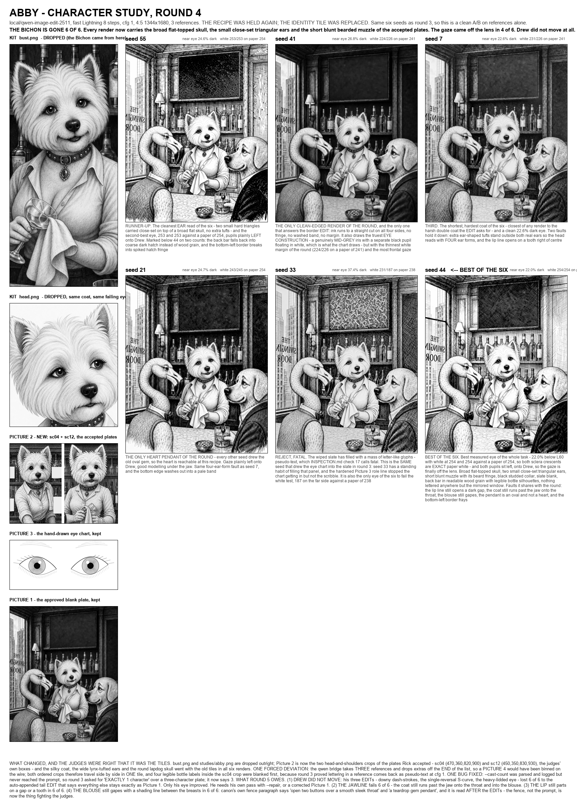

**The ask.** Round 4 of perfecting Abby. The judges called the references the disease, not the seeds: DROP canon/vision/studies/abby.png and canon/characters/abby/kit/bust.png outright - both draw the silky long coat, the wide lynx-tufted ears and the open-blouse cleavage that all six round-3 renders copied, and round 3 was still sending bust.png as Picture 2, which is where the Bichon came from. Replace them with crops of the plates Rick actually accepted, sc04 (470,360,820,900) and sc12 (450,350,830,930). Keep Picture 1 and the eye chart. Then fix, as EDIT lines: the eye pasted from the chart with a paper-white crescent at BOTH corners; the long fur stopping dead at the jaw; the closed-lip smile with no gap; the gaze on Drew and never on the reader; the harsh short double coat at a third the length; the broad flat-topped chrysanthemum head and blunt rectangular bearded muzzle; the small close-set erect triangular ears; the furred neck carrying the collar; the heavy black studded collar with a heart pendant; the buttoned blouse over a modest chest; grey modelling under the jaw; the back bar in wood grain with legible bottles; a clean straight edge on all four sides. And Drew, in the same plate: downy dash-strokes instead of scales, one S-curve with a single reversal, a heavy-lidded human eye. Hold the recipe - cfg 1 is correct - and re-run the same six seeds for a clean A/B.

**The thinking.** THE REFERENCE SWAP IS THE ROUND. bust.png and studies/abby.png are gone; Picture 2 is now the two head-and-shoulders crops of Rick's accepted plates in one tile. ONE FORCED DEVIATION FROM THE ORDER: the judges asked for the sc12 crop as a PICTURE 4, but the qwen family's max_refs is 3 on the bridge (backend/providers/local_bridge.py) and it drops extras off the END of the list, so a Picture 4 would have been binned on the wire and the round would have LOOKED like it tested the sc12 head without ever sending it. Both ordered crops therefore travel side by side in ONE tile, at the judges' own boxes, and both are genuinely on the wire. SECOND DEVIATION: four legible bottle labels inside the sc04 crop (EAGLE EYE VODKA and its neighbours) were blanked to plain paper first - round 3 proved at seed 55 that lettering inside a reference is copied and then elaborated into pseudo-text at cfg 1, which check 17 calls fatal - and canon asks a study's labels to be blank panels anyway. A BUG WAS ALSO FIXED: --cast-count was parsed and written into the sidecar but never reached the prompt, so round 3 told the model 'EXACTLY 1 character' while its Picture 1 was a three-character plate and its own EDITS said to keep Drew and Barclay; the header now says 3. The sheet puts the six renders beside the two kit tiles this round dropped and the three references that were actually sent, so the swap can be judged by eye in one look: the old tiles draw a silky long-coated lapdog with wide tufted ears, the accepted plates draw a hard-coated terrier with small ears set close on top, and the renders now follow the second. Every panel carries its measured near-eye numbers from scripts/measure-abby-eye.py, so the eye is judged by number as the judges asked and not by impression.

**Settings.** PIL, 1702x2372 greyscale; scripts/build-abby-round4-sheet.py

**Prompt.** [prompts/135-abby-round-4-the-contact-sheet-six-seeds-against-the-tiles-that-were-dropped.prompt.txt](prompts/135-abby-round-4-the-contact-sheet-six-seeds-against-the-tiles-that-were-dropped.prompt.txt)

**Verdict.** THE ROUND IN ONE PICTURE. WON: the breed. The Bichon is gone 6 of 6 - flat-topped skull, small close-set triangular ears, blunt bearded muzzle in every render, against 0 of 6 in round 3. WON: the eye, by number - the near eye measures 22.0-26.8% below L60 across the five good seeds, and seed 44 puts exact paper white (254/254 on a paper of 254) at both sides of the iris. WON: the gaze, in 4 of 6 - the pupils sit left onto Drew where all six of round 3 stared at the reader. WON: the back bar, now wood grain with legible bottles in 4 of 6. LOST: the jawline, 6 of 6 - the coat still crosses onto the throat. LOST: the closed lip, 6 of 6. LOST: the modest blouse, 6 of 6. LOST: all three of Drew's fixes, 6 of 6 - his neck is still drawn in overlapping scales, still one unbroken C-hook, and only his EYE improved, which is the one Drew fix that landed. The reason is visible in the prompt: the auto-appended tail EDIT tells the model that everything other than the studied character stays exactly as Picture 1, and Picture 1 draws the scaled neck. Drew needs his own pass, or a corrected Picture 1. And three of the four remaining Abby faults are canon's own fence wording ('open two buttons over a smooth sleek throat', 'a teardrop gem pendant', 'a round soft fluffy westie head') being read AFTER the EDITS that contradict it - the fence, not the prompt, is now the thing fighting the judges.

*Logged 14:01.*

---

## 136. DREW, perfected as a standalone study with the house recipe: a flamingo - round 4, seed 62, the best of 24 judged renders

**The ask.** its a flamingo you did a terrible job you must perfect each character

**The thinking.** The swans came from rendering the cast with the room's model from crude block-ins. The plates Rick approved were drawn by the house edit model with each character's official portrait as the picture to copy identically, through the studio's own prompt builder - so that recipe was rebuilt as scripts/cast-study.py and Drew was rendered as a standalone study, six seeds a round, judged every round by a checklist judge and an adversarial eye against the bible and the set Rick accepted. By round four he is a flamingo: the S-neck with one reversal, the heavy bill bending down to its black outer third, the heavy-lidded human eye, plumage in fine strokes, the knit vest with ribbed armholes, collar and bow tie, the martini. The judges still want the bill's highlight ribbon, a sharper flamingo bend two-thirds along, one contour arc above the eye and a touch more white in the eye's corners.

**Settings.** local/qwen-image-edit-2511, 1344x1680 (4:5), fast 8-step cfg 1; Picture 1 = Drew's crop of canon/plates/duo.png, Picture 2 = canon/vision/studies/drew.png; LOCAL fence + numbered EDITS

**Verdict.** shown to the founder; judges: close, four fixes left

*Logged 14:08.*

---

## 137. BARCLAY, standalone study, round 4 seed 73: a golden retriever drawn like one

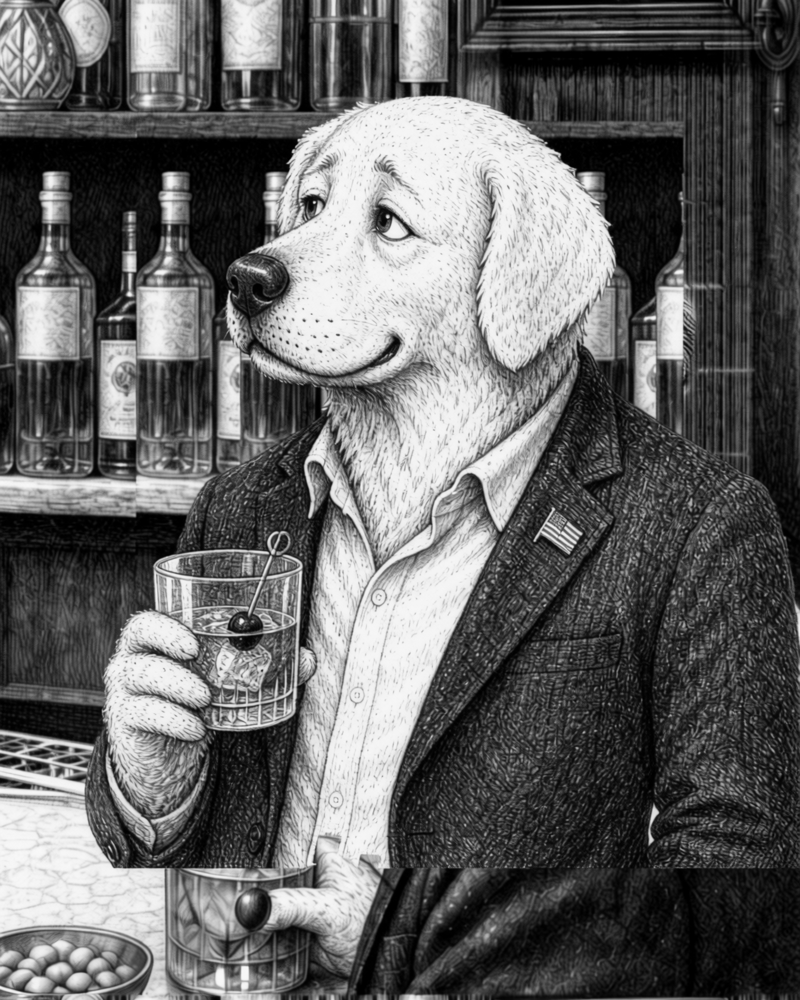

**The ask.** you must perfect each character

**The thinking.** Layered fur in fine strokes, one drop ear, the black nose and freckled muzzle, warm earnest eyes, the dark jacket over the open pale collar with the flag pin, the old fashioned in a fur-backed hand. Judges still want the true black lip-line two nose-widths long, denser freckles, and the ear's ragged edge; the render also repeats the glass at the bottom edge and is cropped chest-up for use.

**Settings.** same recipe; Picture 1 = Barclay's crop of duo.png, Picture 2 = studies/barclay.png

**Verdict.** shown to the founder; judges: three fixes left

*Logged 14:08.*

---

## 138. ABBY, standalone study, round 4 seed 41: the West Highland terrier proprietor behind the bar

**The ask.** you must perfect each character

**The thinking.** The round soft westie head with the big black nose close under the eyes, the studded collar with its gem, the open blouse and the towel, glass in hand, both gentlemen at the bar with her. Judges still want her eyes rebuilt (white showing at both corners, a grey iris with a smaller pupil and one catchlight) and the show-coat strokes stopped at the jaw.

**Settings.** same recipe; Picture 1 = Abby's crop of trio.png, Picture 2 = studies/abby.png

**Verdict.** shown to the founder; judges: two fixes left

*Logged 14:08.*

---

