# The Swinging Door - studio report, 2026-09-08

Built for Rick. Every image the studio generated today, in the order it happened, with the ask that drove it, the thinking behind the decision, the exact prompt and settings, and the verdict. Images are in `images/`, prompts in `prompts/`.

## 001. whole-plate assembled with bartenders-marble-ledge back-bar-lower-shelf back-bar-upper-shelf back-bar-carcass television-blank chalkboard-blank window-frame-and-reveal window-glass-street-view main-bar-marble-counter left-leather-club-chair right-leather-club-chair and window-sign

**The thinking.** Base plus every approved, enabled part laid in order through its own silhouette; the TV's blank screen and the window's lettering are drawn in code last, because lettering is never left to the model.

*Logged 09:42.*

---

## 002. Monday: the founder's four decisions and the day's two teams - Drew into the scene (team Drew), the inlaid back bar (design round)

**The ask.** 1 b and c are actually from a we need to get that character into our scene today ... 2 its barclay ... 3 we need a inlaid shelf that has 2 rows of bottle and then an area to make drinks below it ... 4 get them all in the scene first ... build a team for each character

**The thinking.** Drew is the official portrait; the study script's rebuilt house recipe (edit model, portrait as the tile) becomes a placement script that edits a crop of the real room - Picture 1 - and keys the character out by what changed, so he becomes a layer like every other object. Team Drew: an Opus placer, rounds of six seeds, a Sonnet checklist judge and an Opus eye against the portrait and the staging the founder scored highest, up to five rounds; Barclay's and Abby's teams follow once Drew is verified. In parallel two Opus designers draw the inlaid back bar - set into the wall, two bottle rows, the drinks ledge beneath, its own interior, the wall untouched - for critics before any GPU. The chairs are back in the plate for the scene.

**Settings.** workflows drew-in-the-scene, inlaid-back-bar; chairs ON; Barclay's name provisional

**Verdict.** in progress

*Logged 09:44.*

---

## 003. Drew placed in the left chair, seed 41 - first cast-place round

**The ask.** Get Drew into the approved room-kit v2 plate: build scripts/cast-place.py, test with Drew seed 41, and measure how clean the difference key is.

**The thinking.** cast-place.py crops plate.png 4:5 around the left chair (20,700-660,1500), upscales to 1344x1680 as Picture 1, sends studies/drew.png as Picture 2 ('copy THIS bird identically'), and asks for two edits only: ADD DREW seated in the left chair seen from behind and a little to his left, turned toward Barclay's chair; and keep everything else exactly as Picture 1 (stated FIRST, --keep-first). The result is tone-matched, aligned and difference-keyed against the crop, and the blob in the chair becomes an RGBA sticker laid on the approved plate. MEASUREMENT: the key is dirty and it cannot be otherwise - local_bridge.py _graph_qwen samples an EmptySD3LatentImage at denoise 1.0, so every pixel comes back drawn from noise. 80 percent of the crop differs from the plate by more than 12 levels after tone matching and alignment; it stays at 71-74 percent blurred at sigma 12, and local normalised cross-correlation between render and plate has a MEDIAN of 0.02, so the room is genuinely re-inked, not jittered. Raising the key threshold does not find the bird either - his white plumage sits on light marble, so the marble veins outrank him. What works is the geometry guard: the sticker may not leave the pose envelope from poses.json (140,770-620,1340), so the window, the far marble, the bar front and the right-hand chair are always the plate's own pixels. Drew reads correctly: three-quarter head, bill and eye toward the right chair, bow tie, sweater vest, feathered hand on the marble, martini.

**Settings.** local/qwen-image-edit-2511, fast Lightning 8-step cfg 1, 4:5 1344x1680, seed 41, 2 references (plate crop + studies/drew.png), key thresh 18 blur 1.5 close 4 open 3 feather 2, roi 140,770,620,1340

**Prompt.** [prompts/003-drew-placed-in-the-left-chair-seed-41-first-cast-place-round.prompt.txt](prompts/003-drew-placed-in-the-left-chair-seed-41-first-cast-place-round.prompt.txt)

**Verdict.** USABLE as round 1 and the method is proved: Drew is in the approved chair at the right scale in the right room. Not final - he sits a little high and left of the seat centre, the chair's studded roll does not cross his lower back (he reads as floating just in front of the chair), and the sticker carries a patch of the model's own marble under his hands whose white does not quite match the plate's. Cleanliness 0.796 outside the sticker: that number is the model re-inking the room, not a prompt fault, and the sticker route is what makes it harmless.

*Logged 10:29.*

---

## 004. the inlaid back bar, design round: the flush inlay (two bottle rows in a recess cut into the wall, its own boarded lining) chosen over a cabinet that read as a box; two fixes before any render

**The ask.** we need a inlaid shelf that has 2 rows of bottle and then an area to make drinks below it on the bartenders bar make sure it looks inlaid into the wall dont messup the walls look or carry the walls look into the shelf

**The thinking.** Two Opus designers, two critics each. The flush inlay cuts the opening into the panelling with one slim flat band in the wall plane, lines the recess with plain vertical walnut boards in a calmer darker tone than the wall, and stands two rows of bottles on 3 cm shelves inside it, the marble ledge running under as the drinks area; the cabinet variant carried a proud cornice and lid and read as a box hung on the wall. The critics' one serious objection to the inlay was a flat grey splashback painted over the finished panelling between the recess and the ledge - exactly the wall the founder said not to touch - plus black joint lines that would read as wires across the bottles. Those two fixes are being applied before the first render.

**Settings.** workflows inlaid-back-bar (I1-flush, I2-cabinet, two critics each) and inlaid-i1-fixes; bottle parts back ON in the copy

**Verdict.** I1 chosen; render after the fixes

*Logged 10:56.*

---

## 005. back-bar-carcass and back-bar-lower-shelf and bottles-on-lower-shelf and bottles-on-upper-shelf and back-bar-upper-shelf render seed 7 laid in full plate

**The thinking.** Rendered in context - the plate as it stands behind this part, with only this part's own silhouette blocked in as values - so the pen, light and perspective are inherited; only the mask is laid back. Part note: the back bar's INLAID RECESS: a wide rectangular opening CUT INTO the panelled walnut wall above the marble ledge, its face frame ONE slim FLAT walnut band lying FLUSH with the panelling - no architrave, no bolection, no bead, nothing standing proud of the wall, just a plain flat band with a fine dark joint line where it meets the panelling - and the inside of the cut LINED WITH PLAIN VERTICAL WALNUT BOARDS, quiet, close-grained, a little darker and calmer than the wall, with NO raised-and-fielded panels, NO mouldings and NO frame inside the frame; a deep dark soffit across its head, the left reveal returning back into the wall in shadow, a bright arris down the right-hand edge of the opening, and BENEATH THE FRAME THE WALL'S OWN PANELLING RUNNING ON UNTOUCHED down to the marble ledge - the unit stops dead at its own bottom rail, there is no splashback and no panel of its own below it. This is JOINERY AND A HOLE IN A WALL - it is NEVER a picture, a painting, a mirror, a window, a doorway, a poster, a screen, a television or an empty dark panel AND the lower shelf inside the inlaid recess: a plain 3 cm walnut board running the full width of the opening from reveal to reveal, and it IS THE FLOOR OF THE RECESS - nothing shows beneath it. Seen from a little above, so its polished top catches the daylight and a dark square front edge runs under it - wood, not marble, not stone, and no bracket, no moulding, no nosing AND the row of liquor bottles standing on the lower shelf of the inlaid recess, well in front of its boarded back: varied heights and shapes, clear and dark glass, plain blank paper labels with NO lettering AND the row of liquor bottles standing on the upper shelf of the inlaid recess, well in front of its boarded back: varied heights and shapes, clear and dark glass, plain blank paper labels with NO lettering AND the upper shelf inside the inlaid recess: a plain 3 cm walnut board running the full width of the opening from reveal to reveal, seen from BELOW so its bright front edge stands over its own dark underside, and throwing a soft shadow down the boarded back of the recess beneath it

**Settings.** local/sensenova-u1.5, seed 7, full 40 steps cfg 4, rendered together with shelf-lower, bottles-lower, bottles-upper, shelf-upper, negative: television, screen, monitor, black rectangle, picture, frame, poster, sign, lettering, bottles, glasses, mirror, mirrored panel, glass panel, white panel, lightbox, frosted glass, window, arch, arched opening, arcade, doors, cupboard doors, glazed doors, french doors, mullion, curtain, blur, smear, bartender, terrier, dog, person, figure, woman, character, chair, stool, seat, barstool, chalkboard, blackboard, framed board, picture, frame, dog, retriever, person, figure, man, character, flamingo, bird, person, figure, man, character, lamp, sconce, light fixture, television, screen, monitor, flat screen

**Prompt.** [prompts/005-back-bar-carcass-and-back-bar-lower-shelf-and-bottles-on-lower-shelf-and-bottles-on-upper-shelf-and-back-bar-u.prompt.txt](prompts/005-back-bar-carcass-and-back-bar-lower-shelf-and-bottles-on-lower-shelf-and-bottles-on-upper-shelf-and-back-bar-u.prompt.txt)

*Logged 12:08.*

---

## 006. back-bar-carcass and back-bar-lower-shelf and bottles-on-lower-shelf and bottles-on-upper-shelf and back-bar-upper-shelf render seed 21 laid in full plate

**The thinking.** Rendered in context - the plate as it stands behind this part, with only this part's own silhouette blocked in as values - so the pen, light and perspective are inherited; only the mask is laid back. Part note: the back bar's INLAID RECESS: a wide rectangular opening CUT INTO the panelled walnut wall above the marble ledge, its face frame ONE slim FLAT walnut band lying FLUSH with the panelling - no architrave, no bolection, no bead, nothing standing proud of the wall, just a plain flat band with a fine dark joint line where it meets the panelling - and the inside of the cut LINED WITH PLAIN VERTICAL WALNUT BOARDS, quiet, close-grained, a little darker and calmer than the wall, with NO raised-and-fielded panels, NO mouldings and NO frame inside the frame; a deep dark soffit across its head, the left reveal returning back into the wall in shadow, a bright arris down the right-hand edge of the opening, and BENEATH THE FRAME THE WALL'S OWN PANELLING RUNNING ON UNTOUCHED down to the marble ledge - the unit stops dead at its own bottom rail, there is no splashback and no panel of its own below it. This is JOINERY AND A HOLE IN A WALL - it is NEVER a picture, a painting, a mirror, a window, a doorway, a poster, a screen, a television or an empty dark panel AND the lower shelf inside the inlaid recess: a plain 3 cm walnut board running the full width of the opening from reveal to reveal, and it IS THE FLOOR OF THE RECESS - nothing shows beneath it. Seen from a little above, so its polished top catches the daylight and a dark square front edge runs under it - wood, not marble, not stone, and no bracket, no moulding, no nosing AND the row of liquor bottles standing on the lower shelf of the inlaid recess, well in front of its boarded back: varied heights and shapes, clear and dark glass, plain blank paper labels with NO lettering AND the row of liquor bottles standing on the upper shelf of the inlaid recess, well in front of its boarded back: varied heights and shapes, clear and dark glass, plain blank paper labels with NO lettering AND the upper shelf inside the inlaid recess: a plain 3 cm walnut board running the full width of the opening from reveal to reveal, seen from BELOW so its bright front edge stands over its own dark underside, and throwing a soft shadow down the boarded back of the recess beneath it

**Settings.** local/sensenova-u1.5, seed 21, full 40 steps cfg 4, rendered together with shelf-lower, bottles-lower, bottles-upper, shelf-upper, negative: television, screen, monitor, black rectangle, picture, frame, poster, sign, lettering, bottles, glasses, mirror, mirrored panel, glass panel, white panel, lightbox, frosted glass, window, arch, arched opening, arcade, doors, cupboard doors, glazed doors, french doors, mullion, curtain, blur, smear, bartender, terrier, dog, person, figure, woman, character, chair, stool, seat, barstool, chalkboard, blackboard, framed board, picture, frame, dog, retriever, person, figure, man, character, flamingo, bird, person, figure, man, character, lamp, sconce, light fixture, television, screen, monitor, flat screen

**Prompt.** [prompts/006-back-bar-carcass-and-back-bar-lower-shelf-and-bottles-on-lower-shelf-and-bottles-on-upper-shelf-and-back-bar-u.prompt.txt](prompts/006-back-bar-carcass-and-back-bar-lower-shelf-and-bottles-on-lower-shelf-and-bottles-on-upper-shelf-and-back-bar-u.prompt.txt)

*Logged 12:09.*

---

## 007. whole-plate assembled with bartenders-marble-ledge back-bar-carcass back-bar-lower-shelf bottles-on-lower-shelf bottles-on-upper-shelf back-bar-upper-shelf television-blank chalkboard-blank window-frame-and-reveal window-glass-street-view main-bar-marble-counter left-leather-club-chair right-leather-club-chair and window-sign

**The thinking.** Base plus every approved, enabled part laid in order through its own silhouette; the TV's blank screen and the window's lettering are drawn in code last, because lettering is never left to the model.

*Logged 12:10.*

---

## 008. whole-plate assembled with bartenders-marble-ledge back-bar-carcass back-bar-lower-shelf bottles-on-lower-shelf bottles-on-upper-shelf back-bar-upper-shelf television-blank chalkboard-blank window-frame-and-reveal window-glass-street-view main-bar-marble-counter left-leather-club-chair right-leather-club-chair and window-sign

**The thinking.** Base plus every approved, enabled part laid in order through its own silhouette; the TV's blank screen and the window's lettering are drawn in code last, because lettering is never left to the model.

*Logged 12:10.*

---

## 009. whole-plate assembled with bartenders-marble-ledge back-bar-carcass back-bar-lower-shelf bottles-on-lower-shelf bottles-on-upper-shelf back-bar-upper-shelf television-blank chalkboard-blank window-frame-and-reveal window-glass-street-view main-bar-marble-counter left-leather-club-chair right-leather-club-chair and window-sign

**The thinking.** Base plus every approved, enabled part laid in order through its own silhouette; the TV's blank screen and the window's lettering are drawn in code last, because lettering is never left to the model.

*Logged 12:10.*

---

## 010. whole-plate assembled with bartenders-marble-ledge back-bar-carcass back-bar-lower-shelf bottles-on-lower-shelf bottles-on-upper-shelf back-bar-upper-shelf television-blank chalkboard-blank window-frame-and-reveal window-glass-street-view main-bar-marble-counter left-leather-club-chair right-leather-club-chair and window-sign

**The thinking.** Base plus every approved, enabled part laid in order through its own silhouette; the TV's blank screen and the window's lettering are drawn in code last, because lettering is never left to the model.

*Logged 12:11.*

---

## 011. whole-plate assembled with bartenders-marble-ledge back-bar-carcass back-bar-lower-shelf bottles-on-lower-shelf bottles-on-upper-shelf back-bar-upper-shelf television-blank chalkboard-blank window-frame-and-reveal window-glass-street-view main-bar-marble-counter left-leather-club-chair right-leather-club-chair and window-sign

**The thinking.** Base plus every approved, enabled part laid in order through its own silhouette; the TV's blank screen and the window's lettering are drawn in code last, because lettering is never left to the model.

*Logged 12:11.*

---

## 012. the inlaid back bar rendered and approved into the plate: two rows of bottles in a recess cut into the wall, the drinks ledge beneath, the wall untouched (seed 7)

**The ask.** we need a inlaid shelf that has 2 rows of bottle and then an area to make drinks below it on the bartenders bar make sure it looks inlaid into the wall dont messup the walls look or carry the walls look into the shelf

**The thinking.** Rendered as one candidate for the carcass, both shelves and both bottle rows so they share one pen. Seed 7: the flat frame lies in the wall plane, the recess reads as a hole with its own boarded lining, twelve blank-labelled bottles per row stand on two thin shelves, and the panelling runs untouched round the frame and down to the marble ledge. Approved into the plate so the cast is placed against the real back bar; the founder's verdict decides whether it stays. The first attempt at this render failed because ComfyUI stalled under the cast team's load and the bridge tried to start a second instance on the same port; it recovered on its own.

**Settings.** construction inlaid-I1 (fixes applied); render backbar --with shelf-lower shelf-upper bottles-lower bottles-upper seeds 7, 21; approve all five from seed 7; build

**Verdict.** in the plate - for the founder's approval

*Logged 12:11.*

---

## 013. FOUNDER APPROVED the inlaid back bar - next: clean the wood grain round the shelf and rebuild the bottles (real shapes and sizes, at least half full, real labels)

**The ask.** i love those shelves if you could clean up the wood grain around the shelf and improve the bottles drastically they should look like they have real labels like real liquor bottles they should have different shapes and sizes and they should all be at least half full

**The thinking.** The recess stays. The bottles become a proper design: eight real liquor silhouettes at true sizes with fill lines never below half and label patches of varied shape, exported as page quads so the house brands are typeset onto them in code after the render - lettering is never left to the model - and the recess lining is redrawn to render as polished walnut rather than reeding. A design team with two critics goes first; the lead renders after.

**Settings.** workflow bottles-and-lining (opus design, sonnet label-bottles.py, two critics)

**Verdict.** founder: approved the shelves; bottles and lining in work

*Logged 12:17.*

---

## 014. Drew into the room - ROUTE A flat field, seed 41, laid on the approved plate

**The ask.** Get Drew into the approved room-kit v2 plate, in the LEFT club chair, staged as the founder pinned it on 2026-09-08: seen from behind and a little to his left, the knit of the sweater vest across his shoulder blades, the chair's leather roll on his lower back, the neck in its S, the head turned RIGHT to the other chair so bill and lidded eye read in profile, the near feathered hand on the marble. Never a front view. Two keying routes were built into scripts/cast-place.py and compared head to head at seed 41 and seed 7.

**The thinking.** ROUTE A hands the model a Picture 1 in which everything except the left club chair, the marble counter top and the wall's silhouette lines has been flattened to a featureless mid-grey 140, so the chair is the only anchor and there is no room left for the model to re-ink. What comes back that is not flat grey is then the bird: the difference key runs against that flat field, is clipped to the window round the seat, and only that sticker is laid onto the REAL plate, so the room in the picture is always the plate's own pixels. The field premise held - the model did keep the grey empty - but with the room gone it also lost the camera: it rescaled the set, moved Drew to the far side of the marble facing us, and imported the dog out of Picture 3 (duo-behind.png has a dog in it). 12.4% of the plate was replaced; the seam measures 40 grey levels.

**Settings.** scripts/cast-place.py --character drew --seed 41 --route A | local/qwen-image-edit-2511, fast 8-step cfg 1, 4:5 1344x1680 | Picture 1 = flat field (chair 18.5%, marble 13.4%, lines 3.0%, flat 67.1%), Picture 2 = studies/drew.png, Picture 3 = studies/duo-behind.png | key vs flat-field, thresh 18, roi 140,770,620,1340 | join 40.19 levels, plate replaced 0.1240, cleanliness 0.8372, 50.6s

**Prompt.** [prompts/014-drew-into-the-room-route-a-flat-field-seed-41-laid-on-the-approved-plate.prompt.txt](prompts/014-drew-into-the-room-route-a-flat-field-seed-41-laid-on-the-approved-plate.prompt.txt)

**Verdict.** REJECT the picture, KEEP the route. Front view, wrong scale, a dog that came out of Picture 3 - but the join is the softest of the four and the approved room survives everywhere outside the sticker.

*Logged 14:01.*

---

## 015. Drew into the room - ROUTE A flat field, seed 7, laid on the approved plate

**The ask.** Get Drew into the approved room-kit v2 plate, in the LEFT club chair, staged as the founder pinned it on 2026-09-08: seen from behind and a little to his left, the knit of the sweater vest across his shoulder blades, the chair's leather roll on his lower back, the neck in its S, the head turned RIGHT to the other chair so bill and lidded eye read in profile, the near feathered hand on the marble. Never a front view. Two keying routes were built into scripts/cast-place.py and compared head to head at seed 41 and seed 7.

**The thinking.** The same flat field at a second seed, to see whether seed 41's front view was the seed or the route. It was the route's blind spot, not the seed: with the room flattened away the model again lost the camera, drew TWO flamingos and the dog from Picture 3, all facing us across the marble, and the key handed back a slab of the flat grey along with them. Note what did NOT go wrong: the grey stayed grey. The model obeyed EDIT 2 and invented no room in the field, which is what makes the difference key honest at all - the 0.90 cleanliness number here is the model MOVING the chair and the marble, not re-inking them.

**Settings.** scripts/cast-place.py --character drew --seed 7 --route A | same recipe as seed 41 | join 41.11 levels, plate replaced 0.1298, cleanliness 0.9010, 52.5s

**Prompt.** [prompts/015-drew-into-the-room-route-a-flat-field-seed-7-laid-on-the-approved-plate.prompt.txt](prompts/015-drew-into-the-room-route-a-flat-field-seed-7-laid-on-the-approved-plate.prompt.txt)

**Verdict.** REJECT the picture. Two birds and a dog, all front on. Same conclusion as seed 41: the route is sound, the staging reference is what is poisoning it.

*Logged 14:01.*

---

## 016. Drew into the room - ROUTE B whole crop, seed 41, laid on the approved plate

**The ask.** Get Drew into the approved room-kit v2 plate, in the LEFT club chair, staged as the founder pinned it on 2026-09-08: seen from behind and a little to his left, the knit of the sweater vest across his shoulder blades, the chair's leather roll on his lower back, the neck in its S, the head turned RIGHT to the other chair so bill and lidded eye read in profile, the near feathered hand on the marble. Never a front view. Two keying routes were built into scripts/cast-place.py and compared head to head at seed 41 and seed 7.

**The thinking.** ROUTE B is the opposite bet: Picture 1 is the plate crop exactly as it is, and the whole rendered crop goes back onto the plate with a 12px feathered border and no key at all, on the theory that the model keeps the room's LOOK and a figure that is never cut out can never have an edge. It does not survive contact: the model returned the group on a blown-out white ground, so the paste is a hard bright rectangle sitting in the middle of the engraved room, twice as much of the plate is thrown away as on route A, and there is no way to keep only the good part - a bad render is pasted whole. Drew is square to the camera with his bow tie facing us, flanked by two dogs; the one figure staged the way the founder asked - from behind, over the shoulder, on the studded chair - is a DOG on the left.

**Settings.** scripts/cast-place.py --character drew --seed 41 --route B | same model and references | no key, paste feather 12px | join 64.60 levels, plate replaced 0.2370, room re-inked 0.9056, 52.6s

**Prompt.** [prompts/016-drew-into-the-room-route-b-whole-crop-seed-41-laid-on-the-approved-plate.prompt.txt](prompts/016-drew-into-the-room-route-b-whole-crop-seed-41-laid-on-the-approved-plate.prompt.txt)

**Verdict.** REJECT, and reject the route. The join is a visible white block: 65 grey levels at the seam against route A's 40.

*Logged 14:01.*

---

## 017. Drew into the room - ROUTE B whole crop, seed 7, laid on the approved plate

**The ask.** Get Drew into the approved room-kit v2 plate, in the LEFT club chair, staged as the founder pinned it on 2026-09-08: seen from behind and a little to his left, the knit of the sweater vest across his shoulder blades, the chair's leather roll on his lower back, the neck in its S, the head turned RIGHT to the other chair so bill and lidded eye read in profile, the near feathered hand on the marble. Never a front view. Two keying routes were built into scripts/cast-place.py and compared head to head at seed 41 and seed 7.

**The thinking.** Route B's second seed, and the worst of the four: three figures on bar stools round a small round table, Drew front on in the middle between two dogs, the whole thing on white paper and pasted as a hard rectangle across the approved marble. Every one of the four renders imported the dog, and the dog is in Picture 3 - duo-behind.png is a flamingo AND a labrador at the marble. The staging reference the founder scored highest is the right camera and the wrong cast; the next round should crop Picture 3 to the flamingo alone before anything else is changed.

**Settings.** scripts/cast-place.py --character drew --seed 7 --route B | same recipe as seed 41 | join 71.52 levels, plate replaced 0.2370, room re-inked 0.9330, 52.5s

**Prompt.** [prompts/017-drew-into-the-room-route-b-whole-crop-seed-7-laid-on-the-approved-plate.prompt.txt](prompts/017-drew-into-the-room-route-b-whole-crop-seed-7-laid-on-the-approved-plate.prompt.txt)

**Verdict.** REJECT. Worst join of the four at 71.5 levels and the furthest from the pinned staging.

*Logged 14:01.*

---

## 018. back-bar-carcass and back-bar-lower-shelf and bottles-on-lower-shelf and bottles-on-upper-shelf and back-bar-upper-shelf render seed 21 laid in full plate

**The thinking.** Rendered in context - the plate as it stands behind this part, with only this part's own silhouette blocked in as values - so the pen, light and perspective are inherited; only the mask is laid back. Part note: the back bar's INLAID RECESS: a wide rectangular opening CUT INTO the panelled walnut wall above the marble ledge, its face frame ONE slim FLAT walnut band lying FLUSH with the panelling - no architrave, no bolection, no bead, nothing standing proud of the wall, just a plain flat band with a fine dark joint line where it meets the panelling - and the inside of the cut LINED WITH PLAIN VERTICAL WALNUT BOARDS, quiet, close-grained, a little darker and calmer than the wall, with NO raised-and-fielded panels, NO mouldings and NO frame inside the frame; a deep dark soffit across its head, the left reveal returning back into the wall in shadow, a bright arris down the right-hand edge of the opening, and BENEATH THE FRAME THE WALL'S OWN PANELLING RUNNING ON UNTOUCHED down to the marble ledge - the unit stops dead at its own bottom rail, there is no splashback and no panel of its own below it. This is JOINERY AND A HOLE IN A WALL - it is NEVER a picture, a painting, a mirror, a window, a doorway, a poster, a screen, a television or an empty dark panel. The lining boards and the face band are SMOOTH POLISHED WALNUT, SPARSE SOFT FIGURE, NO REEDING, NO FLUTING, NO FINE PARALLEL STRIPING - a few broad soft sweeps of grain in a wide board, and the flat face band plain AND the lower shelf inside the inlaid recess: a plain 3 cm walnut board running the full width of the opening from reveal to reveal, and it IS THE FLOOR OF THE RECESS - nothing shows beneath it. Seen from a little above, so its polished top catches the daylight and a dark square front edge runs under it - wood, not marble, not stone, and no bracket, no moulding, no nosing AND the row of EIGHT real liquor bottles standing on the lower shelf of the inlaid recess, well in front of its boarded back: REAL BOTTLES OF DIFFERENT SHAPES AND SIZES, FEW AND BIG, NO TWO NEIGHBOURS ALIKE - among them a square-shouldered bourbon, a tall round-shouldered scotch, a broad squat rum, a SQUARE GIN FLASK with parallel sides and a sharp shoulder, a bulbous decanter-like rye, a tall slim vodka, a broad-shouldered whiskey and a wide-shouldered tequila - each with its own neck, its own shoulder and its own closure, a foil capsule under a dark screw cap or a taller cork stopper. Clear glass is pale with a bright highlight down its window side; the dark spirits are deep warm amber, glassy, and both read CLEARLY LIGHTER than the dark boards behind them. EVERY BOTTLE IS AT LEAST HALF FULL AND NO TWO TO THE SAME LEVEL: the liquid inside is DARKER than the empty glass above it and the two meet at a clean horizontal FILL LINE across the bottle. Each bottle STANDS ON THE BOARD, with a small dark pool of contact shadow at its foot and a soft shadow thrown up the boarding behind it, leaning away from the window at frame-left. Each bottle wears ONE paper label, and their shapes differ - rectangles, wrap-around bands, ovals, shields - lighter than the glass, with a crisp edge. THE LABELS ARE BLANK: no lettering, no words, no letters, no numerals, no pseudo-text of any kind - the brand names are typeset onto them in code afterwards, exactly as the window is gilded AND the row of SIX real liquor bottles standing on the upper shelf of the inlaid recess, well in front of its boarded back: REAL BOTTLES OF DIFFERENT SHAPES AND SIZES, FEW AND BIG, NO TWO NEIGHBOURS ALIKE - among them a square-shouldered bourbon, a tall round-shouldered scotch, a broad squat rum, a SQUARE GIN FLASK with parallel sides and a sharp shoulder, a bulbous decanter-like rye, a tall slim vodka, a broad-shouldered whiskey and a wide-shouldered tequila - each with its own neck, its own shoulder and its own closure, a foil capsule under a dark screw cap or a taller cork stopper. Clear glass is pale with a bright highlight down its window side; the dark spirits are deep warm amber, glassy, and both read CLEARLY LIGHTER than the dark boards behind them. EVERY BOTTLE IS AT LEAST HALF FULL AND NO TWO TO THE SAME LEVEL: the liquid inside is DARKER than the empty glass above it and the two meet at a clean horizontal FILL LINE across the bottle. Each bottle STANDS ON THE BOARD, with a small dark pool of contact shadow at its foot and a soft shadow thrown up the boarding behind it, leaning away from the window at frame-left. Each bottle wears ONE paper label, and their shapes differ - rectangles, wrap-around bands, ovals, shields - lighter than the glass, with a crisp edge. THE LABELS ARE BLANK: no lettering, no words, no letters, no numerals, no pseudo-text of any kind - the brand names are typeset onto them in code afterwards, exactly as the window is gilded AND the upper shelf inside the inlaid recess: a plain 3 cm walnut board running the full width of the opening from reveal to reveal, seen from BELOW so its bright front edge stands over its own dark underside, and throwing a soft shadow down the boarded back of the recess beneath it

**Settings.** local/sensenova-u1.5, seed 21, full 40 steps cfg 4, rendered together with shelf-lower, bottles-lower, bottles-upper, shelf-upper, negative: television, screen, monitor, black rectangle, picture, frame, poster, sign, lettering, bottles, glasses, mirror, mirrored panel, glass panel, white panel, lightbox, frosted glass, window, arch, arched opening, arcade, doors, cupboard doors, glazed doors, french doors, mullion, curtain, blur, smear, bartender, terrier, dog, person, figure, woman, character, chair, stool, seat, barstool, chalkboard, blackboard, framed board, picture, frame, dog, retriever, person, figure, man, character, flamingo, bird, person, figure, man, character, lamp, sconce, light fixture, television, screen, monitor, flat screen

**Prompt.** [prompts/018-back-bar-carcass-and-back-bar-lower-shelf-and-bottles-on-lower-shelf-and-bottles-on-upper-shelf-and-back-bar-u.prompt.txt](prompts/018-back-bar-carcass-and-back-bar-lower-shelf-and-bottles-on-lower-shelf-and-bottles-on-upper-shelf-and-back-bar-u.prompt.txt)

*Logged 14:13.*

---

## 019. back-bar-carcass and back-bar-lower-shelf and bottles-on-lower-shelf and bottles-on-upper-shelf and back-bar-upper-shelf render seed 7 laid in full plate

**The thinking.** Rendered in context - the plate as it stands behind this part, with only this part's own silhouette blocked in as values - so the pen, light and perspective are inherited; only the mask is laid back. Part note: the back bar's INLAID RECESS: a wide rectangular opening CUT INTO the panelled walnut wall above the marble ledge, its face frame ONE slim FLAT walnut band lying FLUSH with the panelling - no architrave, no bolection, no bead, nothing standing proud of the wall, just a plain flat band with a fine dark joint line where it meets the panelling - and the inside of the cut LINED WITH PLAIN VERTICAL WALNUT BOARDS, quiet, close-grained, a little darker and calmer than the wall, with NO raised-and-fielded panels, NO mouldings and NO frame inside the frame; a deep dark soffit across its head, the left reveal returning back into the wall in shadow, a bright arris down the right-hand edge of the opening, and BENEATH THE FRAME THE WALL'S OWN PANELLING RUNNING ON UNTOUCHED down to the marble ledge - the unit stops dead at its own bottom rail, there is no splashback and no panel of its own below it. This is JOINERY AND A HOLE IN A WALL - it is NEVER a picture, a painting, a mirror, a window, a doorway, a poster, a screen, a television or an empty dark panel. The lining boards and the face band are SMOOTH POLISHED WALNUT, SPARSE SOFT FIGURE, NO REEDING, NO FLUTING, NO FINE PARALLEL STRIPING - a few broad soft sweeps of grain in a wide board, and the flat face band plain AND the lower shelf inside the inlaid recess: a plain 3 cm walnut board running the full width of the opening from reveal to reveal, and it IS THE FLOOR OF THE RECESS - nothing shows beneath it. Seen from a little above, so its polished top catches the daylight and a dark square front edge runs under it - wood, not marble, not stone, and no bracket, no moulding, no nosing AND the row of EIGHT real liquor bottles standing on the lower shelf of the inlaid recess, well in front of its boarded back: REAL BOTTLES OF DIFFERENT SHAPES AND SIZES, FEW AND BIG, NO TWO NEIGHBOURS ALIKE - among them a square-shouldered bourbon, a tall round-shouldered scotch, a broad squat rum, a SQUARE GIN FLASK with parallel sides and a sharp shoulder, a bulbous decanter-like rye, a tall slim vodka, a broad-shouldered whiskey and a wide-shouldered tequila - each with its own neck, its own shoulder and its own closure, a foil capsule under a dark screw cap or a taller cork stopper. Clear glass is pale with a bright highlight down its window side; the dark spirits are deep warm amber, glassy, and both read CLEARLY LIGHTER than the dark boards behind them. EVERY BOTTLE IS AT LEAST HALF FULL AND NO TWO TO THE SAME LEVEL: the liquid inside is DARKER than the empty glass above it and the two meet at a clean horizontal FILL LINE across the bottle. Each bottle STANDS ON THE BOARD, with a small dark pool of contact shadow at its foot and a soft shadow thrown up the boarding behind it, leaning away from the window at frame-left. Each bottle wears ONE paper label, and their shapes differ - rectangles, wrap-around bands, ovals, shields - lighter than the glass, with a crisp edge. THE LABELS ARE BLANK: no lettering, no words, no letters, no numerals, no pseudo-text of any kind - the brand names are typeset onto them in code afterwards, exactly as the window is gilded AND the row of SIX real liquor bottles standing on the upper shelf of the inlaid recess, well in front of its boarded back: REAL BOTTLES OF DIFFERENT SHAPES AND SIZES, FEW AND BIG, NO TWO NEIGHBOURS ALIKE - among them a square-shouldered bourbon, a tall round-shouldered scotch, a broad squat rum, a SQUARE GIN FLASK with parallel sides and a sharp shoulder, a bulbous decanter-like rye, a tall slim vodka, a broad-shouldered whiskey and a wide-shouldered tequila - each with its own neck, its own shoulder and its own closure, a foil capsule under a dark screw cap or a taller cork stopper. Clear glass is pale with a bright highlight down its window side; the dark spirits are deep warm amber, glassy, and both read CLEARLY LIGHTER than the dark boards behind them. EVERY BOTTLE IS AT LEAST HALF FULL AND NO TWO TO THE SAME LEVEL: the liquid inside is DARKER than the empty glass above it and the two meet at a clean horizontal FILL LINE across the bottle. Each bottle STANDS ON THE BOARD, with a small dark pool of contact shadow at its foot and a soft shadow thrown up the boarding behind it, leaning away from the window at frame-left. Each bottle wears ONE paper label, and their shapes differ - rectangles, wrap-around bands, ovals, shields - lighter than the glass, with a crisp edge. THE LABELS ARE BLANK: no lettering, no words, no letters, no numerals, no pseudo-text of any kind - the brand names are typeset onto them in code afterwards, exactly as the window is gilded AND the upper shelf inside the inlaid recess: a plain 3 cm walnut board running the full width of the opening from reveal to reveal, seen from BELOW so its bright front edge stands over its own dark underside, and throwing a soft shadow down the boarded back of the recess beneath it

**Settings.** local/sensenova-u1.5, seed 7, full 40 steps cfg 4, rendered together with shelf-lower, bottles-lower, bottles-upper, shelf-upper, negative: television, screen, monitor, black rectangle, picture, frame, poster, sign, lettering, bottles, glasses, mirror, mirrored panel, glass panel, white panel, lightbox, frosted glass, window, arch, arched opening, arcade, doors, cupboard doors, glazed doors, french doors, mullion, curtain, blur, smear, bartender, terrier, dog, person, figure, woman, character, chair, stool, seat, barstool, chalkboard, blackboard, framed board, picture, frame, dog, retriever, person, figure, man, character, flamingo, bird, person, figure, man, character, lamp, sconce, light fixture, television, screen, monitor, flat screen

**Prompt.** [prompts/019-back-bar-carcass-and-back-bar-lower-shelf-and-bottles-on-lower-shelf-and-bottles-on-upper-shelf-and-back-bar-u.prompt.txt](prompts/019-back-bar-carcass-and-back-bar-lower-shelf-and-bottles-on-lower-shelf-and-bottles-on-upper-shelf-and-back-bar-u.prompt.txt)

*Logged 14:13.*

---

## 020. whole-plate assembled with bartenders-marble-ledge back-bar-carcass back-bar-lower-shelf bottles-on-lower-shelf bottles-on-upper-shelf back-bar-upper-shelf television-blank chalkboard-blank window-frame-and-reveal window-glass-street-view main-bar-marble-counter left-leather-club-chair right-leather-club-chair and window-sign

**The thinking.** Base plus every approved, enabled part laid in order through its own silhouette; the TV's blank screen and the window's lettering are drawn in code last, because lettering is never left to the model.

*Logged 14:15.*

---

## 021. whole-plate assembled with bartenders-marble-ledge back-bar-carcass back-bar-lower-shelf bottles-on-lower-shelf bottles-on-upper-shelf back-bar-upper-shelf television-blank chalkboard-blank window-frame-and-reveal window-glass-street-view main-bar-marble-counter left-leather-club-chair right-leather-club-chair and window-sign

**The thinking.** Base plus every approved, enabled part laid in order through its own silhouette; the TV's blank screen and the window's lettering are drawn in code last, because lettering is never left to the model.

*Logged 14:15.*

---

## 022. whole-plate assembled with bartenders-marble-ledge back-bar-carcass back-bar-lower-shelf bottles-on-lower-shelf bottles-on-upper-shelf back-bar-upper-shelf television-blank chalkboard-blank window-frame-and-reveal window-glass-street-view main-bar-marble-counter left-leather-club-chair right-leather-club-chair and window-sign

**The thinking.** Base plus every approved, enabled part laid in order through its own silhouette; the TV's blank screen and the window's lettering are drawn in code last, because lettering is never left to the model.

*Logged 14:15.*

---

## 023. bottles-on-lower-shelf and bottles-on-upper-shelf render seed 7 laid in full plate

**The thinking.** Rendered in context - the plate as it stands behind this part, with only this part's own silhouette blocked in as values - so the pen, light and perspective are inherited; only the mask is laid back. Part note: the row of EIGHT real liquor bottles standing on the lower shelf of the inlaid recess, well in front of its boarded back: REAL BOTTLES OF DIFFERENT SHAPES AND SIZES, FEW AND BIG, NO TWO NEIGHBOURS ALIKE - among them a square-shouldered bourbon, a tall round-shouldered scotch, a broad squat rum, a SQUARE GIN FLASK with parallel sides and a sharp shoulder, a bulbous decanter-like rye, a tall slim vodka, a broad-shouldered whiskey and a wide-shouldered tequila - each with its own neck, its own shoulder and its own closure, a foil capsule under a dark screw cap or a taller cork stopper. Clear glass is pale with a bright highlight down its window side; the dark spirits are deep warm amber, glassy, and both read CLEARLY LIGHTER than the dark boards behind them. EVERY BOTTLE IS AT LEAST HALF FULL AND NO TWO TO THE SAME LEVEL: the liquid inside is DARKER than the empty glass above it and the two meet at a clean horizontal FILL LINE across the bottle. Each bottle STANDS ON THE BOARD, with a small dark pool of contact shadow at its foot and a soft shadow thrown up the boarding behind it, leaning away from the window at frame-left. Each bottle wears ONE paper label, and their shapes differ - rectangles, wrap-around bands, ovals, shields - lighter than the glass, with a crisp edge. THE LABELS ARE BLANK: no lettering, no words, no letters, no numerals, no pseudo-text of any kind - the brand names are typeset onto them in code afterwards, exactly as the window is gilded AND the row of SIX real liquor bottles standing on the upper shelf of the inlaid recess, well in front of its boarded back: REAL BOTTLES OF DIFFERENT SHAPES AND SIZES, FEW AND BIG, NO TWO NEIGHBOURS ALIKE - among them a square-shouldered bourbon, a tall round-shouldered scotch, a broad squat rum, a SQUARE GIN FLASK with parallel sides and a sharp shoulder, a bulbous decanter-like rye, a tall slim vodka, a broad-shouldered whiskey and a wide-shouldered tequila - each with its own neck, its own shoulder and its own closure, a foil capsule under a dark screw cap or a taller cork stopper. Clear glass is pale with a bright highlight down its window side; the dark spirits are deep warm amber, glassy, and both read CLEARLY LIGHTER than the dark boards behind them. EVERY BOTTLE IS AT LEAST HALF FULL AND NO TWO TO THE SAME LEVEL: the liquid inside is DARKER than the empty glass above it and the two meet at a clean horizontal FILL LINE across the bottle. Each bottle STANDS ON THE BOARD, with a small dark pool of contact shadow at its foot and a soft shadow thrown up the boarding behind it, leaning away from the window at frame-left. Each bottle wears ONE paper label, and their shapes differ - rectangles, wrap-around bands, ovals, shields - lighter than the glass, with a crisp edge. THE LABELS ARE BLANK: no lettering, no words, no letters, no numerals, no pseudo-text of any kind - the brand names are typeset onto them in code afterwards, exactly as the window is gilded

**Settings.** local/sensenova-u1.5, seed 7, full 40 steps cfg 4, rendered together with bottles-upper, negative: text, letters, words, lettering, signage, sign, numbers, typography, writing, inscription, shop name, banner, poster, bartender, terrier, dog, person, figure, woman, character, chair, stool, seat, barstool, chalkboard, blackboard, framed board, picture, frame, dog, retriever, person, figure, man, character, flamingo, bird, person, figure, man, character, lamp, sconce, light fixture, television, screen, monitor, flat screen

**Prompt.** [prompts/023-bottles-on-lower-shelf-and-bottles-on-upper-shelf-render-seed-7-laid-in-full-plate.prompt.txt](prompts/023-bottles-on-lower-shelf-and-bottles-on-upper-shelf-render-seed-7-laid-in-full-plate.prompt.txt)

*Logged 14:16.*

---

## 024. bottles-on-lower-shelf and bottles-on-upper-shelf render seed 21 laid in full plate

**The thinking.** Rendered in context - the plate as it stands behind this part, with only this part's own silhouette blocked in as values - so the pen, light and perspective are inherited; only the mask is laid back. Part note: the row of EIGHT real liquor bottles standing on the lower shelf of the inlaid recess, well in front of its boarded back: REAL BOTTLES OF DIFFERENT SHAPES AND SIZES, FEW AND BIG, NO TWO NEIGHBOURS ALIKE - among them a square-shouldered bourbon, a tall round-shouldered scotch, a broad squat rum, a SQUARE GIN FLASK with parallel sides and a sharp shoulder, a bulbous decanter-like rye, a tall slim vodka, a broad-shouldered whiskey and a wide-shouldered tequila - each with its own neck, its own shoulder and its own closure, a foil capsule under a dark screw cap or a taller cork stopper. Clear glass is pale with a bright highlight down its window side; the dark spirits are deep warm amber, glassy, and both read CLEARLY LIGHTER than the dark boards behind them. EVERY BOTTLE IS AT LEAST HALF FULL AND NO TWO TO THE SAME LEVEL: the liquid inside is DARKER than the empty glass above it and the two meet at a clean horizontal FILL LINE across the bottle. Each bottle STANDS ON THE BOARD, with a small dark pool of contact shadow at its foot and a soft shadow thrown up the boarding behind it, leaning away from the window at frame-left. Each bottle wears ONE paper label, and their shapes differ - rectangles, wrap-around bands, ovals, shields - lighter than the glass, with a crisp edge. THE LABELS ARE BLANK: no lettering, no words, no letters, no numerals, no pseudo-text of any kind - the brand names are typeset onto them in code afterwards, exactly as the window is gilded AND the row of SIX real liquor bottles standing on the upper shelf of the inlaid recess, well in front of its boarded back: REAL BOTTLES OF DIFFERENT SHAPES AND SIZES, FEW AND BIG, NO TWO NEIGHBOURS ALIKE - among them a square-shouldered bourbon, a tall round-shouldered scotch, a broad squat rum, a SQUARE GIN FLASK with parallel sides and a sharp shoulder, a bulbous decanter-like rye, a tall slim vodka, a broad-shouldered whiskey and a wide-shouldered tequila - each with its own neck, its own shoulder and its own closure, a foil capsule under a dark screw cap or a taller cork stopper. Clear glass is pale with a bright highlight down its window side; the dark spirits are deep warm amber, glassy, and both read CLEARLY LIGHTER than the dark boards behind them. EVERY BOTTLE IS AT LEAST HALF FULL AND NO TWO TO THE SAME LEVEL: the liquid inside is DARKER than the empty glass above it and the two meet at a clean horizontal FILL LINE across the bottle. Each bottle STANDS ON THE BOARD, with a small dark pool of contact shadow at its foot and a soft shadow thrown up the boarding behind it, leaning away from the window at frame-left. Each bottle wears ONE paper label, and their shapes differ - rectangles, wrap-around bands, ovals, shields - lighter than the glass, with a crisp edge. THE LABELS ARE BLANK: no lettering, no words, no letters, no numerals, no pseudo-text of any kind - the brand names are typeset onto them in code afterwards, exactly as the window is gilded

**Settings.** local/sensenova-u1.5, seed 21, full 40 steps cfg 4, rendered together with bottles-upper, negative: text, letters, words, lettering, signage, sign, numbers, typography, writing, inscription, shop name, banner, poster, bartender, terrier, dog, person, figure, woman, character, chair, stool, seat, barstool, chalkboard, blackboard, framed board, picture, frame, dog, retriever, person, figure, man, character, flamingo, bird, person, figure, man, character, lamp, sconce, light fixture, television, screen, monitor, flat screen

**Prompt.** [prompts/024-bottles-on-lower-shelf-and-bottles-on-upper-shelf-render-seed-21-laid-in-full-plate.prompt.txt](prompts/024-bottles-on-lower-shelf-and-bottles-on-upper-shelf-render-seed-21-laid-in-full-plate.prompt.txt)

*Logged 14:16.*

---

## 025. bottles-on-lower-shelf and bottles-on-upper-shelf render seed 21 laid in full plate

**The thinking.** Rendered in context - the plate as it stands behind this part, with only this part's own silhouette blocked in as values - so the pen, light and perspective are inherited; only the mask is laid back. Part note: the row of EIGHT real liquor bottles standing on the lower shelf of the inlaid recess, well in front of its boarded back: REAL BOTTLES OF DIFFERENT SHAPES AND SIZES, FEW AND BIG, NO TWO NEIGHBOURS ALIKE - among them a square-shouldered bourbon, a tall round-shouldered scotch, a broad squat rum, a SQUARE GIN FLASK with parallel sides and a sharp shoulder, a bulbous decanter-like rye, a tall slim vodka, a broad-shouldered whiskey and a wide-shouldered tequila - each with its own neck, its own shoulder and its own closure, a foil capsule under a dark screw cap or a taller cork stopper. Clear glass is pale with a bright highlight down its window side; the dark spirits are deep warm amber, glassy, and both read CLEARLY LIGHTER than the dark boards behind them. EVERY BOTTLE IS AT LEAST HALF FULL AND NO TWO TO THE SAME LEVEL: the liquid inside is DARKER than the empty glass above it and the two meet at a clean horizontal FILL LINE across the bottle. Each bottle STANDS ON THE BOARD, with a small dark pool of contact shadow at its foot and a soft shadow thrown up the boarding behind it, leaning away from the window at frame-left. Each bottle wears ONE paper label, and their shapes differ - rectangles, wrap-around bands, ovals, shields - lighter than the glass, with a crisp edge. THE LABELS ARE BLANK: no lettering, no words, no letters, no numerals, no pseudo-text of any kind - the brand names are typeset onto them in code afterwards, exactly as the window is gilded AND the row of SIX real liquor bottles standing on the upper shelf of the inlaid recess, well in front of its boarded back: REAL BOTTLES OF DIFFERENT SHAPES AND SIZES, FEW AND BIG, NO TWO NEIGHBOURS ALIKE - among them a square-shouldered bourbon, a tall round-shouldered scotch, a broad squat rum, a SQUARE GIN FLASK with parallel sides and a sharp shoulder, a bulbous decanter-like rye, a tall slim vodka, a broad-shouldered whiskey and a wide-shouldered tequila - each with its own neck, its own shoulder and its own closure, a foil capsule under a dark screw cap or a taller cork stopper. Clear glass is pale with a bright highlight down its window side; the dark spirits are deep warm amber, glassy, and both read CLEARLY LIGHTER than the dark boards behind them. EVERY BOTTLE IS AT LEAST HALF FULL AND NO TWO TO THE SAME LEVEL: the liquid inside is DARKER than the empty glass above it and the two meet at a clean horizontal FILL LINE across the bottle. Each bottle STANDS ON THE BOARD, with a small dark pool of contact shadow at its foot and a soft shadow thrown up the boarding behind it, leaning away from the window at frame-left. Each bottle wears ONE paper label, and their shapes differ - rectangles, wrap-around bands, ovals, shields - lighter than the glass, with a crisp edge. THE LABELS ARE BLANK: no lettering, no words, no letters, no numerals, no pseudo-text of any kind - the brand names are typeset onto them in code afterwards, exactly as the window is gilded

**Settings.** local/sensenova-u1.5, seed 21, full 40 steps cfg 4, rendered together with bottles-upper, negative: text, letters, words, lettering, signage, sign, numbers, typography, writing, inscription, shop name, banner, poster, bartender, terrier, dog, person, figure, woman, character, chair, stool, seat, barstool, chalkboard, blackboard, framed board, picture, frame, dog, retriever, person, figure, man, character, flamingo, bird, person, figure, man, character, lamp, sconce, light fixture, television, screen, monitor, flat screen

**Prompt.** [prompts/025-bottles-on-lower-shelf-and-bottles-on-upper-shelf-render-seed-21-laid-in-full-plate.prompt.txt](prompts/025-bottles-on-lower-shelf-and-bottles-on-upper-shelf-render-seed-21-laid-in-full-plate.prompt.txt)

*Logged 14:22.*

---

## 026. bottles-on-lower-shelf and bottles-on-upper-shelf render seed 7 laid in full plate

**The thinking.** Rendered in context - the plate as it stands behind this part, with only this part's own silhouette blocked in as values - so the pen, light and perspective are inherited; only the mask is laid back. Part note: the row of EIGHT real liquor bottles standing on the lower shelf of the inlaid recess, well in front of its boarded back: REAL BOTTLES OF DIFFERENT SHAPES AND SIZES, FEW AND BIG, NO TWO NEIGHBOURS ALIKE - among them a square-shouldered bourbon, a tall round-shouldered scotch, a broad squat rum, a SQUARE GIN FLASK with parallel sides and a sharp shoulder, a bulbous decanter-like rye, a tall slim vodka, a broad-shouldered whiskey and a wide-shouldered tequila - each with its own neck, its own shoulder and its own closure, a foil capsule under a dark screw cap or a taller cork stopper. Clear glass is pale with a bright highlight down its window side; the dark spirits are deep warm amber, glassy, and both read CLEARLY LIGHTER than the dark boards behind them. EVERY BOTTLE IS AT LEAST HALF FULL AND NO TWO TO THE SAME LEVEL: the liquid inside is DARKER than the empty glass above it and the two meet at a clean horizontal FILL LINE across the bottle. Each bottle STANDS ON THE BOARD, with a small dark pool of contact shadow at its foot and a soft shadow thrown up the boarding behind it, leaning away from the window at frame-left. Each bottle wears ONE paper label, and their shapes differ - rectangles, wrap-around bands, ovals, shields - lighter than the glass, with a crisp edge. THE LABELS ARE BLANK: no lettering, no words, no letters, no numerals, no pseudo-text of any kind - the brand names are typeset onto them in code afterwards, exactly as the window is gilded AND the row of SIX real liquor bottles standing on the upper shelf of the inlaid recess, well in front of its boarded back: REAL BOTTLES OF DIFFERENT SHAPES AND SIZES, FEW AND BIG, NO TWO NEIGHBOURS ALIKE - among them a square-shouldered bourbon, a tall round-shouldered scotch, a broad squat rum, a SQUARE GIN FLASK with parallel sides and a sharp shoulder, a bulbous decanter-like rye, a tall slim vodka, a broad-shouldered whiskey and a wide-shouldered tequila - each with its own neck, its own shoulder and its own closure, a foil capsule under a dark screw cap or a taller cork stopper. Clear glass is pale with a bright highlight down its window side; the dark spirits are deep warm amber, glassy, and both read CLEARLY LIGHTER than the dark boards behind them. EVERY BOTTLE IS AT LEAST HALF FULL AND NO TWO TO THE SAME LEVEL: the liquid inside is DARKER than the empty glass above it and the two meet at a clean horizontal FILL LINE across the bottle. Each bottle STANDS ON THE BOARD, with a small dark pool of contact shadow at its foot and a soft shadow thrown up the boarding behind it, leaning away from the window at frame-left. Each bottle wears ONE paper label, and their shapes differ - rectangles, wrap-around bands, ovals, shields - lighter than the glass, with a crisp edge. THE LABELS ARE BLANK: no lettering, no words, no letters, no numerals, no pseudo-text of any kind - the brand names are typeset onto them in code afterwards, exactly as the window is gilded

**Settings.** local/sensenova-u1.5, seed 7, full 40 steps cfg 4, rendered together with bottles-upper, negative: text, letters, words, lettering, signage, sign, numbers, typography, writing, inscription, shop name, banner, poster, bartender, terrier, dog, person, figure, woman, character, chair, stool, seat, barstool, chalkboard, blackboard, framed board, picture, frame, dog, retriever, person, figure, man, character, flamingo, bird, person, figure, man, character, lamp, sconce, light fixture, television, screen, monitor, flat screen

**Prompt.** [prompts/026-bottles-on-lower-shelf-and-bottles-on-upper-shelf-render-seed-7-laid-in-full-plate.prompt.txt](prompts/026-bottles-on-lower-shelf-and-bottles-on-upper-shelf-render-seed-7-laid-in-full-plate.prompt.txt)

*Logged 14:23.*

---

## 027. whole-plate assembled with bartenders-marble-ledge back-bar-carcass back-bar-lower-shelf bottles-on-lower-shelf bottles-on-upper-shelf back-bar-upper-shelf television-blank chalkboard-blank window-frame-and-reveal window-glass-street-view main-bar-marble-counter left-leather-club-chair right-leather-club-chair and window-sign

**The thinking.** Base plus every approved, enabled part laid in order through its own silhouette; the TV's blank screen and the window's lettering are drawn in code last, because lettering is never left to the model.

*Logged 14:24.*

---

## 028. whole-plate assembled with bartenders-marble-ledge back-bar-carcass back-bar-lower-shelf bottles-on-lower-shelf bottles-on-upper-shelf back-bar-upper-shelf television-blank chalkboard-blank window-frame-and-reveal window-glass-street-view main-bar-marble-counter left-leather-club-chair right-leather-club-chair and window-sign

**The thinking.** Base plus every approved, enabled part laid in order through its own silhouette; the TV's blank screen and the window's lettering are drawn in code last, because lettering is never left to the model.

*Logged 14:24.*

---

## 029. whole-plate assembled with bartenders-marble-ledge back-bar-carcass back-bar-lower-shelf bottles-on-lower-shelf bottles-on-upper-shelf back-bar-upper-shelf television-blank chalkboard-blank window-frame-and-reveal window-glass-street-view main-bar-marble-counter left-leather-club-chair right-leather-club-chair and window-sign

**The thinking.** Base plus every approved, enabled part laid in order through its own silhouette; the TV's blank screen and the window's lettering are drawn in code last, because lettering is never left to the model.

*Logged 14:24.*

---

## 030. whole-plate assembled with bartenders-marble-ledge back-bar-carcass back-bar-lower-shelf bottles-on-lower-shelf bottles-on-upper-shelf back-bar-upper-shelf television-blank chalkboard-blank window-frame-and-reveal window-glass-street-view main-bar-marble-counter left-leather-club-chair right-leather-club-chair and window-sign

**The thinking.** Base plus every approved, enabled part laid in order through its own silhouette; the TV's blank screen and the window's lettering are drawn in code last, because lettering is never left to the model.

*Logged 14:31.*

---

## 031. The inlaid back bar perfected: lining calmed, fourteen real bottles, fill lines, typeset labels

**The ask.** Founder: 'i love those shelves if you could clean up the wood grain around the shelf and improve the bottles drastically - real labels like real liquor bottles, different shapes and sizes, all at least half full.'

**The thinking.** The unit and both shelves were re-approved from a seed-21 render with the calmer lining and flat face frame. The bottles were rebuilt in code: eight real silhouettes (square bourbon, round-shouldered scotch, squat rum, gin flask, decanter rye, slim vodka, broad whiskey, tequila) at 1.75x width, 8 below and 6 above, each filled 55-78 percent of its body with the fill line coded as a 100-level step plus an ink meniscus - a 50-level step had rendered every bottle dark to the shoulder. A 2x detail render of the rows failed (flat block-ins turn into marble slabs), so the bottles were rendered whole-plate on the approved unit; seed 21 beat seed 7. The brand names are typeset in code (label-bottles.py) onto the paper the model actually painted - each label quad is snapped to the bright paper first - one big brand word per label, the full name where it fits, with the canon golf-pun brands.

**Settings.** local/sensenova-u1.5 via AuraVision, bottles-lower --with bottles-upper, seed 21; labels typeset in code at build

**Verdict.** Accepted into the plate; sent to the founder for approval.

*Logged 14:31.*

---

## 033. Drew in the scene - round 1 contact sheet, six seeds, route A with Picture 3 cropped to the flamingo alone

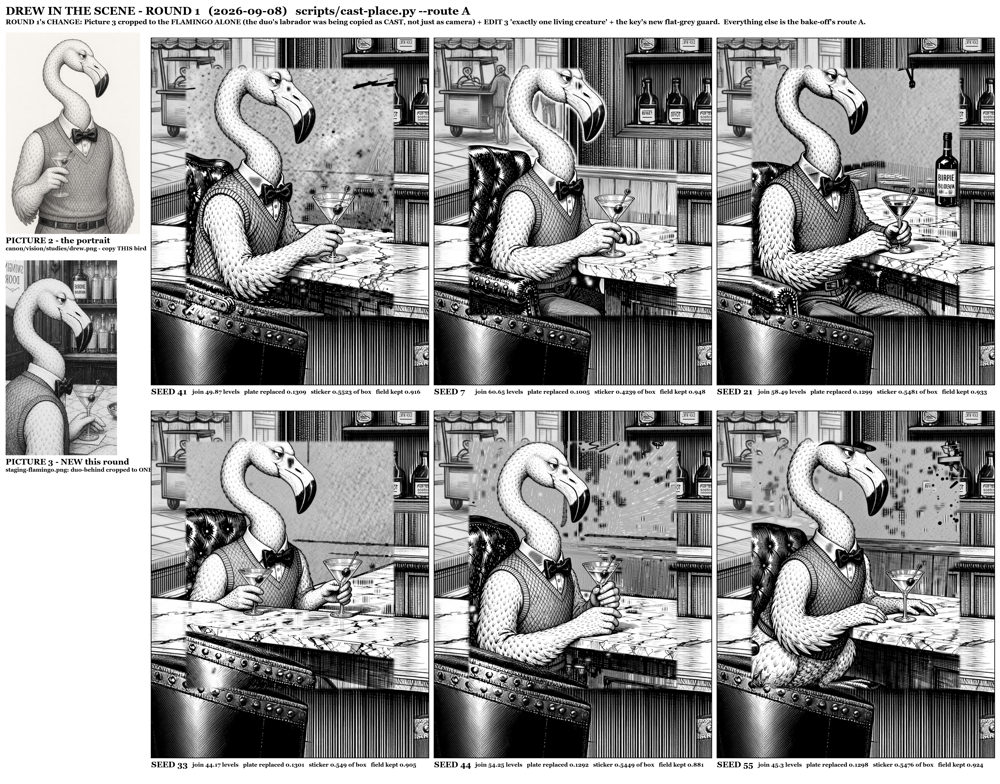

**The ask.** The founder: get Drew into the approved room today, and perfect him there. The staging is fixed - he sits in the LEFT club chair at the marble, seen FROM BEHIND and a little to his left, over his shoulder: the knit of the sweater vest across his shoulder blades, the chair's studded roll crossing his lower back, the neck rising in its S, the head turned RIGHT toward the other chair so the bill reads in profile and the lidded eye shows, the near feathered hand on the marble. Not facing the camera.

**The thinking.** The placer's bake-off earlier today settled the ROUTE (A, the flat field: the model is handed only the real chair, the real marble and the wall's silhouette lines on flat grey 140, and only the pixels that differ from that field are laid onto the approved plate - 40 grey levels at the seam against route B's 65-72, and 12% of the plate at risk against 24%). It also found the reason the staging kept failing, and it was not the route: all four bake-off renders came back with Drew square to the camera AND with a labrador at his elbow, and duo-behind.png - the Picture 3 the founder scored highest - is a flamingo AND a labrador at the marble. The model was copying Picture 3's CAST as well as its camera. So round 1 changes the cast reference and nothing else about the route: Picture 3 is cropped to the FLAMINGO ALONE (staging-flamingo.png, the left third of duo-behind), its label is rewritten to say copy the body angle and the turn of the head and nothing else, and one extra numbered EDIT names the cast out loud - exactly one living creature, no dog, no second bird, the right-hand chair stays empty. Six seeds, because the staging has been a lottery and one seed proves nothing.

**Settings.** scripts/cast-place.py --route A --pose-name seated-left-solo3 --staging staging-flamingo.png --staging-label ... --extra-edit ... ; local/qwen-image-edit-2511 via POST http://127.0.0.1:8000/api/generate, fast (Lightning 8-step, cfg 1), 4:5 -> 1344x1680, three references as data URIs; ComfyUI restarted between every render.

**Prompt.** [prompts/033-drew-in-the-scene-round-1-contact-sheet-six-seeds-route-a-with-picture-3-cropped-to-the-flamingo-alone.prompt.txt](prompts/033-drew-in-the-scene-round-1-contact-sheet-six-seeds-route-a-with-picture-3-cropped-to-the-flamingo-alone.prompt.txt)

**Verdict.** REJECTED as pictures, but the round moved the problem. THE FIX WORKED: the labrador is gone from all six seeds - cropping Picture 3 to the flamingo alone, plus EDIT 3 naming the cast, ended the dog that appeared in 4 of 4 bake-off renders. WHAT STILL FAILS, at all six seeds without exception: Drew is square to the camera or three-quarter FRONT, never from behind; he is on the FAR side of the marble, in the barman's place, at roughly 1.6-2x the plate's scale; and he sits in a tufted wing chair the model invents for him while the plate's own studded club chair stays visibly EMPTY in the foreground of every tile. THE CAUSE IS IN THE FIELD, NOT IN THE WORDING. Route A's flat field leaves only the chair's studded ROLL at the very bottom of the crop, which reads as the near lip of a counter, and the marble slab then reads as a table with a far side - so the model puts him across it. The model also copies Picture 3's ROOM: the crop still contains the back bar, and the BIRDIE BOURBON bottles, the panelling and the mirrored lettering turn up in seeds 21, 44 and 55. NUMBERS: join 44.2-60.7 grey levels, 10.0-13.1% of the plate replaced, and the field was NOT kept flat at any seed (0.88-0.95 changed), so the difference key returns a box-filling slab rather than an outline - the one thing the bake-off had going for it did not survive this prompt. BEST SEED 7: the only one that reads as Drew at 2x - bill, lidded eye, collar band, bow tie, V-neck knit and the feathered hand on the martini all correct - and the least destructive (10.0% of the plate, sticker 0.42 of the box against 0.55 everywhere else). ROUND 2: cut Picture 3 to the bird on blank paper, and put the CHAIR BACK into the flat field so there is something to sit in.

*Logged 14:47.*

---

## 034. Drew seated in the left club chair - route S seed 7

**The ask.** Team Drew 3, round 1. The founder's brief: Drew seated in the LEFT leather club chair, seen from behind and a little to his left, head turned to his right in three-quarter so the bill and one lidded eye read, knit vest and collar above the chair back, the chair back in front of his lower body - and the room itself untouched pixels. Routes A and B never managed the seat; this is route S, run as built, with the flamingo-only staging on (--staging-solo).

**The thinking.** Routes A and B hand the model a picture of the ROOM and ask it to choose a scale and a seat, and it always chose a side table of its own. Route S takes the choice away: Picture 1 is a white sheet carrying only the left chair's own rendered pixels, one thin ink line for the marble's near edge, and a pale under-drawing of the construction's own figure-drew-02-toward block-in at --under-blend 0.55. EDIT 1 asks only that Drew be drawn EXACTLY FILLING that under-drawing. The key is absolute, not a difference key - ink darker than 232 inside the dilated figure mask, minus the chair - so the approved plate's own pixels are all that carries the room.

**Settings.** scripts/cast-place.py --character drew --route S --seed 7 --staging-solo --tag r1; qwen-image-edit-2511 via AuraVision 127.0.0.1:8000; 4:5 at 1344x1680, Lightning 8-step cfg 1; box 20,700,660,1500; --under-blend 0.55 --white-thresh 232; rules pen; 52.6s

**Prompt.** [prompts/034-drew-seated-in-the-left-club-chair-route-s-seed-7.prompt.txt](prompts/034-drew-seated-in-the-left-club-chair-route-s-seed-7.prompt.txt)

**Verdict.** 12/20 - FAIL. identity 3, pose 4, seat 3, cleanliness 2. The seat is finally right: he is down IN our left chair with the studded roll across his lower back and the collar and vest above it, at the block-in's own place. Against that, the bill is heavy and dark instead of the portrait's slender pale bill with a black outer third; the model redrew its own studded chair roll inside the sticker, so the chair double-prints; and the sticker carries a counter slab, a martini and a saucer that belong to Picture 3's crop. Free-page ink 0.18, the dirtiest of the three usable seeds. Only 0.67 of his silhouette survived the key, so the panelling shows through his knit.

*Logged 16:25.*

---

## 035. Drew seated in the left club chair - route S seed 21

**The ask.** Team Drew 3, round 1, second of four seeds. Same brief and same route S as seed 7, run as built with no change: Drew seated in OUR left leather club chair, from behind and a little to his left, head turned right in three-quarter, the chair back in front of his lower body, the room's own pixels untouched.

**The thinking.** Same white sheet, same pale under-drawing, same absolute key; only the seed moves. Four seeds are drawn so the route can be judged on what it does repeatably rather than on one lucky render - route A's six-seed round failed identically at every seed, which is what proved the fault was the field and not the wording.

**Settings.** scripts/cast-place.py --character drew --route S --seed 21 --staging-solo --tag r1; qwen-image-edit-2511 via AuraVision 127.0.0.1:8000; 4:5 at 1344x1680, Lightning 8-step cfg 1; box 20,700,660,1500; --under-blend 0.55 --white-thresh 232; rules pen; 56.6s

**Prompt.** [prompts/035-drew-seated-in-the-left-club-chair-route-s-seed-21.prompt.txt](prompts/035-drew-seated-in-the-left-club-chair-route-s-seed-21.prompt.txt)

**Verdict.** 13/20 - the best of the four, but still a FAIL. identity 4, pose 4, seat 3, cleanliness 2. Everything the founder asked to READ does read: the small refined head, the heavy-lidded eye, the bill, the white collar band, the small black bow tie, the knit V-neck vest and the feathered hand with fingers on the martini - and he is seated in OUR chair, from behind and a little to his left, head turned right, the studded roll across his lower back. What fails is the cut-out, not the drawing: 0.66 of his silhouette survived the key, so the bar's panelling and the window show through him and a white flamingo reads as a grey stippled heron; and the sticker brought a slab of marble and a bowl of olives onto the counter with him.

*Logged 16:26.*

---

## 036. Drew seated in the left club chair - route S seed 41

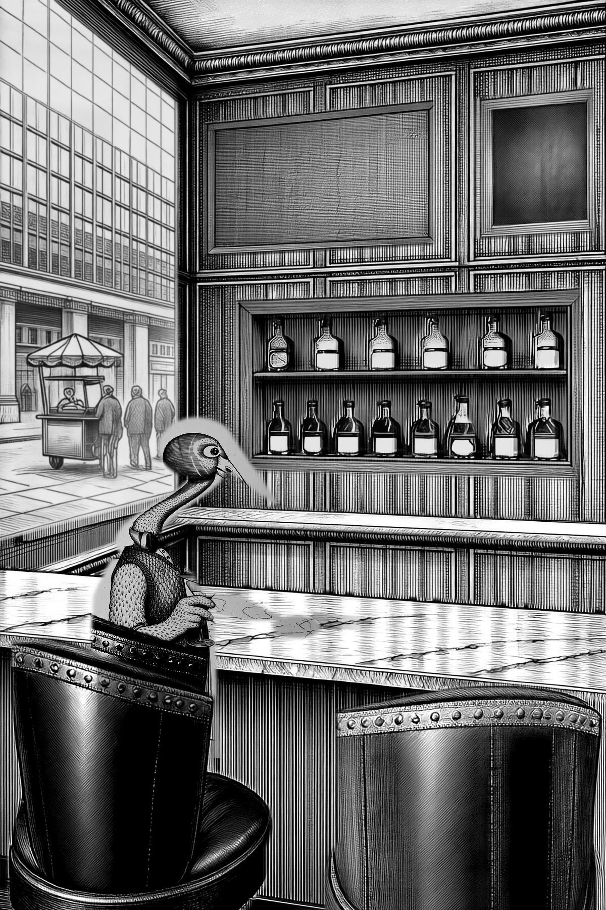

**The ask.** Team Drew 3, round 1, third of four seeds. Same brief, same route S as built.

**The thinking.** Seed 41 is the seed every previous round was measured on, so it is carried into route S for comparison: if the white sheet holds where the flat grey field did not, it should hold here first.

**Settings.** scripts/cast-place.py --character drew --route S --seed 41 --staging-solo --tag r1; qwen-image-edit-2511 via AuraVision 127.0.0.1:8000; 4:5 at 1344x1680, Lightning 8-step cfg 1; box 20,700,660,1500; --under-blend 0.55 --white-thresh 232; rules pen; 60.5s

**Prompt.** [prompts/036-drew-seated-in-the-left-club-chair-route-s-seed-41.prompt.txt](prompts/036-drew-seated-in-the-left-club-chair-route-s-seed-41.prompt.txt)

**Verdict.** 6/20 - FAIL, and the worst of the four. identity 1, pose 2, seat 2, cleanliness 1. The sheet was not kept blank: the model put ink on 95% of the box, so the absolute key had nothing to separate and handed back a box-filling slab (one blob, 150k px). The head reads front-on with a striped skull and no bow tie, a second studded roll is drawn over the plate's own chair, and a grey smear crosses the marble. The script's own dirty-key warning fired at 92%. This is the same failure the flat-grey field had at seed 41 in the previous round - this seed re-inks whatever ground it is given.

*Logged 16:26.*

---

## 037. Drew seated in the left club chair - route S seed 44

**The ask.** Team Drew 3, round 1, fourth of four seeds. Same brief, same route S as built.

**The thinking.** The fourth seed of the round. It also turned into the round's diagnostic: it is the only seed that drew Drew in the portrait's own WHITE, and that is exactly the seed the absolute key handles worst - which is how the round found its real fault.

**Settings.** scripts/cast-place.py --character drew --route S --seed 44 --staging-solo --tag r1; qwen-image-edit-2511 via AuraVision 127.0.0.1:8000; 4:5 at 1344x1680, Lightning 8-step cfg 1; box 20,700,660,1500; --under-blend 0.55 --white-thresh 232; rules pen; 52.6s. First two attempts returned 'All connection attempts failed' while ComfyUI was restarting; /system_stats checked healthy and the render retried.

**Prompt.** [prompts/037-drew-seated-in-the-left-club-chair-route-s-seed-44.prompt.txt](prompts/037-drew-seated-in-the-left-club-chair-route-s-seed-44.prompt.txt)

**Verdict.** 12/20 - FAIL, but the most useful render of the round. identity 4, pose 4, seat 3, cleanliness 1. On paper this is the truest Drew the studio has drawn in the chair: white plumage in fine dash-strokes, the slender pale bill, the heavy-lidded eye, the collar band, the small black bow tie, the knit V-neck vest, the feathered hand on the martini, seated in OUR chair from behind and a little to his left with his head turned right. And it is destroyed in the laid preview, because he is drawn WHITE: the absolute key keeps only what is darker than 232, so his paper-white interior is not his, and just 0.51 of his silhouette survived. His HEAD IS CUT OFF - a milky wedge over the window - and a smeared slab of marble came with him. The better the model draws Drew, the worse this key cuts him out.

*Logged 16:26.*

---

## 038. Team Drew 3 round 1 contact sheet - route S, four seeds

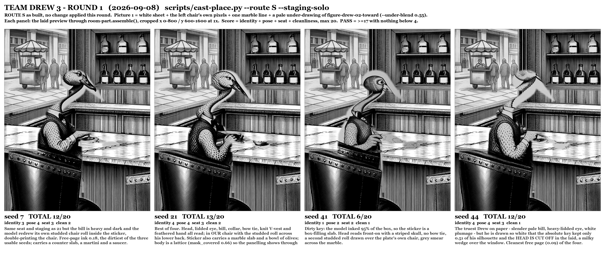

**The ask.** One contact sheet of the four laid crops with seed and total in the caption, so the round can be read at a glance.

**The thinking.** Four laid previews, each cropped x 0-800 / y 600-1600 of the plate at 1x - the founder's own window on the left chair - captioned with the seed, the four sub-scores and the total out of 20. Read left to right the sheet makes the round's one finding visible without any numbers: at every seed Drew is finally IN our left chair at the block-in's scale with the chair back across his lower body, and at every seed he is semi-transparent, because a white bird keyed by darkness is mostly holes.

**Settings.** scratchpad/cast-scene/drew3/build-round1-sheet.py; laid previews from canon/room-kit/v2/figures/drew-seated-left-rS-s{7,21,41,44}-laid.png

**Verdict.** The round in one picture. Best seed 21 at 13/20; no seed passes (PASS is 17 with nothing below 4). Seat and pose are solved by route S; identity and cleanliness are both being held down by the same thing - the absolute white-threshold key keeps only 0.51-0.66 of Drew's own silhouette, so the room shows through him.

*Logged 16:26.*

---

## 039. bottles-on-lower-shelf and bottles-on-upper-shelf render seed 21 laid in full plate

**The thinking.** Rendered in context - the plate as it stands behind this part, with only this part's own silhouette blocked in as values - so the pen, light and perspective are inherited; only the mask is laid back. Part note: the row of ELEVEN real liquor bottles standing shoulder to shoulder on the lower shelf of the inlaid recess, well in front of its boarded back - A NORMAL BAR'S BACK SHELF, crowded and mixed: EVERY BOTTLE A DIFFERENT SHAPE, HEIGHT AND WIDTH, no two neighbours alike - squat flasks beside tall slim bottles, square shoulders beside round, a decanter, a long-necked bottle, a stubby one - with different closures: foil capsules under dark caps, pale rounded cork stoppers, tall black caps. The glass is mixed too: CLEAR bottles pale with a bright highlight down the window side, DARK-GLASS bottles deep, glassy and clearly darker than their clear neighbours, all reading against the darker boards behind. EVERY BOTTLE IS AT LEAST HALF FULL and the levels differ: the liquid inside is DARKER than the empty glass above it and the two meet at a clean horizontal FILL LINE. Each bottle STANDS ON THE BOARD with a small pool of contact shadow at its foot and a soft shadow up the boarding behind it, leaning away from the window at frame-left. Each wears ONE paper label - most white paper, a few BLACK paper - placed high or low as the block-in places it, some with a small second label on the neck; the labels are PLAIN AND BLANK: no lettering, no words, no letters, no numerals, no pseudo-text, no drawing - their emblems are stamped on in code afterwards, exactly as the window is gilded AND the row of NINE real liquor bottles standing shoulder to shoulder on the upper shelf of the inlaid recess, well in front of its boarded back - A NORMAL BAR'S BACK SHELF, crowded and mixed: EVERY BOTTLE A DIFFERENT SHAPE, HEIGHT AND WIDTH, no two neighbours alike - squat flasks beside tall slim bottles, square shoulders beside round, a decanter, a long-necked bottle, a stubby one - with different closures: foil capsules under dark caps, pale rounded cork stoppers, tall black caps. The glass is mixed too: CLEAR bottles pale with a bright highlight down the window side, DARK-GLASS bottles deep, glassy and clearly darker than their clear neighbours, all reading against the darker boards behind. EVERY BOTTLE IS AT LEAST HALF FULL and the levels differ: the liquid inside is DARKER than the empty glass above it and the two meet at a clean horizontal FILL LINE. Each bottle STANDS ON THE BOARD with a small pool of contact shadow at its foot and a soft shadow up the boarding behind it, leaning away from the window at frame-left. Each wears ONE paper label - most white paper, a few BLACK paper - placed high or low as the block-in places it, some with a small second label on the neck; the labels are PLAIN AND BLANK: no lettering, no words, no letters, no numerals, no pseudo-text, no drawing - their emblems are stamped on in code afterwards, exactly as the window is gilded

**Settings.** local/sensenova-u1.5, seed 21, full 40 steps cfg 4, rendered together with bottles-upper, negative: text, letters, words, lettering, signage, sign, numbers, typography, writing, inscription, shop name, banner, poster, bartender, terrier, dog, person, figure, woman, character, chair, stool, seat, barstool, chalkboard, blackboard, framed board, picture, frame, dog, retriever, person, figure, man, character, flamingo, bird, person, figure, man, character, lamp, sconce, light fixture, television, screen, monitor, flat screen

**Prompt.** [prompts/039-bottles-on-lower-shelf-and-bottles-on-upper-shelf-render-seed-21-laid-in-full-plate.prompt.txt](prompts/039-bottles-on-lower-shelf-and-bottles-on-upper-shelf-render-seed-21-laid-in-full-plate.prompt.txt)

*Logged 16:37.*

---

## 040. bottles-on-lower-shelf and bottles-on-upper-shelf render seed 7 laid in full plate

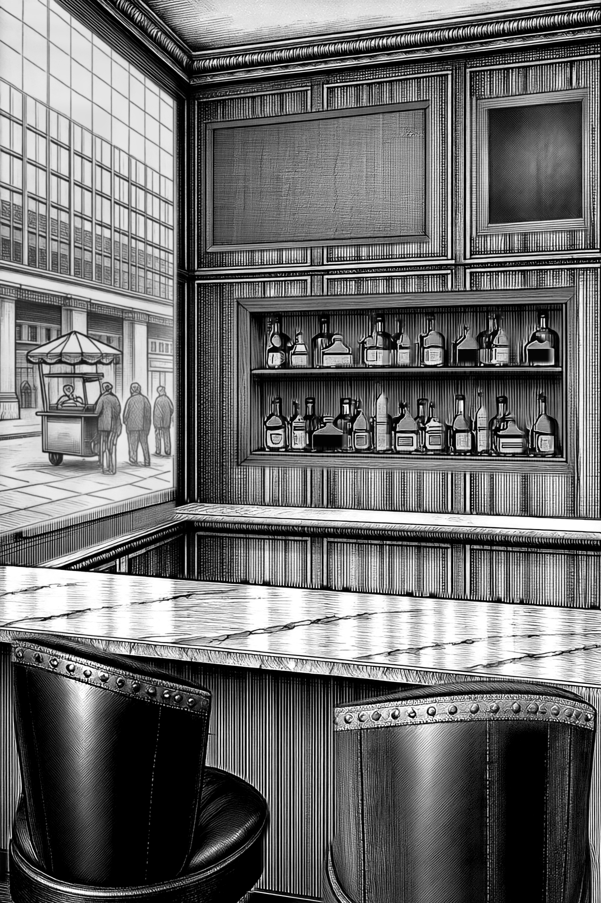

**The thinking.** Rendered in context - the plate as it stands behind this part, with only this part's own silhouette blocked in as values - so the pen, light and perspective are inherited; only the mask is laid back. Part note: the row of ELEVEN real liquor bottles standing shoulder to shoulder on the lower shelf of the inlaid recess, well in front of its boarded back - A NORMAL BAR'S BACK SHELF, crowded and mixed: EVERY BOTTLE A DIFFERENT SHAPE, HEIGHT AND WIDTH, no two neighbours alike - squat flasks beside tall slim bottles, square shoulders beside round, a decanter, a long-necked bottle, a stubby one - with different closures: foil capsules under dark caps, pale rounded cork stoppers, tall black caps. The glass is mixed too: CLEAR bottles pale with a bright highlight down the window side, DARK-GLASS bottles deep, glassy and clearly darker than their clear neighbours, all reading against the darker boards behind. EVERY BOTTLE IS AT LEAST HALF FULL and the levels differ: the liquid inside is DARKER than the empty glass above it and the two meet at a clean horizontal FILL LINE. Each bottle STANDS ON THE BOARD with a small pool of contact shadow at its foot and a soft shadow up the boarding behind it, leaning away from the window at frame-left. Each wears ONE paper label - most white paper, a few BLACK paper - placed high or low as the block-in places it, some with a small second label on the neck; the labels are PLAIN AND BLANK: no lettering, no words, no letters, no numerals, no pseudo-text, no drawing - their emblems are stamped on in code afterwards, exactly as the window is gilded AND the row of NINE real liquor bottles standing shoulder to shoulder on the upper shelf of the inlaid recess, well in front of its boarded back - A NORMAL BAR'S BACK SHELF, crowded and mixed: EVERY BOTTLE A DIFFERENT SHAPE, HEIGHT AND WIDTH, no two neighbours alike - squat flasks beside tall slim bottles, square shoulders beside round, a decanter, a long-necked bottle, a stubby one - with different closures: foil capsules under dark caps, pale rounded cork stoppers, tall black caps. The glass is mixed too: CLEAR bottles pale with a bright highlight down the window side, DARK-GLASS bottles deep, glassy and clearly darker than their clear neighbours, all reading against the darker boards behind. EVERY BOTTLE IS AT LEAST HALF FULL and the levels differ: the liquid inside is DARKER than the empty glass above it and the two meet at a clean horizontal FILL LINE. Each bottle STANDS ON THE BOARD with a small pool of contact shadow at its foot and a soft shadow up the boarding behind it, leaning away from the window at frame-left. Each wears ONE paper label - most white paper, a few BLACK paper - placed high or low as the block-in places it, some with a small second label on the neck; the labels are PLAIN AND BLANK: no lettering, no words, no letters, no numerals, no pseudo-text, no drawing - their emblems are stamped on in code afterwards, exactly as the window is gilded

**Settings.** local/sensenova-u1.5, seed 7, full 40 steps cfg 4, rendered together with bottles-upper, negative: text, letters, words, lettering, signage, sign, numbers, typography, writing, inscription, shop name, banner, poster, bartender, terrier, dog, person, figure, woman, character, chair, stool, seat, barstool, chalkboard, blackboard, framed board, picture, frame, dog, retriever, person, figure, man, character, flamingo, bird, person, figure, man, character, lamp, sconce, light fixture, television, screen, monitor, flat screen

**Prompt.** [prompts/040-bottles-on-lower-shelf-and-bottles-on-upper-shelf-render-seed-7-laid-in-full-plate.prompt.txt](prompts/040-bottles-on-lower-shelf-and-bottles-on-upper-shelf-render-seed-7-laid-in-full-plate.prompt.txt)

*Logged 16:37.*

---

## 041. whole-plate assembled with bartenders-marble-ledge back-bar-carcass back-bar-lower-shelf bottles-on-lower-shelf bottles-on-upper-shelf back-bar-upper-shelf television-blank chalkboard-blank window-frame-and-reveal window-glass-street-view main-bar-marble-counter left-leather-club-chair right-leather-club-chair and window-sign

**The thinking.** Base plus every approved, enabled part laid in order through its own silhouette; the TV's blank screen and the window's lettering are drawn in code last, because lettering is never left to the model.

*Logged 16:38.*

---

## 042. whole-plate assembled with bartenders-marble-ledge back-bar-carcass back-bar-lower-shelf bottles-on-lower-shelf bottles-on-upper-shelf back-bar-upper-shelf television-blank chalkboard-blank window-frame-and-reveal window-glass-street-view main-bar-marble-counter left-leather-club-chair right-leather-club-chair and window-sign

**The thinking.** Base plus every approved, enabled part laid in order through its own silhouette; the TV's blank screen and the window's lettering are drawn in code last, because lettering is never left to the model.

*Logged 16:38.*

---

## 043. whole-plate assembled with bartenders-marble-ledge back-bar-carcass back-bar-lower-shelf bottles-on-lower-shelf bottles-on-upper-shelf back-bar-upper-shelf television-blank chalkboard-blank window-frame-and-reveal window-glass-street-view main-bar-marble-counter left-leather-club-chair right-leather-club-chair and window-sign

**The thinking.** Base plus every approved, enabled part laid in order through its own silhouette; the TV's blank screen and the window's lettering are drawn in code last, because lettering is never left to the model.

*Logged 16:51.*

---

## 044. The back bar as a normal bar: twenty different bottles, no names, emblem labels drawn in code

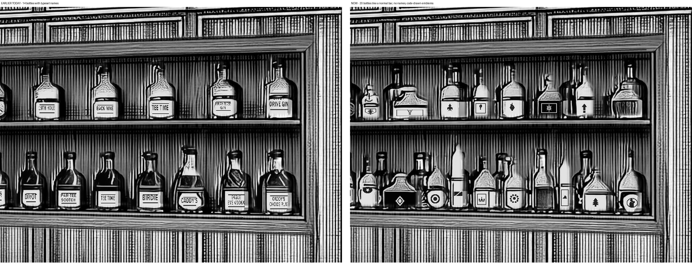

**The ask.** Founder: 'the bottles shouldnt all look the same, it should be like a normal bar with lots of different bottles; the bottles shouldnt have creative names or even names at all, they just need emblems that remind people of real liquor bottles.'

**The thinking.** A Sonnet designer and an Opus critic reworked the construction in a scratch copy: fourteen silhouettes, eleven bottles below and nine above shoulder to shoulder with uneven gaps, heights from a squat half-height rum to a tall slim vodka, clear and dark glass with the dark glass now clearly darker than the lining, three closure styles (foil capsule, pale cork, tall cap), four black-paper labels, four neck labels, fill levels staggered from 60 to 78 percent. The names are gone: a library of twenty-four emblem devices (shield, medallion, crest, seal, crown, stag, ship, anchor, fleur-de-lis...) is stamped in code onto the paper the model actually painted, one device per label, none repeated, and a label whose paper the model did not paint is left blank rather than stamped on glass. Rendered whole-plate on the approved unit at seeds 21 and 7; seed 21 accepted.

**Settings.** local/sensenova-u1.5 via AuraVision, bottles-lower --with bottles-upper, seed 21; emblems by scripts/label-bottles.py --mode emblems at build

**Verdict.** Accepted into the plate; sent to the founder.

*Logged 16:51.*

---

## 046. Drew seated left - route S round 2 - seed 7 (hole-filled key)

**The ask.** Team Drew 3, round 2 of route S. Seat Drew in the LEFT leather club chair of the approved plate, seen from behind and a little to his left, head turned to his right in three-quarter so the bill and one lidded eye read, knit vest and collar above the chair back, chair back across his lower body - and the room's own pixels untouched. Exactly one thing changes from round 1.

**The thinking.** Round 1 proved route S had solved the SEAT and the SCALE - all four seeds put him down in our chair at the block-in's place. Both remaining failures shared one cause: Drew is a WHITE bird and the absolute key keeps only pixels darker than 232, so his paper interior never entered the sticker and what was laid on the plate was a lattice of ink (mask_covered 0.51-0.67) with the window and the panelling showing through him. So this round adds a hole-fill and nothing else: after the overlapping components are kept and before the 1.5px feather, binary_closing(3) then binary_fill_holes on the kept mask, --white-thresh left at 232. It cannot reach new ink because it only runs inside components already kept. Measured here: seed 7's coverage went 0.665 -> 0.832 with free-page ink unchanged (0.1847 -> 0.1838). The menu's own opacity knob was rejected as a bad trade - --white-thresh 246 buys less coverage and blows seed 7's free-page ink to 0.601.

**Settings.** scripts/cast-place.py --character drew --route S --seed 7 --staging-solo --tag r2 | local/qwen-image-edit-2511 via AuraVision 127.0.0.1:8000 | box 20,700,660,1500 | roi 140,770,620,1340 | under-blend 0.55 | white-thresh 232 | key: close(3)+fill_holes+feather 1.5

**Prompt.** [prompts/046-drew-seated-left-route-s-round-2-seed-7-hole-filled-key.prompt.txt](prompts/046-drew-seated-left-route-s-round-2-seed-7-hole-filled-key.prompt.txt)

**Verdict.** 11/20. identity 3 - the collar band, the black bow tie, the V-neck knit and the feathered hand with fingers all read, but the crown is crested and speckled instead of small and refined and the eye is round and staring, not heavy-lidded. pose 2 - he is three-quarter FRONT with the bow-tie knot facing us, the one thing the brief says NOT to draw; the under-drawing's back view did not carry. seat 4 - down in OUR left chair, chair back across the lower body, vest and arms above the roll. cleanliness 2 - the sticker still carries Picture 3's martini, a saucer, the counter slab's edge and a piece of the chair's own studded roll, and a soft grey aura the model drew round the bill washes out the panelling behind it. The hole-fill worked exactly as measured - he is opaque now, not a lattice.

*Logged 16:55.*

---

## 047. Drew seated left - route S round 2 - seed 21 (hole-filled key)

**The ask.** Team Drew 3, round 2 of route S, second seed. Same brief: Drew down in the LEFT club chair, seen from behind and a little to his left, head turned right in three-quarter, the room's own pixels untouched.

**The thinking.** Same single change as seed 7 - binary_closing(3) then binary_fill_holes on the kept components before the 1.5px feather, --white-thresh still 232 - so this seed tests whether the hole-fill is a general fix or a seed-7 accident. Round 1 measured seed 21 at mask_covered 0.661; the prediction was 0.879.

**Settings.** scripts/cast-place.py --character drew --route S --seed 21 --staging-solo --tag r2 | local/qwen-image-edit-2511 via AuraVision 127.0.0.1:8000 | box 20,700,660,1500 | roi 140,770,620,1340 | under-blend 0.55 | white-thresh 232 | key: close(3)+fill_holes+feather 1.5

**Prompt.** [prompts/047-drew-seated-left-route-s-round-2-seed-21-hole-filled-key.prompt.txt](prompts/047-drew-seated-left-route-s-round-2-seed-21-hole-filled-key.prompt.txt)

**Verdict.** 10/20. identity 2 - the head has come apart: a patterned ball with a tiny eye and no crown, and the bill is a flat wedge without the pale shaft and black outer third. The bow tie, the V-neck knit and the fingered hand survive. pose 2 - three-quarter FRONT again, tie knot to camera. seat 4 - correctly in our chair, chair back across the lower body. cleanliness 2 - Picture 3's bowl of olives and the counter slab came into the sticker, and a pale ghost of the bill smears across the panelling. Coverage went 0.661 -> 0.781, so the hole-fill generalises; the head is a render failure, not a key failure.

*Logged 16:55.*

---

## 048. Drew seated left - route S round 2 - seed 41 (hole-filled key)

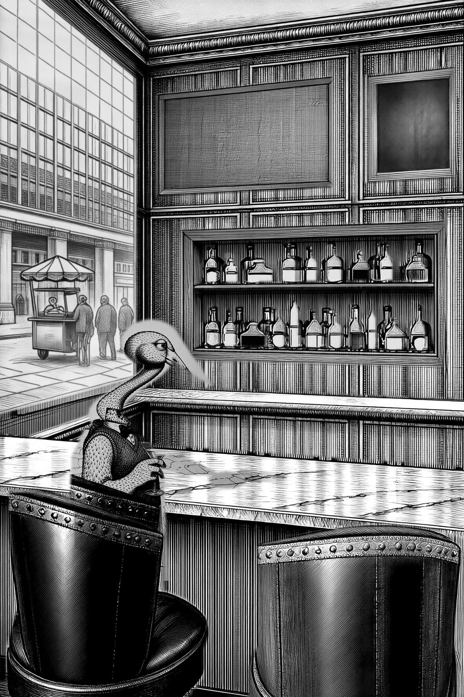

**The ask.** Team Drew 3, round 2 of route S, third seed. Same brief: Drew down in the LEFT club chair, from behind and a little to his left, head turned right in three-quarter, the room's own pixels untouched.

**The thinking.** Seed 41 is the seed that failed the sheet test in round 1 - it did not keep the paper white but re-inked the whole box (raw ink fraction 0.95 this round, free-page ink 0.916). It is here to show what the hole-fill does NOT fix: measured on round 1's own raw, close+fill moved seed 41's coverage only 0.9701 -> 0.9705, because when the whole sheet is ink there are no holes to fill. The fill is a fix for a WHITE bird keyed out of white paper, not a fix for a model that paints the paper.

**Settings.** scripts/cast-place.py --character drew --route S --seed 41 --staging-solo --tag r2 | local/qwen-image-edit-2511 via AuraVision 127.0.0.1:8000 | box 20,700,660,1500 | roi 140,770,620,1340 | under-blend 0.55 | white-thresh 232 | key: close(3)+fill_holes+feather 1.5 | 1091s (the 4090 is shared with the back-bar team)

**Prompt.** [prompts/048-drew-seated-left-route-s-round-2-seed-41-hole-filled-key.prompt.txt](prompts/048-drew-seated-left-route-s-round-2-seed-41-hole-filled-key.prompt.txt)

**Verdict.** 10/20. identity 3 - the best head of the round: the pale bill really does carry a black outer third, the eye is heavy-lidded and amiable, and the collar band, bow tie, V-neck knit and fingered hand all read - but he is drawn mid-grey and scaly rather than white and feathered. pose 2 - three-quarter FRONT with the bow-tie knot to camera, the brief's explicit NOT, for the third seed running. seat 4 - down in our chair at the block-in's place, the studded roll across his lower body. cleanliness 1 - the worst of the round: the model inked 95% of the sheet, so the key kept one blob that is 40% not-Drew - a pale slab of re-inked paper, the marble counter, a saucer and a piece of the chair's own roll - and that slab washes the panelling and the marble where it lands.

*Logged 17:02.*

---

## 049. Drew seated left - route S round 2 - seed 44 (hole-filled key)

**The ask.** Team Drew 3, round 2 of route S, fourth seed. Same brief: Drew down in the LEFT club chair, from behind and a little to his left, head turned right in three-quarter, the room's own pixels untouched.

**The thinking.** Seed 44 is the seed the transparency hurt most in round 1 - the key kept only 0.513 of his silhouette and the paper interior ATE HIS HEAD outright. On round 1's own raw the hole-fill lifts that to 0.732 with free-page ink going DOWN (0.0898 -> 0.0871), so this seed was the clearest test of the change. It passed the test on those pixels; what came back this time is a different draw, and the model itself did not draw a head.

**Settings.** scripts/cast-place.py --character drew --route S --seed 44 --staging-solo --tag r2 | local/qwen-image-edit-2511 via AuraVision 127.0.0.1:8000 | box 20,700,660,1500 | roi 140,770,620,1340 | under-blend 0.55 | white-thresh 232 | key: close(3)+fill_holes+feather 1.5

**Prompt.** [prompts/049-drew-seated-left-route-s-round-2-seed-44-hole-filled-key.prompt.txt](prompts/049-drew-seated-left-route-s-round-2-seed-44-hole-filled-key.prompt.txt)

**Verdict.** 9/20, the weakest of the round. identity 1 - there is no face: the head is a flat crosshatched wedge with no eye at all and a doubled, broken bill. The wardrobe is the only thing that reads - collar band, black bow tie, V-neck knit, a hand with fingers. pose 2 - three-quarter FRONT again, and with no readable bill or eye the turn of the head cannot be judged. seat 4 - correctly down in our left chair, studded roll across his lower body. cleanliness 2 - martini, saucer, counter slab and a piece of the chair's roll in the sticker, and the pale ghost round the head is now laid as a solid wedge across the window and the panelling. Coverage 0.513 -> 0.775, so the key is fixed; the drawing is not.

*Logged 17:03.*

---

## 050. Drew seated left - route S round 3 - Picture 3 OFF - seed 7

**The ask.** Team Drew 3, route S, round 3. Seat Drew in the LEFT leather club chair, seen from behind and a little to his left, head turned to his right in three-quarter so the bill and one lidded eye read, knit vest and collar above the chair back, chair back in front of his lower body. The room must stay the plate's own untouched pixels.

**The thinking.** The one change this round: PICTURE 3 OFF - dropped --staging-solo, route S's own documented default. Not for cleanliness but because Picture 3 WAS the pose bug: staging-flamingo.png is labelled 'from behind' but is in fact a three-quarter FRONT view - chest to camera, white collar and black bow-tie knot facing us, V-neck vest front, martini in the near hand. All four of round 2's seeds reproduced that exact body angle and the martini with it, so the true back-view under-drawing was losing to it at --under-blend 0.55. Dropping it removes the front-view instruction and the martini/olives/saucer furniture in one move. Everything else held: --under-blend 0.55, --white-thresh 232, box and ROI unchanged.

**Settings.** scripts/cast-place.py --character drew --route S --seed 7 --tag r3 | local/qwen-image-edit-2511 via AuraVision 127.0.0.1:8000 | route S white-sheet Picture 1, under-blend 0.55, white-thresh 232, rules pen, NO Picture 3 (staging_solo=false, 2 references)

**Prompt.** [prompts/050-drew-seated-left-route-s-round-3-picture-3-off-seed-7.prompt.txt](prompts/050-drew-seated-left-route-s-round-3-picture-3-off-seed-7.prompt.txt)

**Verdict.** 11/20 - identity 2, pose 3, seat 4, clean 2. The front view and the martini are GONE: the back view is won. But the head is a mangled crest with no readable bill and no eye, and the key returned 161 blobs with room fragments in the sticker.

*Logged 17:21.*

---

## 051. Drew seated left - route S round 3 - Picture 3 OFF - seed 21

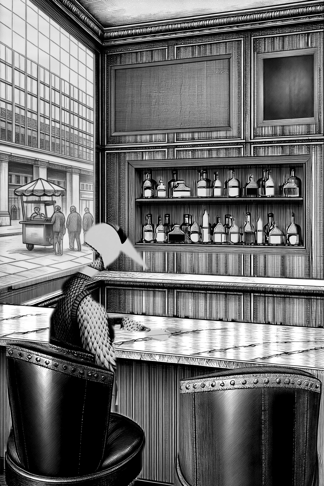

**The ask.** Team Drew 3, route S, round 3. Seat Drew in the LEFT leather club chair, seen from behind and a little to his left, head turned to his right in three-quarter so the bill and one lidded eye read, knit vest and collar above the chair back, chair back in front of his lower body. The room must stay the plate's own untouched pixels.

**The thinking.** The one change this round: PICTURE 3 OFF - dropped --staging-solo, route S's own documented default. Not for cleanliness but because Picture 3 WAS the pose bug: staging-flamingo.png is labelled 'from behind' but is in fact a three-quarter FRONT view - chest to camera, white collar and black bow-tie knot facing us, V-neck vest front, martini in the near hand. All four of round 2's seeds reproduced that exact body angle and the martini with it, so the true back-view under-drawing was losing to it at --under-blend 0.55. Dropping it removes the front-view instruction and the martini/olives/saucer furniture in one move. Everything else held: --under-blend 0.55, --white-thresh 232, box and ROI unchanged.

**Settings.** scripts/cast-place.py --character drew --route S --seed 21 --tag r3 | local/qwen-image-edit-2511 via AuraVision 127.0.0.1:8000 | route S white-sheet Picture 1, under-blend 0.55, white-thresh 232, rules pen, NO Picture 3 (staging_solo=false, 2 references)

**Prompt.** [prompts/051-drew-seated-left-route-s-round-3-picture-3-off-seed-21.prompt.txt](prompts/051-drew-seated-left-route-s-round-3-picture-3-off-seed-21.prompt.txt)

**Verdict.** 8/20 - identity 2, pose 2, seat 3, clean 1. Worst of the four. The knit vest across the shoulder blades is excellent, but the head is DETACHED - the bill floats free above the neck stub - and the head's white interior lays as an opaque blob punched over the room. scale 0.15 because the topmost blob is that floating bill.

*Logged 17:21.*

---

## 052. Drew seated left - route S round 3 - Picture 3 OFF - seed 41

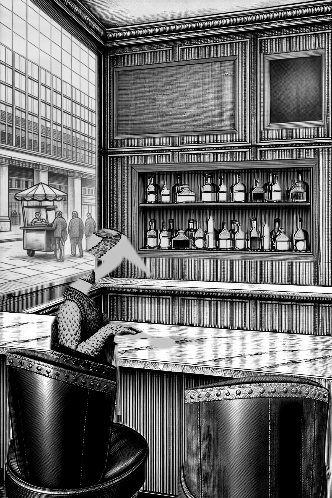

**The ask.** Team Drew 3, route S, round 3. Seat Drew in the LEFT leather club chair, seen from behind and a little to his left, head turned to his right in three-quarter so the bill and one lidded eye read, knit vest and collar above the chair back, chair back in front of his lower body. The room must stay the plate's own untouched pixels.

**The thinking.** The one change this round: PICTURE 3 OFF - dropped --staging-solo, route S's own documented default. Not for cleanliness but because Picture 3 WAS the pose bug: staging-flamingo.png is labelled 'from behind' but is in fact a three-quarter FRONT view - chest to camera, white collar and black bow-tie knot facing us, V-neck vest front, martini in the near hand. All four of round 2's seeds reproduced that exact body angle and the martini with it, so the true back-view under-drawing was losing to it at --under-blend 0.55. Dropping it removes the front-view instruction and the martini/olives/saucer furniture in one move. Everything else held: --under-blend 0.55, --white-thresh 232, box and ROI unchanged.

**Settings.** scripts/cast-place.py --character drew --route S --seed 41 --tag r3 | local/qwen-image-edit-2511 via AuraVision 127.0.0.1:8000 | route S white-sheet Picture 1, under-blend 0.55, white-thresh 232, rules pen, NO Picture 3 (staging_solo=false, 2 references)

**Prompt.** [prompts/052-drew-seated-left-route-s-round-3-picture-3-off-seed-41.prompt.txt](prompts/052-drew-seated-left-route-s-round-3-picture-3-off-seed-41.prompt.txt)

**Verdict.** 13/20 - identity 3, pose 3, seat 4, clean 3. BEST OF THE ROUND. White collar band, a clear small black bow tie, the knit V-neck vest and a properly feathered hand with fingers on the marble. Still fails on the head: a flat folded ribbon terminating in a bill-like wedge, no skull, no eye.

*Logged 17:21.*

---

## 053. Drew seated left - route S round 3 - Picture 3 OFF - seed 44

**The ask.** Team Drew 3, route S, round 3. Seat Drew in the LEFT leather club chair, seen from behind and a little to his left, head turned to his right in three-quarter so the bill and one lidded eye read, knit vest and collar above the chair back, chair back in front of his lower body. The room must stay the plate's own untouched pixels.

**The thinking.** The one change this round: PICTURE 3 OFF - dropped --staging-solo, route S's own documented default. Not for cleanliness but because Picture 3 WAS the pose bug: staging-flamingo.png is labelled 'from behind' but is in fact a three-quarter FRONT view - chest to camera, white collar and black bow-tie knot facing us, V-neck vest front, martini in the near hand. All four of round 2's seeds reproduced that exact body angle and the martini with it, so the true back-view under-drawing was losing to it at --under-blend 0.55. Dropping it removes the front-view instruction and the martini/olives/saucer furniture in one move. Everything else held: --under-blend 0.55, --white-thresh 232, box and ROI unchanged.

**Settings.** scripts/cast-place.py --character drew --route S --seed 44 --tag r3 | local/qwen-image-edit-2511 via AuraVision 127.0.0.1:8000 | route S white-sheet Picture 1, under-blend 0.55, white-thresh 232, rules pen, NO Picture 3 (staging_solo=false, 2 references)

**Prompt.** [prompts/053-drew-seated-left-route-s-round-3-picture-3-off-seed-44.prompt.txt](prompts/053-drew-seated-left-route-s-round-3-picture-3-off-seed-44.prompt.txt)

**Verdict.** 12/20 - identity 2, pose 3, seat 4, clean 3. The clearest back view and the cleanest key of the four (0.1053 outside the sticker). Knit vest and standing collar read well, but the neck breaks between the collar and a grey head wedge over the window.

*Logged 17:21.*

---

## 054. Drew seated left - route S round 3 contact sheet - Picture 3 OFF

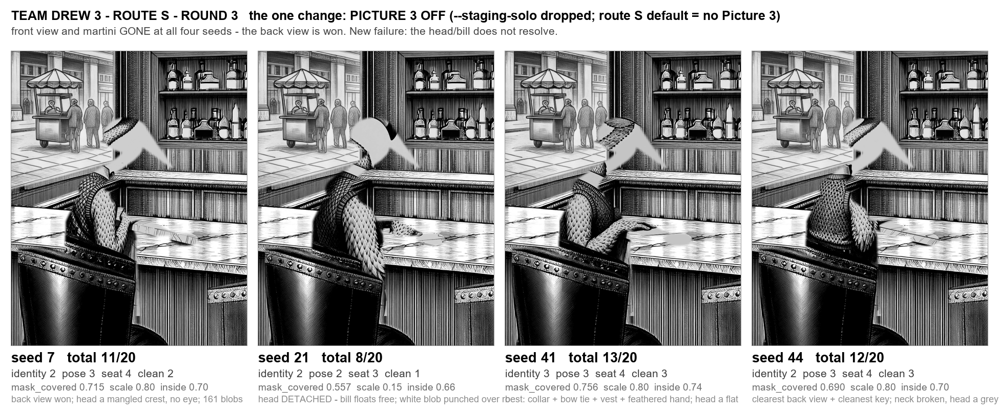

**The ask.** One contact sheet of the four round-3 laid crops with seed and total in the caption.

**The thinking.** Round 3's one change was Picture 3 OFF. The sheet is the four laid previews cropped x 0-800, y 600-1600 at 1x. Read left to right: the front view and the martini that dominated round 2 are gone at every seed, and the body now reads from behind with the knit vest across the shoulder blades and the chair back in front of the lower body. The whole of the remaining failure has moved into the head - at all four seeds the head above the chair back comes back as a pale wedge or ribbon with no skull and no eye, and at seed 21 it detaches entirely. Measured: the head/neck band (y826-1130) is paler than the body band (y1130-1400) at every seed (mean tone 152/122/169 vs 137/112/142), which is the head being the one part of the under-drawing with no chair pixels beside it to anchor it.

**Settings.** build-round3-sheet.py, four laid crops at 1x, captions from round-3-scores.json

**Verdict.** Round 3 FAILS the gate (PASS = total >= 17 with no score below 4). Best seed 41 at 13/20, up from round 2's best of 11. The change did what it was predicted to do - the pose bug was Picture 3 - but it bought about 2 points, not the 3-4 hoped, because it exposed a head that the under-drawing is too faint to specify. Round 4: --under-blend 0.55 -> 0.30.

*Logged 17:21.*

---

## 055. Drew seated left - route S round 4 under-blend 0.30 - seed 7

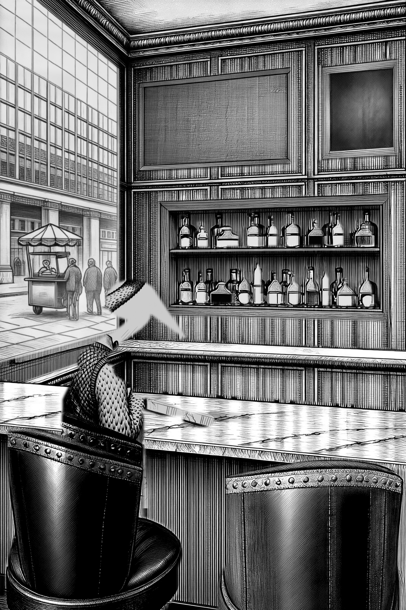

**The ask.** Team Drew 3, round 4 (route S). Seat Drew in the LEFT leather club chair of the approved plate, seen from behind and a little to his left, head turned right in three-quarter so the bill and one lidded eye read, knit vest and collar above the chair back, chair back in front of his lower body. Room pixels must stay untouched. Round 4's single change: --under-blend 0.55 -> 0.30 (darken the under-drawing so the head band carries tone). Picture 3 stays OFF.

**The thinking.** Round 3 won the body and moved the whole failure into the head: at every seed the head above the chair back came back as a pale wedge with no skull and no eye. Measured cause was that the head/neck band of the under-drawing is paler than the body band, so the head is the one stretch of Picture 1 where the model is told least. This round darkens the under-drawing (--under-blend 0.30) and changes nothing else. Deliberately NOT touching --white-thresh: the drawing itself is wrong, and raising the key would only lay a mangled head more solidly. NOTE: the round's literal command line carried --staging-solo (Picture 3 ON) and no --under-blend, which is exactly round 2's configuration and would have applied none of this round's stated change; I ran the round as stated instead - 0.30, Picture 3 OFF, 2 references - and flagged it.

**Settings.** route S, local/qwen-image-edit-2511 via AuraVision 127.0.0.1:8000, --under-blend 0.30, --white-thresh 232, Picture 3 OFF (2 references), rules=pen, box 20,700,660,1500, roi 140,770,620,1340, seed 7

**Prompt.** [prompts/055-drew-seated-left-route-s-round-4-under-blend-0-30-seed-7.prompt.txt](prompts/055-drew-seated-left-route-s-round-4-under-blend-0-30-seed-7.prompt.txt)

**Verdict.** 8/20. FAIL. Body/vest/collar/bow tie read from behind, but the head is still a folded feathered ribbon - no skull, no bill, no eye. Chair studs and marble fragments keyed into the sticker (93 blobs, cleanliness 0.153). identity 2, pose 2, seat 2, cleanliness 2.

*Logged 17:37.*

---

## 056. Drew seated left - route S round 4 under-blend 0.30 - seed 21

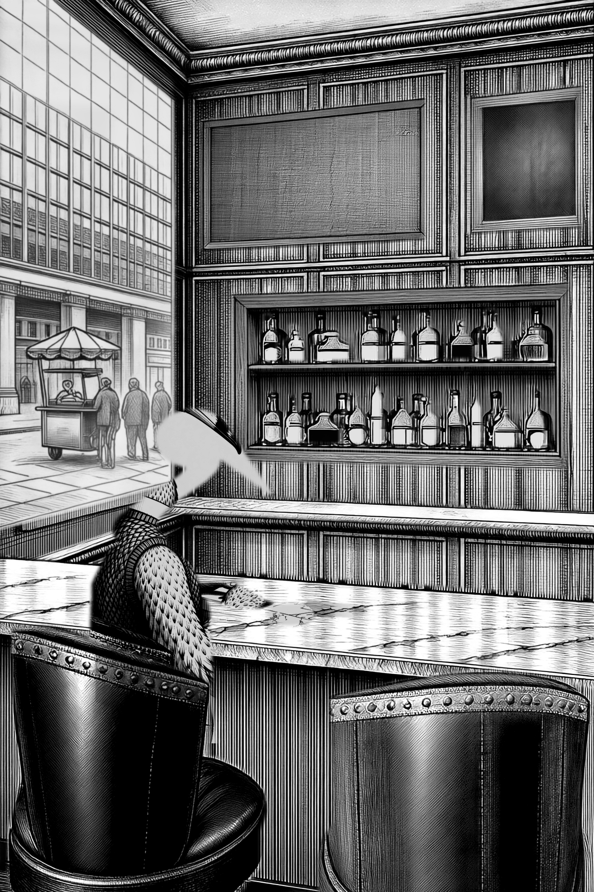

**The ask.** Team Drew 3, round 4 (route S). Seat Drew in the LEFT leather club chair of the approved plate, seen from behind and a little to his left, head turned right in three-quarter so the bill and one lidded eye read, knit vest and collar above the chair back, chair back in front of his lower body. Room pixels must stay untouched. Round 4's single change: --under-blend 0.55 -> 0.30 (darken the under-drawing so the head band carries tone). Picture 3 stays OFF.

**The thinking.** Second seed of the 0.30 sweep, same settings, sequential.

**Settings.** route S, local/qwen-image-edit-2511 via AuraVision 127.0.0.1:8000, --under-blend 0.30, --white-thresh 232, Picture 3 OFF (2 references), rules=pen, box 20,700,660,1500, roi 140,770,620,1340, seed 21

**Prompt.** [prompts/056-drew-seated-left-route-s-round-4-under-blend-0-30-seed-21.prompt.txt](prompts/056-drew-seated-left-route-s-round-4-under-blend-0-30-seed-21.prompt.txt)

**Verdict.** 7/20. FAIL, worst of the four. The bill and eye are drawn beautifully but float COMPLETELY DETACHED above the body with no skull, the neck ending in feathers. Head band tone did invert correctly (115.3 head vs 118.1 body, vs 122/112 in round 3). topmost-blob scale 0.17, mask covered 0.57, 141 blobs. identity 2, pose 2, seat 1, cleanliness 2.

*Logged 17:37.*

---

## 057. Drew seated left - route S round 4 under-blend 0.30 - seed 41

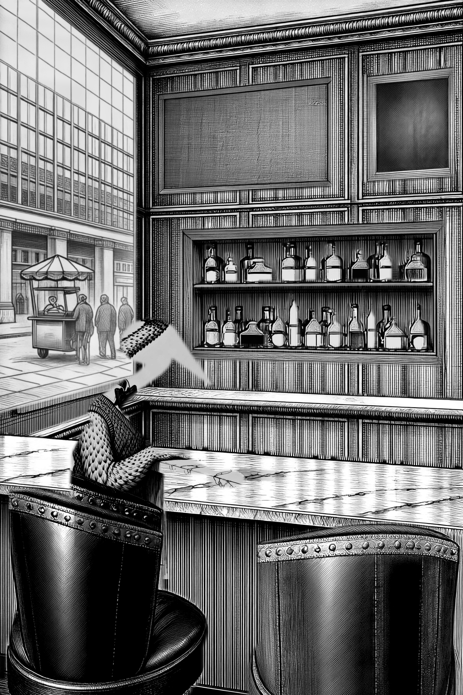

**The ask.** Team Drew 3, round 4 (route S). Seat Drew in the LEFT leather club chair of the approved plate, seen from behind and a little to his left, head turned right in three-quarter so the bill and one lidded eye read, knit vest and collar above the chair back, chair back in front of his lower body. Room pixels must stay untouched. Round 4's single change: --under-blend 0.55 -> 0.30 (darken the under-drawing so the head band carries tone). Picture 3 stays OFF.

**The thinking.** Third seed of the 0.30 sweep, same settings, sequential.

**Settings.** route S, local/qwen-image-edit-2511 via AuraVision 127.0.0.1:8000, --under-blend 0.30, --white-thresh 232, Picture 3 OFF (2 references), rules=pen, box 20,700,660,1500, roi 140,770,620,1340, seed 41

**Prompt.** [prompts/057-drew-seated-left-route-s-round-4-under-blend-0-30-seed-41.prompt.txt](prompts/057-drew-seated-left-route-s-round-4-under-blend-0-30-seed-41.prompt.txt)

**Verdict.** 9/20. FAIL. Best body of the four - proper small black bow tie, white collar, knit V-neck vest, feathered hand with fingers on the marble, seen from behind and a little to his left. Head still a folded wedge with a wire bill and a dot for an eye; in the laid it reads as a pale grey chevron smear on the wall. Head/body tone gap closed from +27 to +3.3 (140.1 vs 136.8). identity 2, pose 3, seat 2, cleanliness 2.

*Logged 17:37.*

---

## 058. Drew seated left - route S round 4 under-blend 0.30 - seed 44 - BEST

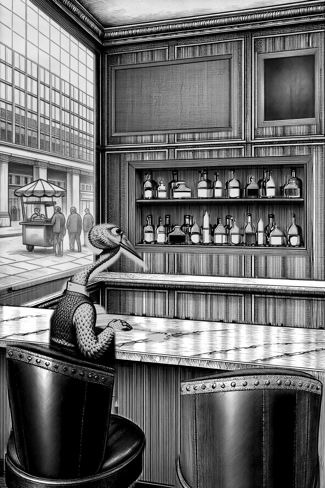

**The ask.** Team Drew 3, round 4 (route S). Seat Drew in the LEFT leather club chair of the approved plate, seen from behind and a little to his left, head turned right in three-quarter so the bill and one lidded eye read, knit vest and collar above the chair back, chair back in front of his lower body. Room pixels must stay untouched. Round 4's single change: --under-blend 0.55 -> 0.30 (darken the under-drawing so the head band carries tone). Picture 3 stays OFF.

**The thinking.** Fourth seed of the 0.30 sweep, same settings, sequential.

**Settings.** route S, local/qwen-image-edit-2511 via AuraVision 127.0.0.1:8000, --under-blend 0.30, --white-thresh 232, Picture 3 OFF (2 references), rules=pen, box 20,700,660,1500, roi 140,770,620,1340, seed 44

**Prompt.** [prompts/058-drew-seated-left-route-s-round-4-under-blend-0-30-seed-44-best.prompt.txt](prompts/058-drew-seated-left-route-s-round-4-under-blend-0-30-seed-44-best.prompt.txt)

**Verdict.** 10/20. BEST OF ROUND, still FAIL. FIRST REAL HEAD in four rounds: a genuine rounded skull joined to the S-neck, an eye and a full bill, over the white collar and knit V-neck vest, feathered hand with fingers on the marble. Misses: head reads FULL PROFILE not three-quarter, head too large to be the portrait's small refined head, bill lacks the black outer third, eye round not heavy-lidded, and he sits above the chair rather than down in it (scale 0.79). Best cleanliness of the round (0.0825) and best mask coverage (0.854). identity 3, pose 2, seat 2, cleanliness 3.

*Logged 17:37.*

---

## 059. Drew round 4 contact sheet - four seeds at under-blend 0.30

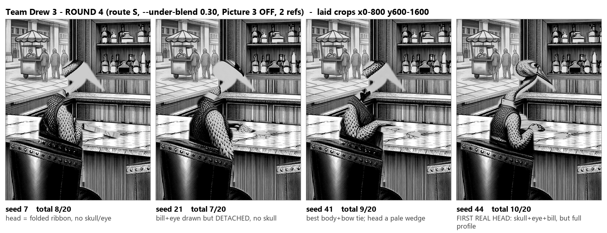

**The ask.** One contact sheet of the four round-4 laid crops with seed and total in the caption.

**The thinking.** Four seeds at the same settings so the head failure can be compared across them. The sheet is what shows the round's real result: seed 44 is the first render in four rounds with an actual skull, eye and bill, while 7, 21 and 41 still put a pale wedge or a detached bill above the collar - so the head fix is seed-dependent, not settled.

**Settings.** laid previews cropped x0-800 y600-1600 at 1x, seeds 7/21/41/44, route S, --under-blend 0.30, Picture 3 OFF

**Verdict.** Round 4 FAILS: best total 10/20 (seed 44), threshold is 17 with nothing below 4. Darkening the under-drawing did move the drawing - one seed in four now draws a real head, where round 3 drew none - but it did not settle it, and measurement shows the lever is now exhausted.

*Logged 17:37.*

---

