# The Swinging Door - studio report, 2026-09-08

Built for Rick. Every image the studio generated today, in the order it happened, with the ask that drove it, the thinking behind the decision, the exact prompt and settings, and the verdict. Images are in `images/`, prompts in `prompts/`.

## 001. whole-plate assembled with bartenders-marble-ledge back-bar-lower-shelf back-bar-upper-shelf back-bar-carcass television-blank chalkboard-blank window-frame-and-reveal window-glass-street-view main-bar-marble-counter left-leather-club-chair right-leather-club-chair and window-sign

**The thinking.** Base plus every approved, enabled part laid in order through its own silhouette; the TV's blank screen and the window's lettering are drawn in code last, because lettering is never left to the model.

*Logged 09:42.*

---

## 002. Monday: the founder's four decisions and the day's two teams - Drew into the scene (team Drew), the inlaid back bar (design round)

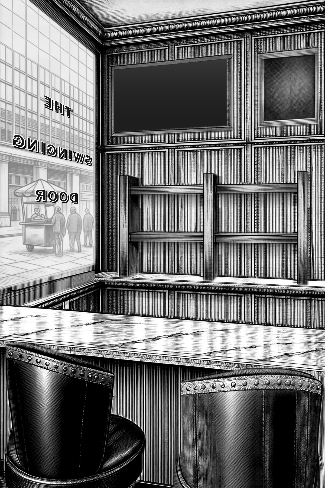

**The ask.** 1 b and c are actually from a we need to get that character into our scene today ... 2 its barclay ... 3 we need a inlaid shelf that has 2 rows of bottle and then an area to make drinks below it ... 4 get them all in the scene first ... build a team for each character

**The thinking.** Drew is the official portrait; the study script's rebuilt house recipe (edit model, portrait as the tile) becomes a placement script that edits a crop of the real room - Picture 1 - and keys the character out by what changed, so he becomes a layer like every other object. Team Drew: an Opus placer, rounds of six seeds, a Sonnet checklist judge and an Opus eye against the portrait and the staging the founder scored highest, up to five rounds; Barclay's and Abby's teams follow once Drew is verified. In parallel two Opus designers draw the inlaid back bar - set into the wall, two bottle rows, the drinks ledge beneath, its own interior, the wall untouched - for critics before any GPU. The chairs are back in the plate for the scene.

**Settings.** workflows drew-in-the-scene, inlaid-back-bar; chairs ON; Barclay's name provisional

**Verdict.** in progress

*Logged 09:44.*

---

## 003. Drew placed in the left chair, seed 41 - first cast-place round

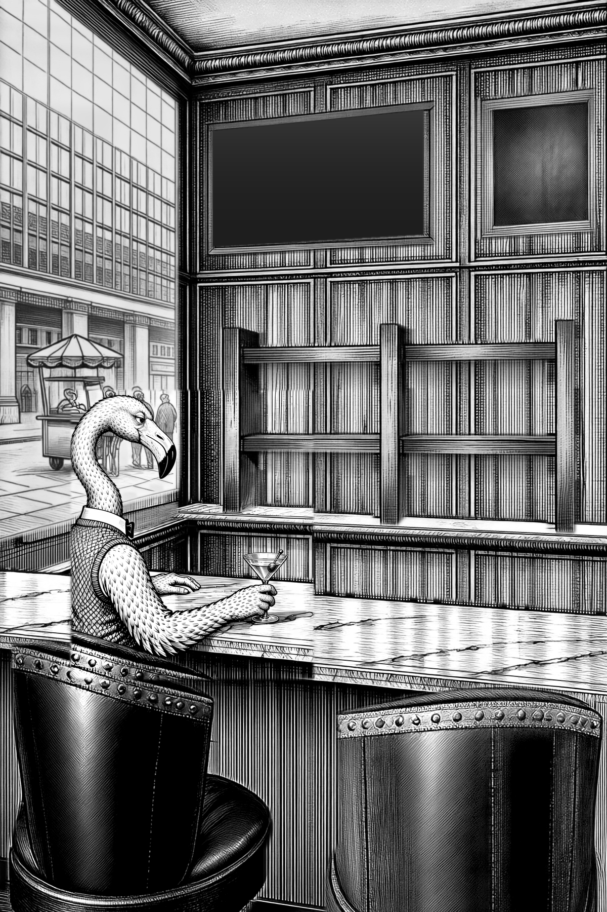

**The ask.** Get Drew into the approved room-kit v2 plate: build scripts/cast-place.py, test with Drew seed 41, and measure how clean the difference key is.

**The thinking.** cast-place.py crops plate.png 4:5 around the left chair (20,700-660,1500), upscales to 1344x1680 as Picture 1, sends studies/drew.png as Picture 2 ('copy THIS bird identically'), and asks for two edits only: ADD DREW seated in the left chair seen from behind and a little to his left, turned toward Barclay's chair; and keep everything else exactly as Picture 1 (stated FIRST, --keep-first). The result is tone-matched, aligned and difference-keyed against the crop, and the blob in the chair becomes an RGBA sticker laid on the approved plate. MEASUREMENT: the key is dirty and it cannot be otherwise - local_bridge.py _graph_qwen samples an EmptySD3LatentImage at denoise 1.0, so every pixel comes back drawn from noise. 80 percent of the crop differs from the plate by more than 12 levels after tone matching and alignment; it stays at 71-74 percent blurred at sigma 12, and local normalised cross-correlation between render and plate has a MEDIAN of 0.02, so the room is genuinely re-inked, not jittered. Raising the key threshold does not find the bird either - his white plumage sits on light marble, so the marble veins outrank him. What works is the geometry guard: the sticker may not leave the pose envelope from poses.json (140,770-620,1340), so the window, the far marble, the bar front and the right-hand chair are always the plate's own pixels. Drew reads correctly: three-quarter head, bill and eye toward the right chair, bow tie, sweater vest, feathered hand on the marble, martini.

**Settings.** local/qwen-image-edit-2511, fast Lightning 8-step cfg 1, 4:5 1344x1680, seed 41, 2 references (plate crop + studies/drew.png), key thresh 18 blur 1.5 close 4 open 3 feather 2, roi 140,770,620,1340

**Prompt.** [prompts/003-drew-placed-in-the-left-chair-seed-41-first-cast-place-round.prompt.txt](prompts/003-drew-placed-in-the-left-chair-seed-41-first-cast-place-round.prompt.txt)

**Verdict.** USABLE as round 1 and the method is proved: Drew is in the approved chair at the right scale in the right room. Not final - he sits a little high and left of the seat centre, the chair's studded roll does not cross his lower back (he reads as floating just in front of the chair), and the sticker carries a patch of the model's own marble under his hands whose white does not quite match the plate's. Cleanliness 0.796 outside the sticker: that number is the model re-inking the room, not a prompt fault, and the sticker route is what makes it harmless.

*Logged 10:29.*

---

## 004. the inlaid back bar, design round: the flush inlay (two bottle rows in a recess cut into the wall, its own boarded lining) chosen over a cabinet that read as a box; two fixes before any render

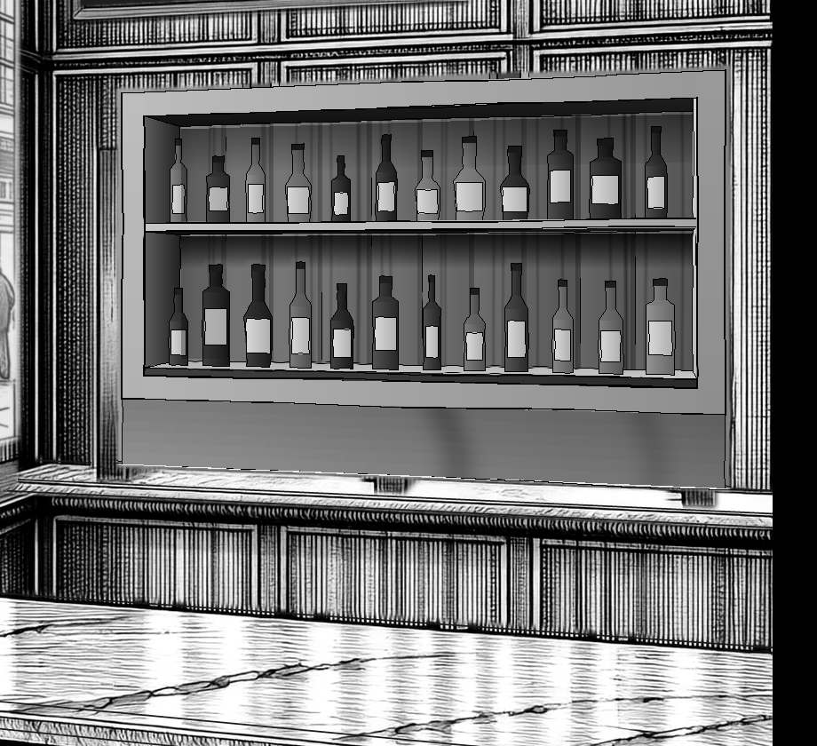

**The ask.** we need a inlaid shelf that has 2 rows of bottle and then an area to make drinks below it on the bartenders bar make sure it looks inlaid into the wall dont messup the walls look or carry the walls look into the shelf

**The thinking.** Two Opus designers, two critics each. The flush inlay cuts the opening into the panelling with one slim flat band in the wall plane, lines the recess with plain vertical walnut boards in a calmer darker tone than the wall, and stands two rows of bottles on 3 cm shelves inside it, the marble ledge running under as the drinks area; the cabinet variant carried a proud cornice and lid and read as a box hung on the wall. The critics' one serious objection to the inlay was a flat grey splashback painted over the finished panelling between the recess and the ledge - exactly the wall the founder said not to touch - plus black joint lines that would read as wires across the bottles. Those two fixes are being applied before the first render.

**Settings.** workflows inlaid-back-bar (I1-flush, I2-cabinet, two critics each) and inlaid-i1-fixes; bottle parts back ON in the copy

**Verdict.** I1 chosen; render after the fixes

*Logged 10:56.*

---

## 005. back-bar-carcass and back-bar-lower-shelf and bottles-on-lower-shelf and bottles-on-upper-shelf and back-bar-upper-shelf render seed 7 laid in full plate

**The thinking.** Rendered in context - the plate as it stands behind this part, with only this part's own silhouette blocked in as values - so the pen, light and perspective are inherited; only the mask is laid back. Part note: the back bar's INLAID RECESS: a wide rectangular opening CUT INTO the panelled walnut wall above the marble ledge, its face frame ONE slim FLAT walnut band lying FLUSH with the panelling - no architrave, no bolection, no bead, nothing standing proud of the wall, just a plain flat band with a fine dark joint line where it meets the panelling - and the inside of the cut LINED WITH PLAIN VERTICAL WALNUT BOARDS, quiet, close-grained, a little darker and calmer than the wall, with NO raised-and-fielded panels, NO mouldings and NO frame inside the frame; a deep dark soffit across its head, the left reveal returning back into the wall in shadow, a bright arris down the right-hand edge of the opening, and BENEATH THE FRAME THE WALL'S OWN PANELLING RUNNING ON UNTOUCHED down to the marble ledge - the unit stops dead at its own bottom rail, there is no splashback and no panel of its own below it. This is JOINERY AND A HOLE IN A WALL - it is NEVER a picture, a painting, a mirror, a window, a doorway, a poster, a screen, a television or an empty dark panel AND the lower shelf inside the inlaid recess: a plain 3 cm walnut board running the full width of the opening from reveal to reveal, and it IS THE FLOOR OF THE RECESS - nothing shows beneath it. Seen from a little above, so its polished top catches the daylight and a dark square front edge runs under it - wood, not marble, not stone, and no bracket, no moulding, no nosing AND the row of liquor bottles standing on the lower shelf of the inlaid recess, well in front of its boarded back: varied heights and shapes, clear and dark glass, plain blank paper labels with NO lettering AND the row of liquor bottles standing on the upper shelf of the inlaid recess, well in front of its boarded back: varied heights and shapes, clear and dark glass, plain blank paper labels with NO lettering AND the upper shelf inside the inlaid recess: a plain 3 cm walnut board running the full width of the opening from reveal to reveal, seen from BELOW so its bright front edge stands over its own dark underside, and throwing a soft shadow down the boarded back of the recess beneath it

**Settings.** local/sensenova-u1.5, seed 7, full 40 steps cfg 4, rendered together with shelf-lower, bottles-lower, bottles-upper, shelf-upper, negative: television, screen, monitor, black rectangle, picture, frame, poster, sign, lettering, bottles, glasses, mirror, mirrored panel, glass panel, white panel, lightbox, frosted glass, window, arch, arched opening, arcade, doors, cupboard doors, glazed doors, french doors, mullion, curtain, blur, smear, bartender, terrier, dog, person, figure, woman, character, chair, stool, seat, barstool, chalkboard, blackboard, framed board, picture, frame, dog, retriever, person, figure, man, character, flamingo, bird, person, figure, man, character, lamp, sconce, light fixture, television, screen, monitor, flat screen

**Prompt.** [prompts/005-back-bar-carcass-and-back-bar-lower-shelf-and-bottles-on-lower-shelf-and-bottles-on-upper-shelf-and-back-bar-u.prompt.txt](prompts/005-back-bar-carcass-and-back-bar-lower-shelf-and-bottles-on-lower-shelf-and-bottles-on-upper-shelf-and-back-bar-u.prompt.txt)

*Logged 12:08.*

---

## 006. back-bar-carcass and back-bar-lower-shelf and bottles-on-lower-shelf and bottles-on-upper-shelf and back-bar-upper-shelf render seed 21 laid in full plate

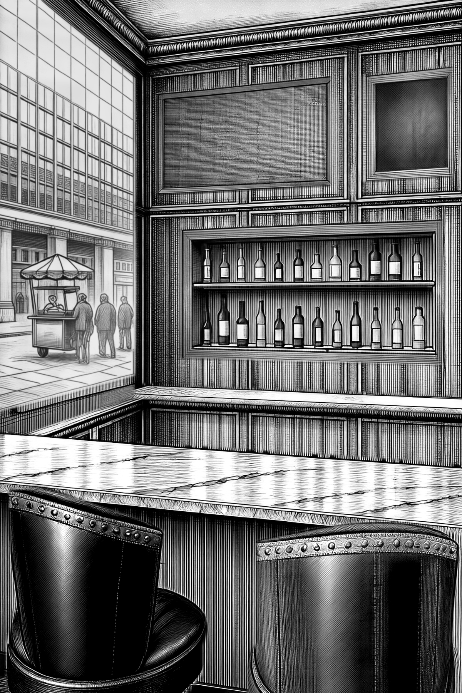

**The thinking.** Rendered in context - the plate as it stands behind this part, with only this part's own silhouette blocked in as values - so the pen, light and perspective are inherited; only the mask is laid back. Part note: the back bar's INLAID RECESS: a wide rectangular opening CUT INTO the panelled walnut wall above the marble ledge, its face frame ONE slim FLAT walnut band lying FLUSH with the panelling - no architrave, no bolection, no bead, nothing standing proud of the wall, just a plain flat band with a fine dark joint line where it meets the panelling - and the inside of the cut LINED WITH PLAIN VERTICAL WALNUT BOARDS, quiet, close-grained, a little darker and calmer than the wall, with NO raised-and-fielded panels, NO mouldings and NO frame inside the frame; a deep dark soffit across its head, the left reveal returning back into the wall in shadow, a bright arris down the right-hand edge of the opening, and BENEATH THE FRAME THE WALL'S OWN PANELLING RUNNING ON UNTOUCHED down to the marble ledge - the unit stops dead at its own bottom rail, there is no splashback and no panel of its own below it. This is JOINERY AND A HOLE IN A WALL - it is NEVER a picture, a painting, a mirror, a window, a doorway, a poster, a screen, a television or an empty dark panel AND the lower shelf inside the inlaid recess: a plain 3 cm walnut board running the full width of the opening from reveal to reveal, and it IS THE FLOOR OF THE RECESS - nothing shows beneath it. Seen from a little above, so its polished top catches the daylight and a dark square front edge runs under it - wood, not marble, not stone, and no bracket, no moulding, no nosing AND the row of liquor bottles standing on the lower shelf of the inlaid recess, well in front of its boarded back: varied heights and shapes, clear and dark glass, plain blank paper labels with NO lettering AND the row of liquor bottles standing on the upper shelf of the inlaid recess, well in front of its boarded back: varied heights and shapes, clear and dark glass, plain blank paper labels with NO lettering AND the upper shelf inside the inlaid recess: a plain 3 cm walnut board running the full width of the opening from reveal to reveal, seen from BELOW so its bright front edge stands over its own dark underside, and throwing a soft shadow down the boarded back of the recess beneath it

**Settings.** local/sensenova-u1.5, seed 21, full 40 steps cfg 4, rendered together with shelf-lower, bottles-lower, bottles-upper, shelf-upper, negative: television, screen, monitor, black rectangle, picture, frame, poster, sign, lettering, bottles, glasses, mirror, mirrored panel, glass panel, white panel, lightbox, frosted glass, window, arch, arched opening, arcade, doors, cupboard doors, glazed doors, french doors, mullion, curtain, blur, smear, bartender, terrier, dog, person, figure, woman, character, chair, stool, seat, barstool, chalkboard, blackboard, framed board, picture, frame, dog, retriever, person, figure, man, character, flamingo, bird, person, figure, man, character, lamp, sconce, light fixture, television, screen, monitor, flat screen

**Prompt.** [prompts/006-back-bar-carcass-and-back-bar-lower-shelf-and-bottles-on-lower-shelf-and-bottles-on-upper-shelf-and-back-bar-u.prompt.txt](prompts/006-back-bar-carcass-and-back-bar-lower-shelf-and-bottles-on-lower-shelf-and-bottles-on-upper-shelf-and-back-bar-u.prompt.txt)

*Logged 12:09.*

---

## 007. whole-plate assembled with bartenders-marble-ledge back-bar-carcass back-bar-lower-shelf bottles-on-lower-shelf bottles-on-upper-shelf back-bar-upper-shelf television-blank chalkboard-blank window-frame-and-reveal window-glass-street-view main-bar-marble-counter left-leather-club-chair right-leather-club-chair and window-sign

**The thinking.** Base plus every approved, enabled part laid in order through its own silhouette; the TV's blank screen and the window's lettering are drawn in code last, because lettering is never left to the model.

*Logged 12:10.*

---

## 008. whole-plate assembled with bartenders-marble-ledge back-bar-carcass back-bar-lower-shelf bottles-on-lower-shelf bottles-on-upper-shelf back-bar-upper-shelf television-blank chalkboard-blank window-frame-and-reveal window-glass-street-view main-bar-marble-counter left-leather-club-chair right-leather-club-chair and window-sign

**The thinking.** Base plus every approved, enabled part laid in order through its own silhouette; the TV's blank screen and the window's lettering are drawn in code last, because lettering is never left to the model.

*Logged 12:10.*

---

## 009. whole-plate assembled with bartenders-marble-ledge back-bar-carcass back-bar-lower-shelf bottles-on-lower-shelf bottles-on-upper-shelf back-bar-upper-shelf television-blank chalkboard-blank window-frame-and-reveal window-glass-street-view main-bar-marble-counter left-leather-club-chair right-leather-club-chair and window-sign

**The thinking.** Base plus every approved, enabled part laid in order through its own silhouette; the TV's blank screen and the window's lettering are drawn in code last, because lettering is never left to the model.

*Logged 12:10.*

---

## 010. whole-plate assembled with bartenders-marble-ledge back-bar-carcass back-bar-lower-shelf bottles-on-lower-shelf bottles-on-upper-shelf back-bar-upper-shelf television-blank chalkboard-blank window-frame-and-reveal window-glass-street-view main-bar-marble-counter left-leather-club-chair right-leather-club-chair and window-sign

**The thinking.** Base plus every approved, enabled part laid in order through its own silhouette; the TV's blank screen and the window's lettering are drawn in code last, because lettering is never left to the model.

*Logged 12:11.*

---

## 011. whole-plate assembled with bartenders-marble-ledge back-bar-carcass back-bar-lower-shelf bottles-on-lower-shelf bottles-on-upper-shelf back-bar-upper-shelf television-blank chalkboard-blank window-frame-and-reveal window-glass-street-view main-bar-marble-counter left-leather-club-chair right-leather-club-chair and window-sign

**The thinking.** Base plus every approved, enabled part laid in order through its own silhouette; the TV's blank screen and the window's lettering are drawn in code last, because lettering is never left to the model.

*Logged 12:11.*

---

## 012. the inlaid back bar rendered and approved into the plate: two rows of bottles in a recess cut into the wall, the drinks ledge beneath, the wall untouched (seed 7)

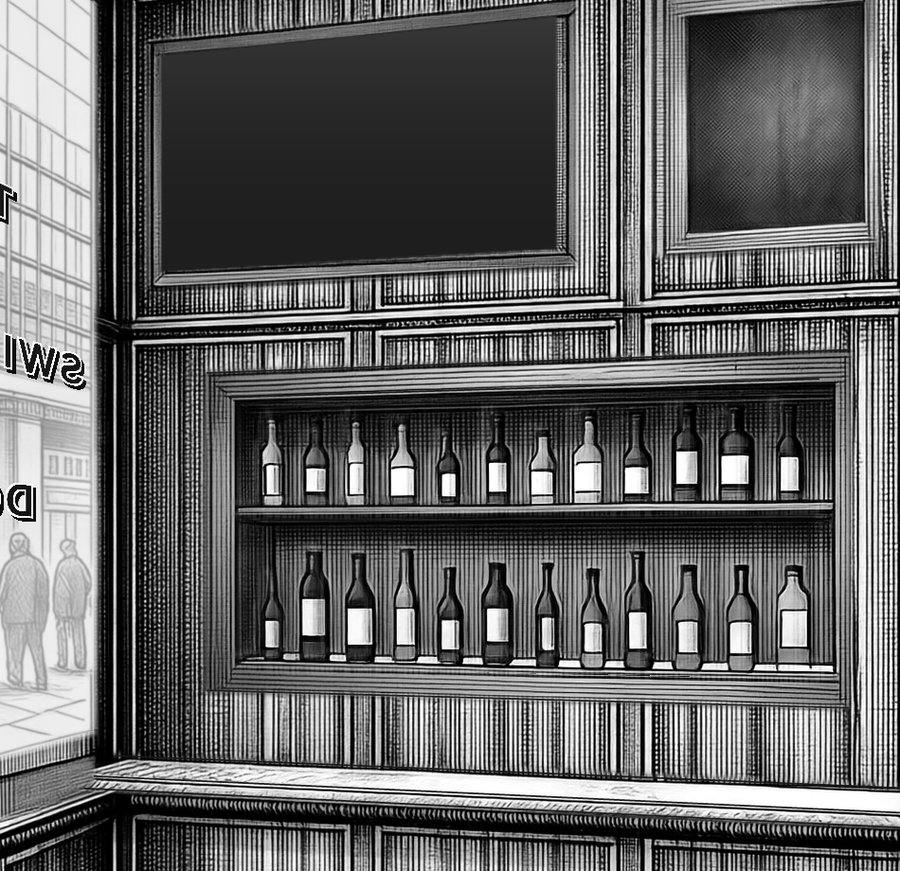

**The ask.** we need a inlaid shelf that has 2 rows of bottle and then an area to make drinks below it on the bartenders bar make sure it looks inlaid into the wall dont messup the walls look or carry the walls look into the shelf

**The thinking.** Rendered as one candidate for the carcass, both shelves and both bottle rows so they share one pen. Seed 7: the flat frame lies in the wall plane, the recess reads as a hole with its own boarded lining, twelve blank-labelled bottles per row stand on two thin shelves, and the panelling runs untouched round the frame and down to the marble ledge. Approved into the plate so the cast is placed against the real back bar; the founder's verdict decides whether it stays. The first attempt at this render failed because ComfyUI stalled under the cast team's load and the bridge tried to start a second instance on the same port; it recovered on its own.

**Settings.** construction inlaid-I1 (fixes applied); render backbar --with shelf-lower shelf-upper bottles-lower bottles-upper seeds 7, 21; approve all five from seed 7; build

**Verdict.** in the plate - for the founder's approval

*Logged 12:11.*

---

## 013. FOUNDER APPROVED the inlaid back bar - next: clean the wood grain round the shelf and rebuild the bottles (real shapes and sizes, at least half full, real labels)

**The ask.** i love those shelves if you could clean up the wood grain around the shelf and improve the bottles drastically they should look like they have real labels like real liquor bottles they should have different shapes and sizes and they should all be at least half full

**The thinking.** The recess stays. The bottles become a proper design: eight real liquor silhouettes at true sizes with fill lines never below half and label patches of varied shape, exported as page quads so the house brands are typeset onto them in code after the render - lettering is never left to the model - and the recess lining is redrawn to render as polished walnut rather than reeding. A design team with two critics goes first; the lead renders after.

**Settings.** workflow bottles-and-lining (opus design, sonnet label-bottles.py, two critics)

**Verdict.** founder: approved the shelves; bottles and lining in work

*Logged 12:17.*

---

## 014. Drew into the room - ROUTE A flat field, seed 41, laid on the approved plate

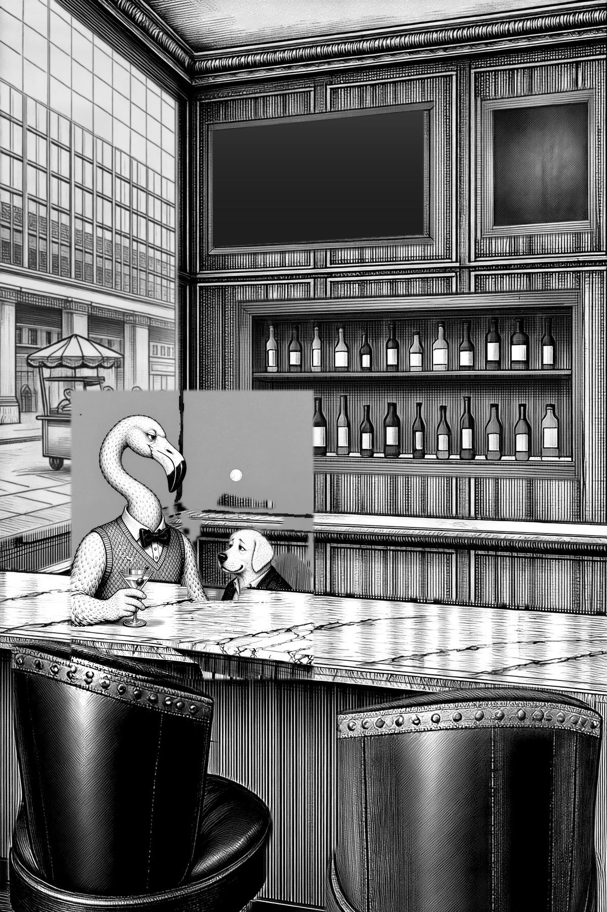

**The ask.** Get Drew into the approved room-kit v2 plate, in the LEFT club chair, staged as the founder pinned it on 2026-09-08: seen from behind and a little to his left, the knit of the sweater vest across his shoulder blades, the chair's leather roll on his lower back, the neck in its S, the head turned RIGHT to the other chair so bill and lidded eye read in profile, the near feathered hand on the marble. Never a front view. Two keying routes were built into scripts/cast-place.py and compared head to head at seed 41 and seed 7.

**The thinking.** ROUTE A hands the model a Picture 1 in which everything except the left club chair, the marble counter top and the wall's silhouette lines has been flattened to a featureless mid-grey 140, so the chair is the only anchor and there is no room left for the model to re-ink. What comes back that is not flat grey is then the bird: the difference key runs against that flat field, is clipped to the window round the seat, and only that sticker is laid onto the REAL plate, so the room in the picture is always the plate's own pixels. The field premise held - the model did keep the grey empty - but with the room gone it also lost the camera: it rescaled the set, moved Drew to the far side of the marble facing us, and imported the dog out of Picture 3 (duo-behind.png has a dog in it). 12.4% of the plate was replaced; the seam measures 40 grey levels.

**Settings.** scripts/cast-place.py --character drew --seed 41 --route A | local/qwen-image-edit-2511, fast 8-step cfg 1, 4:5 1344x1680 | Picture 1 = flat field (chair 18.5%, marble 13.4%, lines 3.0%, flat 67.1%), Picture 2 = studies/drew.png, Picture 3 = studies/duo-behind.png | key vs flat-field, thresh 18, roi 140,770,620,1340 | join 40.19 levels, plate replaced 0.1240, cleanliness 0.8372, 50.6s

**Prompt.** [prompts/014-drew-into-the-room-route-a-flat-field-seed-41-laid-on-the-approved-plate.prompt.txt](prompts/014-drew-into-the-room-route-a-flat-field-seed-41-laid-on-the-approved-plate.prompt.txt)

**Verdict.** REJECT the picture, KEEP the route. Front view, wrong scale, a dog that came out of Picture 3 - but the join is the softest of the four and the approved room survives everywhere outside the sticker.

*Logged 14:01.*

---

## 015. Drew into the room - ROUTE A flat field, seed 7, laid on the approved plate

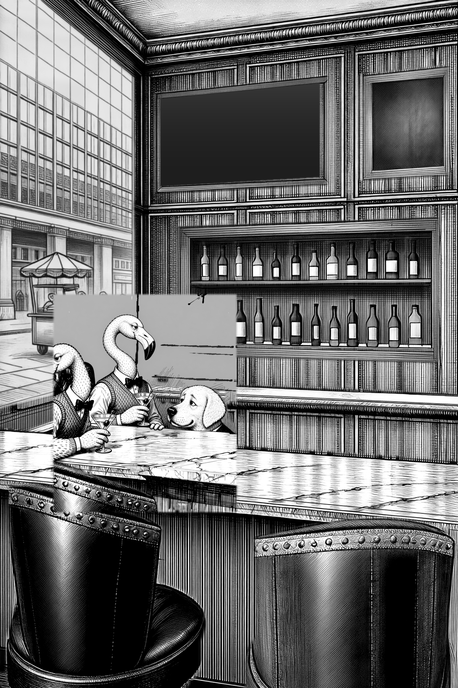

**The ask.** Get Drew into the approved room-kit v2 plate, in the LEFT club chair, staged as the founder pinned it on 2026-09-08: seen from behind and a little to his left, the knit of the sweater vest across his shoulder blades, the chair's leather roll on his lower back, the neck in its S, the head turned RIGHT to the other chair so bill and lidded eye read in profile, the near feathered hand on the marble. Never a front view. Two keying routes were built into scripts/cast-place.py and compared head to head at seed 41 and seed 7.

**The thinking.** The same flat field at a second seed, to see whether seed 41's front view was the seed or the route. It was the route's blind spot, not the seed: with the room flattened away the model again lost the camera, drew TWO flamingos and the dog from Picture 3, all facing us across the marble, and the key handed back a slab of the flat grey along with them. Note what did NOT go wrong: the grey stayed grey. The model obeyed EDIT 2 and invented no room in the field, which is what makes the difference key honest at all - the 0.90 cleanliness number here is the model MOVING the chair and the marble, not re-inking them.

**Settings.** scripts/cast-place.py --character drew --seed 7 --route A | same recipe as seed 41 | join 41.11 levels, plate replaced 0.1298, cleanliness 0.9010, 52.5s

**Prompt.** [prompts/015-drew-into-the-room-route-a-flat-field-seed-7-laid-on-the-approved-plate.prompt.txt](prompts/015-drew-into-the-room-route-a-flat-field-seed-7-laid-on-the-approved-plate.prompt.txt)

**Verdict.** REJECT the picture. Two birds and a dog, all front on. Same conclusion as seed 41: the route is sound, the staging reference is what is poisoning it.

*Logged 14:01.*

---

## 016. Drew into the room - ROUTE B whole crop, seed 41, laid on the approved plate

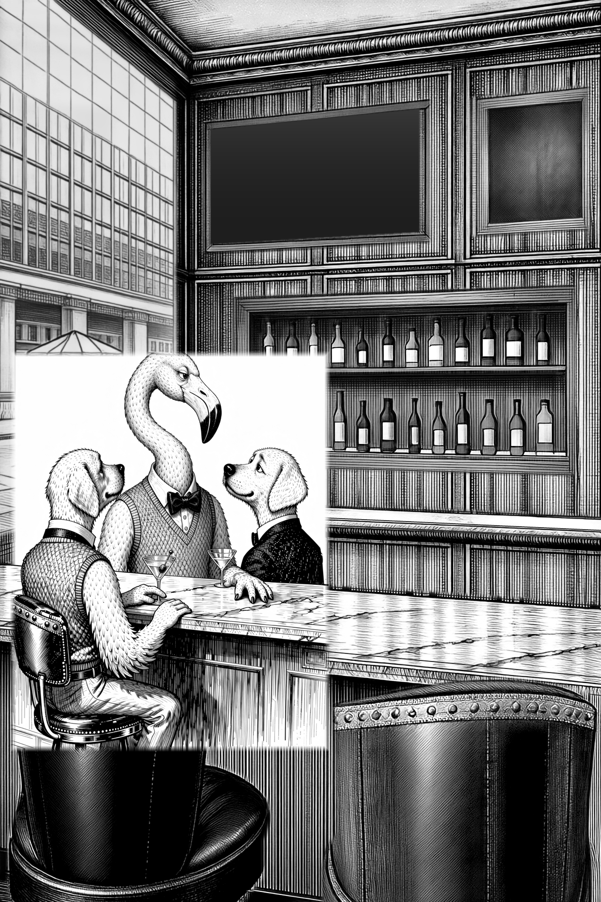

**The ask.** Get Drew into the approved room-kit v2 plate, in the LEFT club chair, staged as the founder pinned it on 2026-09-08: seen from behind and a little to his left, the knit of the sweater vest across his shoulder blades, the chair's leather roll on his lower back, the neck in its S, the head turned RIGHT to the other chair so bill and lidded eye read in profile, the near feathered hand on the marble. Never a front view. Two keying routes were built into scripts/cast-place.py and compared head to head at seed 41 and seed 7.

**The thinking.** ROUTE B is the opposite bet: Picture 1 is the plate crop exactly as it is, and the whole rendered crop goes back onto the plate with a 12px feathered border and no key at all, on the theory that the model keeps the room's LOOK and a figure that is never cut out can never have an edge. It does not survive contact: the model returned the group on a blown-out white ground, so the paste is a hard bright rectangle sitting in the middle of the engraved room, twice as much of the plate is thrown away as on route A, and there is no way to keep only the good part - a bad render is pasted whole. Drew is square to the camera with his bow tie facing us, flanked by two dogs; the one figure staged the way the founder asked - from behind, over the shoulder, on the studded chair - is a DOG on the left.

**Settings.** scripts/cast-place.py --character drew --seed 41 --route B | same model and references | no key, paste feather 12px | join 64.60 levels, plate replaced 0.2370, room re-inked 0.9056, 52.6s

**Prompt.** [prompts/016-drew-into-the-room-route-b-whole-crop-seed-41-laid-on-the-approved-plate.prompt.txt](prompts/016-drew-into-the-room-route-b-whole-crop-seed-41-laid-on-the-approved-plate.prompt.txt)

**Verdict.** REJECT, and reject the route. The join is a visible white block: 65 grey levels at the seam against route A's 40.

*Logged 14:01.*

---

## 017. Drew into the room - ROUTE B whole crop, seed 7, laid on the approved plate

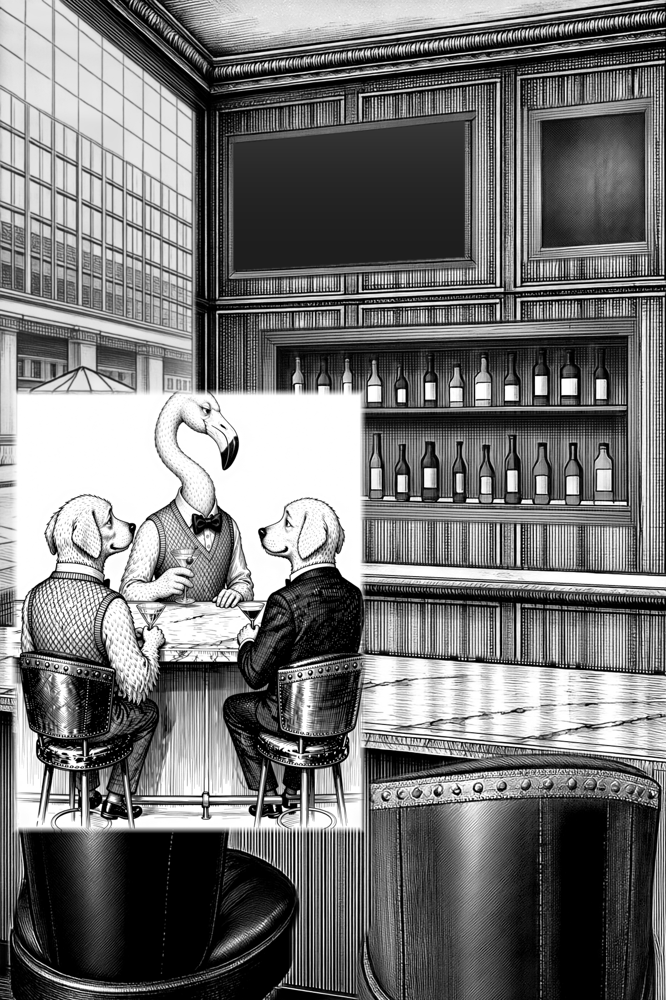

**The ask.** Get Drew into the approved room-kit v2 plate, in the LEFT club chair, staged as the founder pinned it on 2026-09-08: seen from behind and a little to his left, the knit of the sweater vest across his shoulder blades, the chair's leather roll on his lower back, the neck in its S, the head turned RIGHT to the other chair so bill and lidded eye read in profile, the near feathered hand on the marble. Never a front view. Two keying routes were built into scripts/cast-place.py and compared head to head at seed 41 and seed 7.

**The thinking.** Route B's second seed, and the worst of the four: three figures on bar stools round a small round table, Drew front on in the middle between two dogs, the whole thing on white paper and pasted as a hard rectangle across the approved marble. Every one of the four renders imported the dog, and the dog is in Picture 3 - duo-behind.png is a flamingo AND a labrador at the marble. The staging reference the founder scored highest is the right camera and the wrong cast; the next round should crop Picture 3 to the flamingo alone before anything else is changed.

**Settings.** scripts/cast-place.py --character drew --seed 7 --route B | same recipe as seed 41 | join 71.52 levels, plate replaced 0.2370, room re-inked 0.9330, 52.5s

**Prompt.** [prompts/017-drew-into-the-room-route-b-whole-crop-seed-7-laid-on-the-approved-plate.prompt.txt](prompts/017-drew-into-the-room-route-b-whole-crop-seed-7-laid-on-the-approved-plate.prompt.txt)

**Verdict.** REJECT. Worst join of the four at 71.5 levels and the furthest from the pinned staging.

*Logged 14:01.*

---

## 018. back-bar-carcass and back-bar-lower-shelf and bottles-on-lower-shelf and bottles-on-upper-shelf and back-bar-upper-shelf render seed 21 laid in full plate

**The thinking.** Rendered in context - the plate as it stands behind this part, with only this part's own silhouette blocked in as values - so the pen, light and perspective are inherited; only the mask is laid back. Part note: the back bar's INLAID RECESS: a wide rectangular opening CUT INTO the panelled walnut wall above the marble ledge, its face frame ONE slim FLAT walnut band lying FLUSH with the panelling - no architrave, no bolection, no bead, nothing standing proud of the wall, just a plain flat band with a fine dark joint line where it meets the panelling - and the inside of the cut LINED WITH PLAIN VERTICAL WALNUT BOARDS, quiet, close-grained, a little darker and calmer than the wall, with NO raised-and-fielded panels, NO mouldings and NO frame inside the frame; a deep dark soffit across its head, the left reveal returning back into the wall in shadow, a bright arris down the right-hand edge of the opening, and BENEATH THE FRAME THE WALL'S OWN PANELLING RUNNING ON UNTOUCHED down to the marble ledge - the unit stops dead at its own bottom rail, there is no splashback and no panel of its own below it. This is JOINERY AND A HOLE IN A WALL - it is NEVER a picture, a painting, a mirror, a window, a doorway, a poster, a screen, a television or an empty dark panel. The lining boards and the face band are SMOOTH POLISHED WALNUT, SPARSE SOFT FIGURE, NO REEDING, NO FLUTING, NO FINE PARALLEL STRIPING - a few broad soft sweeps of grain in a wide board, and the flat face band plain AND the lower shelf inside the inlaid recess: a plain 3 cm walnut board running the full width of the opening from reveal to reveal, and it IS THE FLOOR OF THE RECESS - nothing shows beneath it. Seen from a little above, so its polished top catches the daylight and a dark square front edge runs under it - wood, not marble, not stone, and no bracket, no moulding, no nosing AND the row of EIGHT real liquor bottles standing on the lower shelf of the inlaid recess, well in front of its boarded back: REAL BOTTLES OF DIFFERENT SHAPES AND SIZES, FEW AND BIG, NO TWO NEIGHBOURS ALIKE - among them a square-shouldered bourbon, a tall round-shouldered scotch, a broad squat rum, a SQUARE GIN FLASK with parallel sides and a sharp shoulder, a bulbous decanter-like rye, a tall slim vodka, a broad-shouldered whiskey and a wide-shouldered tequila - each with its own neck, its own shoulder and its own closure, a foil capsule under a dark screw cap or a taller cork stopper. Clear glass is pale with a bright highlight down its window side; the dark spirits are deep warm amber, glassy, and both read CLEARLY LIGHTER than the dark boards behind them. EVERY BOTTLE IS AT LEAST HALF FULL AND NO TWO TO THE SAME LEVEL: the liquid inside is DARKER than the empty glass above it and the two meet at a clean horizontal FILL LINE across the bottle. Each bottle STANDS ON THE BOARD, with a small dark pool of contact shadow at its foot and a soft shadow thrown up the boarding behind it, leaning away from the window at frame-left. Each bottle wears ONE paper label, and their shapes differ - rectangles, wrap-around bands, ovals, shields - lighter than the glass, with a crisp edge. THE LABELS ARE BLANK: no lettering, no words, no letters, no numerals, no pseudo-text of any kind - the brand names are typeset onto them in code afterwards, exactly as the window is gilded AND the row of SIX real liquor bottles standing on the upper shelf of the inlaid recess, well in front of its boarded back: REAL BOTTLES OF DIFFERENT SHAPES AND SIZES, FEW AND BIG, NO TWO NEIGHBOURS ALIKE - among them a square-shouldered bourbon, a tall round-shouldered scotch, a broad squat rum, a SQUARE GIN FLASK with parallel sides and a sharp shoulder, a bulbous decanter-like rye, a tall slim vodka, a broad-shouldered whiskey and a wide-shouldered tequila - each with its own neck, its own shoulder and its own closure, a foil capsule under a dark screw cap or a taller cork stopper. Clear glass is pale with a bright highlight down its window side; the dark spirits are deep warm amber, glassy, and both read CLEARLY LIGHTER than the dark boards behind them. EVERY BOTTLE IS AT LEAST HALF FULL AND NO TWO TO THE SAME LEVEL: the liquid inside is DARKER than the empty glass above it and the two meet at a clean horizontal FILL LINE across the bottle. Each bottle STANDS ON THE BOARD, with a small dark pool of contact shadow at its foot and a soft shadow thrown up the boarding behind it, leaning away from the window at frame-left. Each bottle wears ONE paper label, and their shapes differ - rectangles, wrap-around bands, ovals, shields - lighter than the glass, with a crisp edge. THE LABELS ARE BLANK: no lettering, no words, no letters, no numerals, no pseudo-text of any kind - the brand names are typeset onto them in code afterwards, exactly as the window is gilded AND the upper shelf inside the inlaid recess: a plain 3 cm walnut board running the full width of the opening from reveal to reveal, seen from BELOW so its bright front edge stands over its own dark underside, and throwing a soft shadow down the boarded back of the recess beneath it

**Settings.** local/sensenova-u1.5, seed 21, full 40 steps cfg 4, rendered together with shelf-lower, bottles-lower, bottles-upper, shelf-upper, negative: television, screen, monitor, black rectangle, picture, frame, poster, sign, lettering, bottles, glasses, mirror, mirrored panel, glass panel, white panel, lightbox, frosted glass, window, arch, arched opening, arcade, doors, cupboard doors, glazed doors, french doors, mullion, curtain, blur, smear, bartender, terrier, dog, person, figure, woman, character, chair, stool, seat, barstool, chalkboard, blackboard, framed board, picture, frame, dog, retriever, person, figure, man, character, flamingo, bird, person, figure, man, character, lamp, sconce, light fixture, television, screen, monitor, flat screen

**Prompt.** [prompts/018-back-bar-carcass-and-back-bar-lower-shelf-and-bottles-on-lower-shelf-and-bottles-on-upper-shelf-and-back-bar-u.prompt.txt](prompts/018-back-bar-carcass-and-back-bar-lower-shelf-and-bottles-on-lower-shelf-and-bottles-on-upper-shelf-and-back-bar-u.prompt.txt)

*Logged 14:13.*

---

## 019. back-bar-carcass and back-bar-lower-shelf and bottles-on-lower-shelf and bottles-on-upper-shelf and back-bar-upper-shelf render seed 7 laid in full plate

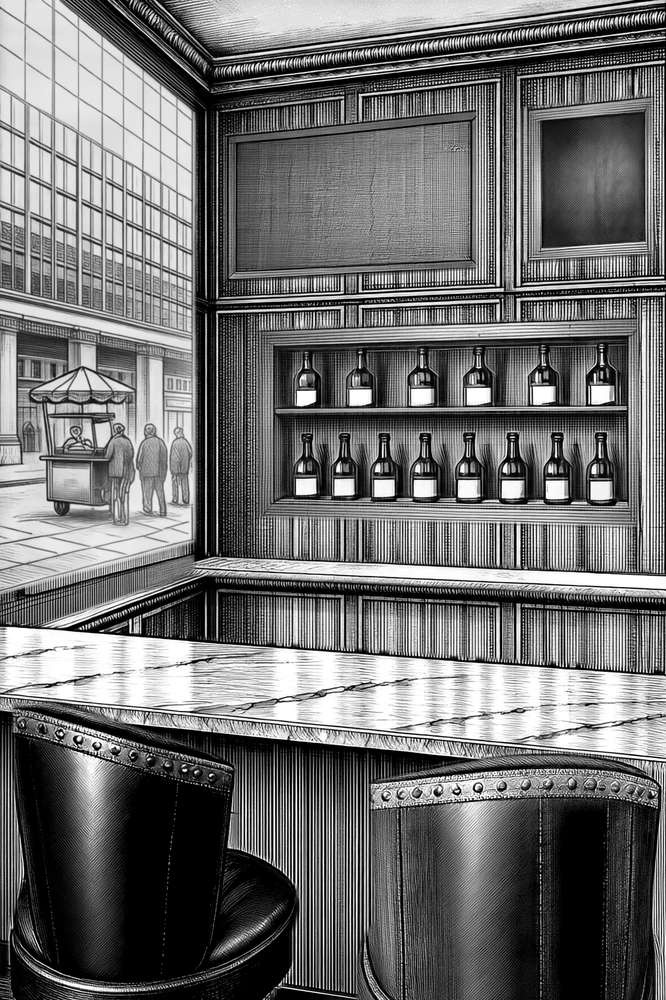

**The thinking.** Rendered in context - the plate as it stands behind this part, with only this part's own silhouette blocked in as values - so the pen, light and perspective are inherited; only the mask is laid back. Part note: the back bar's INLAID RECESS: a wide rectangular opening CUT INTO the panelled walnut wall above the marble ledge, its face frame ONE slim FLAT walnut band lying FLUSH with the panelling - no architrave, no bolection, no bead, nothing standing proud of the wall, just a plain flat band with a fine dark joint line where it meets the panelling - and the inside of the cut LINED WITH PLAIN VERTICAL WALNUT BOARDS, quiet, close-grained, a little darker and calmer than the wall, with NO raised-and-fielded panels, NO mouldings and NO frame inside the frame; a deep dark soffit across its head, the left reveal returning back into the wall in shadow, a bright arris down the right-hand edge of the opening, and BENEATH THE FRAME THE WALL'S OWN PANELLING RUNNING ON UNTOUCHED down to the marble ledge - the unit stops dead at its own bottom rail, there is no splashback and no panel of its own below it. This is JOINERY AND A HOLE IN A WALL - it is NEVER a picture, a painting, a mirror, a window, a doorway, a poster, a screen, a television or an empty dark panel. The lining boards and the face band are SMOOTH POLISHED WALNUT, SPARSE SOFT FIGURE, NO REEDING, NO FLUTING, NO FINE PARALLEL STRIPING - a few broad soft sweeps of grain in a wide board, and the flat face band plain AND the lower shelf inside the inlaid recess: a plain 3 cm walnut board running the full width of the opening from reveal to reveal, and it IS THE FLOOR OF THE RECESS - nothing shows beneath it. Seen from a little above, so its polished top catches the daylight and a dark square front edge runs under it - wood, not marble, not stone, and no bracket, no moulding, no nosing AND the row of EIGHT real liquor bottles standing on the lower shelf of the inlaid recess, well in front of its boarded back: REAL BOTTLES OF DIFFERENT SHAPES AND SIZES, FEW AND BIG, NO TWO NEIGHBOURS ALIKE - among them a square-shouldered bourbon, a tall round-shouldered scotch, a broad squat rum, a SQUARE GIN FLASK with parallel sides and a sharp shoulder, a bulbous decanter-like rye, a tall slim vodka, a broad-shouldered whiskey and a wide-shouldered tequila - each with its own neck, its own shoulder and its own closure, a foil capsule under a dark screw cap or a taller cork stopper. Clear glass is pale with a bright highlight down its window side; the dark spirits are deep warm amber, glassy, and both read CLEARLY LIGHTER than the dark boards behind them. EVERY BOTTLE IS AT LEAST HALF FULL AND NO TWO TO THE SAME LEVEL: the liquid inside is DARKER than the empty glass above it and the two meet at a clean horizontal FILL LINE across the bottle. Each bottle STANDS ON THE BOARD, with a small dark pool of contact shadow at its foot and a soft shadow thrown up the boarding behind it, leaning away from the window at frame-left. Each bottle wears ONE paper label, and their shapes differ - rectangles, wrap-around bands, ovals, shields - lighter than the glass, with a crisp edge. THE LABELS ARE BLANK: no lettering, no words, no letters, no numerals, no pseudo-text of any kind - the brand names are typeset onto them in code afterwards, exactly as the window is gilded AND the row of SIX real liquor bottles standing on the upper shelf of the inlaid recess, well in front of its boarded back: REAL BOTTLES OF DIFFERENT SHAPES AND SIZES, FEW AND BIG, NO TWO NEIGHBOURS ALIKE - among them a square-shouldered bourbon, a tall round-shouldered scotch, a broad squat rum, a SQUARE GIN FLASK with parallel sides and a sharp shoulder, a bulbous decanter-like rye, a tall slim vodka, a broad-shouldered whiskey and a wide-shouldered tequila - each with its own neck, its own shoulder and its own closure, a foil capsule under a dark screw cap or a taller cork stopper. Clear glass is pale with a bright highlight down its window side; the dark spirits are deep warm amber, glassy, and both read CLEARLY LIGHTER than the dark boards behind them. EVERY BOTTLE IS AT LEAST HALF FULL AND NO TWO TO THE SAME LEVEL: the liquid inside is DARKER than the empty glass above it and the two meet at a clean horizontal FILL LINE across the bottle. Each bottle STANDS ON THE BOARD, with a small dark pool of contact shadow at its foot and a soft shadow thrown up the boarding behind it, leaning away from the window at frame-left. Each bottle wears ONE paper label, and their shapes differ - rectangles, wrap-around bands, ovals, shields - lighter than the glass, with a crisp edge. THE LABELS ARE BLANK: no lettering, no words, no letters, no numerals, no pseudo-text of any kind - the brand names are typeset onto them in code afterwards, exactly as the window is gilded AND the upper shelf inside the inlaid recess: a plain 3 cm walnut board running the full width of the opening from reveal to reveal, seen from BELOW so its bright front edge stands over its own dark underside, and throwing a soft shadow down the boarded back of the recess beneath it

**Settings.** local/sensenova-u1.5, seed 7, full 40 steps cfg 4, rendered together with shelf-lower, bottles-lower, bottles-upper, shelf-upper, negative: television, screen, monitor, black rectangle, picture, frame, poster, sign, lettering, bottles, glasses, mirror, mirrored panel, glass panel, white panel, lightbox, frosted glass, window, arch, arched opening, arcade, doors, cupboard doors, glazed doors, french doors, mullion, curtain, blur, smear, bartender, terrier, dog, person, figure, woman, character, chair, stool, seat, barstool, chalkboard, blackboard, framed board, picture, frame, dog, retriever, person, figure, man, character, flamingo, bird, person, figure, man, character, lamp, sconce, light fixture, television, screen, monitor, flat screen

**Prompt.** [prompts/019-back-bar-carcass-and-back-bar-lower-shelf-and-bottles-on-lower-shelf-and-bottles-on-upper-shelf-and-back-bar-u.prompt.txt](prompts/019-back-bar-carcass-and-back-bar-lower-shelf-and-bottles-on-lower-shelf-and-bottles-on-upper-shelf-and-back-bar-u.prompt.txt)

*Logged 14:13.*

---

## 020. whole-plate assembled with bartenders-marble-ledge back-bar-carcass back-bar-lower-shelf bottles-on-lower-shelf bottles-on-upper-shelf back-bar-upper-shelf television-blank chalkboard-blank window-frame-and-reveal window-glass-street-view main-bar-marble-counter left-leather-club-chair right-leather-club-chair and window-sign

**The thinking.** Base plus every approved, enabled part laid in order through its own silhouette; the TV's blank screen and the window's lettering are drawn in code last, because lettering is never left to the model.

*Logged 14:15.*

---

## 021. whole-plate assembled with bartenders-marble-ledge back-bar-carcass back-bar-lower-shelf bottles-on-lower-shelf bottles-on-upper-shelf back-bar-upper-shelf television-blank chalkboard-blank window-frame-and-reveal window-glass-street-view main-bar-marble-counter left-leather-club-chair right-leather-club-chair and window-sign

**The thinking.** Base plus every approved, enabled part laid in order through its own silhouette; the TV's blank screen and the window's lettering are drawn in code last, because lettering is never left to the model.

*Logged 14:15.*

---

## 022. whole-plate assembled with bartenders-marble-ledge back-bar-carcass back-bar-lower-shelf bottles-on-lower-shelf bottles-on-upper-shelf back-bar-upper-shelf television-blank chalkboard-blank window-frame-and-reveal window-glass-street-view main-bar-marble-counter left-leather-club-chair right-leather-club-chair and window-sign

**The thinking.** Base plus every approved, enabled part laid in order through its own silhouette; the TV's blank screen and the window's lettering are drawn in code last, because lettering is never left to the model.

*Logged 14:15.*

---

## 023. bottles-on-lower-shelf and bottles-on-upper-shelf render seed 7 laid in full plate

**The thinking.** Rendered in context - the plate as it stands behind this part, with only this part's own silhouette blocked in as values - so the pen, light and perspective are inherited; only the mask is laid back. Part note: the row of EIGHT real liquor bottles standing on the lower shelf of the inlaid recess, well in front of its boarded back: REAL BOTTLES OF DIFFERENT SHAPES AND SIZES, FEW AND BIG, NO TWO NEIGHBOURS ALIKE - among them a square-shouldered bourbon, a tall round-shouldered scotch, a broad squat rum, a SQUARE GIN FLASK with parallel sides and a sharp shoulder, a bulbous decanter-like rye, a tall slim vodka, a broad-shouldered whiskey and a wide-shouldered tequila - each with its own neck, its own shoulder and its own closure, a foil capsule under a dark screw cap or a taller cork stopper. Clear glass is pale with a bright highlight down its window side; the dark spirits are deep warm amber, glassy, and both read CLEARLY LIGHTER than the dark boards behind them. EVERY BOTTLE IS AT LEAST HALF FULL AND NO TWO TO THE SAME LEVEL: the liquid inside is DARKER than the empty glass above it and the two meet at a clean horizontal FILL LINE across the bottle. Each bottle STANDS ON THE BOARD, with a small dark pool of contact shadow at its foot and a soft shadow thrown up the boarding behind it, leaning away from the window at frame-left. Each bottle wears ONE paper label, and their shapes differ - rectangles, wrap-around bands, ovals, shields - lighter than the glass, with a crisp edge. THE LABELS ARE BLANK: no lettering, no words, no letters, no numerals, no pseudo-text of any kind - the brand names are typeset onto them in code afterwards, exactly as the window is gilded AND the row of SIX real liquor bottles standing on the upper shelf of the inlaid recess, well in front of its boarded back: REAL BOTTLES OF DIFFERENT SHAPES AND SIZES, FEW AND BIG, NO TWO NEIGHBOURS ALIKE - among them a square-shouldered bourbon, a tall round-shouldered scotch, a broad squat rum, a SQUARE GIN FLASK with parallel sides and a sharp shoulder, a bulbous decanter-like rye, a tall slim vodka, a broad-shouldered whiskey and a wide-shouldered tequila - each with its own neck, its own shoulder and its own closure, a foil capsule under a dark screw cap or a taller cork stopper. Clear glass is pale with a bright highlight down its window side; the dark spirits are deep warm amber, glassy, and both read CLEARLY LIGHTER than the dark boards behind them. EVERY BOTTLE IS AT LEAST HALF FULL AND NO TWO TO THE SAME LEVEL: the liquid inside is DARKER than the empty glass above it and the two meet at a clean horizontal FILL LINE across the bottle. Each bottle STANDS ON THE BOARD, with a small dark pool of contact shadow at its foot and a soft shadow thrown up the boarding behind it, leaning away from the window at frame-left. Each bottle wears ONE paper label, and their shapes differ - rectangles, wrap-around bands, ovals, shields - lighter than the glass, with a crisp edge. THE LABELS ARE BLANK: no lettering, no words, no letters, no numerals, no pseudo-text of any kind - the brand names are typeset onto them in code afterwards, exactly as the window is gilded

**Settings.** local/sensenova-u1.5, seed 7, full 40 steps cfg 4, rendered together with bottles-upper, negative: text, letters, words, lettering, signage, sign, numbers, typography, writing, inscription, shop name, banner, poster, bartender, terrier, dog, person, figure, woman, character, chair, stool, seat, barstool, chalkboard, blackboard, framed board, picture, frame, dog, retriever, person, figure, man, character, flamingo, bird, person, figure, man, character, lamp, sconce, light fixture, television, screen, monitor, flat screen

**Prompt.** [prompts/023-bottles-on-lower-shelf-and-bottles-on-upper-shelf-render-seed-7-laid-in-full-plate.prompt.txt](prompts/023-bottles-on-lower-shelf-and-bottles-on-upper-shelf-render-seed-7-laid-in-full-plate.prompt.txt)

*Logged 14:16.*

---

## 024. bottles-on-lower-shelf and bottles-on-upper-shelf render seed 21 laid in full plate

**The thinking.** Rendered in context - the plate as it stands behind this part, with only this part's own silhouette blocked in as values - so the pen, light and perspective are inherited; only the mask is laid back. Part note: the row of EIGHT real liquor bottles standing on the lower shelf of the inlaid recess, well in front of its boarded back: REAL BOTTLES OF DIFFERENT SHAPES AND SIZES, FEW AND BIG, NO TWO NEIGHBOURS ALIKE - among them a square-shouldered bourbon, a tall round-shouldered scotch, a broad squat rum, a SQUARE GIN FLASK with parallel sides and a sharp shoulder, a bulbous decanter-like rye, a tall slim vodka, a broad-shouldered whiskey and a wide-shouldered tequila - each with its own neck, its own shoulder and its own closure, a foil capsule under a dark screw cap or a taller cork stopper. Clear glass is pale with a bright highlight down its window side; the dark spirits are deep warm amber, glassy, and both read CLEARLY LIGHTER than the dark boards behind them. EVERY BOTTLE IS AT LEAST HALF FULL AND NO TWO TO THE SAME LEVEL: the liquid inside is DARKER than the empty glass above it and the two meet at a clean horizontal FILL LINE across the bottle. Each bottle STANDS ON THE BOARD, with a small dark pool of contact shadow at its foot and a soft shadow thrown up the boarding behind it, leaning away from the window at frame-left. Each bottle wears ONE paper label, and their shapes differ - rectangles, wrap-around bands, ovals, shields - lighter than the glass, with a crisp edge. THE LABELS ARE BLANK: no lettering, no words, no letters, no numerals, no pseudo-text of any kind - the brand names are typeset onto them in code afterwards, exactly as the window is gilded AND the row of SIX real liquor bottles standing on the upper shelf of the inlaid recess, well in front of its boarded back: REAL BOTTLES OF DIFFERENT SHAPES AND SIZES, FEW AND BIG, NO TWO NEIGHBOURS ALIKE - among them a square-shouldered bourbon, a tall round-shouldered scotch, a broad squat rum, a SQUARE GIN FLASK with parallel sides and a sharp shoulder, a bulbous decanter-like rye, a tall slim vodka, a broad-shouldered whiskey and a wide-shouldered tequila - each with its own neck, its own shoulder and its own closure, a foil capsule under a dark screw cap or a taller cork stopper. Clear glass is pale with a bright highlight down its window side; the dark spirits are deep warm amber, glassy, and both read CLEARLY LIGHTER than the dark boards behind them. EVERY BOTTLE IS AT LEAST HALF FULL AND NO TWO TO THE SAME LEVEL: the liquid inside is DARKER than the empty glass above it and the two meet at a clean horizontal FILL LINE across the bottle. Each bottle STANDS ON THE BOARD, with a small dark pool of contact shadow at its foot and a soft shadow thrown up the boarding behind it, leaning away from the window at frame-left. Each bottle wears ONE paper label, and their shapes differ - rectangles, wrap-around bands, ovals, shields - lighter than the glass, with a crisp edge. THE LABELS ARE BLANK: no lettering, no words, no letters, no numerals, no pseudo-text of any kind - the brand names are typeset onto them in code afterwards, exactly as the window is gilded

**Settings.** local/sensenova-u1.5, seed 21, full 40 steps cfg 4, rendered together with bottles-upper, negative: text, letters, words, lettering, signage, sign, numbers, typography, writing, inscription, shop name, banner, poster, bartender, terrier, dog, person, figure, woman, character, chair, stool, seat, barstool, chalkboard, blackboard, framed board, picture, frame, dog, retriever, person, figure, man, character, flamingo, bird, person, figure, man, character, lamp, sconce, light fixture, television, screen, monitor, flat screen

**Prompt.** [prompts/024-bottles-on-lower-shelf-and-bottles-on-upper-shelf-render-seed-21-laid-in-full-plate.prompt.txt](prompts/024-bottles-on-lower-shelf-and-bottles-on-upper-shelf-render-seed-21-laid-in-full-plate.prompt.txt)

*Logged 14:16.*

---

## 025. bottles-on-lower-shelf and bottles-on-upper-shelf render seed 21 laid in full plate

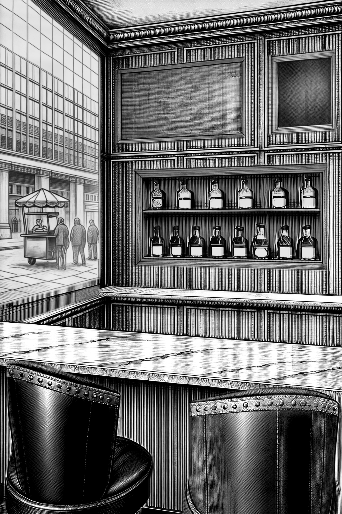

**The thinking.** Rendered in context - the plate as it stands behind this part, with only this part's own silhouette blocked in as values - so the pen, light and perspective are inherited; only the mask is laid back. Part note: the row of EIGHT real liquor bottles standing on the lower shelf of the inlaid recess, well in front of its boarded back: REAL BOTTLES OF DIFFERENT SHAPES AND SIZES, FEW AND BIG, NO TWO NEIGHBOURS ALIKE - among them a square-shouldered bourbon, a tall round-shouldered scotch, a broad squat rum, a SQUARE GIN FLASK with parallel sides and a sharp shoulder, a bulbous decanter-like rye, a tall slim vodka, a broad-shouldered whiskey and a wide-shouldered tequila - each with its own neck, its own shoulder and its own closure, a foil capsule under a dark screw cap or a taller cork stopper. Clear glass is pale with a bright highlight down its window side; the dark spirits are deep warm amber, glassy, and both read CLEARLY LIGHTER than the dark boards behind them. EVERY BOTTLE IS AT LEAST HALF FULL AND NO TWO TO THE SAME LEVEL: the liquid inside is DARKER than the empty glass above it and the two meet at a clean horizontal FILL LINE across the bottle. Each bottle STANDS ON THE BOARD, with a small dark pool of contact shadow at its foot and a soft shadow thrown up the boarding behind it, leaning away from the window at frame-left. Each bottle wears ONE paper label, and their shapes differ - rectangles, wrap-around bands, ovals, shields - lighter than the glass, with a crisp edge. THE LABELS ARE BLANK: no lettering, no words, no letters, no numerals, no pseudo-text of any kind - the brand names are typeset onto them in code afterwards, exactly as the window is gilded AND the row of SIX real liquor bottles standing on the upper shelf of the inlaid recess, well in front of its boarded back: REAL BOTTLES OF DIFFERENT SHAPES AND SIZES, FEW AND BIG, NO TWO NEIGHBOURS ALIKE - among them a square-shouldered bourbon, a tall round-shouldered scotch, a broad squat rum, a SQUARE GIN FLASK with parallel sides and a sharp shoulder, a bulbous decanter-like rye, a tall slim vodka, a broad-shouldered whiskey and a wide-shouldered tequila - each with its own neck, its own shoulder and its own closure, a foil capsule under a dark screw cap or a taller cork stopper. Clear glass is pale with a bright highlight down its window side; the dark spirits are deep warm amber, glassy, and both read CLEARLY LIGHTER than the dark boards behind them. EVERY BOTTLE IS AT LEAST HALF FULL AND NO TWO TO THE SAME LEVEL: the liquid inside is DARKER than the empty glass above it and the two meet at a clean horizontal FILL LINE across the bottle. Each bottle STANDS ON THE BOARD, with a small dark pool of contact shadow at its foot and a soft shadow thrown up the boarding behind it, leaning away from the window at frame-left. Each bottle wears ONE paper label, and their shapes differ - rectangles, wrap-around bands, ovals, shields - lighter than the glass, with a crisp edge. THE LABELS ARE BLANK: no lettering, no words, no letters, no numerals, no pseudo-text of any kind - the brand names are typeset onto them in code afterwards, exactly as the window is gilded

**Settings.** local/sensenova-u1.5, seed 21, full 40 steps cfg 4, rendered together with bottles-upper, negative: text, letters, words, lettering, signage, sign, numbers, typography, writing, inscription, shop name, banner, poster, bartender, terrier, dog, person, figure, woman, character, chair, stool, seat, barstool, chalkboard, blackboard, framed board, picture, frame, dog, retriever, person, figure, man, character, flamingo, bird, person, figure, man, character, lamp, sconce, light fixture, television, screen, monitor, flat screen

**Prompt.** [prompts/025-bottles-on-lower-shelf-and-bottles-on-upper-shelf-render-seed-21-laid-in-full-plate.prompt.txt](prompts/025-bottles-on-lower-shelf-and-bottles-on-upper-shelf-render-seed-21-laid-in-full-plate.prompt.txt)

*Logged 14:22.*

---

## 026. bottles-on-lower-shelf and bottles-on-upper-shelf render seed 7 laid in full plate

**The thinking.** Rendered in context - the plate as it stands behind this part, with only this part's own silhouette blocked in as values - so the pen, light and perspective are inherited; only the mask is laid back. Part note: the row of EIGHT real liquor bottles standing on the lower shelf of the inlaid recess, well in front of its boarded back: REAL BOTTLES OF DIFFERENT SHAPES AND SIZES, FEW AND BIG, NO TWO NEIGHBOURS ALIKE - among them a square-shouldered bourbon, a tall round-shouldered scotch, a broad squat rum, a SQUARE GIN FLASK with parallel sides and a sharp shoulder, a bulbous decanter-like rye, a tall slim vodka, a broad-shouldered whiskey and a wide-shouldered tequila - each with its own neck, its own shoulder and its own closure, a foil capsule under a dark screw cap or a taller cork stopper. Clear glass is pale with a bright highlight down its window side; the dark spirits are deep warm amber, glassy, and both read CLEARLY LIGHTER than the dark boards behind them. EVERY BOTTLE IS AT LEAST HALF FULL AND NO TWO TO THE SAME LEVEL: the liquid inside is DARKER than the empty glass above it and the two meet at a clean horizontal FILL LINE across the bottle. Each bottle STANDS ON THE BOARD, with a small dark pool of contact shadow at its foot and a soft shadow thrown up the boarding behind it, leaning away from the window at frame-left. Each bottle wears ONE paper label, and their shapes differ - rectangles, wrap-around bands, ovals, shields - lighter than the glass, with a crisp edge. THE LABELS ARE BLANK: no lettering, no words, no letters, no numerals, no pseudo-text of any kind - the brand names are typeset onto them in code afterwards, exactly as the window is gilded AND the row of SIX real liquor bottles standing on the upper shelf of the inlaid recess, well in front of its boarded back: REAL BOTTLES OF DIFFERENT SHAPES AND SIZES, FEW AND BIG, NO TWO NEIGHBOURS ALIKE - among them a square-shouldered bourbon, a tall round-shouldered scotch, a broad squat rum, a SQUARE GIN FLASK with parallel sides and a sharp shoulder, a bulbous decanter-like rye, a tall slim vodka, a broad-shouldered whiskey and a wide-shouldered tequila - each with its own neck, its own shoulder and its own closure, a foil capsule under a dark screw cap or a taller cork stopper. Clear glass is pale with a bright highlight down its window side; the dark spirits are deep warm amber, glassy, and both read CLEARLY LIGHTER than the dark boards behind them. EVERY BOTTLE IS AT LEAST HALF FULL AND NO TWO TO THE SAME LEVEL: the liquid inside is DARKER than the empty glass above it and the two meet at a clean horizontal FILL LINE across the bottle. Each bottle STANDS ON THE BOARD, with a small dark pool of contact shadow at its foot and a soft shadow thrown up the boarding behind it, leaning away from the window at frame-left. Each bottle wears ONE paper label, and their shapes differ - rectangles, wrap-around bands, ovals, shields - lighter than the glass, with a crisp edge. THE LABELS ARE BLANK: no lettering, no words, no letters, no numerals, no pseudo-text of any kind - the brand names are typeset onto them in code afterwards, exactly as the window is gilded

**Settings.** local/sensenova-u1.5, seed 7, full 40 steps cfg 4, rendered together with bottles-upper, negative: text, letters, words, lettering, signage, sign, numbers, typography, writing, inscription, shop name, banner, poster, bartender, terrier, dog, person, figure, woman, character, chair, stool, seat, barstool, chalkboard, blackboard, framed board, picture, frame, dog, retriever, person, figure, man, character, flamingo, bird, person, figure, man, character, lamp, sconce, light fixture, television, screen, monitor, flat screen

**Prompt.** [prompts/026-bottles-on-lower-shelf-and-bottles-on-upper-shelf-render-seed-7-laid-in-full-plate.prompt.txt](prompts/026-bottles-on-lower-shelf-and-bottles-on-upper-shelf-render-seed-7-laid-in-full-plate.prompt.txt)

*Logged 14:23.*

---

## 027. whole-plate assembled with bartenders-marble-ledge back-bar-carcass back-bar-lower-shelf bottles-on-lower-shelf bottles-on-upper-shelf back-bar-upper-shelf television-blank chalkboard-blank window-frame-and-reveal window-glass-street-view main-bar-marble-counter left-leather-club-chair right-leather-club-chair and window-sign

**The thinking.** Base plus every approved, enabled part laid in order through its own silhouette; the TV's blank screen and the window's lettering are drawn in code last, because lettering is never left to the model.

*Logged 14:24.*

---

## 028. whole-plate assembled with bartenders-marble-ledge back-bar-carcass back-bar-lower-shelf bottles-on-lower-shelf bottles-on-upper-shelf back-bar-upper-shelf television-blank chalkboard-blank window-frame-and-reveal window-glass-street-view main-bar-marble-counter left-leather-club-chair right-leather-club-chair and window-sign

**The thinking.** Base plus every approved, enabled part laid in order through its own silhouette; the TV's blank screen and the window's lettering are drawn in code last, because lettering is never left to the model.

*Logged 14:24.*

---

## 029. whole-plate assembled with bartenders-marble-ledge back-bar-carcass back-bar-lower-shelf bottles-on-lower-shelf bottles-on-upper-shelf back-bar-upper-shelf television-blank chalkboard-blank window-frame-and-reveal window-glass-street-view main-bar-marble-counter left-leather-club-chair right-leather-club-chair and window-sign

**The thinking.** Base plus every approved, enabled part laid in order through its own silhouette; the TV's blank screen and the window's lettering are drawn in code last, because lettering is never left to the model.

*Logged 14:24.*

---

## 030. whole-plate assembled with bartenders-marble-ledge back-bar-carcass back-bar-lower-shelf bottles-on-lower-shelf bottles-on-upper-shelf back-bar-upper-shelf television-blank chalkboard-blank window-frame-and-reveal window-glass-street-view main-bar-marble-counter left-leather-club-chair right-leather-club-chair and window-sign

**The thinking.** Base plus every approved, enabled part laid in order through its own silhouette; the TV's blank screen and the window's lettering are drawn in code last, because lettering is never left to the model.

*Logged 14:31.*

---

## 031. The inlaid back bar perfected: lining calmed, fourteen real bottles, fill lines, typeset labels

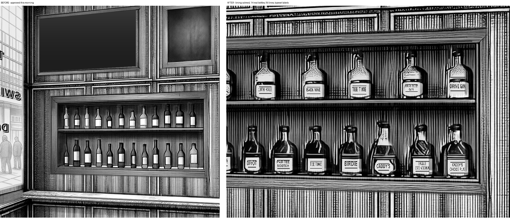

**The ask.** Founder: 'i love those shelves if you could clean up the wood grain around the shelf and improve the bottles drastically - real labels like real liquor bottles, different shapes and sizes, all at least half full.'

**The thinking.** The unit and both shelves were re-approved from a seed-21 render with the calmer lining and flat face frame. The bottles were rebuilt in code: eight real silhouettes (square bourbon, round-shouldered scotch, squat rum, gin flask, decanter rye, slim vodka, broad whiskey, tequila) at 1.75x width, 8 below and 6 above, each filled 55-78 percent of its body with the fill line coded as a 100-level step plus an ink meniscus - a 50-level step had rendered every bottle dark to the shoulder. A 2x detail render of the rows failed (flat block-ins turn into marble slabs), so the bottles were rendered whole-plate on the approved unit; seed 21 beat seed 7. The brand names are typeset in code (label-bottles.py) onto the paper the model actually painted - each label quad is snapped to the bright paper first - one big brand word per label, the full name where it fits, with the canon golf-pun brands.

**Settings.** local/sensenova-u1.5 via AuraVision, bottles-lower --with bottles-upper, seed 21; labels typeset in code at build

**Verdict.** Accepted into the plate; sent to the founder for approval.

*Logged 14:31.*

---

